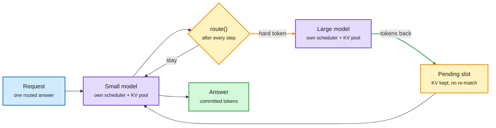

# TokenRouter: a serving system for token-level routing (2026-10-10)

**Sources:** HuggingFace Daily Papers 2026-10-09, #2 (103-111 upvotes): TokenRouter, Tsinghua/CMU ([arXiv 2610.12242](https://arxiv.org/abs/2610.12242), [code](https://github.com/thu-nics/TokenRouter), [raw](../../raw/huggingface/2026-10-09-tokenrouter-efficient-serving-system-for-token-level-llm-rou.md)); full HTML paper read; [@rohanpaul_ai](https://x.com/rohanpaul_ai/status/2108762444323848681) on the X feed (cross-source confirmed via social). No alphaxiv overview yet.

**TL;DR.** Token-level routing means a small and a large model share one answer, with a router deciding *per token* which model writes next (CITER, R2R, R-Stitch and Co-LLM are the algorithm family). The algorithms have promised big cost-quality gains for two years, but no engine could serve them: vLLM and SGLang assume each request moves in lockstep with one model. TokenRouter is the missing serving layer. Developers write three per-request functions (`route`, `send`, `receive`); the runtime runs one subserver per model, each with its own scheduler and private KV pool, exchanging requests asynchronously over local IPC. The key trick: when a request hops to the other model, it is parked as **pending** with its KV cache intact, so a switch costs about one token append instead of a prefix match and cache rebuild. A **delayed-batching** scheduler waits until B_i requests are queued for model i, with B chosen by a Markov-chain throughput model. Result: **2.01-64.15x** higher decode throughput than the stronger baseline across 15 algorithm-workload cells at concurrency 4; more typical numbers are 2.7-22x against the algorithms' official code and 1.99-3.21x for R2R across model pairs.

The request leaves; its cache stays parked

Each model keeps its own batch pace. A hop is a token append, not a cache rebuild.

Blue is the request, purple the two model subservers, amber the routing decision and the parked state, green the result.

## Why existing engines fail

- **Step desynchronization.** If all requests at a decoding step stay in sync, every step waits for the slowest model and the fast one idles.
- **Batch admission delay.** A routed token usually arrives while the target model is mid-batch, so it waits a step; batches fragment and GPUs bubble.
- **The bookkeeping tax.** In the standard-serving baseline (one SGLang server per model plus an external dispatcher), each returning token is a new request. Per step on the small model: radix-cache update 12.12 ms (32.6%), prefix matching 7.78 ms (20.9%), lock and release 11.6 ms, and the actual small-model inference only **1.56 ms (4.2%)**. Routing at token granularity was dying of cache bookkeeping, not compute.

## Key numbers

- **Ablation at concurrency 8** (R2R, Qwen3-0.6B/32B): base 132.8 tok/s, +CUDA graphs 230.8, +async execution 296.9, +delayed batching 372.5 (2.76x the official R2R code at 134.9).
- **Original-paper settings, concurrency 4:** R2R 244.6 vs 89.6 tok/s; CITER 149.3 vs 17.2; Co-LLM 76.0 vs 3.5. The 64x headline likely comes from very weak official baselines (Co-LLM's at 3.46 tok/s), so read 2-3x against a reasonable serving baseline as the honest number.
- **Scaling:** concurrency 1 to 16 lifts throughput 8.6x (R2R official 5.1x). At 8,192 max output tokens, standard serving loses 58-85% of its throughput; TokenRouter holds steady. Cross-node over RoCE at 3.7 GB/s is close to single-node.
- **Setup:** 8x A100-80G, SGLang 0.5.1, small model on 1 GPU and large on 2 (TP=2) sharing GPUs via MPS; AIME2024 and SWE-Smith agent trajectories.

## How it relates to the wiki

- **The serving-side fix for the cache-loss toll.** Arena's Jev Router benchmark ([10-08](2026-10-08-routing-graded-jev-router-local-routing.md)) found routing across vendors lost to a single cheap model partly because a switch drops the prefix cache. Dynamo's session IDs ([10-09](../inference-efficiency/2026-10-09-session-aware-agentic-inference-dynamo.md)) keep a waiting agent's cache resident. TokenRouter applies the same principle at the finest grain: never throw away a request's KV when it changes model. Three serving papers in three days converge on *keep the state, move the decision*.
- **Extends the intra-model routing line.** [VIA-SD (06-12)](2026-06-12-via-sd-intra-model-routing-speculative-decoding.md) and [SMRC-SD (08-10)](2026-08-10-smrc-sd-state-matched-routing.md) treated speculative decoding as routing between draft and target. Token-level routing is the general case where the small model's tokens are *kept*, not just verified; TokenRouter makes it servable.
- **Tension with the AUROC finding** ([System Switch, 10-09](2026-10-09-system-switch-decision-deferral.md)): TokenRouter is agnostic to router quality. Its throughput gain is real only if the router's per-token deferral signal is well ranked; the paper measures speed, not whether quality is preserved at a given hop rate.

## Gaps

- Throughput only; no end-to-end quality-at-cost curve per routing algorithm.
- A100 only, two-model pairs with one three-model ensemble; no MoE or heterogeneous-hardware pairs.
- The throughput model assumes geometric gaps between hops and stationary routing probabilities.

## Research angle

Token-level routing now has an engine, so the open question flips back to algorithms: which per-token signal (entropy, a trained deferral head, a decision model) gives the best quality per hop? A second question is placement. Small and large models on the same GPUs via MPS is one choice; putting the small model on a cheaper accelerator with the large model's KV parked remotely is the disaggregated version nobody has measured.

## Related

[LLM routing](llm-routing.md) · [KV cache](../inference-efficiency/kv-cache.md) · [Speculative decoding](../inference-efficiency/speculative-decoding.md)
