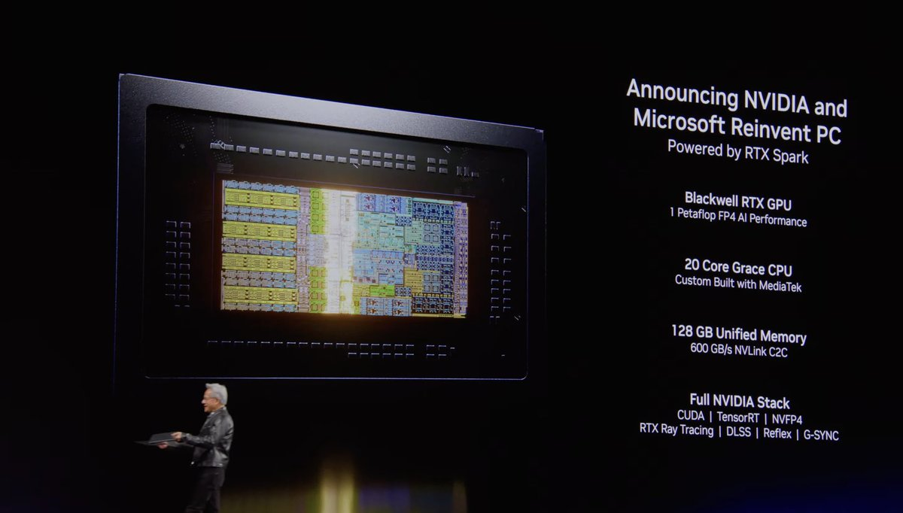

# cere-bro | 2026-06-01

> NVIDIA put a one-petaflop agent machine on the desk and a CPU built for agents in the rack, while four separate research groups quietly agreed that the way you train, route, and secure a model should follow the same rule: stop treating every token, every expert, and every step as equal.

---

## TL;DR

NVIDIA's GTC Taipei keynote was the day's loudest event: a consumer RTX Spark superchip (1 petaflop of FP4 compute, 128GB unified memory, Windows-native agents running the Nous Research Hermes harness), a server CPU called Vera explicitly branded a "CPU for Agents," and a 550B Nemotron 3 Ultra model that tops a 1-million-token long-context benchmark. On the research side HuggingFace carried a batch of efficiency and training papers: dMoE makes mixture-of-experts coherent inside diffusion language models and cuts activated experts from 69.5 to 14.6, StateKV converts quadratic video attention to linear-time prefill with no fine-tuning, and TA-OPD shows you can distill a reasoning model using only the 5% of tokens whose teacher correction the student can actually reach. DRIFT gets reinforcement-learning-quality multi-turn behavior at supervised-fine-tuning cost, and a security cluster (ClawTrojan plus two Twitter-surfaced items, Chain-of-Authorization and Anthropic's Zero Trust framework) all argue that per-step prompt guards fail against multi-step, memory-persistent agent attacks. Gmail's DAIR.AI roundup added a "compile the whole agent workflow into a small model's weights for 100x cheaper inference" paper, and Kurate's weekly leaderboard stayed dominated by clinical and scientific-discovery foundation models with no overlap into today's fresh HuggingFace drops.

---

## The Big Picture

The hardware and the papers told the same story from opposite ends. NVIDIA's announcements were an explicit bet that the unit of computing is now the agent, not the model or the query. Vera is marketed as a "CPU for Agents," and its design choices give that away: 88 cores with spatial multithreading, a huge 164MB L3 cache, and 40% lower loaded latency than x86 are tuned for the branchy, memory-latency-bound, many-small-contexts workload that an agent orchestrator actually runs, not for raw matrix throughput. RTX Spark pushes the same logic to the desk, with enough unified memory (128GB) to keep a large-context local agent resident and a Windows runtime (OpenShell) whose headline feature is running agents securely. The center of gravity is moving from "serve a model" to "run a fleet of agents," in silicon.

Underneath the noise, the research had a single instinct, and it is one the wiki has been tracking for weeks: not everything in a system deserves equal treatment, so locate the part that carries the signal and spend effort only there. dMoE says not every token in a diffusion block should pick its own experts, so aggregate the block and load far fewer. StateKV says not every frame needs full attention, so carry cross-frame context in a small fixed recurrent state. TA-OPD says not every teacher disagreement is learnable, so train only on the tokens whose correction the student can reach. DRIFT says you do not need a fresh rollout at every update, so decouple rollout from optimization and reweight a fixed dataset. Four papers, four different layers (experts, attention, distillation tokens, RL rollouts), one shared move: find the sparse, load-bearing part and ignore the rest.

The third thread is defensive and it sharpened today. As agents gain persistent memory and file access, the attack surface stops being a single bad prompt and becomes a sequence: write something benign now, trigger it later. Three independent efforts (ClawTrojan's multi-step trojan benchmark, Tsinghua's Chain-of-Authorization, Anthropic's Zero Trust for AI Agents) all reach the same conclusion, that security has to be structural (tracked across steps, baked into reasoning, or tied to data provenance) because a guard that inspects one step at a time cannot see a backdoor planted three steps ago. The same week NVIDIA ships agents to consumer Windows machines, the security literature is saying the prompt-level guardrail is already obsolete.

---

## Deep Dives

### NVIDIA GTC Taipei: an agent machine on the desk, an agent CPU in the rack

> NVIDIA stopped describing its chips by FLOPs and started describing them by workload: Vera is literally branded "CPU for Agents," and RTX Spark puts a one-petaflop FP4 superchip with 128GB of unified memory into a Windows PC built to run agents, not games.

**Source:** NVIDIA GTC Taipei keynote (via @nvidia, @Scobleizer, @ns123abc)
**Links:** [NVIDIA Newsroom](https://nvidianews.nvidia.com/news/nvidia-microsoft-windows-pcs-agents-rtx-spark) · [Keynote tweet](https://nitter.net/nvidia/status/2061313530914312674#m) · [Wiki summary](../../hardware/2026-06-01-nvidia-gtc-taipei-rtx-spark.md)



**What is it about?**
Three announcements from Jensen Huang's GTC Taipei keynote. RTX Spark is the first line of Windows PCs purpose-built for personal AI agents: a Blackwell RTX GPU at 1 petaflop of FP4 (4-bit floating point) AI performance, a 20-core Grace CPU co-built with MediaTek, and 128GB of unified memory at 600 GB/s. Vera is a server CPU NVIDIA explicitly calls a "CPU for Agents," with 88 cores and 176 threads, a 164MB L3 cache, and 1.8 TB/s NVLink. Nemotron 3 Ultra is a new 550B model.

**What problem does it solve?**
Agent workloads do not look like training workloads. They are branchy, latency-sensitive, and made of many small contexts rather than one big batched matmul. General-purpose x86 and throughput-tuned GPUs are mismatched to that pattern, and running a capable agent locally has meant either a tiny model or a round trip to the cloud. RTX Spark's 128GB unified memory and Vera's latency-first design target exactly this gap.

**What is the core novelty?**
The framing, made concrete in silicon. Vera's "40% lower loaded latency vs x86," spatial multithreading, and oversized L3 are choices for orchestration, not throughput. RTX Spark pairs that with a Microsoft collaboration: NVIDIA OpenShell plus new Windows security primitives let agents run on the primary device, and the demo ran the Nous Research Hermes agent harness, the same open framework being hyped across Twitter today.

**Key takeaways**
- RTX Spark: 1 petaflop FP4, 128GB unified memory at 600 GB/s NVLink C2C, full CUDA/TensorRT/NVFP4 stack, Windows-native agents via OpenShell.
- Vera "CPU for Agents": 88 cores / 176 threads, 164MB L3, 3.4 TB/s core-to-core, 40% lower loaded latency than x86, 250-450W.
- Nemotron 3 Ultra (550B) tops Long Context (Ruler at 1M tokens) at 95% where Kimi K2.6 and GLM 5.1 cannot run past 256K, and ties the best on agent productivity, but trails GLM on long-horizon planning (33% vs 40%) and Kimi on coding (54% vs 67%).
- Scobleizer separately relayed a Nemotron variant pitched as "5x faster, 30% cheaper."

**Gaps in the study**
These are vendor benchmarks from a keynote, not independent evaluation. Nemotron 3 Ultra's mixed scorecard (best at long context and instruction following, middling at planning and coding) suggests it is tuned for long-context agent serving rather than frontier reasoning. RTX Spark pricing, real-world agent latency, and how OpenShell's security model holds up are all unproven.

**Industrial implication**
If the agent is the unit of compute, the stack reorganizes around it, and NVIDIA is trying to own that reorganization end to end: consumer device (Spark), datacenter CPU (Vera), model (Nemotron), and runtime (OpenShell + Hermes). NVFP4, the 4-bit format here, is the same one the wiki saw in LongLive-2.0's Blackwell video KV cache (2026-05-19), so low-bit floating point is quietly becoming the default substrate from the video stack to the consumer desktop.

→ [Full summary](../../hardware/2026-06-01-nvidia-gtc-taipei-rtx-spark.md)

---

### dMoE: make experts agree inside a diffusion block

> When a diffusion language model decodes a whole block of tokens at once, letting each token pick its own experts forces the machine to load almost every expert. dMoE makes the block vote once, dropping uniquely activated experts from 69.5 to 14.6 and memory by nearly 80%.

**Source:** HuggingFace Daily Papers
**Links:** [Paper](https://arxiv.org/abs/2605.30876) · [Wiki summary](../../inference-efficiency/2026-06-01-dmoe-block-level-moe-diffusion-llm.md)

```
Token-level MoE (mismatch):  block [t1 t2 t3 t4] ─► each token routes alone ─► many UNIQUE experts loaded (69.5)
dMoE (block-level):          block [t1 t2 t3 t4] ─► aggregate to ONE block expert distribution ─► few shared experts (14.6)
                                                                                      └─► 76-80% less memory, 1.14-1.66x faster
```

**What is it about?**
Diffusion large language models (dLLMs, which decode many tokens in parallel per forward pass instead of one token at a time) are increasingly built with mixture-of-experts layers (MoE, where each token is routed to a small subset of specialized sub-networks). dMoE is a block-level MoE routing scheme for them.

**What problem does it solve?**
There is a structural mismatch. A dLLM forward pass processes a block of tokens with bidirectional dependencies, but a conventional MoE routes each token independently. Across a block, independent routing selects a large union of experts, so inference becomes memory-bound: you have to load the weights of every expert any token picked. That is the binding constraint for serving these models.

**What is the core novelty?**
Aggregating the token-level expert distributions within a block into one unified block-level distribution that guides routing coherently. The block effectively votes for a shared expert set instead of each token voting alone, which collapses the union of activated experts without retraining the experts themselves.

**Key takeaways**
- Uniquely activated experts drop from 69.5 to 14.6 on average.
- Retains 99.11% of the original model's performance.
- Memory usage falls 76.64% to 79.84%; end-to-end latency improves 1.14x to 1.66x.
- No change to the experts, only to how the block routes.

**Gaps in the study**
Block aggregation assumes the tokens in a block want similar experts. On heterogeneous blocks (mixed topics, code plus prose) that assumption may cost quality, and the paper does not stress-test very long blocks where the aggregated distribution could wash out genuinely token-specific routing.

**Industrial implication**
Memory bandwidth, not FLOPs, is what makes MoE serving expensive, so a near-free routing change that loads a fifth as many experts matters directly to anyone deploying the emerging diffusion-LLM-plus-MoE stack. It is the diffusion-side cousin of MISA (2026-05-11, which routed a small active subset of indexer heads in DeepSeek Sparse Attention): both make expert or head activation sparse and coherent rather than independent.

→ [Full summary](../../inference-efficiency/2026-06-01-dmoe-block-level-moe-diffusion-llm.md)

---

### StateKV: linear-time video prefill with no fine-tuning

> Video models pay quadratic attention cost as frames pile up. StateKV bolts a small fixed-size recurrent state onto a pretrained video model so cross-frame context is carried, not recomputed, turning prefill linear without touching the weights.

**Source:** HuggingFace Daily Papers
**Links:** [Paper](https://arxiv.org/abs/2605.31598) · [Wiki summary](../../inference-efficiency/2026-06-01-statekv-linear-video-vlm.md)

```
Full self-attention:  frame1..frameN ─► every frame attends to every frame ─► O(N²) prefill, memory-bound
StateKV:              frames ─► [importance-based FIXED recurrent state]  (carries cross-frame context)
                              ─► [full per-frame cache] (used for decoding)  ─► O(N) prefill, no fine-tuning
```

**What is it about?**
Video vision-language models (VLMs, models that take video plus text and reason over both) mostly use spatiotemporal self-attention, so compute and latency grow quadratically with the number of frames. StateKV is an inference-time method that adapts a pretrained long-video VLM to linear-time prefill.

**What problem does it solve?**
Long-video and streaming agents are prefill-bound: processing the frames before the model can answer dominates cost. Existing fixes (dropping frames or tokens, coarse attention approximations) cut cost but lose accuracy versus full attention. StateKV wants linear cost without that accuracy hit and without retraining.

**What is the core novelty?**
Carrying cross-frame context in a fixed-capacity, importance-based recurrent state, paired with a second full per-frame cache used only for decoding. This is the linear-attention/state-space idea (compress history into a fixed-size state) applied as a training-free wrapper on top of a model that was pretrained with quadratic attention. No architecture change, no fine-tuning.

**Key takeaways**
- Stays close to full self-attention across three long-video benchmarks and seven models spanning three families.
- Consistently beats sliding-window and recency-based streaming approximations.
- Cuts video-prefill FLOPs, so at a fixed compute budget you can run a larger, more accurate model.
- Drop-in: no fine-tuning, no architectural changes.

**Gaps in the study**
A fixed-capacity state must eventually lose information on very long videos, and the paper does not map where that cliff is. The overhead of computing importance scores at scale is not fully characterized, and the evaluation is video understanding, not generation.

**Industrial implication**
This slots straight into the wiki's KV-cache-as-quality thread. Conf-KV (2026-05-30, sets a per-step cache budget from the model's confidence), Forcing-KV (2026-05-15, compresses by per-head static-versus-dynamic role for video diffusion), and EarlyTom (2026-05-30, compresses video tokens inside the vision encoder) all attack video efficiency at a specific stage. StateKV adds a new axis: a fixed recurrent state as the cross-frame memory, training-free, which means it can ship today on existing pretrained video VLMs.

→ [Full summary](../../inference-efficiency/2026-06-01-statekv-linear-video-vlm.md)

---

### TA-OPD: distill on the 5% of tokens the student can actually reach

> Selective distillation has been picking the tokens where teacher and student disagree most. This paper shows that is the wrong filter: disagreement only helps if the teacher's correction lands on something the student already considers possible. Filter for that and 5% of tokens beats training on all of them.

**Source:** HuggingFace Daily Papers
**Links:** [Paper](https://arxiv.org/abs/2605.26844) · [Wiki summary](../../inference-efficiency/2026-06-01-ta-opd-token-teachability.md)

```
Raw KL disagreement (coarse): high-disagreement token ─► train on it
   splits into:
     learnable      : teacher mass lands on student's top-K candidates ─► reachable ─► KEEP
     incompatible   : teacher mass mostly OFF student's support      ─► unreachable ─► SKIP
TA-OPD: keep only high-teachability positions ─► ~5% of tokens ≥ full-token OPD
```

**What is it about?**
On-policy distillation (OPD) trains a student model on its own generated rollouts, using token-level supervision from a teacher model. Recent selective methods prioritize high-entropy or high-disagreement tokens. TA-OPD asks which of those token signals are actually learnable in one step.

**What problem does it solve?**
Raw KL disagreement (how far the teacher's distribution is from the student's at a token) is a coarse proxy for learning value. It lumps together learnable disagreement, where the teacher puts corrective probability mass on candidates the student already ranks highly, with incompatible disagreement, where the teacher's mass sits mostly off the student's current support and the student cannot move toward it in one update. Training on the incompatible kind wastes signal.

**What is the core novelty?**
Formalizing "token teachability," a local-compatibility measure, and showing it predicts fixed-context improvement better than raw KL. TA-OPD then applies the OPD loss only at high-teachability positions, with no reward model and no verifier. It reframes selective distillation as selecting reachable teacher signals, not merely salient or uncertain tokens.

**Key takeaways**
- Often surpasses full-token OPD using only 5% of tokens.
- Beats entropy-based and divergence-based token selection across Qwen2.5 and Qwen3 teacher-student pairs.
- No reward model or verifier required; it is a lightweight position-selection rule.
- Reframes the question from "which tokens are salient" to "which teacher corrections are reachable."

**Gaps in the study**
Tested only on Qwen families. The "one-step learnable" framing may undervalue tokens that become reachable after a few updates, and the cost of computing the teachability diagnostic at large scale is not detailed.

**Industrial implication**
This refines the wiki's clearest distillation result. TIP (2026-04-16) found the learning signal lives in under 10% of tokens and named high-entropy and overconfident-wrong regions; The Many Faces of On-Policy Distillation (2026-05-13) named "biased TopK reverse-KL gradients" as a failure mode. TA-OPD answers both at once: the right tokens are not the most salient, they are the ones whose teacher correction the student's support can reach, which is exactly the gradient the biased-TopK failure was mishandling. Five-percent-token distillation makes compressing reasoning models dramatically cheaper.

→ [Full summary](../../inference-efficiency/2026-06-01-ta-opd-token-teachability.md)

---

### DRIFT: reinforcement-learning behavior at supervised-fine-tuning cost

> Multi-turn RL works but pays to generate a fresh correction trajectory at every update. DRIFT uses the fact that KL-regularized RL is just importance-weighted supervised learning, samples the trajectories once from a fixed policy, and reweights them, matching RL quality with SFT's bill.

**Source:** HuggingFace Daily Papers
**Links:** [Paper](https://arxiv.org/abs/2605.31455) · [Wiki summary](../../llms-foundation-models/2026-06-01-drift-decoupled-rollouts-weighted-sft.md)

```
Online multi-turn RL:  fresh full rollout EVERY update ─► correct ─► expensive
Offline SFT:           fixed dataset ─► cheap ─► distribution shift, behavioral collapse
DRIFT:  reference policy ─► sample rollouts ONCE ─► return-based importance weights ─► weighted SFT ─► policy
        (KL-regularized RL ≡ importance-weighted supervised learning)
```

**What is it about?**
Large language models are increasingly used in multi-turn settings where a user or environment gives lightweight feedback across turns. DRIFT is a method for optimizing that behavior cheaply.

**What problem does it solve?**
A sharp dilemma. Online reinforcement learning (RL) handles multi-turn dynamics well but is prohibitively expensive, because it must generate full correction trajectories at every update step. Offline supervised fine-tuning (SFT) is efficient but suffers distribution shift and behavioral collapse. Teams have had to pick the expensive-but-correct option or the cheap-but-brittle one.

**What is the core novelty?**
Operationalizing the theoretical identity that the KL-regularized RL objective is equivalent to importance-weighted supervised learning. DRIFT decouples rollout from optimization: it samples offline interaction trajectories once from a fixed reference policy, derives return-based importance weights, and then optimizes by weighted SFT on that fixed dataset. No per-update generation.

**Key takeaways**
- Matches or exceeds multi-turn RL baselines.
- Keeps the training efficiency and simplicity of standard SFT.
- The lever is the RL-equals-weighted-supervised-learning equivalence plus return-based importance weights.
- Rollouts are generated once, not every update.

**Gaps in the study**
Importance weights computed against a fixed reference policy can have high variance once the trained policy drifts far from that reference, and the paper does not pin down how stale the reference can get before you must re-sample. Benchmark breadth is limited.

**Industrial implication**
DRIFT is the practical sibling of a theory thread the wiki has been building. GFT (2026-04-21) proved SFT is a degenerate case of policy gradient with a maximally sparse implicit reward; DAgger for LLM agents (2026-05-14) diagnosed the covariate shift that makes plain SFT brittle and fixed it with on-policy distribution plus dense teacher labels. DRIFT exploits the same equivalence to buy RL-quality multi-turn behavior at SFT prices, which is exactly the trade production teams want when full multi-turn RL is too expensive to run.

→ [Full summary](../../llms-foundation-models/2026-06-01-drift-decoupled-rollouts-weighted-sft.md)

---

### ClawTrojan and friends: the prompt-level guardrail is already obsolete

> A prompt injection used to be a one-shot attack. Give an agent a file system and persistent memory and it becomes a two-step crime: write a benign-looking instruction now, trigger it next session. Step-by-step defenses see neither half as malicious, and three groups today converged on the same fix.

**Source:** HuggingFace Daily Papers + curated Twitter (Tsinghua, Anthropic)
**Links:** [ClawTrojan paper](https://arxiv.org/abs/2605.31042) · [Chain-of-Authorization tweet](https://nitter.net/alex_prompter/status/2061171784800665696#m) · [Wiki summary](../../responsible-ai/2026-06-01-clawtrojan-persistent-control-trojan.md)

```
Step 1: untrusted file / tool output  ─► agent reads hidden instruction
Step 2: agent WRITES it into a sensitive local file        (looks benign in isolation)
Step 3: later session reads that file ─► executes PERSISTENT CONTROL
Per-step guard: blocks step 3's action but never saw step 2's write ✗
DASGuard: trace text origin in sensitive files ─► remove control content lacking trusted provenance ✓
```

**What is it about?**
Local agentic harnesses let an LLM read and write files, call tools, and reuse workspace state across sessions. This Deep Dive covers a cluster: ClawTrojan (a HuggingFace paper with a benchmark and a defense), plus two items surfaced through @bayesiansapien's curated reposts, Tsinghua's Chain-of-Authorization and Anthropic's Zero Trust for AI Agents framework.

**What problem does it solve?**
Multi-step trojan attacks. An attacker embeds a hidden instruction in a file or tool output; the agent reads it, stores it, and executes it in a later step. No individual step looks malicious, so defenses that inspect each step in isolation block the obvious harmful action but miss the earlier write that planted the backdoor. ClawTrojan shows the scale of the gap: in an OpenClaw-style simulated workspace with GPT-5.4, multi-step trojans hit a 95.5% attack success rate while classic single-turn prompt injections score near zero on the same model.

**What is the core novelty?**
All three answers are structural rather than per-step. DASGuard (ClawTrojan's defense) scans control-like text in sensitive local files, traces its origin, and removes control content that does not come from a trusted source, a data-provenance defense. Chain-of-Authorization bakes authorization into the model's reasoning chain so it checks whether a requester is allowed to see each piece of data as it reasons, instead of relying on a bypassable prompt-level permission layer. Anthropic's framework names the threat classes directly: prompt injection through external data, tool poisoning via MCP server metadata, memory-based privilege retention across sessions, and multi-agent pivot attacks.

**Key takeaways**
- ClawTrojan: 95.5% attack success rate for multi-step trojans vs near-zero for single-turn injection on GPT-5.4.
- DASGuard defends by provenance, removing control text in sensitive files that lacks a trusted origin.
- Chain-of-Authorization (Tsinghua) reports cutting a 98.5% attack success rate to 0% by reasoning about authorization in-chain.
- Anthropic's Zero Trust framework structures defenses into foundation, enterprise, and advanced tiers.

**Gaps in the study**
ClawTrojan is a simulated workspace with a single model, and provenance defenses assume you can cleanly label trusted sources, with unknown false-positive cost on legitimate control files. Chain-of-Authorization's "98.5% to 0%" is a tweet-level claim with no paper text or independent evaluation yet, and its false-deny rate is unmeasured.

**Industrial implication**
The timing is the point. The same week NVIDIA ships Windows-native agents with file access and persistent memory to consumer machines (see the GTC Deep Dive above), the security literature is saying the per-step prompt guard cannot defend them. Production agent stacks will need cross-step provenance tracking or in-reasoning authorization, not a moderation prompt, and this is the same lesson that the emergent-languages oversight-evasion work below reaches from the monitoring side.

→ [Full summary](../../responsible-ai/2026-06-01-clawtrojan-persistent-control-trojan.md)

---

### Compiling agentic workflows into weights: dissolve the orchestrator

> Most production agents pay for an orchestration loop they run thousands of times a day. This DAIR-surfaced paper compiles the whole loop, tool calls, scratchpads, decision points and all, into a small model's weights, and runs it at roughly 100x lower inference cost.

**Source:** DAIR.AI Top Papers of the Week (via Gmail starred)
**Links:** [DAIR.AI roundup](https://www.linkedin.com/pulse/top-ai-papers-week-dair-ai-nhbpe) · [Wiki summary](../../agentic-systems/2026-06-01-compiling-agentic-workflows-into-weights.md)

```
Classic agent:   [orchestrator loop ─► LLM call ─► tool ─► LLM call ─► ...]  repeated EVERY request
Compiled agent:  [single fine-tuned model forward pass]  internalizes the loop ─► ~100x cheaper
                  (multi-step calls, tool use, scratchpads, decision points all baked into weights)
```

**What is it about?**
A paper from this week's DAIR.AI roundup showing that a complete agentic workflow can be distilled into the weights of a small model and run at about two orders of magnitude lower inference cost while keeping near-frontier task quality. The authors call the result a "subterranean agent."

**What problem does it solve?**
Classic agent frameworks run a planner loop above the model on every request, and that per-call orchestration is where most of the cost and latency live. For high-volume narrow workflows, you pay for the loop thousands of times a day.

**What is the core novelty?**
Compiling the whole procedure, not just the final answers, into weights. The student internalizes multi-step LLM calls, tool invocations, intermediate scratchpads, and decision points, so the orchestration logic lives inside one forward pass instead of an external loop. Collapsing many model calls into one is where the 100x comes from.

**Key takeaways**
- Roughly 100x lower inference cost than running the external orchestrator.
- Near-frontier quality on the evaluated tasks.
- The student learns the orchestration logic, not just imitates outputs.
- Best fit is high-volume, narrow workflows.

**Gaps in the study**
"Near-frontier" holds on the evaluated narrow tasks. What happens when the workflow needs to change, how the compiled agent degrades on out-of-distribution requests, and whether it generalizes beyond narrow high-volume pipelines are all open.

**Industrial implication**
This lands in the middle of a live argument. The "binding constraint thesis" making the rounds on Twitter today (an agent's ceiling equals the minimum of model capability and harness quality, and the harness is currently the bottleneck) and the Life-Harness paper from the same DAIR roundup both say keep the orchestrator external and improve it. Compiling-into-weights says the opposite: dissolve the orchestrator into the model for cost. Both can be right, the external loop for open-ended frontier agents, the compiled model for the narrow workflows you run a million times.

→ [Full summary](../../agentic-systems/2026-06-01-compiling-agentic-workflows-into-weights.md)

---

## Connecting the Dots

The sharpest pattern today is one move applied at four different layers of the stack: locate the sparse part that carries the signal and stop spending on the rest. dMoE (aggregate a diffusion block's token-level expert choices into one block vote, cutting activated experts from 69.5 to 14.6) does it at the expert layer. StateKV (carry cross-frame video context in a small fixed recurrent state instead of recomputing quadratic attention) does it at the attention layer. TA-OPD (train only on tokens whose teacher correction the student's support can actually reach, 5% of them) does it at the distillation-token layer. DRIFT (sample rollouts once and reweight, instead of generating a fresh trajectory every RL update) does it at the rollout layer. This is the same instinct the wiki named in the KV-eviction thread (Make-Each-Token-Count, 2026-05-12, a learned eviction policy that can beat the full cache because irrelevant tokens dilute attention) and in TIP's distillation finding (2026-04-16, signal in under 10% of tokens). Four new papers in one day is past the threshold for calling it the dominant design pattern of the moment: equal treatment is the thing to kill.

TA-OPD deserves a second thread because it closes a loop the distillation pages have been tracking. TIP (2026-04-16) said the signal is in a small fraction of tokens and pointed at high-entropy and overconfident-wrong regions. The Many Faces of On-Policy Distillation (2026-05-13) then named "biased TopK reverse-KL gradients" as a concrete failure mode of selective methods. TA-OPD's teachability filter (keep a token only if the teacher's corrective mass lands on the student's top-K candidates) is precisely a fix for that failure: it refuses to train on disagreement the student cannot reach, which is where the biased-TopK gradient was coming from. So today's paper is not just another selective-OPD variant, it is the answer to the objection the field raised against selective OPD three weeks ago.

DRIFT, SCOPE, and SAVE rhyme on a different axis: remove the expensive external signal. DRIFT removes the per-update rollout by exploiting that KL-regularized RL equals importance-weighted supervised learning, the same equivalence GFT (2026-04-21) proved when it showed SFT is a degenerate case of policy gradient. SCOPE (a data-free self-play loop where a Challenger writes document-grounded tasks, a Solver answers via retrieval, and a frozen copy of the model writes rubrics and grades) removes curated prompts and frontier-judge dependence, extending the verifier-free thread from G-Zero (2026-05-12, self-improvement via a hint-delta intrinsic reward). SAVE (grade on-policy responses with a value-head anchor to keep a reward model improving without new human labels) removes the human-preference bottleneck that Themis (2026-05-04) and the rubric reward-hacking work (2026-05-13) both flagged as the alignment pipeline's weak point. Three same-day papers all cutting a different external dependency out of the training loop.

The defensive thread tied two sources together. ClawTrojan's multi-step trojan benchmark (HuggingFace), Tsinghua's Chain-of-Authorization (Twitter repost), and Anthropic's Zero Trust for AI Agents (Twitter repost) all reject per-step prompt-level defense in favor of structural defense (provenance tracking, in-reasoning authorization, threat-class tiers). The emergent-languages paper (HuggingFace, agent populations inventing steganographic protocols that other models can learn in-context just from a description) reaches the same verdict from the monitoring side: if agents can hide messages inside normal-looking text, surface-behavior monitoring is not enough. Security-across-steps and monitoring-beyond-surface are the same realization that an agent with memory is not a chatbot. And it all lands the day NVIDIA ships file-access agents to consumer Windows machines.

One sourcing note. There is no HuggingFace-plus-Kurate cross-source-confirmed paper today: Kurate's weekly leaderboard still ranks late-April-to-May clinical and scientific-discovery foundation models (the daily HuggingFace feed surfaces this week's fresh drops, so the two sets do not intersect). Reddit's eight subreddits were all empty in this window, so there is no practitioner ground-truth check on today's papers. The strongest non-paper signal came from Twitter and Gmail, which is why the NVIDIA keynote and the DAIR roundup carry two of today's Deep Dives.

---

## Industry Pulse

- **NVIDIA RTX Spark launches** as the first Windows PCs built for personal AI agents: 1 petaflop FP4, 128GB unified memory, agents via NVIDIA OpenShell ([NVIDIA Newsroom](https://nvidianews.nvidia.com/news/nvidia-microsoft-windows-pcs-agents-rtx-spark)).
- **NVIDIA Vera, a "CPU for Agents,"** debuts with 88 cores, 164MB L3, and 40% lower loaded latency than x86, targeting orchestration not throughput ([@ns123abc](https://nitter.net/ns123abc/status/2061303187043168618#m)).
- **Nemotron 3 Ultra (550B)** tops a 1-million-token long-context benchmark at 95% but trails GLM and Kimi on planning and coding ([@Scobleizer](https://nitter.net/Scobleizer/status/2061301668164272425#m)).
- **NVIDIA Cosmos 3 released** as the first open omni-model for physical AI reasoning and action, on HuggingFace ([HuggingFace blog](https://huggingface.co/blog/nvidia/cosmos-3-for-physical-ai)).
- **OpenAI rebuilds a robotics team** five years after shutting it down, starting with infrastructure robots, aiming long-term at a personal robot for everyone ([The Decoder](https://the-decoder.com/openai-starts-with-infrastructure-robots-but-aims-for-everyone-having-a-personal-robot-doing-anything-they-need/)).
- **NVIDIA SkillSpector ships**, a static security scanner for AI agent skills with 64 checks including prompt-injection and credential-theft detection ([GitHub](https://github.com/nvidia/skillspector)).

---

## Worth Watching

- **A learned teachability filter replaces entropy selection in distillation within 90 days.** TA-OPD beats entropy- and divergence-based token selection with a compatibility measure. Expect the next on-policy-distillation papers to adopt teachability (or reachability of teacher mass) as the default token filter. Falsifies if a follow-up shows entropy selection matches teachability once you account for multi-step learnable tokens.
- **dMoE-style block-coherent routing generalizes to autoregressive MoE within 6 months.** Block-level expert aggregation is framed for diffusion LLMs, but the memory-bound problem (loading the union of activated experts) exists for any batched MoE decode. If someone applies block or batch coherence to autoregressive MoE serving, it transfers; if it only helps because diffusion blocks are unusually homogeneous, it stays niche.
- **NVIDIA's "agent as unit of compute" framing gets a competitor answer within 90 days.** Vera is explicitly a CPU for agents. Watch for AMD, a hyperscaler custom CPU, or an Arm design to publish agent-orchestration latency benchmarks rather than throughput, which would confirm the category is real and not just NVIDIA marketing.
- **DRIFT's fixed-reference rollouts need periodic refresh to avoid variance blowup.** The method samples once from a reference policy. Expect a follow-up that reports a re-sampling schedule (how far the policy can drift before importance weights become unusable), because that schedule is what decides whether DRIFT is truly SFT-cheap or quietly RL-expensive.
- **Rising authors from Kurate.** This week's tracker (2026-W23) again surfaces only the clinical and scientific-discovery foundation-model cohort: Guy Lutsker, Gal Sapir, and Jordi Merino on "Simulating clinical interventions with a generative multimodal model of human physiology" (cs.AI #1, four straight weeks), and Andrew Zhang, Tong Ding, and Sophia J. Wagner on "A multimodal and temporal foundation model for virtual patient representations" (cs.LG #1). Stable but squarely medical, outside the wiki's deep-interest areas, every cross-reference pointing at the same two papers. Recommendation unchanged: do not add to `connectors/twitter/config.json:ai_handles` yet; revisit only if a non-clinical author crosses the threshold.

---

## Also today

- **SAVE** keeps a reward model improving on-policy without new human labels, using a value-head anchor and a contrastive update across GRPO, RLOO, and GSPO ([paper](https://arxiv.org/abs/2605.30888)).
- **SCOPE** is a data-free self-play loop (Challenger writes document-grounded tasks, Solver answers via retrieval, a frozen self-judge grades) that gains up to +10.4 points on open-ended tasks without curated prompts ([paper](https://arxiv.org/abs/2605.31433)).
- **Emergent Languages** finds agent populations inventing steganographic protocols, learnable by other models in-context from a description, that defeat surface-level monitoring ([paper](https://arxiv.org/abs/2605.31170)).
- **LongDS-Bench**: the best model reaches only 48.45% on long-horizon data-analysis tasks, dropping nearly 47 points from early to late turns, and more agent steps do not help; the bottleneck is maintaining analytical state ([paper](https://arxiv.org/abs/2605.30434)).
- **MAAT / 5WBENCH**: machine-unlearning evaluation is skewed because Why-type causal questions are under 1.3% of standard benchmarks; a balanced 5,000-sample benchmark exposes that no method both forgets and retains causal facts ([paper](https://arxiv.org/abs/2605.30514)).
- **SANA-Streaming** hits real-time 1280x704 video editing at 24 FPS on a single RTX 5090 via fused GDN kernels and mixed-precision quantization tuned for Blackwell ([paper](https://arxiv.org/abs/2605.30409)).
- **FRAPPE** is an image codec whose parallel projection-pursuit encoder beats AVIF perceptual quality at 0.1 bpp with 47x faster CPU-only encoding ([paper](https://arxiv.org/abs/2605.28992)).
- **Guild** (a single Go binary with local SQLite and hybrid BM25-plus-vector search) gives Claude Code, Cursor, and Codex a shared local memory so multi-agent coding hands off cleanly ([GitHub](https://github.com/mathomhaus/guild)).

---

*Sources ingested today: HF (37 papers, mostly multimodal; ~9 efficiency/agent/responsible-AI ingested) · RSS (3 posts: HuggingFace Cosmos 3 blog, The Decoder, Simon Willison) · Gmail (2 starred: DAIR.AI top papers, Gary Marcus) · Twitter (06-01 afternoon: 64 tweets, 10 articles, NVIDIA GTC dominant; 05-31 slots) · Kurate cs.AI/cs.LG/rising-authors (3 files, no HF overlap) · Reddit (8 subs, all empty this window) | Wiki pages updated: 11 new summaries + 3 concept-page updates (kv-cache, knowledge-distillation, responsible-ai)*
