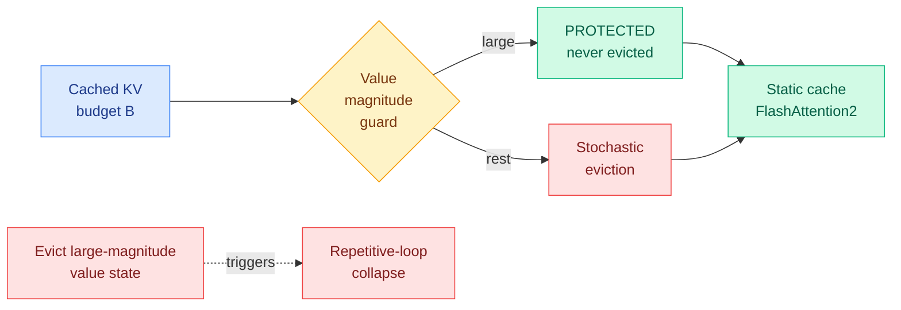
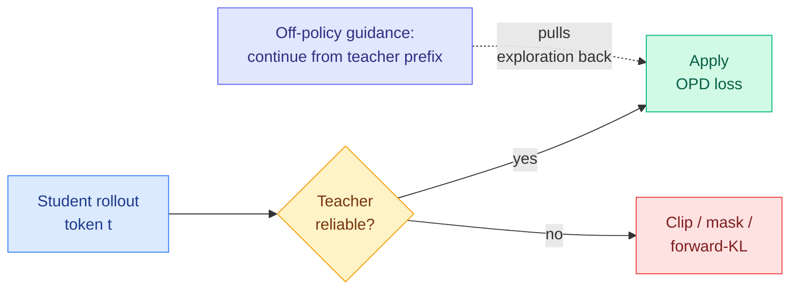
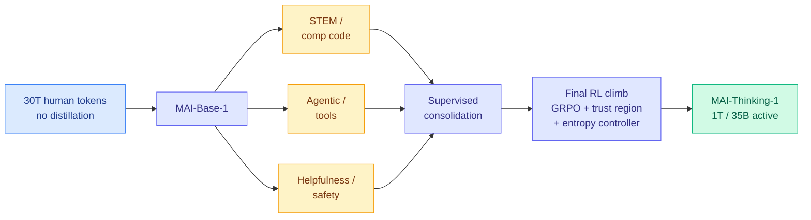
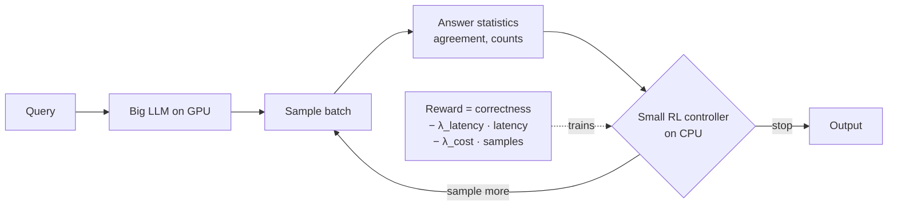
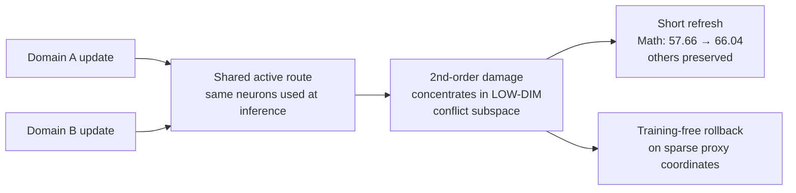
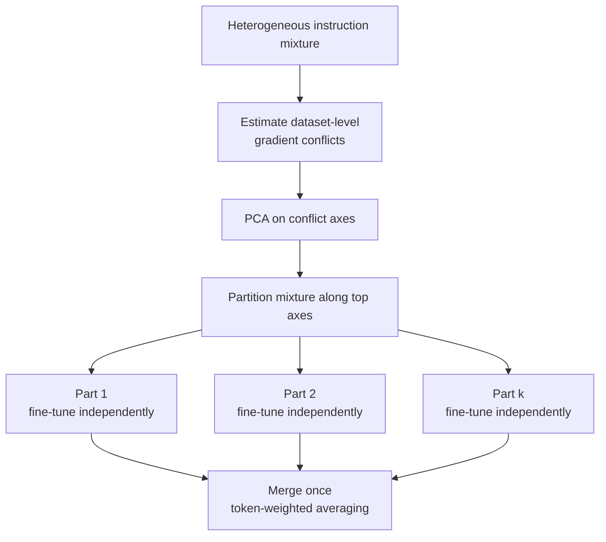
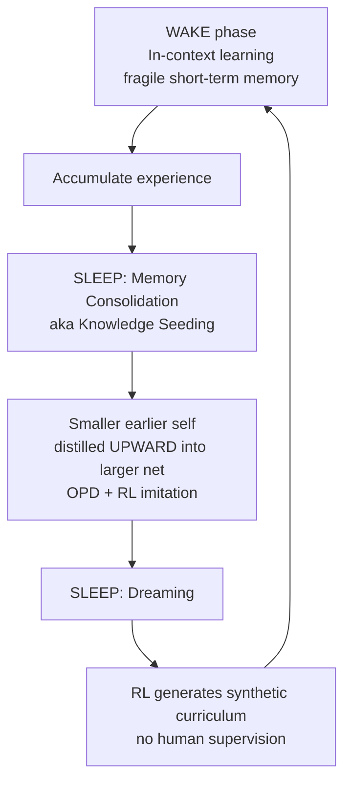

# cere-bro | 2026-06-03

> Two independent teams reached for the same control-theory trick in the same week: a trust region that breathes, used to keep a long reasoning-training run from tearing itself apart.

---

## TL;DR

The sharpest signal today is a quiet convergence on stability primitives. TrOPD (Samsung's trust-region on-policy distillation) and MAI-Thinking-1 (Microsoft's 1T-parameter reasoning model) come from different teams solving different problems — distilling a student versus climbing a frontier model from cold start — and both land on the same fix: a trust region whose bounds adapt instead of staying fixed. After a spring of papers naming this instability (the closed-form collapse threshold in Extrapolation Cliff on 05-14, the reverse-KL gradient pathologies in Many Faces of On-Policy Distillation on 05-13), the field has moved from diagnosis to a shared stabilizer in one week.

The second pattern is that "stop treating everything equally, find the sparse load-bearing part" keeps colonizing new substrates. VaSE locates it in the KV cache (a small set of value states carry outsized magnitude and must never be evicted), Local Perturbation Theory + MERIT locate it in a low-dimensional conflict subspace where multi-domain interference actually lives, and the Small RL Controller locates it in the sampling budget. The industry shipped the production-scale instance of exactly this principle: MiniMax M3 dropped over the weekend with sparse attention at 1M context cutting per-token compute to roughly one-twentieth.

On the industry side, NVIDIA and Microsoft used GTC Taipei and Build to push agents onto the Windows PC with the OpenShell secure runtime and smart local-to-cloud query routing, Microsoft shipped seven MAI models built without third-party distillation, Anthropic widened Project Glasswing to about 150 cyberdefense partners, and Nous Research / HuggingFace shipped on-device agent runtimes (Hermes Desktop, Holo3.1). Kurate's weekly leaderboard stayed clinical with no HuggingFace overlap, and all eight Reddit subs were empty this window, leaving today's efficiency numbers (VaSE's 4x, MiniMax's 20x) without practitioner ground-truth cross-checks.

---

## Deep Dives

### VaSE: why KV eviction loses to sparse attention, and how to fix it

> Eviction methods keep losing accuracy to selection-based sparse attention. VaSE finds the reason in a handful of value states with abnormally large magnitude whose removal sends reasoning models into repetitive loops, protects them, adds randomness, and closes the gap at 4x compression.

**Source:** HuggingFace Daily Papers
**Links:** [Paper](https://arxiv.org/abs/2606.03928) · [Wiki summary](../../inference-efficiency/2026-06-03-vase-value-aware-stochastic-kv-eviction.md)

**What is it about?**
Reasoning models emit very long chains of thought, and that long output is what makes the KV cache (the memory store that holds past attention keys and values so they are not recomputed) the bottleneck. VaSE is a training-free recipe for KV cache eviction (throwing away unimportant entries to cap memory) on reasoning models.

**What problem does it solve?**
Eviction gives a static memory footprint but had consistently lost accuracy to selection-based sparse attention (which keeps the whole cache but attends to only a chosen subset). VaSE diagnoses why rather than just measuring the gap.

**What is the core novelty?**
Two findings turned into a recipe. First, a small fraction of value states have abnormally large magnitudes, and evicting them is catastrophic: the model collapses into repetitive reasoning loops, so VaSE protects them. Second, deterministic top-k eviction starves the same entries every step; making the eviction decision stochastic keeps the surviving cache diverse and raises accuracy.

**Key takeaways**
- At 4x KV compression on Qwen3 across six reasoning tasks, higher average accuracy than the SOTA selection method and more than 4% over the strongest eviction baseline.
- The large-magnitude-value finding is the same outlier phenomenon LongAct (04-18, high-magnitude Q/K activations mark where attention does real work) and quantization research keep hitting, now on the value side.
- Training-free, FlashAttention2-compatible, static memory footprint.

**Gaps in the study**
Demonstrated on Qwen3 reasoning tasks only, with no wall-clock latency numbers and no test of whether the magnitude guard holds at 8x or 16x compression or on non-reasoning long-context workloads.

**Industrial implication**
For anyone serving long-reasoning models under a fixed memory budget, eviction with a static footprint plus near-selection accuracy is the more deployable option, and the outlier-protection idea may unify with low-bit KV quantization, which protects the same states.

→ [Full summary](../../inference-efficiency/2026-06-03-vase-value-aware-stochastic-kv-eviction.md)

---

### TrOPD: a trust region for on-policy distillation

> On-policy distillation goes unstable when student and teacher drift apart, because the cheap reverse-KL estimator produces gradient outliers exactly where the teacher is unsure. TrOPD only learns inside the region where the teacher is reliable, and clips the rest.

**Source:** HuggingFace Daily Papers
**Links:** [Paper](https://arxiv.org/abs/2606.01249) · [Wiki summary](../../inference-efficiency/2026-06-03-tropd-trust-region-on-policy-distillation.md)

**What is it about?**
On-policy distillation (OPD) trains a small student on its own generated rollouts using token-level supervision from a larger teacher, which avoids the exposure bias of plain supervised fine-tuning (where the student learns from teacher trajectories but is graded on its own).

**What problem does it solve?**
OPD destabilizes when student and teacher distributions diverge: the student generates tokens the teacher rates very unlikely, the policy gradients turn to noise, and training can collapse. Long reasoning responses cannot afford full-vocabulary supervision, so OPD uses a cheap KL estimator (the K1 reverse-KL estimator) that produces large gradient outliers precisely in the teacher's low-confidence regions.

**What is the core novelty?**
A trust region that restricts the OPD update to tokens where the teacher's supervision is reliable, plus first-class outlier handling (gradient clipping, masking, or switching to forward-KL) for the unreliable tokens, plus off-policy guidance that lets the student continue from teacher prefixes and imitate via forward-KL to pull exploration back toward trustworthy regions.

**Key takeaways**
- Beats OPD, EOPD, and REOPOLD across math reasoning, code generation, and general-domain benchmarks, and ships a unified OPD benchmark.
- The trust region is a concrete fix for the failures named by Many Faces of On-Policy Distillation (05-13, distribution mismatch and biased reverse-KL gradients).
- Closely related to TA-OPD (06-01, learn only from teacher corrections the student can actually reach): reachable tokens and reliable-supervision regions are two framings of "do not train on what the teacher cannot usefully teach here."

**Gaps in the study**
The reliability boundary is defined by teacher confidence rather than learned, and the cost of the off-policy-guidance rollouts against plain OPD is not foregrounded.

**Industrial implication**
For teams distilling small reasoning models, a trust region that prevents collapse under distribution mismatch is a drop-in stability upgrade, and the convergence with MAI-Thinking-1's RL trust region (below) hints one stabilizer may serve both distillation and reinforcement learning.

→ [Full summary](../../inference-efficiency/2026-06-03-tropd-trust-region-on-policy-distillation.md)

---

### MAI-Thinking-1: Microsoft builds a hill-climbing machine

> Microsoft's first frontier reasoning model refuses to distill from anyone else's model, climbs three domain specialists in parallel then merges them, and rides on the unglamorous infrastructure that keeps a thousand-step reinforcement-learning run from killing itself.

**Source:** Microsoft AI technical report, via Ken Huang (RSS) and Simon Willison (RSS)
**Links:** [Tech report PDF](https://microsoft.ai/wp-content/uploads/2026/06/main_20260602_2.pdf) · [Ken Huang](https://kenhuangus.substack.com/p/microsofts-approach-mai-thinking) · [Wiki summary](../../llms-foundation-models/2026-06-03-mai-thinking-1-hill-climbing.md)

**What is it about?**
MAI-Thinking-1 is a 1T-parameter, 35B-active mixture-of-experts (MoE, where each token routes through a small subset of experts) reasoning model scoring 52.8% on SWE-Bench Pro and 97.0% on AIME 2025, and "preferred to Sonnet 4.6" in Microsoft's blind human evaluations. The thesis is that they built a hill-climbing machine and the model is the by-product.

**What problem does it solve?**
It is a bet against the standard bootstrap of distilling reasoning traces from a bigger model. Microsoft argues imitation gives you the answers but not the robustness, so a copied model cracks under the long RL runs that actually build skill. The cost is that you must solve cold-start reasoning yourself on an unstable run with no teacher to fall back on.

**What is the core novelty?**
The stability engineering. GRPO is hardened with two guardrails: an asymmetric trust region whose upper bound breathes via a variable controlled by an integral controller watching policy entropy (widen when too certain, tighten when too random), and a hard clamp on the raw probability ratio that kills the gradient-norm spikes that otherwise diverge a long run. The loss takes the pessimistic of clipped and unclipped advantage so the policy cannot reward-hack a noisy estimate.

**Key takeaways**
- No distillation from third-party models, only self-distillation from their own earlier checkpoints to resume crashed runs.
- Split-then-merge across three specialists risks flattening the specialist peaks; the final RL climb exists to claw the edge back.
- "Appropriately licensed data" turned out (per the report, surfaced by Simon Willison) to still be a proprietary web crawl of about 1.2T pages filtered to 794B plus Common Crawl, not a cleaner-provenance breakthrough.

**Gaps in the study**
The robustness payoff of refusing distillation is asserted more than measured, with no ablation against a distilled-cold-start variant, and whether consolidation recovers the specialist peaks is the open question benchmarks alone cannot settle.

**Industrial implication**
If the no-distillation bet pays off, it splits the field between labs with 30T-token human-data pipelines plus RL-stability engineering and everyone bootstrapped from distillation. The control-theory stabilizers are the most directly reusable part, ready today for anyone running long GRPO.

→ [Full summary](../../llms-foundation-models/2026-06-03-mai-thinking-1-hill-climbing.md)

---

### Small RL Controller: learn when to stop sampling, on a CPU

> Test-time scaling draws many candidate answers and picks the best, which is expensive. A tiny reinforcement-learning controller, trained only on answer statistics and running on CPU, decides each round whether to stop or sample more.

**Source:** HuggingFace Daily Papers
**Links:** [Paper](https://arxiv.org/abs/2606.03102) · [Wiki summary](../../inference-efficiency/2026-06-03-small-rl-controller-adaptive-sampling.md)

**What is it about?**
The paper formalizes adaptive sampling (deciding how many candidate answers to draw) as a Markov decision process and trains a lightweight RL controller to make the stop-or-continue decision each round.

**What problem does it solve?**
Existing adaptive-sampling methods rely on heuristics or distributional assumptions. This replaces the heuristic with a learned policy that jointly balances answer correctness, latency, and compute cost.

**What is the core novelty?**
The controller consumes only statistics of the final answers seen so far (not hidden states or logits), so it is light enough to train and run on CPU beside the GPU-bound model. The training objective is the Lagrangian relaxation of a constrained optimization with explicit budget limits, giving the cost and latency weights a clean interpretation.

**Key takeaways**
- Better correctness-vs-rounds-vs-total-samples trade-offs than the ASC and ESC self-consistency baselines.
- It is the budgeting-as-policy cousin of routing-as-policy: a cheap controller decides how much to spend on a query already in flight, the way a router decides where to send one.
- Because it sees only answer statistics, it should transfer across base models without retraining, a clean falsifiable claim.

**Gaps in the study**
It reacts to answer statistics after the first batch rather than estimating difficulty up front, and it uses bare agreement counts rather than a verifier or process-reward signal that would sharpen the stopping decision.

**Industrial implication**
For inference providers running test-time scaling, a free CPU-side controller that trims sampling rounds directly attacks the cost-per-query of reasoning workloads.

→ [Full summary](../../inference-efficiency/2026-06-03-small-rl-controller-adaptive-sampling.md)

---

### Local Perturbation Theory: multi-domain interference is local, not global

> Training a model on a new domain degrades the old ones even when the full-model gradients are nearly orthogonal. The damage is not global, it concentrates in a low-dimensional subspace of computation routes both domains share, and a short refresh contracts it.

**Source:** HuggingFace Daily Papers
**Links:** [Paper](https://arxiv.org/abs/2606.02398) · [Wiki summary](../../llms-foundation-models/2026-06-03-local-perturbation-multi-domain-rl-interference.md)

**What is it about?**
RL post-training lifts a model on one domain (math, code, QA, creative writing) but usually drags down the others. This paper builds a local perturbation theory of why.

**What problem does it solve?**
The standard explanations, catastrophic forgetting and global gradient conflict, are incomplete: substantial interference happens even when full-model gradients are nearly orthogonal, so the cause cannot be a whole-model clash.

**What is the core novelty?**
Single-domain RL makes sparse, small-magnitude edits with little overlap among top-changed neurons, yet different domains share active computation routes, and on those routes the update direction sets synergy versus conflict. The paper proves the harm concentrates as a second-order damage term in a low-dimensional shared conflict subspace, then shows a short domain refresh contracts it and a training-free rollback on a sparse proxy coordinate set partially restores the degraded domain with no retraining.

**Key takeaways**
- A brief Re-Math refresh after Code to Math to QA to creative writing recovers Math from 57.66 to 66.04 while preserving the others (best average 66.39).
- Interference being low-dimensional and locatable makes it measurable, predictable, and rollback-able rather than just a cost.
- It extends the wiki's "operational targets are sparse and locatable" thread from where the signal is to where the damage is.

**Gaps in the study**
It explains and recovers interference but does not yet predict which prior capability will degrade before training, and the rollback is shown post-hoc rather than online.

**Industrial implication**
For anyone running sequential domain RL on a deployed model, a cheap monitor on a sparse conflict-coordinate set plus a micro-rollback could prevent regressions without re-running training.

→ [Full summary](../../llms-foundation-models/2026-06-03-local-perturbation-multi-domain-rl-interference.md)

---

### MERIT: split the data along the conflict, train apart, merge once

> If multi-domain interference lives in a low-dimensional conflict subspace, split the data mixture along exactly those axes, fine-tune each part independently with no communication, and merge once. That beats joint training and removes the synchronization cost.

**Source:** HuggingFace Daily Papers
**Links:** [Paper](https://arxiv.org/abs/2606.01717) · [code](https://github.com/naver-ai/merit) · [Wiki summary](../../llms-foundation-models/2026-06-03-merit-decentralized-instruction-tuning-merging.md)

**What is it about?**
MERIT is a decentralized instruction-tuning pipeline. Instruction tuning aligns a model to many user intents, but scaling to heterogeneous data mixtures hits gradient interference and bandwidth-heavy synchronization at once.

**What problem does it solve?**
It attacks both bottlenecks together by training parts of the mixture independently and reconciling them once in parameter space, rather than treating interference and synchronization as separate problems.

**What is the core novelty?**
A local quadratic theory inside a shared flat loss basin shows weight merging is a curvature-weighted variance reduction and that splitting along the top PCA conflict axes maximizes that gain. The recipe estimates dataset-level gradient conflicts, partitions the mixture along those axes, fine-tunes each partition with zero inter-partition communication, then merges once via token-weighted averaging.

**Key takeaways**
- Lifts the 8-benchmark Vision-FLAN average from 54.3 (joint training) to 57.0 on Qwen2.5-VL-3B, and scales to 7B on a 1.6M-example, 176-source mixture, matching or beating centralized joint training.
- It pairs with today's Local Perturbation Theory: that paper explains why the conflict is a low-dimensional subspace, MERIT uses a low-dimensional conflict structure to avoid the collision. The two subspaces may literally be the same object.
- Communication-free partition training is what makes it decentralized and cheap.

**Gaps in the study**
The split is computed once, but the conflict geometry shifts as the model evolves, so a static partition leaves gains on the table, and the approach is shown for instruction tuning, not RL.

**Industrial implication**
For teams fine-tuning on large heterogeneous mixtures, conflict-aware splitting plus a single merge promises joint-training quality at decentralized cost, no synchronization fabric required.

→ [Full summary](../../llms-foundation-models/2026-06-03-merit-decentralized-instruction-tuning-merging.md)

---

### Language Models Need Sleep (again): consolidate by growing, not just folding

> Eight days after one paper used "sleep" for folding context into fixed weights, a second identically-titled paper uses it for the opposite move: distilling a smaller self upward into a larger network to grow capacity, then dreaming up its own training curriculum.

**Source:** HuggingFace Daily Papers
**Links:** [Paper](https://arxiv.org/abs/2606.03979) · [Wiki summary](../../llms-foundation-models/2026-06-03-language-models-need-sleep-knowledge-seeding.md)

**What is it about?**
This paper takes the human sleep analogy as a continual-learning recipe: models do in-context learning well but cannot continually transfer that temporary knowledge into long-term parameters.

**What problem does it solve?**
It adds an offline consolidation phase. Memory Consolidation via Knowledge Seeding is an upward distillation that distills a smaller earlier self into a larger network to add capacity while preserving knowledge, and Dreaming is a self-improvement phase where the model uses RL to generate synthetic rehearsal data without human supervision.

**What is the core novelty?**
The direction. Almost every distillation entry the wiki tracks compresses a large teacher into a small student; Knowledge Seeding distills small-to-large to grow capacity, framed explicitly as on-policy distillation combined with RL-based imitation learning.

**Key takeaways**
- Helps on long-horizon, continual-learning, knowledge-incorporation, and few-shot generalization tasks.
- It is a different paper from the 05-27 "Language Models Need Sleep," which consolidated evicted KV context into SSM fast weights via learned recurrent passes. Same metaphor, different layer of the stack.
- Dreaming's self-generated curriculum sits beside SCOPE (06-01, data-free self-play) and G-Zero (05-12, verifier-free self-improvement).

**Gaps in the study**
Knowledge Seeding is a proof of concept, not shown at frontier scale, with no cost accounting for the offline sleep phase and no head-to-head against simpler replay-based continual learning.

**Industrial implication**
If upward distillation can grow a deployed model's capacity without retraining from scratch, it offers a path to incremental capability addition, though the interference papers above suggest the consolidation may just relocate the conflict rather than avoid it.

→ [Full summary](../../llms-foundation-models/2026-06-03-language-models-need-sleep-knowledge-seeding.md)

---

## Industry Pulse

- **NVIDIA and Microsoft pushed agents onto the Windows PC** with the OpenShell secure runtime doing smart local-to-cloud query routing across local models (DeepSeek, Gemma, GLM, Kimi, MiniMax, Nemotron, Qwen) ([NVIDIA](https://nvda.ws/4uKWxaB)).
- **NVIDIA unveiled Vera, "the CPU for agents,"** claiming 80% faster agentic task completion than x86, alongside Nemotron 3 Ultra with 5x faster inference and up to 30% lower cost ([NVIDIA](https://nvda.ws/4ugo9Uf)).
- **Microsoft shipped seven MAI models**, led by MAI-Thinking-1 (1T / 35B active) and MAI-Code-1-Flash (137B / 5B active) for GitHub Copilot, built without third-party distillation ([Simon Willison](https://simonwillison.net/2026/Jun/2/microsofts-new-models/)).
- **Anthropic widened Project Glasswing to about 150 cyberdefense partners** across 15-plus countries, extending Claude Mythos Preview access ([The Decoder](https://the-decoder.com/anthropic-scales-project-glasswing-to-150-partners/)).
- **StepFun and MiniMax dropped open-weight efficiency models**, Step 3.7 Flash (196B / 11B active, Apache 2.0) and MiniMax M3 (1M context via sparse attention) ([Kilo](https://kilo.codes/dNgp08L)).
- **Nous Research released Hermes Desktop in public preview**, a native on-machine agent, with Scoble calling Hermes-vs-OpenClaw "the new Mac vs Windows" ([@NousResearch](https://nitter.net/NousResearch/status/2061843507417944552#m)).
- **HuggingFace shipped Holo3.1**, fast local computer-use agents, part of the same week's push to run agents on-device ([HuggingFace](https://huggingface.co/blog/holo31-fast-local-computer-use-agents)).
- **NewLimit raised a $435M Series C** led by Founders Fund for cell-age reprogramming, with Anthropic's Sholto Douglas publicly doubling down ([@newlimit](https://nitter.net/newlimit/status/2061849237156159511#m)).
- **Gary Marcus says Trump signed an executive order mandating FDA-style preflight checks for high-impact AI models**, a proposal he had long pushed ([Marcus on AI](https://garymarcus.substack.com/p/breaking-when-dreams-for-ai-sanity)).

---

## Global View

**The trust-region stabilizer is converging on one primitive across two RL families.** TrOPD (Samsung's trust-region for on-policy distillation, which only learns where the teacher is reliable) and MAI-Thinking-1 (Microsoft's GRPO run, stabilized by an asymmetric trust region steered by an entropy integral controller) come from different teams solving different problems but land on the same fix: a trust region whose bounds adapt. After the Extrapolation Cliff (05-14, closed-form threshold past which OPD collapses) and Many Faces of On-Policy Distillation (05-13, biased reverse-KL gradients), the field has moved from diagnosis to one shared stabilizer in a single week. The open question is whether they are literally the same object — if so, one piece of stability engineering serves both distillation and reinforcement learning with verifiable rewards.

**The sparse-and-locatable principle is spreading across the stack, and the industry just shipped the production-scale instance.** VaSE locates the load-bearing part in the KV cache (a handful of large-magnitude value states), Local Perturbation Theory + MERIT locate it in a low-dimensional conflict subspace where multi-domain interference actually lives, and the Small RL Controller locates it in the sampling budget. This is the same outlier phenomenon LongAct (04-18, high-magnitude Q/K activations mark where attention works) and the quantization literature keep finding. Then over the weekend MiniMax shipped M3 with sparse attention at 1M context cutting per-token compute to roughly one-twentieth — the academic argument about how to make long-context attention cheap and the open-weight frontier are now converging on the same lever in the same week.

**Industry's agent-on-the-PC push is the production layer for the routing-as-policy direction research has been building.** NVIDIA's OpenShell does smart local-to-cloud query routing across seven local models, Microsoft built MAI-Code-1-Flash specifically for the GitHub Copilot serving path, Nous shipped Hermes Desktop and HuggingFace shipped Holo3.1 as on-device agent runtimes. The research side is producing the controllers (Small RL Controller's stop-or-sample budgeting, model-selection routers from prior weeks), and industry is shipping the local-vs-cloud routing surface where those controllers will plug in. The gap is who wins the runtime contract: the same week saw Nous, HuggingFace, NVIDIA-OpenShell, and Microsoft-Windows-AI Foundry all stake competing positions, and the research community has no working benchmark yet for evaluating router decisions in production.

---

## Looking Ahead

- **A single trust-region stabilizer serves both on-policy distillation and RLVR within 60 days.** TrOPD and MAI-Thinking-1 converged on the same primitive in one week. **Signal to watch:** a paper showing one breathing trust region stabilizes both OPD and GRPO with shared hyperparameters, or alternatively a careful analysis showing the OPD and GRPO failure modes need genuinely different bounds.
- **VaSE-style outlier-protected eviction ships in a serving stack within 90 days.** VaSE claims eviction with a static memory footprint matches selection at 4x compression on reasoning models. **Signal to watch:** vLLM, SGLang, or TensorRT-LLM adding an outlier-protected stochastic eviction option as a config flag; or a careful long-context retrieval benchmark showing selection still wins, falsifying the claim.
- **MERIT's PCA conflict axes turn out to be the same object as Local Perturbation Theory's conflict subspace within 60 days.** **Signal to watch:** a paper that uses one cross-task conflict-subspace estimate to drive both the MERIT data split AND the Local Perturbation rollback, validating they're the same geometric object. If yes, multi-domain training gets a unified control surface.
- **Microsoft's no-distillation bet shows up as measurable robustness within 90 days.** MAI-Thinking-1 asserts learned-not-inherited capabilities buy robustness under long RL runs. **Signal to watch:** an ablation by Microsoft or a third-party eval where a distilled-cold-start model of comparable size cracks on a stress test where MAI-Thinking-1 holds, OR the absence of such a result by end of August, which would falsify the robustness payoff.
- **Production routing benchmarks emerge from the agent-on-the-PC race within 30 days.** NVIDIA OpenShell, Hermes Desktop, Holo3.1, and Windows AI Foundry all need an evaluation framework that scores local-vs-cloud routing decisions. **Signal to watch:** a benchmark suite from any frontier lab or HuggingFace that scores agent runtimes on cost, latency, and decision quality together. If none lands by July, the race continues to be settled by demos, not numbers.
