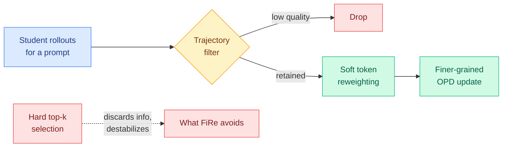
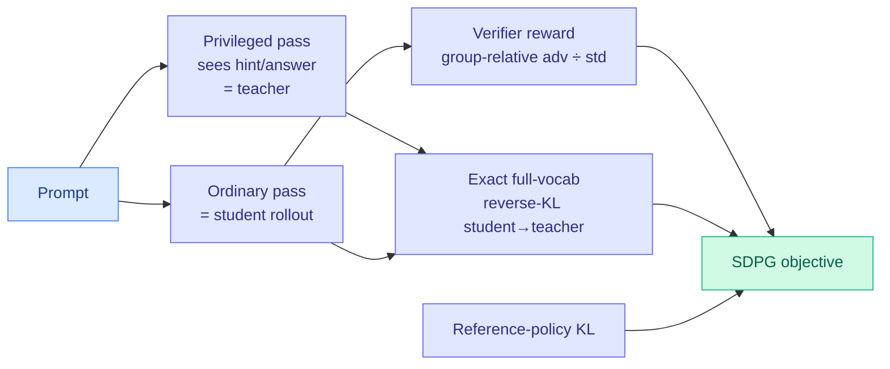
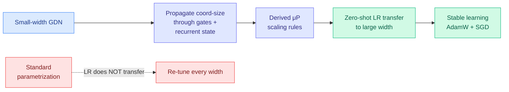
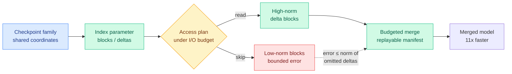
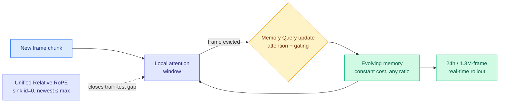
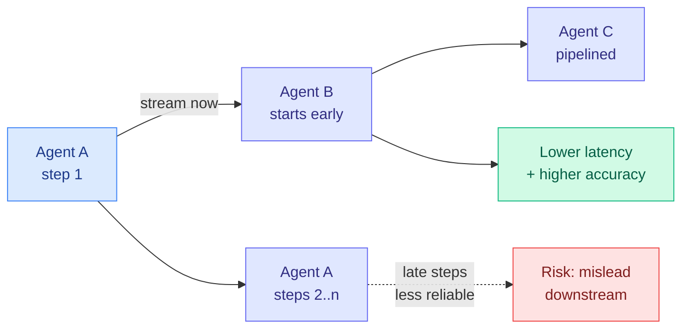
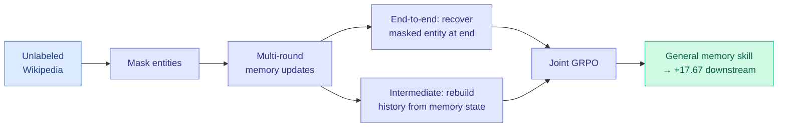

# cere-bro | 2026-06-04

> The on-policy distillation program spent the spring asking how to bound and select its own supervision; today two papers answered two of those open questions at once, one of them a prediction this digest made yesterday.

---

## TL;DR

Today is on-policy distillation (OPD, training a small student on its own rollouts under a teacher's token-level supervision) answering its own homework. Two papers landed together. FiRe-OPD drops the hard token-selection orthodoxy that TIP (04-16, under 10% of tokens carry signal) and TA-OPD (06-01, keep only teacher corrections the student can reach) built, arguing hard top-k throws usable signal away; it filters whole trajectories then *soft-reweights* every surviving token, and adds a trajectory filter the multi-teacher numbers (+18.81 on Miner) say matters most when teachers disagree. SDPG goes further and validates a falsifiable prediction this digest made yesterday: instead of stabilizing OPD and reinforcement learning with verifiable rewards (RLVR) separately, it folds them into one loss, using an exact full-vocabulary self-distillation KL as dense supervision alongside the verifier advantage. Yesterday the wiki bet OPD and RLVR would converge on one stabilizer within 60 days; SDPG did the deeper version in one.

The second thread is scale-stable efficiency, and here research and industry moved in the same morning. A paper deriving the Maximal Update Parametrization (μP, which transfers hyperparameters from a tiny model to a huge one with no re-tuning) for Gated Delta Networks closes the gap that kept sub-quadratic linear-attention models from inheriting zero-shot tuning, the third architecture after mixture-of-experts and local-linear attention to get the treatment. The same hour, the Marin / Open Athena pretraining post (via @eliebakouch) shipped the matching recipe with honest numbers: 6.7x theoretical, 3.6x realized, dense-to-MoE, plus a free 1.3x from a Muon optimizer swap. NVIDIA's Nemotron 3 Ultra (550B at 10% active) and StepFun's Step 3.7 Flash (198B / 11B active, Apache 2.0) are the shipped frontier instances of exactly that sparse-plus-scale-stable lever.

Underneath both: the "memory bandwidth and a few load-bearing parts are the wall, not raw FLOPs" frame keeps colonizing new substrates. Echo-Infinity replaces handcrafted video-KV schedules with a learned evolving memory and claims a first 24-hour real-time rollout; MergePipe shows model merging is bottlenecked on reading expert weights and budgets the reads for an 11x speedup; MemTrain turns agent memory into a self-supervised skill so it no longer needs annotated data. Kurate's weekly leaderboard stayed almost entirely clinical with zero HuggingFace overlap, so there is no cross-source-confirmed paper today, and all eight Reddit subs were empty this window, leaving today's efficiency numbers without practitioner ground-truth checks.

---

## Deep Dives

### FiRe-OPD: filter the trajectories, then softly reweight the tokens

> The whole spring of distillation research narrowed supervision by picking a small set of tokens to keep. FiRe-OPD argues hard selection throws usable signal away, and instead keeps every retained token but weights it continuously, after first dropping the bad rollouts.

**Source:** HuggingFace Daily Papers
**Links:** [Paper](https://arxiv.org/abs/2606.02684) · [Code](https://github.com/YuYingLi0/FiRe-OPD) · [Wiki summary](../../inference-efficiency/2026-06-04-fire-opd-filter-then-reweight-distillation.md)

**What is it about?**
FiRe-OPD (Filter, then Reweight) is an on-policy distillation recipe that works at two granularities at once. First it filters whole student rollouts (trajectories) to drop the low-quality ones. Then, inside the survivors, it applies soft reweighting so informative tokens count more without any token being discarded.

**What problem does it solve?**
Recent OPD methods select a small subset of tokens to train on (hard selection). FiRe-OPD argues this loses information and destabilizes optimization. Continuous weighting keeps all retained tokens but down-weights the uninformative ones, which it claims is both more stable and finer-grained.

**What is the core novelty?**
The combination of a trajectory-level filter with token-level *soft* reweighting in one objective. Prior work picked one level (TIP and TA-OPD operate at the token level only) and used hard cuts; FiRe-OPD does both levels and replaces the hard cut with a soft weight.

**Key takeaways**
- +6.25 on AIME 2024 in the strong-to-weak setting, +18.81 on Miner in the multi-teacher setting, over recent token-level OPD methods.
- The far larger multi-teacher gain suggests trajectory filtering matters most when teachers disagree and produce conflicting rollouts.
- Robust across strong-to-weak, single-teacher, and multi-teacher regimes, so the structure is not tied to one distillation topology.

**Gaps in the study**
It does not add a reliability trust region (the TrOPD axis from 06-03), so the fully unified policy (reachable tokens, soft-weighted, inside a reliability band) is still unwritten. It is also unclear whether FiRe's "informativeness" weight is the same quantity as TA-OPD's teachability or TIP's entropy/divergence.

**Industrial implication**
For any team distilling small reasoning models from one or several teachers, soft reweighting is a drop-in change to the loss with no extra rollouts, and the multi-teacher result makes it attractive for the increasingly common case of distilling from a panel of frontier models at once.

→ [Full summary](../../inference-efficiency/2026-06-04-fire-opd-filter-then-reweight-distillation.md)

---

### SDPG: fold on-policy distillation into the policy gradient

> Yesterday this digest predicted on-policy distillation and reinforcement learning would converge on a shared stabilizer within 60 days. SDPG did the deeper version in one: it makes self-distillation a dense reward term inside the policy gradient, so the two are one loss, not two stabilizers.

**Source:** HuggingFace Daily Papers
**Links:** [Paper](https://arxiv.org/abs/2606.04036) · [Code](https://github.com/lauyikfung/SDPG) · [Wiki summary](../../inference-efficiency/2026-06-04-sdpg-self-distilled-policy-gradient.md)

**What is it about?**
SDPG (Self-Distilled Policy Gradient) densifies the sparse reward of RLVR (reinforcement learning with verifiable rewards, where each rollout gets one scalar correctness reward) using on-policy self-distillation. The model conditions on privileged context (a hint or the answer) to supervise its own ordinary generations, which becomes an auxiliary full-vocabulary reverse-KL loss.

**What problem does it solve?**
RLVR's one-scalar-per-rollout signal makes credit assignment noisy and learning unstable. Plain self-distillation lacks the verifier's correctness anchor. SDPG combines both so the dense per-token self-distillation signal and the sparse verifier reward train the model together.

**What is the core novelty?**
A three-term objective: group-relative verifier advantage normalized by standard deviation, *exact* full-vocabulary on-policy self-distillation KL, and reference-policy KL regularization. Using the exact KL rather than the cheap K1 estimator avoids the gradient outliers that TrOPD (06-03) had to fence off with a trust region, trading memory for stability.

**Key takeaways**
- Improves stability and performance over both RLVR-only and self-distillation-only baselines.
- The teacher is the same model under privileged conditioning, so there is no external teacher, the same trick as D-OPSD (05-07, teacher sees the image, student sees only text).
- It is the "RL is weighted supervised fine-tuning" instinct (DRIFT, 06-01) generalized to self-distillation, putting distillation and RLVR in one loss instead of two pipelines.

**Gaps in the study**
The exact full-vocabulary KL costs memory; there is no head-to-head against TrOPD's cheap-estimator-plus-trust-region approach at frontier scale. And once the self-distillation term densifies the signal, the marginal value of the verifier advantage is the ablation the paper most needs.

**Industrial implication**
If privileged-context self-distillation reliably substitutes for a larger teacher, labs running RLVR can densify their reward for free with a model they already have, no second model to host. Expect the privileged-context KL term to start appearing as a standard component in RL recipes.

→ [Full summary](../../inference-efficiency/2026-06-04-sdpg-self-distilled-policy-gradient.md)

---

### Gated Delta Networks get μP: zero-shot tuning for linear attention

> μP lets you tune a tiny model and transfer the settings to a huge one for free, but only for standard Transformers. This paper does the hard derivation for gated linear-attention models, so the efficient architectures finally inherit it too.

**Source:** HuggingFace Daily Papers
**Links:** [Paper](https://arxiv.org/abs/2606.04048) · [Wiki summary](../../inference-efficiency/2026-06-04-gated-delta-network-mup-scaling.md)

**What is it about?**
The paper extends the Maximal Update Parametrization (μP, which keeps every coordinate's update size scale-invariant as model width grows, so optimal hyperparameters transfer across scale) to Gated Delta Networks, a sub-quadratic linear-attention family whose state evolves by a gated delta rule.

**What problem does it solve?**
μP was derived for standard Transformers. Linear-attention models have structured state transitions and gating the derivation never covered, so μP did not transfer to them, and you had to re-tune hyperparameters at every scale, eroding the compute savings that motivated using a sub-quadratic architecture in the first place.

**What is the core novelty?**
Rigorously propagating coordinate-size estimates through GDN's forward pass, gating mechanisms, and recurrent state dynamics to derive the correct scaling rules. The proof of the pudding: learning-rate transfers cleanly across widths under both AdamW and SGD, where standard parametrization fails to transfer.

**Key takeaways**
- First μP-style scale-stable parametrization for a gated linear-attention model.
- Transfer holds under two different optimizers, evidence the derivation captures real structure rather than a lucky constant.
- It is the third architecture to get scale-stable treatment after mixture-of-experts (MoE μP, 05-17) and local-linear attention (Parallax's Muon codesign, 05-29).

**Gaps in the study**
It transfers learning rate; whether batch size, warmup, and weight decay also transfer under the derived rules (as full μP promises) is not shown. And it tests AdamW and SGD but not Muon, the optimizer the codesign thread predicts should unlock GDN capacity.

**Industrial implication**
Open labs training efficient hybrids can now tune at 1B and launch at 100B+ without a re-tuning sweep, which is exactly the recipe the Marin / Open Athena post (Industry Pulse) shipped the same morning. The economic case for sub-quadratic architectures gets stronger once their tuning cost stops scaling with size.

→ [Full summary](../../inference-efficiency/2026-06-04-gated-delta-network-mup-scaling.md)

---

### MergePipe: model merging is bottlenecked on reading experts, so budget the reads

> Weight-space merging is treated as arithmetic on checkpoints, but at LLM scale the real cost is reading every expert weight off disk. MergePipe casts merging as an I/O-budgeted access problem, skips the low-norm blocks, and gets an 11x speedup with a provable error bound.

**Source:** HuggingFace Daily Papers
**Links:** [Paper](https://arxiv.org/abs/2605.29489) · [Wiki summary](../../inference-efficiency/2026-06-04-mergepipe-expert-read-budgeting-merging.md)

**What is it about?**
MergePipe is a budget-aware execution layer for weight-space model merging (combining several fine-tuned checkpoints by doing arithmetic on their parameters). It reframes merging as an expert access-set problem: given a merge operator and a checkpoint family in a shared coordinate system, choose which expert delta blocks to read under an explicit I/O budget.

**What problem does it solve?**
The literature treats merging as algebra, but at LLM scale the binding resource is the set of expert weights that must be read off disk or out of memory. The reads, not the math, dominate the cost.

**What is the core novelty?**
It indexes parameter blocks, builds deterministic access plans, and runs the budgeted merge with replayable manifests. The plan is budget-sound by construction (full budget recovers the exact full-read merge), and for fixed-coefficient additive operators the error from omitted blocks is provably bounded by the norm of the omitted deltas, so the budget knob has a guarantee.

**Key takeaways**
- Up to an order-of-magnitude reduction in expert-read I/O and up to 11x speedups on Qwen and Llama merging workloads.
- Budget sweeps show O(10^-3) parameter deviation from full-read merges and no monotonic downstream degradation, so most of the read cost was buying almost nothing.
- The "skip low-norm deltas" rule is the same sparse-and-locatable instinct as VaSE's large-magnitude value guard (06-03), applied offline to merging.

**Gaps in the study**
The error bound is proven only for fixed-coefficient additive operators; whether it extends to non-additive merges (TIES, DARE, spherical interpolation) is open. The access plan ranks blocks by static norm rather than a learned importance predictor.

**Industrial implication**
For teams that produce checkpoint families (MERIT-style decentralized fine-tuning, 06-03) and merge them routinely, MergePipe makes the merge step cheap enough to run often, and the same block index could plausibly serve an I/O-budgeted MoE forward pass at inference.

→ [Full summary](../../inference-efficiency/2026-06-04-mergepipe-expert-read-budgeting-merging.md)

---

### Echo-Infinity: learn the video memory instead of scheduling it by hand

> Infinite video generators manage their history with handcrafted KV-cache schedules that lose information and drift. Echo-Infinity trains a small evolving memory end-to-end with the generator, keeps cost constant at any length, and claims a first 24-hour real-time rollout.

**Source:** HuggingFace Daily Papers
**Links:** [Paper](https://arxiv.org/abs/2606.04527) · [Wiki summary](../../inference-efficiency/2026-06-04-echo-infinity-evolving-memory-video.md)

**What is it about?**
Echo-Infinity is an autoregressive video-generation framework for real-time, arbitrarily long output. It uses a learnable evolving memory to filter, abstract, and compress any-length history at constant cost, instead of curating the KV cache (the store of past attention keys and values) with fixed rules.

**What problem does it solve?**
Existing methods manage history with predefined KV-cache schedules, fixed-ratio heuristic compression, or inference-time RoPE adaptation (RoPE is the positional encoding scheme). All of them lose historical information and amplify compounding error because their cache window is limited and they ignore the noise that autoregressive generation introduces.

**What is the core novelty?**
A small set of Memory Queries, updated by attention and a gating mechanism whenever frames leave the local window, optimized end-to-end with the video diffusion transformer. Plus a Unified Relative RoPE Recipe that anchors sink frames to position 0 and caps the newest frame's RoPE id at the model's pretrained maximum, closing the train-test extrapolation gap.

**Key takeaways**
- Demonstrates 24-hour, over 1.3-million-frame real-time rollouts, claimed as a first.
- Constant compute per step regardless of length, with the compression ratio a free knob rather than a fixed heuristic.
- The learned memory doubles as a generation prior: quality improves even when only the optimized initial query state is used, the genuinely surprising result.

**Gaps in the study**
Constant compute over 1.3M frames is the headline, but whether semantic drift over 24 hours is bounded or merely slow is not measured. Whether the learned-memory argument transfers back to long-context text decoding (training eviction queries end-to-end instead of VaSE-style training-free rules) is untested.

**Industrial implication**
For real-time video products (live avatars, game-world streaming, long-form generation), a constant-cost memory that does not need a hand-tuned eviction schedule is directly deployable, and the memory-as-prior finding hints the trained queries could be shipped as a reusable quality boost.

→ [Full summary](../../inference-efficiency/2026-06-04-echo-infinity-evolving-memory-video.md)

---

### StreamMA: stream reasoning steps between agents, get speed and accuracy

> Multi-agent systems wait for one agent to finish before the next starts, so latency grows with depth. StreamMA streams each step downstream as it lands, and because early reasoning steps are more reliable than late ones, the pipelining also raises accuracy.

**Source:** HuggingFace Daily Papers
**Links:** [Paper](https://arxiv.org/abs/2606.05158) · [Wiki summary](../../agentic-systems/2026-06-04-streamma-streaming-multi-agent-reasoning.md)

**What is it about?**
StreamMA is a multi-agent reasoning system that streams each reasoning step to downstream agents as soon as it is generated, pipelining adjacent agents instead of waiting for each to finish its whole chain.

**What problem does it solve?**
The standard "generate-then-transfer" paradigm forces end-to-end latency to scale linearly with pipeline depth: every agent waits for the one before it to complete. Streaming breaks that serial dependency.

**What is the core novelty?**
The first closed-form joint analysis of stream, serial, and single protocols, deriving the effectiveness ordering (stream beats serial beats single), a speedup upper bound, and a cost ratio. The surprising mechanism: reasoning quality is non-uniform, early steps are more reliable than later ones, so working from reliable early steps prevents error-prone late steps from misleading downstream agents.

**Key takeaways**
- +7.3 percentage points average, +22.4 on HMMT 2026 (Claude Opus 4.6-high), across eight benchmarks, two frontier models (Claude Opus 4.6, GPT-5.4), and three topologies (chain, tree, graph).
- A new "step-level scaling law": more per-agent reasoning steps improve both effectiveness and efficiency, a scaling axis orthogonal to and composable with agent count.
- It changes the communication protocol only, so it is a pure inference-time win that needs no retraining.

**Gaps in the study**
Streaming early steps assumes early-step reliability; on tasks where the answer only crystallizes late (long proofs, multi-hop synthesis), forwarding early steps could propagate a wrong frame. That failure boundary is unmapped.

**Industrial implication**
For anyone running multi-agent pipelines in production, streaming is free latency reduction plus an accuracy bump, and the step-level scaling law gives a serving system a new knob: trade steps-per-agent against agent-count under a latency budget.

→ [Full summary](../../agentic-systems/2026-06-04-streamma-streaming-multi-agent-reasoning.md)

---

### MemTrain: train agent memory as a self-supervised skill

> Building agent memory usually needs annotated memory-intensive tasks, which are scarce. MemTrain learns memory from unlabeled Wikipedia with two proxy tasks, then hands a stronger memory skill to downstream training, for up to a 17.67-point lift.

**Source:** HuggingFace Daily Papers
**Links:** [Paper](https://arxiv.org/abs/2606.03197) · [Wiki summary](../../agentic-systems/2026-06-04-memtrain-self-supervised-context-memory.md)

**What is it about?**
MemTrain is a self-supervised training framework that builds the context-memory capability of long-horizon LLM agents, as a general pre-step before task-specific post-training.

**What problem does it solve?**
The usual recipe trains memory end-to-end with RL on downstream tasks, but collecting annotated memory-intensive problems is costly and the resulting data lacks diversity. MemTrain removes the annotation requirement by mining unlabeled text for proxy supervision.

**What is the core novelty?**
Two coupled proxy tasks over unlabeled Wikipedia, optimized jointly with GRPO: masked-entity reconstruction after several memory-update rounds (rewarding memory maintenance from the final outcome), and intermediate recall of masked history from intermediate memory states (rewarding faithful compression and completeness throughout the interaction).

**Key takeaways**
- Up to 17.67 points over direct task-specific post-training on long-text and search-based QA.
- The intermediate-recall objective is a direct training signal for the faithful-compression property that benchmarks like STALE (55.2% ceiling) and MemLens (sub-30% multi-session) showed current systems lack.
- It is the opposite cold-start strategy to Preping (05-15, proposer-guided synthetic practice): mine free text versus synthesize the practice.

**Gaps in the study**
It trains on Wikipedia reconstruction; whether the skill survives the jump to genuinely interactive, tool-using agent trajectories (where memory holds actions and observations, not just text spans) is the open generalization test. No ablation isolates how much of the gain comes from the process objective versus the outcome one.

**Industrial implication**
For teams building memory agents without a labeled memory-task corpus, a self-supervised pre-step that lifts downstream memory reasoning is a cheap, reusable foundation, the agent-memory analogue of pretraining before fine-tuning.

→ [Full summary](../../agentic-systems/2026-06-04-memtrain-self-supervised-context-memory.md)

---

## Industry Pulse

- **NVIDIA dominated Computex with Cosmos 3**, an open omnimodal world model unifying language, video, audio, and robot actions, plus Nemotron 3 Ultra (550B at 10% active, 300+ tokens/sec) ([AI Breakfast](https://mail.google.com/mail/u/0/#inbox/19e8e3c78f6f92d0)).
- **OpenAI turned Codex into an enterprise app platform** past 5M weekly users with 62 role plug-ins and live-data Sites, and broke ground on The Barn, a 1-gigawatt Stargate data center in Michigan ([AI Breakfast](https://mail.google.com/mail/u/0/#inbox/19e8e3c78f6f92d0)).
- **Microsoft's Build 2026 pushed agents onto local hardware**: a Surface RTX Spark dev box running 120B models offline, the MAI-Thinking-1 reasoning model, and Aion 1.0 on-device small language models ([AI Breakfast](https://mail.google.com/mail/u/0/#inbox/19e8e3c78f6f92d0)).
- **Google DeepMind shipped Gemma 4 12B as encoder-free**, removing the vision and audio encoders so the LLM ingests multimodal input directly for lower latency ([Maarten Grootendorst](https://newsletter.maartengrootendorst.com/p/a-visual-guide-to-gemma-4-12b)).
- **StepFun released Step 3.7 Flash** (198B sparse MoE, 11B active, 256K context, Apache 2.0), and Alibaba's Qwen 3.7 Plus multimodal agent (1M context) went free in Kilo ([@kilocode](https://x.com/kilocode/status/2062228706555302173)).
- **xAI updated Grok Imagine to 1.5** with image-to-video generation at 720p, stitchable into longer scenes ([The Decoder](https://the-decoder.com/xai-updates-grok-imagine-to-1-5-with-image-to-video-generation-at-720p-resolution/)).
- **The Center for AI Safety argued "deterrence by betrayal"**: the risk that adversaries make AIs betray their own developers could itself deter reckless deployment ([AISN #74](https://newsletter.safe.ai/p/aisn-74-the-popes-encyclical-and)).
- **SemiAnalysis modeled space data centers** as 4x more expensive than terrestrial today, reaching parity around 2040, gated by the same chip-fab constraint as everything on Earth ([SemiAnalysis](https://newsletter.semianalysis.com/p/to-boldly-go-the-case-for-space-datacenters)).

---

## Global View

**The on-policy distillation program is now answering its own open questions, and the stabilizers it invented are already shipping in frontier models.** Yesterday this digest predicted OPD and RLVR would converge on one stabilizer within 60 days, after TrOPD (06-03, a trust region for distillation) and Microsoft's MAI-Thinking-1 (06-03, an asymmetric trust region steering a long GRPO run) reached for the same control-theory primitive independently. SDPG did the deeper version in one day, folding an exact self-distillation KL into the policy-gradient objective so distillation and RLVR are one loss; FiRe-OPD separately answered TrOPD's "unify the selection axis" ask by combining a trajectory filter with soft token reweighting. The research-to-industry loop is tight here: MAI-Thinking-1, the model Microsoft put behind GitHub Copilot, is built on exactly the trust-region stabilizer this academic thread formalized, so the OPD theory is not academic at all, it is the recipe a frontier lab ships.

**Scale-stable efficiency moved on the research and industry sides in the same morning, on the same lever.** The Gated Delta Networks μP paper derived zero-shot hyperparameter transfer for gated linear attention, the third architecture after mixture-of-experts (MoE μP, 05-17, which is also Kurate's top-rated cs.LG paper this week at 9.0) and local-linear attention (Parallax, 05-29) to get scale-stable treatment, the academic program of making every efficient architecture inherit μP. The same hour, the Marin / Open Athena pretraining post (via @eliebakouch) shipped the matching recipe with honest 6.7x-theoretical / 3.6x-realized dense-to-MoE numbers plus a free 1.3x Muon optimizer swap, and NVIDIA's Nemotron 3 Ultra (550B at 10% active) and StepFun's Step 3.7 Flash (198B / 11B active) are the shipped frontier instances of the sparse-plus-scale-stable lever. Research is deriving why the recipe is stable while industry ships the recipe; for once they are not a quarter apart but a morning apart.

**The "a few load-bearing parts carry it, and the bottleneck is memory traffic" frame keeps generalizing, and industry is building the on-device surface it targets.** Echo-Infinity replaces handcrafted video-KV schedules with a learned evolving memory (the same handcrafted-to-learned move VaSE made for text KV on 06-03), MergePipe shows merging is bottlenecked on reading expert weights and budgets the reads for 11x, and MemTrain turns agent memory into a self-supervised skill. All three assume the constraint is what you keep and what you read, not raw compute. Meanwhile Build 2026 shipped the consumer side of that same constraint: a Surface box running 120B models offline, Gemma 4 going encoder-free to cut multimodal latency, and Aion on-device small models, all of which live or die by memory footprint and time-to-first-token. The efficiency research is producing the techniques (learned memory, budgeted reads, faithful compression) that the on-device push will need to fit frontier capability into a local memory budget, and right now the two sides are not yet plugged into each other.

---

## Looking Ahead

- **A method combining FiRe-OPD's soft-reweighted reachable tokens with TrOPD's reliability trust region beats both within 60 days.** FiRe unified selection across two levels but omitted the trust region; TrOPD bounded the update but kept hard reliability gating. **Signal:** a paper that trains only on teachable tokens, soft-weighted, inside a reliability band, reporting wins over both FiRe-OPD and TrOPD on the unified OPD benchmark.
- **The privileged-context self-distillation KL appears as a standard term in a frontier RL recipe within 60 days.** SDPG validated yesterday's OPD-meets-RLVR prediction; the next step is adoption. **Signal:** a Qwen, DeepSeek, or Llama RL technical report listing a self-distillation or privileged-context KL term alongside the verifier advantage as a default component.
- **An open model above 100B ships trained with a μP-transferred gated-linear-attention or hybrid recipe within 90 days.** GDN μP plus the Marin recipe make tune-small-launch-large viable for sub-quadratic architectures. **Signal:** Open Athena / Marin, or another open lab, posts a >100B gated-linear or hybrid model whose hyperparameters were transferred via μP rather than swept at scale.
- **Echo-Infinity's learned-memory-query idea transfers from video to long-context text decoding within 90 days.** It argues learned memory beats handcrafted KV scheduling; the symmetric text claim is the obvious next paper. **Signal:** a long-context text method that trains eviction or memory queries end-to-end and beats VaSE-style training-free eviction on a retrieval benchmark.
- **LLM-rated underrated to track:** Kurate's cs.LG top-5 this week includes "How to Scale Mixture-of-Experts: From muP to the Maximally Scale-Stable Parameterization" (ai_rating 9.0, the highest on either board) and "A Bitter Lesson for Data Filtering" (7.5), neither of which appeared in today's HuggingFace top. The MoE μP paper is the same scale-stable thread today's GDN μP paper extends, so its 9.0 rating is a signal the parametrization line is undervalued on the popularity feed. **Signal:** if a follow-up applying the Maximally Scale-Stable Parameterization to a shipped open MoE lands by July, the thread is validated. (No Kurate rising authors crossed into AI-routing or efficiency this week; the rising set is a clinical-physiology foundation-model cluster, not relevant to the Twitter handle list.)
