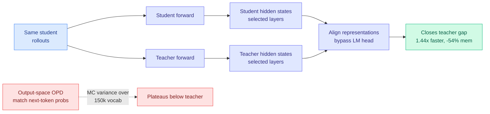
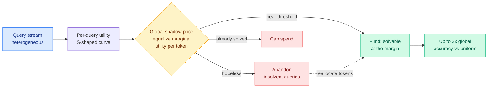
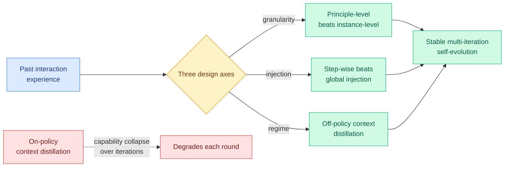
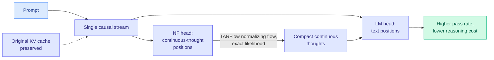
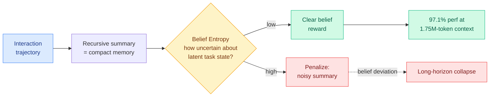

# cere-bro | 2026-06-05

> Distillation found a new place to live the same morning Anthropic claimed AI now writes most of its own code, and the question both raise is the same one: when models train models, what is the right space to do it in.

---

## TL;DR

- **OPRD** (new distillation paper): match teacher hidden states instead of output tokens. First method to close the student-teacher gap on AIME math benchmarks.
- **Anthropic ships "When AI builds itself"**: Claude writes over 90% of Anthropic's own code, engineers ship 8x more per quarter than five years ago.
- **Continual Experience Internalization** flips spring orthodoxy: for iterative experience transfer, off-policy beats on-policy distillation.
- **Four agent self-improvement papers** today (MLEvolve, EvoDS, CEI, MMPO), same week NVIDIA's Nemotron 3 Ultra ships targeting long-running agents.
- **CLEAR**: treats inference compute as one shared budget across a batch of queries via a single shadow price. Up to 3x accuracy when compute is scarce.
- **The pattern**: research is figuring out how to ration thinking exactly as GitHub Copilot moves to usage-based billing and the SpaceX-Cursor compute deal lands.

---

## Deep Dives

### OPRD: stop distilling in output space, distill the representations

> Every on-policy distillation paper this spring argued about which output tokens to keep. OPRD says the output space is the wrong space: align the hidden states instead, and the token-selection problem dissolves while the student finally catches the teacher.

**Source:** HuggingFace Daily Papers
**Links:** [Paper](https://arxiv.org/abs/2606.06021) · [Code](https://github.com/ShenzhiYang2000/OPRD) · [Wiki summary](../../inference-efficiency/2026-06-05-oprd-on-policy-representation-distillation.md)

**What is it about?**
OPRD (On-Policy Representation Distillation) trains a small student on its own rollouts, but instead of matching the teacher's next-token output probabilities, it aligns the student's and teacher's internal hidden-state representations at selected layers, bypassing the language-model head (the final layer that turns hidden states into token probabilities) entirely.

**What problem does it solve?**
Output-only distillation has two leaks. It pays a permanent Monte-Carlo variance tax from estimating a KL divergence over a ~150,000-token vocabulary (Qwen-scale), and it treats the teacher as a black box, discarding every intermediate computation once the LM head fires. Both cap how close the student can get.

**What is the core novelty?**
Lifting the distillation loss from token-probability space into hidden-state space. Because representations are compared directly, the loss has no sampling variance by construction, and the per-layer alignment gives the student far richer structural supervision than a single output distribution.

**Key takeaways**
- Closes the student-teacher gap on AIME 2024, AIME 2025, and AIMO, where output-space on-policy distillation plateaus strictly below the teacher. Reaching the teacher at all is rare for distillation.
- Trains 1.44x faster and uses 54% less memory than top-k output-space distillation, since there is no large-vocabulary KL estimate to compute or top-k bookkeeping to carry.
- Variance-free supervision throughout training, not just an annealed reduction.

**Gaps in the study**
Representation alignment needs architecturally compatible (or projected) student and teacher widths; the abstract does not show behavior under the cross-tokenizer or cross-architecture mismatch that the byte-level and Tide distillation lines handle. Which layers to align, and how many, is an unablated hyperparameter.

**Industrial implication**
For any team distilling a small reasoning model from a larger one with the same architecture family, OPRD is a cheaper, lower-memory recipe that actually reaches the teacher rather than approaching it. If the representation-alignment trick survives architecture mismatch, it could displace the whole output-space top-k machinery.

→ [Full summary](../../inference-efficiency/2026-06-05-oprd-on-policy-representation-distillation.md)

---

### The Shadow Price of Reasoning: ration thinking like a budget

> Most inference-scaling work decides how long one query should think. CLEAR asks how to split a fixed token budget across a whole batch, and the answer is to abandon the hopeless queries and pour their tokens into the ones sitting right at the edge of solvability.

**Source:** HuggingFace Daily Papers
**Links:** [Paper](https://arxiv.org/abs/2606.03092) · [Wiki summary](../../inference-efficiency/2026-06-05-clear-shadow-price-reasoning-budget.md)

**What is it about?**
CLEAR (Constrained Latent-utility Equilibrium Allocation for Reasoning) treats the total inference-token budget for a batch of queries as a scarce resource and decides how many tokens each query gets, including the option to serve zero. It is a cross-query allocation policy, not a per-query length controller.

**What problem does it solve?**
Standard deployment gives every query the same maximum-token cap. But the relationship between tokens spent and accuracy gained is S-shaped and very different across queries: some need a lot before they surge, some are hopeless within budget, some are already solved. A uniform cap wastes tokens on both the hopeless and the already-solved.

**What is the core novelty?**
Framing the allocation as a constrained economic optimization whose Lagrange multiplier is a global "shadow price," the marginal accuracy one more token would buy. The optimal policy equalizes that marginal value across every funded query, which produces "rational abandonment": stop funding queries below their emergence threshold and reallocate to queries just under it.

**Key takeaways**
- Up to 3x higher global accuracy than uniform allocation in resource-scarce regimes.
- Improves the Pareto frontier of total token cost versus mean accuracy across multiple reasoning tasks and traffic patterns.
- The mechanism is a routing primitive on a new axis: not which model, but how much of a shared compute pool each query gets.

**Gaps in the study**
The S-curve must be estimated online from partial generations, and the abstract does not say how reliably the emergence threshold can be predicted *before* the surge, which is exactly when the fund-or-abandon call is made. Tested on verifiable-answer reasoning; open-ended generation has no clean utility signal. Abandonment also imposes a fairness and latency cost on the dropped user that a pure global-accuracy objective ignores.

**Industrial implication**
This is the serving-side complement to per-query compression. A batch scheduler that knows each query's position on its utility curve can hold mean accuracy under a tight budget far better than a fixed cap, which is exactly the lever that matters now that compute is metered rather than free.

→ [Full summary](../../inference-efficiency/2026-06-05-clear-shadow-price-reasoning-budget.md)

---

### Rethinking Continual Experience Internalization: off-policy beats on-policy, this time

> The spring's distillation orthodoxy was on-policy. This paper runs experience internalization over many rounds and finds on-policy collapses while off-policy compounds, a direct challenge to the consensus on the same day OPRD doubles down on on-policy.

**Source:** HuggingFace Daily Papers (15 upvotes)
**Links:** [Paper](https://arxiv.org/abs/2606.04703) · [Wiki summary](../../agentic-systems/2026-06-05-continual-experience-internalization.md)

**What is it about?**
Experience internalization converts what an agent learned from past interactions (normally held in its context) into reusable parametric capability, via context distillation: an experience-aware teacher supervises an experience-free student. This paper studies what happens when you do it *repeatedly*, round after round, which is what continual self-evolution actually requires.

**What problem does it solve?**
Prior work only measured single-round transfer. Run it iteratively and existing methods show progressive capability collapse instead of compounding gains. The paper diagnoses why and ships a recipe that stays stable.

**What is the core novelty?**
A systematic dissection across three axes with a clear verdict on each: principle-level experience is more durable than instance-level (it abstracts transferable strategy away from trajectory detail); step-wise injection beats global injection (it aligns experience with intermediate decision states, critical for long-horizon tool use); and off-policy context distillation on high-quality teacher trajectories is far more stable than on-policy, which is limited by correcting only the flawed states the student itself produces.

**Key takeaways**
- On-policy context distillation collapses over iterations; off-policy compounds. This contradicts the spring's on-policy consensus head-on.
- Principle-level, step-wise, off-policy is the stable recipe for self-evolving agents.
- The instability is specifically a multi-iteration phenomenon, invisible in the single-round experiments prior work ran.

**Gaps in the study**
"Off-policy is more stable" is shown for experience internalization on agent trajectories; whether it generalizes to reasoning-model distillation (where OPRD argues on-policy in representation space is fine) is untested, and the two papers never meet. No measurement of whether off-policy's stability trades against a ceiling that on-policy would eventually exceed.

**Industrial implication**
For anyone building agents that learn continually in production, the message is to distill principle-level lessons off-policy from strong trajectories, not to keep correcting the agent's own mistakes on-policy. That is the opposite of the instinct most RL-flavored agent loops follow today.

→ [Full summary](../../agentic-systems/2026-06-05-continual-experience-internalization.md)

---

### NF-CoT: latent reasoning that keeps the KV cache

> Latent reasoning is faster than spelling out every thought as text, but earlier attempts broke left-to-right decoding, probabilistic sampling, and KV-cache reuse. NF-CoT keeps all three by modeling continuous thoughts with a normalizing flow.

**Source:** HuggingFace Daily Papers
**Links:** [Paper](https://arxiv.org/abs/2606.06447) · [Wiki summary](../../llms-foundation-models/2026-06-05-nf-cot-latent-reasoning-normalizing-flows.md)

**What is it about?**
NF-CoT does chain-of-thought reasoning in a compact continuous latent space instead of as explicit text tokens. Chain-of-thought (CoT) is the practice of making a model write out intermediate reasoning steps; latent reasoning does that computation in continuous vectors before committing to any words.

**What problem does it solve?**
Textual CoT forces every reasoning step through a discrete, serial token stream, which is slow and wasteful when the underlying update is semantic or only half-formed. But prior latent-reasoning methods threw away the things that make CoT work in a normal language model: left-to-right generation, probabilistic sampling, KV-cache decoding (reusing past attention computations), and tractable likelihoods.

**What is the core novelty?**
Modeling the continuous thoughts with a normalizing flow (a TARFlow-style invertible model that gives exact probability densities) placed inside the LLM backbone. Continuous-thought positions are produced by a normalizing-flow head, text positions by the standard LM head, in one causal stream. That yields exact likelihoods for latent thoughts, probabilistic left-to-right decoding with the original KV cache intact, and direct policy-gradient training in latent space.

**Key takeaways**
- Improves pass rates over both explicit-CoT and prior latent-reasoning baselines on code generation, while cutting intermediate-reasoning cost.
- Keeps KV-cache compatibility, which most latent-reasoning methods sacrifice, so it is deployable in a normal autoregressive serving stack.
- Exact latent likelihoods make it directly trainable with reinforcement learning in the latent space.

**Gaps in the study**
Demonstrated on code generation; whether the continuous-thought representation helps on math or open-ended reasoning, where the latent step structure differs, is not shown. The cost of the normalizing-flow head versus the tokens it saves is not broken out at scale.

**Industrial implication**
Latent reasoning that preserves the KV cache is the version a production serving system could actually adopt, because it does not force a rewrite of the decoding path. If the pass-rate gains hold beyond code, it is a route to cheaper reasoning without longer text traces.

→ [Full summary](../../llms-foundation-models/2026-06-05-nf-cot-latent-reasoning-normalizing-flows.md)

---

### RL elicits contextual learning of unseen-language translation

> Today's most upvoted paper teaches a model not a language but a skill: how to use grammar, morphology, and a dictionary handed to it in context, so it can translate a language it has never seen.

**Source:** HuggingFace Daily Papers (19 upvotes)
**Links:** [Paper](https://arxiv.org/abs/2606.06428) · [Wiki summary](../../llms-foundation-models/2026-06-05-rl-contextual-learning-unseen-translation.md)

**What is it about?**
A reinforcement-learning method (from the University of Zurich, Rico Sennrich's group) that trains a model to translate extremely low-resource or entirely unseen languages by exploiting linguistic resources given in its prompt: grammar descriptions, morphological tables, and lexicons. The reward is chrF, a simple surface-level character-overlap translation metric.

**What problem does it solve?**
Both continued training on a new language and plain in-context learning tend to overfit the specific languages they see, with weak zero-shot transfer to genuinely new ones. The authors argue scale demands a meta-skill instead: the ability to *use* in-context linguistic knowledge, which they call contextual leveraging.

**What is the core novelty?**
Using RL with a lightweight, verifiable surface reward (chrF) to optimize the model's ability to extract and apply heterogeneous in-context linguistic resources, rather than optimizing translation of any one language pair. It reframes low-resource translation as a meta-learning problem solved by outcome-based RL.

**Key takeaways**
- RL-trained models translate completely unseen languages better than in-context learning or supervised fine-tuning.
- A lightweight surface reward is enough; no learned reward model or human preference data needed.
- Outcome-based RL extends beyond math and code to language learning from context, widening where RL with verifiable rewards (RLVR, where each rollout gets one scalar correctness reward) applies.

**Gaps in the study**
chrF is a coarse reward that rewards character overlap, not meaning; whether it pushes the model toward genuinely faithful translation or toward surface-matching is the obvious risk, and the abstract does not address reward hacking. Coverage across language families and script types is not detailed.

**Industrial implication**
If RLVR reliably teaches "use the grammar book in context," the same recipe could extend to any task where the answer is checkable and the relevant knowledge can be handed over at inference, which is most retrieval-augmented and tool-using settings, not just translation.

→ [Full summary](../../llms-foundation-models/2026-06-05-rl-contextual-learning-unseen-translation.md)

---

### MMPO: supervise agent memory by how confused it leaves the agent

> Long-horizon agents compress their history into recursive summaries, and the summaries quietly accumulate noise until the agent loses the plot. MMPO measures that confusion directly and penalizes the summaries that cause it.

**Source:** HuggingFace Daily Papers
**Links:** [Paper](https://arxiv.org/abs/2605.30159) · [Wiki summary](../../agentic-systems/2026-06-05-mmpo-metacognitive-memory-policy-optimization.md)

**What is it about?**
MMPO (Metacognitive Memory Policy Optimization) trains the memory policy of a long-horizon agent, the rule that decides how to summarize a growing interaction history into compact memory. It supervises that policy on the *quality of each intermediate summary*, not just the final task outcome.

**What problem does it solve?**
Memory policies are usually trained with outcome-based RL, which gives one sparse reward at the end. That cannot localize *where* a summary started discarding task-relevant information or injecting noise. The result is belief deviation: the agent's internal estimate of the task state drifts from reality and long-horizon reasoning derails.

**What is the core novelty?**
Belief Entropy, a self-supervised proxy that probes how uncertain the model still is about the latent task state given its current memory. MMPO turns that into dense, memory-specific supervision: summaries that leave the model confused (high epistemic uncertainty) are explicitly penalized, alongside the usual outcome signal.

**Key takeaways**
- Maintains 97.1% performance even at 1.75-million-token contexts, where uncompressed history is infeasible.
- Dense per-summary supervision beats sparse outcome-only RL at localizing memory degradation.
- Belief Entropy needs no labels, so it scales to long interactions without annotation.

**Gaps in the study**
Belief Entropy is a proxy for task-state uncertainty; whether a confident-but-wrong summary (low entropy, high error) slips through is the obvious failure mode and is not directly addressed. The benchmarks are summary-heavy tasks; transfer to agents whose memory holds actions and tool outputs, not just text, is open.

**Industrial implication**
For production agents that run for hours and recursively summarize, a training signal that catches noisy memory mid-trajectory is the difference between an agent that holds its task and one that quietly drifts. It pairs naturally with yesterday's MemTrain (self-supervised memory pre-training) as the supervision layer on top.

→ [Full summary](../../agentic-systems/2026-06-05-mmpo-metacognitive-memory-policy-optimization.md)

---

## Industry Pulse

- **Anthropic published "When AI builds itself,"** claiming Claude writes over 90% of Anthropic's code, engineers ship 8x more per quarter than 2021-2025, and a preview model beat human researchers' next-step calls 64% of the time vs 22% in 2024 ([Anthropic](https://www.anthropic.com/institute/recursive-self-improvement)).
- **NVIDIA shipped Nemotron 3 Ultra** (550B total, 55B active, 1M-context open weights, 5x faster inference, ~30% lower agentic cost), the top US open-weights score on the Artificial Analysis index, with early adopters Perplexity, Palantir, ServiceNow ([NVIDIA](https://nvda.ws/4x9nGps)).
- **Prime Intellect joined NVIDIA's Nemotron Coalition,** contributing 2,500+ open reinforcement-learning environments, the verifiers framework, and Prime Sandbox to post-train open models into reliable agents ([Prime Intellect](https://primeintellect.ai/blog/nemotron-coalition)).
- **NVIDIA also launched Cosmos 3,** an open omnimodal world model unifying text, image, video, sound, and robot action via a mixture-of-transformers backbone for physical AI ([NVIDIA](https://nvda.ws/4uCj7Cf)).
- **OpenAI rolled out "Dreaming,"** a ChatGPT memory system that synthesizes and updates user context in the background across conversations without explicit save requests, to US Plus and Pro users ([via @eliebakouch](https://nitter.net/eliebakouch/status/2062693979087397189#m)).
- **The free-compute era ended:** GitHub Copilot moved to usage-based billing June 1, and the SpaceX-Cursor deal (a million-H100-equivalent supercomputer wired to a coding tool, $60B option) reads as compute-alignment lock-in ([Kilo blog](http://blog.kilo.ai/p/the-github-copilot-news-is-just-the)).
- **Pinterest signed a $4B AWS deal** through 2031, its largest ever, using Trainium and Graviton to train and serve discovery models for 600M+ users ([AWS](https://www.aboutamazon.com/news/aws/pinterest-aws-4-billion-ai-infrastructure-deal)).
- **Quantinuum IPO'd on Nasdaq (QNT),** raising $1.68B at a ~$15.6B valuation, 20x oversubscribed, the largest quantum listing on record ([Quantum Zeitgeist](https://quantumzeitgeist.substack.com/p/quantinuum-lists-on-nasdaq)).
- **Frontier-lab CEOs signed a biorisk letter:** Altman, Amodei, Hassabis and others urged Congress to raise biosecurity, framed by Anthropic's Logan Graham as a step toward biodefense ([via @logangraham](https://nitter.net/logangraham/status/2062593859155284345#m)).
- **Google demoed passive heart-rate monitoring** via the front-facing smartphone camera, hitting industry accuracy standards across skin tones ([Google Research](http://goo.gle/4dQTc2B)).

---

## Global View

**Distillation changed the space while industry claimed the outcome, and the two are arguing past each other.** OPRD lifts on-policy distillation out of output space into representation space, finally closing the AIME teacher gap that the spring's token-selection line (TIP under 10% of tokens, TA-OPD reachable tokens, TrOPD reliable tokens, FiRe soft-weighting) could not, while the same-day Continual Experience Internalization paper finds that for iterative experience transfer off-policy beats on-policy, which collapses round over round, a direct challenge to the on-policy orthodoxy. Anthropic's "When AI builds itself" is the industrial face of the same models-training-models loop, reporting Claude now writes 90%+ of Anthropic's code and improved researcher decisions 64% of the time, a claim @eliebakouch immediately flagged as possibly confounded by which model version researchers had access to. The research is fighting over the mechanism (which space, which policy) precisely as industry markets the outcome (acceleration), and nobody has yet tested whether OPRD's representation alignment dodges the multi-iteration collapse the experience paper documents.

**Self-evolving agents converged into a research frame the same week NVIDIA shipped the substrate to run them.** Four papers today attack sustained agent self-improvement from different angles: MLEvolve (cross-branch memory for ML-algorithm discovery, beating AlphaEvolve), EvoDS (autonomous skill acquisition plus learned context compression, +28.9%), Continual Experience Internalization (the stable multi-round recipe), and MMPO (Belief Entropy to keep recursive memory clear at 1.75M tokens), a clear four-of-a-kind on the "agents that improve themselves" claim. Industry shipped the matching layer the same morning: NVIDIA's Nemotron 3 Ultra is explicitly built "for long-running agents," and Prime Intellect handed the Nemotron Coalition 2,500+ reinforcement-learning environments, the training substrate self-evolution needs. Research is mapping exactly how self-evolving agents break (capability collapse, belief deviation, out-of-token failures) at the moment industry productizes the agents that will hit those walls.

**Inference compute became an economic-allocation problem the same week it stopped being free.** CLEAR formalizes cross-query token budgeting with a shadow price and rational abandonment for up to 3x accuracy under scarcity, extending the wiki's recurring finding that more compute is not monotonically better (Adaptive RePoT, 05-31, where checkpoint repair helped strong models and hurt weak ones). The industry signal is unambiguous: GitHub Copilot moved to usage-based billing on June 1 and the SpaceX-Cursor compute deal reads, per Kilo, as a compute-alignment lock-in, both symptoms of compute scarcity now being the binding constraint that gets priced. Research is deriving the optimal way to ration thinking across queries exactly as deployment starts metering it per token, which is the rare case where the academic objective (maximize accuracy under a hard budget) and the commercial one converge.

---

## Looking Ahead

- **OPRD's representation-space distillation gets tested under multi-iteration experience internalization within 60 days, and the result decides whether on-policy was wrong or just in the wrong space.** Today OPRD (on-policy, representation space) and Continual Experience Internalization (off-policy wins, output space) never meet. **Signal:** a paper that runs representation alignment over repeated rounds and reports whether it avoids the capability collapse the experience paper found for on-policy output-space distillation.
- **A CLEAR-style cross-query token-budget scheduler ships in a production serving framework within 90 days.** The shadow-price allocation is a drop-in for any batched reasoning server, and metered compute makes the payoff immediate. **Signal:** vLLM, SGLang, or TensorRT-LLM adds a batch-level token-budget allocator with query abandonment, citing a marginal-utility or shadow-price objective.
- **Anthropic's recursive-self-improvement claim draws a measurement-rigor pushback within 30 days.** The 8x-code and 64%-decision figures invite the confound @eliebakouch already named (model-version access not held constant). **Signal:** a critical analysis or benchmark post disputing the RSI framing as confounded by release timing or selection of sessions.
- **LLM-rated underrated to track:** Kurate's cs.LG board this week tops out at "Tensor decompositions for learning latent variable models" (a 2012 classic resurfacing, ai_rating 9.2) and "How to Scale Mixture-of-Experts: From muP to the Maximally Scale-Stable Parameterization" (9.0), with "A Bitter Lesson for Data Filtering" (Hashimoto/Duchi, 7.5) also high and none in today's HuggingFace top. The scale-stable-parametrization line stays undervalued on the popularity feed, the same thread the GDN-μP and MoE-μP papers extend. Also flagged: "LLMs Gaming Verifiers: RLVR can Lead to Reward Hacking" (cs.LG #12), a direct caution for today's RL-translation-via-chrF recipe. **Signal:** if a follow-up applies the Maximally Scale-Stable Parameterization to a shipped open MoE by July, the parametrization thread is validated.
- **Rising authors from Kurate:** this week's threshold-crossers are all clinical and physiology foundation-model clusters, the Guy Lutsker / Gal Sapir / Jordi Merino group on a generative multimodal model of human physiology (cs.AI #1, ai_rating 7.8) and the Andrew Zhang / Tong Ding group on a virtual-patient foundation model (cs.LG #1, ai_rating 8.2). Neither touches routing, KV cache, compression, or GPU work, so neither warrants a Twitter-handle add. **Signal:** none actionable for the handle list; revisit only if a follow-up from either group crosses into efficiency or agents.
