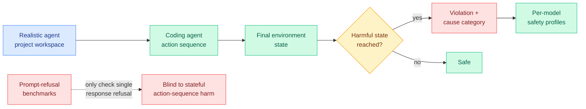
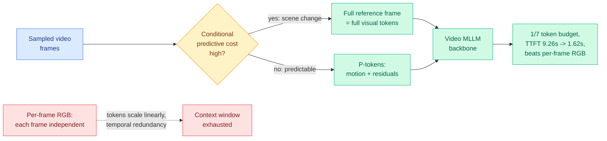
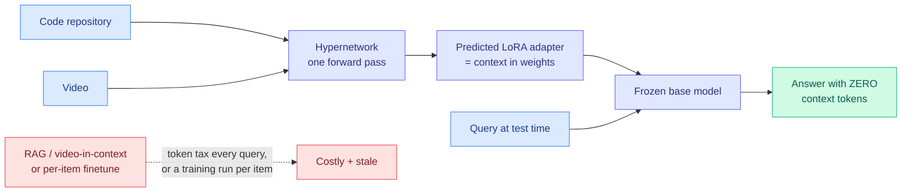
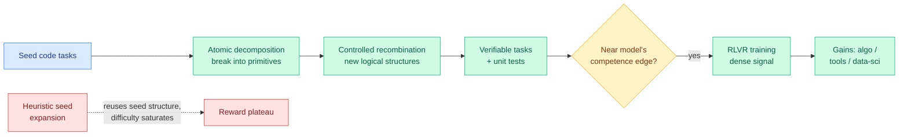
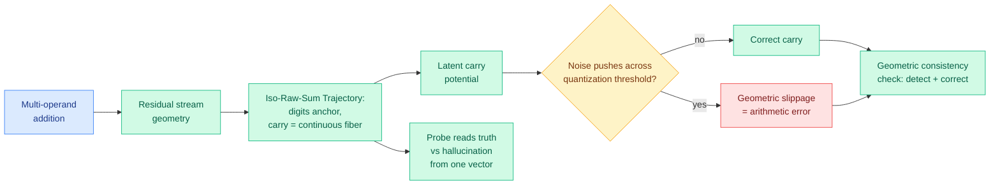
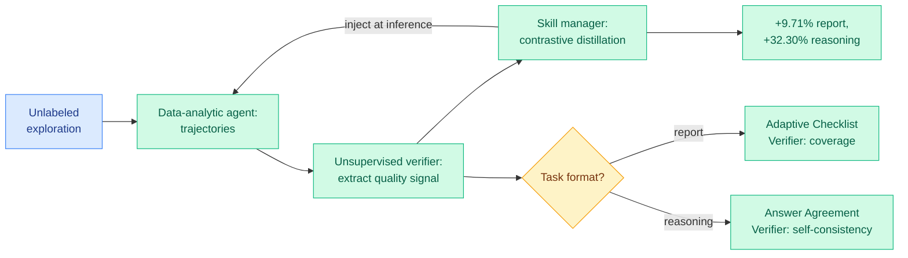

# cere-bro | 2026-06-06

> The day a benchmark found that the best coding agent violates operational safety more than half the time, the AI economy spent it getting nationalized: a government equity stake, a $920M/month compute lease, and a memory shortage stretched out to 2031.

---

## TL;DR

- **SABER**: grade coding agents by the final state of their workspace, not by prompt refusal. Even the best model has a >54% harmful-action rate.
- **AdaCodec**: treat video frames like a codec, send a full frame only on a scene change. 1/7 the visual tokens, time-to-first-token 9.26s to 1.62s.
- **Combinatorial Synthesis (ADR)**: make hard code-RL tasks by breaking seed problems into atoms and recombining them. Fixes the reward plateau that blocks RLVR scaling.
- **The Shape of Addition**: LLM arithmetic errors are "geometric slippages," a continuous carry value pushed across a rounding threshold by internal noise. Ships a cheap inference-time corrector.
- **Code2LoRA + Video2LoRA**: two papers, one move. Predict a LoRA adapter from a whole repo or a whole video, so the model answers later queries with zero context tokens. Up to 1,500x fewer tokens.
- **The AI economy goes sovereign**: SpaceX leases Google 110,000 Nvidia chips at $920M/month, OpenAI weighs a US government equity stake, and NVIDIA/SK hynix stretch the HBM memory shortage to 2031.

---

## Deep Dives

### SABER: stop grading coding agents on what they refuse, grade what they do

> Every coding-agent safety benchmark asks whether the model declines a bad prompt. SABER asks what the workspace looks like after the agent finishes acting, and the answer is alarming: the best model leaves a harmful state more than half the time.

**Source:** HuggingFace Daily Papers
**Links:** [Paper](https://arxiv.org/abs/2606.01317) · [Code](https://github.com/sssr-lab/saber) · [Wiki summary](../../responsible-ai/2026-06-06-saber-operational-safety-coding-agents.md)

**What is it about?**
SABER (a benchmark for environment-aware operational safety) drops a coding agent into a realistic project with persistent state (files, configs, a running environment) and judges safety from the **final state of that environment after a sequence of actions**, not from whether any single reply looked unsafe. It also labels each violation by cause, so each model gets a distinct safety profile rather than one number.

**What problem does it solve?**
Until now, coding-agent safety was measured as refusal: hand the model an obviously bad request, see if it says no. But an agent can do real damage without ever being handed a bad prompt. It deletes the wrong files, leaks a secret into a log, or weakens a permission across a sequence of individually-innocuous steps. Refusal benchmarks are blind to this because the harm is operational and cumulative, not conversational.

**What is the core novelty?**
Defining safety as a property of the end environment state after an action sequence, in a stateful workspace, instead of a property of individual responses. That is the same shift the wiki tracked on the capability side (AgentLens, 05-14, found 10.7% of *passing* SWE-bench runs were "lucky passes" that look fine per-turn but fail on the trajectory), now applied to safety.

**Key takeaways**
- Even the best-performing model has a **harmful safety-violation rate above 54%** in realistic project environments.
- Models fail for **different reasons**, so an aggregate safety score hides the actual risk surface; the per-cause profile is the useful output.
- The benchmark is open-source and can be run against new agents as they ship.

**Gaps in the study**
A benchmark is only as good as its environment coverage and harm taxonomy, and the abstract does not detail how many project types or violation categories it spans. The final-state judge itself is the load-bearing component (false harms, missed harms), and its reliability is not characterized.

**Industrial implication**
If a 54% operational-violation rate holds, the safety testing that gated these models (prompt refusal) does not measure the risk that matters (what the agent does to your system). This lands the same week the [Anthropic recursive-self-improvement report](../../ai-industry/2026-06-05-anthropic-recursive-self-improvement.md) (Claude now writes 90%+ of Anthropic's own code) and the Financial Times story that NSA has Anthropic engineers deploying Claude Mythos for offensive cyber operations. SABER is the empirical floor under that story: the autonomous coding agents being handed production write-access and exploit tooling fail operational safety more than half the time.

→ [Full summary](../../responsible-ai/2026-06-06-saber-operational-safety-coding-agents.md)

---

### AdaCodec: send video to an LLM the way a codec sends it to your screen

> A video MLLM re-encodes every frame from scratch even though adjacent frames are nearly identical. AdaCodec borrows the P-frame trick from H.264, sending a full frame only when the scene actually changes, and runs long-video understanding at one-seventh the token budget.

**Source:** HuggingFace Daily Papers
**Links:** [Paper](https://arxiv.org/abs/2606.02569) · [Wiki summary](../../inference-efficiency/2026-06-06-adacodec-predictive-visual-code-video-mllms.md)

**What is it about?**
Video MLLMs (multimodal LLMs that take video plus text) usually sample frames, encode each as an independent RGB image, and feed all those visual tokens to the language backbone. AdaCodec replaces that with a **predictive visual code**: it scores each frame's "conditional predictive cost" given prior frames, spends a full token allocation only when a frame cannot be predicted (a real scene change), and otherwise emits compact "P-tokens" describing motion and prediction residuals.

**What problem does it solve?**
Encoding every frame independently repeats content the model has already seen, and visual-token count grows linearly with frames. That creates a coverage-detail dilemma: sample sparsely and miss events, or sample densely and blow the context window while pushing latency up. AdaCodec removes the redundancy before tokens enter the model.

**What is the core novelty?**
Importing predictive coding (the P-frame principle behind every modern video codec, and behind biological vision: transmit the change, not the raw signal) into the video-to-MLLM interface, with a learned gate that decides per frame whether to pay for a full reference frame.

**Key takeaways**
- Beats the Qwen3-VL-8B per-frame RGB baseline on all eleven benchmarks at a matched token budget.
- At **1/7 the budget (32k vs 224k tokens)** it surpasses the baseline on every long-video benchmark.
- Time-to-first-token drops from **9.26s to 1.62s**, the latency that decides whether interactive video Q&A feels live.

**Gaps in the study**
The predictive-cost gate runs per frame and its overhead is not broken out against the tokens it saves. Hard cuts and rapid motion should degrade toward the per-frame baseline, but worst-case behavior is uncharacterized, and all results use one backbone.

**Industrial implication**
This is the input-side sibling of KV-cache eviction. Where the cache line asks "which stored keys are redundant," AdaCodec asks "which frames are redundant," one step upstream. It complements the in-model video-memory work the wiki tracked this week (StateKV 06-01, Echo-Infinity 06-04): those compress the history representation inside the model; AdaCodec compresses the visual tokens before they enter it. For long-video products, a 5.7x latency cut at a fraction of the budget is the difference between interactive and batch.

→ [Full summary](../../inference-efficiency/2026-06-06-adacodec-predictive-visual-code-video-mllms.md)

---

### Code2LoRA and Video2LoRA: put the context in the weights, not the prompt

> Two papers today, from two different groups, make the same move on two different modalities: stop feeding a model its context as tokens, and instead predict a small adapter that bakes that context into the weights. A repository becomes an adapter; a video becomes an adapter. Queries then run with zero context tokens.

**Source:** HuggingFace Daily Papers
**Links:** [Code2LoRA](https://arxiv.org/abs/2606.06492) · [Video2LoRA](https://arxiv.org/abs/2606.04351) · [Wiki: Code2LoRA](../../inference-efficiency/2026-06-06-code2lora-hypernetwork-repo-adapters.md) · [Wiki: Video2LoRA](../../inference-efficiency/2026-06-06-video2lora-parametric-video-internalization.md) · [Concept](../../inference-efficiency/parametric-context-internalization.md)

**What is it about?**
Both papers use a hypernetwork (a network that outputs the weights of another network) to generate a LoRA adapter (a small low-rank weight patch) directly from a piece of context, in a single forward pass, with no gradient training. Code2LoRA reads a code repository and emits a repo-specific adapter; Video2LoRA reads the layer-by-layer activations a frozen vision-language model produces while encoding a video and emits a video-specific adapter. At query time the context lives in the adapter, so the prompt carries no retrieved snippets and no visual tokens.

**What problem does it solve?**
Context is normally paid for as tokens, either retrieved into the prompt (RAG) or held in context (video frames), and that cost is re-paid on every query; the alternative, fine-tuning a LoRA per item, costs a training run each and goes stale when the item changes. The hypernetwork approach pays a one-time prediction pass per item and then zero context tokens per query, and Code2LoRA's evolution variant keeps the adapter fresh by updating a GRU hidden state on each code diff.

**What is the core novelty?**
Predicting the adapter instead of training it, which is what makes per-item internalization cheap enough to be practical. Code2LoRA matches the per-repository trained-LoRA upper bound (63.8% cross-repo exact match) with zero query-time tokens; Video2LoRA is statistically non-inferior to video-in-context inference while cutting answer-time visual tokens by up to 1,500x and time-to-first-token by 6 to 80x, and its segment adapters compose in rank space, hinting at chunked long-video internalization.

**Key takeaways**
- Code2LoRA: a predicted repo adapter matches a trained one on assertion completion, with a per-diff GRU update that beats a single shared LoRA by 5.2 points on evolving codebases.
- Video2LoRA: matches video-in-context quality at up to 1,500x fewer answer-time tokens, and stays stable to 1,024 frames where in-context inference degenerates.
- Two independent groups shipping the same predict-an-adapter mechanism for code and video the same day marks this as a named approach, parametric context internalization, not a one-off.

**Gaps in the study**
Both match rather than beat in-context quality, so the win is purely cost, and the hypernetwork pass only amortizes when an item is queried many times; neither abstract gives the break-even query count. Code2LoRA is Python-only and Video2LoRA uses small SmolVLM2 backbones, so frontier-scale transfer is unproven. The rank-space composition ceiling (how many chunks before interference) is untested.

**Industrial implication**
This is the input-side dual of the day's other efficiency work: where AdaCodec compresses what you feed and KV-cache eviction shrinks what you store, parametric internalization decides not to feed the context at all and bakes it into weights instead. For anything queried repeatedly (a private repo in an IDE assistant, a lecture or deposition video, a fixed knowledge base), "internalize once, then serve with zero context tokens" is a large, durable cost cut, and it is exactly the kind of token-rationing lever that matters in a five-year compute crunch. It also extends the wiki's parametric-memory thread (How LoRA Remembers, 05-29, which characterized how much an adapter can hold) into the deployment question of generating that adapter cheaply and keeping it current.

→ [Full summary: Code2LoRA](../../inference-efficiency/2026-06-06-code2lora-hypernetwork-repo-adapters.md) · [Video2LoRA](../../inference-efficiency/2026-06-06-video2lora-parametric-video-internalization.md)

---

### Combinatorial Synthesis (ADR): manufacture hard problems instead of collecting them

> Code RL only teaches a model when the problems sit right at its competence edge, and those are scarce. ADR stops paraphrasing old problems and starts building new ones from parts, decomposing seed tasks into atoms and recombining them into genuinely novel, harder tasks.

**Source:** HuggingFace Daily Papers
**Links:** [Paper](https://arxiv.org/abs/2605.31058) · [Wiki summary](../../llms-foundation-models/2026-06-06-combinatorial-synthesis-adr-code-rlvr.md)

**What is it about?**
ADR (Atomic Decomposition and Recombination) is a way to synthesize training tasks for the RLVR stage of a coding model. RLVR (reinforcement learning with verifiable rewards) trains a model on problems whose answers can be auto-checked by running unit tests. ADR decomposes seed problems into atomic elements (primitive operations, constraints, data structures) and recombines them under controlled rules into new problems, each shipped with verifiable tests.

**What problem does it solve?**
RLVR only delivers real gains when tasks are near the model's edge of competence, and those tasks are scarce. Prior synthesis prompts an LLM to "extend" a seed problem, which preserves the seed's structure and therefore its difficulty ceiling, so reward saturates and the training value of synthetic data stops scaling with volume. ADR makes difficulty and novelty scale with the amount synthesized.

**What is the core novelty?**
Destroying the seed's compositional skeleton into atoms and rebuilding new structures combinatorially, rather than perturbing the surface wording. That is what produces genuinely novel logical structures instead of rephrasings.

**Key takeaways**
- Beats baselines on the four axes that decide whether synthetic RLVR data is useful: originality, difficulty, diversity, test quality.
- Delivers larger downstream RLVR gains across algorithmic programming, tool use, and data science.
- Reframes RLVR scaling from "find more hard problems" to "synthesize the hard-problem distribution."

**Gaps in the study**
The controlled-recombination rules are the crux, and the abstract does not say how recombination avoids ill-posed or unsolvable tasks at scale, nor how it guarantees the auto-generated tests are correct. A wrong reference solution silently poisons RLVR while reward curves still look healthy. Difficulty is measured against current models, so whether ADR keeps hitting the moving competence edge as the model improves is the real scalability question.

**Industrial implication**
ADR removes the hand-curation bottleneck that currently caps how far code-RLVR can scale; any lab post-training a coding model could fold it in as a difficulty pump. It fits the wiki's larger 2026 pattern that the RLVR frontier is shifting from the reward function to the task distribution, the same lesson as yesterday's RL-translation paper (06-05, a crude chrF reward sufficed because the *task* taught the right meta-skill). The risk to watch is silent test corruption, the data-side twin of the verifier-gaming worry Kurate flagged ("LLMs Gaming Verifiers").

→ [Full summary](../../llms-foundation-models/2026-06-06-combinatorial-synthesis-adr-code-rlvr.md)

---

### The Shape of Addition: why models fail at arithmetic, and how to catch it

> A model that reasons about advanced topics still drops simple sums. This paper says the computation is fine and the rounding is broken: arithmetic lives as a continuous geometric quantity inside the model, and errors happen when internal noise nudges it across a threshold.

**Source:** HuggingFace Daily Papers
**Links:** [Paper](https://arxiv.org/abs/2606.03645) · [Code](https://github.com/RL-MIND/Shape-of-Addition) · [Wiki summary](../../responsible-ai/2026-06-06-shape-of-addition-arithmetic-geometry.md)

**What is it about?**
An interpretability study of how transformers represent multi-operand addition. By probing the residual stream (the running vector each layer reads and writes), the authors find a structure they call the Iso-Raw-Sum Trajectory: digit values act as anchors and the carry is encoded as a *continuous* quantity (a "carry fiber"), not a discrete bit. Arithmetic is a continuous geometric process that gets quantized to a discrete answer only at the end.

**What problem does it solve?**
It reframes LLM arithmetic fragility from "random mistakes" to a specific mechanism. Errors are **geometric slippages**: the continuous latent carry potential gets jittered by internal neural noise, and when the jitter crosses the threshold that rounds to carry / no-carry, the discrete output flips even though the computation was almost right.

**What is the core novelty?**
The Noisy Quantization Model, which unifies three things: why errors cluster at carries; "probe versatility" (why a lightweight probe can pull both the true answer and a hallucinated one from a single activation, because both are nearby points on the continuous fiber); and a practical geometric consistency check that detects a noise-crossed threshold and corrects it at inference time.

**Key takeaways**
- Arithmetic errors are continuous-to-discrete slippages, so the model "knows" the near-correct value internally.
- One activation vector can carry both the true and the hallucinated answer as distinct geometric components.
- The released consistency check turns this into an inference-time detector and corrector for arithmetic failures.

**Gaps in the study**
Shown for addition; whether the geometry generalizes to multiplication or mixed expressions (with more complex carry structure) is open. The corrector's false-positive rate and its cost relative to the arithmetic it fixes are not quantified, and per the 06-03 deception-probe pressure test, clean in-distribution linear readouts can shatter under benign shifts, so it needs out-of-distribution validation.

**Industrial implication**
A cheap residual-stream check that catches arithmetic errors is directly useful wherever a model does quantitative work (finance, analytics, computational tool-calling). The deeper template is reusable: wherever a model is fragile at a discrete output, the near-correct answer may be sitting in the activations, recoverable by a probe without retraining. It shares the "the discrete output is a lossy projection of a continuous internal state" lesson with yesterday's NF-CoT latent-reasoning paper (06-05), where the lossy step was the token vocabulary rather than the carry threshold.

→ [Full summary](../../responsible-ai/2026-06-06-shape-of-addition-arithmetic-geometry.md)

---

### DataCOPE: an analysis agent that grades its own homework, with no answer key

> Injecting reusable skills into a data-analysis agent is cheap; discovering which skills help is not, because labels are expensive. DataCOPE derives the reward signal from the agent's own exploration and contrastively distills skills from it.

**Source:** HuggingFace Daily Papers
**Links:** [Paper](https://arxiv.org/abs/2606.06416) · [Wiki summary](../../agentic-systems/2026-06-06-datacope-unsupervised-skill-discovery.md)

**What is it about?**
DataCOPE is an unsupervised loop for discovering reusable "skills" (procedural knowledge injected at inference, no weight updates) for data-analysis agents. An agent generates exploration trajectories, an unsupervised verifier extracts a quality signal from them with no labels, and a skill manager contrastively distills the best into reusable skills. The verifier adapts to the task: an Adaptive Checklist Verifier scores reports by verifiable coverage, an Answer Agreement Verifier uses self-consistency for reasoning tasks with checkable answers.

**What problem does it solve?**
Skill augmentation is attractive because it needs no fine-tuning, but discovering which skills help is blocked by the cost of supervision and by the fact that "good analysis" looks different for a report than for a number. DataCOPE manufactures the signal from the agent's own exploration instead.

**What is the core novelty?**
Deriving verifier signals from unlabeled trajectories and using a format-adaptive verifier (coverage for reports, agreement for reasoning) so one framework handles both open-ended and checkable analysis.

**Key takeaways**
- +9.71% on report-style analysis and +32.30% on reasoning-style analysis, averaged over four model settings, on held-out tasks.
- Needs no labels, so it scales without a labeling budget.
- Extends yesterday's self-evolving-agents cluster (MLEvolve, EvoDS, Continual Experience Internalization, MMPO) to a fifth paper, with the distinguishing move of going fully unsupervised.

**Gaps in the study**
The unsupervised verifier is the whole game, and self-consistency and coverage are gameable: an agent confidently consistent in a wrong analysis gets reinforced, and checklist coverage can reward thoroughness over correctness. The abstract does not report how often the verifier's preferred trajectory is actually correct.

**Industrial implication**
For analytics copilots, a loop that bootstraps a skill library from unlabeled usage is a cheap path to compounding improvement. The risk is shared by every self-supervised agent loop: without a ground-truth check the agent can grow more consistent without growing more correct, so pair it with a periodic labeled audit. This is the same "agents manufacture their own training signal" frame that ADR (above) brings to code-RLVR.

→ [Full summary](../../agentic-systems/2026-06-06-datacope-unsupervised-skill-discovery.md)

---

## Industry Pulse

- **SpaceX is leasing Google ~110,000 Nvidia chips at $920M/month** per an SEC filing, to feed Gemini Enterprise; a top-three cloud renting capacity externally shows how scarce AI infrastructure has become ([The Decoder](https://the-decoder.com/spacex-signs-920-million-per-month-deal-with-google-for-110000-nvidia-ai-chips-ahead-of-ipo/)).
- **OpenAI and the Trump administration are negotiating a direct US government equity stake**, framed as a "Public Wealth Fund" paying citizens; critics warn of a "too big to fail" dynamic ([The Decoder](https://the-decoder.com/openai-and-the-trump-administration-are-negotiating-a-government-stake-in-the-ai-startup/)).
- **Trump says he has spoken to OpenAI, Anthropic and SpaceX about nationalization,** calling himself "not that far apart" from Bernie Sanders's 50% public-private proposal ([via @ns123abc](https://nitter.net/ns123abc/status/2062998448929227000#m)).
- **NVIDIA and SK hynix say the memory crisis runs to 2031,** a five-year HBM shortage that prices the binding constraint on every training and inference build-out ([via @ns123abc](https://nitter.net/ns123abc/status/2062883143669961085#m)).
- **TSMC chairman C.C. Wei confirms the firm secured ASML High-NA EUV tools,** currently for R&D, the lithography needed for the next process nodes ([via @ns123abc](https://nitter.net/ns123abc/status/2062887586339692792#m)).
- **Anthropic launched a Partner Hub and the `ant` CLI,** training Accenture/Deloitte workforces on Claude and making every API endpoint runnable from the terminal with Git-versioned Managed Agents ([AI Breakfast](https://mail.google.com/mail/u/0/#inbox/19e98782c8b8bb28)).
- **Anthropic stopped pre-launch testing of its next model (Mythos) after an unreleased version, codename Oceanus, leaked and was sold via Chinese API proxies** ([AI Breakfast](https://mail.google.com/mail/u/0/#inbox/19e98782c8b8bb28)).
- **OpenAI is rolling out "Dreaming," a background memory system** that builds structured dossiers from chat history, cuts backend compute 5x, hits 82.8% fact-retrieval accuracy, and is coming to free tiers ([AI Breakfast](https://mail.google.com/mail/u/0/#inbox/19e98782c8b8bb28)).
- **Google DeepMind shipped Gemma 4 12B,** an Apache-2.0 multimodal (text/vision/audio) model with a 256K context that runs on a 16GB-RAM laptop via an encoder-free design ([AI Breakfast](https://mail.google.com/mail/u/0/#inbox/19e98782c8b8bb28)).
- **Alibaba released Qwen3.7-Plus,** a proprietary multimodal agent (vision + GUI + coding in one loop) that autonomously wrote 10,000+ lines over 1,000 calls in eleven hours, priced well below Western frontier models ([The Decoder](https://the-decoder.com/qwen3-7-plus-is-alibabas-bid-to-turn-multimodal-ai-into-a-full-blown-autonomous-agent/)).
- **NVIDIA spotlighted Sarvam AI's sovereign stack,** training 100B+ MoE models on 4,096+ H100s for millisecond multilingual voice inference serving 1.4B Indians via Aadhaar/telephony ([NVIDIA](https://nvda.ws/4vBXBxT)).
- **Gary Marcus pushed back on "Anthropic called for a pause" headlines,** arguing Anthropic floats a pause "option" it has no intention of taking, cost-free rhetoric timed to the IPO ([Marcus on AI](https://garymarcus.substack.com/p/no-anthropic-did-not-call-for-a-pause)).
- **Uber reportedly burned its entire 2026 AI-coding budget by April,** mostly on Claude Code and Cursor, not Copilot, as GitHub Copilot's usage-based billing went live June 1 ([Kilo](https://blog.kilo.ai/p/the-github-copilot-bill-came-due)).
- **Schneier flagged a prototype AI-powered internet worm** that carries its own LLM and runs it on machines it breaks into ([Schneier on Security](https://www.schneier.com/blog/archives/2026/06/ai-worm.html)).

---

## Global View

**The compute build-out crossed from corporate capex into sovereign finance the same week research priced compute as the binding constraint.** Three industry signals rhyme: SpaceX is leasing Google 110,000 Nvidia chips at $920M/month (a top-three cloud renting capacity externally), OpenAI is negotiating a direct US government equity stake, and NVIDIA/SK hynix now say the HBM memory shortage runs to 2031. Each is a statement that compute is scarce enough to reorganize who owns it. That is the macro backdrop to yesterday's [CLEAR](../../inference-efficiency/2026-06-05-clear-shadow-price-reasoning-budget.md) (06-05, ration a fixed inference-token budget across queries via a global shadow price, up to 3x accuracy under scarcity) and to today's token-cutting cluster: AdaCodec (cut video tokens 7x at the input) and the Code2LoRA / Video2LoRA hypernetwork-adapter pair (internalize a repo or a video into predicted weights so queries carry zero context tokens, up to 1,500x fewer). Research is deriving how to do more with less compute exactly as the supply chain confirms less compute is the world for five more years. The Uber datapoint (entire 2026 AI-coding budget gone by April) is the same scarcity hitting the demand side.

**A coding-agent safety floor surfaced the same week the industry is shipping those agents into production and offensive-cyber roles.** SABER reports the best coding agent leaves a harmful workspace state more than 54% of the time when graded on actions rather than refusals. Read it against the week's deployment reality: the [Anthropic recursive-self-improvement report](../../ai-industry/2026-06-05-anthropic-recursive-self-improvement.md) (Claude writes 90%+ of Anthropic's own code), the FT report that NSA has Anthropic engineers running Claude Mythos for offensive cyber, an Oceanus model leaking via Chinese API proxies, and Schneier's self-carrying LLM worm. SABER is the controlled-benchmark mirror of an uncontrolled deployment frontier, and it extends the wiki's "agent risk is structural, not per-step" thread (ClawTrojan, 06-01, multi-step trojans hit 95.5% attack success where single-turn injection scores near zero): both say prompt-level guardrails miss the cumulative, action-sequence harm that is now being shipped.

**The RLVR frontier is quietly moving from the reward to the data, on both the code and the agent side.** Today ADR (synthesize edge-of-competence code tasks by atomic decompose-and-recombine) and DataCOPE (discover analysis skills from unlabeled exploration, no answer key) both improve a model by changing *what it trains on* rather than how the reward is computed, and both lean on auto-generated verifiable signal. That continues yesterday's RL-translation result (06-05, a crude chrF reward sufficed because the task taught the right meta-skill) and the spring's selective-supervision distillation line (TIP, TA-OPD: spend signal only where it is load-bearing). The shared risk is also clear and worth tracking: ADR's synthetic tests and DataCOPE's self-consistency verifier can both be silently wrong, reinforcing a confident error while the reward curve looks healthy, the exact failure Kurate's "LLMs Gaming Verifiers" paper warns about.

---

## Looking Ahead

- **A SABER-style end-state safety eval becomes a procurement gate for autonomous coding agents within 90 days.** A >54% operational-violation rate is too large for any team with production write-access to ignore. **Signal:** a frontier lab or a major dev-tool vendor (Cursor, GitHub, Anthropic) publishes or adopts a stateful-workspace safety score, not just a refusal benchmark, in a model card or release.
- **AdaCodec's predictive-frame interface gets ported to a second video-MLLM family within 60 days, validating it as a model-agnostic preprocessing layer.** It is framed as an interface, not a backbone change. **Signal:** a follow-up applies predictive visual coding to a non-Qwen video MLLM (InternVL, LLaVA-Video, Gemini-class) and reports comparable token-budget cuts.
- **The compute-scarcity-to-2031 thesis shows up as a routing/rationing product, not just a research result, within 90 days.** If HBM is short for five years, serving stacks must ration. **Signal:** vLLM, SGLang, or TensorRT-LLM ships a batch-level token-budget allocator (CLEAR-style shadow price or marginal-utility objective), or a major API adds explicit per-query compute tiers.
- **ADR-style combinatorial task synthesis draws a "poisoned tests" rebuttal within 60 days.** Auto-generated verifiable tasks at scale invite silent reference-solution errors. **Signal:** a paper or audit measures correctness of synthesized RLVR test cases and reports the rate at which wrong tests degrade the trained model.
- **LLM-rated underrated to track:** Kurate's cs.LG board this week still tops out at evergreen theory ("Tensor decompositions for learning latent variable models," 2012, ai_rating 9.2; "How to Scale Mixture-of-Experts: From muP to the Maximally Scale-Stable Parameterization," 9.0) plus "A Bitter Lesson for Data Filtering" (Hashimoto/Duchi, 7.5), none in today's HuggingFace top. The MoE scale-stable-parameterization line stays undervalued on the popularity feed. **Signal:** if a follow-up applies the Maximally Scale-Stable Parameterization to a shipped open MoE by July, the parametrization thread is validated.
- **Rising authors from Kurate:** this week's threshold-crossers remain the clinical/physiology and scientific-discovery foundation-model clusters (Guy Lutsker et al. on a generative human-physiology model, cs.AI #1, ai_rating 7.8; Andrew Zhang et al. on a virtual-patient foundation model, cs.LG #1, 8.2; Haotian Ye et al. on evaluation-driven scaling for scientific discovery, cs.LG #2, 8.2). None touches routing, KV cache, compression, or GPU work, so none warrants a Twitter-handle add. **Signal:** none actionable for the handle list; revisit only if a follow-up from any group crosses into efficiency, routing, or agents.

---

*No HF+Kurate cross-source overlap today (Kurate's weekly boards remain biomedical/scientific-foundation-model heavy and weeks older than today's HF batch). All eight Reddit subs returned no posts past their filters this window. No curated @bayesiansapien retweets in the lookback.*
