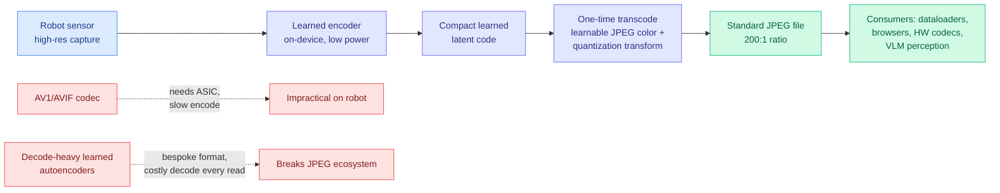
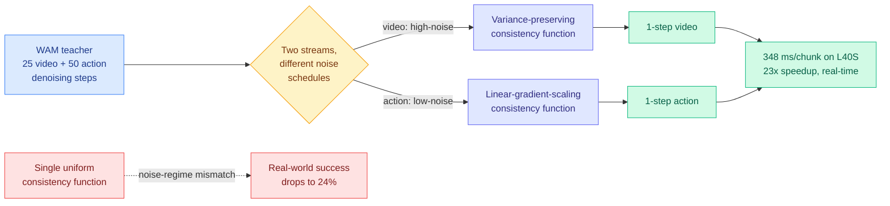
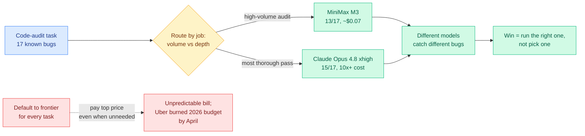
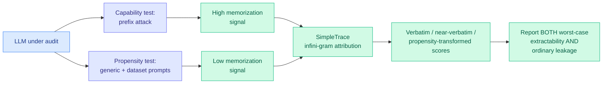
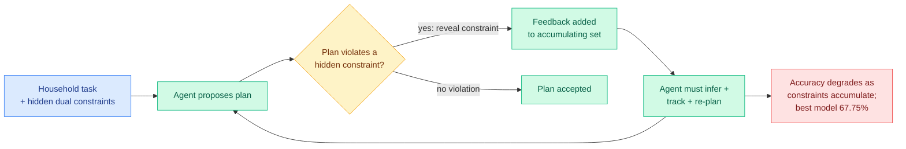
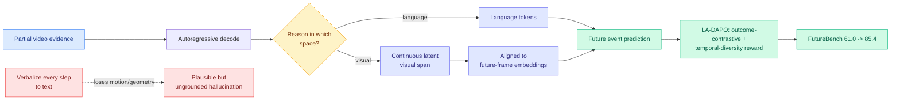
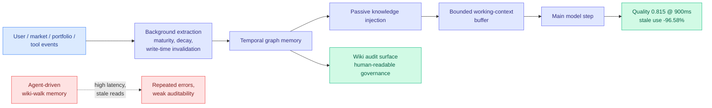

# cere-bro | 2026-06-07

> The same week the market wiped half a trillion dollars off the "scale is all you need" trade, the research feed quietly filled with the other answer: do more with less. Compression that exits to JPEG, distillation that hits one step, and a production audit showing a 7-cent model catches the same bugs as a 70-cent one.

---

## TL;DR

- **Memory is the new bottleneck**: a survey argues agentic AI broke the single-tier model. KV cache, not weights, is now the dominant memory traffic, and the HBM shortage runs toward 2030.
- **SEAOTTER**: compress robot camera data with a learned encoder, then transcode once into a plain JPEG. 200:1 ratio, 7x faster encoding than AVIF, +8% ImageNet accuracy, and the whole JPEG ecosystem still reads it.
- **Flash-WAM**: distill a video-plus-action robot model down to one denoising step per stream by matching the consistency function to each stream's noise level. 8.1s to 348ms per chunk, real-time control unlocked.
- **Kilo Code audit**: MiniMax M3 found 13 of 17 planted bugs for $0.07. The cheapest Claude run found the same 13 for $1.30. Different models catch different bugs, so route, don't crown.
- **PropMe**: models *can* be forced to leak training data, but rarely do under normal prompts. Memorization audits should report both worst-case extractability and ordinary leakage.
- **AdaPlanBench**: make agents plan when constraints are revealed only after they break one. Best of ten LLMs reaches just 67.75%, and user preferences trip them up more than physical limits.
- **Future-L1**: let a video model "imagine" in latent visual space instead of writing every reasoning step as text. Lifts an 8B model from 61.0 to 85.4 on future-event prediction.
- **The AI economy wobbles**: a ~$500B market drop, Sakana launches a self-improving-AI lab to escape the compute arms race, and OpenAI's top custom-chip designer defects to Anthropic.

---

## Deep Dives

### SEAOTTER: compress on the robot, exit to a plain JPEG

> Learned image codecs win on compression but lose on everything else: a neural decoder you pay on every read, and a bespoke format nothing else can open. SEAOTTER keeps the learned compression on the robot and transcodes once in the cloud into a standard JPEG, so the rest of your stack never knows a neural codec was involved.

**Source:** HuggingFace Daily Papers
**Links:** [Paper](https://arxiv.org/abs/2606.03940) · [Code](https://github.com/UT-SysML/seaotter) · [Wiki summary](../../inference-efficiency/2026-06-07-seaotter-cloud-robotics-compression.md)

**What is it about?**
SEAOTTER is a compression pipeline for cloud robotics (robots that offload heavy compute to a datacenter). A lightweight learned encoder runs on the robot, which has almost no power or bandwidth. A one-time transcode step in the cloud turns that learned latent (the compact code the encoder produces) into an ordinary JPEG file. Every downstream reader, from training dataloaders to web browsers to hardware decoders, then reads a standard JPEG with no neural-decoder cost.

**What problem does it solve?**
Cloud robotics is "encode once, decode many": data is captured once but read repeatedly for training, inference, and auditing. Conventional codecs (JPEG, MPEG) are cheap but degrade machine perception; newer codecs (AV1, AVIF) compress better but need custom chips to encode, impractical on a robot; and recent learned autoencoders win on quality but charge an expensive neural decode on every single read and store data in a format nothing standard can open. SEAOTTER pays the learned cost once on each side and serves a universal file forever after.

**What is the core novelty?**
A *learnable* JPEG color and quantization transform. Naive transcoding of a learned latent into JPEG wrecks downstream accuracy; SEAOTTER learns the transform so the JPEG output preserves the features that global, dense, and vision-language perception actually need.

**Key takeaways**
- At a 200:1 compression ratio versus AVIF: 7x faster encoding, 3.5x faster decoding, and +8% ImageNet top-1 accuracy.
- Stays fully compatible with JPEG infrastructure, so no part of the existing data pipeline has to change.
- Trains both general-purpose and task-aware transcoding pipelines on top of a frozen, pre-trained encoder.

**Gaps in the study**
The +8% is on ImageNet classification; whether it holds for detection, segmentation, or closed-loop robot control is untested. A task-aware transcoder risks overfitting to its training task, and at fleet scale the one-time cloud transcode could become its own bottleneck.

**Industrial implication**
This is the same input-side efficiency move as yesterday's [AdaCodec](../../inference-efficiency/2026-06-06-adacodec-predictive-visual-code-video-mllms.md) (06-06, which cut video-to-model tokens 7x by sending a full frame only on a scene change), pushed one step further upstream: AdaCodec compresses frames before the model, SEAOTTER compresses sensor images before they leave the robot. For any fleet streaming camera data to the cloud, a 7x cheaper on-device encode that still produces a standard file is a direct power-and-bandwidth win, and exactly the "more perception per watt" lever the compute-scarcity story keeps demanding.

→ [Full summary](../../inference-efficiency/2026-06-07-seaotter-cloud-robotics-compression.md)

---

### Flash-WAM: one denoising step per stream, by respecting each stream's noise

> A robot model that generates future video and actions together needs tens of diffusion steps, which means seconds per decision, which means no real-time control. The fix everyone reaches for, step distillation, breaks here because video and actions live at different noise levels. Flash-WAM uses a different distillation recipe for each.

**Source:** HuggingFace Daily Papers
**Links:** [Paper](https://arxiv.org/abs/2606.05254) · [Wiki summary](../../inference-efficiency/2026-06-07-flash-wam-modality-aware-distillation.md)

**What is it about?**
World-action models (WAMs) build on video-generation backbones to jointly predict future video frames and the robot actions that go with them. They run by iterative diffusion (start from noise, denoise step by step), and need tens of steps, so a single decision chunk takes 8.1 seconds on an NVIDIA L40S. Step distillation (training a fast student to mimic the slow many-step teacher in far fewer steps) is the standard remedy, and Flash-WAM is a version built for the two-stream case.

**What problem does it solve?**
Off-the-shelf step distillation breaks on WAMs because the video stream and the action stream use different noise schedules. Video is high-dimensional and redundant so it tolerates a lot of noise; actions are low-dimensional and precision-critical so they need a gentle schedule. The two streams reach distillation with different noise distributions, and a single uniform distillation recipe degrades. Naive consistency distillation drops real-world success to 24%.

**What is the core novelty?**
Picking the consistency function per modality to match its noise regime: a linear-gradient-scaling parametrization for the action stream's low-noise regime, and a variance-preserving parametrization for the video stream's high-noise regime. This is grounded in a structural analysis of which gradient scalings are achievable under the consistency boundary condition, so the choice is principled, not tuned.

**Key takeaways**
- Compresses inference to a single step in each modality.
- Per-chunk latency falls from 8.1s to 348ms on an L40S, a 23x speedup that crosses the ~500ms threshold for closed-loop control.
- Task success holds in simulation (85.5% RoboTwin 2.0, 95.7% LIBERO) and substantially recovers in the real world (60% on a Unitree G1 humanoid) where naive distillation collapses to 24%.

**Gaps in the study**
The real-world 60% still trails simulation by a wide margin, so the one-step regime is not yet free in deployment. The two-function split is shown for exactly two streams; WAMs that add tactile or proprioceptive streams would need the analysis re-derived.

**Industrial implication**
Flash-WAM reframes step distillation from a quality-vs-speed knob for image synthesis into the line between a robot policy that can and cannot run closed-loop. It is a fresh instance of the wiki's central distillation thread: where [OPRD](../../inference-efficiency/2026-06-05-oprd-on-policy-representation-distillation.md) (06-05, match teacher hidden states instead of output tokens) asked *what* to match, Flash-WAM asks *how to parametrize* distillation when one model carries two incompatible streams. The 24%-to-60% gap is the strongest signal yet that single-modality distillation is the wrong default for joint generative policies.

→ [Full summary](../../inference-efficiency/2026-06-07-flash-wam-modality-aware-distillation.md)

---

### The Kilo Code audit: a 7-cent model that catches what a 70-cent model misses

> Everyone defaults their coding agent to the most expensive frontier model. Kilo planted 17 bugs in a codebase and ran the audit at five price points. The cheapest model tied the expensive one on count, but caught a different set of bugs, which is the whole argument for routing instead of crowning.

**Source:** Twitter (@kilocode) + Kilo blog
**Links:** [We audited the same codebase](https://blog.kilo.ai/p/we-audited-the-same-codebase-with) · [The Copilot bill came due](https://blog.kilo.ai/p/the-github-copilot-bill-came-due) · [Wiki summary](../../ai-routing/2026-06-07-kilo-code-model-task-routing-audit.md)

**What is it about?**
Kilo Code (an AI coding tool) ran a controlled experiment: a TypeScript/Bun/SQLite webhook service with 17 deliberately planted bugs as the answer key, audited by Claude Opus 4.8 at four reasoning levels and by MiniMax M3 (an open-weight model shipped 2026-06-01) at its default. They measured tokens, cost, time, and bugs found.

**What problem does it solve?**
It puts numbers on the question routing research keeps asking in the abstract: does paying for the frontier model on every task actually buy you proportionally more? The honest answer here is "not on this task," and the reason is more interesting than the cost gap.

**What is the core novelty?**
The qualitative finding, not the benchmark. MiniMax M3 and the cheapest Claude run both caught 13 of 17 bugs, but not the *same* 13. M3 flagged a secret-returning endpoint that Claude-medium missed; Claude-medium flagged an async-callback-inside-a-sync-transaction bug that M3 missed. Different models see different bugs, so the win is running the right model for the job, which is the definition of routing.

**Key takeaways**
- MiniMax M3: 13/17 for ~$0.07. Cheapest Claude run: same 13 for $1.30. Claude at xhigh/max led at 15/17 but every Claude run cost at least 10x more.
- More reasoning was not monotonically better: Claude at medium and high caught an async-transaction bug that xhigh and max missed, and max cost 67% more than xhigh for nothing better.
- A second Kilo datapoint: MiMo-V2.5-Pro clears 47.6% on Terminal Bench 2.0 at $4.92/run, versus GPT-5.5's 74.2% at $72.63.

**Gaps in the study**
This is a single fixture (one webhook service, 17 bugs). The coverage-diversity claim, that different models catch disjoint bug sets, is the important one and needs a much larger benchmark before it generalizes.

**Industrial implication**
This is the production face of the wiki's [routing](../../ai-routing/llm-routing.md) thread, which tracks routing as a research surface with seven-plus addressable layers. It empirically grounds the topmost layer (which model) in dollars and bug coverage, and the disjoint-coverage finding argues for orchestrated ensembles, not just cheapest-capable selection, echoing [Conductor](../../ai-routing/2026-05-11-conductor-sakana-orchestrating-frontier-models.md) (Sakana's RL orchestrator over frontier models). The backdrop makes it urgent: GitHub Copilot moved to usage-based billing on 2026-06-01, and Uber reportedly burned its entire 2026 AI-coding budget by April. When the bill is a moving target, routing stops being a research nicety and becomes a line item.

→ [Full summary](../../ai-routing/2026-06-07-kilo-code-model-task-routing-audit.md)

---

### PropMe: models can leak training data, but measure whether they actually do

> Memorization tests almost always ask whether you can *force* a model to spit out its training data. PropMe asks the question that matters for ordinary use: does it leak when nobody is attacking it? The gap between the two is large, and audits that report only the first number mislead.

**Source:** HuggingFace Daily Papers
**Links:** [Paper](https://arxiv.org/abs/2606.06286) · [Wiki summary](../../responsible-ai/2026-06-07-propme-memorization-propensity.md)

**What is it about?**
PropMe is a propensity-aware framework for measuring memorization (when a model reproduces its training data). It contrasts a prefix attack (feed the first half of a known passage, see if the model completes it verbatim) with non-adversarial prompts, and ships SimpleTrace, a pipeline built on infini-gram (an n-gram index over the whole training corpus) that deterministically attributes a generation to its source and computes verbatim, near-verbatim, and propensity-transformed scores.

**What problem does it solve?**
Existing memorization evals measure capability (can the model be forced to leak?) and treat that as the risk. But the everyday risk is propensity (does it leak under normal prompting?). Reporting only capability overstates real-world leakage; reporting only propensity hides the attack surface.

**What is the core novelty?**
A metric transformation that converts any existing memorization function into a propensity metric, plus deterministic infini-gram attribution instead of probabilistic membership-inference guessing. Together they let an audit report worst-case extractability and ordinary leakage side by side.

**Key takeaways**
- Consistent gap on two fully-open models (Comma, DFM Decoder) over two corpora in two languages: prefix attacks elicit strong memorization, but propensity stays low.
- DFM Decoder, continually pre-trained from Comma, shows reduced memorization for the earlier corpus, evidence that later training on different data dilutes earlier memorization.

**Gaps in the study**
Propensity is only as honest as the distribution of "ordinary" prompts sampled; under-sampling the prompts a curious user would actually try reports a falsely low number. Tested only on two fully-open models, so frontier-scale and post-RLHF propensity are open.

**Industrial implication**
This is the privacy-side instance of a reframe the wiki saw on the safety side just yesterday: [SABER](../../responsible-ai/2026-06-06-saber-operational-safety-coding-agents.md) (06-06) measured what a coding agent *does* to a workspace, not what it refuses. Both separate an adversarial worst case from ordinary-use behavior and argue the ordinary-use number is the one practitioners need. For data-governance and copyright audits, deterministic infini-gram attribution is also a cleaner primitive than membership inference, and the continued-pre-training dilution result hints at a controllable knob for reducing leakage.

→ [Full summary](../../responsible-ai/2026-06-07-propme-memorization-propensity.md)

---

### AdaPlanBench: planning when you only learn the rules by breaking them

> Real assistants are never told all the constraints upfront. AdaPlanBench hides them and reveals each only after the agent proposes a plan that violates it, so the agent has to infer the rules from its own failures. Ten leading models cap at 67.75%, and what trips them is user preferences, not physics.

**Source:** HuggingFace Daily Papers
**Links:** [Paper](https://arxiv.org/abs/2606.05622) · [Wiki summary](../../agentic-systems/2026-06-06-adaplanbench-adaptive-planning.md)

**What is it about?**
AdaPlanBench is an interactive benchmark for adaptive planning. It runs over 307 household tasks, each augmented with both world constraints (tool availability, resource limits) and user constraints (preferences, dislikes). At runtime the agent only learns a constraint exists when it proposes a plan that violates it, then must revise under accumulating feedback.

**What problem does it solve?**
Prior planning benchmarks assume constraints are fully specified upfront, or test world-side or user-side constraints in isolation. AdaPlanBench combines both, withholds them, and reveals them only on violation, forcing genuine infer-track-revise behavior rather than one-shot planning.

**What is the core novelty?**
The violation-triggered disclosure protocol: it operationalizes "constraints you only learn by failing," which is how real assistants actually encounter user preferences and world limits.

**Key takeaways**
- The best of ten leading LLMs reaches only 67.75% accuracy.
- Performance degrades as constraints accumulate, and user constraints are a larger failure source than world constraints.
- Failures often trace to weak physical grounding.

**Gaps in the study**
It is a simulated household-task environment, so the gap to messy real deployments is unmeasured, and the study evaluates planning quality without testing whether RL on this feedback would close the user-constraint gap.

**Industrial implication**
AdaPlanBench joins the wiki's growing family of trajectory-level evals that grade the interaction, not the turn: [SABER](../../responsible-ai/2026-06-06-saber-operational-safety-coding-agents.md) (final workspace state), [AgentLens](../../agentic-systems/2026-05-14-agentlens-lucky-pass-swe-eval.md) (05-14, "lucky pass" trajectories that look fine per-turn). A sub-68% ceiling on household planning is a clear "not deployable yet" for open-ended assistant planning, and it sets an upper bound on how well any plan-recovery router (cf. [Adaptive RePoT](../../agentic-systems/2026-05-31-repot-recoverable-program-of-thought.md)) can do when the underlying constraint-tracking skill is this weak.

→ [Full summary](../../agentic-systems/2026-06-06-adaplanbench-adaptive-planning.md)

---

### Future-L1: let the video model imagine instead of narrate

> When a video model reasons about what happens next, it usually writes its thinking out as text. The moment visual evidence becomes words, the motion and geometry are gone, and the prediction floats free of the pixels. Future-L1 keeps the reasoning in visual space and only switches to language when it has to.

**Source:** HuggingFace Daily Papers
**Links:** [Paper](https://arxiv.org/abs/2606.05769) · [Wiki summary](../../vision-audio-video/2026-06-07-future-l1-interleaved-latent-visual-reasoning.md)

**What is it about?**
Future-L1 tackles video event prediction (inferring unobserved future states from partial video). It lets a multimodal LLM alternate between language tokens and continuous latent visual spans during decoding, so intermediate reasoning can stay in visual space. It is trained on a curated 50K set where future visual hints help, with latent states aligned to real future-frame embeddings, then refined with LA-DAPO, a latent-aware RL objective rewarding correct outcomes and diverse temporal trajectories.

**What problem does it solve?**
Verbalizing every reasoning step into text is lossy for visual content: fine-grained motion, geometry, and interaction cues vanish once they become words, producing predictions that are linguistically plausible but visually ungrounded.

**What is the core novelty?**
Interleaving continuous latent visual reasoning with language during autoregressive decoding, plus an RL objective (LA-DAPO) that operates directly on the sampled latent trajectories.

**Key takeaways**
- Lifts Qwen3-VL-8B from 61.0 to 85.4 on FutureBench, beating prior best Video-CoE by 10.4 points.
- Improves TwiFF-Bench average from 2.44 to 3.04.

**Gaps in the study**
The training set is selected precisely because visual hints help, which may overstate the gain on arbitrary prediction tasks. Latent reasoning is also harder to audit than a written chain, so debugging a wrong prediction is opaque.

**Industrial implication**
Future-L1 is the visual instance of a pattern now appearing three times in a week: keep reasoning continuous, quantize only at the end. [NF-CoT](../../llms-foundation-models/2026-06-05-nf-cot-latent-reasoning-normalizing-flows.md) (06-05) reasoned in continuous latent space because the token vocabulary is a lossy bottleneck; [The Shape of Addition](../../responsible-ai/2026-06-06-shape-of-addition-arithmetic-geometry.md) (06-06) showed arithmetic lives as a continuous quantity that only errs when rounded; Future-L1 avoids verbalizing visual evidence. Latent reasoning is consolidating into a named direction, with verifiability as its standing open problem.

→ [Full summary](../../vision-audio-video/2026-06-07-future-l1-interleaved-latent-visual-reasoning.md)

---

### InKH: stop making the user carry the agent's memory

> A financial agent that forgets your risk preferences and reads stale market state every turn is not just annoying, it is unsafe. InKH absorbs that complexity into the system with a temporal-graph memory that invalidates knowledge the moment it is written stale, cutting stale-memory use by 96.58%.

**Source:** HuggingFace Daily Papers
**Links:** [Paper](https://arxiv.org/abs/2606.01886) · [Wiki summary](../../agentic-systems/2026-06-07-inkh-financial-agent-knowledge-harness.md)

**What is it about?**
InKH (interaction-native knowledge harness) is an architecture for financial LLM agents that converts user, market, portfolio, and tool events into structured operational knowledge, then assembles a bounded working-context buffer before each model step. It uses a temporal graph memory for fast retrieval, a human-readable wiki audit surface for governance, and background extraction with maturity, decay, and write-time invalidation.

**What problem does it solve?**
Financial agents make the user carry the complexity: restate goals, risk preferences, and shifting assumptions while the agent answers and forgets. In market analysis or trade prep, forgotten context and stale memory cause latency, repeated errors, weak auditability, and unsafe decisions.

**What is the core novelty?**
Write-time invalidation. Rather than hoping retrieval filters out stale facts later, InKH invalidates knowledge when it is written stale. Compared against a temporal-graph system *without* invalidation, it still improves quality by 0.050 and cuts stale-memory use by 96.58% at comparable cost, so invalidation, not the graph alone, drives the gain.

**Key takeaways**
- Mean task quality 0.815 at 900ms latency on a controlled synthetic benchmark (24 seeds, 80 episodes/round, 6 baselines, 46,080 evaluations).
- Versus agent-driven wiki-walk memory: 82.95% less latency, 82.29% less token cost, 96.58% less stale-knowledge use, +0.108 quality, +0.461 traceability.

**Gaps in the study**
The benchmark is synthetic and the paper is explicit that it validates architecture behavior, not live trading. Whether write-time invalidation generalizes to noisy real market streams, where "what is stale" is itself uncertain, is open.

**Industrial implication**
InKH attacks the staleness failure the wiki's [agent-memory](../../agentic-systems/agent-memory.md) cluster diagnosed (05-15: STALE capped frontier models at 55.2% on implicit-conflict detection) at the systems layer, where [MMPO](../../agentic-systems/2026-06-05-mmpo-metacognitive-memory-policy-optimization.md) (06-05) and MemTrain (06-04) attacked it at the training-objective layer. The two are complementary: train memory to compress faithfully, then engineer the store to expire correctly. The reminder for builders is blunt, a large fraction of agent-memory quality is plumbing, not modeling.

→ [Full summary](../../agentic-systems/2026-06-07-inkh-financial-agent-knowledge-harness.md)

---

## Industry Pulse

- **Sakana AI launched a dedicated lab for recursive self-improvement** (AI that iteratively improves itself), co-founded by Transformer co-author Llion Jones, pitched as an alternative to the raw compute arms race; Anthropic warns about the control risks ([The Decoder](https://the-decoder.com/sakana-ai-bets-ai-that-improves-itself-can-break-the-compute-arms-race-of-frontier-labs/)).
- **OpenAI's Clive Chan, an early custom-chip hire, left for Anthropic,** as Reuters reports Anthropic is weighing building its own AI chips ([via @eliebakouch](https://nitter.net/eliebakouch/status/2063368042009018729#m), [Reuters](https://www.reuters.com/business/anthropic-weighs-building-it-own-ai-chips-sources-say-2026-04-09/)).
- **xAI reportedly trained its coding models on Claude outputs for months,** continuing via private accounts and Blackbox AI after Anthropic cut access; its pretraining team shrank to under five and it now rents its compute to Anthropic and Google ([The Decoder](https://the-decoder.com/elon-musks-xai-reportedly-trained-its-coding-models-on-claude-outputs-for-months-before-getting-cut-off/)).
- **Gary Marcus called Friday "AI's Black Friday,"** with roughly half a trillion in market value wiped, renewed OpenAI government-equity talk, and Musk leasing 110,000 GPUs to Google on top of 220,000 to Anthropic ([Marcus on AI](https://garymarcus.substack.com/p/ais-black-friday)).
- **Meta is building "Hatch," a paid AI agent at up to $200/month,** its first paid AI product, to open revenue beyond advertising ([The Decoder](https://the-decoder.com/metas-hatch-ai-agent-could-cost-up-to-200-a-month-and-marks-its-first-paid-ai-product/)).
- **A new Apache-2.0 voice model, "Audio Interaction," listens continuously** and decides every 0.4s whether to speak, handling translation, transcription, and ambient sounds in one stream ([The Decoder](https://the-decoder.com/new-open-source-voice-model-listens-nonstop-and-decides-every-0-4-seconds-whether-to-speak-or-stay-silent/)).
- **GitHub Copilot's usage-based billing went live June 1,** turning a three-year fixed line item into a variable cost, with Uber reportedly burning its 2026 AI-coding budget by April ([Kilo](https://blog.kilo.ai/p/the-github-copilot-bill-came-due)).
- **Intel is partnering with Echo Neurotechnologies on brain-inspired neuromorphic silicon,** trained on human brain activity rather than just brain-inspired ([via @magicsilicon](https://nitter.net/magicsilicon/status/2063364855055491536#m)).
- **Google showed CVPR work: D4RT (Best Paper) for feedforward 4D scene reconstruction, TIPSv2** (where distillation made a student beat a much larger teacher on patch-text alignment), and 3DCodeBench for agentic 3D modeling ([via @GoogleResearch](https://nitter.net/GoogleResearch/status/2063368807041892423#m)).

---

## Global View

**Research spent the week deriving how to do more with less compute, exactly as the market repriced the bet that more compute is the whole game.** Today's efficiency cluster is unusually coherent: SEAOTTER compresses sensor data 200:1 and exits to JPEG, Flash-WAM distills a robot policy to one step for a 23x speedup, and the Kilo Code audit shows a 7-cent open model catching the same bugs as a 70-cent frontier run. Against that, Gary Marcus's "AI's Black Friday" (a ~$500B drop, Musk renting out the GPUs he hoarded, OpenAI courting a government equity stake) is the market saying the brute-scale capex thesis is cracking, and Sakana's new recursive-self-improvement lab is a frontier player betting explicitly that self-improvement, not raw compute, is the next lever. The same scarcity shows up on the demand side in Copilot's switch to usage-based billing and Uber's exhausted budget. Research is supplying the efficiency toolkit at precisely the moment the economics demand it.

**The capability-versus-behavior split is hardening into a measurement principle across safety and privacy.** PropMe argues memorization audits must report both worst-case extractability (can you force a leak?) and ordinary propensity (does it leak unprompted?), and finds a large gap between them. That is the same move yesterday's [SABER](../../responsible-ai/2026-06-06-saber-operational-safety-coding-agents.md) (06-06) made on safety, grading what a coding agent *does* to a workspace rather than what it refuses, and the same gap the alignment-faking work on Kurate this week (Value-Conflict Diagnostics) probes. Three independent corners of responsible-AI research now agree that an adversarial worst case and ordinary-use behavior are different numbers and both belong in the report. The industry relevance is direct: as Meta ships a $200/month autonomous agent and coding agents get production write-access, the "what does it do unprompted" number is the one that governs real risk.

**Latent reasoning is consolidating into a named direction just as agent evaluation keeps proving the written trace can lie.** Future-L1 keeps video reasoning in continuous visual space rather than verbalizing it, the third paper in a week (after NF-CoT on 06-05 and The Shape of Addition on 06-06) to argue the discrete output is a lossy projection of a continuous internal state. But the same week, AdaPlanBench caps the best planner at 67.75% and ForeSci finds agents that cite the right evidence yet forecast the wrong research object, both echoing the verifier-gaming and "lucky pass" threads: surface signals mislead about real capability. The tension is worth holding, latent reasoning trades away the auditability of a written chain at exactly the moment evaluations are showing how often the written chain is unreliable anyway, which raises the stakes on building verifiers that work on latent state.

---

## Looking Ahead

- **A coding tool ships coverage-aware (not just cost-aware) model routing within 90 days.** Kilo's finding that different models catch disjoint bug sets means the optimum is an ensemble keyed to bug class, not the cheapest capable model. **Signal:** Kilo, Cursor, or a similar tool ships per-task model selection driven by predicted issue-type coverage, or publishes a multi-fixture benchmark confirming the disjoint-coverage claim beyond one webhook service.
- **SEAOTTER's learned-transcode trick gets applied to a second standard format within 60 days.** The core idea, exit a learned latent into a standard hardware-accelerated container, is format-agnostic. **Signal:** a paper applies a learnable transcode to standard AAC audio or H.264 video while retaining downstream-task accuracy, or a robotics data platform adds learned-encode-to-JPEG as an ingest option.
- **Flash-WAM's modality-aware distillation is ported to a non-LingBot world-action model within 90 days.** It is framed as a general consistency-function-selection principle, not a LingBot-specific hack. **Signal:** a follow-up applies per-modality consistency parametrization to another WAM or VLA and reports a comparable single-step speedup without the real-world collapse naive distillation showed.
- **A verifier for latent reasoning appears within 90 days.** With three latent-reasoning papers in a week and evaluations showing written chains are unreliable, the open problem is auditing reasoning that was never written down. **Signal:** a paper proposes a method to decode or verify latent reasoning spans post-hoc (for Future-L1-style visual latents or NF-CoT-style math latents) rather than trusting outcome accuracy alone.
- **LLM-rated underrated from Kurate:** the cs.LG board's "How to Scale Mixture-of-Experts: From muP to the Maximally Scale-Stable Parameterization" (ai_rating 9.0) is already a wiki concept page ([MoE-muP](../../ai-routing/2026-05-17-moe-mup-maximally-scale-stable-parameterization.md)) and still absent from today's HuggingFace top; "A Bitter Lesson for Data Filtering" (Hashimoto/Duchi, 7.5) and "Pretraining Recurrent Networks without Recurrence" (Kumar/Isola, fresh on 2026-06-04, 7.5) are the cs.LG entries closest to Tier-1/2 interest. **Signal:** if the Maximally Scale-Stable Parameterization is applied to a shipped open MoE by July, the parametrization thread is validated.

---

*No HF+Kurate cross-source overlap today (Kurate's weekly boards remain biomedical and scientific-foundation-model heavy and weeks older than today's HF batch). Rising authors from Kurate this week are the same clinical-physiology and scientific-discovery clusters as last week (Guy Lutsker et al. on a generative human-physiology model, cs.AI #1; Andrew Zhang et al. on a virtual-patient foundation model, cs.LG #1); none touches routing, KV cache, compression, or GPU, so none warrants a Twitter-handle add. All eight Reddit subs returned no posts past their filters this window. No curated @bayesiansapien retweets in the lookback.*
