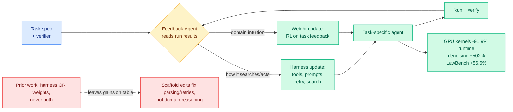
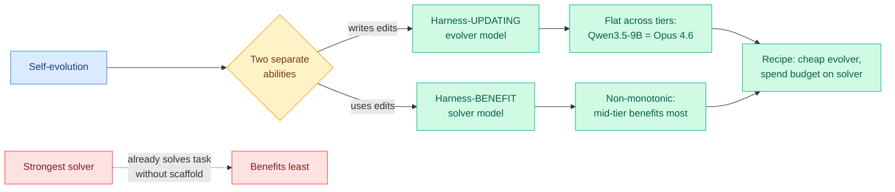
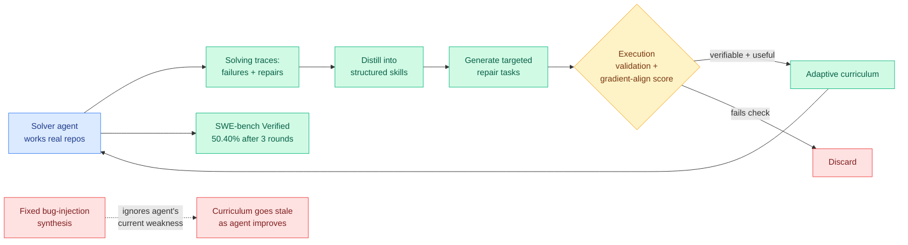
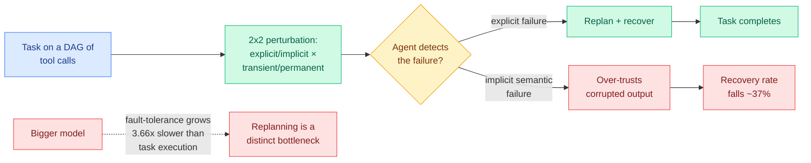
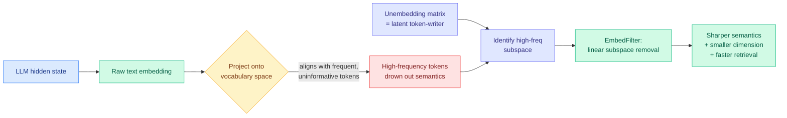
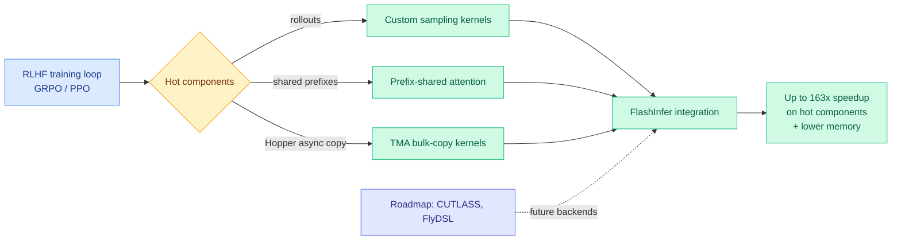
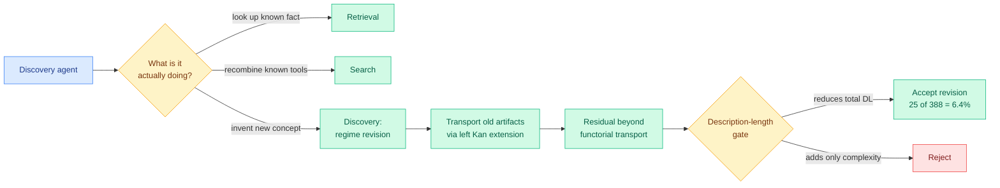

# cere-bro | 2026-06-08

> Five papers landed at once on agents that rewrite themselves, and the sharpest one says the quiet part out loud: a stronger model does not make a better self-evolving agent. The win is in the system design, not the size of the brain you point at it.

---

## TL;DR

- **SIA**: let one agent update both its scaffold and its model weights in a single loop. 91.9% faster GPU kernels, +502% on cell-RNA denoising, beats scaffold-tuning alone.
- **Disentangling Agent Self-Evolution**: a 9B model writes harness edits as good as Claude Opus 4.6. Pay cheap for the editor, spend your budget on the solver.
- **Socratic-SWE**: a coding agent mines its own past runs for failure patterns, turns them into a curriculum, and hits 50.4% on SWE-bench Verified.
- **ToolMaze**: when tools fail mid-task, agents over-trust the broken output. Fault-recovery skill grows 3.66x slower with scale than basic task skill.
- **EmbedFilter**: LLM text embeddings waste capacity echoing common words. Strip that subspace using the model's own output matrix, get smaller and better vectors.
- **RL-Kernel** open-sourced: a GRPO/PPO kernel library with up to 163x speedups on hot RL-training components, the post-training stack getting its own FlashAttention moment.
- **Industry**: OpenAI declares "chat is dead" and rebuilds ChatGPT as an agent superapp; Perplexity ships agents that write their own search code and cut tokens 85%.

---

## Deep Dives

### SIA: an agent that rewrites its scaffold and retrains its weights, together

> Self-improving-AI research split into two camps that never talked: one rewrites the agent's scaffold, the other retrains the model's weights. SIA runs both in one loop, and the combination beats scaffold-tuning alone on three domains that share nothing.

**Source:** HuggingFace Daily Papers (Hexo Labs)
**Links:** [Paper](https://arxiv.org/abs/2605.27276) · [Wiki summary](../../agentic-systems/2026-06-08-sia-self-improving-harness-weights.md) · [Concept: self-evolving agents](../../agentic-systems/self-evolving-agents.md)

**What is it about?**
SIA (Self-Improving AI) is a loop where one language-model agent, the Feedback-Agent, improves a second task-specific agent without a human in the loop. Self-improving-AI work has two schools. The harness school rewrites the *scaffold* around the model (its tools, prompts, retry logic, and search procedure) while the weights stay frozen. The test-time-training school updates the model's *weights* on task feedback while the scaffold stays frozen. SIA is the first system to do both in one feedback loop.

**What problem does it solve?**
The two schools each leave value on the table. Harness-only systems tend to fix software plumbing, parsing and retries, rather than learn domain reasoning. Weight-only systems learn the domain but run on a human-engineered training pipeline that never adapts to the structure a good scaffold would expose. SIA argues the levers are complementary: the scaffold shapes *how the model acts*, the weights build *what the model knows*.

**What is the core novelty?**
Unifying scaffold edits and weight updates under one Feedback-Agent that, given only a task spec and a verifier, decides what to change next. The point is not either mechanism in isolation, both already existed, but that letting one controller move both knobs compounds.

**Key takeaways**
- Tested on three deliberately unrelated domains: Chinese legal charge classification, low-level GPU kernel optimization, and single-cell RNA denoising.
- Gains over the initial baseline: +56.6% on LawBench, 91.9% runtime reduction on GPU kernels, +502% on denoising.
- Combining both levers beats scaffold iteration alone on all three benchmarks.

**Gaps in the study**
Three domains with one strong verifier each, so it is unclear how SIA behaves when the verifier is noisy or the task lacks a clean success signal. The loop is also not run long enough to show whether the dual update compounds safely or eventually drifts.

**Industrial implication**
SIA is the strongest evidence yet for the thesis that [Scaling the Harness](../../agentic-systems/2026-05-27-scaling-the-harness.md) (05-27, the position paper that argued system scaling, not model scaling, is the next bottleneck) put forward in the abstract. The GPU-kernel result is the one to watch: an agent that autonomously rewrites both its kernel-search scaffold and its own weights to cut runtime 91.9% is a direct preview of self-optimizing inference infrastructure, exactly the lever the compute-scarcity story keeps demanding. Read it alongside the next paper before getting too excited.

→ [Full summary](../../agentic-systems/2026-06-08-sia-self-improving-harness-weights.md)

---

### Disentangling Agent Self-Evolution: a bigger model does not self-evolve better

> Everyone assumes a smarter model makes a smarter self-improving agent. This paper splits "self-evolution" into two abilities, measures each, and finds the assumption is wrong. The model that writes the upgrades can be cheap. Only the model that uses them needs to be good, and even then, not the biggest.

**Source:** DAIR.AI Top Papers of the Week (Gmail)
**Links:** [Wiki summary](../../agentic-systems/2026-06-08-disentangling-agent-self-evolution.md) · [Concept: self-evolving agents](../../agentic-systems/self-evolving-agents.md)

**What is it about?**
The paper interrogates a question every agent builder eventually hits: if an agent rewrites its own harness (its memory, tools, prompts, and skills), does a stronger base model make a better self-evolving agent? It separates two abilities that everyone bundles together. *Harness-updating* is the evolver model writing the edits. *Harness-benefit* is the solver model actually exploiting those edits on the task.

**What problem does it solve?**
It corrects a costly default. Teams assume self-evolution is one capability that scales with model size, so they reach for the most expensive model everywhere. This paper shows that bundling hides two opposite scaling laws.

**What is the core novelty?**
The clean decomposition, plus the two measured scaling curves. Updating is *flat*: edits written by a Qwen3.5-9B are as useful as edits from Claude Opus 4.6, so a frontier evolver buys almost nothing. Benefit is *non-monotonic*: weak solvers gain little because they cannot activate or follow the new harness component, mid-tier solvers gain the most, and the strongest solvers gain less because they already solve the task without the scaffold.

**Key takeaways**
- Cheap evolver, expensive solver is the cost-optimal recipe. Frontier money on the editor is wasted.
- The benefit curve peaks in the middle, so self-evolution helps the models that need it, not the ones that do not.
- Weak-solver failures are concrete: they fail to invoke the right harness piece or follow it inconsistently.

**Gaps in the study**
The curves are measured on a finite task set. If frontier evolvers pull ahead on genuinely novel scaffolding that small models cannot conceive, the cheap-evolver recipe flips. The study does not stress that boundary.

**Industrial implication**
This is the cold-water companion to SIA, and the two should always be read together. SIA shows combining levers wins, this paper shows *which* lever pays for compute. The cheap-evolver/expensive-solver split is a [routing](../../ai-routing/llm-routing.md) decision wearing a self-evolution costume: assign the cheap model the editing role and reserve frontier capacity for solving. For anyone building a self-evolving stack, that single reassignment is most of the cost savings.

→ [Full summary](../../agentic-systems/2026-06-08-disentangling-agent-self-evolution.md)

---

### Socratic-SWE: the agent mines its own failures into a curriculum

> Synthetic coding tasks are generated by fixed rules that ignore what the agent is actually bad at. Socratic-SWE flips it: the agent's own solving traces, the record of where it stumbled and what fixed it, become the source of the next round of training tasks.

**Source:** HuggingFace Daily Papers (SJTU + Alibaba)
**Links:** [Paper](https://arxiv.org/abs/2606.07412) · [Wiki summary](../../agentic-systems/2026-06-08-socratic-swe-trace-derived-skills.md) · [Concept: self-evolving agents](../../agentic-systems/self-evolving-agents.md)

**What is it about?**
Socratic-SWE is a closed-loop self-evolution framework for software-engineering agents. SWE agents are trained on tasks (fix this bug in this repo), and high-quality tasks are scarce. The usual fix is synthetic data: mutate code or inject bugs by fixed rules. Socratic-SWE instead reuses the agent's own *solving traces*, the step-by-step record of an attempt, as the raw material for new tasks.

**What problem does it solve?**
Fixed synthetic-task generators produce a distribution that is decoupled from the agent. As the agent improves, those tasks stop teaching it anything, because they were never aimed at its actual weaknesses. Traces are usually thrown away after a scalar reward is extracted, wasting the richest signal the agent produces.

**What is the core novelty?**
Distilling traces into structured *skills* that summarize recurring failures and effective repair patterns, then using those skills to generate targeted repair tasks in real repositories. Candidate tasks pass execution-based validation and a solver-gradient-alignment reward, so only tasks that are both verifiable and useful for learning are kept. The updated solver produces new traces, and the curriculum adapts each round.

**Key takeaways**
- 50.40% on SWE-bench Verified after three self-evolution iterations, beating self-evolving baselines at equal compute.
- Consistent gains across SWE-bench Verified, Lite, Pro, and Terminal-Bench 2.0.
- The curriculum tracks the agent's frontier rather than a static rulebook.

**Gaps in the study**
Three iterations is a short loop, so whether trace-derived curricula keep paying off or saturate is open. The approach leans on deterministic test-suite verification, which SWE has and most domains do not, so the recipe may not transfer cleanly outside coding.

**Industrial implication**
Socratic-SWE answers the "where does the training signal come from" half of the self-evolution problem that OpenSkill (06-08) also tackles from the no-supervision end. For shops already running coding agents, the traces are free and currently discarded. Turning them into a self-aimed curriculum is a low-cost way to keep a fixed-size model improving without buying a bigger one, which is the same conclusion the Disentangling paper reached from the cost angle.

→ [Full summary](../../agentic-systems/2026-06-08-socratic-swe-trace-derived-skills.md)

---

### ToolMaze: when a tool breaks, agents trust the broken answer

> Every tool-use benchmark assumes the tools work. Real tools time out, return stale data, or quietly hand back garbage. ToolMaze breaks them on purpose and finds that agents over-trust corrupted output, and that this fault-recovery skill barely improves as models get bigger.

**Source:** HuggingFace Daily Papers
**Links:** [Paper](https://arxiv.org/abs/2606.05806) · [Wiki summary](../../agentic-systems/2026-06-08-toolmaze-dynamic-replanning.md) · [Concept: agent benchmarks](../../agentic-systems/agent-benchmarks.md)

**What is it about?**
ToolMaze is a benchmark for Tool-Integrated Reasoning (TIR, where an LLM agent calls external tools partway through its reasoning) under failure. Existing TIR benchmarks test the "happy path" where every tool returns a correct result. ToolMaze injects failures and measures whether the agent notices and recovers.

**What problem does it solve?**
Production agents fail not because they cannot plan a clean run, but because they cannot handle a tool that misbehaves. No benchmark measured that, so the recovery gap was invisible.

**What is the core novelty?**
A two-axis design. The first axis is topological: tasks are directed acyclic graphs of tool calls, so complexity scales structurally. The second is a 2x2 taxonomy of perturbations, explicit versus implicit (does the tool announce its failure or fail silently?) crossed with transient versus permanent. This isolates systematic replanning from blind trial and error.

**Key takeaways**
- Implicit semantic failures are the killer: Perturbation Recovery Rate drops about 37%, driven by agents over-trusting corrupted output.
- Complex DAG topologies trap agents in futile trial-and-error loops.
- Fault-tolerance improves with model scale 3.66x *slower* than basic task execution, so scaling the model will not fix it.

**Gaps in the study**
The perturbations are synthetic and injected by the benchmark, so the taxonomy may not match the distribution of real-world tool flakiness. It measures detection and recovery but does not test whether targeted training on these failures closes the 3.66x gap.

**Industrial implication**
ToolMaze joins the wiki's growing family of evals that grade the interaction rather than the turn, alongside [AdaPlanBench](../../agentic-systems/2026-06-06-adaplanbench-adaptive-planning.md) (06-06, which capped the best planner at 67.75% by revealing constraints only when an agent breaks them). The blunt message for builders: agentic fault-tolerance is a distinct skill that model scaling barely touches, so it has to be engineered into the harness with explicit output validation and distrust, not waited out. That is the defensive counterpart to Critic-R's introspective retrieval feedback, also on today's feed.

→ [Full summary](../../agentic-systems/2026-06-08-toolmaze-dynamic-replanning.md)

---

### EmbedFilter: your model's output matrix is secretly a junk-word filter

> LLMs make mediocre embedding models, and the reason is oddly specific: their embeddings keep echoing common, meaningless words. The fix reuses a part the model already has, the output projection, to identify and delete that wasted subspace, making the vectors both smaller and sharper.

**Source:** HuggingFace Daily Papers
**Links:** [Paper](https://arxiv.org/abs/2606.07502) · [Code](https://github.com/CentreChen/EmbFilter) · [Wiki summary](../../inference-efficiency/2026-06-08-embedfilter-unembedding-feature-lens.md)

**What is it about?**
EmbedFilter improves the text embeddings (the fixed-length vectors used for search and retrieval) that you get from a large language model. Despite their strong zero-shot skills, LLMs underperform dedicated embedding models on the standard benchmarks. The paper traces this to a concrete pathology and fixes it with one linear transformation.

**What problem does it solve?**
When you project an LLM's text embedding back onto the vocabulary, it lines up with frequent but uninformative tokens (think "the", "of", "is"). That over-expression of high-frequency tokens crowds out the nuanced meaning you actually want a retrieval vector to carry.

**What is the core novelty?**
The diagnosis and the lever. The *unembedding matrix*, the output projection that normally turns hidden states into next-token logits, turns out to encode the subspace that writes those frequent tokens into embedding space. EmbedFilter removes that subspace with a simple linear map. Because it deletes a chunk of the representation, it also reduces dimensionality, so indexes get smaller and retrieval gets faster, with no loss in the refined embedding's quality.

**Key takeaways**
- A training-free linear transform, applied directly to embeddings from multiple LLM backbones.
- Better zero-shot downstream performance *even at significantly reduced embedding dimension*.
- The dimensionality reduction is a free byproduct, lower index storage and faster lookup.

**Gaps in the study**
The high-frequency-subspace story is shown to help on embedding benchmarks, but how much of the gain is the filtering versus the dimensionality cut is not fully separated. Whether the same subspace is the culprit across very different domains (code, multilingual) is untested.

**Industrial implication**
This is a quiet efficiency win for anyone running retrieval on LLM-derived vectors: a one-shot linear pass that shrinks the index and improves recall at the same time, no retraining. The deeper point is conceptual reuse, the unembedding matrix is normally seen as decode-only machinery, and here it doubles as an interpretability lens on what the embedding over-encodes. **Research angle:** if the output projection cleanly factors "frequency structure" out of representations, the same lens may expose other reusable subspaces (style, position) worth filtering, and it connects to the broader logit-lens interpretability program.

→ [Full summary](../../inference-efficiency/2026-06-08-embedfilter-unembedding-feature-lens.md)

---

### RL-Kernel: the RL post-training stack gets its own kernel library

> Inference got FlashAttention and a decade of kernel love. RL post-training, the GRPO and PPO loops that now make or break frontier models, has been running on inference kernels that do not fit its access patterns. RL-Kernel is the first library built for that workload, and the early numbers are large.

**Source:** Twitter (@bayesiansapien curated repost of the RL-Kernel release)
**Links:** [Repo](https://github.com/RL-Align/RL-Kernel) · [Wiki summary](../../inference-efficiency/2026-06-08-rl-kernel-grpo-ppo-kernels.md)

**What is it about?**
RL-Kernel is a newly open-sourced low-level kernel library aimed specifically at the reinforcement-learning post-training of LLMs, the loops that turn a pretrained model into an aligned one. It targets GRPO (Group Relative Policy Optimization, the lighter-weight RL method that has become the default for reasoning models) and PPO (Proximal Policy Optimization).

**What problem does it solve?**
RL training has a different compute profile from inference serving: it interleaves generation (rollouts) with scoring and gradient updates, reuses long shared prefixes across a group of samples, and moves a lot of data around. Kernels tuned for plain inference leave that performance on the floor. RL-Kernel writes the hot pieces from scratch for the RL pattern.

**What is the core novelty?**
Custom implementations of the components that dominate RL-training wall-clock: sampling, prefix-shared attention (so a group of rollouts sharing a prompt does not recompute the prompt's attention), and TMA (the Tensor Memory Accelerator, Hopper's asynchronous bulk-copy engine). It is built on FlashInfer today, with CUTLASS and FlyDSL backends on the roadmap.

**Key takeaways**
- The authors report up to 163x speedups on some high-frequency training components, with reduced memory use.
- Prefix-shared attention directly attacks the redundant-prefix cost of group-based RL like GRPO.
- It is positioned as RL post-training infrastructure, a distinct target from inference-serving kernels.

**Gaps in the study**
This is a code release with author-reported numbers, not a peer-reviewed benchmark, and "up to 163x on some components" is a per-kernel figure, not an end-to-end training speedup. Independent measurement of the full-pipeline gain is the thing to wait for.

**Industrial implication**
As RL post-training becomes the expensive, iterated phase of building a frontier model, its kernels become a first-class optimization target, the same way inference kernels did. **Research angle:** the open question is how much of that 163x survives end-to-end once rollout generation, reward scoring, and optimizer steps are all in the loop. It pairs naturally with OpenPipe's ART (Agent Reinforcement Trainer, GRPO for multi-step agents), which also surfaced on today's feed, the tooling layer for agent RL is filling in fast.

→ [Full summary](../../inference-efficiency/2026-06-08-rl-kernel-grpo-ppo-kernels.md)

---

### Self-Revising Discovery Systems: is the agent discovering, or just confidently retrieving?

> Most "AI scientist" agents look impressive because they recombine known tools. This paper draws a hard line between retrieval, search, and genuine discovery, and builds a system that only accepts a new idea when it provably reduces the description length of what the model knows. In one run, 388 proposals yielded 25 accepted revisions.

**Source:** Twitter (@omarsar0 curated repost) + DAIR.AI
**Links:** [Paper](https://arxiv.org/abs/2606.01444) · [Wiki summary](../../agentic-systems/2026-06-08-self-revising-discovery-systems.md)

**What is it about?**
This paper gives a formal account, using category theory, of what it means for an AI agent to actually *discover* something in science rather than retrieve or recombine. Its central claim is that discovery is not generating an answer, it is revising the *representational regime*: the set of evidence types, artifacts, operations, and verifiers the agent works in.

**What problem does it solve?**
"Self-improving" and "AI scientist" agents are hard to evaluate because confident retrieval looks like insight. The paper supplies an objective separation: retrieval is looking up something already in your notebook, search is combining tools you already own, and discovery is inventing a concept that was not in your toolkit. Most agents stop at the first two and call it discovery.

**What is the core novelty?**
A typed, category-theoretic framework where old results are carried into a revised regime by a *left Kan extension* (a structure-preserving transport), and genuine discovery is the *residual content* that transport alone cannot explain. Proposed revisions are accepted only when they reduce total description length, a Minimum Description Length gate that separates real structural gains from mere added complexity.

**Key takeaways**
- Discovery is defined as a verified regime transition, not novelty by vibes.
- The description-length gate is strict: one run accepted just 25 of 388 proposals (6.4%).
- Two instantiations: a protein-mechanics world model (Builder/Breaker) and a proof-carrying knowledge-computation graph (CategoryScienceClaw).

**Gaps in the study**
It is a framework paper with two bespoke instantiations, so whether the category-theoretic machinery scales to a working, general autonomous scientist is unproven. The MDL gate's 6.4% acceptance rate is honest but says nothing yet about whether the accepted revisions are scientifically meaningful.

**Industrial implication**
This is the principled counterweight to the self-evolution cluster's optimism. SIA and Socratic-SWE make agents change themselves, this paper asks whether the change is real progress or confident remixing, and gives a gate to tell them apart. It also lands against a skeptical Kurate signal this week, "AI scientists produce results without reasoning scientifically" (cs.AI #6, ai_rating 8.5), so the field is simultaneously building autonomous discovery and questioning whether any of it is discovery at all.

→ [Full summary](../../agentic-systems/2026-06-08-self-revising-discovery-systems.md)

---

## Industry Pulse

- **OpenAI says "chat is dead"** and is planning its biggest ChatGPT overhaul since launch, rebuilding it as an agent "superapp" that bundles coding tools, AI agents, and partner apps like Canva and Booking.com ([The Decoder](https://the-decoder.com/openai-says-chat-is-dead-and-plans-to-rebuild-chatgpt-as-a-full-blown-agent-app/)).
- **Perplexity shipped "Search as Code,"** letting models write their own Python search routines in a sandbox instead of calling fixed APIs, beating OpenAI and Anthropic on key benchmarks while cutting token costs up to 85% ([The Decoder](https://the-decoder.com/perplexitys-search-as-code-lets-ai-models-write-their-own-search-pipelines-instead-of-calling-fixed-apis/)).
- **Ollama released Gemma 4 12B plus quantization-aware-trained weights** across all Gemma 4 sizes, targeting local agents on a 16GB laptop with near-26B reasoning ([Ollama](https://ollama.com/library/gemma4)).
- **DeepSeek topped Ramp's trending software vendors for June** as US firms chase cheaper AI, even as Ramp's chief economist flags security risk in sending data to a Chinese model ([The Decoder](https://the-decoder.com/deepseek-topped-ramps-trending-software-vendors-in-june-2026-as-us-companies-chase-cheaper-ai/)).
- **ChatGPT's new Lockdown Mode disables web access, Deep Research, and Agent Mode** to blunt prompt-injection data theft, though it only blocks the final exfiltration step and prompt injection stays unsolved ([The Decoder](https://the-decoder.com/chatgpts-new-lockdown-mode-lets-you-disable-web-access-and-more-to-protect-sensitive-data-from-prompt-injection/)).
- **A new study explains why bigger LLMs learn rare skills small ones miss**: frequent tasks overwrite rare ones, and raising a target task's training frequency can substitute for scaling the model ([The Decoder](https://the-decoder.com/researchers-pinpoint-why-larger-language-models-pick-up-skills-that-small-ones-miss/)).
- **Google is reportedly paying SpaceX about $920M/month to rent 110,000 Nvidia GPUs,** despite running its own TPUs, a sign of how tight frontier compute is ([via @TobyPhln](https://nitter.net/TobyPhln/status/2063788155178770804#m)).
- **AI Weekly framed Friday's ~$1.3T market drop as a bubble debate,** with Dalio calling bubble and Goldman calling it overdone ([AI Weekly](https://aiweekly.co)).
- **Anthropic's @bcherny published five tips for running Opus autonomously for hours or days,** citing benchmarks showing Opus leads on long-running work ([via @bcherny](https://nitter.net/bcherny/status/2063792263067754658#m)).

---

## Global View

**The self-evolution wave and the industry's "rebuild everything as an agent" pivot are the same bet, arriving from opposite ends.** Five research papers landed on agents that improve themselves (SIA combining scaffold and weight updates, Socratic-SWE mining its own traces, OpenSkill bootstrapping without supervision, HarnessForge co-evolving harness and policy), while OpenAI declared "chat is dead" and is rebuilding ChatGPT as an agent superapp and Perplexity shipped agents that write their own search code for an 85% token cut. Both sides are saying the value has moved from the model to the system wrapped around it, exactly the thesis [Scaling the Harness](../../agentic-systems/2026-05-27-scaling-the-harness.md) (05-27) stated and Sakana's new recursive-self-improvement lab (06-07) is funding. The Disentangling paper is the discipline this wave needs: it proves the scaffold-writer can be a cheap model, which means the industry's instinct to throw frontier compute at every agent role is the wrong default.

**"A bigger model will not fix it" is becoming the recurring empirical verdict, and it keeps pointing back at routing and harness engineering.** ToolMaze finds agentic fault-tolerance scales 3.66x slower than task execution, the Disentangling paper finds harness-benefit is non-monotonic in model size, and the new scaling study (via The Decoder) finds raising a task's training frequency can substitute for scaling the model entirely. Each independently says capability does not transfer to the missing skill just by enlarging the network, echoing yesterday's [Kilo Code audit](../../ai-routing/2026-06-07-kilo-code-model-task-routing-audit.md) (06-07, where a 7-cent open model matched a 70-cent frontier run on bug count). The industry is acting on it: DeepSeek topping Ramp's vendor chart and Gemma 4's quantization-aware weights for 16GB laptops are both money voting that the right-sized model, well-harnessed, beats the biggest one.

**Letting agents write their own code, search, and verifiers is moving from research to product faster than the failure-mode research can keep up.** Perplexity's Search-as-Code and OpenAI's agent superapp both hand the model write-access to its own execution path, the same capability Critic-R (introspective retrieval feedback) and OpenSkill (self-built verifiers) study in the lab. But ToolMaze shows agents over-trust corrupted tool output and recover poorly, and ChatGPT's Lockdown Mode is a tacit admission that prompt injection on agents with tool access is unsolved. The gap is clear: production is shipping self-directing agents this quarter, while the benchmarks measuring whether they fail safely arrived this week, which is the wrong order.

---

## Looking Ahead

- **A self-evolving-agent product ships with a cheap-evolver/expensive-solver split within 90 days.** The Disentangling finding (frontier evolver buys nothing, mid-tier solver benefits most) is a concrete cost recipe, not just an observation. **Signal:** an agent framework (LangChain, DSPy, or a coding-agent vendor) documents using a small model for self-edits and a larger one for execution, or publishes a cost-matched ablation confirming flat evolver scaling beyond this paper's task set.
- **An RL-training stack adopts RL-Kernel-style prefix-shared attention within 60 days.** GRPO's redundant-prefix cost across a rollout group is now a named, addressable bottleneck. **Signal:** veRL, TRL, or a major lab's open RL pipeline lands a prefix-shared-attention or TMA-based rollout kernel and reports an end-to-end (not per-component) training speedup.
- **A coding-agent vendor turns discarded solving traces into a live curriculum within 90 days.** Socratic-SWE shows traces beat fixed bug-injection at equal compute, and every production coding agent already generates them. **Signal:** Cursor, Cognition, or a similar shop ships trace-derived self-improvement, or a follow-up extends the result past three iterations without saturation.
- **ToolMaze-style fault injection enters a mainstream agent benchmark within 60 days.** If fault-tolerance does not scale with model size, it has to be measured directly. **Signal:** SWE-bench, tau-bench, or a tool-use leaderboard adds silent-tool-failure perturbations as a graded axis.
- **LLM-rated underrated from Kurate:** "How to Scale Mixture-of-Experts: From muP to the Maximally Scale-Stable Parameterization" (cs.LG #10, ai_rating 9.0, already a wiki concept page) and "Pretraining Recurrent Networks without Recurrence" (cs.LG #16, Kumar/Isola, ai_rating 7.5) remain top-rated on Kurate yet absent from today's HuggingFace top. The recurrence paper got viral social amplification today (a widely shared "Google paper that might end the transformer era" thread), making it cross-source confirmed via social. **Signal:** if a fully-open model ships built on the non-recurrent recurrent-pretraining recipe by 2026-08, the "RNN-speed, transformer-quality" thesis gets its first real test.

---

*No HuggingFace + Kurate arxiv-ID overlap today: Kurate's weekly boards stay biomedical and scientific-foundation-model heavy and run weeks older than today's HF batch. Rising authors from Kurate this week are the same clinical-physiology and virtual-patient clusters as prior weeks (Guy Lutsker et al., cs.AI #1 generative human-physiology model; Andrew Zhang et al., cs.LG #1 virtual-patient foundation model); none touches routing, KV cache, compression, or GPU, so none warrants a Twitter-handle add. All eight Reddit subs returned no posts past their filters in this window.*
