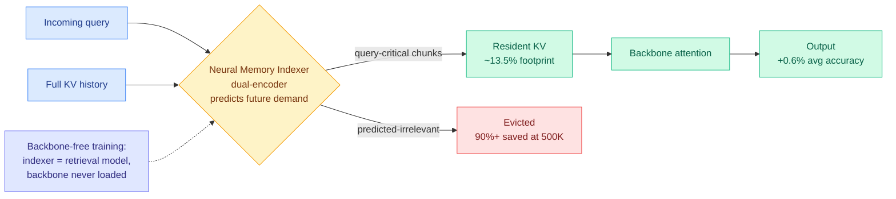
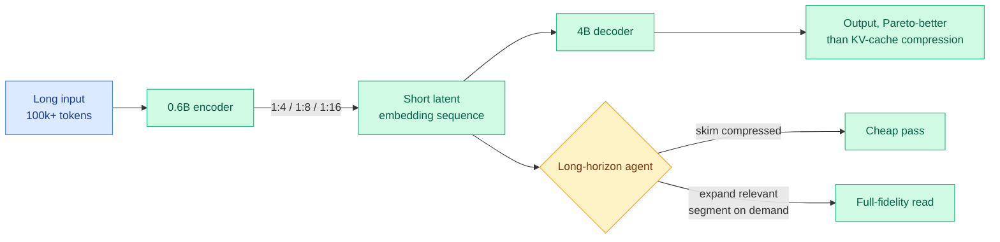
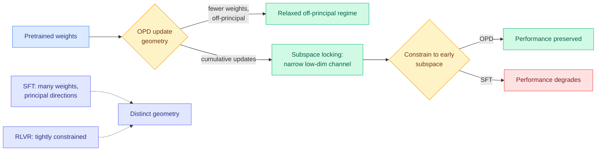
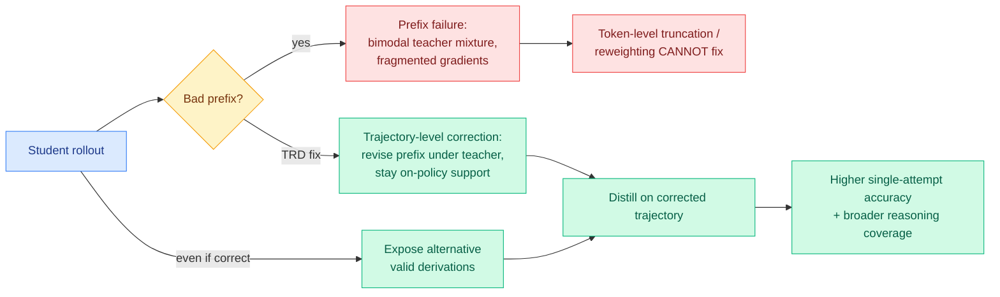
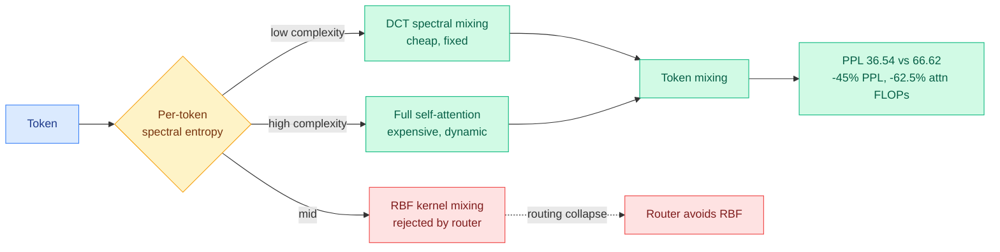
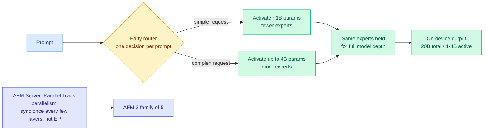
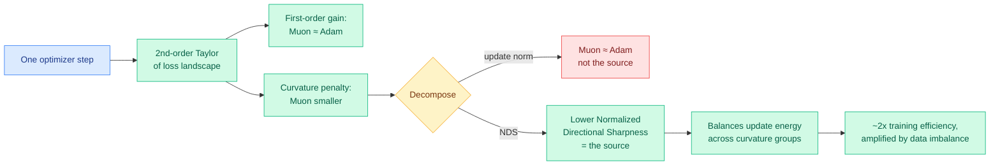

# cere-bro | 2026-06-09

> The 500K-context memory wall got two opposite answers on the same day, and on-policy distillation stopped getting new tricks and started getting autopsies. Both shifts say the field is maturing its 2026 workhorses from "does it work" to "why does it work."

---

## TL;DR

- **FlashMemory-DeepSeek-V4**: a small indexer predicts which past tokens future queries will need and evicts the rest. KV cache shrinks to 13.5% of full, 90%+ at 500K context.
- **Latent Context LMs**: skip the KV cache entirely. Compress long input into short latent vectors with a trained encoder-decoder, beating cache compression on the accuracy-efficiency curve.
- **Geometry of On-Policy Distillation**: distillation updates lock into a narrow low-dimensional subspace early, which is why selecting 10% of tokens always worked.
- **Trajectory-Refined Distillation**: when a rollout goes wrong early, no token-level fix can save it. Repair the bad prefix instead of reweighting tokens.
- **Chiaroscuro Attention**: route each token to a cheap fixed mixer or expensive attention by its complexity. 45% lower perplexity at 62.5% fewer attention FLOPs.
- **Apple AFM 3**: a 20B on-device MoE picks its experts and compute budget once per prompt, shipping per-request adaptive compute to phones.
- **Why Muon beats Adam**: the 2x training-efficiency win is a curvature effect, not a bigger step. Muon spends less energy on sharp directions.
- **Industry**: OpenAI files a confidential IPO S-1, Cursor crosses $4B ARR, Anthropic poaches OpenAI's second chip engineer.

---

## Deep Dives

### FlashMemory-DeepSeek-V4: predict which memories you'll need, evict the rest

> Every other KV-cache eviction policy scores tokens by how they were used in the past. This one predicts which stored keys and values *future* queries will demand and keeps only those, cutting the physical KV cache to 13.5% of full while accuracy ticks up.

**Source:** HuggingFace Daily Papers
**Links:** [Paper](https://arxiv.org/abs/2606.09079) · [Wiki summary](../../inference-efficiency/2026-06-09-flashmemory-ds-v4-lookahead-sparse-attention.md)

**What is it about?**
The KV cache (the stored attention keys and values for every past token, so the model does not recompute them each step) is the dominant GPU memory cost when serving ultra-long contexts. FlashMemory adds Lookahead Sparse Attention (LSA): a small Neural Memory Indexer that predicts which chunks of the cache upcoming queries will need and keeps only those in GPU memory.

**What problem does it solve?**
Standard eviction is reactive. It scores tokens by past attention mass, recency, or value magnitude, all backward-looking. The risk is evicting something the model is about to need. LSA flips the direction: it forecasts demand instead of measuring history.

**What is the core novelty?**
Two things. The lookahead indexer is the conceptual move. The practical move is "backbone-free decoupled training": the indexer is framed as an ordinary dual-encoder retrieval model and trained with off-the-shelf retrieval pipelines, so the giant DeepSeek-V4 backbone never has to be loaded into GPU memory to train it. That is what makes a frontier-scale memory indexer affordable to build.

**Key takeaways**
- Average physical KV footprint drops to 13.5% of the full-context baseline, with +0.6% absolute accuracy on average across LongBench-v2, LongMemEval, and RULER.
- At 500K-token context, physical KV overhead falls more than 90% with the backbone's reasoning intact.
- Dropping predicted-irrelevant history slightly *improves* accuracy, acting as an attention denoiser, the same "the full cache is not the ceiling" argument as Make-Each-Token-Count (05-12, learned eviction that beats the full cache by reducing attention dilution).

**Gaps in the study**
The headline is physical memory footprint, not end-to-end serving throughput under production batching. A mispredicting indexer is a silent failure: a chunk dropped that a later query needed, with no recompute path described.

**Industrial implication**
This is built directly on the DeepSeek-V4 backbone (05-25, the production model that already interleaves three compressed-attention regimes per layer), so it is a near-term serving upgrade, not a lab toy. If a 90%-at-500K KV cut holds under independent reproduction, long-context inference pricing has another leg down in Q3, and the predictive-indexer pattern likely shows up in vLLM/SGLang within a quarter.

→ [Full summary](../../inference-efficiency/2026-06-09-flashmemory-ds-v4-lookahead-sparse-attention.md)

---

### Latent Context Language Models: don't compress the cache, never build it

> The whole KV-compression field assumes you keep a cache and shrink it. This paper revives the opposite idea, long thought inferior, and trains it at scale: squeeze the long input into a short sequence of latent vectors with an encoder-decoder, and beat cache compression on the accuracy-efficiency frontier.

**Source:** HuggingFace Daily Papers
**Links:** [Paper](https://arxiv.org/abs/2606.09659) · [Wiki summary](../../inference-efficiency/2026-06-09-lclm-end-to-end-context-compression.md)

**What is it about?**
Latent Context Language Models (LCLMs) use a small encoder to map a very long input into a short sequence of latent embeddings, which a separate decoder then reads. The cache never grows with input length because the input is consumed once by the encoder and turned into a fixed, compact latent.

**What problem does it solve?**
KV-cache compression has two practical pains the paper calls out: many methods need the input to fit inside the target model's context window, and they break modern inference engines. Encoder-decoder compression sidesteps both. Prior encoder-decoder compressors just were not competitive on quality, so the idea was shelved.

**What is the core novelty?**
Treating compression as a first-class pre-training objective and finding the right design by brute force. The authors pre-train many encoder-decoder variants from scratch in an architecture search, then continually pre-train the winning 0.6B-encoder / 4B-decoder family on 350B+ tokens each at 1:4, 1:8, and 1:16 compression. That scale is what finally pushes encoder-decoder compression past KV-cache compression on the Pareto frontier.

**Key takeaways**
- Three shipped compression ratios (1:4, 1:8, 1:16), so the latent budget is a knob.
- Improves the frontier across three axes at once: general-task accuracy, compression speed, and peak memory.
- Serves long-horizon agents via skim-then-expand: the agent reads the compressed latent first and pays to expand only the segments it needs, the same selective-recall instinct as FlashMemory's predictive indexer above.

**Gaps in the study**
The decoder is only 4B; whether the advantage over KV-cache compression survives at frontier (70B+) decoder scale is untested. The 1:16 ratio's recall on needle-in-haystack retrieval versus lossless full context is the number that can hide long-tail loss behind "general-task" averages.

**Industrial implication**
LCLM and FlashMemory are the two poles of long-context efficiency arriving the same day: drop the cache chunks (LSA) versus never form them (LCLM). For agent builders the skim-then-expand backbone is the more interesting half: it makes a million-token working set a cheap index rather than a memory bill, which is exactly what multi-turn coding and document agents need.

→ [Full summary](../../inference-efficiency/2026-06-09-lclm-end-to-end-context-compression.md)

---

### On the Geometry of On-Policy Distillation: why selecting 10% of tokens always worked

> On-policy distillation has been the wiki's most-tracked post-training method all spring, and nobody knew what it actually does to the weights. This paper shows the useful update collapses into a tiny low-dimensional subspace early in training, which retroactively explains the whole "just keep the important tokens" literature.

**Source:** HuggingFace Daily Papers
**Links:** [Paper](https://arxiv.org/abs/2606.07082) · [Wiki summary](../../inference-efficiency/2026-06-09-geometry-on-policy-distillation.md)

**What is it about?**
On-policy distillation (OPD, where the student generates its own answers and learns from the teacher's token-by-token probabilities over them) is compared, in parameter space, against supervised fine-tuning (SFT, training on fixed teacher demonstrations) and RLVR (reinforcement learning from a verifier that only says right or wrong). The paper measures *where* in the weights each method moves.

**What problem does it solve?**
OPD was treated as a black box that empirically beat SFT and sat somewhere near RLVR. Nobody had characterized its training dynamics, so every selective-OPD method was tuned by trial.

**What is the core novelty?**
The diagnosis of subspace locking. OPD's cumulative updates rapidly enter a narrow low-dimensional channel, and constraining training to that early subspace preserves OPD performance while badly degrading SFT, proving the channel is functionally sufficient for OPD specifically. Control experiments are the clincher: sparsifying the update tokens and going off-policy both preserve the rank dynamics, but mixing in RLVR changes them, so the geometry belongs to the OPD objective, not to on-policy sampling.

**Key takeaways**
- OPD induces its own update geometry, not a blend of SFT and RLVR.
- The locked subspace forms early and carries the learning, so the bulk of the per-token update is redundant.
- This explains the spring selection line at once: TIP (04-16, under 10% of tokens carry signal), TA-OPD (06-01, only teacher corrections the student can actually reach), and OPRD (06-05, distill hidden states instead of output logits) all worked because the useful update was always confined to that narrow channel.

**Gaps in the study**
Diagnostics run on specific model pairs and scales; whether locking holds at frontier scale or for non-reasoning tasks is open. The paper does not turn "constrain to the early subspace" into a cheaper training recipe, which is the obvious next step.

**Industrial implication**
If OPD genuinely locks low-rank early, it could be run as an explicit LoRA-shaped low-rank update with no quality loss, cutting optimizer memory on the post-training phase that frontier labs now iterate most. The open prize: predict the locked subspace *before* training rather than observing it after.

→ [Full summary](../../inference-efficiency/2026-06-09-geometry-on-policy-distillation.md)

---

### Trajectory-Refined Distillation: a wrong first step poisons every token-level fix

> The entire spring distillation program argued about which tokens to keep or reweight. TRD says that whole framing fails when the student's rollout goes wrong early, and the fix is to repair the bad prefix, not to fiddle with token weights on a doomed trajectory.

**Source:** HuggingFace Daily Papers
**Links:** [Paper](https://arxiv.org/abs/2606.08432) · [Code](https://github.com/louieworth/trd) · [Wiki summary](../../inference-efficiency/2026-06-09-trd-trajectory-refined-distillation.md)

**What is it about?**
TRD is an on-policy distillation method that operates at the trajectory level rather than the token level. It identifies a structural failure it calls prefix failure and corrects it before distilling.

**What problem does it solve?**
When the student's rollout takes a wrong turn early, the teacher's per-token distribution over the rest of that bad path becomes bimodal (it wants to both continue the student's path and jump back to the correct one), which fragments the gradient. Token-level truncation or reweighting acts too late, on a trajectory already off the rails.

**What is the core novelty?**
A level shift from statistics to structure. Instead of reweighting tokens, TRD revises the problematic prefix under teacher guidance while staying within on-policy support, fixing the failure at its source. As a bonus it broadens exploration by surfacing alternative valid derivations even when the original rollout was already correct, and it extends to self-distillation where a privileged-information-conditioned student teaches itself.

**Key takeaways**
- Prefix failure is a named, structural cause that token-level interventions provably cannot address.
- TRD repairs bad trajectories where FiRe-OPD (06-04, filter-then-reweight) merely discarded them, salvaging the signal FiRe threw away.
- Consistent gains over prior OPD baselines on single-attempt accuracy and reasoning coverage across model scales.

**Gaps in the study**
Revising the prefix needs the teacher to generate corrections, adding rollout cost over plain OPD that is not foregrounded. Prefix failure is demonstrated on reasoning tasks with clear correctness; for open-ended generation, where "correct prefix" is undefined, transfer is untested.

**Industrial implication**
TRD and the Geometry paper are mechanism papers landing the same day on the method that Qwen3, DeepSeek-V4, MiMo-V2, and GLM-5 all already use in post-training. The practical signal for any team running OPD: stop tuning token weights on broken rollouts and add a prefix-repair step. The two papers together say OPD's behavior is governed by structure, not per-token statistics.

→ [Full summary](../../inference-efficiency/2026-06-09-trd-trajectory-refined-distillation.md)

---

### Chiaroscuro Attention: send easy tokens through a cheap mixer, hard ones through attention

> Transformers run full self-attention on every token even when most tokens need nothing dynamic. CHIAR-Former routes each token by its complexity to a cheap fixed spectral mixer or to attention, and gets 45% lower perplexity at 62.5% fewer attention FLOPs.

**Source:** HuggingFace Daily Papers
**Links:** [Paper](https://arxiv.org/abs/2606.08327) · [Wiki summary](../../ai-routing/2026-06-09-chiaroscuro-attention-spectral-routing.md)

**What is it about?**
CHIAR-Former is a hybrid transformer that routes each token to one of three token-mixing operators: a cheap DCT spectral transform (a fixed frequency-domain mix, no learning per token), an RBF kernel mix, or full self-attention. The routing signal is per-token spectral entropy, a measure of how complex the token's local frequency content is.

**What problem does it solve?**
Uniform attention spends quadratic compute on tokens that do not need cross-token interaction. The question is how to spend the expensive operator only where it earns its keep.

**What is the core novelty?**
Routing token mixing by a theoretically grounded complexity signal, and an honest negative result turned into a design rule: given three operators the learned router collapses to using only DCT and attention, rejecting RBF entirely. The authors read this as evidence that spectral mixing and dynamic attention are complementary and sufficient, and ship the deliberate two-operator variant.

**Key takeaways**
- 45% perplexity improvement over a full-attention baseline (36.54 vs 66.62 on WikiText-103) at 62.5% fewer attention FLOPs.
- The win comes from routing easy tokens away from quadratic attention, not from approximating attention everywhere.
- The failure regime is named, not hidden: small datasets and synthetic pattern tasks (ListOps) still want full attention, so spectral routing earns its keep specifically on large naturalistic text.

**Gaps in the study**
This is a 4-layer model at WikiText scale. The 45% win may not survive at billions of parameters, where attention's expressivity matters more, and the per-token entropy router adds overhead the FLOP accounting underweights.

**Industrial implication**
This is the per-token granularity of the routing-as-compute-allocation idea, and it lands the same day Apple shipped the per-prompt version to phones (below). If spectral entropy reliably flags which tokens need dynamic attention, it is a candidate signal for KV decisions too: tokens routed to the cheap mixer may not need full-fidelity keys and values, connecting this directly to today's FlashMemory eviction work.

→ [Full summary](../../ai-routing/2026-06-09-chiaroscuro-attention-spectral-routing.md)

---

### Apple AFM 3: a 20B on-device model that picks its compute budget once per prompt

> Apple shipped per-request adaptive compute into hundreds of millions of phones. Its new on-device model is a 20B mixture-of-experts that decides, once and up front, which experts and how much compute a given prompt deserves.

**Source:** Twitter/X (@eliebakouch, Hugging Face) → Apple ML Research blog
**Links:** [Apple ML Research](https://machinelearning.apple.com/research/introducing-third-generation-of-apple-foundation-models) · [Wiki summary](../../llms-foundation-models/2026-06-09-apple-afm3-foundation-models.md)

**What is it about?**
Apple's third-generation Foundation Models (AFM 3), unveiled at WWDC 2026, are a family of five models built with Google, from on-device to Private Cloud Compute. The routing-relevant piece is AFM 3 Core Advanced: a natively multimodal 20B-total sparse mixture-of-experts (MoE, where each token uses only a small subset of specialized sub-networks) that activates just 1 to 4B parameters at a time.

**What problem does it solve?**
On-device inference has a hard compute and battery budget. A dense 20B model is too expensive to always run; a fixed-size small model leaves quality on the table for hard prompts. Apple wants the cheapest sufficient compute per request.

**What is the core novelty?**
Early routing: a single up-front decision per prompt selects which experts fire and, apparently, how many active parameters to allocate (1 to 4B), and holds that choice for the entire forward pass. This is coarser than standard per-token, per-layer MoE routing, but cheaper to serve and predictable in latency, a deliberate on-device tradeoff. The server model adds Parallel Track (PT) parallelism, which syncs once every few layers rather than per layer like expert parallelism, cutting communication.

**Key takeaways**
- Per-prompt adaptive compute, decided once and committed for full depth, shipped to consumer devices at massive scale.
- 20B total with 1 to 4B active, the regime where stable MoE scaling (the Kurate-rated MoE-muP parameterization, 05-17) matters most.
- @eliebakouch flags an open detail: it is unclear whether the early decision does layer selection or expert selection.

**Gaps in the study**
Apple's blog reports architecture, not independent benchmarks, so quality versus Gemma 4 or Qwen on-device peers is unverified. Whether the coarse per-prompt allocation costs accuracy on mixed-difficulty prompts, where per-token routing would adapt mid-sequence, is the open question.

**Industrial implication**
This is the product proof of the routing-as-compute-allocation thesis the wiki has tracked from CLEAR (06-05, ration inference compute across a batch with one shadow price) to the Kilo Code audit (06-07, a 7-cent open model matched a 70-cent frontier run). Apple put input-conditioned compute allocation in everyone's pocket, decided up front. Expect "adaptive compute per request" to become a standard on-device serving feature, and watch whether the per-prompt coarseness becomes a measurable quality ceiling.

→ [Full summary](../../llms-foundation-models/2026-06-09-apple-afm3-foundation-models.md)

---

### Why Muon Outperforms Adam: the 2x win is curvature, not bigger steps

> Muon trains LLMs about twice as efficiently as Adam, and the explanations were hand-waves. This paper shows the advantage is entirely a second-order curvature effect: Muon spends less update energy on sharp directions of the loss landscape.

**Source:** HuggingFace Daily Papers
**Links:** [Paper](https://arxiv.org/abs/2606.04662) · [Wiki summary](../../llms-foundation-models/2026-06-09-why-muon-outperforms-adam.md)

**What is it about?**
Muon is the optimizer that has displaced Adam for much of frontier LLM pretraining, with roughly a 2x efficiency edge. This paper explains the edge through the local geometry of the loss landscape, using a second-order Taylor approximation.

**What problem does it solve?**
Prior explanations leaned on associative memory or long-tailed data and never pinned down the geometric source. Without that, optimizer choice stays folklore.

**What is the core novelty?**
A clean decomposition. At matched validation loss Muon achieves a larger one-step loss decrease than Adam; the first-order gains and the update norms are comparable, so the win lives entirely in a smaller second-order curvature penalty. Decomposing that penalty into update norm times Normalized Directional Sharpness (NDS, how aligned the update is with high-curvature directions) shows Muon wins on NDS, not norm. It spreads update energy across curvature groups instead of piling into sharp directions.

**Key takeaways**
- The advantage is curvature conditioning, not step size: matched norm, lower NDS.
- Data imbalance amplifies the gap. On controlled Zipf-distributed grammar data, more imbalance means a larger Muon advantage, and real text is heavily Zipfian.
- The gain localizes to smaller within-layer curvature in the middle and late stages of training, and a stylized quadratic analysis proves Muon attains lower average NDS than gradient descent.

**Gaps in the study**
The proof is for stylized quadratics; the bridge to real networks is empirical. NDS is measured after the fact, not predicted, so the paper explains when Muon helps rather than forecasting it.

**Industrial implication**
This reframes the most important optimizer in frontier pretraining as a curvature-conditioning method, which gives the next optimizer a concrete target: explicitly minimize NDS and you may beat Muon. The data-imbalance finding also opens an unexplored joint design space, where data mixing and optimizer choice interact rather than being tuned separately.

→ [Full summary](../../llms-foundation-models/2026-06-09-why-muon-outperforms-adam.md)

---

## Industry Pulse

- **OpenAI filed a confidential IPO S-1**, announcing it via Rule 135 because it expected the filing to leak, while saying timing is undecided ([OpenAI Newsroom via @ns123abc](https://nitter.net/ns123abc/status/2064097290948575480#m)).
- **Cursor crossed $4B annualized revenue**, doubling in four months ($2B February, $3B April, $4B last week), with SpaceXAI reportedly holding a $60B option to buy it ([Forbes](https://www.forbes.com/sites/richardnieva/2026/06/08/cursor-4-billion-annualized-revenue/)).
- **Anthropic poached OpenAI's second-ever chip engineer, Clive Chan**, signaling a serious push into custom energy-efficient silicon ahead of a potential IPO ([AI Breakfast](https://the-decoder.com/anthropic-poaches-openais-second-ever-chip-engineer-as-both-companies-race-toward-ipos/)).
- **Apple expanded Private Cloud Compute to Google Cloud running on NVIDIA GPUs**, the infrastructure under the new Siri and AFM 3 ([@nvidia](https://nitter.net/nvidia/status/2064100362752294992#m)).
- **The US government is in talks to take a direct equity stake in OpenAI**, an idea reportedly pitched by Sam Altman, which other AI firms learned about from the news ([NOTUS via @ns123abc](https://www.notus.org/technology/trump-blindsided-ai-companies-equity-meeting-plan)).
- **MiniMax M3 now runs at half its standard input price with a 1M-token context window**, part of a broad model-price race to the bottom alongside Xiaomi and DeepSeek cuts ([@kilocode](https://nitter.net/kilocode/status/2064107855519592765#m)).
- **Gary Marcus cited a Wachter & Wachter study** arguing the AI buildout needs ~2.7x economy-wide productivity growth by 2028 to avoid being the largest capital misallocation in history ([Marcus on AI](https://garymarcus.substack.com/p/an-entire-industry-is-being-propped)).
- **OpenAI walked back maximalism**, now saying entirely automating everything is not the goal, a tonal shift days after declaring "chat is dead" ([The Decoder](https://the-decoder.com/openai-now-says-entirely-automating-everything-is-not-t)).

---

## Global View

**The 500K-context memory wall is now a two-front research war, and industry is paying the bill that motivates it.** Two opposite answers landed the same day: FlashMemory-DeepSeek-V4 keeps the KV cache but predictively evicts to 13.5% of full, while Latent Context LMs skip the cache entirely by compressing input into latent vectors, each beating the prior frontier. Both build on the year's convergence that memory bandwidth, not FLOPs, is the wall (DeepSeek-V4's three-tier compressed attention 05-25; the Ken Huang memory survey 06-07 naming KV cache as the binding constraint as context grows). The industry signal underneath is blunt: Google is reportedly renting 110,000 NVIDIA GPUs from SpaceX for ~$920M/month despite owning TPUs, and MiniMax just halved the price on a 1M-token model. Compute is scarce enough to rent at any price and cheap-long-context is already a competitive weapon, which is exactly why a 90%-at-500K KV cut is a pricing event, not a lab curiosity.

**On-policy distillation stopped getting tricks and started getting autopsies, the signature of a maturing workhorse.** All spring the wiki tracked OPD *interventions* arguing which tokens to keep (TIP 04-16, under 10% carry signal), reach (TA-OPD 06-01), or trust (TrOPD 06-03). Today three papers asked what OPD *is*: the Geometry paper found updates lock into a narrow subspace early (explaining why token selection always worked), TRD found that a wrong early step poisons every token-level fix (so repair the prefix instead), and PBSD pushed the same privileged-teacher self-distillation device into turn-level credit assignment for agents. This is the same method Qwen3, DeepSeek-V4, MiMo-V2, and GLM-5 already ship, so the autopsies are not academic: they hand production teams a concrete recipe (low-rank OPD, prefix repair) for the post-training phase that RL-Kernel's 06-08 release confirmed is now the expensive, iterated stage of building a frontier model.

**Routing-as-compute-allocation crossed from research into your pocket the same day a per-token version appeared in the lab, and the economics explain the urgency.** Chiaroscuro routes each token to a cheap or expensive mixer; Apple's AFM 3 routes each prompt to an expert set and a compute budget, shipped to hundreds of millions of phones. Both are the input-conditioned compute allocation the wiki traced from CLEAR's shadow-price rationing (06-05) to the Kilo audit's 7-cent-matches-70-cent finding (06-07). The financial backdrop is why this is the dominant 2026 theme rather than a niche: with OpenAI filing to IPO, Cursor at $4B ARR doubling quarterly, and Gary Marcus citing a study that the buildout needs 2.7x economy-wide productivity to pay off, right-sizing compute per request is no longer an efficiency nicety, it is the margin story the whole sector is being valued on.

---

## Looking Ahead

- **A production inference engine ships predictive ("lookahead") KV eviction within 60 days.** FlashMemory's indexer-predicts-future-demand pattern is a clean drop-in over the reactive eviction (recency, attention mass, value magnitude) that vLLM and SGLang already support. **Signal:** vLLM, SGLang, or TensorRT-LLM lands a lookahead/learned-indexer KV eviction option and reports a long-context memory cut, or an independent repro confirms the 90%-at-500K number on a non-DeepSeek backbone.
- **An OPD paper composes the now-named axes into one method within 90 days.** The Geometry (subspace), TRD (prefix repair), TA-OPD (token teachability), and TrOPD (trust region) facets are all isolated; the joint formulation is the obvious unwritten paper. **Signal:** a post-training paper runs OPD as an explicit low-rank update confined to the early-locked subspace, with prefix repair, and reports matched accuracy at lower optimizer memory.
- **Apple AFM 3's per-prompt early routing shows a measurable accuracy ceiling on mixed-difficulty prompts within 60 days.** Coarse per-prompt allocation cannot adapt mid-sequence the way per-token MoE does. **Signal:** an independent eval shows AFM 3 Core Advanced trailing a per-token-routed peer specifically on prompts whose difficulty shifts partway through, or Apple publishes an ablation defending the once-per-prompt choice.
- **Mythos's measured N-day exploit uplift draws a frontier defensive counter within 30 days of public release.** Anthropic published the offensive number deliberately to give defenders lead time. **Signal:** a lab ships or benchmarks an LLM-driven patch-triage / auto-patching tool framed against the same N-day patch-gap, or Mythos's public release notes quantify a defensive capability alongside the offensive one.
- **LLM-rated underrated from Kurate:** "How to Scale Mixture-of-Experts: From muP to the Maximally Scale-Stable Parameterization" (cs.LG #10, ai_rating 9.0, already a wiki concept page) and "Pretraining Recurrent Networks without Recurrence" (cs.LG #16, Kumar & Isola, ai_rating 7.5) remain top-rated on Kurate yet absent from today's HuggingFace top, the same pair flagged 06-08. The MoE-scaling work is now directly load-bearing: Apple's 20B/1-4B-active AFM 3 is exactly the stable-scaling regime it addresses. **Signal:** a fully-open model ships built on the non-recurrent recurrent-pretraining recipe by 2026-08, giving the "RNN-speed, transformer-quality" thesis its first real test.

---

*No HuggingFace + Kurate arxiv-ID overlap today: Kurate's weekly boards remain biomedical and scientific-foundation-model heavy (cs.AI top is clinical-physiology and medical-claims foundation models; cs.LG top is virtual-patient and scientific-discovery scaling) and run weeks older than today's HF batch. Rising authors from Kurate this week are the same persistent clinical-physiology (Guy Lutsker et al., cs.AI #1) and virtual-patient (Andrew Zhang et al., cs.LG #1) clusters as prior weeks; none touches routing, KV cache, compression, or GPU, so none warrants a Twitter-handle add. All eight Reddit subs (LocalLLaMA, MachineLearning, MLScaling, CUDA, LLMDevs, ControlProblem, HPC, reinforcementlearning) returned no posts past their filters in this 24h window.*
