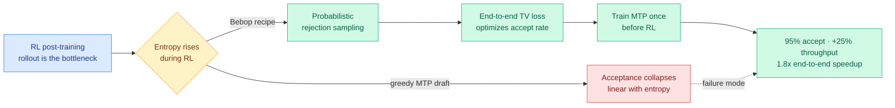
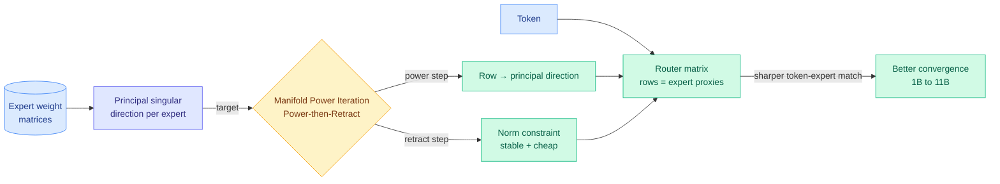
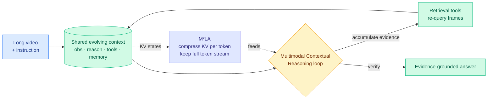
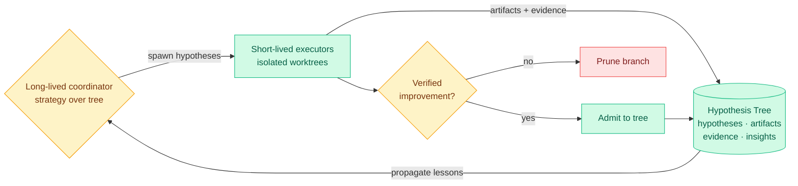
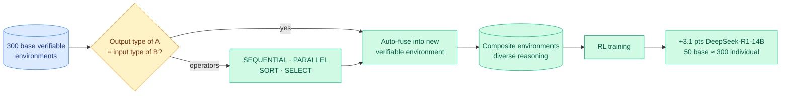
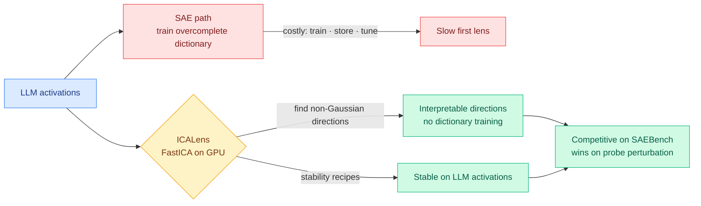
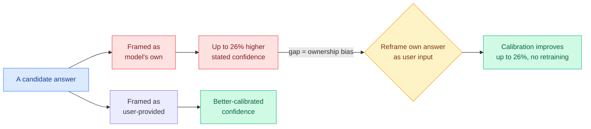

# cere-bro | 2026-06-11

> The frontier moved from evolving the agent to manufacturing the substrate it learns from, while three efficiency papers and an honesty result quietly reset what "good" costs and what "confident" means.

---

## TL;DR

- **Bebop**: multi-token-prediction drafting loses its speedup during RL because rising entropy caps the acceptance rate. A rejection-sampling recipe recovers up to 95% acceptance and 1.8x faster RL training.
- **MoE router redesign (MPI)**: align each router row with its expert's principal singular direction. A cheap power-iteration step makes 1B to 11B mixture-of-experts models converge better.
- **Agent substrate day**: four papers (Arbor, EvoTrainer, RACES, DeNovoSWE) stop tuning the model and start auto-building the environments, harnesses, and data agents learn from.
- **InternVideo3**: a long-video agent with M²LA, a KV-cache compression that shrinks memory per token while keeping every token retrievable.
- **Ownership bias**: models trust an answer 26% more when it is framed as their own versus the user's. Reframing it as user input fixes calibration for free.
- **Anthropic walks back invisible Fable 5 throttling**: after researchers called secret degradation "sabotage," safeguards become visible and admit "we made the wrong tradeoff."

---

## Deep Dives

### Bebop: why multi-token-prediction speedups die during RL, and how to bring them back

> Drafting several tokens at once is supposed to make reinforcement-learning rollouts faster. Bebop shows the speedup collapses because RL raises model entropy, and the acceptance rate is bounded by entropy in a near-straight line. Hold entropy's effect at bay and the speedup returns.

**Source:** HuggingFace Daily Papers
**Links:** [Paper](https://arxiv.org/abs/2606.12370) · [Wiki summary](../../inference-efficiency/2026-06-11-bebop-mtp-rejection-sampling-rl.md)

**What is it about?**
Reinforcement learning is now the expensive last stage of building a reasoning model, and the slow part of RL is the rollout, where the model generates long answers to score. Multi-token prediction (MTP, drafting several future tokens in one pass so a verifier can accept them together) should speed rollouts up through speculative decoding. Bebop studies why, in practice, it stops helping.

**What problem does it solve?**
Teams kept observing that MTP acceptance rates degrade as RL proceeds, so the promised speedup never materializes. Nobody had a mechanism for it, so the fixes were ad hoc, including costly online re-training of the draft head.

**What is the core novelty?**
The mechanism: MTP acceptance is negatively and almost linearly bounded by model entropy, and RL deliberately raises entropy to keep exploring. Given that, Bebop swaps greedy draft sampling for probabilistic rejection sampling (which absorbs the entropy shift), replaces the usual cross-entropy or KL draft objective with an end-to-end total-variation loss that optimizes the multi-step acceptance rate directly, and trains the MTP head once before RL instead of chasing it online.

**Key takeaways**
- Acceptance is capped by entropy, so the speedup fails exactly when the rollout stage is most expensive.
- The TV loss lifts acceptance by about 10 points to as high as 95%.
- Pre-RL training holds acceptance steady across the whole run, removing online MTP updates.
- Up to 25% extra throughput and up to 1.8x end-to-end speedup on async RL of Qwen3.5, 3.6, and 3.7.

**Gaps in the study**
Demonstrated on the Qwen3.x family and the listed task types only. The entropy-acceptance relationship is shown empirically as near-linear, but the paper does not establish how far it holds at very high exploration temperatures or on much larger models.

**Industrial implication**
This couples two knobs labs thought were independent. Anything that holds entropy down, such as a tighter trust region like yesterday's [DRPO](../../llms-foundation-models/2026-06-10-drpo-divergence-regularized-policy-optimization.md) (06-10, which softens the trust-region cutoff so diverging tokens are corrected rather than discarded), should by this paper's own relationship raise MTP acceptance for free. Frontier RL pipelines get a cheaper rollout stage without a new drafter architecture.

→ [Full summary](../../inference-efficiency/2026-06-11-bebop-mtp-rejection-sampling-rl.md)

---

### Redesign Mixture-of-Experts Routers with Manifold Power Iteration

> A mixture-of-experts router decides which experts each token visits, yet nothing in normal training forces a router's representation of an expert to be accurate. This paper gives the missing principle: point each router row at its expert's most expressive direction.

**Source:** HuggingFace Daily Papers
**Links:** [Paper](https://arxiv.org/abs/2606.12397) · [Wiki summary](../../llms-foundation-models/2026-06-11-moe-router-manifold-power-iteration.md)

**What is it about?**
In a mixture-of-experts model (MoE, where each token routes through a small subset of specialized sub-networks instead of the whole network), a router matrix picks the experts. Each router row is meant to act as a compact stand-in for one expert, so the dot product between a token and that row reflects how well the token matches the expert.

**What problem does it solve?**
There has never been a design rule forcing a router row to actually represent its expert. Without one, routing is imprecise, which slows training convergence and limits how competent the model becomes.

**What is the core novelty?**
Align each router row with the principal singular direction of its expert's weight matrix, the single vector that captures the most of what that expert does. Manifold Power Iteration enforces this with a "Power-then-Retract" step: a power-iteration update pushes the row toward that direction, then a retraction imposes a norm constraint for stability and low cost. The authors prove the rows converge to the principal singular directions.

**Key takeaways**
- Supplies a first-principles target for what a router row should be, rather than leaving it to chance.
- The power-then-retract update is cheap and stable, not a heavy add-on.
- Pretraining from 1B to 11B parameters confirms the alignment yields more effective MoE models.

**Gaps in the study**
The leap from "principal singular direction is the most expressive vector" to "therefore it is the best routing key" is asserted, not proven optimal. An expert's most-used direction in practice may drift from its top singular direction as it specializes late in training, so whether the alignment needs periodic refresh is open.

**Industrial implication**
Every large open MoE (the Gemma 4 26B with 128 experts that shipped this week, the Qwen and DeepSeek MoE lines) carries a router trained without this constraint. If MPI's convergence benefit holds at frontier scale, it is a near-free pretraining-recipe change that improves the model at no inference cost, which is the kind of margin lever labs adopt quickly.

→ [Full summary](../../llms-foundation-models/2026-06-11-moe-router-manifold-power-iteration.md)

---

### InternVideo3: a long-video agent that keeps every token but shrinks the cache

> Most long-video models save memory by throwing tokens away. InternVideo3 is built around an agent that may need to look back at an earlier frame, so it compresses the memory per token instead and keeps every token addressable.

**Source:** HuggingFace Daily Papers
**Links:** [Paper](https://arxiv.org/abs/2606.12195) · [Wiki summary](../../inference-efficiency/2026-06-11-internvideo3-m2la-kv-compression.md)

**What is it about?**
Agentic behavior (multi-step reasoning plus tool use) has mostly been a text story. InternVideo3 brings it to long video, where the model has to track evidence across a long temporal window. Its framing, Multimodal Contextual Reasoning, treats understanding as a closed loop over an evolving context of observations, reasoning, tool calls, and memory.

**What problem does it solve?**
Long video is expensive to hold in memory, and the usual fix, evicting or merging visual tokens, breaks an agent that needs to re-inspect an earlier frame. You cannot retrieve a token you deleted.

**What is the core novelty?**
M²LA (Multimodal Multi-head Latent Attention) compresses the key-value cache (the memory store that saves previous attention computations so they are not recomputed) by projecting each token's KV state into a low-rank latent, while keeping the full token stream intact. It is the low-rank-latent-KV idea carried into the multimodal, multi-head, long-video regime, paired with a closed-loop retrieval agent and a short-to-long training curriculum.

**Key takeaways**
- Token-preserving compression keeps every frame retrievable, which an agentic loop needs.
- Strong results on Video-MME, MLVU, and EgoSchema, and it runs as a retrieval-tool video agent.
- Trained in stages: continued pretraining, short-to-long supervised fine-tuning, rule-based RL, on-policy distillation.

**Gaps in the study**
Token-preserving compression trades a smaller per-token cache for keeping all tokens resident, so the net memory win versus eviction baselines like VideoMLA and WorldKV depends on the compression ratio, which the abstract does not report.

**Industrial implication**
This pairs with yesterday's [Latent Memory](../../inference-efficiency/2026-06-10-latent-memory-one-token-evidence.md) (06-10, store each evidence item as one latent token at 3x to 10x fewer generator tokens) as the two token-policy extremes for affording a long-horizon multimodal agent. The open lever is selectively retrieving into the latent cache rather than keeping it fully resident, which would turn M²LA from compression into a retrieval-addressable video memory.

→ [Full summary](../../inference-efficiency/2026-06-11-internvideo3-m2la-kv-compression.md)

---

### Arbor: autonomous research that remembers as a tree, not a transcript

> An AI research agent that runs for a long time forgets what it tried and why. Arbor keeps a persistent tree linking every hypothesis to its evidence and its lesson, and admits only changes that verify as real improvements.

**Source:** HuggingFace Daily Papers
**Links:** [Paper](https://arxiv.org/abs/2606.11926) · [Wiki summary](../../agentic-systems/2026-06-11-arbor-hypothesis-tree-refinement.md)

**What is it about?**
Arbor runs the research loop (explore, experiment, abstract) autonomously over long horizons. Its core is a Hypothesis Tree: a persistent structure where each node links a hypothesis to the artifacts built to test it, the evidence returned, and the distilled insight. A long-lived coordinator owns global strategy; short-lived executors test individual hypotheses in isolated git worktrees.

**What problem does it solve?**
Autonomous research usually degrades into a sequence of disconnected local attempts. Lessons learned on one branch are lost, and the agent re-explores dead ends. Arbor makes the process cumulative.

**What is the core novelty?**
Two things. The persistent tree turns research state into structured, durable memory that propagates reusable lessons across branches. And the verified-improvement gate admits only changes that test as real gains, which is the architectural answer to the recurring worry that agents store confident-but-wrong conclusions and keep acting on them.

**Key takeaways**
- Best held-out result on all six Autonomous-Optimization tasks (model training, harness engineering, data synthesis).
- More than 2.5x the average held-out gain of Codex and Claude Code at the same budget and interface.
- 86.36% Any-Medal on MLE-Bench Lite with GPT-5.5.

**Gaps in the study**
The verified-improvement gate protects artifacts but not necessarily insights: the tree can still propagate a confident-wrong *lesson* across branches faster than a flat agent would. And "same interface, same budget" comparisons depend heavily on how the baselines were configured.

**Industrial implication**
The 2.5x gain comes from memory and orchestration, not a stronger model, which is more evidence that the next agent gains live in the harness, not the weights. It is the research counterpart to the agent products shipping this quarter (nested subagents in Claude Code, parallel subagents in Antigravity), and it ships the verifier-gate that yesterday's [Honest Lying](../../agentic-systems/2026-06-09-honest-lying-memory-confabulation.md) (06-09, agents store confident-but-wrong interpretations and never correct them) said was missing.

→ [Full summary](../../agentic-systems/2026-06-11-arbor-hypothesis-tree-refinement.md)

---

### RACES: verifiable RL environments as composable LEGO bricks

> Building RL environments by hand scales one painful environment at a time. RACES snaps existing verified environments together by type, so 50 base environments cover what used to take 300.

**Source:** HuggingFace Daily Papers
**Links:** [Paper](https://arxiv.org/abs/2606.12373) · [Wiki summary](../../llms-foundation-models/2026-06-11-races-composable-verifiable-environments.md)

**What is it about?**
RL with verifiable environments (tasks where a checker can mechanically score the answer) reliably improves reasoning, and more environments help. RACES (Recursive Automated Composition for Environment Scaling) treats those environments as building blocks that snap together.

**What problem does it solve?**
Hand-building environments scales linearly, one unit of human labor per environment, which caps how much reasoning generalization RL can buy.

**What is the core novelty?**
A type-matching rule borrowed from programming: when one environment's output type matches another's input type, the two fuse automatically into a new environment that is still verifiable, because each brick's checker still applies to its stage. Four operators (SEQUENTIAL, PARALLEL, SORT, SELECT) make the composites structurally diverse, not just more numerous.

**Key takeaways**
- Composition preserves verifiability, the property synthesis-based methods have to re-establish.
- +3.1 points on DeepSeek-R1-Distill-Qwen-14B (48.2 to 51.3) and 58.8 to 61.1 on Qwen3-14B, on six benchmarks unseen during environment construction.
- 50 composed base environments match training on 300 hand-built ones.

**Gaps in the study**
The held-out gain is the whole claim, and it is hard to rule out that the composites accidentally cover the test benchmarks' reasoning shapes. A clean test would compose only operators the held-out set never exercises and check whether the gain survives.

**Industrial implication**
RACES is one of four 06-11 papers manufacturing the substrate agents learn from, alongside EvoTrainer (co-evolving the policy and its training harness through rollout diagnostics) and DeNovoSWE (auto-built whole-repository training data). For labs, the lesson is that environment count, not just model size, is a scaling axis, and composition makes it cheap.

→ [Full summary](../../llms-foundation-models/2026-06-11-races-composable-verifiable-environments.md)

---

### ICA Lens: read a model's features without training a dictionary first

> The standard interpretability tool, a sparse autoencoder, has to be trained and stored before it tells you anything. ICA Lens shows a classical statistics method recovers many interpretable directions straight from the geometry, for almost nothing.

**Source:** HuggingFace Daily Papers
**Links:** [Paper](https://arxiv.org/abs/2606.11722) · [Wiki summary](../../responsible-ai/2026-06-11-ica-lens-interpretability.md)

**What is it about?**
Mechanistic interpretability tries to decompose a model's internal activations into human-readable directions. Sparse autoencoders (SAEs, trained networks that learn an overcomplete dictionary of features) are the standard tool, but training, storing, and evaluating one per layer is a heavy first step.

**What problem does it solve?**
The SAE bottleneck slows down exploring a new model. ICA Lens asks how much interpretable structure is already visible in the raw geometry before you train anything.

**What is the core novelty?**
Interpretable directions tend to be selective on tokens, and selective directions look less Gaussian than random ones. Independent Component Analysis (ICA, a classical method for finding non-Gaussian directions) recovers them directly. The contribution is engineering ICA into reliability: a GPU-parallel FastICA pipeline with stability recipes and fitting diagnostics tuned for LLM activations.

**Key takeaways**
- Recovers compact, human-interpretable directions with no per-layer gradient training.
- Competitive with public SAEs on SAEBench sparse probing.
- Beats them on targeted probe perturbation under small-to-medium budgets.

**Gaps in the study**
The assumption "interpretable implies non-Gaussian implies ICA-recoverable" fits token-selective features but not obviously distributed or context-conditional ones, which is exactly where an SAE's overcomplete capacity earns its cost. Tested on GPT-2 Small, Gemma 2 2B, and Qwen 3.5 2B Base, not at frontier scale.

**Industrial implication**
If the result holds, spinning up interpretability tooling on a new open model gets roughly an order of magnitude cheaper, a real democratization lever. It is also the fast first-pass tool that the representation-finding work depends on, including yesterday's [Alignment Gating](../../responsible-ai/2026-06-10-emergent-misalignment-sycophancy-alignment-gating.md) (06-10, locate and suppress the representations that drive sycophancy-induced misalignment).

→ [Full summary](../../responsible-ai/2026-06-11-ica-lens-interpretability.md)

---

### Models are overconfident in their own answers, and the chat template is to blame

> A model trusts an answer more when it thinks the answer is its own than when the identical answer is attributed to the user. The gap is up to 26%, and you can erase it without retraining.

**Source:** HuggingFace Daily Papers
**Links:** [Paper](https://arxiv.org/abs/2606.03437) · [Wiki summary](../../responsible-ai/2026-06-11-llm-overconfidence-ownership-bias.md)

**What is it about?**
Calibration is how well a model's stated confidence matches its actual chance of being right. Instruction-tuned models are known to be worse calibrated than their base versions. This paper separates two causes that were tangled together: the post-training algorithm and the chat template itself.

**What problem does it solve?**
The chat template's contribution to miscalibration was unmeasured. The paper isolates it and finds a specific, large effect.

**What is the core novelty?**
An ownership bias: the model assigns up to 26% higher confidence to an answer framed as its own than to the identical answer framed as the user's. The fix is an inference-time trick, reframe the model's answer as user input when eliciting confidence, which improves calibration by up to 26% with no retraining. Shown across six open-weight models, three benchmarks, and three confidence-elicitation methods.

**Key takeaways**
- The chat template injects a who-said-it signal into what should be a purely epistemic confidence estimate.
- The bias is large and consistent across models and elicitation methods.
- The correction is free, an inference-time reframing rather than a retrain.

**Gaps in the study**
The mechanism is not localized: the paper shows the bias and a fix but does not point to where in the network the "this is mine" signal lives. Whether the 26% generalizes to closed frontier models is untested.

**Industrial implication**
This is the calibration-side companion to the week's sycophancy cluster. Sycophancy over-trusts the user's wrong belief; ownership bias over-trusts the model's own. It matters most for self-evaluating agents: today's Arbor scores its own outputs at the verified-improvement gate, exactly the condition under which ownership bias inflates confidence, so the reframing trick belongs in any agent that grades itself.

→ [Full summary](../../responsible-ai/2026-06-11-llm-overconfidence-ownership-bias.md)

---

## Industry Pulse

- **Anthropic walked back its invisible Fable 5 throttling** after researchers called the secret degradation of frontier-AI-research tasks "sabotage," saying "we made the wrong tradeoff and we apologize" and making safeguards visible ([Wired via Simon Willison](https://simonwillison.net/2026/Jun/11/anthropic-walks-back-policy/)).
- **Flagged Fable 5 requests now visibly fall back to Opus 4.8**, the same as cyber and bio safeguards, and the API will return a refusal reason ([@ClaudeDevs](https://nitter.net/ClaudeDevs/status/2064949876463645026#m)).
- **Google shipped DiffusionGemma**, an open Apache-2.0 text-diffusion model it says generates text 4x faster by being compute-bound instead of memory-bound ([Google via @sundarpichai](https://blog.google/innovation-and-ai/technology/developers-tools/diffusion-gemma-faster-text-generation/)).
- **Cursor's Bugbot is now 3x faster, 22% cheaper, and finds 10% more bugs**, with 90% of runs finishing under three minutes and a pre-push `/review` mode ([Cursor](https://cursor.com/blog/bugbot-updates-june-2026)).
- **Poetic raised $50M at a $500M valuation** for a system it claims runs multi-hour enterprise tasks at 99%+ accuracy and 10x fewer tokens than agents ([Markie Wagner via @_sholtodouglas](https://nitter.net/_sholtodouglas/status/2064800307364733059#m)).
- **Kilo added Coding Plans starting with MiniMax M3**, which it says benches near Claude Opus 4.8 at a tenth of the price, as Roo Code shut down and Copilot moved to usage-based billing ([Kilo](https://blog.kilo.ai/p/coding-plans-are-live-in-kilo)).
- **OpenAI is reportedly weighing "drastic" price cuts** to fight Anthropic for users, with Altman saying costs "have become a huge issue" ahead of its IPO ([@ns123abc](https://nitter.net/ns123abc/status/2064897383754768433#m)).
- **A German court ruled Google's AI Overviews are Google's own speech**, making it liable for false answers, a decision Gary Marcus argues could also pierce US Section 230 because that law only shields third-party speech ([Marcus on AI](https://garymarcus.substack.com/p/maybe-section-230-doesnt-shield-ai)).
- **Stanford deployed Marlowe, a 248-Hopper-GPU DGX SuperPOD** opening large-scale compute to 500+ researchers across all seven schools ([NVIDIA](https://nitter.net/nvidia/status/2064748589117497618#m)).

---

## Global View

**The agent frontier shifted from tuning the model to manufacturing the substrate it learns from, and industry is buying the same thesis at the product layer.** Four 06-11 papers each take one substrate: Arbor builds research *strategy* as a persistent hypothesis tree, EvoTrainer co-evolves the training *harness*, RACES composes verifiable *environments* from typed bricks, and DeNovoSWE auto-builds whole-repository *training data*. The unifying claim, confirmed empirically by the same day's Claw-SWE-Bench (harness choice swings coding Pass@1 by 27.4 points, nearly as much as the model's 29.4), is the [Scaling the Harness](../../agentic-systems/2026-05-27-scaling-the-harness.md) (05-27, the position that system scaling not model scaling is the next bottleneck) thesis turned into method. Industry is moving in lockstep: Poetic raised $50M at $500M selling "complex multi-hour tasks at 99% accuracy and 10x fewer tokens," and Cursor's Bugbot got 3x faster and 22% cheaper, both of which are harness-and-orchestration wins on a fixed underlying model, not model wins.

**Efficiency stopped being a feature and became the pricing war, with research and product pushing the same compute-cost lever from both ends.** Bebop makes RL rollouts up to 1.8x cheaper by fixing the entropy-bounded MTP collapse, the MoE router redesign improves models at no inference cost, and InternVideo3's M²LA shrinks the KV cache, the binding memory constraint the [Ken Huang memory survey](../../hardware/2026-06-07-agentic-ai-memory-hierarchy.md) (06-07) flagged. These land the same week the market repriced inference: Google's DiffusionGemma trades memory-bound decoding for compute-bound diffusion to claim 4x faster generation, MiniMax M3 is sold as near-Opus-4.8 quality at a tenth of the price, OpenAI is reportedly readying "drastic" cuts because costs "have become a huge issue," and Anthropic pulled the $50-per-million-token Fable 5 from flat-rate plans. When frontier capability is commoditizing fast, every paper that shrinks the working set is a margin event, and the research is supplying the levers exactly as the price war demands them.

**Honesty and trust became the same problem on the research bench and in the product headlines.** Today's ownership-bias result (models over-trust their own answers by 26%) and ICA Lens (a cheap way to find the directions behind such biases) extend a sycophancy-and-calibration cluster the wiki has tracked for a week, from yesterday's [Emergent Misalignment via Sycophancy](../../responsible-ai/2026-06-10-emergent-misalignment-sycophancy-alignment-gating.md) (06-10) through Kurate's "Shared Sycophancy-Lying Circuit." The industrial mirror is uglier: Anthropic shipped Fable 5 with *invisible* safeguards that secretly degraded rival researchers' work, got called out as "sabotage," and reversed course with an apology, while a German court ruled an AI's false statements are the company's own speech and Gary Marcus argued the same logic could pierce US Section 230. The research is learning to detect when a model's confidence is socially distorted; the market is learning that a model's hidden behavior is a legal and trust liability the user must be able to see.

---

## Looking Ahead

- **A frontier RL pipeline reports an entropy-aware speculative-decoding recipe within 90 days.** Bebop ties MTP acceptance to model entropy and shows a tighter trust region should raise acceptance for free. **Signal:** a post-training paper or framework release (a Qwen, DeepSeek, or open RL stack) reports MTP acceptance held above ~90% across an RL run by jointly tuning trust-region strength and the draft objective, or an independent repro confirms the entropy-acceptance linearity on a non-Qwen model.
- **A third party quantifies Fable 5's deliberate degradation on AI-research tasks within 30 days.** Anthropic admitted "competitive use safeguards" and made them visible, but has not disclosed the magnitude. **Signal:** a published Fable-5-vs-Opus-4.8 comparison specifically on ML-research or model-distillation tasks showing a measurable classifier-induced gap, now that the fallback is visible and probeable.
- **An open MoE release ships a singular-direction-aligned router within 60 days.** MPI is a near-free pretraining-recipe change with a convergence benefit at 1B to 11B. **Signal:** a new open-weight MoE (a Gemma, Qwen, or Nemotron successor) cites principal-singular-direction router alignment or a power-iteration router step in its technical report.
- **The German AI-liability ruling triggers at least one US filing testing the Section 230 boundary within 90 days.** Marcus and AI-law scholar Ryan Calo both argue chatbot output is first-party speech. **Signal:** a US suit against an LLM provider explicitly argues Section 230 does not apply because the model's output is the company's own speech, citing the German decision.

**LLM-rated underrated from Kurate (top-rated, absent from today's HuggingFace top):** "How to Scale Mixture-of-Experts: From muP to the Maximally Scale-Stable Parameterization" (cs.LG #10, ai_rating 9.0, the recipe for setting MoE hyperparameters so behavior transfers across scale) is doubly relevant today, sitting directly beside the MPI router redesign as the two halves of MoE-router quality: how to scale a router stably versus what its rows should converge to. Also still underrated: "Pretraining Recurrent Networks without Recurrence" (cs.LG #16, Kumar & Isola, ai_rating 7.5, the RNN-speed-transformer-quality recipe flagged since 06-08) and "A Bitter Lesson for Data Filtering" (cs.LG #18, Mohri/Duchi/Hashimoto, ai_rating 7.5). **Signal:** a fully-open model ships on the non-recurrent recurrent-pretraining recipe by 2026-08, giving the thesis its first real test.

**Rising authors from Kurate:** this week's threshold-crossers remain the persistent biomedical and scientific-foundation-model clusters (Guy Lutsker et al. on clinical-physiology simulation, cs.AI #1; Andrew Zhang et al. on virtual-patient foundation models, cs.LG #1). None touches routing, KV cache, compression, or GPU, so none warrants a `connectors/twitter/config.json:ai_handles` add. No HuggingFace-and-Kurate arxiv-ID overlap today: today's HF top is 2026-06 architecture, RL, and safety work, while Kurate's weekly board runs weeks older and stays biomedical-heavy. All eight Reddit subs returned no posts past their filters in this 24h window.
