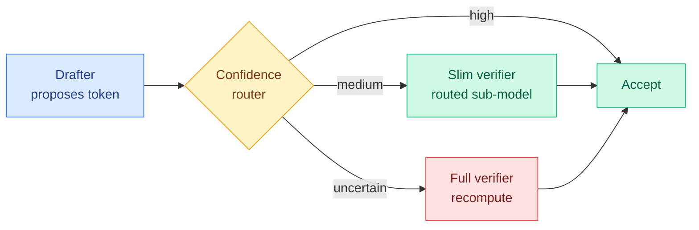
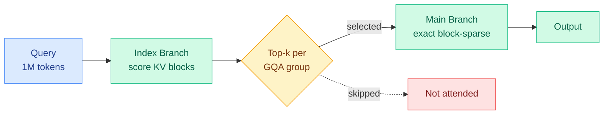
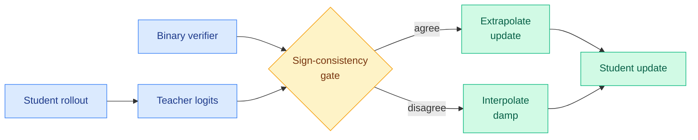
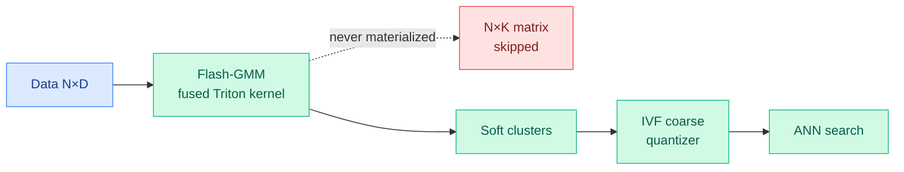
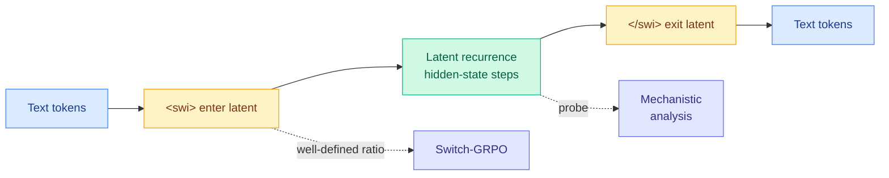
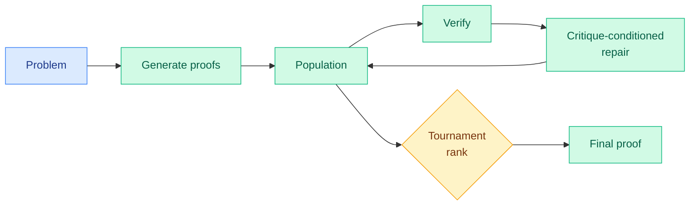

# cere-bro | 2026-06-12

> The day's sharpest lever is "spend the minimum compute that still preserves the answer," and it shows up three times: routing rejected tokens to a slim verifier, selecting only the attention blocks that matter, and gating a teacher signal by a verifier instead of trusting it whole.

---

## TL;DR

- **VIA-SD**: speculative decoding gets a third gear. Route rejected tokens to a slim verifier carved out of the big one, not a full recompute. 10-20% faster, no retraining.
- **MiniMax Sparse Attention**: the paper behind the M3 1M-context model. 28.4x less attention compute at 1M, 14.2x faster prefill on H800, on par with dense attention.
- **SG-OPD**: in on-policy distillation, use a correctness verifier to gate the teacher's signal, not replace it. +7.5 per-question on competition math.
- **Flash-GMM**: the FlashAttention trick applied to Gaussian mixtures. 20x faster, makes soft clustering a drop-in for k-means in vector search.
- **SWITCH**: two boundary tokens make hidden-state latent reasoning both RL-trainable and open to mechanistic probing.
- **MaxProof (MiniMax-M3)**: population search plus a trained verifier clears the human gold-medal bar, 35/42 on IMO 2025.
- **Price war goes public**: OpenAI weighs "drastic" cuts as an OpenAI-vs-Anthropic API token war brews, and Anthropic pulls Fable 5 off flat-rate plans June 23.

---

## Deep Dives

### VIA-SD: Verification via Intra-Model Routing for Speculative Decoding

> Most rejected draft tokens are not wrong enough to need the full model. VIA-SD adds a middle gear: a slim verifier carved out of the big verifier itself, no extra model and no retraining.

**Source:** HuggingFace
**Links:** [Paper](https://arxiv.org/abs/2606.12243) · [Wiki summary](../../ai-routing/2026-06-12-via-sd-intra-model-routing-speculative-decoding.md)

**What is it about?**
Speculative decoding speeds up a large language model by having a cheap "drafter" propose tokens that a big "verifier" model accepts or rejects in parallel, with no quality loss. VIA-SD makes that accept-or-reject decision three-way instead of two-way.

**What problem does it solve?**
Until now, a rejected token meant the full, expensive verifier had to recompute it. VIA-SD found that many rejected tokens are only mildly wrong and can be fixed by a model much smaller than the full verifier.

**What's the core novelty?**
The middle-tier "slim verifier" is not a separate trained model. It is carved out of the full verifier on the fly through intra-model routing, activating only a subset of the verifier's own computation. The tiering is grounded in a KL-divergence split of how much verification each token actually needs.

**Key takeaways**
- Rejection rates drop 0.10-0.22 across four tasks and several model families.
- 10-20% faster than strong speculative-decoding baselines, 2.5-3x over plain decoding.
- Drops into existing speculative-decoding frameworks with no training changes.

**Gaps in the study**
No results yet at 100B+ scale or on long-context, the regime where verifier calls dominate cost most. Whether the slim-verifier regeneration path is exactly lossless or an approximation needs the full paper.

**Industrial implication**
Inference servers gain a third gear between "trust the draft" and "pay full price." It is the same graded-cost idea Cursor's Auto-review (06-11) applies to agent actions, here applied to tokens. Expect vLLM and SGLang-class servers to try multi-tier verification soon if losslessness survives review.

→ [Full summary](../../ai-routing/2026-06-12-via-sd-intra-model-routing-speculative-decoding.md)

---

### MiniMax Sparse Attention (MSA)

> The cheap-frontier 1M-context model M3 we logged on 06-03 from a vendor blog now has its paper, and the audited numbers are slightly below the marketing: 28.4x less attention compute, but 14.2x faster prefill in real wall-clock, not 20x.

**Source:** HuggingFace
**Links:** [Paper](https://arxiv.org/abs/2606.13392) · [Kernel](https://github.com/MiniMax-AI/MSA) · [Wiki summary](../../inference-efficiency/2026-06-12-minimax-sparse-attention-msa.md)

**What is it about?**
Standard attention costs grow with the square of context length, so a 1M-token window is prohibitively expensive. MSA (a sparse attention built on Grouped Query Attention, the scheme where several query heads share one key-value head) makes each token attend to only a small selected set of key-value blocks.

**What problem does it solve?**
Agentic workflows, repo-scale code reasoning, and persistent memory all need very long context, but quadratic attention makes that untenable at deployment scale. MSA is deliberately streamlined to deploy efficiently across many GPUs rather than needing custom training.

**What's the core novelty?**
A lightweight Index Branch scores key-value blocks and picks a Top-k subset independently for each GQA group, so retrieval is query-adaptive but execution stays block-level and hardware-friendly. The kernel co-design uses an exp-free Top-k (no expensive exponentials in scoring) and a KV-outer layout to keep tensor cores busy.

**Key takeaways**
- 28.4x lower per-token attention compute at 1M context on a 109B model, quality on par with dense GQA.
- 14.2x prefill and 7.6x decode wall-clock speedup on H800 with the co-designed kernel.
- Kernel open-sourced; the production MiniMax-M3 model ships with it.

**Gaps in the study**
Quality is reported "on par with GQA," but per-task long-context retrieval and multi-hop accuracy at 1M (does the 28.4x hold needle-in-haystack, or just perplexity?) is the number to scrutinize. H800-specific kernel results; portability to Blackwell or consumer GPUs is asserted, not tabulated.

**Industrial implication**
This is the audited backbone of a model sold as near-Opus quality at a tenth of the price. It lands the same week OpenAI weighs drastic price cuts and Anthropic pulls Fable 5 off flat plans. Every order-of-magnitude attention saving at long context is a direct margin event in a price war.

→ [Full summary](../../inference-efficiency/2026-06-12-minimax-sparse-attention-msa.md)

---

### SG-OPD: Sign-Gated On-Policy Distillation

> On-policy distillation quietly assumes every teacher token is equally trustworthy. SG-OPD checks each token against a verifier and pushes harder where they agree, softer where they conflict.

**Source:** HuggingFace
**Links:** [Paper](https://arxiv.org/abs/2606.09304) · [Wiki summary](../../inference-efficiency/2026-06-12-sg-opd-sign-gated-on-policy-distillation.md)

**What is it about?**
On-policy distillation (OPD) trains a small student on its own outputs, with dense per-token coaching from a stronger teacher. SG-OPD adds a correctness verifier as a trust signal on top of the teacher.

**What problem does it solve?**
OPD relies on two things that often break: that student and teacher are aligned at the trajectory level, and that every teacher token is reliable. SG-OPD names both failures and routes around them.

**What's the core novelty?**
Two levers. "Phased teacher sampling" mixes verifier-endorsed teacher rollouts into the cold-start so the student is not learning from trajectories it could never produce. A "sign-consistency gate" extrapolates the update where the teacher's direction agrees with the verifier-correct direction and damps it where they disagree.

**Key takeaways**
- Beats standard OPD by +1.98 per-sample and +7.50 per-question on competition math.
- Two independent levers, each fixing one broken OPD assumption.
- The verifier is binary, so the trust signal is cheap wherever a verifier exists.

**Gaps in the study**
Only competition math is shown, the one domain with a clean binary verifier. No ablation separating phased sampling from the sign gate, so which lever does the work is unclear. No frontier-scale or held-out-domain numbers.

**Industrial implication**
Where a verifier is cheap (math, code, formal tasks), SG-OPD is a near-free upgrade to any OPD pipeline. For verifier-poor domains it changes nothing, reinforcing the growing divide between which capabilities are cheap to train and which are not.

→ [Full summary](../../inference-efficiency/2026-06-12-sg-opd-sign-gated-on-policy-distillation.md)

---

### Flash-GMM: a memory-efficient kernel for soft clustering

> The FlashAttention idea (never write the giant intermediate matrix to memory) applied to Gaussian mixtures gives a 20x speedup and makes soft clustering a drop-in replacement for k-means in vector search.

**Source:** HuggingFace
**Links:** [Paper](https://arxiv.org/abs/2606.10896) · [Wiki summary](../../inference-efficiency/2026-06-12-flash-gmm-memory-efficient-soft-clustering-kernel.md)

**What is it about?**
A Gaussian Mixture Model (GMM) is a soft-clustering method where each point gets a probability of belonging to each cluster, not a hard assignment. Flash-GMM computes it on GPU in a single fused pass.

**What problem does it solve?**
The standard algorithm needs a points-by-clusters "responsibility matrix" that blows past GPU memory at scale (80 GB for 10M points, 2048 clusters). Existing GPU implementations die around 10M points, so people default to k-means even when soft assignments would help.

**What's the core novelty?**
A FlashAttention-style fusion: tile and accumulate so the responsibility matrix is computed block by block and never stored in memory. The payoff is shown in approximate nearest-neighbor (ANN) search, where soft GMM memberships let border points belong to multiple clusters.

**Key takeaways**
- 20x faster than existing GPU GMM implementations, 100x larger datasets on one device.
- Becomes a drop-in replacement for k-means in the IVF coarse quantizer behind most vector databases.
- 1.7x fewer distance computations at fixed recall, or +2-12 recall@10 at matched cost.

**Gaps in the study**
The 20x and 100x are kernel-level; the end-to-end win in a real serving path is shown only through the ANN recall numbers. Triton-specific, with no CUDA hand-tuned baseline comparison.

**Industrial implication**
Vector databases and ANN libraries could adopt GMM coarse quantizers and lower RAG serving cost at fixed quality. The broader lesson: classic ML primitives get a second life once someone writes the fused kernel, a cheap and high-leverage research direction.

→ [Full summary](../../inference-efficiency/2026-06-12-flash-gmm-memory-efficient-soft-clustering-kernel.md)

---

### SWITCH: switchable latent reasoning

> Latent reasoning (thinking in hidden states instead of visible text) is hard to train with RL and impossible to interpret. SWITCH fixes both with one trick: a single pair of discrete boundary tokens.

**Source:** HuggingFace
**Links:** [Paper](https://arxiv.org/abs/2606.13106) · [Wiki summary](../../llms-foundation-models/2026-06-12-switch-switchable-latent-reasoning.md)

**What is it about?**
Instead of writing out reasoning as visible text, latent chain-of-thought does the reasoning inside continuous hidden states. SWITCH lets the model flip into and out of that latent mode with two special tokens.

**What problem does it solve?**
Prior hidden-state latent reasoning could not cleanly use on-policy reinforcement learning (no discrete decision point to define the policy ratio) and resisted interpretability (no anchor to probe). The boundary tokens create both.

**What's the core novelty?**
Because the entry token `<swi>` and exit token `</swi>` are ordinary discrete tokens, the GRPO policy ratio (the importance-weight RL needs) is well-defined at every step, so latent reasoning trains with standard RL machinery. The same anchors let researchers probe and causally intervene exactly at the latent block.

**Key takeaways**
- Consistently beats prior hidden-state latent-reasoning methods at similar scale.
- Causal analysis localizes the useful latent computation to a single hidden-state transition on entry.
- `<swi>` turns out to be a sharply localized learned switching policy, not a stylistic artifact.

**Gaps in the study**
Validated only at small scale, on math-style reasoning. The actual token and latency savings versus visible chain-of-thought are implied, not quantified.

**Industrial implication**
Latent reasoning has been stuck because it could not be trained at scale with RL or audited. SWITCH is a route past both blocks, and a rare case where an efficiency idea also delivers a clean interpretability result.

→ [Full summary](../../llms-foundation-models/2026-06-12-switch-switchable-latent-reasoning.md)

---

### MaxProof: population test-time scaling for math proof (MiniMax-M3)

> One model plays generator, verifier, refiner, and ranker at once, searches a population of proofs, and clears the human gold-medal bar on two olympiads.

**Source:** HuggingFace
**Links:** [Paper](https://arxiv.org/abs/2606.13473) · [Wiki summary](../../llms-foundation-models/2026-06-12-maxproof-minimax-m3-test-time-scaling.md)

**What is it about?**
MaxProof is the proof-solving system in the same MiniMax-M3 family as today's MSA paper. M3 is trained for three abilities (generate proofs, verify them, repair them given a critique) merged into one model, then at test time that model searches over many candidate proofs.

**What problem does it solve?**
Proofs have no cheap automatic checker the way arithmetic answers do, so the reward must come from a generative verifier, which brings noise, false positives, and reward hacking. MaxProof makes verification and repair first-class trained skills and spends test-time compute on a search the verifier can prune.

**What's the core novelty?**
One model in four roles, with a "defense-in-depth" generative verifier engineered for a low false-positive rate. The critique ability is localized error description (point to where the proof breaks), not a scalar score, which is what makes repair and tournament ranking work.

**Key takeaways**
- 35/42 on IMO 2025 and 36/42 on USAMO 2026, above the human gold-medal threshold on both.
- Generation, verification, and critique-repair trained, then merged into one shipped model.
- Test-time scaling is population-level: generate many, refine, rank by tournament.

**Gaps in the study**
Two small curated olympiad sets; generalization to broad or research-level proof corpora is unshown. Population search is compute-hungry and the test-time cost is unstated, so the accuracy-per-FLOP curve is unknown.

**Industrial implication**
The "low false-positive verifier plus population search" recipe is the engineering answer to reward hacking, and it pairs with MSA to mark a coordinated MiniMax open-weight push: an efficiency engine and a frontier-math capability the same day.

→ [Full summary](../../llms-foundation-models/2026-06-12-maxproof-minimax-m3-test-time-scaling.md)

---

### SusVibes: vibe-coded agent output passes the tests and ships the vulnerability

> Carnegie Mellon handed 200 real repository-level tasks to top coding agents. 61% passed the functional tests. Over 80% of those passing solutions were insecure.

**Source:** Twitter (@bayesiansapien repost of @HowToAI_), Carnegie Mellon
**Links:** [Repost](https://nitter.net/HowToAI_/status/2064952595056332808#m) · [Wiki summary](../../responsible-ai/2026-06-12-susvibes-vibe-coding-security-benchmark.md)

**What is it about?**
SusVibes is a benchmark of 200 real-world software-engineering tasks pulled from open-source projects, given to leading coding agents including SWE-Agent powered by Claude 4 Sonnet. It measures both whether the code works and whether it is secure.

**What problem does it solve?**
The "vibe coding" workflow accepts whatever passes the tests. SusVibes shows that signal is blind to security: functional correctness and security are nearly decoupled, and the strongest models are the ones most able to ship working-but-insecure code.

**What's the core novelty?**
It puts a number on a gap the field has only gestured at: 61% functional pass, but over 80% of passing solutions contain vulnerabilities. The headline coding-agent metric and the deployment-critical metric diverge by roughly 80 points.

**Key takeaways**
- 61% functional pass rate across 200 repository-level tasks.
- Over 80% of functionally-correct solutions are insecure.
- "Tests pass" is not a safety signal, and the agent's own judgment cannot be trusted as one.

**Gaps in the study**
Surfaced via a social repost; the exact threat model (which vulnerability classes, how detected) and whether weaker models are actually safer need the primary paper.

**Industrial implication**
This is the research-side case for Cursor's Auto-review (06-11): if an agent's "tests pass" verdict hides an 80% vulnerability rate, you need an external reviewer governing what it ships. Expect security-aware coding-agent benchmarks to gain weight against SWE-bench-style functional metrics.

→ [Full summary](../../responsible-ai/2026-06-12-susvibes-vibe-coding-security-benchmark.md)

---

## Industry Pulse

- **OpenAI weighs "drastic" price cuts** as an OpenAI-versus-Anthropic API token price war brews, with costs called "a huge issue" ([Marcus](https://garymarcus.substack.com/p/breaking-openai-is-pondering-drastic), [The Decoder](https://the-decoder.com)).
- **Anthropic pulls Fable 5 off flat-rate plans June 23**, moving it to usage credits until capacity allows, per Kilo Code ([@kilocode](https://nitter.net/kilocode/status/2065172254757892206#m)).
- **Jeff Bezos's Prometheus closes a $12B round** from JPMorgan, Goldman, BlackRock and Bezos himself, to build an "artificial general engineer" ([The Decoder](https://the-decoder.com), [@ns123abc](https://nitter.net/ns123abc/status/2065180793173930217#m)).
- **Cursor ships Auto-review as the default**, a classifier subagent that grades each agent action as allow, block, or ask, reported 97% accurate ([Cursor blog](https://cursor.com/blog/agent-autonomy-auto-review)).
- **Google's head of Android security resigns over the Pentagon AI deal**, writing "Google management has lost its moral compass" ([resignation note](https://mayrhofer.eu.org/post/leaving-google/)).
- **SemiAnalysis argues Intel should issue equity now**, a "reverse buyback" to raise ~$25B into strength for the Terafab and 14A ramp ([SemiAnalysis](https://newsletter.semianalysis.com/p/intel-should-raise-capital)).
- **Goodfire introduces predictive data debugging**, surfacing broken guardrails and hallucinations in DPO datasets before training ([@GoodfireAI](https://nitter.net/GoodfireAI/status/2065118189986717902#m)).
- **Visa wires agentic payments into ChatGPT**, letting an AI assistant spend on a user's behalf ([AI Weekly](https://aiweekly.co)).

---

## Global View

**Efficiency research is now arriving precisely on the schedule the price war demands, and today it arrived as an audited backbone.** MiniMax Sparse Attention is the paper for the M3 model the wiki logged on 06-03 as "near-Opus quality at a tenth of the price," and its measured 28.4x attention-compute cut at 1M context (with a more grounded 14.2x prefill in wall-clock) is the mechanism that makes that price point real. It lands the same week OpenAI is reportedly readying "drastic" cuts because cost "has become a huge issue" and Anthropic pulls its $50-per-million Fable 5 off flat plans. This is the continuation of the 06-11 thread that efficiency stopped being a feature and became the pricing war: when frontier capability commoditizes, every order-of-magnitude attention saving is a margin event, and MSA, VIA-SD (10-20% off inference via routed verification), and Flash-GMM (20x cheaper soft clustering for RAG indexes) are three levers shipped into that exact pressure on one day.

**A verifier is now the unit of trust in training, and the day's papers show all three ways to use it: as a gate, as a search pruner, and as the thing you regret not having.** SG-OPD slots a binary verifier *into* the dense distillation signal as a modulator (extrapolate where teacher and verifier agree, damp where they conflict), which is the on-policy-distillation answer to this week's Kurate-rated "LLMs Gaming Verifiers" warning that reward signals get hacked. MaxProof spends test-time compute on a population search that a low-false-positive generative verifier prunes, the same defense-in-depth instinct from the search side. SusVibes is the negative space: hand a coding agent no verifier beyond "tests pass" and 80% of its working code is insecure. Cursor's Auto-review, a 97%-accurate action classifier shipped as default the same week, is the industry buying exactly that lesson at the product layer, governing agent autonomy with an external reviewer rather than the agent's own judgment.

**"Routing" quietly generalized from picking a model to picking the minimum compute per step, inside one model.** VIA-SD routes each token to the cheapest verifier tier that still preserves the answer, and MSA routes each GQA group to only the key-value blocks it needs, both echoing the intra-model routing line the wiki has built through MISA (head-axis sparse-attention routing, 05-11), BEAM (binary expert activation, 05-16), and Chiaroscuro (spectral attention routing, 06-09). The pattern is now explicit: the highest-leverage routing decision is not "which model" but "how much of this model does this token deserve," and it is showing up on the verification side, the attention side, and the expert side at once. That is the same Scaling-the-Harness thesis (05-27, system scaling not model scaling is the next bottleneck) viewed from inside the forward pass.

---

## Looking Ahead

- **A mainstream inference server adds multi-tier (not binary) speculative-decoding verification within 90 days.** VIA-SD shows graded verification beats accept-or-recompute with no retraining. **Signal:** vLLM, SGLang, or TensorRT-LLM ships a speculative-decoding path with an intermediate slim-verifier tier, or an independent repro confirms the 10-20% gain holds on a 70B+ model.
- **MiniMax-M3 with MSA crosses a real long-context deployment threshold within 60 days, or its 1M-context quality gets contested.** The paper claims parity with dense GQA at 28.4x less compute. **Signal:** either >50 production deployments tracked on r/LocalLLaMA, or a published needle-in-haystack / multi-hop benchmark at 1M showing MSA degrades materially below dense attention.
- **SG-OPD-style verifier-gated distillation gets tried outside math-and-code within 90 days, and the verifier-poor wall holds.** **Signal:** a paper applies sign-consistency gating (or an equivalent verifier-as-modulator) to an open-ended domain and either reports it works with a learned soft verifier or concedes the gate is undefined without a clean correctness signal.
- **A security-aware coding-agent benchmark gains weight against functional SWE metrics within 60 days.** SusVibes plus SABER (06-06) make two-in-a-week saying functional pass hides insecurity. **Signal:** a major coding-agent release or leaderboard reports a security/vulnerability score alongside Pass@1, rather than functional pass alone.

**LLM-rated underrated from Kurate (top-rated, absent from today's HuggingFace top):** "How to Scale Mixture-of-Experts: From muP to the Maximally Scale-Stable Parameterization" (cs.LG #10, ai_rating 9.0, the recipe for setting MoE hyperparameters so behavior transfers across model scale) remains the standout, doubly relevant beside the ongoing MoE-router-quality thread. Also still underrated: "Pretraining Recurrent Networks without Recurrence" (cs.LG #16, Kumar & Isola, ai_rating 7.5, the RNN-speed-transformer-quality recipe) and "A Bitter Lesson for Data Filtering" (cs.LG #18, Mohri/Duchi/Hashimoto, ai_rating 7.5). **Signal:** a fully-open model ships on the non-recurrent recurrent-pretraining recipe by 2026-08. No HuggingFace-and-Kurate arxiv-ID overlap today: today's HF top is 2026-06 efficiency, RL, and safety work, while Kurate's weekly board runs weeks older and stays biomedical-heavy.

**Rising authors from Kurate:** this week's 59 threshold-crossers are dominated by the persistent biomedical and scientific-foundation-model clusters (Guy Lutsker et al. on clinical-physiology simulation, cs.AI #1; Andrew Zhang et al. on virtual-patient foundation models, cs.LG #1). None touches routing, KV cache, compression, or GPU, so none warrants a `connectors/twitter/config.json:ai_handles` add. All eight Reddit subs returned no posts past their filters in this 24h window.
</content>
