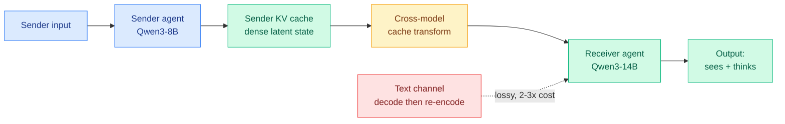
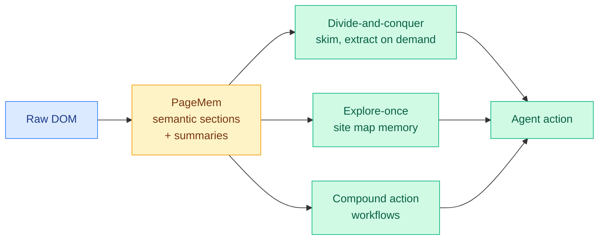
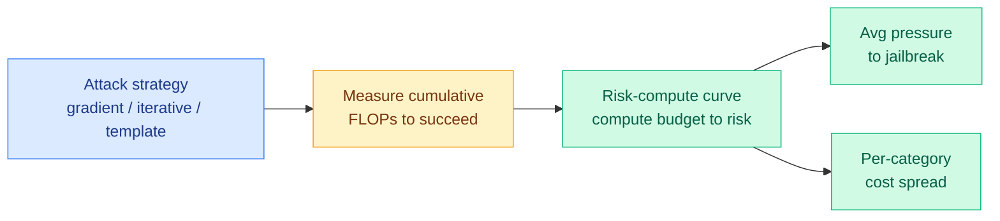
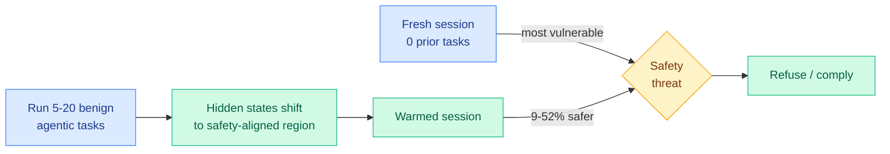
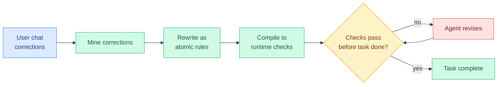

# cere-bro | 2026-06-13

> The US government just forced Anthropic to switch off its two best models overnight, and the day's research quietly hands you the frame to judge whether that was justified: robustness is a question of how cheaply a model can be jailbroken, not whether it can.

---

## TL;DR

- **US government suspends Fable 5 and Mythos 5**: an export-control directive bars all foreign nationals, forcing Anthropic to disable both models for every customer overnight. All other Claude models keep working.
- **Risk Under Pressure**: stop measuring jailbreak robustness at a fixed query budget. Measure it in FLOPs. The real question is how cheaply an attack succeeds, not whether it can.
- **See What I See**: let one agent read another agent's KV cache directly instead of talking in text. 2 to 3 times less compute, works across different-sized models.
- **WebChallenger**: a web agent built on cheap open models, no fine-tuning, nearly matches expensive frontier agents. The gap was architecture, not model size.
- **Cold-Start Safety Gap**: agents are most vulnerable to attack at the very start of a session. Run a few benign tasks first and they get 9 to 52% safer.
- **TRACE**: coding agents recall your corrections but still violate them. Compile each correction into a runtime check and out-of-distribution violations drop from 100% to 2%.
- **NVIDIA AgentPerf**: the first agentic-infrastructure benchmark lands, with Blackwell GB300 NVL72 running 20x more agents per megawatt than Hopper.

---

## Deep Dives

### See What I See, Know What I Think: Dense Latent Communication Across Heterogeneous Agents

> When two agents talk in text, the sender decodes its hidden state into words and the receiver re-encodes those words back into a hidden state. That round trip is lossy and expensive. This paper lets a different model read the sender's KV cache directly.

**Source:** HuggingFace
**Links:** [Paper](https://arxiv.org/abs/2606.13594) · [Wiki summary](../../inference-efficiency/2026-06-13-see-what-i-see-dense-latent-kv-communication.md)

**What is it about?**
Multi-agent systems usually coordinate through natural language. This work passes the KV cache (the per-token key and value vectors a transformer stores so it does not recompute attention over the prompt every step, effectively the model's working memory) directly from one agent to another, so the receiver inherits both what the sender saw and how it was reasoning, without ever turning the thought into words.

**What problem does it solve?**
Until now, KV-cache communication only worked between identical copies of one model, where the latent spaces already line up. The moment the two agents are different (a Qwen3-8B sender, a Qwen3-14B receiver, with different layer counts and head structures), the caches are misaligned and direct transfer fails. This paper makes heterogeneous transfer work.

**What's the core novelty?**
An information-structure analysis splits the problem in two. When the receiver also sees the input (context-aware), only a sparse reasoning signal needs to cross, so a light touch works. When the receiver sees nothing and must reconstruct everything from the cache (context-unaware), dense contextual preservation is required. The method trains one lightweight cross-model cache transformer in two phases: reconstruct, then generate. That dense alignment is what survives the context-unaware case where prior methods collapse.

**Key takeaways**
- Across all six directions of {Qwen3-4B, 8B, 14B} and six in-domain and out-of-domain benchmarks, it beats prior heterogeneous baselines.
- Matches or exceeds text communication in context-aware settings at roughly 2 to 3 times lower compute.
- Stays effective in context-unaware transfer, where prior heterogeneous methods fail outright.

**Gaps in the study**
Every experiment stays inside the Qwen3 family, same tokenizer and lineage, so true cross-architecture transfer (Qwen to Llama) is unproven. Savings are reported as multiples, with no absolute wall-clock or memory cost for the transform module, and no results on long multi-turn agent traces where text re-encoding cost actually dominates.

**Industrial implication**
Multi-agent serving stacks pay a hidden text tax on every hand-off. A 2 to 3 times compute cut on agent-to-agent communication is a direct margin lever, and it arrives in the same price-war week as MiniMax Sparse Attention (06-12, 28.4x less attention compute at 1M context). The KV cache is now three things at once: a memory to store, a thing to compress, and a wire between models.

→ [Full summary](../../inference-efficiency/2026-06-13-see-what-i-see-dense-latent-kv-communication.md)

---

### WebChallenger: A Reliable and Efficient Generalist Web Agent

> The best web agents lean on expensive proprietary reasoning models, which makes them too costly for the repetitive web work they would help most with. This paper argues the gap is architecture, not model size, and closes most of it with off-the-shelf open models and zero fine-tuning.

**Source:** HuggingFace
**Links:** [Paper](https://arxiv.org/abs/2606.10423) · [Code](https://github.com/jayoohwang1/webchallenger) · [Wiki summary](../../agentic-systems/2026-06-13-webchallenger-architecture-web-agent.md)

**What is it about?**
A generalist web-navigation agent. The core is PageMem, a structured page representation built deterministically from the DOM (the browser's underlying page structure) that exposes each page as a hierarchy of semantic sections, each with a short summary, instead of dumping the whole page into the context window.

**What problem does it solve?**
Leading web agents need proprietary reasoning models whose per-call cost is prohibitive for repetitive tasks. The authors argue the performance gap comes from agents failing to replicate three human habits: selective attention to relevant page regions, persistent memory of site structure, and procedural fluency with common interactions.

**What's the core novelty?**
Three mechanisms, all built over PageMem so they generalize across sites with no per-site code. A divide-and-conquer pipeline skims section summaries and extracts detail only where the task needs it. An explore-once system walks each site once to build a reusable map. Compound action workflows collapse common multi-step interactions into single actions.

**Key takeaways**
- 56.3% on WebArena, 48.7% on VisualWebArena, 51.0% on Online-Mind2Web, 70.9% on WorkArena.
- Uses open-weight models off the shelf, no fine-tuning, approaching frontier proprietary systems at a fraction of the cost.
- One shared substrate (PageMem) carries all three mechanisms, so it transfers across websites without adapters.

**Gaps in the study**
"Approaching" is not matching; the gap to the best proprietary agents on the hardest long-horizon tasks stays open. PageMem is DOM-derived, so canvas-heavy or obfuscated pages are a likely blind spot. Cost claims are relative, with no dollar-per-task table.

**Industrial implication**
This is the web-agent version of a recurring 2026 result: capability is bottlenecked by harness design, not model scale, the same lesson as the Scaling-the-Harness thesis (05-27, that system and environment design, not bigger models, is the next bottleneck). If a cheap open model plus good architecture can do repetitive web work, paying frontier rates for those tasks gets harder to justify, exactly the pressure the price war is built on.

→ [Full summary](../../agentic-systems/2026-06-13-webchallenger-architecture-web-agent.md)

---

### Risk Under Pressure: Compute-Aware Evaluation of Adversarial Robustness

> Jailbreak evaluations report attack success rate at a fixed query budget, which secretly treats a cheap template attack and an expensive gradient attack as equally costly. They differ by orders of magnitude. Measure robustness in FLOPs instead, and the real picture changes.

**Source:** HuggingFace
**Links:** [Paper](https://arxiv.org/abs/2606.11409) · [Wiki summary](../../responsible-ai/2026-06-13-risk-under-pressure-compute-aware-robustness.md)

**What is it about?**
A way to evaluate how robust a model is to jailbreaks that accounts for attacker effort. Instead of "what fraction of attacks succeed in N queries," it asks "how much compute must an attacker burn to succeed," measured in cumulative floating-point operations (FLOPs). The risk-compute curve maps a compute budget to attack risk.

**What problem does it solve?**
Attack-success-rate at a fixed budget can make a model look fragile or robust depending only on where you cap the query count. It hides whether a jailbreak is cheap or ruinously expensive, which is the thing that actually decides whether an attacker bothers.

**What's the core novelty?**
Reframing robustness as an economic quantity. Putting compute on the x-axis reveals which defenses genuinely raise the attacker's bill and which only looked good because the evaluation limited queries.

**Key takeaways**
- Across ten models, three families, four training stages, three attack types: alignment training helps non-monotonically.
- Scaling model size cuts gradient-attack effectiveness but barely touches cheap template attacks.
- Compute cost varies up to about 5x across harm categories within one model, and safety-aligned RL raises average cost while leaving some categories disproportionately cheap.

**Gaps in the study**
FLOPs is a proxy for effort, but a real attacker optimizes dollars and wall-clock, which depend on hardware and parallelism. The framework measures cost-to-succeed, not whether a model can be jailbroken at all. No frontier closed models in the panel.

**Industrial implication**
This is the exact lens the day's biggest story needs. When the US government suspended Fable 5 and Mythos over a demonstrated jailbreak, Anthropic's rebuttal was economic: the same capability "is widely available from other models" and the bypass was cheap and narrow. Risk-compute curves are the formal version of that argument, and they suggest export decisions should hinge on how cheaply a capability can be reached, not on a single demo that it can be.

→ [Full summary](../../responsible-ai/2026-06-13-risk-under-pressure-compute-aware-robustness.md)

---

### The Cold-Start Safety Gap in LLM Agents

> A tool-calling agent is not equally safe across a session. It is most vulnerable at the very start, before it has done any work, and gets substantially safer after a few ordinary tasks. The fix is to warm it up.

**Source:** HuggingFace
**Links:** [Paper](https://arxiv.org/abs/2606.07867) · [Code](https://github.com/Trustworthy-ML-Lab/Agent-Cold-Start-Safety-Gap) · [Wiki summary](../../responsible-ai/2026-06-13-cold-start-safety-gap-agents.md)

**What is it about?**
SODA (Safety Over Depth for Agents) is a new benchmark that controls exactly how many ordinary agentic tasks an agent finishes before it meets a safety threat, up to 20 preceding tasks. The authors run it across 7 models from 4 families.

**What problem does it solve?**
Safety evaluations usually test an agent cold, on the first message. This work shows that misses a real effect: the agent's vulnerability is highest precisely in that cold state and drops as it does benign work.

**What's the core novelty?**
Representation analysis shows the model's hidden states drift toward a "safety-aligned region" as benign tasks accumulate, and an ablation pins the cause on the regular tasks themselves, not the agent's own prior responses (those barely move safety but are needed to preserve later task quality).

**Key takeaways**
- Safety improves 9 to 52% going from 0 to 20 preceding benign tasks, across 7 models.
- Confirmed on external safety benchmarks (AgentHarm, Agent Safety Bench) and utility benchmarks (BFCL, API-Bank): warmup raises safety while preserving full capability.
- Practical recipe: run a few benign agentic tasks before any safety-critical exposure.

**Gaps in the study**
The drift is described but not causally explained, which leaves open whether an adversary could craft "anti-warmup" tasks that push representations the other way. Tested to 20 tasks only; behavior on very long sessions is unknown.

**Industrial implication**
If safety is depth-dependent, then a deployment that resets context for every request (common for stateless API serving) keeps every agent permanently in its most vulnerable cold state. The cheap mitigation is a benign warmup sequence, but the deeper worry is that representation-level safety is this manipulable at all, uncomfortable context on the day a government cited a jailbreak as grounds to pull two models.

→ [Full summary](../../responsible-ai/2026-06-13-cold-start-safety-gap-agents.md)

---

### TRACE: Compiling User Corrections into Runtime Enforcement for Coding Agents

> A coding agent remembers the correction you gave it last session and violates it anyway. The gap is not memory, it is compliance. TRACE compiles each correction into a check the agent must pass before it can finish.

**Source:** HuggingFace
**Links:** [Paper](https://arxiv.org/abs/2606.13174) · [Code](https://github.com/YujunZhou/TRACE_exp) · [Wiki summary](../../agentic-systems/2026-06-13-trace-compiling-user-corrections.md)

**What is it about?**
TRACE (Test-time Rule Acquisition and Compiled Enforcement) is a drop-in skill layer for coding-agent runtimes. It mines a user's own chat corrections, rewrites each as an atomic rule, and compiles those rules into runtime checks that gate task completion.

**What problem does it solve?**
A correction remembered in one session is often violated in the next. With Mem0 memory bolted on, 57.5% of applicable preference checks are still violated. The agent can access the preference and ignore it.

**What's the core novelty?**
Treating compliance as an enforcement problem, not a memory problem. Memory makes a preference retrievable; TRACE makes it a hard gate the agent cannot skip, because the rule is now an executable check rather than a recalled fact.

**Key takeaways**
- On ClawArena coding tasks, held-out preference violation drops from 100% to 37.6% in-distribution and from 100% to 2.0% out-of-distribution.
- On MemoryArena-derived tasks it cuts in-distribution violation from 100% to 60.5% while matching or beating the strongest memory baseline on task pass.
- The large out-of-distribution win suggests compiled checks generalize where recalled rules do not.

**Gaps in the study**
The weaker MemoryArena result (60.5% still violated) shows the method depends on whether a preference can be cleanly compiled; fuzzy preferences ("be more concise") resist it. Evaluated with simulated users, not long-term real use.

**Industrial implication**
This reframes the entire agent-memory line, which has mostly optimized recall (MemForest 05-26, MemTrain 06-04). The lesson "access is not compliance" lands the same week kilocode shipped REVIEWS.md (repo-specific review standards the agent must enforce) and on the heels of Cursor's Auto-review (06-11). The industry is converging on the same move TRACE formalizes: compile the user's standards into a gate the agent has to clear.

→ [Full summary](../../agentic-systems/2026-06-13-trace-compiling-user-corrections.md)

---

### ToolSense: Auditing Parametric Tool Knowledge in LLMs

> A popular trick lets an LLM "retrieve" the right tool from a huge catalog by generating a special token for it, and it scores well on the standard benchmark. ToolSense shows that score is inflated: under realistic, ambiguous queries it collapses below a plain embedding baseline.

**Source:** HuggingFace
**Links:** [Paper](https://arxiv.org/abs/2606.12451) · [Code](https://github.com/SAP/toolsense) · [Wiki summary](../../agentic-systems/2026-06-13-toolsense-parametric-tool-knowledge-audit.md)

**What is it about?**
When an agent must choose from tens of thousands of tools, parametric tool retrieval encodes each tool as a virtual token in the model's vocabulary and fine-tunes the LLM to retrieve by generating that token. ToolSense (from SAP) is an open framework that takes any tool catalog and auto-generates three diagnostic benchmarks to test whether the model actually understands its tools.

**What problem does it solve?**
The standard ToolBench numbers come from verbose, fully-specified queries plus constrained decoding that restricts outputs to valid token paths. Neither tests understanding. ToolSense generates realistic queries at three ambiguity tiers, plus multiple-choice and question-answer probes.

**What's the core novelty?**
It exposes a knowledge-retrieval dissociation: a model can retrieve a tool correctly while scoring near-random on factual probes about what that tool does. Retrieval skill and tool knowledge turn out to be decoupled.

**Key takeaways**
- On realistic ambiguous queries, several parametric configurations collapse 50 to 64 points versus fully-specified ToolBench, falling below the embedding-model baseline.
- Some models retrieve well yet answer factual tool-probes near randomly.
- Framework and diagnostic benchmarks are open-sourced.

**Gaps in the study**
Centered on ToolBench and parametric retrieval; whether embedding retrievers have their own hidden failures under the same ambiguity tiers is only partly probed. The query generators are themselves LLM-powered, inheriting their blind spots.

**Industrial implication**
For anyone building a tool-retrieval router, the warning is direct: a router that looks accurate on ToolBench may be guessing, and the gap only shows up on the underspecified queries real users send. It joins the measurement-crisis pattern the wiki keeps flagging, where a benchmark score does not predict deployment behavior (SusVibes 06-12, ToolMaze 06-08).

→ [Full summary](../../agentic-systems/2026-06-13-toolsense-parametric-tool-knowledge-audit.md)

---

## Industry Pulse

- **US government suspends Anthropic's Fable 5 and Mythos 5** via an export-control directive barring all foreign nationals, forcing Anthropic to disable both for every customer; all other Claude models keep working ([Anthropic](https://www.anthropic.com/news/fable-mythos-access), [Simon Willison](https://simonwillison.net/2026/Jun/13/us-government-directive-to-suspend-access/)).
- **Anthropic's defense**: the government cited a narrow jailbreak (asking the model to read a codebase and fix flaws); Anthropic says the same capability is "widely available from other models" including GPT-5.5 ([Anthropic](https://www.anthropic.com/news/fable-mythos-access)).
- **Backlash from builders**: Robert Scoble reported an entrepreneur whose app was mid-build when Fable was switched off, calling it a hit to "American national security" ([@Scobleizer](https://x.com/Scobleizer/status/2065609390070419506)).
- **Anthropic resets all rate limits**: 5-hour and weekly limits reset for every user amid the disruption ([@ClaudeDevs](https://x.com/ClaudeDevs/status/2065621176735646006)).
- **NVIDIA AgentPerf debuts**: the first agentic-AI infrastructure benchmark (from Artificial Analysis) shows Blackwell GB300 NVL72 running 20x more agents per megawatt than Hopper ([NVIDIA](https://nvda.ws/4fHQpvp)).
- **Google ships Gemini-SQL2**: text-to-SQL on Gemini 3.1 Pro hits state-of-the-art execution-verified accuracy on the BIRD benchmark ([@GoogleResearch](https://x.com/GoogleResearch/status/2065475343205740911)).
- **kilocode ships REVIEWS.md**: repo-specific review standards plus a memory mode that learns your standards from how you respond to PRs ([blog.kilo.ai](https://blog.kilo.ai/p/code-reviews-md)).
- **OpenAI acquires Ona** (formerly Gitpod) to push Codex toward long-running autonomous coding in secure cloud environments ([The Decoder](https://the-decoder.com/openai-buys-ona-to-push-codex-toward-long-running-autonomous-coding-tasks/)).
- **Mistral seeks 3 billion euros** at a ~20 billion euro valuation to fund its European AI push ([The Decoder](https://the-decoder.com/mistral-ai-seeks-3-billion-euros-to-fund-its-european-ai-push/)).

---

## Global View

**The day's research is the rulebook for the day's biggest news, and they disagree about what "dangerous" means.** The US government suspended Fable 5 and Mythos 5 on the strength of one demonstrated jailbreak, where the model read a codebase and identified flaws. Risk Under Pressure (today, arxiv 2606.11409, which reframes robustness as the FLOPs an attacker must burn rather than a fixed-budget success rate) says a single demo is the wrong unit: the policy-relevant question is how *cheaply* the capability can be reached, and it shows cheap template attacks survive model scaling that defeats expensive gradient attacks. Anthropic made exactly this economic argument in its rebuttal, that the same capability "is widely available from other models." This is the natural next beat of the N-days thread (06-09, Anthropic's Mythos turning security patches into working exploits in hours): the wiki has been tracking the collapse of attack *cost*, and a government has now treated attack *possibility* as sufficient grounds for export control, a gap between how researchers and regulators score the same risk.

**Efficiency research keeps arriving on the price war's schedule, and today it came as inter-agent plumbing.** See What I See (today) cuts agent-to-agent communication compute 2 to 3 times by passing KV caches between different models instead of text, and WebChallenger (today) nearly matches frontier web agents using cheap open models and no fine-tuning, locating the gap in architecture rather than model size. Both extend the thesis the wiki built through MiniMax Sparse Attention (06-12, 28.4x less attention compute at 1M context) and the Scaling-the-Harness argument (05-27, that system design is the next bottleneck, not bigger models). The industry signal underneath is NVIDIA's AgentPerf debut showing Blackwell delivering 20x more agents per megawatt than Hopper: when the hardware story is agents-per-watt and the research story is compute-per-hand-off, both sides are now optimizing the same denominator, the cost of running agents at scale, in the exact week OpenAI weighs drastic price cuts and Anthropic just lost its two flagship models.

**"Memory" was the wrong frame for agent reliability; enforcement is the right one.** TRACE (today) shows that with a memory system bolted on, coding agents still violate 57.5% of the user preferences they can recall, and fixes it by compiling corrections into runtime gates, dropping out-of-distribution violations to 2%. This reframes the wiki's whole agent-memory line (MemForest 05-26, MemTrain 06-04, InKH 06-07), which optimized recall on the assumption that recall drives behavior. The same move is shipping in product: kilocode's REVIEWS.md (today) compiles repo-specific review standards the agent must enforce, the direct descendant of Cursor's Auto-review (06-11, a classifier that grades each agent action allow/block/ask). Research and industry converged in one week on the same insight, that you govern an agent by compiling the standard into a check it must pass, not by trusting it to remember and comply.

---

## Looking Ahead

- **The Fable 5 / Mythos suspension gets reversed or formalized within 30 days, and the deciding argument is cost-based.** Anthropic says it is "a misunderstanding" and is working to restore access. **Signal:** if the directive is lifted, watch whether the resolution cites the "widely available from other models" economic argument (validating the Risk Under Pressure frame), or if it holds, whether a formal capability threshold is published. Either way, the precedent of export-controlling a commercial model by name is set.
- **A jailbreak benchmark reports results in compute/FLOPs rather than fixed-budget ASR within 90 days.** Risk Under Pressure makes the case that fixed-budget attack success rate is misleading. **Signal:** a major safety eval or red-team report publishes a risk-compute curve or a cost-to-jailbreak metric alongside or instead of plain ASR.
- **Heterogeneous KV-cache communication gets tested across model families within 60 days, and cross-family transfer is materially harder than within-family.** See What I See stays inside the Qwen3 family. **Signal:** a follow-up (or independent repro) reports Qwen-to-Llama or Llama-to-Mistral cache transfer; the prediction is the 2-3x efficiency win shrinks or the context-unaware regime degrades once tokenizers and lineages differ.
- **An agent-serving framework adds a "benign warmup" or persistent-safety-state option within 90 days.** The Cold-Start Safety Gap shows stateless per-request serving keeps agents in their most vulnerable state. **Signal:** vLLM, an agent runtime, or a major agent product documents a warmup or safety-state-priming step, or an independent repro confirms the 9-52% gap on a frontier model.

**LLM-rated underrated from Kurate (top-rated, absent from today's HuggingFace top):** "How to Scale Mixture-of-Experts: From muP to the Maximally Scale-Stable Parameterization" (cs.LG #10, ai_rating 9.0, the recipe for setting MoE hyperparameters so behavior transfers across model scale) stays the standout and is already tracked in the routing thread. Also still underrated and worth a follow-up: "Pretraining Recurrent Networks without Recurrence" (cs.LG #16, Kumar & Isola, ai_rating 7.5, the RNN-speed-transformer-quality recipe) and "A Bitter Lesson for Data Filtering" (cs.LG #18, Mohri/Duchi/Hashimoto, ai_rating 7.5, arguing learned data filters lose to scale). New this week: "The Impossibility of Eliciting Latent Knowledge" (cs.AI #20, arxiv 2606.12268, Friedl et al., published 06-10, a formal result that you cannot in general extract what a model knows from its outputs), a direct interpretability-limit claim worth a read. **Signal:** a fully-open model ships on the non-recurrent recurrent-pretraining recipe by 2026-08. No HuggingFace-and-Kurate arxiv-ID overlap today: today's HF top is 2026-06 agent, safety, and efficiency work, while Kurate's weekly board runs weeks older and stays biomedical-heavy.

**Rising authors from Kurate:** this week's threshold-crossers remain dominated by the biomedical and scientific-foundation-model clusters (Guy Lutsker et al. on clinical-physiology simulation, cs.AI #1; Andrew Zhang et al. on virtual-patient foundation models, cs.LG #1). None touches routing, KV cache, compression, or GPU, so none warrants a `connectors/twitter/config.json:ai_handles` add. All eight Reddit subs returned no posts past their filters in this 24h window.
