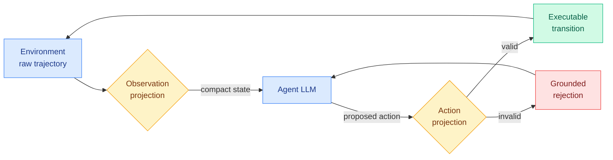
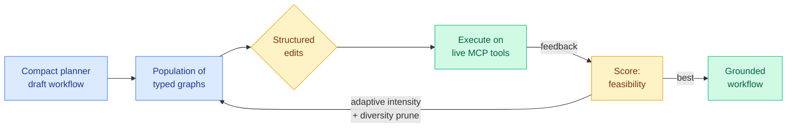
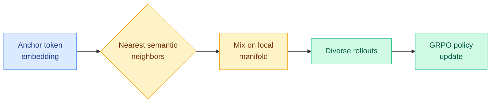
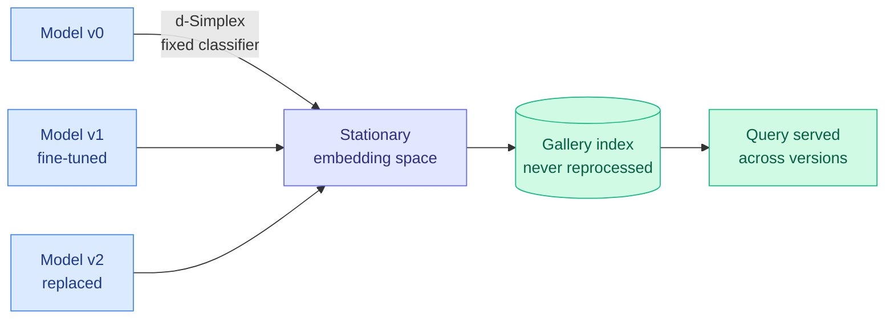
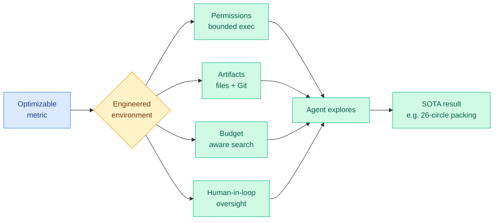
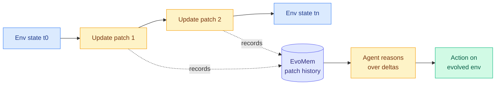

# cere-bro | 2026-06-14

> Industry spent the week learning that tokens are a cost to be governed, not a score to be maxed; the day's research quietly hands you four different ways to do the same agent task with fewer of them.

---

## TL;DR

- **HarnessBridge**: stop hand-writing the glue between an agent and its tools. Learn it. Matches specialized harnesses on SWE-bench with fewer tokens.
- **Evoflux**: make small tool agents reliable by evolving their workflow at inference time, not fine-tuning. Feasibility jumps from 3% to 17-24%.
- **N-GRPO**: get diverse RL rollouts by mixing a token's embedding with its nearest semantic neighbors, instead of adding random noise that breaks meaning.
- **EvoArena + EvoMem**: agents collapse to 39.6% when the environment changes under them. Storing memory as patch histories of those changes helps.
- **Compatible representations**: a fixed-classifier trick lets you swap an embedding model without re-indexing your whole gallery. Proven, not just empirical.
- **Anthropic saga deepens**: the US gave Anthropic 90 minutes to kill Fable and Mythos, the trigger was a rival's jailbreak demo, and no investor has publicly backed Dario.
- **Meta and Nadella turn on "tokenmaxxing"**: Meta will ration internal AI tokens via a central dashboard from 2027; Nadella warns against wasting frontier models on everyday tasks.

---

## Deep Dives

### HarnessBridge: the agent-environment interface as a learnable module

> The harness, the glue code that decides what slice of a tool's output the model sees and how its reply becomes an executable command, has been hand-written all along. This trains it instead, and the trained version uses fewer tokens than the hand-built one.

**Source:** HuggingFace
**Links:** [Paper](https://arxiv.org/abs/2606.12882) · [Wiki summary](../../agentic-systems/2026-06-14-harnessbridge-learnable-harness-controller.md)

**What is it about?**
A long-horizon agent talks to its environment through a harness: the layer that compresses raw tool output into something the model can read, and converts the model's proposed action into something the environment can run. HarnessBridge replaces the usual hand-written harness with a small learnable controller. It learns two projections, one for observations (raw trajectory to compact decision-relevant state) and one for actions (proposal to executable transition, or a grounded rejection when the action is malformed).

**What problem does it solve?**
Until now harnesses were manually engineered, so they stopped scaling as trajectories grew longer and interactions more complex. Every new environment meant more bespoke glue. This makes the glue a trained module that scales with data instead of engineer hours.

**What's the core novelty?**
Framing the agent-environment interface as a bidirectional projection trained end-to-end with one instruction-tuning objective, rather than as a pile of parsing heuristics. The action side can refuse: it returns a trajectory-grounded rejection instead of forcing a bad action through.

**Key takeaways**
- Matches or beats specialized hand-built harnesses on Terminal-Bench 2.0 and SWE-bench Verified.
- Substantially reduces token usage and trajectory length at equal or better task success.
- Trained on a small generator model, it transfers to larger commercial models.

**Gaps in the study**
The harness-supervision dataset is the hidden dependency: how it was built and whether the controller generalizes to environments unlike the training set is the open question. No cost accounting for the controller's own forward passes.

**Industrial implication**
If a learned harness that cuts tokens transfers across the model it wraps, it is a near-drop-in cost reduction for any agent product. This is the agentic mirror of inference-efficiency work: remove the tokens that carry no decision signal.

→ [Full summary](../../agentic-systems/2026-06-14-harnessbridge-learnable-harness-controller.md)

---

### Evoflux: make compact tool agents reliable by evolving the plan, not fine-tuning it

> Small models write tool-use plans that look right and fail on contact with a live tool catalog. Evoflux treats the plan as something to repair by evolutionary search at inference time, and the standard fix, fine-tuning on mined traces, can make things worse than zero-shot.

**Source:** HuggingFace
**Links:** [Paper](https://arxiv.org/abs/2606.12674) · [Wiki summary](../../agentic-systems/2026-06-14-evoflux-inference-time-tool-workflow-evolution.md)

**What is it about?**
Compact language models are attractive tool agents because they are cheap, but MCP-style tool use (the Model Context Protocol, where an agent discovers tools from a live catalog and calls them) needs more than isolated function calls. The agent must satisfy schemas, preserve dependencies across intermediate outputs, and ground its final answer in executed evidence. Evoflux runs an evolutionary search over typed workflow graphs at inference time, mutating them with structured edits and scoring each by whether it actually executes.

**What problem does it solve?**
Small planners produce plausible workflow graphs that break at tool resolution, parameter validation, dependency tracking, or execution. A few hundred teacher traces teach the format but not the recovery behavior needed when a plan fails over a changing tool catalog.

**What's the core novelty?**
Casting compact tool use as the repair of executable workflows, with execution feedback as the fitness signal, adaptive mutation intensity, meta-guided redesign, and diversity pruning. Execution-grounded search instead of trace distillation.

**Key takeaways**
- On held-out MCP-Bench tasks (live servers, 250 tools), execution feasibility rises from roughly 3% to 17-24% across small planners.
- SFT and SFT+DPO on the same search-mined data match, underperform, or collapse below zero-shot.
- ReAct reaches higher peaks but with higher variance and token cost.

**Gaps in the study**
Feasibility at 17-24% is still mostly-failing in absolute terms, and the inference-time search adds latency the paper does not fully price against ReAct.

**Industrial implication**
For teams deploying small tool agents, this says spend your budget on execution-grounded search, not on the mine-traces-then-SFT pipeline that everyone reaches for first. The negative DPO result is the more valuable warning.

→ [Full summary](../../agentic-systems/2026-06-14-evoflux-inference-time-tool-workflow-evolution.md)

---

### N-GRPO: diverse RL rollouts that stay on the semantic manifold

> RL training needs the model to try genuinely different solutions, not the same answer reworded. Adding random noise to embeddings gives variety but breaks meaning. N-GRPO mixes a token with its nearest neighbors instead, so the variety stays sensible.

**Source:** HuggingFace
**Links:** [Paper](https://arxiv.org/abs/2606.10768) · [Wiki summary](../../llms-foundation-models/2026-06-14-n-grpo-neighbor-mixing-grpo.md)

**What is it about?**
N-GRPO is an exploration strategy for GRPO (Group Relative Policy Optimization, the rollout-and-compare RL scheme behind DeepSeek-R1-style training). It builds each input representation by mixing an anchor token's embedding with its nearest semantic neighbors, injecting diversity into rollouts while staying inside the region of embedding space the model treats as meaningful.

**What problem does it solve?**
Token-level sampling yields trajectories that differ only in rephrasing, so the rollout group carries little new signal. Random embedding noise gives diversity but knocks the input off the semantic manifold and produces incoherent reasoning. Neither resolves the diversity-versus-validity trade-off.

**What's the core novelty?**
Semantic Neighbor Mixing: perturb in a semantically safe place (toward real neighbors) rather than in a random direction. The diversity it adds is exploration, not noise.

**Key takeaways**
- Consistent gains over strong baselines on math reasoning with DeepSeek-R1-Distill-Qwen across sizes.
- Reports robust out-of-distribution generalization.

**Gaps in the study**
Tested mostly on math and a single distilled family; open-ended reasoning and larger base models are untested, and the nearest-neighbor lookup cost during rollout is not characterized.

**Industrial implication**
A cheap, framework-compatible knob for anyone running GRPO who finds their rollouts collapsing into near-duplicates. If the OOD claim holds, it is close to free.

→ [Full summary](../../llms-foundation-models/2026-06-14-n-grpo-neighbor-mixing-grpo.md)

---

### A Stationary (and Therefore Compatible) Representation is All You Need

> Upgrade an embedding model and you usually have to re-embed your entire index, because the new model's geometry differs from the old one's. This proves a fixed-classifier trick makes old and new embeddings interchangeable, so you can swap models with no backfill.

**Source:** HuggingFace
**Links:** [Paper](https://arxiv.org/abs/2606.12488) · [Wiki summary](../../llms-foundation-models/2026-06-14-stationary-compatible-representations.md)

**What is it about?**
Compatible representation learning aims to produce embeddings that stay interchangeable across model updates. This paper shows that stationary representations learned with a d-Simplex fixed classifier (class prototypes pinned to fixed, maximally separated positions) provably satisfy compatibility, and that adding a contrastive loss to cross-entropy captures the higher-order structure cross-entropy alone misses.

**What problem does it solve?**
When you fine-tune or replace an encoder, its feature space drifts, so you must reprocess the whole gallery index before old and new embeddings can be compared. That backfill is expensive and sometimes infeasible for live services.

**What's the core novelty?**
A proof, not just an empirical recipe: fixing the classifier to a d-Simplex aligns feature distributions at first-order statistics, and the cross-entropy-plus-contrastive combination is shown equivalent to cross-entropy under the compatibility constraint.

**Key takeaways**
- Enables uninterrupted retrieval through sequential fine-tuning and full model replacement, at state-of-the-art quality.
- No gallery reprocessing required when the encoder changes.

**Gaps in the study**
Demonstrated on retrieval and image-gallery settings; whether the guarantee transfers to large text-embedding models used in RAG stacks is the obvious next test.

**Industrial implication**
This is the embedding-space analogue of a backward-compatible API, and it touches model versioning directly. Any stack that routes between or hot-swaps encoder versions pays the re-embedding tax this removes.

→ [Full summary](../../llms-foundation-models/2026-06-14-stationary-compatible-representations.md)

---

### EurekAgent: stop engineering the agent, engineer its environment

> As base models get stronger, the bottleneck for an autonomous research agent is no longer the prompt or workflow you write for it. It is the world you put it in. EurekAgent backs this by discovering a new best circle-packing result for under $11 in API cost.

**Source:** HuggingFace
**Links:** [Paper](https://arxiv.org/abs/2606.13662) · [Wiki summary](../../agentic-systems/2026-06-14-eurekagent-environment-engineering.md)

**What is it about?**
An agent system for metric-driven scientific discovery, where you give the agent a number to optimize and a place to run code. The twist is where the engineering effort goes: instead of prescribing the agent's reasoning steps, the authors engineer four properties of its environment. Permissions (sandboxed execution and isolated evaluation), artifacts (a filesystem and Git so agents collaborate and leave a trail), budget (the agent is told what compute and money it may spend), and human-in-the-loop hooks (cheap supervision and intervention).

**What problem does it solve?**
As models get stronger, the limit stops being "does the agent know what to do" and becomes "does its world let it do the right thing without going off the rails." Hand-written workflows over-constrain a capable model; unconstrained agents reward-hack and burn budget. Environment engineering is the proposed middle path: shape behavior through the resources and constraints you expose, not through a fixed script.

**What's the core novelty?**
Naming and operationalizing "environment engineering" as a design discipline with four concrete axes, and showing it produces real discoveries. The headline is a new state-of-the-art 26-circle packing found for less than $11 total, plus new bests on math, kernel engineering, and ML tasks. The claim is not a better agent loop; it is that the same agent in a better-engineered world is materially more capable.

**Key takeaways**
- Four engineering axes: permissions, artifacts (Git-based collaboration), budget-awareness, human oversight.
- New state-of-the-art on a 26-circle packing problem at under $11 in API cost.
- Budget engineering directly suppresses reward hacking and runaway spend, the failure mode unconstrained research agents hit.
- Code and results open-sourced, with an explicit call to treat environment design as a core research direction.

**Gaps in the study**
"State-of-the-art" here is on optimization-style tasks (packing, kernels) where success is cheap to verify with a metric. Open-ended discovery without a clean optimizable number is exactly where environment engineering is hardest, and the paper does not show it there. The four axes are also not ablated, so which one carries the gains is unknown.

**Industrial implication**
This is the thesis statement for the day's whole "Evo" cluster. If capability is bottlenecked by harness and environment rather than model scale, then the moat for an agent product is its sandbox, its budget governor, and its artifact store, not its base model. Good news for anyone building on cheap open models; bad news for the assumption that you must own a frontier model to ship a capable research agent.

→ [Full summary](../../agentic-systems/2026-06-14-eurekagent-environment-engineering.md)

---

### EvoArena + EvoMem: when the environment changes under the agent

> Almost every agent benchmark assumes a frozen world. Make the world change in steps and current agents drop to 39.6%. The fix is a memory that stores the changes themselves, not just the latest state.

**Source:** HuggingFace
**Links:** [Paper](https://arxiv.org/abs/2606.13681) · [Wiki summary](../../agentic-systems/2026-06-14-evoarena-evomem-memory-evolution.md)

**What is it about?**
EvoArena is a benchmark that models environment change as sequences of progressive updates across terminal, software, and social domains. EvoMem is a patch-based memory that records those changes as structured update histories, so the agent can reason about a state as the previous state plus deltas.

**What problem does it solve?**
Static benchmarks miss the central fact of real deployment: tools, software, and preferences keep changing. Agents that recall facts well still fail to track how the world moved, and naive append-only memory degrades over a chain of changes.

**What's the core novelty?**
Making environment evolution the unit of both evaluation and memory. Storing deltas rather than snapshots lets the agent answer "what changed" instead of only "what is."

**Key takeaways**
- Current agents average 39.6% on evolving tasks.
- EvoMem adds +1.5% on EvoArena, +6.1% on GAIA, +4.8% on LoCoMo.
- Chain-level accuracy (consecutive evolving subtasks) improves +3.7%, the hardest setting.

**Gaps in the study**
The +1.5% EvoArena gain is modest against a 39.6% floor; this surfaces the problem more than it solves it.

**Industrial implication**
Any agent running against a live, versioned toolset is in EvoArena's regime. Patch-history memory is a concrete pattern to try where append-only logs are silently rotting.

→ [Full summary](../../agentic-systems/2026-06-14-evoarena-evomem-memory-evolution.md)

---

### EvoBrowseComp: a search benchmark that regenerates itself to stay honest

> A search-agent benchmark made of static facts secretly rewards memorization over browsing, and rots the moment its questions leak into training data. This one synthesizes fresh, contamination-free questions from the live web and filters out anything popular enough to already be memorized.

**Source:** HuggingFace
**Links:** [Paper](https://arxiv.org/abs/2606.13120) · [Wiki summary](../../agentic-systems/2026-06-14-evobrowsecomp-evolving-search-benchmark.md)

**What is it about?**
EvoBrowseComp builds 400 English and 400 Chinese contamination-free questions by traversing the live web, using a three-agent pipeline: a QA synthesis agent that pulls fresh knowledge, an information-filtering agent that screens out popular or low-credibility facts, and a guidance agent that formalizes each question into a reasoning graph.

**What problem does it solve?**
Static benchmarks like BrowseComp let a model answer from parametric memory rather than genuine retrieval, so the score conflates recall with browsing competence and decays as questions enter training sets.

**What's the core novelty?**
Using *popularity* as the contamination proxy: if a fact is popular enough to be memorized, it cannot test browsing, so it is filtered out. Fully automated synthesis means the benchmark can be regenerated on a schedule.

**Key takeaways**
- 400 EN + 400 ZH contamination-free questions, regenerable to stay fresh.
- Confirmed difficult, requiring broad horizontal search rather than single-hop recall.

**Gaps in the study**
Live-web synthesis inherits whatever bias the filtering agent's credibility and popularity heuristics carry; the benchmark is only as clean as those filters.

**Industrial implication**
Auto-regenerating evaluation is the structural answer to test-set leakage. Expect the template to spread to other agent domains where contamination quietly inflates scores.

→ [Full summary](../../agentic-systems/2026-06-14-evobrowsecomp-evolving-search-benchmark.md)

---

## Industry Pulse

- **US gave Anthropic 90 minutes to kill Fable 5 and Mythos 5** — a Commerce export-control letter forced a global shutdown for all customers, citing a national-security threat with no details provided ([Politico](https://www.politico.com/news/2026/06/13/inside-the-whirlwind-24-hours-that-led-the-white-house-to-slap-export-controls-on-anthropic-00961519)).
- **The trigger was a rival's jailbreak demo, not China** — Amazon CEO Andy Jassy raised Fable jailbreak concerns to the Trump administration, setting off the 24-hour scramble ([Politico](https://www.politico.com/news/2026/06/13/inside-the-whirlwind-24-hours-that-led-the-white-house-to-slap-export-controls-on-anthropic-00961519)).
- **Anthropic disputes the White House timeline** — it says it responded within 75 minutes and was given no threat details, contradicting the "wellness retreat" account ([Axios](https://www.axios.com/2026/06/13/anthropic-fable-takedown)).
- **Anthropic pushes back on the substance** — it calls the vulnerabilities minor and present in rivals like GPT-5.5, after months of hyping Mythos cyber-risk itself ([The Decoder](https://the-decoder.com/us-government-forces-anthropic-to-disable-claude-fable-5-and-mythos-5-for-all-customers-worldwide/)).
- **OpenAI under criminal investigation while filing for IPO** — Florida opened a probe and a multi-state AG coalition subpoenaed OpenAI over sycophancy, minors, and health data ([WSJ](https://www.wsj.com/tech/openai-investigated-by-coalition-of-state-attorneys-general-088a3928)).
- **Meta shifts from "tokenmaxxing" to token managing** — an internal memo to 6,000 staff sets 2027 budgets and an "AI Gateway" dashboard to govern token spend running into billions ([The Decoder](https://the-decoder.com/meta-shifts-from-tokenmaxxing-to-token-managing-as-internal-ai-costs-reportedly-hit-billions/)).
- **Nadella admits he is a "token-maxer" too** — but warns frontier models should not be wasted on everyday tasks; marginal productivity must match token cost ([The Decoder](https://the-decoder.com/microsoft-ceo-satya-nadella-admits-hes-a-token-maxer-too-its-addictive/)).
- **Microsoft's SkillOpt boosts GPT-5.5 by ~23 points with a trained Markdown file** — and the same file transfers across Codex and Claude Code ([The Decoder](https://the-decoder.com/microsofts-skillopt-boosts-gpt-5-5-by-using-nothing-but-a-trained-markdown-file/)).
- **Moonshot's Kimi K2.7 Code undercuts GPT-5.5 and Claude by up to 12x per token** — an open-weights 1T-parameter coder that trails on quality but wins on runs-per-dollar ([The Decoder](https://the-decoder.com/moonshots-open-model-kimi-k2-7-code-undercuts-gpt-5-5-and-claude-by-up-to-12x-on-price-per-token/)).

---

## Global View

Industry just reframed tokens from a score to a cost, and the day's research is the supply side of that same shift. Meta is standing up an "AI Gateway" to ration internal token spend from 2027 and Nadella is publicly warning against throwing frontier models at everyday tasks, while four of today's papers attack the cost from the model side: HarnessBridge learns an agent interface that uses fewer tokens than the hand-built one, Evoflux makes a cheap small model reliable by evolving its plan instead of calling a frontier model, N-GRPO squeezes more learning signal out of each rollout, and Microsoft's own SkillOpt boosts a model 23 points with a trained Markdown file rather than more compute. The through-line is that the lever is moving from raw model capability to the scaffold around it. That is the same bet Anthropic's "When AI builds itself" essay (06-13) makes about its own engineering: the bottleneck migrates from typing to review, from capability to the harness, exactly where HarnessBridge and SkillOpt intervene.

A second thread: today's "Evo" cluster names a blind spot the whole agent-eval canon shares. EvoArena (agents drop to 39.6% when the environment updates in steps), Evoflux (plans must be repaired against changing tool catalogs), and EvoBrowseComp (benchmarks rot once their questions leak into training) all attack the static-world assumption, and they extend the measurement-crisis pattern the wiki has tracked since SusVibes (06-12, 80% of functionally-correct AI code was insecure) and ToolSense (06-13, parametric tool-retrieval scores inflated by easy queries). The industry mirror is sharp this week: the US shut down Fable over a jailbreak that Anthropic says is minor and shared with GPT-5.5, which is precisely a robustness-measurement dispute. Yesterday's Risk Under Pressure paper (06-13) argued robustness should be measured in FLOPs-to-jailbreak, not pass/fail at a fixed budget. The Fable shutdown is that abstract debate turned into a government action, decided without any agreed measurement at all.

---

## Looking Ahead

- **Token governance becomes a product category.** If a second frontier lab or hyperscaler ships a token-budget/governance layer like Meta's "AI Gateway" within 60 days, the "tokens are a cost to govern" frame is locked in, and learned-harness work like HarnessBridge moves from research to procurement criteria.
- **Learned harnesses get adopted or debunked.** If HarnessBridge-style learned controllers reproduce their token cuts on a public agent stack (Claude Code, Codex) within 90 days, expect harness-as-trained-module to become standard; if reproductions show the gains are dataset-specific, the hand-built harness survives.
- **The Fable precedent triggers a measurement standard.** If any frontier lab or NIST publishes a compute-normalized jailbreak-robustness metric (the Risk Under Pressure FLOPs-to-break idea) within 90 days, it will be a direct response to the Fable shutdown being decided with no agreed yardstick. Watch for it from Anthropic first, given the incentive.
- **LLM-rated underrated (Kurate, missing from HF today):** the cs.LG #10 paper *How to Scale Mixture-of-Experts: from muP to the Maximally Scale-Stable Parameterization* (ai_rating 9.0, score 1612) extends the MoE-µP scaling thread the wiki opened on 05-17. If a frontier open-weights MoE release cites maximal-scale-stable parameterization within 60 days, the muP-for-MoE recipe is becoming standard practice rather than theory.

---
