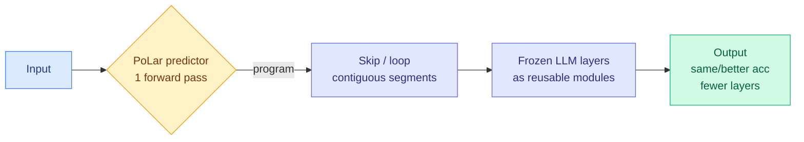
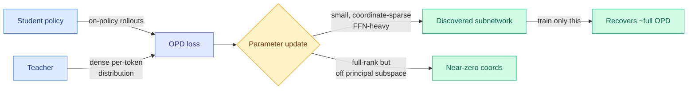
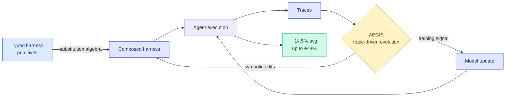
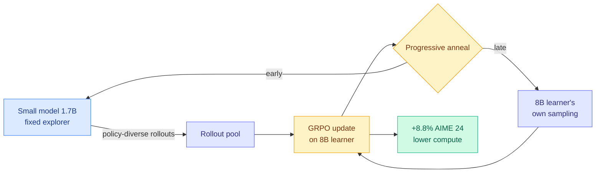
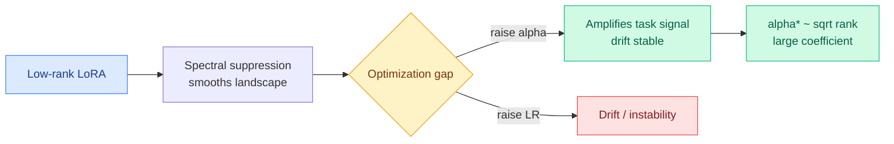
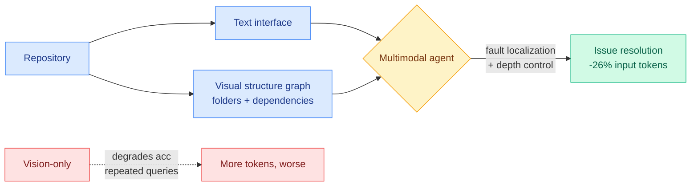
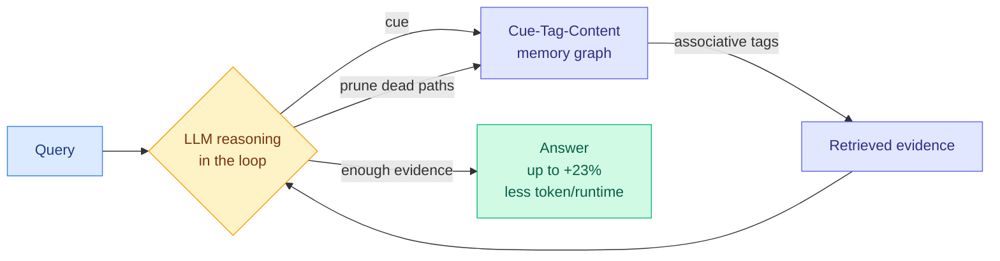

# cere-bro | 2026-06-15

> The day's research keeps finding the same lever from new angles: do the work with less. Fewer layers, fewer tokens, a sparser update, a cheaper explorer, a learned scaffold. Meanwhile the Anthropic-Fable shutdown hardens into a new era of release-gating governance.

---

## TL;DR

- **PoLar**: skip or loop a model's own layers per input. Shorter programs match or beat the full-depth forward pass on math, and fix some of its wrong answers.
- **Dense Supervision, Sparse Updates**: on-policy distillation writes a small, FFN-heavy subnetwork. Train just that subnetwork and you recover almost all of it.
- **HarnessX**: third paper in two days saying stop hand-writing the agent scaffold and learn it. +14.5% average across five agent benchmarks.
- **S2L-PO**: use a fixed small model as the rollout explorer for a bigger one. +8.8% on AIME 24 at lower compute.
- **LoRA-alpha**: the scaling factor alpha, not the learning rate, is LoRA's real knob. Optimal alpha follows a square-root law in the rank.
- **AGI-era governance**: the White House Fable shutdown is being read as the start of release-gating by executive vibe, pushing the rest of the world toward sovereign AI.

---

## Deep Dives

### PoLar: Skip a Layer or Loop It? Learning Program-of-Layers in LLMs

> A pretrained model runs every input through the same layers in the same order. PoLar shows that is just one of many valid computations the weights already support. For most inputs a shorter program, skip some layers, loop others, reaches the same or better accuracy, and many of the model's wrong answers become right under an alternative program.

**Source:** HuggingFace
**Links:** [Paper](https://arxiv.org/abs/2606.06574) · [Wiki summary](../../inference-efficiency/2026-06-15-polar-program-of-layers.md)

**What is it about?**
PoLar (Program-of-Layers) treats a frozen model's layers as reusable modules and learns a per-input "program" over them built from two operations on contiguous layer segments: skip (drop a segment) and loop (run a segment more than once). A tiny prediction network emits the program in a single forward pass; the base model's weights never change.

**What problem does it solve?**
Fixed-depth, fixed-order execution applies the same compute to every input regardless of difficulty, and it captures only a narrow slice of the model's latent reasoning capacity. Prior dynamic-depth work did skipping or looping but not both, often needed retraining, or made local layer-by-layer routing decisions with no global coordination.

**What's the core novelty?**
A single learned predictor that emits a globally coordinated program (skip plus loop over multi-layer segments) at once, rather than sequential per-layer routing or expensive test-time search. The conceptual claim is the striking part: the standard forward pass is one path through a space of valid latent computations the pretrained weights already contain.

**Key takeaways**
- For most inputs a substantially shorter program matches or beats full-depth accuracy.
- Some of the original model's wrong predictions are corrected by an alternative, shorter program.
- Beats standard inference and prior dynamic-depth methods on math benchmarks; gains persist out of distribution.
- Base LLM stays frozen; only the small predictor is trained.

**Gaps in the study**
Shown only on math reasoning. No wall-clock or kernel accounting, irregular skip/loop execution can defeat batching, so "fewer layers" may not mean "faster" in a real serving stack.

**Industrial implication**
If the depth-program generalizes and a kernel makes the irregular execution cheap, this is test-time depth scaling without longer chains of thought, a different efficiency lever than CoT length or KV-cache tricks, and composable with them.

→ [Full summary](../../inference-efficiency/2026-06-15-polar-program-of-layers.md)

---

### Dense Supervision, Sparse Updates: the weight-space anatomy of on-policy distillation

> On-policy distillation trains a model on its own outputs while supervising every token against a teacher. It has become a default post-training recipe, but nobody had measured what it does to the weights. The answer: small, coordinate-sparse, FFN-heavy updates, and training only that discovered subnetwork recovers nearly the whole effect.

**Source:** HuggingFace
**Links:** [Paper](https://arxiv.org/abs/2606.13657) · [Wiki summary](../../inference-efficiency/2026-06-15-dense-supervision-sparse-updates-opd-geometry.md)

**What is it about?**
On-policy distillation (OPD, where the student generates the trajectories and the teacher supplies dense token-level supervision) sits between supervised fine-tuning and RLVR (RL with verifiable rewards, where the reward is a single checkable outcome). This paper measures where in weight space OPD actually writes, across several language and vision-language model pairs.

**What problem does it solve?**
The field adopted OPD by results, not by understanding. Prior work knew dense SFT produces dense updates and sparse RLVR touches a small subnetwork, but OPD's hybrid nature (on-policy data, dense signal) left its mechanical signature unknown.

**What's the core novelty?**
Two measured findings. Sparsity: OPD updates are small and coordinate-sparse, FFN-heavy, spread across layers, and training only the discovered subnetwork recovers nearly full performance. Geometry: updates are full-rank but spectrally concentrated, lie off the source weights' principal directions, and land on coordinates where the source weight is near zero. Plus an optimizer twist: AdamW beats sparsity-inducing SGD for OPD, the reverse of sparse RLVR, because dense supervision preserves the coordinate-wise gradient heterogeneity AdamW exploits.

**Key takeaways**
- OPD updates are small, coordinate-sparse, FFN-heavy.
- Training only the discovered subnetwork recovers nearly full OPD.
- Updates sit off the principal subspace, on near-zero coordinates.
- Optimizer choice is now a diagnostic for reward density: sparse favors SGD, dense favors AdamW.

**Gaps in the study**
The subnetwork is discovered from a full OPD run, so the recovery is post-hoc. Whether you can predict it before training, which is what would make it a real compute saving, is not shown. No size-scaling study.

**Industrial implication**
This gives OPD the wiki's longest-running "the signal is sparse and locatable" property in parameter space, after tokens (TIP, 04-16, under 10% of distillation tokens carry signal) and time ([Temporal Scheduling](../../llms-foundation-models/2026-06-02-temporal-scheduling-rlvr.md), 06-02). If the subnetwork becomes predictable, OPD gets RLVR-like memory cost at dense-supervision sample efficiency.

→ [Full summary](../../inference-efficiency/2026-06-15-dense-supervision-sparse-updates-opd-geometry.md)

---

### HarnessX: learn the agent harness, don't hand-write it

> The harness, the prompts, tools, memory, and control flow around a model, has always been hand-built and frozen. HarnessX makes it a composable, automatically-evolved artifact. It is the third paper in two days landing the same claim, which is the point.

**Source:** HuggingFace
**Links:** [Paper](https://arxiv.org/abs/2606.14249) · [Wiki summary](../../agentic-systems/2026-06-15-harnessx-composable-agent-harness-foundry.md)

**What is it about?**
HarnessX is a foundry for agent harnesses. It assembles them from typed primitives via a substitution algebra (harnesses are composed, not written), evolves them with AEGIS (a trace-driven engine framed as an "operational mirror" between symbolic edits and reinforcement learning), and closes the loop by turning execution traces into both scaffold edits and model-training signal.

**What problem does it solve?**
Every new model or task needs bespoke scaffolding, and the rich signal in execution traces is normally thrown away. HarnessX makes agent progress come from the runtime interface, not only from scaling the base model.

**What's the core novelty?**
A typed compositional substrate (an algebra for harnesses, not a config file) combined with a trace-driven loop that unifies symbolic harness edits and model updates. The claim that a harness edit and a gradient step are two faces of one improvement process is the distinctive theoretical bet.

**Key takeaways**
- +14.5% average across five benchmarks (ALFWorld, GAIA, WebShop, tau³-Bench, SWE-bench Verified), up to +44%.
- Gains largest where baselines are weakest.
- Traces become both scaffold edits and training signal.
- Code to be open-sourced later (so the headline numbers are currently unreproduced).

**Gaps in the study**
No ablation isolating composition vs evolution vs the model-update loop. "Largest gains where baselines are lowest" can mean it mostly recovers easy points a weak baseline missed.

**Industrial implication**
This is the third harness-as-learnable-object paper in two days, after [HarnessBridge](../../agentic-systems/2026-06-14-harnessbridge-learnable-harness-controller.md) (06-14, trains the agent-environment interface to use fewer tokens than the hand-built one) and DAIR.AI's Self-Harness (an agent mines its own failures into harness edits, lifting MiniMax M2.5 from 40.5% to 61.9% on Terminal-Bench-2.0). When capability lives in the scaffold, the moat for an agent product is the harness, not the base model, good news for builders on cheap open weights.

→ [Full summary](../../agentic-systems/2026-06-15-harnessx-composable-agent-harness-foundry.md)

---

### S2L-PO: a small model is the cheapest explorer for a big one

> GRPO needs diverse rollouts, and the usual fix, crank the sampling temperature, gives incoherent trajectories. This paper finds the diversity for free: smaller models in the same family are naturally more varied at the policy level, so use one as the explorer.

**Source:** HuggingFace
**Links:** [Paper](https://arxiv.org/abs/2605.30789) · [Wiki summary](../../llms-foundation-models/2026-06-15-s2l-po-small-models-explorers-grpo.md)

**What is it about?**
GRPO (Group Relative Policy Optimization, the rollout-and-compare RL behind DeepSeek-R1-style training) learns from diverse rollouts. S2L-PO (Small-to-Large Policy Optimization) finds that smaller same-family models have higher policy-level diversity, shown by better pass@k as you draw more samples, and that this diversity is coherent rather than random noise. It uses a fixed small model as the explorer, then anneals back to the large learner's own sampling.

**What problem does it solve?**
Token-level diversity (temperature, noise) causes entropy explosion and incoherent reasoning chains. Off-policy reuse drifts; ensembles need multiple big models. A fixed small explorer gives structured diversity with none of these costs.

**What's the core novelty?**
Naming policy-level diversity (via pass@k scaling) as a distinct, more useful axis than token-level randomness, and the annealing schedule that stops the small model's capacity ceiling from capping the large learner.

**Key takeaways**
- Smaller same-family models show higher policy-level diversity.
- +8.8% on AIME 24 using a 1.7B explorer to guide an 8B learner.
- Lower rollout compute (small-model rollouts are cheaper).
- Annealing avoids the mid-training drop from the explorer's capacity limit.

**Gaps in the study**
Math-only, single model family. No analysis of when the explorer is diverse but wrong and injects bad gradients.

**Industrial implication**
This is the second paper in two days saying the fix for collapsed rollouts is better-distributed samples, not noisier ones, after [N-GRPO](../../llms-foundation-models/2026-06-14-n-grpo-neighbor-mixing-grpo.md) (06-14, mix a token's embedding with its nearest semantic neighbors). If "smaller equals more policy-diverse" is family-stable, you could pick an explorer by its pass@k curve instead of guessing.

→ [Full summary](../../llms-foundation-models/2026-06-15-s2l-po-small-models-explorers-grpo.md)

---

### LoRA-alpha: the scaling factor was the real knob all along

> In LoRA, everyone tunes the learning rate and treats the scaling factor alpha as a redundant stand-in. This paper shows alpha is the dominant driver, and the optimal value follows a square-root law in the rank that the standard heuristics get wrong.

**Source:** HuggingFace
**Links:** [Paper](https://arxiv.org/abs/2606.12883) · [Wiki summary](../../inference-efficiency/2026-06-15-lora-alpha-scaling-factor.md)

**What is it about?**
LoRA (Low-Rank Adaptation, freeze the base model and train two small low-rank matrices) has a scaling factor alpha that controls how strongly the low-rank update is injected. This paper, with a Signal-Drift framework, shows alpha and the learning rate do different things, and alpha is the one that matters.

**What problem does it solve?**
LoRA often needs unusually high learning rates, and practitioners tie alpha to rank with a linear heuristic then tune LR, leaving performance on the table. The paper explains why (LoRA spectrally suppresses the loss landscape, making default hyperparameters too conservative) and shows the fix is alpha, not LR.

**What's the core novelty?**
Three findings: low-rank form smooths the landscape and opens an optimization gap; alpha closes it by amplifying task signal without raising the drift ratio (a higher LR raises both); and the optimal alpha scales as the square root of the rank with a large coefficient, contradicting the linear rank-tied convention.

**Key takeaways**
- Alpha, not learning rate, is LoRA's dominant optimization knob.
- Optimal alpha follows a square-root-in-rank law.
- LoRA-alpha lets LoRA run with standard small learning rates and improves accuracy.
- Shrinks the hyperparameter search.

**Gaps in the study**
Whether the square-root coefficient is universal or model/dataset-dependent is untested, as is behavior at very high rank or under quantized QLoRA.

**Industrial implication**
This joins the parameterization-scaling cluster, [MoE μP](../../ai-routing/2026-05-17-moe-mup-maximally-scale-stable-parameterization.md) (05-17) and [Gated Delta Network μP](../../inference-efficiency/2026-06-04-gated-delta-network-mup-scaling.md) (06-04): each finds a hidden scaling rule a parameterization was wasting. For adapter-heavy stacks ([LatentSkill](../../agentic-systems/2026-06-09-latentskill-in-weight-skills.md) converts skills to LoRAs), a principled alpha-per-rank removes a whole tuning dimension.

→ [Full summary](../../inference-efficiency/2026-06-15-lora-alpha-scaling-factor.md)

---

### LLM Agents Can See Code Repositories

> Coding agents read a repo as flat text, even though humans navigate with visual structure. Replacing text with images fails. Adding a rendered structure graph alongside text cuts input tokens up to 26% with accuracy held or improved.

**Source:** HuggingFace
**Links:** [Paper](https://arxiv.org/abs/2606.14061) · [Wiki summary](../../agentic-systems/2026-06-15-llm-agents-can-see-code-repositories.md)

**What is it about?**
The first systematic study of giving multimodal coding agents a visual representation of a repository (folder tree plus dependency graph) on repository-level issue resolution, across four multimodal models in text-only, vision-only, and hybrid setups.

**What problem does it solve?**
Agents spend many tokens reconstructing repo structure (imports, where a symbol lives) that one diagram conveys at a glance. The question is whether a picture of the repo lets them navigate cheaper without losing the symbolic precision code work needs.

**What's the core novelty?**
A non-obvious result: vision as a replacement fails (more tokens, lower accuracy, agents re-query images), but vision as a supplement wins (up to 26% fewer input tokens at equal-or-better accuracy), and it localizes where, fault localization and autonomous-depth exploration, not editing.

**Key takeaways**
- Vision-only repo representation degrades accuracy and raises token cost.
- Text plus a visual structure graph cuts input tokens up to 26%, accuracy maintained or improved.
- Biggest benefit during fault localization and self-controlled exploration.
- Points to a hybrid text-and-vision interface.

**Gaps in the study**
"Up to 26%" is a ceiling, not an average. Untested on greenfield generation or large refactors with no fault to localize. The graph must be generated and rendered, a cost not charged against the savings.

**Industrial implication**
Another token-removal lever in the same supply-side story as 06-14: a rendered graph beats the same graph serialized as text, which hints that "render structured data as an image" could be a general token-saving trick beyond code (schemas, knowledge graphs).

→ [Full summary](../../agentic-systems/2026-06-15-llm-agents-can-see-code-repositories.md)

---

### MRAgent: memory is reconstructed, not retrieved

> Memory agents fetch top-k chunks once, then reason, so they cannot re-query on evidence found mid-reasoning. MRAgent folds reasoning into retrieval over an associative graph, beating strong baselines by up to 23% while spending fewer tokens.

**Source:** HuggingFace
**Links:** [Paper](https://arxiv.org/abs/2606.06036) · [Wiki summary](../../agentic-systems/2026-06-15-mragent-graph-memory-reconstruction.md)

**What is it about?**
A memory framework built on the premise that recall is reconstruction, not lookup. Memory is a Cue-Tag-Content associative graph (tags are semantic bridges from cues to contents), and an active-reconstruction loop lets the LLM's reasoning iteratively expand and prune retrieval paths as evidence accumulates.

**What problem does it solve?**
Static retrieve-then-reason decides what to fetch before reasoning, so it cannot adapt to mid-inference evidence, and naive graph expansion blows up combinatorially. MRAgent interleaves the two while controlling blow-up via evidence-based pruning.

**What's the core novelty?**
The Cue-Tag-Content graph plus active reconstruction, retrieval as a reasoning act rather than a database call, with pruning that keeps the iterative search tractable.

**Key takeaways**
- Up to +23% over strong baselines on LoCoMo and LongMemEval.
- Cuts token and runtime cost by pruning paths early.
- Tags enable associative recall, not just embedding similarity.
- Reasoning is inside the retrieval loop, so access adapts to evidence.

**Gaps in the study**
Graph construction and tag quality are the hidden dependency; the paper does not test against deliberately poisoned memory, so whether reconstruction resists confabulation or just reorganizes it is open.

**Industrial implication**
The complement to [EvoMem](../../agentic-systems/2026-06-14-evoarena-evomem-memory-evolution.md) (06-14, store memory as patch histories): EvoMem changes what is stored, MRAgent changes how it is read. If reasoning-driven retrieval reliably beats retrieve-then-reason at lower cost, it undercuts the static vector-store pipeline most agent products ship.

→ [Full summary](../../agentic-systems/2026-06-15-mragent-graph-memory-reconstruction.md)

---

## Industry Pulse

- **The AGI era of AI governance begins.** Nathan Lambert frames Friday's White House order forcing Anthropic to suspend Claude 5 Mythos/Fable for foreign nationals as the "starting gun" of release-gating governance, warning weight export bans will push the world to sovereign AI ([Interconnects](https://www.interconnects.ai/p/welcome-to-the-agi-era-of-ai-governance)).
- **Gary Marcus: Washington made a mess.** He calls the Fable shutdown arbitrary and possibly corruption-adjacent (it helped OpenAI backers), but says it killed zero-regulation absolutism and urges an independent AI agency ([Marcus on AI](https://garymarcus.substack.com/p/what-washington-must-do)).
- **SemiAnalysis launches a teardown lab (STEEL).** Its first public report finds SMIC's N+3 hits TSMC N6-class logic density via aggressive DUV multi-patterning, but trails badly on efficiency (Huawei's prime core draws 4.5W where Apple's low-power core does more at 1W) ([SemiAnalysis](https://newsletter.semianalysis.com/p/steel-smic-n3-teardown)).
- **MiniMax M3 coding plans go live in Kilo.** $20/month buys roughly 1.7 billion tokens of M3 with a 1M-context window, auto-configured against your existing balance ([Kilo](https://blog.kilo.ai/p/coding-plans-are-live-in-kilo)).
- **GitHub Copilot moved to usage-based token billing.** Two weeks in, $10/month now buys $10 of API-rate AI credits metered by the token, the flat unlimited ceiling is gone ([Kilo](https://blog.kilo.ai/p/coding-plans-are-live-in-kilo)).
- **Agents' Last Exam from Berkeley RDI.** A living benchmark of 1,000+ verifiable economically-valuable tasks; the hardest tier sits at 2.6% average full pass, with Codex plus GPT-5.5 under 10% there ([DAIR.AI](https://www.linkedin.com/pulse/top-ai-papers-week-dair-ai-kgfne)).
- **Perplexity's agent economics.** Production data shows its Computer agent does ~26 minutes of autonomous work per session vs 33 seconds for conversational Search, cutting matched-task time 87% and cost ~94% ([DAIR.AI](https://www.linkedin.com/pulse/top-ai-papers-week-dair-ai-kgfne)).
- **Data-center power is now the primary scaling constraint.** This week's Semiconductor Newsletter leads with power, plus AMD committing up to £2B and the UK launching a £1.1B+ AI hardware plan ([The Semiconductor Newsletter](https://thesemiconductornewsletter.substack.com/p/week-24-2026)).

---

## Global View

Industry kept reframing tokens from a score into a metered cost this week, and the day's research is the supply side of that same shift. GitHub Copilot has switched to usage-based per-token billing and MiniMax M3 sells coding by the billion-token plan, the consumer face of the cost discipline Meta's "AI Gateway" (06-14, ration internal token spend from 2027) and Nadella's "don't waste frontier models on everyday tasks" (06-14) set at the enterprise level. Against that, five of today's papers each remove compute from a unit of work: PoLar runs fewer layers per input, "LLM Agents Can See Code Repositories" cuts input tokens 26% by handing the agent a rendered structure graph instead of more file reads, Dense Supervision shows on-policy distillation only needs to train a small FFN-heavy subnetwork, S2L-PO generates RL rollouts with a cheap small explorer, and LoRA-alpha removes a whole hyperparameter-search dimension. Research is not chasing the cost cut after industry, it is supplying the mechanisms industry's new accounting will buy.

The harness is becoming both the research frontier and the product moat, which is exactly what makes the Fable shutdown matter. HarnessX is the third paper in two days, after HarnessBridge (06-14, a learned interface that uses fewer tokens than a hand-built one) and DAIR's Self-Harness (an agent that edits its own scaffold from its failures), to argue capability lives in the learnable harness, not only the base model, and kilocode shipped the product mirror this week (REVIEWS.md review-standard files, Agent Manager parallel worktrees, MiniMax coding plans). If capability migrates to a cheap-open-model-plus-learned-scaffold stack, then the White House forcing Anthropic to gate Claude 5 Fable's weights, which Lambert reads as the start of release-gating by executive vibe and a push toward sovereign AI, is fighting over the layer that matters least. The research bet (capability is in the harness, runnable on commodity weights) and the governance bet (control the frontier weights) are pointing in opposite directions, and the gap between them is where the next year of policy friction sits.

---

## Looking Ahead

- **Learn-the-harness becomes a product category.** If a coding tool ships trace-driven harness evolution (not just static AGENT.md/REVIEWS.md files) within 60 days, or HarnessX's open-source release gets meaningful adoption, the harness-as-trained-module thesis is locked in. Signal: a shipped "harness compiler" or a fourth independent learned-harness paper by 2026-08-15.
- **Explorer-selection-by-pass@k.** If S2L-PO's "smaller same-family model is more policy-diverse" replicates on code or tool-use (beyond math) within 90 days, expect GRPO trainers to add an explorer-model config chosen by pass@k curve. Signal: an open RL framework exposing an explorer-policy knob by 2026-09-15.
- **Dynamic depth needs a kernel to matter.** If program-of-layers (PoLar) shows a real wall-clock speedup, not just fewer layers, and generalizes past math within 90 days, dynamic-depth becomes a serving lever alongside KV-cache sparsity. Signal: an inference engine shipping per-input layer skip/loop by 2026-09-15; absent that, treat PoLar as an accuracy result, not an efficiency one.
- **A release-risk standard answers Fable.** Carryover from 06-14, still open: if a frontier lab or NIST publishes a compute-normalized model-release-risk metric within 90 days, it is a direct response to the Fable shutdown being decided with no agreed yardstick. Watch Anthropic first.
- **LLM-rated underrated (Kurate, missing from HF today):** cs.LG #16 *Pretraining Recurrent Networks without Recurrence* (Akarsh Kumar, Phillip Isola, [2606.06479](https://arxiv.org/abs/2606.06479), ai_rating 7.5, published 06-04) is recent, top-tier-authored, and adjacent to the wiki's linear-attention/recurrent-rule thread. If it shows a recurrent model trained as a non-recurrent network matching a Mamba/GDN-style baseline, track it; a follow-up or open weights within 60 days would make it a real architecture signal.
- **Rising authors (Kurate):** this week's threshold-crossers are all co-authors clustered on two medical foundation-model papers (clinical-physiology simulation, virtual-patient representations), not independent rising signal. No new Twitter handle additions warranted, the cluster is the same two papers persisting across four weeks.

---
