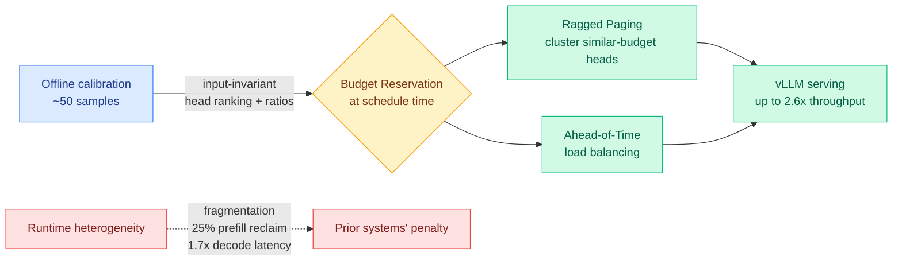
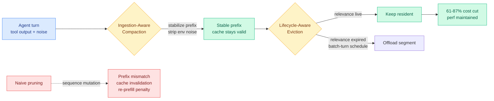
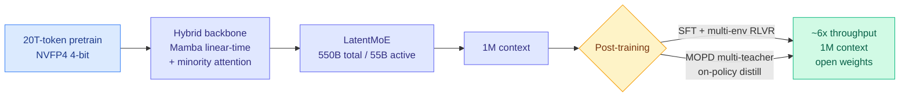
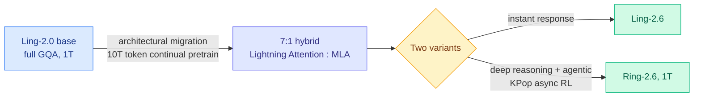
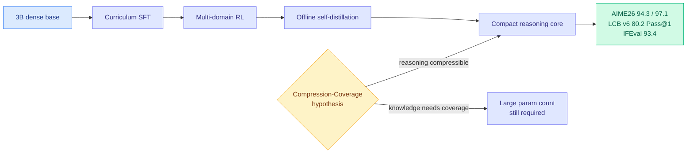
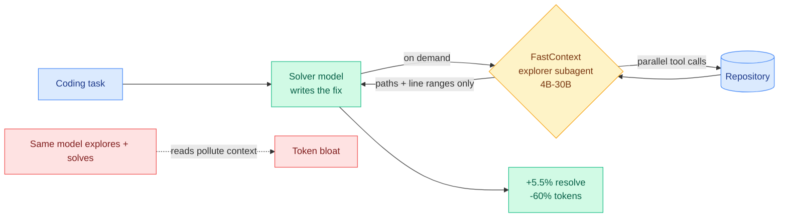
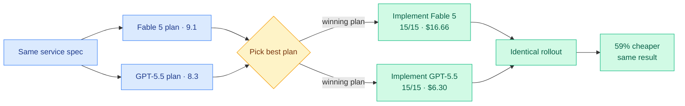

# cere-bro | 2026-06-16

> Two frontier labs convert big models to mostly-linear attention on the same day, two papers make heterogeneous KV caches actually shippable, and a 3B model matches Gemini 3 Pro on math. The efficiency supply chain is racing the open-weight price war, while Washington keeps the frontier's best closed model frozen.

---

## TL;DR

- **Tangram**: non-uniform KV caches (a different memory budget per attention head) finally run in production. Fix the budgets offline from 50 samples, get 2.6x throughput on vLLM.
- **TokenPilot**: stop breaking the prompt cache. Don't mutate the agent's context layout, just defer eviction until relevance expires. Up to 87% cheaper per turn.
- **Nemotron 3 Ultra**: NVIDIA ships a 550B open MoE on a hybrid Mamba-attention backbone. Claims 6x throughput at 1M context, fully open weights and recipe.
- **Ling-2.6 / Ring-2.6**: Ant Group migrates a 1T model from full attention to a 7:1 linear-to-MLA hybrid via continued pre-training, not a fresh retrain.
- **VibeThinker-3B**: a 3B dense model scores 94.3 on AIME26, matching DeepSeek V3.2 and Gemini 3 Pro on verifiable reasoning. Verifiable reasoning is compressible.
- **DeepSeek V4 Pro**: runs a benchmark task 20x cheaper than GPT-5.5 and 40x cheaper than Claude Opus 4.8, while the White House keeps Anthropic's best model globally frozen.

---

## Deep Dives

### Tangram: non-uniform KV cache compression made shippable

> Giving each attention head its own cache budget keeps accuracy that uniform compression loses, but no serving stack could run it. The freed memory got trapped as fragmentation, prefill burned a quarter of its time reclaiming scattered pages, and decode latency rose 1.7x. Tangram's fix: the head budgets are input-invariant, so resolve them once, offline, from 50 samples.

**Source:** HuggingFace
**Links:** [Paper](https://arxiv.org/abs/2606.06302) · [Wiki summary](../../inference-efficiency/2026-06-16-tangram-non-uniform-kv-compression-serving.md)

**What is it about?**
The KV cache (the per-token attention memory that grows with every turn and every user) becomes larger than the model weights in multi-turn serving, so memory, not compute, caps throughput. Non-uniform compression gives long-retention heads a big budget and compresses the rest hard. Tangram is the vLLM serving layer that lets those schemes actually run.

**What problem does it solve?**
Modern paged-KV stacks assume every head holds the same number of entries. Heterogeneous per-head lengths break that assumption, so freed memory fragments, prefill wastes up to 25% of its time reclaiming pages, and uneven GPU work inflates decode latency up to 1.7x. All the accuracy non-uniform compression buys was being eaten by the serving layer.

**What's the core novelty?**
The observation that head-wise retention does not need runtime discovery: the head ranking is input-invariant and the per-head ratios are narrowly bounded, both calibrated offline from as few as 50 samples. That turns three runtime costs into three static decisions. Budget Reservation fixes each head's footprint at scheduling time, Ragged Paging clusters similar-budget heads into independent page tables, and Ahead-of-Time Load Balancing precomputes GPU partitions.

**Key takeaways**
- Up to 2.6x end-to-end throughput over the full-KV baseline on vLLM.
- Drop-in substrate: matches the accuracy of whatever non-uniform method it wraps.
- 50-sample offline calibration replaces all runtime planning.
- Page reclamation is eliminated, not amortized.

**Gaps in the study**
The input-invariance claim is asserted, not stress-tested against heavily domain-shifted traffic where the head ranking could drift. The honest production comparison is against uniform compression, not full-KV, and that number is not the headline.

**Industrial implication**
This removes the main reason head-budget compression stayed in papers. Expect the next wave of per-head methods to report numbers on a Tangram-like substrate, the way sparse attention converged on vLLM operators. It is the serving-side complement to every head-axis cache paper the wiki tracks: MISA (05-11, route sparse attention on the head axis), Forcing-KV (05-15, static vs dynamic head roles), VaSE (06-03, protect large-magnitude value states).

→ [Full summary](../../inference-efficiency/2026-06-16-tangram-non-uniform-kv-compression-serving.md)

---

### TokenPilot: the cheapest context trick is not breaking the prompt cache

> Every agent context manager prunes tokens to save money. TokenPilot points out that pruning mutates the sequence, which invalidates the backend's prompt cache and forces a full recompute. The re-prefill penalty can erase the savings. The fix is to protect the cached prefix and only evict when relevance truly expires.

**Source:** HuggingFace
**Links:** [Paper](https://arxiv.org/abs/2606.17016) · [Wiki summary](../../inference-efficiency/2026-06-16-tokenpilot-cache-efficient-agent-context.md)

**What is it about?**
A dual-granularity context manager for long-running agents. Globally, Ingestion-Aware Compaction stabilizes the prompt prefix and strips noisy tool output at the ingestion gate. Locally, Lifecycle-Aware Eviction tracks each segment's residual utility and offloads it only when its task relevance expires, on a conservative batch-turn schedule.

**What problem does it solve?**
Long agent sessions pile up verbose execution traces, so per-turn cost climbs. The usual fixes (text pruning, dynamic eviction, context folding) cut token counts but shift the sequence layout, which causes prefix mismatch and KV cache invalidation in the backend. The repeated cache misses can negate the token savings outright.

**What's the core novelty?**
Naming the real trade-off as text sparsity versus prompt-cache continuity, and designing for both. It is the first agent-side method the wiki has tracked that treats breaking the cache as the cost to avoid, rather than treating token count as the only target.

**Key takeaways**
- 61% / 56% cost reduction in isolated mode, 61% / 87% in continuous mode, on PinchBench and Claw-Eval.
- Task performance stays competitive with prior systems.
- Eviction is deferred to relevance expiry, not a fixed window.
- Shipped inside LightMem2.

**Gaps in the study**
"Residual utility" estimation is the hidden dependency: a wrong call evicts something the agent later needs, and the paper does not report task-failure attribution from premature eviction. Transfer to backends with different prefix-caching implementations is untested.

**Industrial implication**
This is directly actionable on metered token billing (the GitHub Copilot usage-based shift, the MiniMax/Kilo coding plans from 06-15). "Don't break the prefix" is a cheaper win than smarter eviction because it costs nothing at the model and pays off entirely in backend cache hits. It is the agent-trajectory counterpart to KV Packet (04-17, wrap cached documents as immutable packets so reuse needs no recompute), and it cashes in the SemiAnalysis fact that frontier-lab unit economics now hinge on >90% prompt-cache hit rates.

→ [Full summary](../../inference-efficiency/2026-06-16-tokenpilot-cache-efficient-agent-context.md)

---

### Nemotron 3 Ultra: a 550B open MoE that is mostly not attention

> NVIDIA's biggest open model stacks nearly every efficiency lever the wiki tracks into one production system: a hybrid Mamba-attention backbone, a low-active-parameter MoE, 4-bit-native pre-training, and multi-teacher distillation. The claim is 6x throughput at on-par accuracy with 1M-token context, all open.

**Source:** HuggingFace
**Links:** [Paper](https://arxiv.org/abs/2606.15007) · [Wiki summary](../../llms-foundation-models/2026-06-16-nemotron-3-ultra-moe-hybrid-mamba.md)

**What is it about?**
A 550B-total / 55B-active Mixture-of-Experts model (each token routes through a small subset of expert sub-networks). The backbone is hybrid: mostly Mamba (a state-space sequence layer that scales linearly with context) with a minority of full-attention layers. Pre-trained on 20T tokens, extended to 1M context, post-trained with SFT, RL, and Multi-teacher On-Policy Distillation (MOPD).

**What problem does it solve?**
Frontier accuracy at long context is throughput-bound because dense attention's KV cache explodes. A mostly-linear backbone plus a low active-parameter count is the architectural answer, and NVIDIA ships it as open weights against the cheap open Chinese frontier (DeepSeek V4, MiniMax M3, Ling/Ring).

**What's the core novelty?**
Less a single trick than an integration proof: LatentMoE, Multi-Token Prediction, NVFP4 pre-training (4-bit floating point during pre-training, not post-hoc), multi-environment RLVR, MOPD, and reasoning-budget control stacked into one frontier-scale model that gets faster rather than fighting each other. MOPD is the first multi-teacher on-policy distillation the wiki has logged at this scale.

**Key takeaways**
- ~6x inference throughput versus state-of-the-art public LLMs at comparable accuracy (vendor self-report).
- 1M-token context aimed at hours-long autonomous agent sessions.
- Base, post-trained, and quantized checkpoints plus training data and recipe all open.
- NVFP4 pushes 4-bit-native training from video (LongLive-2.0, 05-19) to a 550B text MoE.

**Gaps in the study**
The 6x and on-par-accuracy claims are vendor numbers on NVIDIA's own Blackwell/NVFP4 stack with an unspecified comparison set. No per-lever ablation, so the contribution of the hybrid backbone vs MoE vs NVFP4 vs MTP to the 6x is unclear. Hybrid Mamba-attention historically trades some retrieval precision for throughput, so the 1M-context needle-in-a-haystack and multi-hop numbers are what to verify.

**Industrial implication**
If the claims survive audit, this becomes a default base for self-hosted long-horizon agents and validates "hybrid SSM-attention MoE with 4-bit-native training" as the frontier-scale efficiency template. It is the direct partner of today's Tangram serving work: a mostly-Mamba model has a dramatically smaller KV cache, which is exactly the binding constraint Tangram optimizes on the serving side.

→ [Full summary](../../llms-foundation-models/2026-06-16-nemotron-3-ultra-moe-hybrid-mamba.md)

---

### Ling-2.6 / Ring-2.6: migrate a 1T model to linear attention, don't retrain it

> The same day NVIDIA ships a hybrid backbone, Ant Group does the same to its 1T model from the other direction. It takes the existing full-attention Ling-2.0 base and migrates it to a 7:1 linear-to-MLA hybrid through 10T tokens of continued pre-training. Two big labs, same structural bet, one day.

**Source:** Twitter (@eliebakouch, Hugging Face), surfaced via farmer, not HF Daily Papers
**Links:** [Paper](https://arxiv.org/abs/2606.15079) · [Wiki summary](../../llms-foundation-models/2026-06-16-ling-ring-2.6-hybrid-linear-attention.md)

**What is it about?**
An upgrade of Ant's Ling-2.0 1T base into two models: Ling-2.6 (instant low-latency response) and Ring-2.6 (deep reasoning and agentic workflows, up to 1T). The headline change is the attention backbone: full Grouped-Query Attention is replaced by a 7:1 hybrid of Lightning Attention (a linear-complexity variant) and MLA (Multi-head Latent Attention, DeepSeek's low-rank latent KV).

**What problem does it solve?**
A from-scratch frontier pre-train is enormously expensive. Ant shows you can buy linear-attention efficiency on a model you already trained: migrate the architecture and continue pre-training on 10T tokens, instead of starting over.

**What's the core novelty?**
The "migrate, don't retrain" path, plus a token-efficiency post-training stack (Evolutionary Chain-of-Thought, Linguistic Unit Policy Optimization, bidirectional preference alignment, shortest-correct-response distillation) aimed at capability per output token, and KPop, an asynchronous RL framework for stably training Ring-2.6 at 1T on environment-grounded agentic data. Bakouch's read: the model emits fewer tokens because it was trained to be terse, not because it got smarter.

**Key takeaways**
- 7:1 Lightning-Attention-to-MLA hybrid: seven of every eight attention layers are linear-time.
- Built by migrating the Ling-2.0 base, not retraining from scratch.
- Base model released.
- Composes two distinct efficiency families: linear attention plus low-rank latent KV.

**Gaps in the study**
Sourced from a tech report and expert commentary, not an independent benchmark, so the quality-vs-cost position against DeepSeek V4 / MiniMax M3 is unverified. The 7:1 ratio's effect on long-context retrieval precision (the usual linear-attention tax) is not characterized.

**Industrial implication**
"Migrate, don't retrain" is the practically important claim: if a lab can convert a trained full-attention 1T model to a cheaper hybrid with continued pre-training, the cost of adopting linear-attention efficiency collapses for everyone sitting on a dense or GQA model. Paired with Nemotron 3 Ultra, hybrid linear attention is now the assumed backbone for the next generation of open agentic models, confirming the PrfaaS premise (04-22, hybrid-attention models emit far less KV cache) at production scale.

→ [Full summary](../../llms-foundation-models/2026-06-16-ling-ring-2.6-hybrid-linear-attention.md)

---

### VibeThinker-3B: verifiable reasoning fits in 3 billion parameters

> A 3B dense model scores 94.3 on AIME26 and 80.2 Pass@1 on LiveCodeBench, matching DeepSeek V3.2 and Gemini 3 Pro on verifiable reasoning while staying tiny. The interpretation is the real contribution: reasoning compresses into a small core, knowledge does not.

**Source:** HuggingFace
**Links:** [Paper](https://arxiv.org/abs/2606.16140) · [Wiki summary](../../inference-efficiency/2026-06-16-vibethinker-3b-compression-coverage.md)

**What is it about?**
A technical report pushing verifiable reasoning to its limit in a strict 3B-parameter budget, via curriculum SFT, multi-domain RL, and offline self-distillation (the Spectrum-to-Signal paradigm). It scores in the band of first-tier reasoning systems on competition math and code, with 96.1% acceptance on recent unseen LeetCode (which rules out simple contamination) and 93.4 on IFEval (so instruction-following survives).

**What problem does it solve?**
The assumption that frontier reasoning requires frontier parameter counts. VibeThinker argues small reasoning models are a complementary capability path, not just a cheap downgrade.

**What's the core novelty?**
The Parametric Compression-Coverage Hypothesis: verifiable reasoning is compressible into a compact reasoning core, while open-domain knowledge and general competence require broad parameter coverage over facts and long-tail scenarios. It lifts the wiki's recurring "the signal is sparse" finding from the update level to the capability level.

**Key takeaways**
- 94.3 on AIME26 (97.1 with claim-level test-time scaling), 80.2 Pass@1 on LiveCodeBench v6.
- Matches or beats DeepSeek V3.2, GLM-5, Gemini 3 Pro on these verifiable slices.
- 93.4 IFEval: extreme reasoning tuning did not break instruction control.
- Strong out-of-distribution generalization on unseen contests.

**Gaps in the study**
Every benchmark is verifiable by design, which is the hypothesis's home turf, so the easy half of the claim is confirmed and the hard half (that knowledge genuinely needs coverage a 3B cannot have) is asserted, not measured against a knowledge benchmark side by side. Claim-level test-time scaling adds inference cost the "small model" framing does not account for.

**Industrial implication**
If verifiable reasoning compresses to 3B, the economics of math and code agents change: route verifiable subtasks to a cheap dense specialist and reserve frontier models for open-domain knowledge. This is the architecture-level version of the workflow-level model split coding tools are shipping. It strengthens the same thread as today's FastContext (use a small specialist for the cheap part) and yesterday's S2L-PO (06-15, a small model is the cheapest diverse explorer for RL).

→ [Full summary](../../inference-efficiency/2026-06-16-vibethinker-3b-compression-coverage.md)

---

### FastContext: give the coding agent a small explorer so the solver stays clean

> Coding agents burn most of their tokens finding the right code, and those exploratory reads pollute the solver's context. FastContext splits exploration into a dedicated small-model subagent that returns only file paths and line ranges. Up to 5.5% better resolution at up to 60% fewer tokens.

**Source:** HuggingFace
**Links:** [Paper](https://arxiv.org/abs/2606.14066) · [Wiki summary](../../agentic-systems/2026-06-16-fastcontext-exploration-subagent.md)

**What is it about?**
A dedicated exploration subagent (Microsoft) for coding agents. Invoked on demand, it fires parallel tool calls over the repo and returns concise file paths and line ranges, nothing else. The explorer models (4B to 30B) are bootstrapped from strong reference trajectories and refined with task-grounded rewards for broad first-turn search, multi-turn evidence gathering, and precise citation.

**What problem does it solve?**
In most coding agents the same model explores and solves, so token-hungry navigation stays in the solver's history, crowding out the signal. FastContext makes exploration a separate, cheaper role.

**What's the core novelty?**
Treating repository exploration as a distinct subtask with its own optimal interface and its own small specialist model, wired in as a tool the fixed solver calls.

**Key takeaways**
- Up to 5.5% higher end-to-end resolution on SWE-bench Multilingual, SWE-bench Pro, SWE-QA.
- Up to 60% fewer coding-agent tokens.
- Explorer is a trained component, not a prompt trick. Code is public.
- No change to the solver's weights.

**Gaps in the study**
The 5.5% and 60% figures are ceilings, not averages. The explorer is trained per ecosystem against the SWE-bench distribution, so transfer to other repos and languages is open. The "marginal overhead" claim hides a real second-model inference cost that only nets out because the solver shrinks.

**Industrial implication**
Coding-agent products on metered billing should treat retrieval as a separate cheap model call. Expect agent frameworks to ship a pluggable "explorer" slot the way they ship pluggable memory. It is the repo-exploration cousin of yesterday's "LLM Agents Can See Code Repositories" (06-15, hand the agent a rendered structure graph to cut input tokens 26%): both confirm repository navigation is its own subtask, attacked here with a separate model rather than a separate modality.

→ [Full summary](../../agentic-systems/2026-06-16-fastcontext-exploration-subagent.md)

---

### Kilo: plan with the strong model, implement with the cheap one

> Kilo ran both Claude Fable 5 and GPT-5.5 on the same coding task. The strong model wrote the clearly better plan (rubric 9.1 vs 8.3). But when both models implemented that same winning plan, both passed all 15 acceptance checks with identical results, and GPT-5.5 did it for $6.30 against Fable 5's $16.66. Same service, 59% less.

**Source:** Twitter (@kilocode), surfaced via farmer
**Links:** [Blog](https://blog.kilo.ai/p/claude-fable-5-vs-gpt-5-5) · [Wiki summary](../../ai-routing/2026-06-16-kilo-plan-implement-model-split.md)

**What is it about?**
A controlled practitioner experiment that splits a coding task into planning and implementation and routes each phase to a cost-effective model. The finding: model quality differences live in the plan, not the execution. Once a good plan exists, a cheaper model executes it just as well.

**What problem does it solve?**
Running one frontier model end to end overpays for the easy half. Kilo shows where the expensive model earns its cost (the hard-to-verify planning phase) and where it does not (the verifiable, plan-constrained implementation phase), and ships phase switching as one click.

**What's the core novelty?**
Pinning capability to a specific phase. This is trajectory routing (pick the model per step from trajectory signals) realized at the coarsest, most actionable granularity, two phases and two models, and it adds a third finding to the 06-07 Kilo Code audit ("more reasoning is not monotonically better," "coverage is disjoint").

**Key takeaways**
- Same service for 59% less by planning with Fable 5 and implementing with GPT-5.5.
- Both implementations passed 15/15 acceptance with identical rollout behavior.
- The finding holds for any strong planning model, relevant now that Fable 5 access was pulled.
- Phase switching is one click in Kilo, so it is a product feature, not just a study.

**Gaps in the study**
A single task with one rubric, n=1, not a benchmark. "Identical rollout" may reflect a task whose implementation was easy once planned; harder tasks might show the cheap model failing at execution too. The plan-quality rubric is Kilo's own.

**Industrial implication**
For coding agents on metered billing, the immediate rule is: do not pay frontier prices for implementation. This is the workflow-level twin of today's VibeThinker (verifiable reasoning compresses to a small model) and FastContext (cheap explorer subagent), three same-day datapoints saying decompose the loop and right-size each piece. Combined with the Anthropic shutdown pushing teams off a single provider, phase-split routing across providers is both a cost and a resilience strategy.

→ [Full summary](../../ai-routing/2026-06-16-kilo-plan-implement-model-split.md)

---

### Who Flips? a model can be accurate and still fold under pushback

> Accuracy benchmarks ask whether a model reaches the right answer. They never ask whether it keeps it. Hit seven frontier models with a coherent argument for a wrong option after they answer correctly, and flip rates run from 17.5% to 97.3%. Telling the model the counterargument is its own makes it fold more often.

**Source:** HuggingFace
**Links:** [Paper](https://arxiv.org/abs/2606.16011) · [Wiki summary](../../responsible-ai/2026-06-16-who-flips-answer-stability.md)

**What is it about?**
A controlled protocol for measuring answer stability, a sycophancy and robustness property distinct from accuracy. After a model answers a multiple-choice question correctly, it is challenged with a plausible argument for an incorrect option, and the protocol measures whether it flips, while isolating argumentative content from overt social pressure.

**What problem does it solve?**
Two models with identical accuracy can have wildly different stability, and standard benchmarks cannot see it. Who Flips? makes stability measurable and releases the protocol, the records, and a curated hard set (MaxFlip).

**What's the core novelty?**
Naming and quantifying the destabilizers. Self-attribution (framing the counterargument as the model's own) raises flips by a mean +7.1pp (up to +18.7pp), and pooling wrong-answer arguments across models and picking the most effective one per question makes stronger challenges than any single model, which MaxFlip amplifies up to +23.6pp.

**Key takeaways**
- Flip rates from 17.5% to 97.3% across seven frontier models on 57 MMLU subjects.
- Self-attribution consistently destabilizes (mean +7.1pp), the behavioral mirror of the 06-11 ownership-bias finding (models over-trust answers framed as their own).
- The best refutation per question often comes from a different model, attacks are diverse across the population.
- MaxFlip ships as a ready adversarial stability set.

**Gaps in the study**
Confined to multiple-choice MMLU where "flip" is cleanly defined; open-ended generation is untested. It measures a single counterargument turn, not the compounding multi-turn pressure that is the real deployment risk.

**Industrial implication**
Stability belongs in release gates alongside accuracy, especially for multi-agent systems where one agent's output is another's input, because the cross-model pooling result shows an agent is more exploitable when challenged by a peer model, and self-attribution framing makes it worse. As governance pivots to release-gating (the Fable freeze), this is an axis those release decisions are not yet measuring. Expect "answer stability" to appear in model cards.

→ [Full summary](../../responsible-ai/2026-06-16-who-flips-answer-stability.md)

---

## Industry Pulse

- **DeepSeek V4 Pro is absurdly cheap.** Artificial Analysis clocks it at $0.04 per benchmark task at Intelligence Index 44, over 20x cheaper than GPT-5.5 ($0.99) and 40x cheaper than Claude Opus 4.8 ($1.78), and even undercuts MiniMax M3 despite being a larger 1.6T model ([@eliebakouch](https://nitter.net/eliebakouch/status/2066707805890077128#m)).
- **Anthropic's Fable 5 / Mythos freeze hardens.** Three days after launch the White House export-control order forced a global block for foreign nationals, so Anthropic disabled the models worldwide and redirected API traffic to Opus 4.8 ([AI Breakfast](https://mail.google.com/mail/u/0/#inbox/19ecb1b2ea9d19f8)).
- **Two-thirds of the Department of War moved off Anthropic.** The DoW CTO says it will no longer be "single-threaded to one AI provider," explicitly diversifying vendors in daily workflows ([@DoWCTO](https://nitter.net/DoWCTO/status/2066592032810770756#m)).
- **De facto licensing regime warning.** A White House official told reporters the longer the Anthropic standoff runs, the more it becomes a regime where "every model going forward needs to ask the government's permission" to ship ([Politico via @ns123abc](https://www.politico.com/news/2026/06/15/trump-officials-meet-with-anthropic-to-discuss-a-truce-00962698)).
- **DeepMind maps four paths to superintelligence.** Its 60-page "From AGI to ASI" lays out scaling, new algorithms, recursive self-improvement, and collective intelligence, alongside a "faithful uncertainty" method letting models hedge instead of hallucinate or refuse ([AI Breakfast](https://mail.google.com/mail/u/0/#inbox/19ecb1b2ea9d19f8)).
- **Nadella: token capital is the moat.** Microsoft's CEO argues enterprise value is shifting from model selection to proprietary self-improving internal systems, where human judgment steers company-specific AI ([@satyanadella via AI Breakfast](https://mail.google.com/mail/u/0/#inbox/19ecb1b2ea9d19f8)).
- **Google ends the free Gemini CLI tier June 18.** It steers developers toward the closed-source Antigravity CLI, a year after open-sourcing the harness ([@kilocode](https://nitter.net/kilocode/status/2066667318608826525#m)).
- **NVIDIA joins the AI debt boom.** A $20B bond sale funds datacenter buildout as power becomes the primary scaling constraint ([The Decoder](https://the-decoder.com/nvidia-joins-ai-debt-boom-with-20-billion-bond-sale/)).
- **Xiaomi ships a 1T model at 1000 tokens/sec.** MiMo-V2.5-Pro-UltraSpeed hits the speed via FP4 quantization, DFlash speculative decoding, and TileRT software on a commodity 8-GPU node, a Chinese efficiency push under export controls ([Import AI](https://mimo.xiaomi.com/blog/mimo-tilert-1000tps)).
- **Cognition's FrontierCode benchmark is reassuringly hard.** Built by 20 maintainers grading real code mergeability, Claude Opus 4.8 scores just 13.4% on the Diamond tier ([Import AI](https://cognition.ai/blog/frontier-code)).
- **Sequent launches as an alignment nonprofit** because "alignment is not on track," targeting $100-150M for principled-confidence techniques before recursive self-improvement ([Import AI](https://www.sequent.org/launch)).
- **Anthropic sued for fraud over Max plans.** A federal class action claims the $200/month plans deliver far below advertised usage, one user hit 15% of weekly allowance in a 5-hour sprint ([WSJ via @ns123abc](https://www.wsj.com/tech/ai/anthropic-sued-over-limits-on-its-200-a-month-ai-plans-e2a109e4)).
- **Europe debates AI sovereignty after the freeze.** The EU Commission is assessing the US order; researchers weigh homegrown foundation models versus securing contracts, but lack the compute and energy ([The Decoder](https://the-decoder.com/anthropic-shutdown-sparks-sovereignty-debate-across-eur/)).
- **Stanford ships the AI Index Report 2026**, the annual data dump on capability, investment, and policy trends ([HuggingFace](https://huggingface.co/papers/2606.15007)).

---

## Global View

Today's research is the supply side of the open-weight price war the Industry Pulse is screaming about. DeepSeek V4 Pro now runs a benchmark task 20x cheaper than GPT-5.5 and 40x cheaper than Claude Opus 4.8, and the five efficiency papers are exactly the mechanisms that make that price possible: Nemotron 3 Ultra and Ling-2.6/Ring-2.6 both convert frontier models to mostly-linear attention on the same day (a minority of full or latent-attention layers carrying retrieval, linear-time layers doing the bulk to shrink the KV cache), while Tangram and TokenPilot attack the serving-side and agent-side costs of that same cache. This is the cost-discipline thread the wiki has tracked since Meta's AI Gateway (06-14, ration internal token spend from 2027) and Nadella's "don't waste frontier models on everyday tasks," now arriving as architecture rather than policy: research is not chasing the cost cut after industry, it is shipping the levers industry's new per-token accounting will buy.

The hybrid-attention convergence is the cleanest cross-paper pattern of the week. The wiki has tracked the recipe since the PrfaaS serving models (04-22, Kimi Linear and MiMo-V2-Flash emit far less KV cache) and the linear-attention substrate line (MDN, Gated DeltaNet-2); today two independent frontier-scale labs publish the same structural bet in one day, NVIDIA with Mamba+attention and Ant with a 7:1 Lightning-Attention-to-MLA hybrid migrated from an existing full-attention base. Three or more groups making the same architectural choice is the wiki's threshold for declaring a pattern, and the field has crossed it: mostly-linear hybrid is now the assumed backbone for new open agentic models, not an experiment.

That convergence is exactly what makes the Anthropic Fable freeze look like a fight over the wrong layer. Washington is keeping Anthropic's best closed model globally frozen on national-security grounds (a posture officials concede is drifting toward a release-licensing regime), while open hybrids get cheaper and more capable by the day and VibeThinker-3B shows even a 3B model matches Gemini 3 Pro on verifiable reasoning. The Department of War already moved two-thirds of its workflows off Anthropic to diversify vendors. The governance bet is that controlling frontier weights controls capability; the market reality, validated by today's papers, is that capability is migrating to cheap open weights and learned scaffolds (FastContext's small explorer lifting a fixed solver is the same "capability lives in the harness, not the base model" thread as HarnessX on 06-15). Gating the frontier's most expensive model accelerates the defection to open.

---

## Looking Ahead

- **Hybrid linear attention becomes the default frontier backbone.** Two independent frontier-scale labs shipped mostly-linear hybrids today. If a third (a Qwen, a Llama, or a Mistral release) ships a linear/full hybrid within 60 days, or an independent long-context retrieval audit (RULER, needle-in-a-haystack) of Nemotron 3 Ultra or Ring-2.6 holds up against a dense-attention peer by 2026-08-15, the template is locked and pure-dense-attention frontier models are legacy.
- **Tangram becomes the substrate other KV papers report on.** If a non-uniform KV compression paper publishes numbers on a Tangram-like static-reservation substrate, or vLLM merges ragged paging, within 90 days, then "non-uniform compression is impractical in production" is officially dead. Watch the head-axis cache line (MISA, Forcing-KV, VaSE descendants) for the first follow-up that assumes a serving layer.
- **The Compression-Coverage Hypothesis gets tested where it hurts.** VibeThinker confirmed reasoning compresses to 3B on verifiable tasks. The falsifiable half: if within 90 days a sub-4B reasoning specialist gets routed into a production coding or math stack as the default for verifiable subtasks, the hypothesis is operational. If instead a small reasoner is shown to collapse on a broad-knowledge benchmark that a 70B handles, the "knowledge needs coverage" half is the binding constraint and small reasoners stay niche.
- **DeepSeek V4 Pro pricing forces a frontier response.** At $0.04 per task at Intelligence Index 44, the open-weight cost floor is now 20-40x under the US frontier labs. If Claude or GPT cut per-task pricing, or a US lab matches Intelligence-44-at-near-free within 60 days, the price war is acknowledged; if not, expect continued enterprise defection to open weights of the kind the DoW just demonstrated.
- **LLM-rated underrated (Kurate, missing from HF today):** cs.LG #18 *A Bitter Lesson for Data Filtering* (Mohri, Duchi, Hashimoto, [2605.19407](https://arxiv.org/abs/2605.19407), ai_rating 7.5) argues, from a top-tier author trio, that heavy hand-engineered data filtering loses to scale. If it replicates the "filtering is a bitter lesson" claim against a strong curated-data baseline within 60 days, it reframes the data-curation arms race; track for an open follow-up.
- **Rising authors (Kurate):** this week's threshold-crossers are again the same biomedical foundation-model co-author clusters (Guy Lutsker et al. on clinical-physiology simulation, Andrew Zhang et al. on virtual-patient representations) persisting across four weeks. Not independent rising signal and not Tier-1 relevant. No new Twitter handle additions warranted.

---
