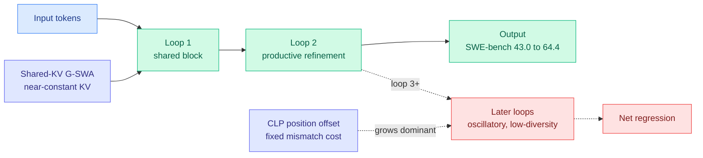
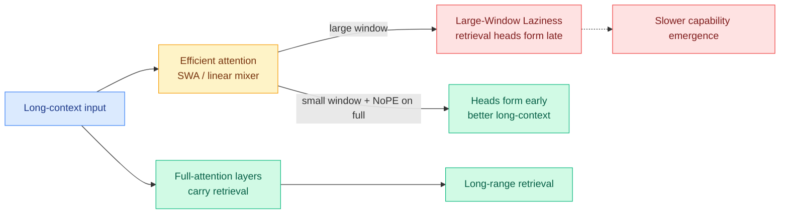
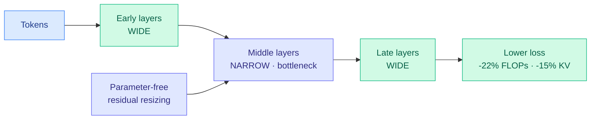
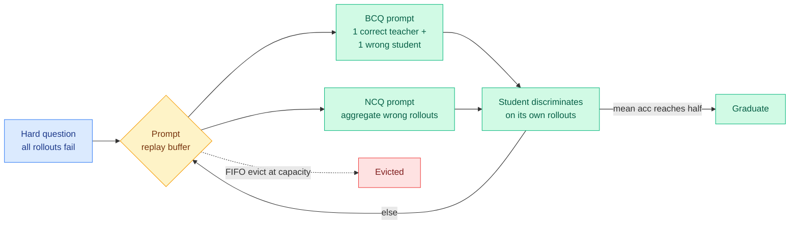
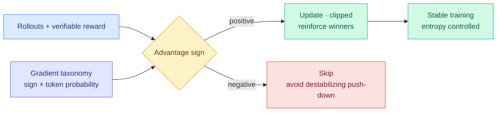
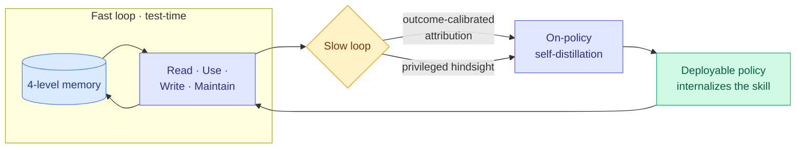
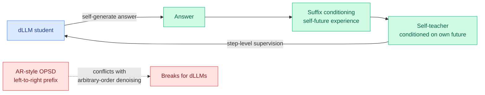

# cere-bro | 2026-06-17

> Three architecture papers say the same thing from different angles, stop spending capacity uniformly, while a distillation paper does the opposite of the frontier's hottest recipe by pulling the teacher out of the gradient entirely. Underneath it all, Blackwell trains a 671B model in two minutes and the open-weight price war takes another open frontier release.

---

## TL;DR

- **LoopCoder-v2**: a looped transformer (reuses the same block to add depth) peaks at exactly two loops. SWE-bench Verified jumps 43.0 to 64.4; three or more loops regress.
- **Large-Window Laziness**: in hybrid models, long-range retrieval lives in the full-attention layers. A bigger sliding window makes those layers lazy and delays the skill.
- **Variable-Width Transformers**: keep layers wide at the ends, narrow in the middle. 22% fewer FLOPs and 15% smaller KV cache at lower loss.
- **ZPPO**: distill a small model by putting the teacher in the prompt, not the gradient. Beats GRPO and standard distillation, biggest gains at 0.8B.
- **WAPO**: RLVR training collapses from a few destabilizing gradient steps. Updating only on winning rollouts fixes it.
- **Blackwell sweeps MLPerf**: CoreWeave trained DeepSeek-V3 671B in two minutes on 8,192 GPUs; GLM-5.2 ships open MIT weights with a 1M context.

---

## Deep Dives

### LoopCoder-v2: looped transformers saturate at exactly two loops

> A looped transformer reuses one block several times to add effective depth for free. You would expect more loops to mean more refinement. LoopCoder-v2 trains 7B coders at different loop counts and finds the opposite past two: the two-loop model lifts SWE-bench Verified from 43.0 to 64.4, but three or more loops actively regress.

**Source:** HuggingFace
**Links:** [Paper](https://arxiv.org/abs/2606.18023) · [Wiki summary](../../inference-efficiency/2026-06-17-loopcoder-v2-parallel-loop-transformer.md)

**What is it about?**
A looped (or universal) transformer applies a shared stack of layers repeatedly, so a model with N physical layers acts like one with N times the loops in effective depth, paying parameters once and compute per loop. The Parallel Loop Transformer backbone here adds two efficiency tricks: Cross-Loop Position Offsets (CLP), which break the sequential dependency so loops run in parallel, and Shared-KV Gated Sliding-Window Attention, which shares the first loop's KV cache (the per-token attention memory) so the memory footprint stays roughly flat as loops increase.

**What problem does it solve?**
Until now, looping was a latency-and-memory tax that grew with loop count, so practitioners avoided it. The parallel backbone removes that tax, which makes loop count a real design choice. But it raises a new question nobody had data on: how many loops actually help?

**What's the core novelty?**
A gain-versus-cost account of loop count. Each loop can refine the representation (gain), but CLP introduces a fixed positional mismatch at every loop boundary (cost). The paper shows loop 2 carries almost all the productive refinement, while later loops produce diminishing, oscillatory updates and less representational diversity. Because the mismatch cost stays fixed while the gain shrinks, the cost takes over, and the model gets worse.

**Key takeaways**
- Two-loop 7B coder: SWE-bench Verified 43.0 to 64.4, Multi-SWE 14.0 to 31.0, broad gains across code generation, reasoning, agentic SWE, and tool use.
- Strongly non-monotonic: three or more loops regress below the two-loop variant.
- The Shared-KV trick keeps the KV cache roughly constant across loop counts.
- Diagnostics, not just a benchmark: the regression is explained by oscillatory late-loop updates plus fixed positional cost.

**Gaps in the study**
7B only, so whether the two-loop optimum holds at frontier scale is open. The diagnosis is specific to the CLP parallelization trick, so a mismatch-free looping scheme might saturate elsewhere. All benchmarks are code or agentic; non-code reasoning is untested.

**Industrial implication**
For anyone building test-time-compute models, the rule is concrete: two loops, then stop. It is the latent-compute version of the recurring finding that more is not monotonically better (the Kilo Code audit on 06-16 found more reasoning effort does not monotonically help coding agents). Looped models become a cheap way to roughly double effective depth on a fixed parameter budget, but only once.

→ [Full summary](../../inference-efficiency/2026-06-17-loopcoder-v2-parallel-loop-transformer.md)

---

### Large-Window Laziness: in a hybrid model, retrieval lives in the full-attention layers

> Modern open models mix a few expensive full-attention layers with many cheap ones (sliding-window or linear). Everyone tunes the window size by trial and error. This paper finds the cheap layers do not carry long-range memory at all, and worse, making their window bigger makes the expensive layers lazy and slower to learn retrieval.

**Source:** HuggingFace
**Links:** [Paper](https://arxiv.org/abs/2606.15378) · [Wiki summary](../../inference-efficiency/2026-06-17-rethinking-efficient-attention-hybrid.md)

**What is it about?**
A mechanism study of hybrid attention. Sliding-window attention (SWA) only looks at a fixed nearby window; full attention looks at everything. Hybrid models combine them to save memory. The paper traces what each part actually contributes, across scaling behavior, internal mechanism, and design.

**What problem does it solve?**
Two frontier labs shipped mostly-linear backbones the same day yesterday (NVIDIA's Nemotron 3 Ultra on Mamba-plus-attention, Ant's Ling/Ring-2.6 on a 7-to-1 linear-to-latent-attention hybrid), and both left the same question open: how much retrieval precision does the cheap-layer ratio cost? Until now that was guesswork. This paper answers it mechanistically.

**What's the core novelty?**
The finding that long-range retrieval is carried by the full-attention layers, while the efficient layers only shape the optimization path. That yields Large-Window Laziness: a bigger SWA window delays the formation of retrieval heads in the full layers, because the cheap layers cover for them just well enough to remove the pressure to learn. The fix follows from the mechanism, apply NoPE (drop positional encoding) on only the full-attention layers of a small-window hybrid, and long-context performance jumps with almost no short-context cost.

**Key takeaways**
- The efficient-attention choice controls how fast long-context ability emerges, not the final ceiling; hybrids converge given enough training.
- Long-range retrieval is localized to full-attention layers.
- Larger sliding windows delay retrieval-head formation (the laziness effect).
- NoPE on full layers only is a cheap, targeted long-context win.

**Gaps in the study**
The "convergence given enough training" claim is the expensive part to verify, and if compute-matched runs never reach "enough," the emergence-rate gap is the real ceiling gap. NoPE-on-full is shown on SWA hybrids; whether it transfers to Mamba or Lightning-Attention hybrids is untested.

**Industrial implication**
This closes the open question yesterday's hybrid releases left, and it hands the KV-cache compression line a clean rule: spend the cache budget on the full-attention layers, compress the efficient layers hard, because that is where retrieval is not. It is the layer-axis version of the same allocation logic that head-axis schemes like Tangram (06-16, per-head KV budgets) already exploit.

→ [Full summary](../../inference-efficiency/2026-06-17-rethinking-efficient-attention-hybrid.md)

---

### Variable-Width Transformers: stop giving every layer the same width

> Transformers keep the same width at every layer, spending parameters evenly even though different layers do different jobs. This paper narrows the middle layers and widens the ends, and the bottleneck-shaped model beats the uniform one on loss while using 22% fewer FLOPs and a 15% smaller KV cache.

**Source:** HuggingFace
**Links:** [Paper](https://arxiv.org/abs/2606.18246) · [Wiki summary](../../inference-efficiency/2026-06-17-variable-width-transformers.md)

**What is it about?**
An architecture that varies width across depth instead of holding it constant. Width is the size of each layer's internal representation; more width means more parameters and compute per layer. This design keeps early and late layers wide and narrows the middle, joined by a parameter-free residual-resizing step so the residual stream stays consistent.

**What problem does it solve?**
Uniform width over-provisions the middle layers, which play a different role than the input-facing and output-facing ends. That wasted capacity costs FLOPs and KV cache for no accuracy gain.

**What's the core novelty?**
Empirically demonstrating that a bottleneck width profile is more resource-optimal than uniform width, with the savings coming directly from a lower average layer width, and showing the bottleneck produces qualitatively different residual-stream representations rather than just a smaller version of the same ones.

**Key takeaways**
- Beats parameter-matched uniform baselines on LM loss from 200M to 2B dense and 3B MoE.
- 22% FLOP reduction under fitted loss-matched scaling curves.
- 15% smaller KV cache memory and I/O, a structural saving baked into the architecture.
- The narrow middle changes what the residual stream encodes, not just how much.

**Gaps in the study**
Largest model tested is 3B, and the FLOP win rests on extrapolated loss-matched scaling curves, so frontier-scale behavior is unverified. The width profile is fit empirically, not derived, and only LM loss is reported, no downstream benchmarks.

**Industrial implication**
If the bottleneck shape holds at scale, it is a free 15-to-22% efficiency win that composes with everything else, MoE, quantization, and serving-layer KV compression. Together with today's LoopCoder-v2 (two loops, then stop) and Large-Window Laziness (retrieval lives in specific layers), it is the third paper today arguing that capacity should follow each layer's function, not be spread evenly.

→ [Full summary](../../inference-efficiency/2026-06-17-variable-width-transformers.md)

---

### ZPPO: distill a small model by putting the teacher in the prompt, not the gradient

> The frontier's hottest 2026 recipe injects a teacher's signal straight into the student's gradient, token by token. ZPPO does the exact opposite. On hard questions where the student fails every time, it refuses to touch the gradient and instead feeds the teacher's answer into the prompt as a puzzle the student has to solve. It beats standard distillation and GRPO, with the biggest gains on the smallest student.

**Source:** HuggingFace
**Links:** [Paper](https://arxiv.org/abs/2606.18216) · [Wiki summary](../../inference-efficiency/2026-06-17-zppo-teacher-in-prompts-not-gradients.md)

**What is it about?**
A post-training method named after Vygotsky's "zone of proximal development," the band of tasks just beyond what a learner can do alone. Standard distillation forces a small student to copy a big teacher's output probabilities, which over-fits it to the teacher's sharpest answers and hurts generalization. RL on the student's own attempts avoids that, but on questions where every attempt fails there is no signal, and splicing in the teacher's answer there breaks the on-policy assumption (that training data comes from the model's own current policy) and destabilizes training.

**What problem does it solve?**
It targets the dead zone of hard questions where both standard methods fail: distillation over-fits, and RL has nothing to learn from. Until now the teacher's help on those questions had to enter through the gradient, where it causes drift.

**What's the core novelty?**
Moving the teacher from the gradient channel to the prompt channel. On a hard question, ZPPO builds two reformulated prompts: a Binary Candidate question that pairs one correct teacher answer with one wrong student answer (anonymized) for the student to tell apart, and a Negative Candidate question that pools the student's own wrong attempts to expose their shared mistake. A replay buffer recirculates each hard question until the student solves it half the time, then retires it.

**Key takeaways**
- On Qwen3.5 vision-language students from 0.8B to 9B with a 27B teacher, across 31 benchmarks, ZPPO beats off-policy distillation, on-policy distillation, and GRPO.
- Largest gains at the smallest (0.8B) scale, where copying a big teacher is most damaging.
- Teacher influence never enters the policy gradient, so on-policy training stays stable.

**Gaps in the study**
The graduation threshold and eviction rule are heuristics with no sensitivity analysis. Results are on vision-language suites with one model family, so text-only frontier-scale behavior is open. The extra prompts and rollouts add compute the headline comparison should net out.

**Industrial implication**
This is the clean counterpoint to MOPD (Multi-teacher On-Policy Distillation), the recipe Interconnects called the 2026 frontier default (DeepSeek V4, MiMo Flash, and Nemotron 3 Ultra all distill from many specialist teachers token by token). MOPD puts the teacher maximally in the gradient; ZPPO removes it. The likely synthesis a quarter out: gradient distillation for the reachable questions, prompt-channel teaching for the hard tail where every rollout fails.

→ [Full summary](../../inference-efficiency/2026-06-17-zppo-teacher-in-prompts-not-gradients.md)

---

### WAPO: RLVR collapses from a few bad gradient steps, so only take the good ones

> RLVR training (reinforcement learning where an answer can be auto-checked) keeps collapsing, and nobody had a clean account of why. This paper traces it to specific gradient steps that wreck the model's confidence, then fixes it with an almost embarrassingly simple rule: only learn from the rollouts that won.

**Source:** HuggingFace
**Links:** [Paper](https://arxiv.org/abs/2606.16154) · [Code](https://github.com/layer6ai-labs/wapo) · [Wiki summary](../../llms-foundation-models/2026-06-17-wapo-rlvr-gradient-stability.md)

**What is it about?**
A diagnosis-then-fix paper for the instability of GRPO, the standard open-source RL algorithm that scores a group of rollouts and pushes the model toward the above-average ones and away from the below-average ones. The paper builds a token-level taxonomy: for each token, predict how the update will move its probability and the model's overall entropy, based on the rollout's advantage sign and the token's current probability.

**What problem does it solve?**
GRPO-style runs collapse, and the usual fixes are control-theory patches (trust regions, entropy controllers) that treat the symptom. The taxonomy locates the actual mechanism: the destabilizing moves are mostly the ones that push down already-unlikely tokens on losing rollouts.

**What's the core novelty?**
Winner Advantage Policy Optimization (WAPO): a clipped policy-gradient objective that updates only on positive-advantage (winning) completions and skips the negative branch entirely. It reinforces what worked rather than fighting to suppress what did not, which removes the destabilizing updates the taxonomy identified.

**Key takeaways**
- The taxonomy predicts update effects from two variables: advantage sign and token probability under the current policy.
- WAPO improves training stability and matches or beats baselines on math reasoning and multi-hop QA across model families.
- The fix is the cheapest possible lever: drop the negative-advantage updates.
- Code is public.

**Gaps in the study**
Dropping negative advantage throws away the "what not to do" signal, which may hurt on safety or strict-format tasks. Shown on verifiable-reward home turf (math, multi-hop QA); transfer to sparse-reward agentic RL is untested. The taxonomy is derived for GRPO-style objectives, not PPO.

**Industrial implication**
This lands the same week SemiAnalysis (06-16, "RL Systems Mind the Gap") and Interconnects both flagged RL as the expensive, conflict-prone bottleneck on model capability. WAPO attacks that wall from the algorithm side: a positive-only update is both cheaper per step and more stable. The durable contribution is the taxonomy, which is a principled basis for adaptive clipping, not just the blunt drop-all-negatives rule.

→ [Full summary](../../llms-foundation-models/2026-06-17-wapo-rlvr-gradient-stability.md)

---

### OPD-Evolver: teach the agent how to use its memory, do not just give it one

> Self-evolving agents store their past trajectories and retrieve them later, but storing experience is not the same as knowing how to learn from it. OPD-Evolver distills the skill of managing memory, choosing what to keep, what to write, what to reuse, into the agent's own weights, and a 9B version then challenges models forty times its size.

**Source:** HuggingFace
**Links:** [Paper](https://arxiv.org/abs/2606.17628) · [Wiki summary](../../agentic-systems/2026-06-17-opd-evolver-agent-evolver-on-policy-distillation.md)

**What is it about?**
A framework that treats experience as a learnable skill rather than a lookup table. Most self-evolving agents bolt a memory module onto a frozen policy. OPD-Evolver runs a fast loop where the agent reads, uses, writes, and maintains a four-level memory hierarchy while it works, and a slow loop that distills those four abilities into the policy itself using on-policy self-distillation (training the model on its own rollouts with a privileged teacher signal).

**What problem does it solve?**
Existing memory agents can retain trajectories but lack the holistic competence to select useful experience, act on it, write reusable knowledge, and keep the repository healthy. Memory without memory-management skill plateaus.

**What's the core novelty?**
Outcome-calibrated memory attribution (credit which memory operations actually helped the final outcome) plus privileged hindsight (a teacher that sees the result the student did not), used to distill memory-management ability into the deployable weights.

**Key takeaways**
- Beats the ReasoningBank memory system by up to 11.5% and the Skill0 training method by about 5.8% across multi-domain benchmarks.
- OPD-Evolver-9B challenges far larger models (Qwen3.5-397B-A17B, Step-3.5-Flash).
- The edge is internalized memory management, not raw scale.

**Gaps in the study**
The attribution and hindsight pieces are the easiest to overfit to a benchmark's reward structure, and there is no analysis of what happens when the distilled policy makes a bad memory write that poisons later retrieval. Whether the internalized skill transfers to genuinely novel task distributions, the whole point of "evolving," is the open question.

**Industrial implication**
This is on-policy distillation, the wiki's deepest research thread, applied to agent memory, and it is the third recent datapoint (after FastContext on 06-16 and HarnessX on 06-15) showing capability migrating into the learned scaffold rather than the base model. For agent builders, the lesson is that a small model trained to operate memory well can beat a giant model with a naive memory bolt-on.

→ [Full summary](../../agentic-systems/2026-06-17-opd-evolver-agent-evolver-on-policy-distillation.md)

---

### d-OPSD: the first working post-training recipe for diffusion LLMs

> Diffusion language models generate text by denoising tokens in any order, which makes them fast but has left them without the mature training recipes autoregressive models enjoy. This paper ports on-policy self-distillation to diffusion models by feeding the model its own future answer as a hint, and matches stronger baselines using a tenth of the training steps.

**Source:** HuggingFace
**Links:** [Paper](https://arxiv.org/abs/2606.18195) · [Code](https://github.com/xingzhejun/d-OPSD) · [Wiki summary](../../inference-efficiency/2026-06-17-d-opsd-dllm-self-future-distillation.md)

**What is it about?**
On-policy self-distillation (OPSD) post-trains a model on its own outputs while a privileged version of itself supervises. It works well for autoregressive LLMs but had never worked for diffusion LLMs (dLLMs), which denoise tokens in arbitrary order rather than left to right. d-OPSD is the first OPSD built for dLLMs.

**What problem does it solve?**
Autoregressive OPSD injects the privileged signal as a left-to-right prefix and supervises token by token, which fundamentally conflicts with a dLLM's arbitrary generation order. dLLMs are attractive for inference because they can decode in parallel, but they lacked a competitive post-training recipe.

**What's the core novelty?**
Two order-respecting changes. First, build the self-teacher by conditioning on the student's self-generated answer as a suffix ("self-future experience") instead of a privileged prefix. Second, supervise at the step level, aligned to the denoising iterations, instead of the token level.

**Key takeaways**
- First OPSD framework tailored to diffusion LLMs; the autoregressive version does not transfer.
- Beats RLVR and SFT on four reasoning benchmarks.
- Needs only about 10% of RLVR's optimization steps, a large sample-efficiency win.
- Note: this paper reuses the acronym "d-OPSD" the wiki assigned to a different 05-07 diffusion paper; they share the conditioning-asymmetry idea but are distinct works.

**Gaps in the study**
The "self-future" suffix is the student's own possibly-wrong answer, so on hard questions a bad suffix could teach the wrong thing, the exact failure mode the autoregressive distillation line spent months fixing with trajectory repair and filtering; d-OPSD has no such correction layer yet. Four benchmarks only, and the step-count comparison depends on matched compute per step.

**Industrial implication**
A cheap, working post-training recipe is the missing piece that kept dLLMs from competing with autoregressive reasoning models. If this sample efficiency holds, the parallel-decoding speed advantage becomes a real reason to choose diffusion models for verifiable reasoning, which would reopen the architecture race the autoregressive recipe currently dominates.

→ [Full summary](../../inference-efficiency/2026-06-17-d-opsd-dllm-self-future-distillation.md)

---

### GLM-5.2: another open frontier model built for long-horizon work

> Z.ai shipped an MIT-licensed open model with a usable 1M-token context and two reasoning-effort settings, at the same price as the last version. The detail worth keeping is a small KV-cache trick: dropping one specific cache entry made the model both cheaper and better.

**Source:** Twitter (@eliebakouch) + HuggingFace blog
**Links:** [Blog](https://z.ai/blog/glm-5.2) · [Model](https://huggingface.co/zai-org/GLM-5.2) · [Wiki summary](../../llms-foundation-models/2026-06-17-glm-5.2-long-horizon-open-weights.md)

**What is it about?**
GLM-5.2 is the latest open-weight model in Z.ai's GLM line, aimed at project-scale coding and multi-step agents. It ships MIT open weights, a 1M-token context the docs claim is stable in practice, and two reasoning modes (max for peak performance, high for token efficiency), all at the previous version's API price.

**What problem does it solve?**
Long-horizon agentic tasks need both a large context and a way to control reasoning cost. GLM-5.2 bundles both into an open model, adding pressure on closed US labs in the open-weight price war.

**What's the core novelty?**
For the day-to-day reader, the interesting piece is a KV-cache design choice surfaced by HuggingFace's @eliebakouch: at the second multi-token-prediction head, GLM-5.2 deliberately omits the indexer's KV entry for the value predicted by the first head ("indexer sharing"). It is both cheaper and more accurate, because including it would inject a train-versus-inference distribution shift on that specific cache entry.

**Key takeaways**
- MIT open weights, 1M context, two reasoning-effort levels, GLM-5.1 pricing.
- FrontierSWE score reported as near state of the art (vendor and early-tester signal).
- The MTP indexer-sharing trick is a concrete instance of "train/inference KV consistency matters as much as cache size."

**Gaps in the study**
Benchmarks are largely vendor-reported, and independent long-context retrieval audits (needle-in-a-haystack, RULER) at the full 1M context are pending, the usual place hybrid and sparse-attention long-context claims overstate.

**Industrial implication**
Paired with a serving layer like Tangram (06-16, makes per-head KV compression shippable), GLM-5.2 is now a credible self-hosted agentic-coding stack. Its reasoning-effort knob is exactly the token-cost control that metered billing (the Copilot usage-based shift) is pushing every model to expose.

→ [Full summary](../../llms-foundation-models/2026-06-17-glm-5.2-long-horizon-open-weights.md)

---

## Industry Pulse

- **NVIDIA Blackwell swept MLPerf Training 6.0**, fastest on every benchmark and largest scale at 8,192 GPUs, including new mixture-of-experts pretraining workloads ([NVIDIA](https://nvda.ws/3SIOU6q)).
- **CoreWeave trained DeepSeek-V3 671B in two minutes** on 8,192 Blackwell Ultra GPUs over Spectrum-X Ethernet, the fastest recorded run of that model ([@eliebakouch](https://nitter.net/eliebakouch/status/2067027997446869109#m)).
- **Azure hit Llama 3.1 405B training in 7.07 minutes** at the largest reported scale on GB200 NVL72 systems ([@nvidia](https://nitter.net/nvidia/status/2067044209476223373#m)).
- **SpaceX is acquiring Cursor for $60B all-stock**, having jointly trained a model with the Cursor team, to be released in Cursor and Grok Build ([SpaceX via @ns123abc](https://nitter.net/ns123abc/status/2066877457416818773#m)).
- **Cursor is teasing a from-scratch frontier model**, reportedly Opus/GPT-5.5 sized with 10-20x the compute of Composer, due in weeks ([@NickADobos via @ns123abc](https://nitter.net/ns123abc/status/2066963726394069303#m)).
- **Cursor launched Origin**, code storage and git hosting for teams and agents, available this fall ([@cursor_ai](https://nitter.net/cursor_ai/status/2067012220832329782#m)).
- **DeepSeek closed a record $7B-plus round** at a roughly $50B valuation, its first outside money, via an unusual deal structure ([The Information via @ns123abc](https://www.theinformation.com/articles/deepseek-closes-record-7-billion-plus-funding-unusual-deal-structure)).
- **OpenAI burned through $34B last year** per Ed Zitron, with losses reportedly multiplying year over year ([Marcus on AI](https://garymarcus.substack.com/p/openais-lead-is-dwindling-fast)).
- **ChatGPT's global market share fell below 50% for the first time**, the headline number behind Gary Marcus's "OpenAI's lead is dwindling fast" ([Marcus on AI](https://garymarcus.substack.com/p/openais-lead-is-dwindling-fast)).
- **Mistral previewed a new "fat but sparse" MoE family** for summer, with an early-access program in July for research, government, and industry partners ([@arthurmensch via @eliebakouch](https://nitter.net/eliebakouch/status/2066916265302835450#m)).
- **Ineffable Intelligence picked Google Cloud Vera Rubin NVL72** to build a "superlearner," after a $1.1B seed, Europe's largest, led by AlphaGo's David Silver ([Google Cloud](https://goo.gle/3Sa9sES)).
- **Grok 4.3 went live on Amazon Bedrock**, xAI's first appearance there, running on Bedrock's new Mantle inference engine ([AWS via @mattsgarman](https://aws.amazon.com/about-aws/whats-new/2026/06/grok-amazon-bedrock/)).
- **Anthropic detailed Claude Managed Agents**, its Applied AI approach to getting agents into production with credentials, sandboxing, and observability handled ([@ClaudeDevs](https://claude.com/blog/building-with-claude-managed-agents)).
- **GenAI.mil is embedding AI into warfighter workflows at Fort Bragg**, the Department of War's premier internal AI platform ([@DoWCTO](https://nitter.net/DoWCTO/status/2066974564538556493#m)).
- **xAI shipped Grok Imagine Video 1.5**, an image-to-video model with sharper realism and faster generation ([xAI via @heavypulp](https://nitter.net/heavypulp/status/2067132658799329328#m)).

---

## Global View

Today's distillation papers split the field on a single question that industry has already answered one way. The 2026 frontier default, per Interconnects' post-training review (06-16, the recipe MiMo Flash introduced and DeepSeek V4 and Nemotron 3 Ultra scaled to ten-plus teachers), is Multi-teacher On-Policy Distillation: pour the teacher straight into the student's gradient, token by token. ZPPO (the small-student method that puts the teacher in the prompt instead of the gradient) bets the opposite, and wins biggest at 0.8B where gradient imitation is most toxic, while d-OPSD ports the same on-policy self-distillation to diffusion models and OPD-Evolver ports it to agent memory. So research is simultaneously scaling MOPD up and discovering that for the hardest, smallest cases you should pull the teacher out of the gradient entirely, a tension worth tracking because the frontier labs have committed to only one side of it.

The hardware and efficiency news are two ends of the same cost machine. On the supply side, Blackwell swept MLPerf 6.0 and CoreWeave trained a 671B model in two minutes, while today's three architecture papers (LoopCoder-v2's two-loop cap, Variable-Width's bottleneck, Large-Window Laziness's layer-localized retrieval) all cut waste by refusing to spend capacity uniformly. On the demand side, GLM-5.2 ships another open MIT frontier model, DeepSeek raised $7B at $50B, and OpenAI reportedly burned $34B while its share slipped under 50%. The through-line the wiki has tracked since Meta's AI Gateway (06-14, ration internal token spend) is now unmistakable: research is shipping the per-token efficiency levers exactly as the market's economics turn brutal, and the closed leader is the one bleeding cash.

WAPO and the RL-systems coverage close a smaller loop between the lab and the cluster. SemiAnalysis (06-16, "RL Systems Mind the Gap," RL efficiency comes down to matching trainer and generator throughput) and Interconnects both name RL as the expensive, conflict-prone bottleneck on capability, and Dario Amodei's claim that RL scales log-linearly like pretraining means every wasted RL step has a real capability cost. WAPO's finding that a handful of destabilizing gradient steps cause GRPO collapse, fixable by updating only on winning rollouts, is the algorithm-side complement to the systems-side throughput work: one makes RL cheaper to run, the other makes each run less likely to waste itself.

---

## Looking Ahead

- **The two-loop ceiling is either an architecture artifact or a real limit on latent compute.** If within 90 days a parallel-loop or recurrent-depth model ships a position-mismatch-free scheme that beats its own two-loop variant at three or more loops, the LoopCoder-v2 saturation is a fixable CLP artifact and looped depth has more room. If instead follow-ups keep saturating at two regardless of the looping trick, latent-compute depth is genuinely capped and test-time scaling must come from elsewhere (search, tools, more samples).
- **NoPE-on-full-layers becomes a hybrid-model default.** If any frontier hybrid release (a Qwen, Llama, Mistral, or DeepSeek update) adopts NoPE on only its full-attention layers, or an independent long-context retrieval audit confirms Large-Window Laziness on a Mamba or Lightning-Attention hybrid, within 60 days, the mechanism is locked and small windows plus protected full layers becomes the recipe. Watch for it first in a model card's attention-config section.
- **Teacher-in-prompt and teacher-in-gradient get unified, or one wins.** If within 90 days an open post-training run combines MOPD for reachable questions with a ZPPO-style prompt-channel pass for the all-fail hard tail, the synthesis is real and the small-student brittleness problem is effectively solved. If MOPD keeps scaling and prompt-channel teaching stays a niche small-model trick, the gradient camp won and ZPPO is a 0.8B-only tool.
- **A diffusion LLM enters a production reasoning stack on the strength of cheap post-training.** d-OPSD claims dLLM post-training at a tenth of RLVR's steps. If within 90 days a diffusion model ships into a real verifiable-reasoning deployment citing parallel-decode speed plus this kind of recipe, the autoregressive monopoly on reasoning recipes cracks; if dLLMs stay benchmark-only, the speed advantage is not yet worth the recipe immaturity.
- **LLM-rated underrated (Kurate, missing from HF today):** cs.LG #16 *Pretraining Recurrent Networks without Recurrence* (Kumar & Isola, [2606.06479](https://arxiv.org/abs/2606.06479), ai_rating 7.5) argues recurrent/SSM-style models can be pretrained without paying the sequential recurrence cost, directly relevant to the linear-attention and hybrid-backbone line the wiki tracks. If it replicates the claim against a recurrent baseline within 60 days, it lowers the training cost of the exact architectures Large-Window Laziness and Nemotron/Ling-Ring are built on; track for an open implementation.
- **Rising authors (Kurate):** this week's threshold-crossers are again the same biomedical foundation-model co-author clusters (Guy Lutsker et al. on clinical-physiology simulation, Andrew Zhang et al. on virtual-patient representations) persisting across four weeks, not independent rising signal and not Tier-1 relevant. No new Twitter handle additions warranted.

---
