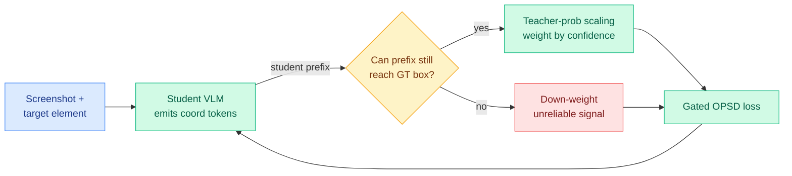
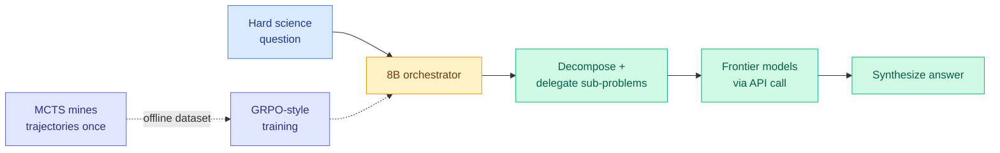
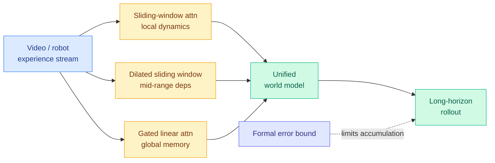
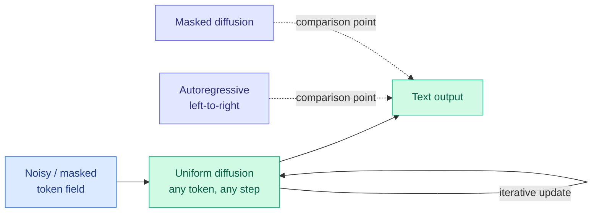
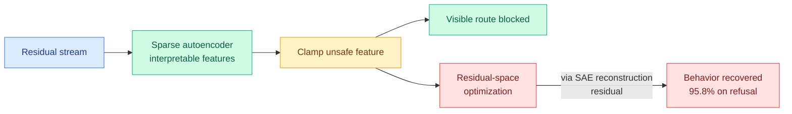
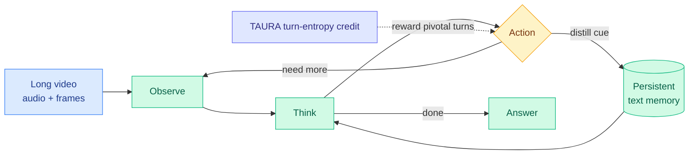
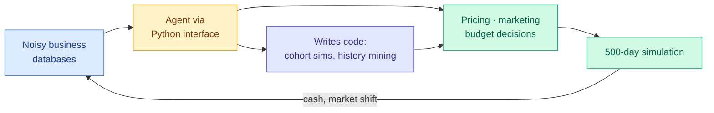
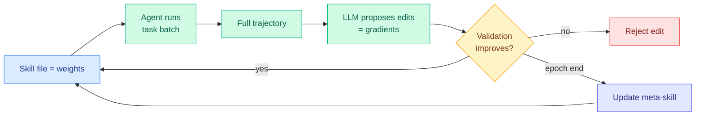

# cere-bro | 2026-06-18

> Agents keep failing the long game and the hard-to-verify cases, so today's research converges on one move: stop trusting any signal uniformly, gate it. Underneath, the open-weight flood and a government export freeze reset who controls frontier access.

---

## TL;DR

- **Quality-Aware OPSD**: gate the teacher per coordinate-token by whether the student's prefix can still reach the target box. The fourth "gate the teacher, don't copy it" paper in two days.
- **SciOrch**: train an 8B router to orchestrate frontier models offline, because live API rollouts cost too much. Beats the best single model at under half the cost.
- **Kairos**: a three-tier hybrid attention (local, mid-range, global) for world models, with a proven bound limiting long-horizon error.
- **CEO-Bench**: run a startup for 500 days. Only Claude Opus 4.8 and GPT-5.5 stay solvent, and neither consistently turns a profit.
- **SAE interventions are unreliable**: clamping an "unsafe" feature blocks one route but behavior re-routes through the part the autoencoder cannot explain. 95.8% recovery on refusal.
- **Industry day**: Noam Shazeer leaves Google for OpenAI, GLM-5.2 and DeepSeek V4 Vision ship open weights, and US export controls strand Anthropic's Fable model.

---

## Deep Dives

### Quality-Aware OPSD: gate the teacher where the student already went wrong

> On-policy distillation copies a teacher's per-token signal onto the student's own attempts. For predicting screen coordinates, that breaks the moment the student starts a wrong click, because the teacher is then grading a doomed continuation. This paper gates the teacher per coordinate-token by a simple test: can this prefix still land in the right box?

**Source:** HuggingFace
**Links:** [Paper](https://arxiv.org/abs/2606.18101) · [Wiki summary](../../inference-efficiency/2026-06-18-quality-aware-opsd-gui-grounding.md)

**What is it about?**
This is on-policy self-distillation (OPSD: the student generates its own answers and learns from a teacher's token-level distribution over those answers) applied to GUI grounding, where a vision-language model must output the exact pixel coordinates of a small element in a screenshot. The paper makes the teacher signal quality-aware in the one place it most often goes bad: coordinate tokens emitted after the student has already drifted off target.

**What problem does it solve?**
Naive OPSD scores the teacher on the student's own prefix. Once the student's coordinate prefix has wandered, the teacher's next prediction is conditioned on a path that can no longer reach the answer, so it becomes noise. Until now there was no clean way to tell which coordinate-token supervision to trust.

**What's the core novelty?**
Two coupled mechanisms. A soft correctness-aware gate asks, per coordinate-token, whether the student's current prefix can still be completed into the ground-truth bounding box, and down-weights the teacher when it cannot. Teacher-probability scaling then calibrates the surviving signal by the teacher's own confidence. The reliability test is unusually concrete here: "can this prefix still reach the answer" reduces to box membership, decidable token by token.

**Key takeaways**
- Neither component helps alone. Gating without calibration and calibration without gating both fall short, only the combination consistently beats the base model and strong baselines.
- Consistent gains across six GUI grounding benchmarks.
- It gives "teachability" a literal geometric meaning, where TA-OPD (06-01, only distill teacher corrections the student can actually reach) defined it abstractly.

**Gaps in the study**
The gate needs the ground-truth box, so it is a training-time-only signal that cannot run at inference. GUI grounding only, with no scale ablation, even though small-student brittleness is exactly where this should matter most.

**Industrial implication**
This is the fourth paper in two days making one claim: the distillation teacher must be gated by reliability, never applied token-for-token by default (after ZPPO on 06-17, which puts the teacher in the prompt not the gradient, d-OPSD's diffusion self-teacher, and OPD-Evolver's outcome-credited memory ops). The durable idea is that teacher reliability equals student-prefix feasibility, a rule definable for any structured output with a partial-completion check: a parser for code, a schema for JSON, a verifier for math.

→ [Full summary](../../inference-efficiency/2026-06-18-quality-aware-opsd-gui-grounding.md)

---

### SciOrch: the learned router that confronts its own training bill

> Every routing paper this year trained an orchestrator to pick and combine frontier models. SciOrch hits a wall the others sidestepped: when each routing action is a paid API call, you cannot afford live reinforcement-learning rollouts. Its answer is to mine the decisions once, offline, and train on the recording.

**Source:** HuggingFace
**Links:** [Paper](https://arxiv.org/abs/2606.15872) · [Wiki summary](../../ai-routing/2026-06-18-sciorch-orchestrating-expert-llms.md)

**What is it about?**
SciOrch trains a lightweight 8B model to orchestrate frontier commercial LLMs for hard scientific reasoning. It decomposes each question, delegates sub-problems to selected models through API calls, and synthesizes a final answer, exploiting the fact that different frontier models excel on different question types.

**What problem does it solve?**
Online reinforcement learning needs many rollouts, but here every rollout action is an expensive paid API call, so standard agentic RL is infeasible. Prior orchestrators (Conductor, Maestro, Orchestra-o1) trained against cheap or self-hosted workers and never paid this bill.

**What's the core novelty?**
Decoupling exploration from optimization. Monte Carlo Tree Search (which explores decision branches by sampling rollouts and backing up their values) mines diverse orchestration trajectories once. The per-node single-turn samples become a reusable offline dataset, and GRPO-style training (the standard group-relative RL objective) optimizes the orchestrator on that fixed dataset with no further live calls.

**Key takeaways**
- 56.66% average accuracy on a 240-question SGI-Reasoning plus Scientists' First Exam set, beating the best single commercial model by 3.74 points and the best multi-agent baseline by 3.33.
- Does it at under half the API cost of typical multi-agent methods.
- The first wiki routing paper to treat the orchestrator's training cost, not just its inference cost, as the binding constraint.

**Gaps in the study**
The MCTS mining phase still issues many paid calls, so the amortization point (how many served queries before offline-trained SciOrch beats running a multi-agent baseline live) is unstated. Scientific reasoning only.

**Industrial implication**
This is the fourth "routing is the policy" datapoint after Conductor (05-11, 7B RL orchestrator over frontier workers), Maestro (05-23), and Orchestra-o1 (06-15, omnimodal orchestration). It lands the same week practitioners published the cost case for routing: Kilo's breakdown showed the same coding task costs $15 on Opus versus $1.70 on a cheaper model, and "most of what an agent does does not need a frontier model." SciOrch is the research answer to that economics, and it moves the open question from inference cost to training cost.

→ [Full summary](../../ai-routing/2026-06-18-sciorch-orchestrating-expert-llms.md)

---

### Kairos: a world model that proves its long-horizon error stays bounded

> World models predict how the world evolves so robots can plan inside them, but they drift over long rollouts. Kairos splits temporal modeling across three attention tiers (local, mid-range, global) and, unusually, proves a bound that keeps error from accumulating across extended horizons.

**Source:** HuggingFace
**Links:** [Paper](https://arxiv.org/abs/2606.16533) · [Wiki summary](../../llms-foundation-models/2026-06-18-kairos-world-model-hybrid-linear-attention.md)

**What is it about?**
Kairos is a full stack for training and deploying world models for Physical AI. The world-model goal is lower interest here, but the attention design is worth reading. Its Hybrid Linear Temporal Attention factors time across three layers: sliding-window attention (full attention over a short recent window) for local dynamics, dilated sliding-window attention (a window with gaps that reaches further back at the same cost) for mid-range, and gated linear attention (a recurrent mixer with constant per-step memory) for persistent global state.

**What problem does it solve?**
Existing world models either render pixels, predict latents, or build playable environments, but none jointly acquire cross-embodiment knowledge, hold long-horizon state, and run under real deployment constraints. Long rollouts also accumulate error with no guarantee.

**What's the core novelty?**
A formal bound. The authors prove the temporal factorization strictly limits error accumulation, a mathematical guarantee of state propagation across extended horizons. Most long-horizon stability results are empirical, not proven.

**Key takeaways**
- Three time scales, three attention costs: cheap recurrence for global memory, exact attention only for the recent window.
- The proven error bound is the standout claim and the rare formal result in this space.
- Pairs the architecture with a cross-embodiment data curriculum and deployment co-design for server and consumer hardware.

**Gaps in the study**
A theoretical bound is only as strong as its assumptions (Lipschitz dynamics, bounded per-step error), which real video rollouts often violate, and the abstract does not summarize them. No head-to-head against the latent-prediction stream (V-JEPA, DINO-world) on a shared long-horizon metric.

**Industrial implication**
This is the second local-mid-global hybrid attention design in two days, but Kairos proves what yesterday's Large-Window Laziness study (06-17, in text hybrids long-range retrieval lives in the full-attention layers, and a bigger sliding window makes those layers lazy) only measured. The open worry transfers directly: does the cheap gated-linear global tier retain precise state, or just smooth dynamics the way a too-wide window let text models lean on local context? World-model capital is flowing in fast (Odyssey raised a $310M Series B on 06-17), which raises the bar on whether a proven efficiency-capability trade-off, not a demo, wins deployment.

→ [Full summary](../../llms-foundation-models/2026-06-18-kairos-world-model-hybrid-linear-attention.md)

---

### Sumi: the first large uniform diffusion language model trained from scratch

> Language models are mostly autoregressive (predict the next token left to right). Diffusion models, which can revise any token at any step, are the main alternative, and within them "uniform" diffusion is the most flexible variant, yet nobody had ever pretrained one at real scale. Sumi is that missing reference point: a fully open 7B uniform diffusion model on 1.5T tokens.

**Source:** HuggingFace
**Links:** [Paper](https://arxiv.org/abs/2606.19005) · [Wiki summary](../../llms-foundation-models/2026-06-18-sumi-open-uniform-diffusion-llm.md)

**What is it about?**
Sumi ("ink" in Japanese) is a 7B uniform diffusion language model (UDLM) pretrained from scratch on 1.5T tokens, with weights, checkpoints, and the full training recipe released. Uniform diffusion lets any token be updated at any denoising step, the most flexible generation order among diffusion variants.

**What problem does it solve?**
Autoregressive and masked-diffusion models both have capable open reference models the community can study; uniform diffusion had none. Without a scratch-pretrained UDLM at scale, nobody could study its scaling behavior, generation dynamics, or trade-offs against the established families on equal footing.

**What's the core novelty?**
It is the artifact itself, the first UDLM pretrained at both large parameter count and large token budget, plus a complete public specification of the data mixture over public corpora.

**Key takeaways**
- Competitive with autoregressive models at comparable token budgets on knowledge, reasoning, and coding.
- Underperforms on commonsense benchmarks, which the authors attribute to an education-heavy data mixture.
- Fully open: weights, checkpoints, and recipe, intended as a clean reference for studying uniform diffusion at scale.

**Gaps in the study**
The commonsense gap could be data or could be intrinsic to uniform diffusion, and the paper cannot yet separate the two. No inference-throughput comparison, the place diffusion's parallel-decode advantage would either show up or not.

**Industrial implication**
Paired with yesterday's d-OPSD (06-17, the first working post-training recipe for diffusion LLMs, at a tenth of RLVR's steps), the diffusion-LM stack is filling in fast: Sumi gives a base model to study, d-OPSD gives a way to post-train one. If the parallel-decode speed advantage turns real, these two together are what would let a diffusion model credibly enter a reasoning deployment.

→ [Full summary](../../llms-foundation-models/2026-06-18-sumi-open-uniform-diffusion-llm.md)

---

### SAE interventions are unreliable: the behavior re-routes around the clamp

> Latent-space safety defenses assume that if you find the "unsafe" feature inside a model and clamp it, the bad behavior stops. This paper shows the clamp blocks one visible route while the behavior re-routes through the part of the model the interpretability tool cannot explain. In the safety-critical refusal case, the suppressed behavior comes back 95.8% of the time.

**Source:** HuggingFace
**Links:** [Paper](https://arxiv.org/abs/2606.18322) · [Wiki summary](../../responsible-ai/2026-06-18-sae-interventions-unreliable.md)

**What is it about?**
Sparse autoencoders (SAEs) decompose a model's internal activations into interpretable features, and latent-space defenses clamp an "unsafe" feature to block misbehavior. This paper stress-tests that assumption by posing post-intervention recovery as a constrained optimization: starting from the clamped state, find a residual perturbation that restores the original behavior while keeping the targeted feature pinned at its clamped value.

**What problem does it solve?**
It tests whether feature-level control is behavioral control. The defense literature assumed clamping a feature reliably prevents the behavior; this asks whether the behavior can return without un-clamping the feature.

**What's the core novelty?**
A recovery attack that keeps the intervention active throughout optimization and generation, uses encoder-orthogonal updates so it provably does not just undo the clamp, and attributes the recovered behavior to the SAE reconstruction residual, the component the autoencoder leaves unexplained.

**Key takeaways**
- 95.8% recovery on valid samples in the refusal-steering setting, with the defended feature drifting only 0.131 (well below suffix-based baselines).
- Recovery succeeds across TPP, unlearning, IOI, and refusal experiments, not one task.
- The behavior re-routes through the SAE's reconstruction residual, so sparsity itself creates the escape hatch.

**Gaps in the study**
It demonstrates an attack but does not show whether an SAE trained toward a smaller reconstruction residual closes the gap, so it is unclear if this is a fixable engineering limit or a structural ceiling of sparse linear probes.

**Industrial implication**
This is the mechanistic name for the Fable 5 incident: Anthropic released Fable on 06-09, the US government restricted it on 06-12 after Amazon researchers found a jailbreak, and the pattern is exactly the paper's, a safeguard blocks the visible route while the capability stays reachable through an uncovered path. It is the direct skeptical counterweight to Anthropic's own Scaling Monosemanticity program (Kurate cs.AI #13, ai_rating 9.0, which extracted causally-manipulable features from Claude 3 Sonnet): features can be real and clamping can be causal, yet behavior still escapes.

→ [Full summary](../../responsible-ai/2026-06-18-sae-interventions-unreliable.md)

---

### OmniAgent: a 7B video agent that beats a 72B model by looking only where it needs to

> Long-video models usually process every frame uniformly, so cost grows with video length. OmniAgent treats understanding as an agent loop instead: observe, think, then act to pull only the cues it needs into a written memory. A 7B version beats a model ten times its size, and gets better the more turns it takes.

**Source:** HuggingFace
**Links:** [Paper](https://arxiv.org/abs/2606.19341) · [Wiki summary](../../agentic-systems/2026-06-18-omniagent-active-perception-video.md)

**What is it about?**
OmniAgent reframes omni-modal video understanding (text, audio, visual) as a partially-observed decision process: an Observation-Thought-Action loop that issues on-demand actions to selectively distill audio-visual cues into a persistent textual memory, decoupling reasoning cost from raw video duration.

**What problem does it solve?**
The watch-it-all paradigm wastes compute on irrelevant frames, and even interactive methods pre-scan the whole video, so context cost still scales with length. OmniAgent only pays for the cues the query actually needs.

**What's the core novelty?**
Two training pieces. Agentic supervised fine-tuning bootstraps the active-perception behavior from best-of-N synthesized trajectories with dual-stage quality control. Agentic RL with TAURA (Turn-aware Adaptive Uncertainty Rescaled Advantage) uses per-turn entropy to steer credit toward the pivotal discovery turns rather than the final answer alone.

**Key takeaways**
- 7B OmniAgent beats Qwen2.5-VL-72B on LVBench (50.5% vs 47.3%), a tenfold parameter gap closed by active perception.
- State of the art among open-source models across ten benchmarks.
- Positive test-time scaling: accuracy rises with more reasoning turns, evidence the loop does real work.

**Gaps in the study**
The textual memory is lossy by construction, and what it drops on detail-heavy tasks (counting, in-video OCR) is not characterized. TAURA's entropy reward could be gamed by an agent that manufactures fake uncertainty to farm credit.

**Industrial implication**
This is the third recent "capability migrates into the harness, not the base model" result (after OPD-Evolver on 06-17, a 9B internalizing memory management beats a 397B model, and FastContext on 06-16). For anyone serving long-video understanding, an agentic 7B that spends perception only where needed is the cheaper deployment, and decoupling cost from video length is the long-context analogue of CLEAR's per-query token budgeting (06-05).

→ [Full summary](../../agentic-systems/2026-06-18-omniagent-active-perception-video.md)

---

### CEO-Bench: run a company for 500 days, and only two models survive

> Agents are good at isolated short tasks but rarely tested on the long game. CEO-Bench makes an agent operate a startup for 500 simulated days, juggling pricing, marketing, and budget under noise and change. Of every frontier model, only Claude Opus 4.8 and GPT-5.5 end above their starting cash, and neither reliably profits.

**Source:** HuggingFace
**Links:** [Paper](https://arxiv.org/abs/2606.18543) · [Wiki summary](../../agentic-systems/2026-06-18-ceo-bench-long-horizon-agents.md)

**What is it about?**
A long-horizon agent benchmark structured as a 500-day business simulation. The agent runs a fictional company through a programmable Python interface, reading noisy interconnected databases and turning them into decisions, evaluated on four capabilities together: long-horizon planning under uncertainty, information acquisition in noise, adaptation to a changing world, and orchestrating many parts toward one goal.

**What problem does it solve?**
Existing benchmarks test these skills in isolation and over short horizons. CEO-Bench grades a cumulative economic outcome over hundreds of steps, which no single-task benchmark captures.

**What's the core novelty?**
The evaluation unit is sustained adaptive progress measured as a business outcome over 500 days, plus the finding that the best agents succeed by writing code that simulates customer cohorts to forecast cash and mines negotiation history for hidden preferences, building a model of the world rather than reacting turn by turn.

**Key takeaways**
- Only Claude Opus 4.8 and GPT-5.5 finish above the $1M starting balance, everything else ends underwater.
- Neither survivor consistently turns a profit, so even the frontier sits at the threshold.
- Winning behavior is emergent tool-building, not turn-by-turn reaction.

**Gaps in the study**
A single business domain, so generalization is unmeasured. The simulator's fidelity is load-bearing: an agent could win by exploiting simulator artifacts (the long-horizon version of AgentLens "lucky passes" from 05-14), and no audit of that is reported.

**Industrial implication**
This is a sharp capability-frontier marker. On sustained adaptive operation, the gap from the two closed leaders to everyone else, including the open-weight catch-up crowd (GLM-5.2, DeepSeek V4), is still wide, a useful counterweight to "open weights have closed the gap" on the days they ship. It also reframes long-game competence as plausibly a scaffolding problem (the agent that writes a good world-simulation tool wins), not a parameter problem.

→ [Full summary](../../agentic-systems/2026-06-18-ceo-bench-long-horizon-agents.md)

---

### SkillOpt: optimize the agent's instruction file like model weights, no fine-tuning

> Agents run on "skills", text files of rules, tool calls, and strategies, that are usually written once and never tuned. Microsoft's SkillOpt treats that file as trainable: run the agent, read the traces, propose edits, keep only the ones that pass validation. On a spreadsheet benchmark it nearly doubles GPT-5.5's accuracy without touching a single weight.

**Source:** AI Papers Academy newsletter (Gmail)
**Links:** [Review](https://aipapersacademy.com/skillopt/) · [Wiki summary](../../agentic-systems/2026-06-18-skillopt-trainable-skills.md)

**What is it about?**
A method that optimizes an agent's skill file the way gradient descent optimizes weights, but in text space. The agent attempts a batch of tasks, an LLM analyzes the full execution trajectory and proposes edits to the skill, and only edits that improve a validation set are kept.

**What problem does it solve?**
Skill files are critical to agent reliability yet are hand-written or one-shot generated, never rigorously optimized. SkillOpt makes them a trainable artifact, improving production reliability without any model retraining.

**What's the core novelty?**
The explicit gradient-descent analogy with a validation gate. The skill file is the weights, proposed edits are the gradients, the edit budget per iteration is the learning rate, validation is the safeguard, and a per-epoch reflection updates a meta-skill for the next round.

**Key takeaways**
- SpreadsheetBench: GPT-5.5 from 41.8% to 80.7% accuracy from skill optimization alone.
- Consistent gains across six benchmarks spanning chat, Codex, and Claude Code environments.
- Validation-gated acceptance is what keeps the iterative edits from regressing.

**Gaps in the study**
This is a newsletter summary, not the primary paper, so numbers are second-hand. The validation set is load-bearing, and an optimized skill could overfit it (the text-space analogue of benchmark gaming), with no held-out generalization reported.

**Industrial implication**
SkillOpt is the cleanest instance yet of capability living in the harness. It keeps the skill in the text artifact, where OPD-Evolver (06-17) distilled the same kind of skill into weights, two opposite homes for one capability. If the SpreadsheetBench jump generalizes, it implies current agents are under-specified, not under-capable, so skill quality, not model quality, is the binding constraint on reliability, the same lesson the routing page reached from the model axis.

→ [Full summary](../../agentic-systems/2026-06-18-skillopt-trainable-skills.md)

---

## Industry Pulse

- **Noam Shazeer is leaving Google for OpenAI**, the "Attention Is All You Need" co-author and Gemini co-lead who returned to Google in a reported $2.7B deal under two years ago ([The Decoder](https://the-decoder.com/googles-gemini-co-lead-noam-shazeer-joins-openai-after-two-year-return-stint/)).
- **GLM-5.2 shipped MIT open weights** with a 1M context and two reasoning-effort levels, pitched as Opus-4.6 / GPT-5.4 tier ([Z.ai via @ns123abc](https://nitter.net/ns123abc/status/2067507236792861037#m)).
- **DeepSeek added vision to V4**, now live on web and app, the second open-weight frontier multimodal drop within hours of GLM-5.2 ([@ns123abc](https://nitter.net/ns123abc/status/2067501390688026950#m)).
- **US export controls stranded Anthropic's Fable**, after the White House ordered SK Telecom's Mythos access revoked over alleged China ties and Amazon flagged a Fable jailbreak ([WIRED via @ns123abc](https://www.wired.com/story/sk-telecom-anthropic-mythos-export-controls/)).
- **JPMorgan cut its Hong Kong staff off from Claude**, following Goldman Sachs last month, as banks wall off frontier access by geography ([@ns123abc](https://nitter.net/ns123abc/status/2067480763776307508#m)).
- **AWS Summit NY dumped a full agentic stack**: AgentCore (Harness, Policies, Web Search, Managed KB), AWS Context knowledge graph, AWS Continuum autonomous vuln remediation, Amazon Quick, and Kiro for iOS ([@mattsgarman](https://www.aboutamazon.com/news/aws/aws-summit-nyc-2026-ai-agents)).
- **Cursor shipped cloud subagents** via `/in-cloud`, each in its own VM and branch, plus reusable environment snapshots ([@cursor_ai](https://cursor.com/changelog/cloud-in-agents-window)).
- **Midjourney launched a medical division** with an ultrasound "Scanner" body-scan device, drawing outsized hype but no technical detail ([@Scobleizer](https://nitter.net/Scobleizer/status/2067457400656007643#m)).
- **Google advanced AMIE to treatment**, a new Nature paper using Gemini's long context for physician-level longitudinal care reasoning ([Google Research](https://goo.gle/4oA0EEb)).
- **NVIDIA detailed France's AI buildout** at VivaTech: Mistral's 44MW data center is live with 18,000 GB200 Blackwell systems ([NVIDIA](https://nvda.ws/4vTllNV)).
- **Anthropic published "When AI builds itself"** (06-04), documenting AI doing a rising share of its own research and calling for a coordinated option to slow frontier development ([AISN #75](https://newsletter.safe.ai/p/aisn-75-anthropic-releases-fable)).

---

## Global View

Today's research says the same thing from four directions: stop trusting any signal uniformly, gate it by reliability. Quality-Aware OPSD gates the distillation teacher per coordinate-token by whether the prefix can still reach the answer, the fourth such paper in two days after ZPPO, d-OPSD, and OPD-Evolver. SAE Interventions are Unreliable shows the dual failure on the safety side: a clamp you *do* trust (an "unsafe" feature pinned to zero) does not control behavior, because the behavior re-routes through the SAE's unexplained residual. SciOrch generalizes the move to model selection (gate which frontier model handles each sub-problem) and CEO-Bench shows what happens without good gating over a long horizon: agents that cannot ration attention and adapt go bankrupt, with only Opus 4.8 and GPT-5.5 surviving. The wiki has tracked "more compute is not monotonically better" since the 05-29 hybrid study; this week sharpens it to "more *signal* is not better unless you gate it."

Industry is shipping the routing economics that research is theorizing, and the metering is now real. Kilo's public breakdown ($15 on Opus versus $1.70 on a cheaper model for the same task, "most of what an agent does does not need a frontier model") is the production case directly under SciOrch's offline-trained orchestrator and the Kilo audit the routing page already logged (06-07). At the same time the open-weight floor keeps rising, GLM-5.2 and DeepSeek V4 Vision both shipped frontier-tier open weights within hours, exactly as CEO-Bench shows the two closed leaders still alone at the top on sustained operation. So research and industry agree on the lever (route and gate to control cost) while disagreeing on the ceiling (open weights are catching up on benchmarks but not yet on the long game).

The Fable export-control saga is the safety-research thread colliding with policy in real time. SAE Interventions are Unreliable is the mechanistic explanation for why Fable could be jailbroken at all (a safeguard blocks the visible route while the capability stays reachable), and it lands the same week the US government restricted Fable after Amazon found exactly such a jailbreak, the White House revoked SK Telecom's Mythos access over China ties, and Anthropic itself published "When AI builds itself" asking for a coordinated option to pause. Research is proving that feature-level safety control is incomplete precisely as governments start treating model access as an export-controlled national-security asset, a gap between what safeguards can promise and what policy now assumes they deliver.

---

## Looking Ahead

- **The "gate the teacher" papers get unified into one reliability estimator, or stay task-specific.** Four mechanisms in two days (ZPPO's prompt channel, d-OPSD's self-future suffix, OPD-Evolver's outcome credit, Quality-Aware OPSD's box-membership gate) each estimate per-token teacher reliability for a different task. If within 90 days a paper ships a single estimator that subsumes the coordinate-box, math-verifier, and code-parser cases with the box case as the clean instance, the unified OPD formulation the distillation page has wanted all year finally exists. If they stay four separate tricks, reliability gating is a per-domain craft, not a theory.
- **SAE-based safety defenses get downgraded in practice.** SAE Interventions achieved 95.8% behavioral recovery against an active clamp via the reconstruction residual. If within 60 days a frontier lab's safety writeup stops citing single-feature clamping as a defense, or a follow-up shows a low-reconstruction-residual SAE that resists recovery, the result is locked and feature-clamping is demoted from defense to diagnostic. Watch the next model card's interpretability-safety section.
- **A diffusion LLM enters a real reasoning deployment on the Sumi-plus-d-OPSD stack.** Sumi gives an open base UDLM and d-OPSD (06-17) gives cheap post-training at a tenth of RLVR's steps. If within 90 days a diffusion model ships into a verifiable-reasoning product citing parallel-decode speed plus this recipe, the autoregressive monopoly on reasoning cracks; if diffusion stays benchmark-only, the speed advantage is not yet worth the immaturity.
- **Government model-access controls expand from one model to a regime.** The US restricted Fable, revoked SK Telecom's Mythos access, and ordered 30-day pre-release government review (per AISN #75). If within 90 days a second frontier model is access-restricted or a second lab is ordered to revoke a customer's access, model access is a managed export-control asset, not a one-off, and routing-by-jurisdiction (Kilo's EU-sovereign Inceptron partnership is an early move) becomes a product category.
- **LLM-rated underrated (Kurate, missing from HF today):** cs.LG #10 *How to Scale Mixture-of-Experts: From muP to the Maximally Scale-Stable Parameterization* (Vankadara et al., [2605.14200](https://arxiv.org/abs/2605.14200), ai_rating 9.0) keeps re-appearing at the top of the quality leaderboard, directly relevant to the scale-stable-parameterization line the attention page tracks (MoE-muP, Gated DeltaNet muP). If an open frontier MoE release cites the maximally-scale-stable parameterization in its training recipe within 60 days, the "derive the scaling rule once, never re-sweep" program has crossed from theory into production.
- **Rising authors (Kurate):** this week's threshold-crossers are again the same biomedical foundation-model co-author clusters (Guy Lutsker et al. on clinical-physiology simulation, Andrew Zhang et al. on virtual-patient representations) persisting across four weeks, not independent rising signal and not Tier-1 relevant. No new Twitter handle additions warranted.

---
