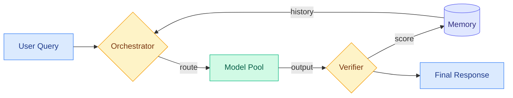

# cere-bro | 2026-06-29

> The open model ecosystem is diversifying faster than the commoditization spiral can catch it, but Gary Marcus argues the price-war math still wins and the trillion-dollar AI IPO thesis is already dead.

---

## TL;DR

- **Interconnects open model survey**: Zyphra, Cohere, Poolside, NVIDIA, and Zhipu each ship open-weight models under permissive licenses. Ecosystem diversification is accelerating, not consolidating.
- **Agent-as-a-Router**: treating LLM routing as a static classification problem is the bottleneck. A closed-loop router with feedback outperforms by 15 percent and ships with a benchmark.
- **NVIDIA Nemotron-3-Ultra 550B**: LatentMoE architecture makes inference faster than comparable dense models. NVIDIA also switches from a custom license to the OpenMDW license for model weights.
- **Cohere Command A+ and Poolside Laguna-M.1**: both flagship models now released under Apache 2.0. Poolside commits to open weights as the default going forward.
- **Gary Marcus on China catching up**: no-moat dynamics plus price wars plus unreliable systems equals a broken business model. He argues the AI industry should pivot toward science and medicine instead.
- **Semiconductor industry builds for agentic AI**: Arm reframes data center CPU around agentic workloads. Qualcomm enters the data center. Micron posts record results on AI memory demand.

---

## Deep Dives

### The Open Model Ecosystem Is Diversifying, Not Consolidating

> Nathan Lambert catalogs a structural shift: the number of organizations shipping open-weight models is growing, the motivations are fragmenting, and permissive licensing is becoming the norm.

**Source:** Gmail (Interconnects #22)
**Links:** [Interconnects post](https://www.interconnects.ai/p/artifacts-22-zyphra-cohere-and-poolside)

**What is it about?**
The latest Interconnects open artifacts roundup maps three categories of open model makers. Pure model makers (DeepSeek, Zhipu, Minimax, Poolside, Arcee, Zyphra) chase the frontier directly. Sovereign AI players (Cohere, Mistral, Trillion Labs) train models as national infrastructure. Product companies (JetBrains, Zed, Krea) ship specialized small models that serve their product rather than the model market.

**What problem does it solve?**
A year ago the open model landscape was dominated by a handful of Chinese players plus Llama. The fear was concentration. Today the opposite is happening and the question is whether this diversity is sustainable or a bubble.

**What's the core novelty?**
The analytical frame, not a single release. Lambert argues that bans on open models would be futile because the ecosystem now spans three distinct actor types with three distinct motivations, none of which depend on a single country or company.

**Key takeaways**
- NVIDIA Nemotron-3-Ultra-550B uses a LatentMoE architecture (mixture-of-experts where expert selection is learned in a continuous latent space rather than through discrete gating) to run faster than comparable dense models, with most training data open source and released under OpenMDW.
- Cohere Command A+, a 218B-A25B MoE model combining multimodal, multilingual, and agentic capabilities, moved from a non-commercial license to Apache 2.0 and fits on a single B200 GPU at 4-bit quantization.
- Poolside Laguna-M.1 shipped under Apache 2.0 and explicitly committed to open weights as the default release mode going forward.
- Zyphra ZAYA1-74B (74B-A4B MoE) was trained on AMD GPUs and released with a tech report detailing its architecture choices, a research-community insider's favorite.
- GLM-5.2 from Zhipu is described as genuinely usable for everyday work, not a huge regression from the best closed models.

**Gaps in the study**
This is a survey, not an empirical paper. No benchmarks comparing these models head-to-head against each other or against closed frontier models. The claim that GLM-5.2 is close to closed-model quality is not backed by a table of numbers in this post.

**Industrial implication**
If Poolside and Cohere are the canaries, permissive licensing (Apache 2.0, OpenMDW) is becoming table stakes for open model releases. Companies that stick with custom or non-commercial licenses will face a steeper adoption curve. The sovereign AI angle, boosted by the Mythos incident, could create a new, policy-driven demand channel for open models that is structurally different from the developer-adoption channel.

---

### Agent-as-a-Router: Routing Is a Closed Loop, Not a One-Shot Classification

> The first paper to formalize LLM routing as a continuous feedback loop rather than a static dispatch problem. Information deficit, not model choice, is the real bottleneck.

**Source:** Gmail (DAIR.AI Top Papers of the Week)
**Links:** [DAIR.AI LinkedIn post](https://www.linkedin.com/comm/pulse/top-ai-papers-week-dair-ai-ztx5e)

**What is it about?**
Agent-as-a-Router reframes LLM routing (the problem of deciding which model to call for each user query) as a Context-Action-Feedback loop. It is instantiated as ACRouter, a system with an Orchestrator that routes queries, a Verifier that checks outputs, and a Memory module that accumulates execution-grounded experience over time. The paper also releases CodeRouterBench, roughly 10,000 task instances scored across 8 frontier LLMs.

**What problem does it solve?**
Most users now have access to many LLMs that each excel in different domains and cost different amounts. Existing routers treat this as a static classification problem: look at the query once, pick a model, and move on. This paper shows that simply augmenting a vanilla LLM router with performance statistics at the task-dimension level yields a 15.3 percent relative gain, surpassing a heuristic router built on the same priors. The bottleneck is missing information, not model quality.

**What's the core novelty?**
The closed-loop formulation. Routing decisions generate execution outcomes, which feed back into the router's memory, which changes future routing decisions. This is a fundamentally different frame from router-as-classifier and much closer to how a human operations engineer would learn which model handles which task over time.

**Key takeaways**
- Adding task-level performance statistics to a vanilla LLM router improves routing accuracy by 15.3 percent relative, already outperforming a hand-tuned heuristic.
- ACRouter combines an Orchestrator (routes queries), a Verifier (checks output quality), and Memory (stores outcomes) into a single system.
- CodeRouterBench provides 10,000 task instances scored with regret-based metrics across 8 frontier models, the first public benchmark for this problem.

**Gaps in the study**
The DAIR.AI summary is the only source available. No arxiv paper linked yet that could be checked for architecture details, ablation coverage, or scaling behavior. The 15.3 percent number could be benchmark-specific. Whether ACRouter's feedback loop converges or oscillates under distribution shift is unexplored in the summary.

**Industrial implication**
Routing-as-closed-loop is the obvious next step for any production LLM platform serving heterogeneous model pools (OpenAI, Anthropic, together.ai, any enterprise with multiple model endpoints). If the 15 percent gain holds across deployment scales, it translates directly to lower cost at fixed quality, which in a price-war environment is a structural advantage.

---

### How to Scale Mixture-of-Experts: From muP to the Maximally Scale-Stable Parameterization

> A paper that extends maximal update parameterization (muP), the current gold standard for hyperparameter transfer across model sizes, to mixture-of-experts architectures where it was previously known to break.

**Source:** Kurate (cs.LG #11, ai_rating 9.0/10)
**Links:** [arXiv 2605.14200](http://arxiv.org/abs/2605.14200)

**What is it about?**
Mixture-of-experts (MoE) models, where each token routes through a subset of specialized sub-networks rather than the full model, are the dominant architecture for frontier training efficiency. But the standard technique for stable scaling, maximal update parameterization (muP), which lets you tune hyperparameters on a small model and transfer them to a large one, does not work out of the box for MoE. This paper derives the maximally scale-stable parameterization for MoE, extending muP to the architecture that now matters most.

**What problem does it solve?**
Training a large MoE model today means either running expensive hyperparameter sweeps at scale (wasteful) or guessing and hoping (risky). muP solved this for dense models. This paper solves it for MoE.

**What's the core novelty?**
The paper derives the correct learning rate and initialization scaling for MoE layers that preserves feature learning dynamics across model widths. The key insight is that expert routing introduces a different effective batch size per expert, which breaks the standard muP assumptions.

**Key takeaways**
- Extends muP to MoE architectures with theoretical grounding.
- Kurate ai_rating of 9.0/10 places it among the highest-rated papers this week.
- Directly applicable to any team training MoE models at scale.

**Gaps in the study**
Only the Kurate summary is available. Without reading the full paper, it is unclear how many MoE variants were tested (top-k routing, expert choice, soft MoE, LatentMoE) or whether the parameterization transfers across different routing mechanisms.

**Industrial implication**
Every frontier lab training MoE models (Mistral, DeepSeek, Qwen, NVIDIA) directly benefits from this work. It reduces the cost of trying new MoE configurations by making small-scale proxy tuning reliable, which lowers the barrier to architectural experimentation.

---

### NVIDIA Nemotron-3-Ultra 550B: LatentMoE Goes Big

> NVIDIA's largest open model release to date packs 550 billion total parameters with a LatentMoE architecture. Faster inference than comparable dense models.

**Source:** Gmail (Interconnects #22)
**Links:** [Interconnects post](https://www.interconnects.ai/p/artifacts-22-zyphra-cohere-and-poolside)

**What is it about?**
NVIDIA Nemotron-3-Ultra-550B-A55B-BF16 is the largest model in the Nemotron family. It uses LatentMoE, a mixture-of-experts variant where experts are selected through a continuous latent space rather than discrete gating, which the company claims runs faster than comparable dense models at equivalent quality. Most training data is open source. NVIDIA also switched from its custom license to the OpenMDW license, which is purpose-built for model weights and data rather than being a software license repurposed for models.

**What problem does it solve?**
Large dense models are expensive to serve because every parameter is active for every token. LatentMoE reduces the active parameter count per forward pass while preserving the expressivity of a large parameter count, yielding faster inference.

**Key takeaways**
- 550B total parameters, 55B active (the A55B designation). A 10:1 ratio of total to active parameters.
- OpenMDW license replaces NVIDIA's previous custom license. This is a material shift toward permissive model-weight licensing.
- Most training data is open source, unusual for a model of this scale.

**Industrial implication**
NVIDIA is the only GPU vendor that also ships frontier-scale open models. For every model release, the implicit message to enterprises is: you can run this on our hardware. LatentMoE specifically benefits from NVIDIA's hardware-software co-design, strengthening the vertical integration argument.

---

### Scaling Monosemanticity: Extracting Interpretable Features from Claude 3 Sonnet

> Anthropic scales dictionary learning to a production-grade model and extracts millions of interpretable features, the largest demonstration of mechanistic interpretability at frontier scale.

**Source:** Kurate (cs.AI #13, ai_rating 9.0/10)
**Links:** [arXiv 2605.29358](http://arxiv.org/abs/2605.29358)

**What is it about?**
The paper scales the technique of training sparse autoencoders (networks that learn a compressed, factorized representation of a model's internal activations) on Claude 3 Sonnet, a production-scale language model. The autoencoders decompose the model's internal representations into individual interpretable features, each corresponding to a specific concept the model has learned.

**What problem does it solve?**
Mechanistic interpretability has mostly been demonstrated on small models. Whether the same techniques work at frontier scale, where models have more complex internal representations, was an open question. This paper answers it: yes, and at scale.

**Key takeaways**
- Millions of interpretable features extracted from a production model.
- Kurate ai_rating of 9.0/10 ties with the MoE scaling paper for highest rating this week.
- Published by Anthropic's interpretability team (Adly Templeton et al.), extending the line of work from Towards Monosemanticity (2023) on Claude 2.

**Gaps in the study**
Only the Kurate summary is available. The coverage of feature types (are all of them interpretable, or only a fraction?), the false positive rate of feature detection, and the computational cost of training the sparse autoencoders at this scale are unknown from the summary.

**Industrial implication**
Interpretability at scale is a prerequisite for safety guarantees that regulators and enterprise customers will eventually demand. If Anthropic can point to specific, verifiable features in Claude that govern behavior in sensitive domains, that creates a differentiation moat that competitors without interpretability infrastructure cannot match.

---

### Cohere Command A+ and Poolside Laguna-M.1: Apache 2.0 Is the New Default

> Two companies independently converge on Apache 2.0 for their flagship model releases. The open-weight licensing Overton window has shifted.

**Source:** Gmail (Interconnects #22)
**Links:** [Interconnects post](https://www.interconnects.ai/p/artifacts-22-zyphra-cohere-and-poolside)

**What is it about?**
Cohere Command A+ (218B-A25B MoE) combines multimodal, multilingual, and agentic capabilities and was previously released under a non-commercial license. This release moves it to Apache 2.0, making it free for commercial use. Poolside Laguna-M.1, a code-focused model, also ships under Apache 2.0 with an explicit commitment to open weights as the default going forward.

**What problem does it solve?**
Non-commercial licenses create legal friction for enterprise adoption. Apache 2.0 removes that friction entirely. For enterprises building on open models, license uncertainty has been a persistent drag on adoption. Cohere and Poolside just removed it.

**Key takeaways**
- Two companies independently converged on Apache 2.0 in the same week.
- Poolside's statement "Open weights are now our default" signals a permanent shift, not a one-off marketing move.
- This follows a broader trend: NVIDIA also switched to OpenMDW this week.

**Industrial implication**
When three model providers shift to permissive licenses in a single week, the norm is changing. Companies still shipping under custom or non-commercial licenses (Meta with Llama, for instance) now face a growing gap between their terms and the ecosystem default. Enterprise procurement teams will start asking about it.

---

## Industry Pulse

- **Arm reframes data center CPU around agentic AI rack-scale infrastructure**, signaling that chip architects now see agent workloads as distinct from traditional server workloads ([Semiconductor Newsletter](https://thesemiconductornewsletter.substack.com/p/week-26-2026)).
- **Qualcomm expands into data centers** with Dragonfly CPUs and AI accelerators, plus a partnership with Meta on multi-generation CPU planning and a Modular acquisition for open AI software from edge to cloud ([Semiconductor Newsletter](https://thesemiconductornewsletter.substack.com/p/week-26-2026)).
- **Micron reports record Q3 FY2026 results on AI memory demand** and links memory supply directly to Anthropic's Claude deployment architecture ([Semiconductor Newsletter](https://thesemiconductornewsletter.substack.com/p/week-26-2026)).
- **OpenAI and Broadcom move custom LLM inference silicon toward gigawatt-scale infrastructure**, the most concrete signal yet that frontier labs are vertically integrating into hardware ([Semiconductor Newsletter](https://thesemiconductornewsletter.substack.com/p/week-26-2026)).
- **Grok 4.5 enters private beta at SpaceX and Tesla**, a 1.5 trillion parameter model with Cursor training data added for coding, approaching Opus-level performance while being reinforcement-learned against real engineering environments ([Twitter @ns123abc](https://nitter.net/ns123abc/status/2071349435322261880)).
- **onsemi acquires Synaptics for $7 billion**, framing the deal as a physical AI play, a category that now commands acquisition premiums ([Semiconductor Newsletter](https://thesemiconductornewsletter.substack.com/p/week-26-2026)).
- **IBM demonstrates 0.7nm Nanostack architecture** for post-nanosheet logic scaling, pushing toward single-digit-angstrom transistor features ([Semiconductor Newsletter](https://thesemiconductornewsletter.substack.com/p/week-26-2026)).
- **Gartner warns AI coding token costs could exceed developer salary by 2028**, a provocative projection that directly undercuts the "AI makes software free" narrative ([Semiconductor Newsletter](https://thesemiconductornewsletter.substack.com/p/week-26-2026)).

---

## Global View

**The open model licensing shift (Apache 2.0 becoming the default) collides with the semiconductor buildout in a way that accelerates the commoditization Gary Marcus fears.** Three model providers (Cohere, Poolside, NVIDIA) shifted to permissive licenses this week. Meanwhile, the Semiconductor Newsletter reports that OpenAI and Broadcom are building custom inference silicon at gigawatt scale, Qualcomm is entering the data center, and Micron is tying memory supply directly to Claude. The picture is: model weights are becoming free and permissively licensed while the infrastructure to serve them is becoming vertically integrated and proprietary. If this holds, the profit migrates from model access to hardware access, which is exactly where NVIDIA, Broadcom, Qualcomm, and Micron want it. The trillion-dollar AI IPO thesis Marcus attacks is really a bet on model-level moats. This week's evidence suggests the moats are forming at the silicon layer, not the weight layer.

**Agent-as-a-Router and MoE scaling parameterization arrived in the same digest, and they address two halves of the same efficiency problem.** Agent-as-a-Router asks: given a pool of models, how do you spend inference compute efficiently across queries? The MoE muP paper asks: given a single model, how do you spend training compute efficiently across experts? Together they describe a world where inference and training compute are both rationed by learned mechanisms rather than static policies. The routing paper's closed-loop formulation (observe outcome, update memory, re-route) echoes the MoE paper's concern with scale-stability (tune on small, transfer to large). Both are attempts to make compute allocation a learned behavior rather than a design choice. If these two lines merge, the result is a model family where both internal expert routing and external model routing are governed by the same learned feedback principle.

---

## Looking Ahead

- If Agent-as-a-Router's closed-loop formulation is validated on a second independent benchmark (not CodeRouterBench) within 60 days, expect at least one major LLM platform (together.ai, fireworks.ai, or a cloud provider) to announce a feedback-driven routing product by September 2026.
- If three more open model providers adopt Apache 2.0 or OpenMDW by end of August 2026, the non-commercial license tier is effectively dead for frontier models. Check Meta's next Llama release license terms as the bellwether.
- The MoE muP paper has a 9.0 Kurate rating. If it accumulates 200+ GitHub stars within 30 days of this digest, expect it to become the default parameterization in at least one major training framework (Megatron, torchtitan, or similar) by end of 2026.
- Gartner's claim that AI coding token costs could exceed developer salary by 2028 is falsifiable: if Claude Code or Cursor pricing per seat does not increase more than 2x by June 2027, the projection is wrong and the efficiency gains from model optimization (MoE, quantization, routing) are outpacing the cost growth Gartner assumes.