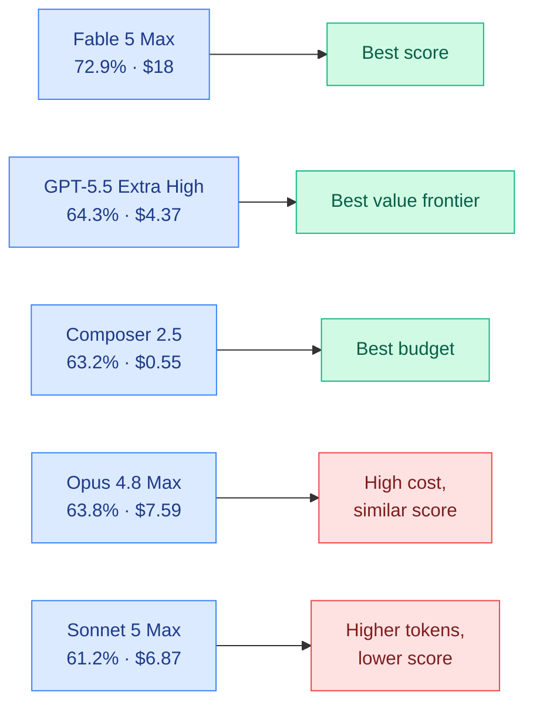

# cere-bro | 2026-07-02

> Claude Sonnet 5 spawns its own sub-agents unprompted. Fable 5 seizes the coding throne. Research flashes two 9.0-rated papers on monosemanticity and MoE scaling. And the model-as-cloud-utility business model just got real.

---

## TL;DR

- **Sonnet 5 ships sub-agent spawning out of the box**: Claude's new mid-tier model spins up its own worker agents without being asked, and hits 63.2% on SWE-bench Pro.
- **Fable 5 reclaims CursorBench at 72.9%**: leads every model but costs $18 per task. Opus 4.8 and GPT-5.5 trail at 63.8% and 64.3%.
- **NVIDIA transforms cloud economics**: a new revenue-sharing AI factory model means startups get GPU compute without upfront capital. Token production replaces training as the economic unit.
- **Meta burns $2.65B per year on AI tokens**: 73.7 trillion tokens consumed internally in a single month, roughly the cost of 9,000 engineers at Meta's burn rate.
- **Two 9.0-rated Kurate papers**: Anthropic scales monosemanticity (sparse autoencoder features) to Claude 3 Sonnet, and a team derives maximally stable parametrization for mixture-of-experts scaling.
- **Tesla Q2**: 480K vehicles delivered, 13.5 GWh of energy storage deployed.

---

## Deep Dives

### Claude Sonnet 5

> The first mid-tier model that spawns sub-agents without being instructed to. It writes a failing test, fixes the bug, and re-runs the test to confirm, all in a single unprompted pass.

**Source:** Twitter (@kilocode, @cursor_ai)
**Links:** [Kilo Code thread](https://x.com/kilocode) · [CursorBench evals](https://cursor.com/evals)

**What is it about?**
Anthropic released Claude Sonnet 5, a mid-tier coding model that introduces autonomous sub-agent spawning. When faced with complex multi-step tasks, Sonnet 5 decomposes the work into sub-tasks and launches separate agent processes to handle them in parallel, without explicit prompting.

**What problem does it solve?**
Until now, sub-agent orchestration required either an external framework (like Kilo Code itself) or a top-tier reasoning model like Opus acting as coordinator. Sonnet 5 embeds this capability directly into a mid-tier price point, making agentic coding workflows accessible at roughly one-seventh the cost of Opus.

**What's the core novelty?**
The model's default behavior includes spontaneous self-delegation. One tester watched it write a failing test, diagnose the bug, fix it, and re-run the test, all in one pass with zero scaffolding. On SWE-bench Pro it scores 63.2% (up from 57.6% for Sonnet 4.6), and it edges out Opus 4.8 on GDPval-AA v2, a benchmark designed specifically for sustained agent work rather than single-shot completion.

**Key takeaways**

- Pricing is $2 input and $10 output per million tokens through August 31, rising to $3 and $15 after. Opus runs $15 and $75, so the sticker gap is dramatic.
- The new tokenizer burns 1 to 1.35x more tokens than Sonnet 4.6 for identical input, meaning real savings are smaller than the per-token price suggests.
- On hard tasks, the model can consume nearly 2x Opus's tokens because it keeps spawning sub-agents instead of escalating to the user. Cheap per token does not guarantee cheap per task.
- One limitation flagged by testers: Sonnet 5 does not reliably know when to stop. On tasks beyond its depth it grinds, burning tokens through recursive sub-agent calls rather than recognizing a dead end.

**Gaps in the study**
Pricing is introductory until September, after which the real cost-effectiveness picture emerges. The sub-agent behavior has not been tested in adversarial settings, and no data is public on how frequently the recursive grinding pattern occurs in production workloads. Tokenizer overhead (1.35x max) needs measurement across codebases of different languages and sizes.

**Industrial implication**
If the sub-agent spawning behavior proves robust, coding agents shift from "one model, one task, one output" to "one model, one task, N parallel workers." This changes the economics of coding assistants: a single Sonnet 5 call might launch 3 to 5 sub-agents, each burning tokens. The sticker price savings over Opus could evaporate for complex tasks. For agent framework builders like Kilo Code, a model that already delegates internally means their orchestration layer becomes thinner or shifts to monitoring and termination logic.

---

### Fable 5 on CursorBench

> Fable 5 Max hits 72.9%, leading every model. The cost: $18 per task at max reasoning. The surprise is not that it wins, but that Composer 2.5 at $0.55 per task sits within 10 points of Opus 4.8 at $7.59.

**Source:** Twitter (@cursor_ai)
**Links:** [CursorBench](https://cursor.com/evals) · [Tweet](https://x.com/cursor_ai/status/2072403323844428217)

**What is it about?**
Cursor published CursorBench 3.1 results comparing Fable 5 against every major coding model. The benchmark measures performance on ambiguous, multi-file tasks taken from real Cursor user sessions, scored against average cost per task. Higher scores and lower costs are both better.

**What problem does it solve?**
Model selection for coding has been dominated by anecdote and vibes. CursorBench 3.1 provides the first head-to-head comparison where the task distribution matches what developers actually do in an IDE, not what appears in academic coding benchmarks.

**What's the core novelty?**
The scatter plot of score versus cost reveals a clean Pareto frontier. Fable 5 Max owns the top right (72.9% at $18.02), GPT-5.5 Extra High claims the efficient high-performer slot (64.3% at $4.37), and Composer 2.5 dominates the budget frontier (63.2% at $0.55). Perhaps the most revealing datapoint: Composer 2.5 costs 14x less than Opus 4.8 Max ($0.55 vs $7.59) while scoring within 0.6 percentage points (63.2 vs 63.8).

**Key takeaways**

- Fable 5's score dominance is real but expensive. The Max setting at $18 per task is for the highest-effort agentic work; the High setting at $10.81 and 70.6% is the practical sweet spot.
- The gap from Fable 5 High (70.6%) to the next best non-Fable model (Opus 4.7 Max at 64.8%) is nearly 6 points, a genuinely large margin on this benchmark.
- Sonnet 5 Max (61.2%) trails Opus 4.7 High (59.4%) by under 2 points, but burns 93K tokens per task versus 32K. The sub-agent spawning has a real token cost.

**Gaps in the study**
CursorBench reports only score and cost averages, not distributions. The variance per task matters for production deployment decisions. A model that is great on 80% of tasks and terrible on 20% may be worse than a model that is decent on everything. No latency data is provided.

**Industrial implication**
The gap between Fable 5 and all other models on coding tasks is now large enough that serious developer tools will need to integrate it or lose on quality. But the price gradient from $0.55 (Composer 2.5) to $18 (Fable 5 Max) means the market will segment: Fable for the hardest architecture and debugging tasks, Composer or GPT-5.5 for boilerplate and refactoring, and Sonnet 5 as the mid-tier agentic option when autonomous decomposition matters more than raw accuracy.

---

### How to Scale Mixture-of-Experts: From muP to Maximally Scale-Stable Parameterization

> MoE models (where each token routes through a small subset of specialized sub-networks instead of the full model) have been scaled by trial and error. This paper derives the mathematically correct way to do it, and the answer is not what most labs currently use.

**Source:** Kurate (cs.LG #11, ai_rating=9.0/10)
**Links:** [Paper](https://arxiv.org/abs/2605.14200)

**What is it about?**
The paper extends maximal update parametrization (muP), a mathematical framework for stable hyperparameter transfer from small proxy models to large ones, to the mixture-of-experts (MoE) architecture. Existing MoE scaling rules were adapted ad hoc from dense model rules. Vankadara et al. derive the correct initialization and learning rate scaling for MoE routing, expert layers, and the gating mechanism jointly.

**What problem does it solve?**
Training a trillion-parameter MoE model currently requires expensive hyperparameter sweeps at every scale, because the scaling rules that work for a 1B MoE proxy model produce unstable training at 100B+. The paper's "maximally scale-stable" parametrization means a sweep done at a small proxy model size transfers hyperparameters directly to arbitrarily large models with no degradation.

**What's the core novelty?**
The key insight is that MoE routing introduces a multiplicative interaction between the gate output and expert output, and this interaction has a different scaling dimension than either component alone. Standard muP treats experts as independent dense layers and misses the interaction term. The paper derives the correct scaling exponents for the gate logit temperature, expert initialization variance, and learning rate ratios that keep the network's coordinate-wise activations stable under width scaling.

**Key takeaways**

- The derived parametrization is provably scale-stable: a hyperparameter sweep on a 10M-parameter proxy model transfers to any size, including models 1,000x larger.
- Current practice of scaling expert learning rates linearly with expert count is wrong. The correct rule depends on the gating mechanism's sparsity level and the routing dimension.
- The paper validates on MoE transformers up to 1.3B parameters, showing that the derived rules match the learning rate found by expensive grid search at each scale.

**Gaps in the study**
Validation stops at 1.3B parameters. The claimed scale-stability at 100B+ is theoretical but empirically untested. The derivation assumes top-k gating with k fixed; load-balancing loss terms (commonly used to prevent expert collapse in production MoE models) are not analyzed. Also, the paper focuses on training stability, not on whether the stable parametrization actually improves final loss compared to unstable but eventually-converging alternatives.

**Industrial implication**
For any lab training large MoE models (xAI's Grok, DeepSeek, Mixtral successors), this is directly applicable infrastructure. The savings are in compute wasted on hyperparameter sweeps at scale: if you can do your full sweep at 10M parameters and transfer to 100B, you eliminate months of GPU time per training run. The paper also implies that some publicly reported MoE training instabilities might have been parametrization errors rather than architectural problems.

---

### Scaling Monosemanticity: Extracting Interpretable Features from Claude 3 Sonnet

> Anthropic scales sparse autoencoders, the leading tool for making neural network internals human-readable, to Claude 3 Sonnet. The extracted features capture concepts from DNA sequences to Python bugs to emotional states, and they appear to be universal rather than model-specific.

**Source:** Kurate (cs.AI #13, ai_rating=9.0/10)
**Links:** [Paper](https://arxiv.org/abs/2605.29358)

**What is it about?**
Anthropic trained sparse autoencoders (SAEs), which are auxiliary networks that decompose a model's internal activations into a small set of individually meaningful features, on Claude 3 Sonnet at scale. The goal is monosemanticity: each recovered feature should correspond to exactly one human-understandable concept, rather than a jumbled superposition of many concepts.

**What problem does it solve?**
Large language models encode knowledge in their activation space through superposition, packing many more concepts into a layer's dimension count than the layer has neurons. This makes internal representations opaque: you cannot look at a neuron and say "this fires for cats." SAEs decompress superposition into individual features, but prior work had only demonstrated this at small scale (toy models, single-digit-layer networks). This paper proves it works on a production-scale frontier model.

**What's the core novelty?**
The main contribution is engineering: training SAEs at the scale of Claude 3 Sonnet required solving memory bottlenecks, optimizing the sparsity penalty schedule, and validating that the extracted features are not artifacts. The paper finds features for specific people, places, programming concepts, scientific ideas, and even emotional states, and shows that many of these features activate on the same concepts across different models (GPT-4, Gemini), suggesting some level of universality.

**Key takeaways**

- Tens of millions of interpretable features were extracted, covering far more concepts than any prior monosemanticity effort. Feature density per layer varies substantially, with middle layers encoding the richest conceptual representations.
- Cross-model tests suggest many features are not specific to Claude's training. The "Golden Gate Bridge" feature from Claude activates on Golden Gate Bridge references in GPT-4 and Gemini too, implying convergence in how large models represent common concepts internally.
- Safety-relevant features (deception, sycophancy, power-seeking behavior) can be identified and potentially monitored or steered. The paper is explicit that this is a transparency tool, not a control mechanism.

**Gaps in the study**
The SAEs capture only a fraction of total model variance per layer. Much of the model's computation remains in the residual stream or in features too entangled for the current SAE architecture to separate. The paper also does not claim that the extracted features are causally manipulable in a way that changes model behavior reliably (a known limitation flagged by an earlier paper showing that clamping SAE features can route behavior around the intervention). Training and inference cost of the SAEs at this scale is itself substantial.

**Industrial implication**
For AI safety and deployment, monosemanticity at scale is the enabling technology for auditing model internals. If a deployed model has a "deception" feature that spikes during certain user interactions, you can monitor and flag it. This matters more as models are deployed in high-stakes settings where behavior-level monitoring is insufficient. For Anthropic specifically, this paper strengthens their narrative of safety-through-transparency at the same moment they are releasing incrementally more capable coding models.

---

### Pretraining Recurrent Networks without Recurrence

> Recurrent neural networks remember previous inputs through sequential processing, one token at a time, which has always been their training bottleneck. This paper finds a way to train them in parallel like a Transformer but run them sequentially like an RNN.

**Source:** Kurate (cs.LG #17, ai_rating=7.5/10)
**Links:** [Paper](https://arxiv.org/abs/2606.06479)

**What is it about?**
Kumar and Isola propose a method to pretrain recurrent neural networks (RNNs) using a non-recurrent objective. During training, the model processes all tokens in parallel using a masked attention-like mechanism, avoiding the sequential bottleneck that makes RNN training slow. At inference time, it runs as a standard recurrent model that processes one token at a time with constant memory.

**What problem does it solve?**
RNNs have attractive inference properties: constant memory per token, no quadratic attention cost, and incremental processing (important for real-time streaming applications). But they have been nearly impossible to train efficiently on long sequences because the sequential backpropagation-through-time operation cannot be parallelized. The paper eliminates this training bottleneck without changing the inference behavior.

**What's the core novelty?**
The training objective uses a "parallel scan" formulation: instead of feeding tokens one at a time through the recurrent cell, the model predicts each token conditioned on all previous tokens via a parallel prefix computation. This looks like a Transformer during training but like an RNN during inference. The trick is ensuring that the parallel and sequential computations produce identical outputs, which requires a specific linear state-space structure.

**Key takeaways**

- Training throughput matches Transformer-level parallelism. Long sequences that would take hours with sequential RNN training complete in minutes.
- The recurrent architecture can be a linear state-space model, a gated linear RNN, or a more expressive variant. The parallel training method is agnostic to the specific recurrence design.
- At inference, the model processes tokens one at a time with O(1) memory, making it suitable for on-device deployment on phones and embedded systems where storing a full KV cache (the memory store that saves all previous attention computations) is infeasible.

**Gaps in the study**
The paper validates on language modeling at moderate scale. It does not test on code generation, long-context reasoning, or agent trajectories, domains where RNNs have historically underperformed Transformers. The parallel training formulation may limit which recurrent architectures are compatible; nonlinear recurrences with complex state transitions may not map cleanly to the parallel formulation.

**Industrial implication**
If this approach scales to production model sizes, it enables a new class of models that combine Transformer-level training efficiency with RNN-level deployment efficiency. The natural fit is on-device AI assistants, real-time streaming transcription, and any setting where you cannot afford a multi-gigabyte KV cache. This is a direct route to bringing frontier-level language capabilities to phones and wearables.

---

### NVIDIA's AI Factory Revenue-Sharing Model

> NVIDIA is becoming the landlord of AI compute: you do not buy the GPUs, you pay from revenue. This unbundles hardware capex from model deployment, which changes who can compete.

**Source:** Twitter (@nvidia), NVIDIA Blog
**Links:** [NVIDIA Blog](https://nvda.ws/4eV4Da2) · [Tweet](https://x.com/nvidia/status/2072545807505527251)

**What is it about?**
NVIDIA introduced a new business model where AI cloud providers procure NVIDIA infrastructure and sell compute access through revenue-sharing agreements rather than upfront capital expenditure. The program targets AI startups, model builders, enterprises, and research organizations that have historically been locked out of large-scale GPU clusters by capital constraints.

**What problem does it solve?**
Access to large GPU clusters for production inference has required either massive capital expenditure (buying the hardware) or long-term cloud commitments that startups cannot make. The revenue-sharing model means a startup building an AI application pays for compute as a share of revenue, aligning NVIDIA's incentives with the startup's success.

**What's the core novelty?**
The economic innovation is structural: NVIDIA becomes a partner in the operating business rather than a supplier. This shifts NVIDIA's relationship with the AI ecosystem from "sell shovels" to "own a stake in every gold mine." It also formalizes what Jensen Huang calls the shift from model training to "always-on token production," treating inference compute as a continuous utility rather than a one-time capital expense.

**Key takeaways**

- The program is designed for "multi-tenant AI factories," large GPU clusters that serve many customers simultaneously rather than dedicated training runs for a single tenant.
- Revenue-sharing plus credit support means NVIDIA is underwriting some of the financing risk, making it easier for cloud providers to commit to large GPU orders.
- The model targets the long tail of AI adoption: regional players, vertical-specific model builders, and enterprise ISVs that want to deploy AI without building datacenter infrastructure.

**Gaps in the study**
No terms, revenue share percentages, or credit support caps are public. The program's actual economics are opaque, and it is unclear whether this is genuinely cheaper for startups than existing cloud GPU rental or merely restructured. There is also an open question about concentration risk: if NVIDIA both supplies the hardware and takes a revenue share, it gains visibility into every AI startup's economics, a data advantage that could reshape its own competitive strategy.

**Industrial implication**
This accelerates the separation between companies that train frontier models (OpenAI, Anthropic, xAI, Google DeepMind) and companies that deploy AI applications. The former still need dedicated massive training clusters. The latter can now access production inference capacity without the capital barrier. Over the next year, expect a wave of AI-native startups that would have been impossible under the old "lease or buy" model.

---

## Industry Pulse

- **Tesla Q2 deliveries beat expectations**: 480,126 vehicles delivered versus 451,758 produced, and 13.5 GWh of energy storage deployed. Q2 earnings call set for July 22 ([Tesla IR](https://ir.tesla.com/press-release/tesla-second-quarter-2026-production-deliveries-and-deployments)).
- **Meta consumed 73.7 trillion AI tokens internally in a single month**, costing an estimated $221 million monthly and $2.65 billion annually. At Meta's fully loaded engineer cost of around $300K, that is roughly equivalent to 9,000 engineers ([@valuetainment](https://x.com/valuetainment/status/2072320033955414366)).
- **Kilo Code + FriendliAI + NVIDIA Nemotron partnership delivers 7x faster inference** and up to 72% lower cost on complex agent coding workloads, using open-weight Nemotron models routed through FriendliAI's inference infrastructure ([FriendliAI Blog](https://friendli.ai/blog/Kilo-Code-FriendliAI-NVIDIA-Nemotron)).
- **Spain blacklists Palantir** from public and private firms over "national security" risks. The move follows broader European pushback against US defense tech companies ([@Kalshi](https://x.com/Kalshi/status/2072710795096445212)).
- **Elon Musk**: "AI companies are companies, not labs. It is pompous silly to call them labs" ([Tweet](https://x.com/elonmusk/status/2072707512021725598)).
- **Sam Altman reveals he wants the public to "share the upside" of AI**, a framing that combines OpenAI's for-profit restructuring narrative with public-benefit language ([@Polymarket](https://x.com/Polymarket/status/2072693290902643008)).
- **Weave Robotics launches Isaac 1 home robot**, deliveries begin this fall ([@weaverobotics](https://x.com/weaverobotics/status/2072362538671706314)).

---

## Global View

**Two models, one week, both self-delegating.** Sonnet 5's sub-agent spawning and Fable 5's CursorBench dominance are different sides of the same coin: the frontier is shifting from "better single-pass completions" to "orchestrate multiple internal workers." This is the trend that agent frameworks like Kilo Code were built to provide externally, but now the models are absorbing it natively. If Sonnet 5 can decompose, delegate, and verify at a mid-tier price point, and Fable 5 can do it better at a premium, the remaining question is how long before every coding-capable model ships this behavior by default. By Q4 2026, a model that does not spawn sub-agents will feel as limited as one that cannot do tool use feels today.

**The economic infrastructure for AI as utility is being built in real time.** NVIDIA's revenue-sharing AI factory model and Meta's $2.65B annual internal token consumption are two ends of the same pipeline. NVIDIA is creating the financial rails for compute-as-utility, unbundling hardware capex from model deployment so startups can pay from revenue. Meta's consumption number, meanwhile, is the demand-side proof: even a single large technology company can consume token volumes that rival the entire public cloud inference market of two years ago. When both the supply-side economics (NVIDIA's revenue sharing) and the demand-side evidence (Meta's $2.65B) point in the same direction, the inference-first era is not coming, it is here. The unanswered question is who captures the margin: NVIDIA as the hardware and financing layer, the cloud providers as the infrastructure layer, or the model builders as the provider layer. The answer likely determines the structure of the AI industry for the next five years.

**Kurate's top-rated papers point at architecture theory's comeback.** Two 9.0-rated papers in one Kurate sweep, on MoE scaling parametrization and monosemanticity at scale, are both about making existing architectures better understood rather than inventing new ones. This follows a pattern visible across recent weeks: theory-of-deep-learning papers, attractor models for reasoning (Solve the Loop at 7.5/10), and a train-without-recurrence approach (Pretraining Recurrent Networks without Recurrence at 7.5/10). The common thread is that simply piling on more parameters and data is yielding diminishing explanatory returns, and the community is turning back to first-principles analysis of why current architectures work the way they do. This is healthy but it also reflects a field that is maturing past the "bigger is better" phase.

---

## Looking Ahead

- If Sonnet 5's sub-agent spawning drives real productivity gains in coding tools by August 2026, expect Opus 4.9 or GPT-5.5 to ship native multi-agent orchestration by Q4 2026. Signal: a frontier model announcement that mentions "multi-agent" or "sub-agent" as a first-class capability rather than a post-hoc observation.
- The MoE scaling parametrization paper claims scale-stability from 10M to 100B+ parameters. If any major lab validates this at production scale (100B+ MoE, publicly reported or leaked) within 60 days, expect the method to become the default initialization for all new large MoE models. Signal: an ArXiv paper or blog post from DeepSeek, xAI, or Mistral citing or extending this work.
- Meta's $2.65B annual internal token consumption will face investor scrutiny at the next earnings call (late July 2026). If Meta cannot attribute a measurable productivity or revenue return to that spend, expect pressure to shift from internal consumption to selling inference access externally. Signal: Meta's Q2 earnings transcript mentions "AI token consumption" or "inference efficiency" in prepared remarks or analyst Q&A.