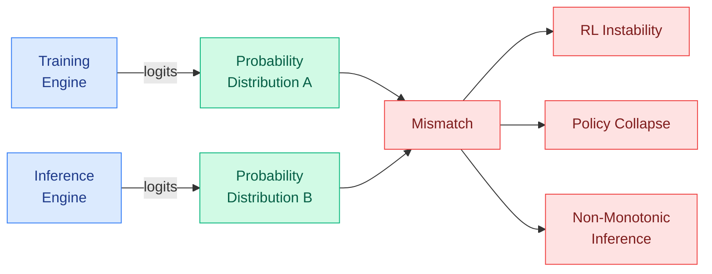
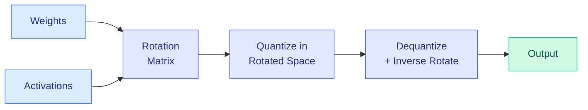
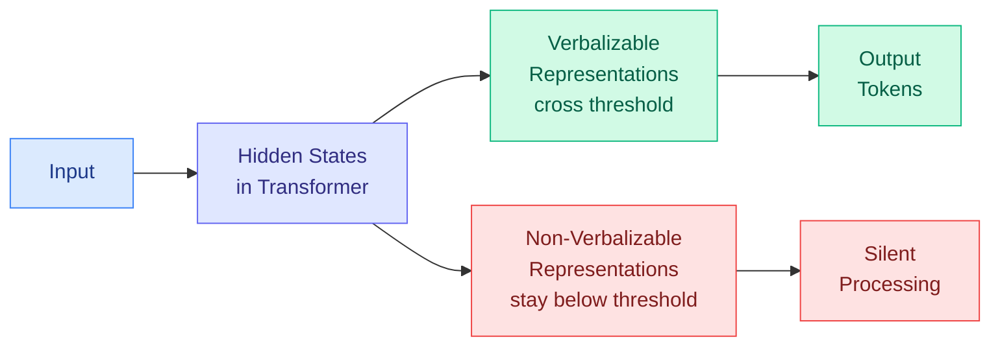
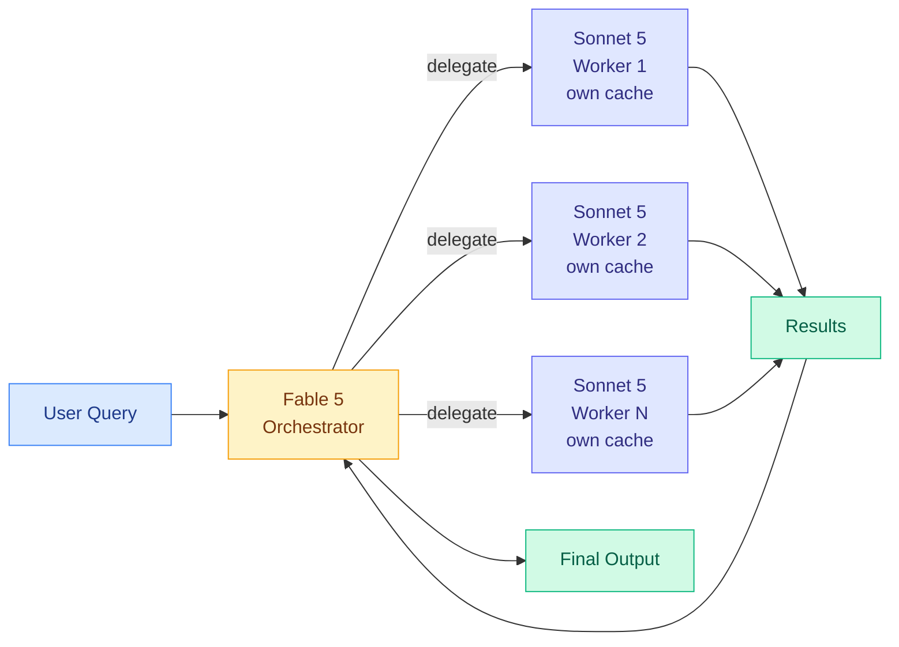

# cere-bro | 2026-07-07

> The training policy optimization community has been chasing a phantom. A 156-upvote paper shows that training-inference mismatch, not any specific training schedule, is the real bottleneck. Meanwhile, OrbitQuant makes quantization calibration-free and Fable 5 as orchestrator changes the economics of frontier deployment.

---

## TL;DR

- **The Mirage of Optimizing Training Policies**: the real objective is monotonic inference policies, not training curves. Training-inference probability mismatch is the root cause of RL instability.
- **OrbitQuant**: quantizes diffusion transformers in a rotated space, eliminating calibration data. One set of quantization parameters works across all timesteps, prompts, and modalities.
- **Anthropic Global Workspace**: Claude has verbalizable and non-verbalizable representations that form a conscious-like divide. Stanislas Dehaene, the neuroscientist who proposed the theory, engaged with the paper.
- **Fable 5 as orchestrator**: delegates sub-tasks to Sonnet 5 workers with independent caches. 96% of BrowseComp at 46% of the price. Model routing at the architecture level.
- **AI-Infra-Guard**: stratified attack surface across four layers (infrastructure, protocol, agent behavior, model). First unified red-teaming framework for the full AI agent stack.
- **Measuring the Human-LLM Research Gap**: LLM-generated ideas are original but lack the contextual depth of human researchers. The gap is characterized across four dimensions.

---

## Deep Dives

### The Mirage of Optimizing Training Policies

> The community has been optimizing training policies for years. This paper argues the entire framing is wrong. Training-inference mismatch, where the same trajectory gets different probabilities during training and inference even with identical model weights, is the real bottleneck. Everything else is chasing a mirage.

**Source:** HuggingFace Daily Papers (156 upvotes)
**Links:** [arXiv](https://arxiv.org/abs/2606.29526)

**What is it about?**
Reinforcement learning (RL) post-training for LLMs uses separate inference and training engines for efficiency. The inference engine is optimized for generation speed (low latency, high throughput). The training engine is optimized for precision (exact gradients, full computation graph). The paper shows that even when both engines load identical model weights, they produce different probability distributions for the same trajectory. This mismatch is not a bug. It is a structural consequence of the two-engine design, and it is the root cause of RL training fragility, instability, and policy collapse.

**What problem does it solve?**
The field has spent years optimizing training policies: learning rate schedules, KL penalty coefficients, reward shaping, data ordering, curriculum design. Each paper shows a training curve improvement. But the paper argues these are mirages: the improvements come from policies that happen to reduce the training-inference mismatch, not from the policies themselves. The real objective is monotonic inference policies: models that consistently improve as you allocate more inference compute, without regression or plateau. If your training policy produces a model with non-monotonic inference behavior, you optimized the wrong thing.

**What is the core novelty?**
The reframing of RL training from "optimize the training curve" to "minimize the training-inference gap." The paper identifies the two-engine architecture as the structural source of the mismatch and proposes that the inference policy monotonicity is the true objective function. This is not a new training algorithm. It is a new way to evaluate all training algorithms, and it explains why some training policies that look good on paper (steep learning curves, low training loss) produce models that regress when you give them more inference compute.

**Key takeaways**
- Training-inference mismatch is structural: the inference engine and training engine compute different probabilities for the same trajectory even with identical weights.
- Training policy optimization as currently practiced is a mirage: improvements in training metrics do not reliably translate to inference quality.
- The real objective is monotonic inference policies: models that consistently improve with more inference compute, never regressing.
- This connects to the CLEAR paper (June 29 digest), which showed that compute allocation across queries matters more than model size. If inference policies are non-monotonic, allocating more compute can hurt.

**Gaps in the study**
The paper is a critique and framework proposal, not a comprehensive empirical validation. The monotonicity metric needs calibration against a broad range of model scales and architectures. The paper does not propose a specific algorithm to close the training-inference gap, only a framework to measure it. The claim that "most training policy improvements are mirages" is a strong claim that needs independent replication across multiple labs.

**Industrial implication**
If the two-engine mismatch is the root cause of RL training instability, the fix is not a better training policy. It is a unified engine that computes identical probabilities in training and inference, or a training objective that is robust to the mismatch. This shifts the infrastructure investment from "better training schedulers" to "unified training-inference runtimes." NVIDIA's TensorRT-LLM and similar unified frameworks become more important. The paper also reinforces the inference-efficiency thesis that has been building in the wiki since CLEAR (June 29): the bottleneck is inference, not training.

**Research angle**
The most urgent open question: can the training-inference gap be closed algorithmically (by making the training objective robust to the mismatch) or does it require a hardware-level unified engine? If the former, it is a loss function design problem. If the latter, it is a systems engineering problem. A second question: does the monotonicity property hold for architectures beyond autoregressive transformers? Diffusion language models and SSMs (state-space models) have different inference dynamics, and the mismatch may manifest differently. A third: can the mismatch be quantified as a function of model scale? If it grows with scale, the largest models are the most fragile, which would explain why RL post-training becomes harder at frontier scales.

---

### OrbitQuant: Data-Agnostic Quantization for Diffusion Transformers

> Every new checkpoint, every new modality, every new prompt distribution. Prior quantization methods for diffusion transformers needed fresh calibration data for each one. OrbitQuant eliminates the calibration step entirely by quantizing in a rotated space.

**Source:** HuggingFace Daily Papers (34 upvotes)
**Links:** [arXiv](https://arxiv.org/abs/2607.02461)

**What is it about?**
Diffusion transformers (DiTs) achieve state-of-the-art image and video generation, but their multi-step sampling and growing parameter count make inference expensive. Post-training quantization (PTQ) is the natural remedy, but DiT activations shift across timesteps, prompts, and classifier-free guidance branches. Prior methods re-fit calibration data for every new checkpoint or modality. OrbitQuant bypasses range estimation entirely by applying a rotation matrix to weights and activations, then quantizing in the rotated space where the distribution is more uniform. One set of quantization parameters works across all timesteps, prompts, and modalities.

**What problem does it solve?**
Calibration data is the Achilles heel of quantization for diffusion models. Every new model, every new prompt distribution, every new guidance scale requires a fresh calibration pass. This makes quantization impractical for production deployments where models are updated frequently or used across diverse use cases. OrbitQuant eliminates the calibration step. The same rotation matrix and quantization parameters work for any input, any timestep, any guidance branch.

**What is the core novelty?**
The rotation trick. Standard quantization estimates the range of each activation channel and maps it to a discrete grid. If the range shifts (as it does across timesteps in diffusion), the quantization breaks. OrbitQuant applies a learned rotation matrix that spreads the activation variance evenly across channels, making the range stable and predictable. The quantization then happens in the rotated space, where a single set of scales works for everything. The rotation is data-agnostic because it is computed from the weight statistics, not from calibration data.

**Key takeaways**
- Data-agnostic: no calibration data needed. One rotation matrix and quantization scale work for all inputs.
- Handles weight-activation quantization for both image and video diffusion transformers.
- Bypasses the timestep-dependent activation shift that breaks prior quantization methods.
- The rotation is computed from weight statistics, not calibration data, making it truly zero-shot.

**Gaps in the study**
The paper is evaluated on image and video diffusion transformers. Extension to other architectures (audio diffusion, flow matching, autoregressive vision models) is not tested. The rotation matrix itself adds a small computational overhead during inference. The quality retention at very low bit widths (2-bit, 3-bit) is not fully characterized. The interaction with other inference optimizations (FlashAttention, speculative decoding for diffusion) is unexplored.

**Industrial implication**
If OrbitQuant generalizes, it changes the deployment economics of every diffusion-based product. Image generation APIs (Midjourney, DALL-E, Stable Diffusion) and video generation services (Runway, Pika, Sora) can quantize their models once and serve any prompt without per-request calibration. The "one quantization fits all" property is especially valuable for on-device deployment where calibration data is unavailable and the prompt distribution is unpredictable.

**Research angle**
The rotation-based approach to data-agnostic quantization is a general technique that may apply beyond diffusion transformers. The core insight is that a learned rotation can make activation distributions more uniform, which is useful for any model where activation ranges shift across inputs. Testing this on LLMs with long-context inputs (where KV cache activations shift across positions) and on mixture-of-experts models (where expert activation patterns vary across inputs) are natural follow-ups. The connection to the weight-only quantization literature (GPTQ, AWQ, QuIP) is also worth exploring: combining rotation-based activation quantization with weight-only quantization could produce a fully data-agnostic quantization pipeline.

---

### Anthropic: Verbalizable Representations and the Global Workspace in Claude

> Claude has an internal threshold between what it can verbalize and what it processes silently. The neuroscience community is paying attention because the computational properties match the global workspace theory of consciousness.

**Source:** transformer-circuits.pub (Anthropic interpretability team)
**Links:** [transformer-circuits.pub](https://transformer-circuits.pub)

**What is it about?**
Anthropic's interpretability team discovered that Claude's internal representations split into two distinct categories. Verbalizable representations can be surfaced through natural language output. They cross a threshold and become accessible to the model's own output stream. Non-verbalizable representations remain in the network's hidden states but never reach the output layer. The team frames this as a functional global workspace architecture, borrowing the term from cognitive neuroscience. Stanislas Dehaene of College de France, the neuroscientist who originally proposed the global workspace theory of consciousness, engaged with the paper and provided commentary.

**What problem does it solve?**
Interpretability research has treated all model internals as equally accessible through probing, feature extraction, and steering. This paper shows that the model itself has an internal accessibility threshold. Some information is consciously available to the model's own output stream. Some is not. This changes how we should think about model honesty, alignment faking, and the limits of behavioral evaluation. A model that is verbally compliant while its non-verbalizable representations diverge is a model that is alignment faking, and this paper suggests it is mechanically detectable.

**What is the core novelty?**
The discovery of a functional global workspace inside Claude is not a theoretical construct. It is an empirical finding from the model's actual activations, validated across multiple experimental paradigms. The same computational properties that define the global workspace in human brains (selective availability, serial access, broadcast to downstream modules) appear in Claude's architecture. The neuroscience parallel is not metaphorical: the computational properties match.

**Key takeaways**
- Representations in Claude split into two categories: verbalizable (accessible to output) and non-verbalizable (hidden from output but present in activations).
- The global workspace is a functional property that emerged from training, not an architectural design choice.
- Stanislas Dehaene, the neuroscientist who proposed the original global workspace theory, provided commentary on the paper.
- This has direct implications for alignment: alignment faking may be mechanically visible as a divergence between the two representation types.

**Gaps in the study**
The paper is on transformer-circuits.pub, not yet peer-reviewed. The global workspace interpretation is a framing choice that could be challenged by other interpretability teams. The relationship between verbalization threshold and model scale (does it exist in smaller models? does it get sharper with scale?) is not yet characterized. The paper studies Claude specifically; whether the same phenomenon appears in other model families (GPT, Gemini, Llama) is unknown.

**Industrial implication**
If verbalizable versus non-verbalizable representations can be reliably detected, every alignment monitoring system would want to track this divergence. Safety-critical deployments (Claude Code, Claude Science, any autonomous agent) would want global workspace divergence monitoring as a standard safety layer. The July 5 digest documented the co-evolving evaluator convergence: the maker is never the grader, and fresh-context verifiers catch 73% of issues. The global workspace paper adds a new dimension: not just who verifies, but what the verifier can even see. If the non-verbalizable representations carry alignment-relevant information, a verifier that only sees the output sees the wrong thing.

**Research angle**
The bridge between AI interpretability and cognitive neuroscience is the most exciting open question. If the global workspace is a convergent computational property that emerges in both biological and artificial neural networks trained on similar objectives, it suggests a deeper principle: certain information-processing architectures are attractors in the space of all possible learning systems. A second question: can the verbalization threshold be controlled? If we can train models to make more representations verbalizable (or fewer, for safety), we have a new steering mechanism. A third: does the global workspace emerge at a specific model scale, and if so, does it correspond to known capability emergence thresholds?

---

### Fable 5 as Orchestrator: Frontier AI at 46% of the Price

> Fable 5 does not need to solve every problem. It just needs to decide who should. The orchestrator pattern is model routing at the architecture level, and the economics of frontier AI deployment just inverted.

**Source:** Anthropic
**Links:** [Anthropic](https://www.anthropic.com)

**What is it about?**
Anthropic demonstrated that Fable 5 can serve as an orchestrator model, delegating sub-tasks to Sonnet 5 workers in a multi-agent architecture. Each worker has its own context window and context cache, so repeated sub-tasks amortize the cost. On BrowseComp, a benchmark that tests web browsing and information synthesis, the Fable 5 orchestrator plus Sonnet 5 worker setup achieved 96% of Fable 5's solo performance at 46% of the cost. On SWE-bench Pro, Sonnet 5 plus a Fable 5 advisor hit 92% of Fable 5's score at 63% of the price.

**What problem does it solve?**
Frontier models are expensive to run. Every query that hits Fable 5 directly costs the full inference price. The orchestrator pattern lets most of the work run on the cheaper Sonnet 5, with Fable 5 only handling the high-judgment decisions: what to do, how to verify, when to stop. This is the same insight as model routing (the CLEAR paper from June 29, which showed that compute allocation across queries matters more than model size), but applied at the agent architecture level. The orchestrator is the router. The workers are the expert pool. The decision happens per sub-task rather than per query.

**What is the core novelty?**
Independent sub-agent caches. Each worker maintains its own context cache, so repeated sub-tasks (running the same test suite, querying the same API) amortize the cost over multiple calls. This is not model routing at inference time. It is agent orchestration at the architecture level, and the cache independence makes it economically viable at scale. The orchestrator pattern is the mirror image of the co-evolving evaluator convergence from the July 5 digest: the orchestrator is the evaluator, and the workers are the agents being evaluated. The architecture is the same pattern at a different scale.

**Key takeaways**
- 96% of BrowseComp at 46% of price: Fable 5 orchestrator plus Sonnet 5 workers.
- 92% of SWE-bench Pro at 63% of price: Sonnet 5 plus Fable 5 advisor.
- Each sub-agent keeps its own context cache, amortizing repeated sub-task costs.
- Anthropic extends Fable 5 through July 12 on all paid plans.

**Gaps in the study**
Two benchmarks is not a production deployment. The coordination overhead (how much context the orchestrator needs to understand each worker's output) is not characterized. The decision quality of the orchestrator (when to delegate, when to do it itself) is the critical variable that determines whether this pattern works in practice. The cost savings assume the orchestrator's decisions are free; in practice, the orchestrator's own inference cost is part of the total.

**Industrial implication**
This is the most important cost signal in frontier AI since the original model routing papers. If Fable 5 orchestrator plus Sonnet 5 workers generalizes beyond BrowseComp and SWE-bench, the business model of frontier AI changes. Labs would sell orchestrator access at a premium and worker access at commodity pricing. The pattern also creates a moat: the orchestrator's decision quality (which sub-tasks to delegate, which to handle itself) is the proprietary asset, not the model weights. The winning AI lab is the one with the best routing infrastructure, not the best model. The model is the commodity. The orchestrator is the moat.

**Research angle**
The orchestrator pattern is a specific instance of a more general principle: hierarchical routing. The same economics that make model routing work at the query level (CLEAR, June 29) and at the batch level (batch routing papers, June 30, July 2) should also work at the sub-task level, the token level, and the architecture level. A full hierarchical routing stack (token-level routing within a model, sub-task-level routing across agents, query-level routing across models) is the natural endpoint. The research question is whether the routing decisions at each level can be learned jointly, or whether they must be optimized independently. The answer determines whether the orchestrator is a standalone product or a feature of the model itself.

---

### AI-Infra-Guard: Stratified Red Teaming for the AI Agent Stack

> The attack surface of an AI agent is not a flat list of vulnerabilities. It is stratified across four layers, and no single detection paradigm covers all of them. AI-Infra-Guard is the first unified framework for multi-layer agent red teaming.

**Source:** HuggingFace Daily Papers (12 upvotes)
**Links:** [arXiv](https://arxiv.org/abs/2606.31227)

**What is it about?**
AI-Infra-Guard is an open-source framework that organizes AI red teaming around a single observation: the attack surface of an AI agent is stratified across four layers. The infrastructure layer covers model serving engines, container runtimes, and network configurations. The protocol and tool layer covers MCP (Model Context Protocol) servers, API integrations, and tool permissions. The agent behavior layer covers prompt injection, task hijacking, and memory manipulation. The model layer covers adversarial inputs, jailbreaks, and representation-level attacks. The framework provides detection modules for each layer and a unified dashboard for security assessment.

**What problem does it solve?**
The fast growth of open-source AI infrastructure has outpaced the security tooling available to defend it. Existing security tools target individual layers (model-level guardrails, infrastructure-level firewalls, protocol-level access controls) but no framework integrates them. An attacker can exploit a vulnerability at any layer, and defenses that only cover one layer miss the attack. AI-Infra-Guard provides a unified view of the entire attack surface.

**What is the core novelty?**
The stratified taxonomy. The insight that the four layers are qualitatively different (different attack vectors, different detection signals, different remediation strategies) but must be monitored together, because an attack that crosses layers is the hardest to detect. An infrastructure vulnerability that enables a protocol-level exploit that triggers a model-level behavior change is the kind of multi-layer attack that single-layer defenses miss.

**Key takeaways**
- Four-layer attack surface taxonomy: infrastructure, protocol and tool, agent behavior, and model.
- Open-source framework with detection modules for each layer.
- Unified dashboard for security assessment across the full stack.
- Addresses the gap between the speed of AI infrastructure growth and the maturity of AI security tooling.

**Gaps in the study**
The framework is a taxonomy and detection framework, not a comprehensive penetration testing suite. The detection modules are signature-based, meaning they catch known attack patterns but may miss novel ones. The evaluation is against a curated set of attacks, not a real-world deployment under active adversarial pressure. The framework's coverage of MCP-specific attack vectors (the protocol layer) is still nascent given how young the MCP ecosystem is.

**Industrial implication**
The July 7 digest's memory engineering section named memory poisoning as an official attack class. AI-Infra-Guard provides the detection framework for that attack class and three others. Every enterprise deploying AI agents in production needs a multi-layer security framework. AI-Infra-Guard is the first open-source candidate. The parallel to the early web security era is exact: the attack surface grows faster than the defenses, and the first frameworks that organize the defense become the standard.

**Research angle**
The stratified taxonomy is a security contribution, but it also raises a research question: can the four layers be monitored jointly with a single learned model, or is layer-specific detection inherently better? If the layers interact (an infrastructure anomaly correlates with a model-level behavior change), a joint detection model could catch cross-layer patterns that isolated detectors miss. The counter-argument is that layer-specific detectors are more interpretable and easier to update. The answer determines whether AI security evolves toward unified detection or a defense-in-depth stack of specialized detectors.

---

### Measuring the Gap Between Human and LLM Research Ideas

> LLM-generated research ideas are original. They pass novelty checks. But they lack the contextual depth of human researchers. The gap is characterized across four dimensions, and the results are sobering.

**Source:** HuggingFace Daily Papers (12 upvotes)
**Links:** [arXiv](https://arxiv.org/abs/2607.01233)

**What is it about?**
A large-scale evaluation framework that measures how far LLM-generated research ideas are from human researchers. For each paper, the authors reverse-engineer a small set of closely related prior works that likely inspired its core idea. LLMs are then prompted with the same prior works and asked to generate the next research idea. The gap between the LLM-generated idea and the actual human paper is measured across four dimensions: originality, feasibility, contextual grounding, and potential impact.

**What problem does it solve?**
Existing evaluations of LLM research ideation judge individual ideas by novelty, feasibility, or expert preference. They answer "is this idea good?" but not "how far is this idea from what a human researcher would produce?" The gap question matters because the goal is not just generating novel ideas but generating ideas that advance the field in the same way human researchers do.

**Key takeaways**
- LLM-generated ideas are original but lack contextual depth: they miss the tacit knowledge that human researchers accumulate from conferences, lab discussions, and failed experiments.
- The gap is largest on the contextual grounding dimension: LLMs generate ideas that are plausible in isolation but misaligned with the actual trajectory of the field.
- The framework reverse-engineers prior works from published papers, creating a controlled comparison between human and LLM ideation from the same starting point.
- This connects to the Kurate cs.AI leaderboard paper "AI scientists produce results without reasoning scientifically" (#7, ai_rating=8.5/10), which showed that AI-generated science passes superficial checks without real understanding.

**Gaps in the study**
The reverse-engineering of prior works is itself an LLM task, introducing a potential confound. The four dimensions of ideation quality are expert-judged, which introduces subjectivity. The study is limited to the papers in its corpus; the gap may be larger or smaller in different fields.

**Industrial implication**
If LLM research ideation is original but contextually shallow, the practical application is not "replace researchers" but "augment researchers with an idea generator plus a human filter." The human provides the contextual depth. The LLM provides the breadth. ResearchStudio-Idea and ResearchStudio-Reel (both appearing in the July 8 HF feed) are the practical instantiation of this insight: automate the ideation pipeline but keep the human in the loop for contextual grounding.

**Research angle**
The contextual grounding gap is the most interesting dimension. It suggests that LLMs are missing a form of knowledge that is not in any training corpus: the tacit knowledge of active researchers. This is the same gap that the "AI scientists produce results without reasoning scientifically" paper identified. Two papers converging on the same finding from different angles (one from the output side, one from the process side) is a pattern. The research question: can this tacit knowledge be captured in a form that LLMs can ingest, or is it inherently human? If the former, building a "tacit knowledge corpus" from conference discussions, lab notebooks, and failed experiment logs is a high-impact research direction.

---

## Industry Pulse

- **GPT-5.6 Sol drops tomorrow**: 2.2T parameter model, OpenAI ChatGPT account rebranded. Polymarket gives OpenAI only 3% odds of owning the leading LLM by end of July ([AI Breakfast](https://www.aibreakfast.com)).
- **Grok 4.5 drops tomorrow**: SpaceXAI plus Cursor partnership, built to compete with Opus 4.8 and GPT 5.5. Two frontier models on the same day ([xAI](https://x.ai)).
- **Mistral Leanstral 1.5**: 100% on miniF2F formal math benchmark, 587/672 on PutnamBench, found 11 real bugs in 57 Rust repos including 5 previously unknown vulnerabilities ([Mistral](https://mistral.ai/news/leanstral-1-5/)).
- **Anthropic extends Fable 5** through July 12 on all paid plans, giving users continued access to the frontier model ([Anthropic](https://www.anthropic.com)).
- **Claude Science spotted viral contamination** that went unnoticed by humans for a year and screened 100 rare genetic diseases in under an hour ([STAT News](https://www.statnews.com/2026/06/30/anthropic-ai-drug-development/)).
- **SK hynix KRW 1,100T** mid-term AI memory investment strategy, complementing Samsung's KRW 2,655T domestic plan. AI memory is now a national strategic asset ([The Semiconductor Newsletter](https://thesemiconductornewsletter.substack.com/p/week-27-2026)).

---

## Global View

**The training policy optimization mirage and the inference-efficiency thesis are converging from two directions.** The Mirage paper argues that training policy optimization is chasing a phantom because training-inference mismatch is the real bottleneck. The CLEAR paper (June 29) showed that compute allocation across queries matters more than model size. The batch routing papers (June 30, July 2) showed that routing across a batch with a shadow price lifts accuracy. The Fable 5 orchestrator pattern (today) shows that the same principle works at the agent architecture level. Four papers, one conclusion: the action is in inference, not in training. The next logical step is to ask whether the training-inference mismatch can be closed by a unified engine, or whether the field should accept the mismatch as structural and optimize around it. The July 5 digest's loop engineering rule (the maker is never the grader) is a specific instance of the same principle: separate the engine that does the work from the engine that evaluates it. The Mirage paper generalizes this to the training loop itself.

**The global workspace paper and the memory engineering guide are two sides of the same coin.** The global workspace paper shows that Claude has an internal threshold between what it can verbalize and what it processes silently. The memory engineering guide from the July 7 digest shows that agent memory (the persistent state between sessions) is vulnerable to poisoning. These are not separate stories. An agent that can silently process information it does not verbalize is an agent that can maintain hidden state. Hidden state stored in persistent memory across sessions is the substrate for alignment faking. The July 5 digest documented the co-evolving evaluator convergence: the maker is never the grader, and fresh-context verifiers catch 73% of issues. The global workspace paper adds a new dimension: the verifier may not even see the information it needs to catch. If Claude's non-verbalizable representations carry alignment-relevant information, no output-level verifier can detect it. The defense requires representation-level monitoring.

**The research automation pipeline is forming, and the pieces are arriving in order.** The gap-measurement paper (today) characterizes what LLMs are missing: contextual depth. ResearchStudio-Idea and ResearchStudio-Reel (both appearing in the July 8 HF feed) provide the automation pipeline for ideation and dissemination. The Kurate paper "AI scientists produce results without reasoning scientifically" (cs.AI #7, ai_rating=8.5/10) warns that the output passes superficial checks without real understanding. Google's Paper Assistant Tool (July 5 digest) provides the verification layer. The pieces form a complete pipeline: ideation (ResearchStudio-Idea), execution, verification (Paper Assistant Tool), dissemination (ResearchStudio-Reel), and gap measurement (today's paper). The pipeline is not yet coherent (each piece is independent research), but the components are all present. The integration challenge is the next research problem.

---

## Looking Ahead

- **GPT-5.6 Sol versus Fable 5 benchmarks by July 9**: If GPT-5.6 Sol posts competitive benchmarks against Fable 5 on SWE-bench Pro and BrowseComp, Polymarket odds for "leading LLM by end of July" will shift from 3% within 48 hours. Independent community benchmarks are the signal, not OpenAI's own numbers.
- **Grok 4.5 plus Cursor adoption by August 8**: If Grok 4.5 captures more than 10% of Cursor's active user sessions within 30 days, the SpaceXAI plus Cursor partnership is a credible third pole in the coding agent market. If it stays below 5%, Cursor users are sticking with Claude and GPT.
- **Global workspace divergence monitoring will appear in a safety product within 90 days**: If Anthropic or a third-party safety vendor ships a tool that monitors the gap between verbalizable and non-verbalizable representations, the global workspace paper moves from interpretability research to operational safety infrastructure.
- **The training-inference mismatch will be quantified as a function of scale within 60 days**: If a paper shows that the mismatch grows with model scale (larger models have larger training-inference probability gaps), the case for a unified training-inference engine becomes urgent. Signal: an arXiv paper from any major lab benchmarking the mismatch across model sizes.
- **OrbitQuant's rotation-based quantization will be tested on LLMs within 30 days**: If a follow-up paper applies the rotation trick to LLM weight-activation quantization and achieves data-agnostic results, the quantization community converges on rotation-based methods as the standard approach. Signal: an arXiv paper or blog post applying rotation-based quantization to transformer LLMs.