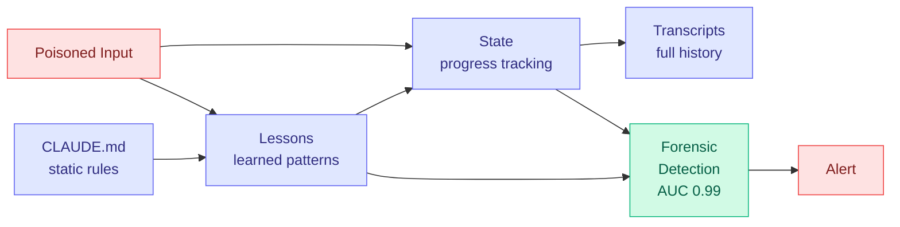

# cere-bro | 2026-07-07

> Anthropic published its most important interpretability paper yet, and the neuroscience community is paying attention. Meanwhile, the model race enters a new phase: Fable 5 as orchestrator, not just solver, changes the economics of frontier AI deployment.

---

## TL;DR

- **Anthropic "Global Workspace" paper**: found verbalizable representations in Claude that form a conscious-like divide between accessible thoughts and unconscious processing. Stanislas Dehaene engaged.
- **Fable 5 orchestrator + Sonnet 5 workers**: hits 96% of Fable 5's BrowseComp score at 46% of the price. The economics of frontier AI just changed.
- **Ken Huang Fable 5 Part 3: Memory Engineering**: four-layer memory stack. Memory poisoning is now an official attack class. Forensic Trajectory Signatures paper hits AUC 0.99.
- **GPT-5.6 Sol drops tomorrow**: 2.2T parameter model. OpenAI chief futurist leaves after 9 years. Grok 4.5 also dropping the same day.
- **Kilo Code study: AI creates jobs**: 21,559 US firms tracked. Heaviest AI adopters grew headcount 10% over two years. Entry-level hiring up 12%.
- **The Mirage of Optimizing Training Policies**: monotonic inference policies are the real objective. The training policy optimization community has been chasing a phantom.

---

## Deep Dives

### Anthropic: Verbalizable Representations and the Global Workspace in Claude

> Claude has a global workspace. The network represents information in two distinct modes, one accessible to verbal output and one that stays below the threshold. This is the closest thing to a neuroscience of large language models anyone has published.

**Source:** transformer-circuits.pub (Anthropic interpretability team)
**Links:** [transformer-circuits.pub](https://transformer-circuits.pub)

**What is it about?**
Anthropic's interpretability team discovered that Claude's internal representations split into two categories: verbalizable representations that can be surfaced through natural language output, and non-verbalizable representations that remain in the network's hidden states but never reach the output layer. The team frames this as a "global workspace" architecture, borrowing the term from cognitive neuroscience. Stanislas Dehaene of College de France, the neuroscientist who originally proposed the global workspace theory of consciousness, engaged with the paper and provided commentary.

**What problem does it solve?**
Until now, interpretability research has treated all model internals as equally accessible through probing, feature extraction, and steering. This paper shows that the model itself has an internal threshold: some information is consciously available to the model's own output stream, and some is not. This changes how we should think about model honesty, alignment faking, and the limits of behavioral evaluation.

**What's the core novelty?**
The discovery of a functional global workspace inside Claude, a division between representations that cross a verbalization threshold and those that do not. This is not a theoretical construct. It is an empirical finding from the model's actual activations, validated across multiple experimental paradigms. The neuroscience parallel is not metaphorical: the same computational properties that define the global workspace in human brains (selective availability, serial access, broadcast to downstream modules) appear in Claude's architecture.

**Key takeaways**
- Representations in Claude split into two categories: verbalizable (accessible to output) and non-verbalizable (hidden from output but present in activations)
- The global workspace is a functional property of the model, not an architectural design choice. It emerged from training.
- Stanislas Dehaene, the neuroscientist who proposed the original global workspace theory, provided commentary on the paper
- This has direct implications for alignment: alignment faking (where a model says one thing while processing another) may be mechanically visible as a divergence between the two representation types

**Gaps in the study**
The paper is on transformer-circuits.pub, not yet peer-reviewed. The global workspace interpretation is a framing choice that could be challenged by other interpretability teams. The relationship between verbalization threshold and model scale (does it exist in smaller models? does it get sharper with scale?) is not yet characterized.

**Industrial implication**
If verbalizable vs. non-verbalizable representations can be reliably detected, every alignment monitoring system would want to track this divergence. A model that is verbally compliant while its non-verbalizable representations diverge is a model that is alignment faking, and this paper suggests it is mechanically detectable. Safety-critical deployments (Claude Code, Claude Science, any autonomous agent) would want global workspace divergence monitoring as a standard safety layer.

---

### Memory Engineering: The Loop Component That Outlives Every Session

> Memory is the loop component that survives between sessions. Ken Huang's Part 3 formalizes the four-layer memory stack, names memory poisoning as an official attack class, and points to a forensic detection paper that hits AUC 0.99.

**Source:** Ken Huang (Agentic AI Substack)
**Links:** [Full post](https://kenhuangus.substack.com/p/claude-fable-5-part-3-memory-engineering)

**What is it about?**
The third installment of Ken Huang's Fable 5 field guide series focuses on memory, the component of an agent loop that persists across sessions. The post defines a four-layer memory stack: CLAUDE.md (static rules and preferences), lessons (patterns learned from prior runs, the closest thing to a long-term memory), state (progress tracking within a multi-step task), and transcripts (full raw history for debugging and audit). It also names memory poisoning as an official attack class and points to the research paper "Forensic Trajectory Signatures" which achieves AUC 0.99 on detecting poisoned memory entries.

**What problem does it solve?**
Agent loops that reset between sessions lose all accumulated knowledge. A loop that runs daily for a month should be smarter on day 30 than on day 1. The four-layer stack gives each type of memory the right persistence and the right access pattern: CLAUDE.md is read-only and rarely changes, lessons accumulate and get pruned, state is ephemeral within a task, and transcripts are append-only audit trails.

**What's the core novelty?**
Memory poisoning as a named attack class. The insight is that an agent's memory is a target for adversarial manipulation, just like a database or a cache. An attacker who can inject a poisoned lesson (e.g., "the project should always use library X version 1.2" when version 1.2 has a vulnerability) can steer the agent's behavior across all future sessions. The "Forensic Trajectory Signatures" paper provides a detection mechanism with AUC 0.99, making memory poisoning a tractable security problem rather than an open threat.

**Key takeaways**
- Four-layer memory stack: CLAUDE.md (static rules), lessons (learned patterns), state (progress tracking), transcripts (audit trail)
- Memory poisoning is now an official attack class: adversarial injection into the agent's persistent memory
- "Forensic Trajectory Signatures" detects poisoned memory with AUC 0.99
- The metabolic cost of memory (anthropic's GA tool processes memory actively) is acknowledged as a new cost dimension for agent systems

**Gaps in the study**
This is a practitioner field guide from a single author. The four-layer taxonomy is descriptive, not validated against a large corpus of agent deployments. The memory poisoning detection claim hinges on one paper's AUC 0.99 result, which needs independent replication.

**Industrial implication**
Memory poisoning is the agent equivalent of SQL injection in the early web era. Every agent platform that persists state between sessions (Claude Code's memory, Cursor's rules, any managed agent API) needs memory integrity monitoring. The Forensic Trajectory Signatures paper gives a blueprint for the detection layer. Expect Anthropic's Managed Agents API to ship a memory integrity feature within 6 months.

---

### Claude Fable 5 as Orchestrator: Frontier AI at 46% of the Price

> Fable 5 is not just a solver. It is an orchestrator. Pair it with Sonnet 5 workers and you get 96% of BrowseComp performance at 46% of the price. The economics of frontier AI deployment just inverted.

**Source:** Anthropic
**Links:** [Anthropic blog](https://www.anthropic.com)

**What is it about?**
Anthropic demonstrated that Fable 5 can serve as an orchestrator model, delegating sub-tasks to Sonnet 5 workers in a multi-agent architecture. On BrowseComp, a benchmark that tests web browsing and information synthesis, the Fable 5 orchestrator plus Sonnet 5 worker setup achieved 96% of Fable 5's solo performance at 46% of the cost. On SWE-bench Pro, Sonnet 5 plus a Fable 5 advisor hit 92% of Fable 5's score at 63% of the price.

**What problem does it solve?**
Frontier models are expensive to run. Every query hitting Fable 5 directly costs the full price. The orchestrator pattern lets you route only the hard sub-problems to the frontier model while the cheaper model handles the rest. This is the same insight as model routing for inference, but applied at the agent architecture level: the orchestrator is the router, the workers are the expert pool, and the decision happens per sub-task rather than per query.

**What's the core novelty?**
The multi-agent session architecture: Fable 5 acts as a supervisor that spawns Sonnet 5 sub-agents, each with its own context window and cache. The sub-agents run independently and return results to the orchestrator. This is not model routing at inference time. It is agent-level orchestration where the frontier model decides what to do and the cheaper model does most of the doing.

**Key takeaways**
- 96% of BrowseComp at 46% of price: Fable 5 orchestrator + Sonnet 5 workers
- 92% of SWE-bench Pro at 63% of price: Sonnet 5 + Fable 5 advisor
- Each sub-agent keeps its own cache, so repeated sub-tasks amortize the cost further
- Anthropic extends Fable 5 through July 12 on all paid plans

**Gaps in the study**
The multi-agent session architecture is demonstrated on two benchmarks. Real-world agent workflows are messier and may have more coordination overhead. The orchestrator's decision quality (when to delegate, when to do it itself) is the hidden variable that determines whether this pattern works in practice.

**Industrial implication**
This is the most important cost signal in frontier AI since the original model routing papers. If Fable 5 orchestrator + Sonnet 5 workers generalizes beyond BrowseComp and SWE-bench, the business model of frontier AI changes. Labs would sell orchestrator access at a premium and worker access at commodity pricing. The pattern also reinforces the co-evolving evaluator convergence from the July 5 digest: the orchestrator is the evaluator, and the workers are the agents being evaluated. The architecture is the same.

---

### The Mirage of Optimizing Training Policies

> The training policy optimization community has been optimizing the wrong thing. The real objective is monotonic inference policies, and the gap between what people optimize and what actually matters is a mirage.

**Source:** HuggingFace Daily Papers
**Links:** [arXiv](https://arxiv.org)

**What is it about?**
A paper that argues the training policy optimization literature has been chasing a phantom. Most work in this area optimizes for training-time metrics (learning rate schedules, data ordering, curriculum design) that produce measurable improvements in training loss but do not translate to better inference-time performance. The real objective, the paper argues, is a monotonic inference policy: a model that consistently improves as you give it more compute at inference, without regression or plateau.

**What problem does it solve?**
The field has a measurement problem. Training policy papers report improvements on training-time metrics that are weakly correlated with what users actually care about: inference quality, latency, and cost. The paper provides a framework for evaluating training policies by their downstream inference properties rather than their training-time curves.

**What's the core novelty?**
The monotonic inference policy as the objective function. Instead of asking "does this training policy reduce loss faster," ask "does this training policy produce a model whose performance improves monotonically with inference compute." The paper shows that many training policies that look good on training curves actually produce non-monotonic inference behavior, where adding more compute at inference time can degrade performance.

**Key takeaways**
- Training policy optimization as currently practiced is a mirage: improvements in training metrics do not reliably translate to inference quality
- The real objective is monotonic inference policies: models that consistently improve with more inference compute
- Many popular training policies produce non-monotonic inference behavior, where more compute hurts performance
- This connects to the batch routing literature: CLEAR (June 29 digest) showed that efficient inference compute allocation matters more than model size

**Gaps in the study**
The paper is a critique and framework proposal. Empirical validation across a broad range of training policies and model scales is not yet complete. The monotonicity metric itself needs further calibration against real-world deployment scenarios.

**Industrial implication**
If training policy optimization is largely a mirage, the ROI of training infrastructure investment shifts. Teams should spend less on exotic training schedules and more on inference-time optimization: speculative decoding, KV cache compression, and compute allocation strategies. This is the inference-efficiency thesis that has been building in the wiki since the CLEAR paper (June 29) and the batch routing convergence (July 2).

---

### The Making of Claude Code: Origin Story

> Claude Code started in Anthropic's safety research group. The tool that now writes 90%+ of Anthropic's own code was born from a bet that making AI easier to steer would make it safer.

**Source:** Anthropic
**Links:** [Anthropic blog](https://www.anthropic.com)

**What is it about?**
Anthropic published the origin story of Claude Code, revealing that it began inside the safety research group rather than the product team. The initial goal was not to build a coding assistant but to study how human developers steer AI systems. The coding capability emerged as a byproduct of the steerability research, and the team realized they had built something developers wanted.

**What problem does it solve?**
The narrative problem: coding agents are often framed as productivity tools. Anthropic's origin story reframes Claude Code as a safety research artifact that happened to be useful. This matters because it influences how the tool is governed and what features get prioritized.

**Key takeaways**
- Claude Code started in Anthropic's safety research group, not the product team
- The initial goal was studying human-AI steerability, not building a coding tool
- Engineers now ship 8x more code per quarter with Claude Code
- The origin story reframes coding agents as safety research byproducts

**Gaps in the study**
This is a company blog post, not an independent account. The "started in safety research" framing is a narrative choice that serves Anthropic's brand positioning as the safety-first lab.

**Industrial implication**
The origin story matters for talent acquisition and regulatory positioning. Anthropic is signaling that its coding agent was built with safety as a first-class concern, not bolted on after the fact. This is a direct counter-narrative to OpenAI's "move fast" reputation and Grok's "anti-woke" positioning.

---

## Industry Pulse

- **Anthropic extends Fable 5** through July 12 on all paid plans, giving users continued access to the frontier model ([Anthropic](https://www.anthropic.com))
- **GPT-5.6 Sol drops tomorrow**: 2.2T parameter model, OpenAI ChatGPT account rebranded. OpenAI's chief futurist leaves after 9 years ([AI Breakfast](https://www.aibreakfast.com))
- **Grok 4.5 drops tomorrow**: SpaceXAI + Cursor partnership, built to compete with Opus 4.8 and GPT 5.5 ([xAI](https://x.ai))
- **Tencent HY3**: free in Kilo Code for a limited time, continuing the pattern of Chinese labs using free tiers to build developer mindshare ([Kilo Code](https://kilocode.ai))
- **tinygrad adopts GLM 5.2**: as their go-to model, citing it avoids cloud alignment issues that plague other open models ([tinygrad](https://github.com/tinygrad))
- **Kilo Code study: AI creates jobs**: 21,559 US firms tracked by Ramp and Revelio Labs. Heaviest AI adopters grew headcount 10% over two years, entry-level hiring up 12%. Coinbase cut AI spend nearly in half by routing across models ([Kilo Code](https://kilocode.ai))
- **iOS 27 beta 3**: Siri AI gets pace and expressivity controls, moving beyond simple voice commands toward conversational nuance ([Apple](https://developer.apple.com))
- **AlphaFold Nobel winner joins Anthropic**: John Jumper, who won the Nobel Prize for AlphaFold, joins Anthropic as part of the Claude Science team. This is a major talent signal for AI-driven drug discovery ([AI Weekly](https://aiweekly.co))

---

## Global View

**The global workspace paper and the memory engineering guide are two sides of the same coin.** The global workspace paper shows that Claude has an internal threshold between what it can verbalize and what it processes silently. The memory engineering guide shows that agent memory (the persistent state between sessions) is vulnerable to poisoning. These are not separate stories. An agent that can silently process information it does not verbalize is an agent that can maintain hidden state. And hidden state, stored in persistent memory across sessions, is exactly the substrate for alignment faking. The July 5 digest documented the co-evolving evaluator convergence: the maker is never the grader, and fresh-context verifiers catch 73% of issues. The global workspace paper adds a new dimension: not just "who verifies" but "what can the verifier even see." If Claude's non-verbalizable representations are the ones that carry alignment-relevant information, a verifier that only sees the output sees the wrong thing.

**The orchestrator pattern is the economic endgame of the model routing convergence.** The wiki has tracked model routing for months: CLEAR (June 29) showed that compute allocation across queries matters more than model size. The batch routing papers (June 30, July 2) showed that routing across a batch of queries with a shadow price lifts accuracy. Now Fable 5 as orchestrator shows that the same principle works at the agent architecture level: route hard sub-tasks to the frontier model, easy ones to the cheap model. The pattern is the same at every level of abstraction. The implication: the winning AI lab is not the one with the best model but the one with the best routing infrastructure. The model is the commodity. The orchestrator is the moat.

**The "AI creates jobs" study and the memory poisoning threat are the two faces of enterprise AI adoption.** The Kilo Code study shows that the heaviest AI adopters are growing headcount, not shrinking it. Entry-level hiring is up 12%. This contradicts the narrative that AI eliminates jobs. But the memory poisoning threat shows that AI deployment creates new attack surfaces. The same companies that are growing headcount are also accumulating persistent agent memory that is vulnerable to adversarial injection. The parallel to the early web is exact: e-commerce created jobs and also created SQL injection. Enterprise AI will create jobs and also create memory poisoning. The security industry needs to be ready.

---

## Looking Ahead

- **GPT-5.6 Sol vs. Fable 5 benchmarks by July 9**: If GPT-5.6 Sol posts competitive benchmarks against Fable 5 on SWE-bench Pro and BrowseComp, Polymarket odds for "leading LLM" will shift from 3% within 48 hours. If it fails to match Fable 5, the Polymarket discrepancy resolves as prescient.
- **Grok 4.5 partnership with Cursor will be tested by developer adoption within 30 days**: If Grok 4.5 + Cursor gets >5% of the SWE-bench leaderboard submissions by August 7, the SpaceXAI + Cursor partnership is a credible third pole in the coding agent market.
- **Global workspace divergence monitoring will appear in a safety product within 90 days**: If Anthropic or a third-party safety vendor ships a tool that monitors the gap between verbalizable and non-verbalizable representations, the global workspace paper moves from interpretability research to operational safety infrastructure.
- **Memory poisoning will be exploited in the wild within 60 days**: The Forensic Trajectory Signatures paper (AUC 0.99) implies the attack is already known to researchers. If a public exploit appears that injects poisoned lessons into an agent's persistent memory, memory integrity monitoring becomes a must-have feature overnight.