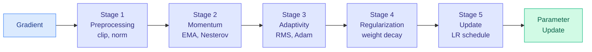
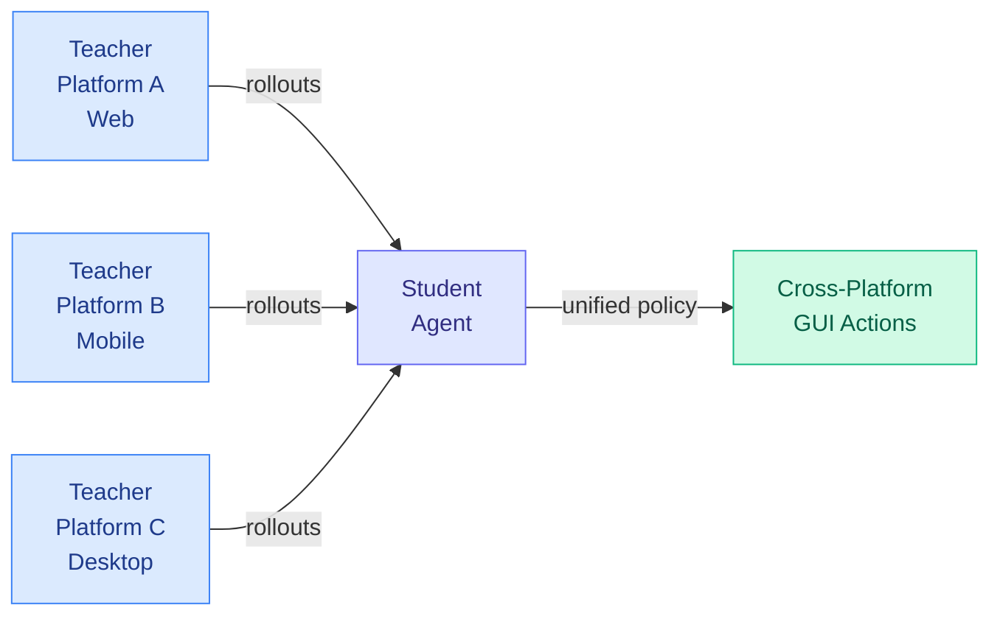
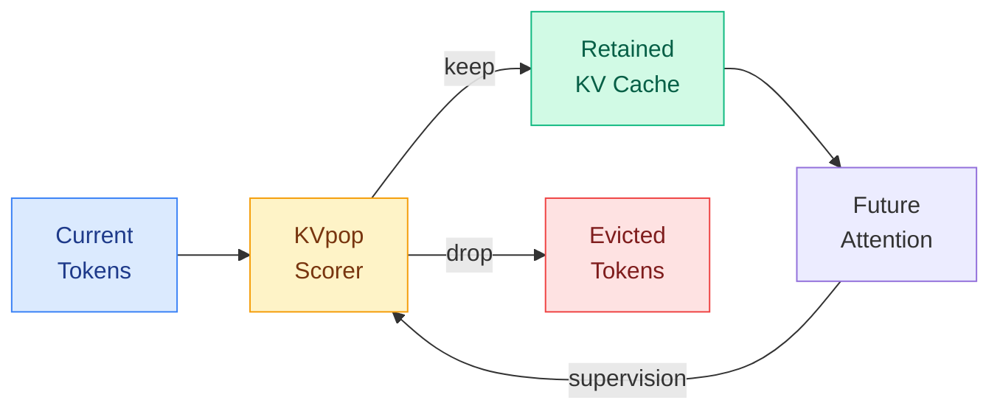

# cere-bro | 2026-07-08

> Two papers in two days converge on the same message: optimizer choice matters less than you think. OmniOpt shows that most optimizers are recombinations of four core mechanisms. Yesterday's Mirage paper showed that training policy optimization is chasing a phantom. The real action is in distillation, KV cache compression, and routing.

---

## TL;DR

- **OmniOpt**: a five-stage meta-pipeline taxonomy of over 100 optimizers. Most are recombinations of four core mechanisms: adaptive learning rates, momentum, weight decay, and gradient clipping.
- **UI-MOPD**: multi-platform on-policy distillation for GUI agents. A single student learns from teachers across different platforms, each with distinct interaction conventions.
- **KVpop**: learns a KV cache eviction policy by directly supervising the keep-or-drop decision against future attention. No static heuristics, no proxy scores.
- **dOPSD**: on-policy self-distillation for diffusion language models. The student generates its own rollouts and the teacher scores them, closing the exposure bias gap.
- **MANCE**: concept erasure that respects the manifold structure of representations. If natural representations live on a lower-dimensional manifold, interventions should stay on it.
- **ResearchStudio**: a two-paper suite for the first and last mile of research. Idea handles ideation with evidence grounding. Reel handles paper-to-poster, video, and blog.

---

## Deep Dives

### OmniOpt: Taxonomy, Geometry, and Benchmarking of Modern Optimizers

> The optimizer landscape is a mess of acronyms with no shared vocabulary. OmniOpt imposes a taxonomy over the entire field, showing that most "new" optimizers are variations on a handful of core mechanisms. Combined with yesterday's Mirage paper, the message is clear: stop tuning optimizers and start investing in inference.

**Source:** HuggingFace Daily Papers (67 upvotes)
**Links:** [arXiv](https://arxiv.org/abs/2607.04033)

**What is it about?**
OmniOpt is a unified survey and benchmark cookbook of optimizers for the research community. It rests on four components. First, a five-stage meta-pipeline that treats every optimizer update as a structured transformation: preprocessing (gradient clipping, normalization), momentum (EMA, Nesterov), adaptivity (RMS, Adam-style), regularization (weight decay), and update (learning rate schedule). Second, a geometric analysis that shows most optimizers differ only in how they navigate the loss landscape, not in what they fundamentally compute. Third, a benchmark suite across diverse tasks (vision, language, RL, graph learning). Fourth, a taxonomy that reveals most optimizer innovations are recombinations of four core mechanisms: adaptive learning rates, momentum, weight decay, and gradient clipping.

**What problem does it solve?**
Optimizer selection has become a system-level design decision constrained jointly by compute, memory, tuning budget, and task diversity. The landscape of over 100 methods is fragmented, and practitioners pick AdamW because it is the default, not because they understand the tradeoffs. OmniOpt gives a shared vocabulary for reasoning about optimizer choices. More importantly, it shows that most "new" optimizers are not new. They are rediscoveries of the same combinations under different names.

**What is the core novelty?**
The five-stage meta-pipeline. Every optimizer, from SGD to Sophia to schedule-free methods, can be decomposed into the same five stages. What differs is which stages are active, how they are parameterized, and how they interact. This decomposition reveals redundancies in the optimizer literature and makes it possible to compare optimizers on a structural basis rather than an empirical one. The geometric analysis adds a second layer: it shows that optimizers differ primarily in the geometry of their update steps (the effective step size, the direction, the curvature adaptation), and the five-stage pipeline captures these geometric differences.

**Key takeaways**
- Over 100 optimizers surveyed and taxonomized into a five-stage meta-pipeline.
- Most optimizer innovations are recombinations of four core mechanisms: adaptive learning rates, momentum, weight decay, and gradient clipping.
- The taxonomy reveals redundancies: many papers propose the same mechanism under different names.
- This connects to yesterday's Mirage of Optimizing Training Policies paper: if optimizers are variations on the same theme, and training policy optimization is largely a mirage, the practical implication is to stop tuning and invest in inference efficiency.

**Gaps in the study**
The taxonomy is descriptive, not prescriptive. It tells you what optimizers are made of but not which one to use for a given problem. The benchmark suite covers diverse tasks but at a fixed scale; whether the taxonomy holds at frontier training scales (100B+ parameters) is not tested. The geometric analysis is theoretical and does not account for hardware-level effects (memory bandwidth, kernel fusion) that influence optimizer choice in practice.

**Industrial implication**
If optimizer choice matters less than training policy, and training policy optimization is largely a mirage (per yesterday's Mirage paper), the practical implication is that teams should stop tuning optimizers and start investing in inference-time efficiency. This is the same conclusion the Mirage paper reached from a different angle. Two papers converging on the same practical recommendation from different directions in two days is a pattern. The ROI of optimizer research is declining. The ROI of inference optimization research is rising. For training infrastructure teams, the message is: pick a well-understood optimizer (AdamW, Lion, or Sophia), tune it once, and redirect the saved engineering effort to inference.

**Research angle**
The most urgent follow-up: does the five-stage pipeline decomposition hold at scale? Training runs at 100B+ parameters are where optimizer choice matters most (because the cost of a bad choice is highest), and the interaction between optimizer dynamics and training instability at scale is not captured by the taxonomy. A second question: can the five stages be optimized independently? If preprocessing and momentum are separable from adaptivity and regularization, the optimizer search space factorizes, and finding the optimal optimizer becomes a stage-wise optimization problem rather than a combinatorial search over 100+ methods. A third: does the geometric analysis predict training instability? If certain optimizer geometries are inherently more prone to loss spikes or divergence, the taxonomy could be extended to include a stability axis.

---

### UI-MOPD: Multi-Platform On-Policy Distillation for GUI Agents

> On-policy distillation has been limited to single-platform training. UI-MOPD extends it across platforms, training a single student from teachers on different platforms with distinct interaction conventions. The student learns to generalize across platforms, not just within one.

**Source:** HuggingFace Daily Papers (63 upvotes)
**Links:** [arXiv](https://arxiv.org/abs/2607.04425)

**What is it about?**
UI-MOPD extends on-policy distillation (where the student model learns from the teacher's reasoning traces, not just its outputs) to work across multiple platforms simultaneously. GUI agents face a fundamental challenge: different platforms (web, mobile, desktop) have distinct interaction conventions, widget types, and action spaces. Training a single agent on data from one platform produces brittle policies that fail on others. UI-MOPD trains a single student from multiple teachers, each specialized to a platform, combining their signal into a unified policy. The student learns to generalize across platforms, not just within one.

**What problem does it solve?**
High-quality cross-platform interaction trajectories are scarce. Existing data often suffers from limited platform coverage, and joint or continual training across platforms is challenging because different platforms exhibit distinct interaction conventions. UI-MOPD distributes the teacher workload across multiple platforms, making on-policy distillation practical for heterogeneous environments. The student learns a unified policy that works across platforms without per-platform fine-tuning.

**What is the core novelty?**
Multi-platform on-policy distillation. Standard on-policy distillation trains a student from a single teacher on a single platform. UI-MOPD lets a student learn from multiple teachers running on different platforms, combining their signal into a single training run. The key insight is that different platforms provide complementary signal: web teaches form-filling and navigation, mobile teaches touch interactions and gestures, desktop teaches window management and keyboard shortcuts. The student learns a unified policy that composes these skills.

**Key takeaways**
- Multi-platform on-policy distillation: a single student learns from teachers running on different platforms.
- Distributed teacher workload makes on-policy distillation practical for heterogeneous compute environments.
- The student learns to generalize across platforms, not just within one.
- This connects to the on-policy distillation lineage in the wiki: TIP (April 16, showed most teacher tokens carry no signal), COPD (May 1, co-evolving policy distillation), and now UI-MOPD (distributed teacher deployment).

**Gaps in the study**
The paper is about infrastructure, not algorithmic innovation. The distillation quality depends on the teachers, and UI-MOPD does not address the teacher quality problem. The coordination overhead of multi-platform training (network latency, gradient synchronization) is not fully characterized. The evaluation is on GUI agent benchmarks; whether the cross-platform generalization transfers to real-world GUI automation is untested.

**Industrial implication**
If on-policy distillation becomes the standard way to train smaller models from frontier models, multi-platform deployment is a requirement for any organization that does not own a homogeneous GPU cluster. UI-MOPD makes the case that heterogeneous compute is not a limitation but an opportunity: different teachers on different hardware can provide complementary signal. The practical outcome is cheaper GUI agents that work across platforms, which is relevant for every company building automated testing, RPA (robotic process automation), or AI-powered accessibility tools.

**Research angle**
The multi-platform distillation framework is a specific instance of a more general principle: heterogeneous teacher distillation. The same approach could be applied to code generation (teachers specialize in different languages), scientific reasoning (teachers specialize in different domains), or multimodal understanding (teachers specialize in different modalities). The research question is whether the student learns to compose the teachers' skills (producing a policy that is better than any single teacher) or simply averages them (producing a policy that is as good as the average teacher). The former is true generalization. The latter is a diluted mix. Answering this requires controlled experiments with teachers of known quality and complementary skills.

---

### KVpop: Learned KV Cache Eviction with Future-Attention Supervision

> KV cache eviction has been a game of static heuristics: drop the oldest, drop the least attended, drop the lowest scoring. KVpop learns the keep-or-drop decision by directly supervising against future attention. The model predicts what tokens a future query will actually need.

**Source:** HuggingFace Daily Papers (17 upvotes)
**Links:** [arXiv](https://arxiv.org/abs/2607.05061)

**What is it about?**
KV cache growth is a major bottleneck in autoregressive decoding: memory and bandwidth scale linearly with context length. Existing KV eviction methods rely on static heuristics (keep the most recent, keep the most attended) or proxy scores (attention weight, token importance) that poorly track future token utility. As the context shifts, these heuristics cause brittle eviction. KVpop learns a fixed-budget KV eviction policy by directly supervising the keep-or-drop decision against a novel future-attention target: the model is trained to predict which tokens a future query will actually attend to, and evicts the rest.

**What problem does it solve?**
Static heuristics are blind to the future. A token that is irrelevant now may become critical ten steps later when the query shifts topic. A token that is highly attended now may be a distractor for the next query. KVpop replaces the static heuristic with a learned policy that is supervised against the actual future attention pattern. The policy learns to keep tokens that will be useful and drop tokens that will not, even when the current attention pattern suggests otherwise.

**What is the core novelty?**
The future-attention supervision target. Prior KV eviction methods use proxy scores (attention weight, token importance, recency) that correlate weakly with future utility. KVpop trains the scorer directly against the attention pattern of future queries. The scorer learns to predict which tokens the model will actually need in the future, not which tokens are important now. This is a fundamentally different supervision signal, and it produces a policy that is robust to context shifts.

**Key takeaways**
- Learned KV eviction policy supervised against future attention, not current attention or heuristics.
- Fixed-budget eviction: the policy learns to keep exactly K tokens that maximize future utility.
- Robust to context shifts: the policy predicts future token utility, not current token importance.
- This is the first KV eviction method that directly optimizes for future attention rather than a proxy.

**Gaps in the study**
The scorer adds a small overhead to each decoding step. The tradeoff between scorer cost and eviction accuracy is not fully characterized. The method is evaluated on language modeling and downstream tasks; the impact on long-context retrieval and multi-turn conversation is not tested. The fixed budget K is a hyperparameter; whether K can be learned adaptively per-query is an open question.

**Industrial implication**
KV cache compression is the single most important efficiency lever for long-context LLM serving. Every token saved in the KV cache reduces memory and bandwidth, which directly reduces cost per query. If KVpop's learned policy generalizes to production serving, it becomes the default KV eviction method. The "learned policy" approach also opens the door to per-query budget adaptation: different queries need different amounts of context, and a learned policy could allocate the cache budget dynamically.

**Research angle**
The future-attention supervision target is a general technique that could be applied to other token-level decisions. Token pruning during training (which tokens to compute the full forward pass for), token merging during inference (which tokens to combine), and token-level routing in mixture-of-experts models (which tokens to route to which experts) all currently use static heuristics. Future-attention supervision could replace these heuristics with learned policies. The central research question: can a single scorer be trained to predict future attention across all these tasks, or does each task need its own specialized scorer? A unified token-importance scorer would be a foundational contribution.

---

### dOPSD: On-Policy Self-Distillation for Diffusion Language Models

> Diffusion language models generate text by iteratively denoising a masked sequence. They are a parallel alternative to autoregressive models. But post-training them for reasoning has been hard. dOPSD brings on-policy self-distillation to diffusion LLMs.

**Source:** HuggingFace Daily Papers (15 upvotes)
**Links:** [arXiv](https://arxiv.org/abs/2607.04428)

**What is it about?**
Diffusion large language models (dLLMs) generate text by iteratively denoising a masked sequence, offering a parallel alternative to autoregressive models. But eliciting strong reasoning through post-training remains difficult. Supervised fine-tuning is off-policy and suffers from exposure bias (the model only sees ground-truth sequences during training, not its own generated sequences). Reinforcement learning gives only sparse, sequence-level rewards and is hard to apply without tractable sequence likelihoods. On-policy self-distillation (OPSD) offers a third path: the student generates its own rollouts, and the teacher scores them. The student learns from its own mistakes, closing the exposure bias gap. dOPSD adapts OPSD to the diffusion language model setting.

**What problem does it solve?**
Diffusion language models are architecturally appealing (parallel decoding, non-autoregressive generation) but practically limited (weaker reasoning, harder to post-train). The exposure bias problem is more severe for diffusion models than autoregressive models because the denoising trajectory is more sensitive to the distribution of intermediate states. SFT on ground-truth sequences produces a model that cannot handle its own noisy intermediate states. dOPSD closes this gap by training on the model's own rollouts.

**What is the core novelty?**
Adapting on-policy self-distillation to the diffusion language model setting. The key challenge is that diffusion models generate sequences through iterative denoising steps, not token-by-token autoregressive generation. The teacher must score partial denoising states, not just completed sequences. dOPSD solves this by scoring the full denoising trajectory, providing dense feedback at each denoising step.

**Key takeaways**
- On-policy self-distillation adapted to diffusion language models.
- Student generates its own rollouts (denoising trajectories), teacher scores them.
- Addresses the exposure bias problem: SFT on ground-truth sequences does not prepare the model for its own noisy intermediate states.
- Dense feedback at each denoising step, not just sequence-level rewards.

**Gaps in the study**
The method is evaluated on reasoning benchmarks. The scaling behavior (does the benefit increase with model size?) is not characterized. The teacher model is a larger diffusion model; the cost of teacher scoring for each denoising step is a practical concern. The comparison to RL-based post-training for diffusion models is not comprehensive.

**Industrial implication**
Diffusion language models are the main architectural alternative to autoregressive models. If dOPSD makes diffusion models competitive on reasoning tasks, the parallel decoding advantage (generating the entire sequence in one pass) becomes a deployment advantage. The practical outcome is faster inference for reasoning-heavy tasks. This is especially relevant for on-device deployment where autoregressive decoding is latency-bound.

**Research angle**
The convergence of on-policy distillation methods across architectures is a pattern worth tracking. TIP (autoregressive, April 16) showed that most teacher tokens carry no signal. COPD (autoregressive, May 1) showed that co-evolving policy distillation prevents plateauing. UI-MOPD (autoregressive, today) extends to multi-platform. dOPSD (diffusion, today) extends to non-autoregressive architectures. The pattern: on-policy distillation is becoming the standard post-training method across all architectures. The research question: is there a unified on-policy distillation framework that works across autoregressive, diffusion, and any future architecture? The answer would be a foundational contribution to the post-training literature.

---

### MANCE: Manifold-Aware Concept Erasure

> Concept erasure tries to remove a target concept from a representation. But representations encode many concepts that are correlated with the target. Erasing the target often damages the correlated ones. MANCE constrains interventions to the manifold where natural representations live.

**Source:** HuggingFace Daily Papers (33 upvotes)
**Links:** [arXiv](https://arxiv.org/abs/2607.03973)

**What is it about?**
Concept erasure aims to remove a target concept from a representation while preserving everything else. This is hard because representations encode many concepts that are often correlated with the erasure target. Removing the target risks damaging the correlated ones. MANCE proposes the Manifold Constraint Hypothesis (MCH): if natural representations concentrate on a structured, lower-dimensional manifold, then erasure interventions should be constrained to that manifold. By projecting the erasure direction onto the manifold tangent space, MANCE removes the target concept while preserving correlated concepts that live on the manifold.

**What problem does it solve?**
Standard concept erasure methods (linear projection, adversarial training, activation engineering) treat the representation space as Euclidean. They erase along a direction and hope the correlated concepts survive. But if representations live on a manifold, erasing along a Euclidean direction can push the representation off the manifold entirely, destroying information that is not the target. MANCE constrains the erasure to the manifold, preserving the structure of the representation.

**What is the core novelty?**
The Manifold Constraint Hypothesis is a new theoretical framing for concept erasure. The practical contribution is a method that estimates the local manifold structure and constrains the erasure to the manifold tangent space. This is a general technique that can be applied to any existing erasure method.

**Key takeaways**
- Manifold Constraint Hypothesis: natural representations concentrate on a lower-dimensional manifold. Interventions should stay on it.
- MANCE constrains erasure to the manifold tangent space, preserving correlated concepts.
- The method is a drop-in constraint for existing erasure techniques.
- This connects to the Anthropic global workspace paper (July 7): if representations split into verbalizable and non-verbalizable, erasing one may push the other off the manifold.

**Gaps in the study**
The manifold estimation is approximate and depends on the quality of the local tangent space approximation. The method is evaluated on concept erasure benchmarks; the manifold constraint's benefit for other representation interventions (steering, probing, editing) is not tested. The hypothesis that natural representations actually concentrate on a manifold is empirical, not proven, and may not hold for all model architectures.

**Industrial implication**
Concept erasure is a practical tool for safety (removing harmful concepts, debiasing models, unlearning copyrighted content). MANCE makes erasure more precise, which means fewer side effects. If the manifold constraint generalizes, it becomes a standard part of the safety toolkit for any model that serves users. The connection to the global workspace paper is relevant: if non-verbalizable representations carry alignment-relevant information, erasing them from the verbalizable stream is not enough. MANCE provides a more precise approach to erasure that respects the representation structure.

**Research angle**
The manifold constraint hypothesis is a general principle that applies beyond concept erasure. Any representation intervention (steering, probing, editing, compression) could benefit from manifold constraints. The research question: is the manifold structure universal across models, or does each model have its own manifold? If universal, the manifold can be characterized once and reused. If model-specific, each model needs its own manifold estimation. A second question: does the manifold structure change during training, and if so, does it correlate with capability emergence? The connection to the global workspace paper suggests a third question: do verbalizable and non-verbalizable representations live on different manifolds?

---

### ResearchStudio: Ideation and Dissemination as a Skill Suite

> ResearchStudio is a two-paper suite that automates the first and last mile of research. Idea handles evidence-grounded ideation. Reel handles paper-to-poster, video, and blog. Together they form a pipeline that surrounds the actual research with automation.

**Source:** HuggingFace Daily Papers (49 and 41 upvotes)
**Links:** [Idea](https://arxiv.org/abs/2607.04439) · [Reel](https://arxiv.org/abs/2607.04438)

**What is it about?**
ResearchStudio is a two-paper suite from the same team. ResearchStudio-Idea is a reusable skill suite for the first mile of research ideation: grounding a problem in current literature, identifying meaningful bottlenecks, differentiating from existing solutions, and evaluating risks before implementation. It includes Paper-Search, a multi-source literature retrieval tool, and a structured ideation workflow that produces evidence-grounded research proposals. ResearchStudio-Reel automates the last mile of research dissemination: turning a paper into a poster, a talk video, and a blog post. It uses thin agent-readable contracts that separate content from presentation, making the outputs editable in PowerPoint and Word rather than one-way renders.

**What problem does it solve?**
Research dissemination is still a manual last mile. Prior automation treats each artifact in isolation, re-extracts the paper from scratch, and ships one-way renders the author cannot edit. ResearchStudio-Reel treats dissemination as a composition of skills: content extraction, visual design, narrative structuring, and format-specific rendering. The contracts between skills make the outputs editable. ResearchStudio-Idea solves the complementary problem: ideation without evidence grounding produces plausible-sounding but contextually shallow ideas.

**Key takeaways**
- ResearchStudio-Idea: evidence-grounded research ideation with Paper-Search for multi-source literature retrieval.
- ResearchStudio-Reel: paper-to-poster, video, and blog pipeline with editable outputs.
- The two papers form a complete pipeline that surrounds the actual research with automation.
- This connects to yesterday's Human-LLM Research Gap paper: the gap is contextual depth. ResearchStudio-Idea addresses this by grounding ideation in evidence.

**Gaps in the study**
The ideation quality is evaluated by expert judgment, which is subjective. The dissemination quality is evaluated by VLM-preference scores, which may not capture the aspects that human readers care about. The pipeline is a composition of skills, and the failure modes of each skill compound. A failure in content extraction propagates to the poster, the video, and the blog.

**Industrial implication**
If research ideation and dissemination can be automated with quality, the bottleneck shifts to the actual research: designing experiments, running them, and interpreting results. ResearchStudio handles the surrounding tasks. The remaining bottleneck is the core research loop, which is also the hardest to automate. This is the same pattern identified in the July 5 digest: the Paper Assistant Tool handles verification, and ResearchStudio handles ideation and dissemination. The missing piece is automated experiment execution, which is the hardest problem of the three.

**Research angle**
The research automation pipeline is forming piece by piece, and the integration challenge is the next research problem. Ideation (ResearchStudio-Idea), execution (not yet automated), verification (Paper Assistant Tool, July 5), and dissemination (ResearchStudio-Reel) form a complete pipeline. The gap is automated experiment execution. LLM-as-a-Verifier (also in today's HF feed) provides a verification framework, and ResearchStudio provides the surrounding infrastructure. The integration of these pieces into a single research automation system is a high-impact engineering challenge that would change how research is done.

---

## Industry Pulse

- **GPT-5.6 Sol drops today**: 2.2T parameter model, OpenAI ChatGPT account rebranded. Polymarket gives OpenAI only 3% odds of leading by end of July ([OpenAI](https://openai.com)).
- **Grok 4.5 drops today**: SpaceXAI plus Cursor partnership, built to compete with Opus 4.8 and GPT 5.5. Two frontier models on the same day ([xAI](https://x.ai)).
- **Claude multi-agent sessions**: Fable 5 orchestrator delegates to Sonnet 5 workers with independent caches. 96% of BrowseComp at 46% of the price ([Anthropic](https://www.anthropic.com)).
- **Anthropic Claude for Open Source**: 6 months of Claude Max 20x for maintainers, core contributors, and critical package maintainers ([Anthropic](https://www.anthropic.com)).
- **LongCat 2.0 matched GPT-5.5**: identical results on agentic game dev tasks for $0.00 versus $0.65 per run. Open weights are at parity ([HuggingFace](https://huggingface.co/meituan-longcat/LongCat-2.0)).
- **tinygrad warns on Anthropic dependence**: "companies relying on Anthropic are foolish. The enshittification cycle is accelerating." Open weights are the only hedge ([tinygrad](https://github.com/tinygrad)).
- **Google at ICML 2026 Seoul**: Project Astra, AlphaEarth Foundations, COrigami (Gemini plus RL for origami), Coral NPU (LLMs on low-power), Simula (synthetic dataset design), FireSat satellites ([Google](https://blog.google)).
- **Anthropic global workspace paper reverberating**: neuroscience community engaging with the finding that Claude has a verbalizable versus non-verbalizable divide ([transformer-circuits.pub](https://transformer-circuits.pub)).

---

## Global View

**The optimizer convergence and the training policy mirage are the same story from two angles.** Yesterday's Mirage of Optimizing Training Policies paper (156 upvotes) argued that training policy optimization is chasing a phantom because training-inference mismatch is the real bottleneck. Today's OmniOpt paper (67 upvotes) shows that most optimizer innovations are recombinations of four core mechanisms. The two papers converge on the same practical recommendation: stop tuning optimizers and training schedules, and start investing in inference efficiency. This is not a coincidence. It is a pattern that has been building in the wiki for weeks. CLEAR (June 29) showed that compute allocation across queries matters more than model size. The batch routing papers (June 30, July 2) showed that routing across a batch with a shadow price lifts accuracy. The Fable 5 orchestrator pattern (July 7) showed that the same principle works at the agent architecture level. The inference-efficiency thesis is now the dominant thread in the wiki, supported by five papers across three weeks. The practical implication for AI research teams: the ROI of training optimization is declining. The ROI of inference optimization is rising. Reallocate accordingly.

**The on-policy distillation pattern is converging across architectures.** TIP (April 16, autoregressive) showed that most teacher tokens carry no signal. COPD (May 1, autoregressive) showed that co-evolving policy distillation prevents plateauing. UI-MOPD (today, autoregressive) extends to multi-platform. dOPSD (today, diffusion) extends to non-autoregressive architectures. Four papers across three months, same core insight: on-policy distillation (the student learns from its own rollouts, not just the teacher's outputs) is the most effective post-training method. The pattern is now established: on-policy distillation is becoming the standard post-training method across all architectures. The next research question is whether a unified on-policy distillation framework exists that works across autoregressive, diffusion, and any future architecture. The July 5 digest's co-evolving evaluator convergence (Red Queen Godel Machine, Verification Horizon, Loop Engineering) is the theoretical foundation for this practical convergence.

**The research automation pipeline is forming, and the pieces are arriving in order.** The gap-measurement paper (July 7) characterizes what LLMs are missing: contextual depth. ResearchStudio-Idea (today) provides evidence-grounded ideation. The Kurate paper "AI scientists produce results without reasoning scientifically" (cs.AI #7) warns that AI-generated science passes superficial checks. Google's Paper Assistant Tool (July 5) provides verification. ResearchStudio-Reel (today) provides dissemination. The pieces form a complete pipeline: ideation, execution (missing), verification, dissemination. The gap is automated experiment execution. LLM-as-a-Verifier (also in today's HF feed) provides a verification framework that could be extended to experiment execution. The integration of these pieces into a single research automation system is the next high-impact engineering challenge.

**The open-source counter-narrative is the most important competitive story, not the GPT-5.6 launch.** LongCat 2.0 matched GPT-5.5 at zero marginal cost. tinygrad is publicly warning that Anthropic dependence is accelerating the enshittification cycle. Anthropic itself is giving Claude Max to open-source maintainers, implicitly acknowledging that open-source developers are the gatekeepers of developer tool adoption. The three signals together paint a picture that is larger than any single model launch: the economic advantage of proprietary models is eroding, and the distribution battle is moving to developer ecosystems. The July 5 digest flagged the LongCat 2.0 release. The July 8 result (parity with GPT-5.5 on agentic tasks) is the payoff: open weights are not just getting better. They are crossing the threshold where proprietary models cannot charge a premium for quality.

---

## Looking Ahead

- **GPT-5.6 Sol independent benchmarks by July 10**: If GPT-5.6 Sol matches or exceeds Fable 5 on SWE-bench Pro and BrowseComp, Polymarket odds for "leading LLM by end of July" will shift from 3% within 48 hours. Independent community benchmarks are the signal, not OpenAI's own numbers.
- **Grok 4.5 plus Cursor adoption by August 8**: If Grok 4.5 captures more than 10% of Cursor's active user sessions within 30 days, the SpaceXAI plus Cursor partnership is a credible third pole. If it stays below 5%, Cursor users are sticking with Claude and GPT.
- **LongCat 2.0 parity claims will be tested on standard benchmarks within 14 days**: If independent evaluations on SWE-bench and BrowseComp confirm the GPT-5.5 parity, the open-weight economic thesis (proprietary models cannot charge a premium for quality) is validated. If the parity is limited to game development tasks, the claim is narrower.
- **A unified on-policy distillation framework across architectures will be proposed within 90 days**: Four papers (TIP, COPD, UI-MOPD, dOPSD) have established on-policy distillation as the dominant post-training paradigm. A unified framework that works across autoregressive, diffusion, and any future architecture is the natural next step. Signal: an arXiv paper proposing a unified OPSD framework.
- **The OmniOpt taxonomy will be cited by a major lab's training infrastructure paper within 60 days**: If Google, Meta, DeepMind, or Anthropic publishes a training infrastructure paper that uses the five-stage meta-pipeline to describe their optimizer choice, the taxonomy becomes the standard vocabulary for optimizer selection. Signal: a training infrastructure paper from a major lab referencing OmniOpt.