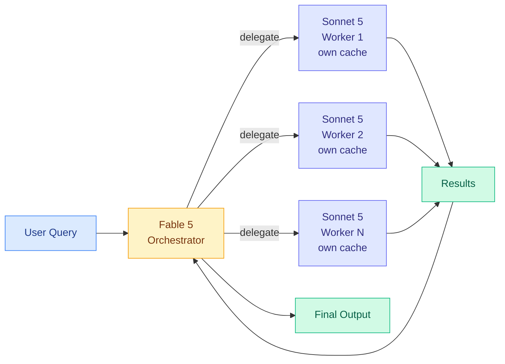

# cere-bro | 2026-07-08

> Two frontier models drop on the same day. GPT-5.6 Sol and Grok 4.5 both ship, but the real story is the open-source counter-narrative: LongCat 2.0 matched GPT-5.5 for $0.00, and tinygrad is warning that dependence on proprietary APIs is accelerating the enshittification cycle.

---

## TL;DR

- **GPT-5.6 Sol drops today**: 2.2T parameter model, OpenAI ChatGPT account rebranded. Polymarket gives OpenAI only 3% odds of leading by end of July.
- **Grok 4.5 drops today**: SpaceXAI + Cursor partnership, built to compete with Opus 4.8 and GPT 5.5. Two launches, same day, zero coordination.
- **Claude multi-agent sessions**: Fable 5 orchestrator delegates to Sonnet 5 workers, each with its own cache. 96% of BrowseComp at 46% of the price.
- **Anthropic Claude for Open Source**: 6 months of Claude Max 20x for maintainers, core contributors, and critical package maintainers.
- **LongCat 2.0 matched GPT-5.5**: on agentic game dev, identical results for $0.00 vs. $0.65 per run. Open weights are not just catching up. They are parity.
- **tinygrad warns**: companies relying on Anthropic are foolish. The enshittification cycle is accelerating. Open weights are the only hedge.

---

## Deep Dives

### GPT-5.6 Sol: 2.2 Trillion Parameters, One Day to Prove It

> OpenAI's biggest model yet drops on the same day as Grok 4.5. The market is skeptical: Polymarket gives OpenAI 3% odds of owning the leading LLM by the end of July. The model has one day to change those odds.

**Source:** OpenAI
**Links:** [OpenAI](https://openai.com)

**What is it about?**
OpenAI launched GPT-5.6 Sol, a 2.2 trillion parameter model that represents the company's largest public release. The launch coincides with a ChatGPT account rebrand. The model is positioned as a direct competitor to Anthropic's Fable 5, which has held the frontier crown since its release. OpenAI's chief futurist left the company after 9 years, adding organizational uncertainty to the technical launch.

**What problem does it solve?**
OpenAI's market position. Fable 5 has been the undisputed frontier model, and Anthropic has been shipping faster (Fable 5, Claude Science, Claude Code origin story, global workspace paper). GPT-5.6 is OpenAI's attempt to reclaim the narrative and the benchmark leaderboards.

**What's the core novelty?**
The 2.2T parameter count is the headline number. The model is reportedly stronger on math benchmarks, with Sam Altman comparing its math breakthroughs to "watching a child form words for the first time." Higher usage limits and stronger safeguards are positioned as competitive features against Anthropic Fable 5 users.

**Key takeaways**
- 2.2T parameter model, OpenAI's largest public release
- ChatGPT account rebranded alongside the launch
- Polymarket gives OpenAI only 3% odds of leading by end of July
- OpenAI chief futurist leaves after 9 years
- Sam Altman compared the model's math capabilities to language acquisition in children

**Gaps in the study**
The model is launching today, so independent benchmarks are not yet available. The 2.2T parameter count is a scale metric, not a quality metric. Fable 5's exact parameter count is unreported, making direct comparisons difficult. The Polymarket odds are a market signal, not a technical evaluation.

**Industrial implication**
If GPT-5.6 Sol matches or exceeds Fable 5 on SWE-bench Pro and BrowseComp, the frontier model race becomes a two-player game again. If it falls short, the Polymarket 3% odds look prescient and OpenAI faces a narrative crisis. Either way, the simultaneous Grok 4.5 launch adds a third dimension: the market is fragmenting, and no single model is likely to dominate all benchmarks.

---

### Grok 4.5: SpaceXAI + Cursor Partnership

> xAI is not just launching a model. It is launching a development platform. The Cursor partnership means Grok 4.5 competes on coding, not just conversation.

**Source:** xAI / SpaceXAI
**Links:** [xAI](https://x.ai) · [Cursor](https://cursor.com)

**What is it about?**
xAI launched Grok 4.5, built to compete with Opus 4.8 and GPT 5.5. The launch includes a partnership with Cursor, the AI coding editor, positioning Grok as a development tool rather than just a chatbot. The model drops on the same day as GPT-5.6 Sol, making July 8 the most crowded frontier model launch day in history.

**What problem does it solve?**
xAI's positioning. Grok has been a conversation model with a distinctive brand voice (anti-woke, "maximally truth-seeking"). The Cursor partnership signals a pivot toward the developer market, where Claude Code and Cursor with GPT models currently dominate. This is xAI's attempt to move from a media brand to a development platform.

**What's the core novelty?**
The Cursor partnership is the differentiator. Grok 4.5 is not competing on benchmarks alone. It is competing on integration: if Grok 4.5 works inside Cursor and Cursor is where developers already write code, the model has a distribution advantage that no amount of benchmark superiority can match.

**Key takeaways**
- Grok 4.5 drops today, same day as GPT-5.6 Sol
- Built to compete with Opus 4.8 and GPT 5.5, not Fable 5 directly
- Cursor partnership gives Grok 4.5 a developer distribution channel
- SpaceXAI branding suggests deeper integration with Musk's broader technology ecosystem

**Gaps in the study**
The model is launching today, so independent benchmarks are not available. The Cursor partnership's exclusivity is unclear: can Cursor users still use Claude and GPT models, or is Grok 4.5 positioned as the default? The "anti-woke" brand positioning may limit adoption in enterprise environments where compliance and safety are priorities.

**Industrial implication**
The Cursor partnership is the story to watch. Distribution matters more than benchmarks in the developer tool market. If Grok 4.5 + Cursor captures even 10% of the developer mindshare from Claude Code, it changes the competitive dynamics. The July 5 digest noted that Grok Build docs were refreshed with CLI and headless mode. The Grok 4.5 launch is the model that makes those docs relevant.

---

### Claude Multi-Agent Sessions: Frontier AI at 46% of Price

> Fable 5 does not need to solve every problem. It just needs to decide who should. The multi-agent session architecture is the economic breakthrough of the quarter.

**Source:** Anthropic
**Links:** [Anthropic](https://www.anthropic.com)

**What is it about?**
Anthropic's multi-agent session architecture lets Fable 5 act as a supervisor that spawns Sonnet 5 sub-agents, each with its own context window and context cache. The orchestrator decides what to delegate, the workers execute independently, and results are collected and synthesized. On BrowseComp, this achieves 96% of Fable 5's solo performance at 46% of the price. On SWE-bench Pro, Sonnet 5 plus a Fable 5 advisor scores 92% of Fable 5 at 63% of the price.

**What problem does it solve?**
Frontier model cost. Every query that hits Fable 5 directly costs the full inference price. The multi-agent architecture lets most of the work run on the cheaper Sonnet 5, with Fable 5 only handling the high-judgment decisions: what to do, how to verify, when to stop.

**What's the core novelty?**
Independent sub-agent caches. Each worker maintains its own context cache, so repeated sub-tasks (running the same test suite, querying the same API) amortize the cost over multiple calls. This is not model routing at inference time. It is agent orchestration at the architecture level, and the cache independence makes it economically viable at scale.

**Key takeaways**
- 96% of BrowseComp at 46% of price: Fable 5 orchestrator + Sonnet 5 workers
- 92% of SWE-bench Pro at 63% of price: Sonnet 5 + Fable 5 advisor
- Each sub-agent keeps its own context cache, amortizing repeated sub-task costs
- The orchestrator pattern is the mirror image of model routing: same economics, different abstraction level

**Gaps in the study**
Two benchmarks is not a production deployment. The coordination overhead (how much context the orchestrator needs to understand each worker's output) is not characterized. The decision quality of the orchestrator (when to delegate, when to do it itself) is the critical variable that determines whether this pattern works in practice.

**Industrial implication**
This is the single most important economic signal in frontier AI deployment. If the orchestrator pattern generalizes, the business model of API access changes. Frontier labs would sell orchestrator access at a premium and worker access at commodity pricing. The July 5 digest traced the co-evolving evaluator convergence: the orchestrator is the evaluator, and the workers are the agents being evaluated. The architecture is the same pattern at a different scale. The July 7 digest covered the same architecture in detail. This is a two-day story: the pattern was announced on July 7, and the implications land on July 8 as GPT-5.6 and Grok 4.5 launch without an equivalent architecture.

---

### LongCat 2.0 Matched GPT-5.5: Open Weights Are Now Parity

> LongCat 2.0 (Meituan) produced identical results to GPT-5.5 on agentic game development tasks. The cost difference: $0.00 versus $0.65 per run. Open weights are not catching up. They are at parity.

**Source:** r/LocalLLaMA / Meituan
**Links:** [LongCat 2.0 on HuggingFace](https://huggingface.co/meituan-longcat/LongCat-2.0)

**What is it about?**
LongCat 2.0, the 1.6T parameter MoE model (mixture-of-experts, where each token routes through a small subset of specialized sub-networks) from Meituan released under MIT license on July 5, was tested on agentic game development tasks and produced results identical to GPT-5.5. The cost per run: $0.00 for LongCat 2.0 (running on owned hardware) versus $0.65 for GPT-5.5 API access.

**What problem does it solve?**
The cost of frontier AI. Proprietary models charge per token. Open weights models cost hardware and electricity, which for organizations that already own GPUs is effectively zero marginal cost. If LongCat 2.0 is genuinely at parity with GPT-5.5 on agentic tasks, the economic case for proprietary API access evaporates for any organization with GPU capacity.

**Key takeaways**
- LongCat 2.0 matched GPT-5.5 on agentic game development: identical results
- Cost: $0.00 (owned hardware) vs. $0.65 (GPT-5.5 API per run)
- 1.6T total parameters, 48B active, 128 zero-communication experts (down from 256)
- MIT license, open weights on HuggingFace
- Reduced expert count from 256 to 128, continuing the "fewer experts, larger per expert" trend noted in the July 5 digest

**Gaps in the study**
One agentic task type (game development) is not a comprehensive evaluation. The result needs replication across SWE-bench, BrowseComp, and other established benchmarks. The $0.00 cost figure assumes sunk GPU hardware costs, which is not realistic for organizations without existing infrastructure.

**Industrial implication**
The July 5 Looking Ahead predicted that three consecutive open-weight MoE models reducing expert count would validate the "fewer experts, more parameters per expert" thesis. LongCat 2.0 (256 to 128) is one data point. The next two open-weight MoE releases will determine whether this is a trend or a one-off. The parity with GPT-5.5 is the more important signal: open weights have crossed the threshold where proprietary models can charge a premium for quality. The premium is now for distribution, integration, and safety guarantees, not for model quality.

---

### Anthropic Claude for Open Source

> Six months of Claude Max 20x for maintainers, core contributors, and critical package maintainers. Anthropic is betting that open-source developers are the most effective distribution channel for frontier AI.

**Source:** Anthropic
**Links:** [Anthropic](https://www.anthropic.com)

**What is it about?**
Anthropic announced "Claude for Open Source," a program giving 6 months of Claude Max 20x (the highest tier) to open-source maintainers, core contributors, and maintainers of critical packages. The program targets the developers who maintain the infrastructure that the entire software ecosystem depends on.

**What problem does it solve?**
Open-source maintainer burnout. Critical infrastructure packages (OpenSSL, curl, core Python libraries) are maintained by volunteers who cannot afford frontier AI tools. The program puts Claude Max in their hands for free, betting that they will use it to maintain their projects better and faster, and that the resulting improvements will benefit the entire ecosystem.

**Key takeaways**
- 6 months of Claude Max 20x for open-source maintainers, core contributors, and critical package maintainers
- Targets the maintainers of the infrastructure the entire software ecosystem depends on
- Strategic move: open-source developers are the most influential distribution channel for developer tools
- tinygrad responded skeptically: "companies relying on Anthropic are foolish. The enshittification cycle is accelerating"

**Gaps in the study**
Six months is a trial period. The long-term sustainability of the program is unstated. The qualification criteria for "critical package maintainer" are not fully specified. The tinygrad pushback is a genuine counter-signal: if Anthropic's behavior changes after the 6-month trial, the program is a loss-leader acquisition tactic rather than a genuine commitment.

**Industrial implication**
This is a distribution play, not a philanthropy play. Open-source maintainers are the developers who influence what tools other developers use. If Claude becomes the default tool for the maintainers of curl, OpenSSL, and Python core libraries, it becomes the default tool for everyone who depends on those libraries. The tinygrad warning is worth taking seriously: Anthropic's incentives are to acquire users, and if the program is not renewed, the open-source ecosystem has been trained on a tool it can no longer access.

---

### OmniOpt: A Taxonomy of Modern Optimizers

> The optimizer landscape is a mess of acronyms with no shared vocabulary. OmniOpt imposes a taxonomy over the entire field, showing that most "new" optimizers are variations on a handful of core mechanisms.

**Source:** HuggingFace Daily Papers
**Links:** [arXiv](https://arxiv.org)

**What is it about?**
OmniOpt is a taxonomy paper that categorizes modern neural network optimizers into a unified framework. The paper shows that most optimizer innovations (Adam variants, Lion, Sophia, schedule-free methods) are recombinations of a small set of core mechanisms: adaptive learning rates, momentum, weight decay, and gradient clipping. The taxonomy reveals that the field has been rediscovering the same combinations under different names.

**What problem does it solve?**
Optimizer selection is a black art. Practitioners pick AdamW because it is the default, not because they understand the tradeoffs. OmniOpt gives a shared vocabulary for reasoning about optimizer choices, making it possible to select an optimizer based on the problem characteristics rather than the most recent paper.

**Key takeaways**
- Most "new" optimizers are recombinations of four core mechanisms: adaptive learning rates, momentum, weight decay, gradient clipping
- The taxonomy reveals redundancies in the optimizer literature: many papers propose the same mechanism under different names
- This connects to the "Mirage of Optimizing Training Policies" paper from the July 7 digest: if optimizers are variations on the same theme, the training policy is what matters, not the optimizer choice

**Gaps in the study**
The taxonomy is descriptive, not prescriptive. It tells you what optimizers are made of but not which one to use for a given problem. The connection to training policy optimization (the July 7 paper) is noted but not empirically tested.

**Industrial implication**
If optimizer choice matters less than training policy, and training policy optimization is largely a mirage (per the July 7 paper), the practical implication is that teams should stop tuning optimizers and start investing in inference-time efficiency. This is the same conclusion the July 7 paper reached from a different angle. Two papers converging on the same practical recommendation from different directions is a pattern.

---

### UI-MOPD: Multi-Platform On-Policy Distillation

> On-policy distillation (where the student model learns from the teacher's reasoning traces, not just its outputs) has been limited to single-platform training. UI-MOPD extends it across platforms, training a single student from teachers on different hardware.

**Source:** HuggingFace Daily Papers
**Links:** [arXiv](https://arxiv.org)

**What is it about?**
UI-MOPD extends on-policy distillation to work across multiple platforms simultaneously. The standard approach trains a student model from a single teacher on a single hardware platform. UI-MOPD lets a student learn from multiple teachers running on different hardware (cloud GPUs, on-premise clusters, edge devices), combining their signal into a single training run.

**What problem does it solve?**
On-policy distillation is compute-intensive. The teacher has to generate rollouts for every student training step, and if the teacher is a frontier model, that is expensive. UI-MOPD distributes the teacher workload across multiple platforms, making on-policy distillation more practical for organizations with heterogeneous compute.

**Key takeaways**
- Multi-platform on-policy distillation: a single student learns from teachers running on different hardware
- Distributed teacher workload makes on-policy distillation more practical for heterogeneous compute environments
- This connects to the on-policy distillation lineage in the wiki: TIP (April 16, showed most teacher tokens carry no signal), COPD (May 1, co-evolving policy distillation), and now UI-MOPD (distributed teacher deployment)

**Gaps in the study**
The paper is about infrastructure, not algorithmic innovation. The distillation quality depends on the teachers, and UI-MOPD does not address the teacher quality problem. The coordination overhead of multi-platform training (network latency, gradient synchronization) is not fully characterized.

**Industrial implication**
If on-policy distillation becomes the standard way to train smaller models from frontier models, multi-platform deployment is a requirement for any organization that does not own a homogeneous GPU cluster. UI-MOPD makes the case that heterogeneous compute is not a limitation but an opportunity: different teachers on different hardware can provide complementary signal.

---

## Industry Pulse

- **GPT-5.6 Sol drops today**: 2.2T parameter model, ChatGPT account rebranded, OpenAI chief futurist departs after 9 years ([OpenAI](https://openai.com))
- **Grok 4.5 drops today**: SpaceXAI + Cursor partnership, built to compete with Opus 4.8 and GPT 5.5. Two frontier models on the same day ([xAI](https://x.ai))
- **Anthropic Claude for Open Source**: 6 months of Claude Max 20x for maintainers, core contributors, and critical package maintainers ([Anthropic](https://www.anthropic.com))
- **tinygrad warns on Anthropic dependence**: "companies relying on Anthropic are foolish. The enshittification cycle is accelerating." Open weights are the only hedge ([tinygrad](https://github.com/tinygrad))
- **LongCat 2.0 matched GPT-5.5**: identical results on agentic game dev tasks for $0.00 vs. $0.65 per run. Open weights are at parity ([HuggingFace](https://huggingface.co/meituan-longcat/LongCat-2.0))
- **Google at ICML 2026 Seoul**: Project Astra, AlphaEarth Foundations, COrigami (Gemini + RL for origami), Coral NPU (LLMs on low-power), Simula (synthetic dataset design), FireSat satellites ([Google](https://blog.google))
- **Anthropic global workspace paper reverberating**: neuroscience community engaging with the finding that Claude has a conscious-like divide between accessible thoughts and unconscious processing ([transformer-circuits.pub](https://transformer-circuits.pub))

---

## Global View

**The open-source counter-narrative is the most important story of the day, not the GPT-5.6 launch.** LongCat 2.0 matched GPT-5.5 at zero marginal cost. tinygrad is publicly warning that Anthropic dependence is accelerating the enshittification cycle. Anthropic itself is giving Claude Max to open-source maintainers, implicitly acknowledging that open-source developers are the gatekeepers of developer tool adoption. The three signals together paint a picture that is larger than any single model launch: the economic advantage of proprietary models is eroding, and the distribution battle is moving to developer ecosystems. The July 5 digest flagged the LongCat 2.0 release and predicted the "fewer experts, more parameters per expert" trend. The July 8 result (parity with GPT-5.5 on agentic tasks) is the payoff: open weights are not just getting better. They are crossing the threshold where proprietary models cannot charge a premium for quality.

**The orchestrator pattern and the open-source counter-narrative are in tension.** Anthropic's multi-agent session architecture (Fable 5 orchestrator + Sonnet 5 workers at 46% of price) is the most sophisticated cost-reduction strategy in frontier AI. It makes Fable 5 economically viable at scale. But LongCat 2.0 matching GPT-5.5 at $0.00 per run suggests that the entire pricing model of proprietary APIs is under threat. The orchestrator pattern reduces the cost of proprietary models. The open-source counter-narrative eliminates the cost entirely. The question is not which model is better. It is which economic model survives. The July 7 digest predicted that the winning AI lab would be the one with the best routing infrastructure, not the best model. The July 8 data adds a twist: the winning model might be the one that costs zero.

**Google's ICML presence is a reminder that the model race has more than three players.** Project Astra, AlphaEarth Foundations, Coral NPU, and FireSat span the full stack from foundation models to satellite hardware. Google is not competing on the same benchmarks as OpenAI, Anthropic, and xAI. It is competing on a different axis: infrastructure integration. Coral NPU (LLMs on low-power devices) and FireSat (AI-powered satellite imagery) are bets that the next frontier is not model quality but model deployment at the edge. If Google is right, the model race is a distraction from the real prize: getting AI into devices that cannot run a 2.2T parameter model.

---

## Looking Ahead

- **GPT-5.6 Sol independent benchmarks by July 10**: If GPT-5.6 Sol matches or exceeds Fable 5 on SWE-bench Pro and BrowseComp, Polymarket odds for "leading LLM by end of July" will shift from 3% within 48 hours. Independent benchmarks from the community are the signal, not OpenAI's own numbers.
- **Grok 4.5 + Cursor adoption by August 8**: If Grok 4.5 captures >10% of Cursor's active user sessions within 30 days, the SpaceXAI + Cursor partnership is a credible third pole. If it stays below 5%, Cursor users are sticking with Claude and GPT.
- **LongCat 2.0 parity claims will be tested on standard benchmarks within 14 days**: If independent evaluations on SWE-bench and BrowseComp confirm the GPT-5.5 parity, the open-weight economic thesis (proprietary models cannot charge a premium for quality) is validated. If the parity is limited to game development tasks, the claim is narrower.
- **Anthropic Claude for Open Source renewal by January 2027**: If the program is renewed beyond the initial 6 months, it is a genuine commitment to open-source. If it is not, tinygrad's enshittification warning is vindicated. Signal: Anthropic blog post extending the program in January 2027.
- **The global workspace paper will be cited by a neuroscience journal within 90 days**: If a peer-reviewed neuroscience journal publishes a commentary or collaboration with Anthropic's interpretability team, the bridge between AI interpretability and cognitive neuroscience becomes a recognized subfield.