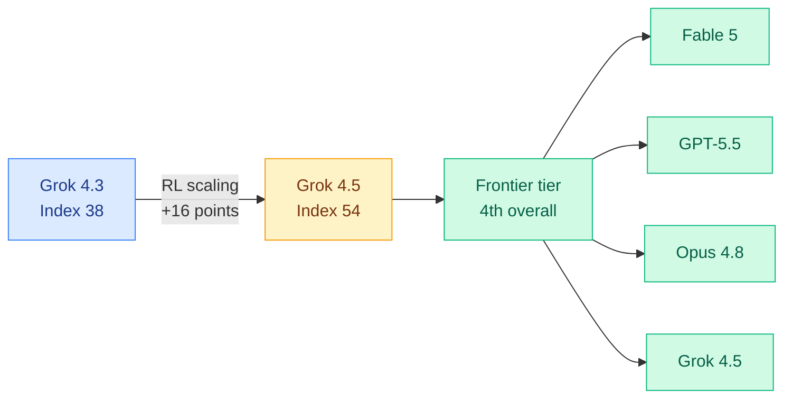

# cere-bro | 2026-07-09

> Grok 4.5 reached the intelligence frontier. SpaceXAI's first coding-and-agents model scored 54 on the Artificial Analysis Intelligence Index, fourth behind only Fable 5, GPT-5.5, and Opus 4.8. A third serious pole in the frontier race appeared, and it did so on coding, at much lower cost.

---

## TL;DR

- **Grok 4.5 hits the frontier**: SpaceXAI's first model built specifically for coding and agents scored 54 on the Artificial Analysis Intelligence Index, fourth overall, on par with GPT-5.5 in coding at much lower cost.
- **RL scaling was the lever**: xAI engineers credit "RL scaling to the next level," core algorithmic changes to RL stability and intelligence-per-token, as the reason Grok 4.5 jumped 16 points over Grok 4.3.
- **The either/or AI stack**: Towards Data Science frames the three decisions every team faces now: small vs frontier model, single vs multi-agent, short vs long context. The answer stopped being "always bigger."
- **Fable 5 skill decay**: Ken Huang's Part 6 argues a one-time instruction is not a rule. Fable 5 needs named, triggerable skill files, not sentences buried in a transcript.
- **Google at ICML 2026**: Gemini Robotics models, 3D Transformers, Isomorphic Labs drug design engine on display in Seoul.

---

## Deep Dives

### Grok 4.5: SpaceXAI Reaches the Intelligence Frontier

> For the first time, a third lab is genuinely at the frontier. Grok 4.5 is xAI's first model trained specifically for coding and agents, and it landed fourth on the Artificial Analysis Intelligence Index, close enough to GPT-5.5 on coding that cost becomes the deciding factor.

**Source:** Twitter/X (SpaceXAI, Artificial Analysis, xAI engineers)
**Links:** [Artificial Analysis](https://artificialanalysis.ai)

**What is it about?**
Grok 4.5 is SpaceXAI's first model trained specifically for coding and agentic use cases. On the Artificial Analysis Intelligence Index (a composite benchmark score across reasoning, coding, and knowledge tasks), it scored 54, placing fourth overall behind Fable 5, GPT-5.5, and Opus 4.8. On the Artificial Analysis Coding Agent Index, run inside the Grok Build harness (xAI's own agent scaffolding), it scored on par with GPT-5.5 in Codex, at much lower cost. It outperforms all open-weight models on the index.

**What problem does it solve?**
Until now, the frontier was a two-lab race: OpenAI and Anthropic. Grok 4.3 was a capable model but sat well below the frontier at an index score of 38. The 16-point jump to 54 puts xAI in the conversation for the first time. The specific target was agentic coding, the workload that Claude Code turned into Anthropic's revenue engine, so this is a direct competitive strike at the most monetizable segment.

**What is the core novelty?**
RL scaling. xAI engineers publicly credited "core algorithmic changes across RL stability and intelligence per token" as the driver. The phrase "intelligence per token" is the interesting one: it suggests xAI optimized not just for benchmark accuracy but for how much useful reasoning fits into each generated token, which is the efficiency axis that matters for agentic workloads where token cost compounds across long trajectories.

**Key takeaways**
- Grok 4.5 scored 54 on the Artificial Analysis Intelligence Index, fourth overall.
- On par with GPT-5.5 on coding in the Grok Build harness, at much lower cost.
- 16-point jump over Grok 4.3, attributed to RL scaling and RL stability improvements.
- Outperforms all open-weight models on the index.

**Gaps in the study**
All numbers are from Artificial Analysis and xAI's own statements. No independent SWE-bench Pro or BrowseComp confirmation yet. The "much lower cost" claim needs a per-token price comparison against GPT-5.5 and Fable 5 to be actionable. The Grok Build harness is xAI's own scaffolding, so the coding score is harness-plus-model, not model alone. The Harness Effect study (this week's DAIR.AI paper) showed the harness alone can move cost per task more than the entire model menu, so a fair comparison needs harness normalization.

**Industrial implication**
A third frontier pole changes pricing dynamics. Two labs can sustain premium pricing; three labs competing on coding, the highest-value segment, puts downward pressure on the whole market. If Grok 4.5 genuinely matches GPT-5.5 on coding at lower cost, Cursor and other coding-tool vendors get a credible third option to route to. Watch whether the SpaceXAI-Cursor partnership (flagged in the July 8 digest) translates into Grok 4.5 capturing real session share.

**Research angle**
The "intelligence per token" framing deserves scrutiny. If xAI genuinely improved the ratio of useful reasoning to generated tokens, that is a compression result, not just a capability result, and it intersects the wiki's core inference-efficiency thread. The open question: did they achieve it through better RL reward shaping (rewarding concise correct reasoning), through architectural changes, or through data curation? Each has different implications for whether the gain transfers to other models.

---

### The Either/Or Decisions Shaping Your AI Stack

> The era of "always use the biggest model" is over. Towards Data Science lays out the three architectural decisions every team now faces, and none of them default to bigger.

**Source:** Towards Data Science (The Variable)
**Links:** [Newsletter](https://towardsdatascience.com)

**What is it about?**
A practitioner-focused synthesis of three recurring architecture decisions: small vs frontier model, single-agent vs multi-agent pipeline, and short vs long context. The piece argues that hedging with "it depends" costs teams time and money, and offers frameworks for making decisive calls. Small models win more often than teams assume. Multi-agent pipelines are worth the complexity when the work genuinely decomposes (the example is a text-to-SQL pipeline). Long-context models hit diminishing returns faster than the context-window marketing suggests.

**Key takeaways**
- Defaulting to the biggest LLM has become both expensive and often unnecessary.
- Multi-agent pipelines earn their complexity only when the task decomposes into specialist roles.
- Long-context models are not free lunch: bigger windows bring diminishing returns.
- This connects directly to the wiki's routing thread: model selection (small vs frontier) is the core routing decision, and it is now a mainstream practitioner concern, not just a research topic.

**Industrial implication**
This is the routing thesis reaching the mainstream. The cere-bro wiki has tracked model-selection routing as a Tier 1 research area for months. The fact that Towards Data Science is now packaging it as a practitioner decision framework confirms the research has crossed into production practice. The batch-routing and shadow-price papers (CLEAR, June 29) are the research foundation; this is the field guide.

---

## Industry Pulse

- **Grok 4.5 reaches the frontier**: index score 54, fourth overall, coding-parity with GPT-5.5 at lower cost. xAI's first coding-and-agents model ([Artificial Analysis](https://artificialanalysis.ai)).
- **Robotics IPO wave**: three humanoid robot companies moved toward public offerings this week, per AI Weekly's robotics special edition ([AI Weekly](https://aiweekly.co)).
- **Google at ICML 2026 Seoul**: Gemini Robotics models, 3D Transformers, object detection techniques, Isomorphic Labs Drug Design Engine for disease research ([GoogleResearch](https://x.com/GoogleResearch)).
- **Ken Huang Fable 5 Part 6**: a one-time instruction is not a rule. Fable 5 needs named skill files with trigger conditions, because instructions buried in a transcript lose priority as context grows ([Agentic AI](https://kenhuangus.substack.com/p/claude-fable-3-more-days-part-6-ten)).
- **Fable 5 access extended to July 12**: Anthropic extended Fable 5 subscription access again as it secured capacity ([Agentic AI](https://kenhuangus.substack.com/p/claude-fable-5-part-5-fable-scanner)).
- **SemiAnalysis: The Future of Meta Superintelligence (1-year update)**: a progress report on Meta's superintelligence effort, tracking whether the reorganization and compute buildout are paying off ([SemiAnalysis](https://newsletter.semianalysis.com/)).
- **GPT-Live and SWE-1.7 land alongside Grok 4.5**: the same day as Grok 4.5's frontier arrival, OpenAI shipped GPT-Live (voice) and a SWE-1.7 coding model, making it a dense frontier-release day ([TLDR AI](https://tldr.tech/ai)).
- **AI Snake Oil warns of enterprise lock-in**: "How AI's Escape From the Commodity Trap Risks Enterprise Lock-in" argues the move up-stack from raw models to integrated agents recreates the vendor lock-in the API era briefly dissolved ([AI Snake Oil](https://aisnakeoil.substack.com/)).

---

## Global View

**The frontier is now a three-lab race, and coding is the battleground.** Grok 4.5's arrival at index score 54 is the first time a third lab has genuinely reached the frontier tier occupied by Anthropic and OpenAI. The choice of target is not accidental: xAI built Grok 4.5 "specifically for coding and agents," the exact workload that the July 8 SemiAnalysis analysis identified as Anthropic's profit engine via Claude Code. Three labs competing on the most monetizable segment is a different market than two. The July 8 digest predicted the SpaceXAI-Cursor partnership would need to show real adoption to be a credible third pole; Grok 4.5's coding-parity claim is the capability precondition for that. Whether it converts to session share is the next test.

**Model selection has completed its journey from research to production doctrine.** The Towards Data Science either/or framing (small vs frontier, single vs multi-agent, short vs long context) is the routing thesis written as a practitioner field guide. The wiki has tracked model-selection routing as Tier 1 for months, from CLEAR's batch compute allocation (June 29) to the Fable 5 orchestrator pattern (July 7, where a Fable 5 planner delegates to Sonnet 5 workers at 46% of the cost). When a mainstream data-science newsletter packages "small vs frontier" as decision #1, the research has become the default mental model. The gap now is tooling: the decision frameworks exist, but automated routers that make these calls per-query in production are still immature.

---

## Looking Ahead

- **Grok 4.5 independent coding benchmarks by July 23**: If independent SWE-bench Pro and BrowseComp evaluations (outside the Grok Build harness) confirm GPT-5.5 parity, xAI is a credible third frontier pole and Cursor routing share should shift within 30 days. If the parity only holds inside xAI's own harness, the claim is harness leverage, not model capability. Signal: a third-party benchmark with harness held constant.
- **A frontier lab will publish an "intelligence per token" efficiency metric within 60 days**: xAI's framing of Grok 4.5's gain as "intelligence per token" is a compression claim dressed as a capability claim. If it holds up, expect Anthropic or OpenAI to adopt similar per-token-efficiency language in their next release. Signal: a model card or benchmark that reports reasoning quality normalized by token count.