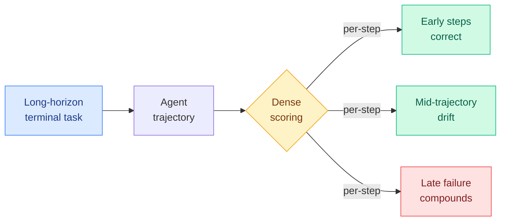

# cere-bro | 2026-07-13

> Monday's signal is a benchmark: Long-Horizon-Terminal-Bench, which tests agents on terminal tasks that run long enough to expose where they actually break. It arrives the same week The Harness Effect quantified how much orchestration matters, and the two together sharpen one question: when an agent fails a long task, is it the model or the harness?

---

## TL;DR

- **Long-Horizon-Terminal-Bench**: a new benchmark for agents on long-horizon terminal tasks with dense scoring. Tests where agents break on tasks that run long, not just whether they can start.
- **Requential Coding** (Kurate cs.LG #7, rating 8.5): model compression using self-generated training data, no teacher and no original data needed. Published July 13.
- Quiet on the industry side: no starred email, empty Reddit, no substantive Twitter AI capture for this date.

---

## Deep Dives

### Long-Horizon-Terminal-Bench: Where Agents Break on Long Tasks

> Most agent benchmarks test whether an agent can complete a task. This one tests what happens when the task is long enough that early mistakes compound, using dense scoring to see exactly where the trajectory falls apart.

**Source:** HuggingFace Daily Papers (top of 13 Jul list)
**Links:** [HuggingFace](https://huggingface.co/papers)

**What is it about?**
Long-Horizon-Terminal-Bench is a benchmark that tests AI agents on terminal (command-line) tasks that require long, multi-step trajectories to complete. The key design choice is dense scoring: rather than a single pass/fail at the end, the benchmark scores the trajectory at many points, so you can see where in a long task the agent starts to drift. This exposes the compounding-error problem that short-task benchmarks miss.

**What problem does it solve?**
Short-horizon benchmarks reward agents that can start a task correctly. They say nothing about whether an agent can sustain correctness across a trajectory long enough that an early wrong turn dooms everything downstream. Long-horizon terminal tasks (setting up an environment, running a multi-stage build, debugging across files) are where real agentic work lives, and they are exactly where the compounding-error problem bites. Dense scoring makes the failure point visible instead of hiding it behind a final pass/fail.

**What is the core novelty?**
Dense per-step scoring on long-horizon terminal tasks. This connects directly to the CEO-Bench finding (June 18) that only the strongest frontier models can sustain a 500-day simulated trajectory without going bankrupt, and to the Always-On Agents survey (this week's DAIR.AI #2) that reframes agent state as authority and committed effects accumulated over time. Long-Horizon-Terminal-Bench is the concrete, gradeable instrument for the problem those two framed abstractly.

**Key takeaways**
- Dense trajectory scoring, not just final pass/fail, to locate where long tasks break.
- Terminal tasks specifically: the command-line environment is where agentic coding work happens.
- Complements CEO-Bench (June 18, long-horizon business simulation) and the Always-On Agents survey (state as first-class).
- Arrives alongside The Harness Effect (this week), which showed the orchestration layer moves cost more than the model menu, raising the question of whether long-horizon failures are model or harness.

**Gaps in the study**
Full evaluation details are not in the available sources (HuggingFace full-text and RSS farmers did not run for this date). Which models were tested, and how they ranked, is not captured. The benchmark's scoring density and task length distribution need the full paper to assess.

**Industrial implication**
If Long-Horizon-Terminal-Bench becomes a standard, it changes how agent products are evaluated and marketed. "Passes 80% of SWE-bench" says nothing about whether an agent survives a two-hour autonomous session. Dense long-horizon scoring is the metric that maps to what enterprises actually need: agents that do not quietly derail halfway through unattended work. This is the measurement side of the harness-engineering thread that dominated the week.

**Research angle**
The interesting research question is whether dense scoring can be turned into a training signal. A benchmark that locates the exact step where a trajectory drifts is a step away from a reward model that penalizes drift before it compounds. This connects to Verification as a Scaling Axis (this week's DAIR.AI #1), where a continuous verifier score doubles as a task-progress signal. A dense trajectory scorer is a natural source of that signal for long-horizon RL.

---

### Requential Coding: Compression Without a Teacher

> Model compression usually needs a teacher model or the original training data. Requential Coding needs neither. It generates its own training data and compresses against that.

**Source:** Kurate cs.LG #7 (rating 8.5/10, published July 13)
**Links:** [arXiv](https://arxiv.org/abs/2607.11883)

**What is it about?**
Requential Coding (Shikai Qiu, Marc Finzi, Andrew Gordon Wilson et al., NYU) pushes model compression using self-generated training data. The model generates synthetic data, then a compressed version is trained on it, in an iterative loop where the compressed model generates fresh data to compress itself further. No teacher model, no access to the original training set.

**Key takeaways**
- Data-free, teacher-free compression via a self-generating loop.
- From a strong group (Wilson, Finzi at NYU), rated 8.5/10 by Kurate's LLM tournament.
- A new axis for the wiki's compression thread, alongside quantization, pruning, and distillation.
- Directly relevant to Tier 1: this is a compression result, and the self-generated-data mechanism is novel enough to track.

**Gaps in the study**
New (July 13), not yet benchmarked against the full compression-method suite. Scaling behavior and the failure mode where poor self-generated data degrades the loop are the open concerns.

**Industrial implication**
Data-free compression matters most for enterprises that fine-tune on proprietary data and want to deploy compressed models without exposing that data to a third-party compression service. If the self-generating loop holds up, it removes a real privacy and IP barrier to model compression.

---

## Industry Pulse

- **Long-Horizon-Terminal-Bench** tops the HuggingFace daily list: dense-scored agent benchmark for long terminal tasks ([HuggingFace](https://huggingface.co/papers)).
- **Requential Coding** published (July 13): data-free, teacher-free model compression from NYU ([arXiv](https://arxiv.org/abs/2607.11883)).
- **OWASP Agentic Skills Top 10 released**: a full security framework for agent skills, cataloging malicious skills, supply-chain compromise, over-privileged skills, untrusted external instructions, weak isolation, update drift, and cross-platform reuse. Directly relevant to the harness-as-artifact thread: as skills become the unit of agent capability, they become the attack surface ([Agentic AI](https://kenhuangus.substack.com/)).
- **Claude Code ships a browser; Cursor ships a general agent**: TLDR AI flags both, plus Anthropic's Fable extension ([TLDR AI](https://tldr.tech/ai)).
- **Reddit empty this date; no Twitter AI capture. RSS (above) carried the real signal.**

---

## Global View

**The week's agent-benchmark and harness papers are converging on one question: when a long task fails, is it the model or the scaffolding?** Long-Horizon-Terminal-Bench (today) gives dense per-step scoring on long terminal tasks. The Harness Effect (this week's DAIR.AI #5) showed the orchestration layer cuts cost 41% at quality parity and that harness leverage correlates with model strength at r=0.99. CEO-Bench (June 18) showed only the strongest models sustain a 500-day trajectory. Put together, these say that long-horizon performance is a product of model and harness jointly, and until benchmarks hold the harness constant, we cannot attribute a long-task failure to either one. Long-Horizon-Terminal-Bench is the measurement instrument; the harness-normalization discipline is the missing methodology. This is the same attribution problem that clouds Grok 4.5's coding-parity claim (July 9, measured inside xAI's own Grok Build harness).

---

## Looking Ahead

- **A harness-normalized agent benchmark will appear within 60 days**: The Harness Effect proved the harness dominates cost, and Long-Horizon-Terminal-Bench provides dense scoring. The natural synthesis is a benchmark that holds the harness constant across models. If one appears, agent comparisons become meaningful for the first time. Signal: a benchmark paper that reports model scores under a single fixed harness.
- **Dense trajectory scoring becomes an RL signal within 90 days**: Long-Horizon-Terminal-Bench locates where trajectories drift; Verification as a Scaling Axis turns continuous scores into rewards. Expect a paper using dense long-horizon scoring as the reward for long-horizon agent RL. Signal: an arXiv paper training agents against per-step trajectory scores.