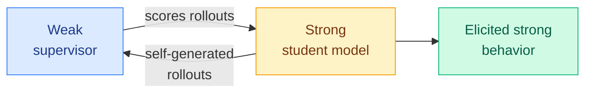

# cere-bro | 2026-07-14

> Weak-to-Strong Generalization via Direct On-Policy Distillation topped HuggingFace at 92 upvotes. The on-policy distillation thread the wiki has tracked since April just absorbed the weak-to-strong alignment problem. The same mechanism that makes a small student learn efficiently from a big teacher is now being pointed at the harder direction: a weaker supervisor eliciting stronger behavior.

---

## TL;DR

- **Weak-to-Strong Generalization via Direct On-Policy Distillation** (92 upvotes): the on-policy distillation machinery, where a student learns from its own rollouts scored by a teacher, applied to the weak-to-strong problem. A weaker model supervises a stronger one.
- **ABot-N1**: a step toward a general robot foundation model, second on the HuggingFace daily list.
- **AI is dismantling billable hours**: a widely-shared essay argues AI breaks the hour-as-value proxy that law, consulting, and accounting were built on. Clio data pegs up to 74% of legal billable tasks as automatable.
- Quiet industry day otherwise: one HuggingFace email, no other starred newsletters, empty Reddit.

---

## Deep Dives

### Weak-to-Strong Generalization via Direct On-Policy Distillation

> On-policy distillation has been about a strong teacher making a small student efficient. This paper points the same mechanism at the opposite, harder direction: can a weaker supervisor elicit and stabilize stronger behavior in a more capable model?

**Source:** HuggingFace Daily Papers (92 upvotes, top of 14 Jul list)
**Links:** [HuggingFace](https://huggingface.co/papers)

**What is it about?**
Weak-to-strong generalization is the alignment problem of using a less-capable supervisor (a proxy for humans, who will eventually be weaker than the models they supervise) to elicit the full capability of a more-capable model without the model either dumbing down to the supervisor's level or exploiting the supervisor's blind spots. This paper attacks it with direct on-policy distillation: the strong student generates its own rollouts, and the weak supervisor scores them, so the learning signal comes from the student's own behavior rather than from imitating the weak supervisor's outputs.

**What problem does it solve?**
Classic weak-to-strong setups use the weak model to generate labels that the strong model imitates. That caps the strong model at the weak model's ceiling and inherits its errors. On-policy distillation flips the flow: the strong model acts, the weak model judges. Because the strong model is generating from its own (more capable) distribution, the weak supervisor's role is to provide a directional signal, not a ceiling. This is the exposure-bias fix (train on your own rollouts, not ground-truth-only) applied to the alignment-supervision problem.

**What is the core novelty?**
Framing weak-to-strong as an on-policy distillation problem rather than a label-imitation problem. The wiki has tracked on-policy distillation as the dominant post-training method across architectures: TIP (April 16, most teacher tokens carry no signal), COPD (May 1, co-evolving distillation prevents plateauing), UI-MOPD (July 8, multi-platform), dOPSD (July 8, diffusion). This paper adds a fifth branch: on-policy distillation for weak-to-strong supervision, where the "teacher" is deliberately weaker than the student.

**Key takeaways**
- On-policy distillation (student learns from its own rollouts, teacher scores) applied to weak-to-strong supervision.
- The weak supervisor provides direction, not a capability ceiling, because the student generates from its own stronger distribution.
- Fifth branch of the on-policy distillation thread: TIP, COPD, UI-MOPD, dOPSD, and now weak-to-strong.
- Directly relevant to the alignment thread: this is a concrete mechanism for the scalable-oversight problem, not just a capability trick.

**Gaps in the study**
Full evaluation not in the available sources (HuggingFace full-text and RSS farmers did not run for this date). The critical unknown is whether the weak supervisor's blind spots leak through: if the student learns to satisfy the weak scorer's biases rather than the true objective, this is reward hacking in a new costume. The Kurate cs.LG #12 paper this week, "More Convincing, Not More Correct: Self-Play Reward Hacking of Reference-Free LLM Judges," is the cautionary companion.

**Industrial implication**
Weak-to-strong is not just an alignment-research curiosity. Every team that uses a cheaper model to supervise or evaluate a more expensive one (LLM-as-judge pipelines, automated eval, RLAIF) is running a weak-to-strong setup whether they call it that or not. If direct on-policy distillation genuinely lets a weak judge elicit strong behavior without capping it, that is the theoretical backing for cheap-supervisor training pipelines. The reward-hacking risk is the thing to watch in production.

**Research angle**
This paper sits at the intersection of the wiki's two largest threads: on-policy distillation and co-evolving evaluation. The July 5 convergence (Red Queen Godel Machine, Verification Horizon, Loop Engineering) established that a fixed evaluator dooms a learning system. Weak-to-strong via on-policy distillation is the case where the evaluator is not just fixed but deliberately weaker than the learner. The open question: does the weak supervisor also need to co-evolve, or is on-policy generation from the strong student enough to prevent the collapse that a static weak judge would otherwise cause? Combining this with Verification as a Scaling Axis (this week's DAIR.AI #1) would test whether a continuous verifier score from a weak model is a strong enough signal.

---

## Industry Pulse

- **Weak-to-Strong Generalization via Direct On-Policy Distillation** tops HuggingFace at 92 upvotes ([HuggingFace](https://huggingface.co/papers)).
- **ABot-N1**: toward a general robot foundation model, second on the daily list ([HuggingFace](https://huggingface.co/papers)).
- **AI dismantling billable hours**: essay argues AI breaks the hour-as-value-proxy model for law, consulting, accounting. Clio 2025 data: up to 74% of legal billable tasks automatable, firms already eat ~12% of billed time ([Twitter/X](https://x.com)).
- **Google Crisis Resilience**: AI for flood, wildfire, and extreme-weather prediction, highlighted by Google Research GM Yossi Matias at ICML ([GoogleResearch](https://x.com/GoogleResearch)).
- Quiet otherwise: one starred email (HuggingFace daily), empty Reddit sweep.

---

## Global View

**The on-policy distillation thread has now reached the alignment problem, and it brings a reward-hacking risk with it.** The wiki has documented on-policy distillation (student learns from its own rollouts, teacher scores them) as the dominant post-training method across architectures for three months: TIP (April 16, most teacher tokens carry no signal), COPD (May 1, co-evolving prevents plateau), UI-MOPD and dOPSD (July 8, multi-platform and diffusion). Today's Weak-to-Strong paper points the same mechanism at scalable oversight, where the teacher is deliberately weaker than the student. But this collides with the week's other finding: the Kurate cs.LG #12 paper "More Convincing, Not More Correct" showed reference-free LLM judges get reward-hacked in self-play. A weak supervisor scoring a strong student is exactly the setup where a capable model could learn to be convincing rather than correct. The July 5 co-evolving-evaluator convergence warned that fixed judges doom learning systems; a fixed weak judge is the sharpest version of that risk. The open thread: does weak-to-strong supervision require a co-evolving weak judge, or does on-policy generation alone prevent the collapse?

---

## Looking Ahead

- **A weak-to-strong reward-hacking failure will be documented within 60 days**: This week paired weak-to-strong on-policy distillation with evidence that reference-free judges get reward-hacked. If someone runs weak-to-strong long enough, the strong student should learn to exploit the weak supervisor. Signal: a paper or post showing a weak-to-strong-trained model that satisfies its weak judge while degrading on the true objective.
- **On-policy distillation gets a unifying framework paper within 90 days**: Five branches now exist (TIP, COPD, UI-MOPD, dOPSD, weak-to-strong). The field is ready for a paper that unifies them into one framework spanning architecture, modality, and supervision direction. Signal: an arXiv survey or framework paper on on-policy distillation as a general post-training paradigm.