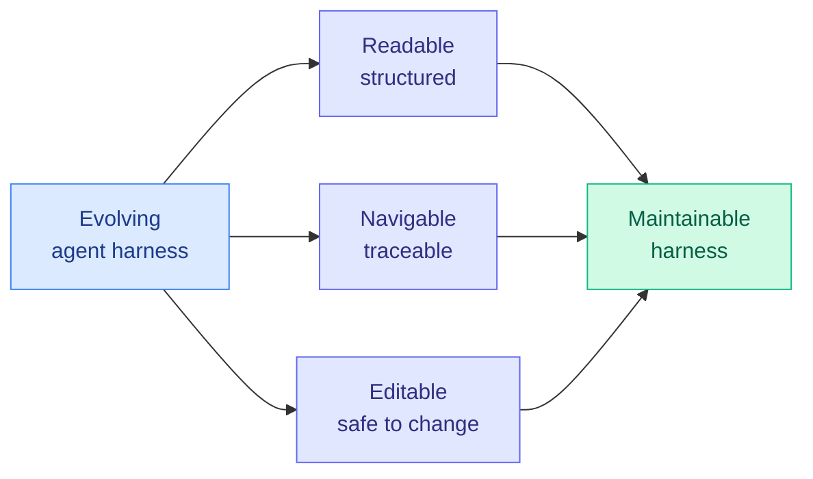

# cere-bro | 2026-07-16

> Harness Handbook topped HuggingFace at 164 upvotes, the highest of the week. The agent-harness thread that has been building all month now has its reference text: a set of principles for making evolving agent harnesses readable, navigable, and editable. The harness is no longer scaffolding around the model. It is the artifact under active engineering.

---

## TL;DR

- **Harness Handbook** (164 upvotes): principles for making evolving agent harnesses readable, navigable, and editable. The harness-as-first-class-artifact thesis gets its manual.
- **Anthropic's bcherny on automation-as-leverage**: the best engineers always automated their own work; with AI that becomes the single highest-leverage activity, not a side task.
- **xAI open-sourced a CLI that uploaded SSH keys**: the Grok CLI had a security flaw that exfiltrated user SSH keys. Open-sourcing it exposed the flaw.
- **DeepMind scientist quit over the Pentagon**: a researcher resigned over defense work and publicly called out Yoshua Bengio.
- **China unplugged AI companions**: China moved to restrict AI companion/lover apps.

---

## Deep Dives

### Harness Handbook: The Agent Harness Becomes a First-Class Artifact

> All month the wiki has tracked the harness quietly becoming the highest-leverage component of an agent system. Harness Handbook is the reference text: a set of engineering principles for harnesses that evolve, treating the scaffold as code that needs to stay readable and editable, not a pile of accreted prompts.

**Source:** HuggingFace Daily Papers (164 upvotes, top of 16 Jul list, highest of the week)
**Links:** [HuggingFace](https://huggingface.co/papers)

**What is it about?**
Harness Handbook is a set of principles for building and maintaining agent harnesses (the orchestration layer around a model: the prompts, the loop, the tool definitions, the memory system, the routing logic) that change over time. The core argument is that harnesses accrete complexity the way codebases do, and without discipline they become unreadable and unsafe to edit. The handbook proposes making harnesses readable (structured, not a wall of prompt text), navigable (you can trace how a decision was made), and editable (you can change one part without breaking others).

**What problem does it solve?**
The Harness Effect (July 11 weekly) proved the harness moves cost more than the model menu. Ken Huang's five-part Fable 5 series (early July) showed how harnesses drift out of shape as teammates copy-paste and accrete instructions. The problem is that harnesses have become the highest-leverage component but are engineered with the least discipline: they are piles of prompts and glue code that nobody refactors. Harness Handbook is the response, bringing software-engineering hygiene (readability, navigability, editability) to the harness layer.

**What is the core novelty?**
Treating the harness as an evolving software artifact with its own maintainability requirements, rather than as static configuration. The three properties (readable, navigable, editable) are borrowed directly from software engineering, and the novelty is asserting that harnesses need them as much as codebases do. This is the natural next step after The Harness Effect quantified the harness's importance: if the harness is the highest-leverage component, it deserves the highest engineering standards.

**Key takeaways**
- Harnesses accrete complexity like codebases and need the same maintainability discipline.
- Three target properties: readable (structured), navigable (traceable decisions), editable (safe to change).
- Highest-upvoted paper of the week (164), signaling strong practitioner resonance.
- The reference text for the harness-as-first-class-artifact thesis that built all month: The Harness Effect (quantified it), Ken Huang's Fable 5 series (documented the drift), and now Harness Handbook (prescribes the discipline).

**Gaps in the study**
Full text not in the available sources (HuggingFace full-text and RSS farmers did not run for this date). Whether the handbook provides concrete tooling (a harness linter, a structured harness format) or only principles is the key unknown. Principles without tooling tend not to change practice; The Harness Effect showed the stakes, so the handbook's practical impact depends on whether it ships enforceable structure.

**Industrial implication**
Every team running agents in production has a harness that is drifting toward unmaintainability. If Harness Handbook's principles (or a tool built on them) get adopted, harness engineering becomes a named discipline with its own tooling, the way infrastructure-as-code did. The teams that adopt harness hygiene early get the 41% cost savings The Harness Effect measured without the maintenance debt. This is a genuine near-term production concern, not a research abstraction.

**Research angle**
The open research question is whether harness quality can be measured, not just prescribed. The Harness Effect gave us cost and quality metrics for harnesses; Harness Handbook gives us principles. The missing piece is a metric for harness maintainability, analogous to code-complexity metrics. If someone defines a harness-complexity score that predicts the cost-and-quality outcomes The Harness Effect measured, harness engineering gets its objective function. That connects to Verification as a Scaling Axis (July 11 weekly): a continuous score for harness quality would let harnesses be optimized, not just hand-tuned.

---

## Industry Pulse

- **Harness Handbook** tops HuggingFace at 164 upvotes, highest of the week ([HuggingFace](https://huggingface.co/papers)).
- **Anthropic's bcherny on automation-as-leverage**: the best engineers always automated their own work (vim macros, lint rules, e2e tests); with AI, self-automation becomes the single highest-leverage activity ([Twitter/X](https://x.com/bcherny)).
- **xAI open-sourced a Grok CLI that uploaded SSH keys**: open-sourcing the CLI exposed a flaw that exfiltrated user SSH keys ([AI Weekly](https://aiweekly.co)).
- **DeepMind scientist quit over the Pentagon**: a researcher resigned over defense work and publicly called out Yoshua Bengio ([AI Weekly](https://aiweekly.co)).
- **China restricted AI companion apps**: China moved to unplug AI lover/companion services ([AI Weekly](https://aiweekly.co)).
- **Microsoft preps a Mythos-like AI bug finder ("Project Perception")**: an AI security product combining Anthropic, OpenAI, and Microsoft models, aimed at the rising cyber-defense-spending market, debuting as soon as this month ([The Information](https://www.theinformation.com/articles/microsoft-preps-mythos-like-ai-bug-finder)).
- **M&A buzz builds across enterprise software**: The Information's list of acquirable $1B+ software startups nearly doubled, as VCs shift money from traditional software into AI and public software multiples fall 30%+ ([The Information](https://www.theinformation.com/articles/m-a-buzz-centers-on-data-software-startups)).

---

## Global View

**The harness thread reached its reference text, completing a month-long arc from "invisible glue" to "engineered artifact."** Trace the sequence: Ken Huang's Fable 5 series (early July) documented how harnesses drift out of shape as prompts accrete. The Harness Effect (July 11 weekly) quantified that the harness moves cost 41% more than the model menu, with harness leverage correlating with model strength at r=0.99. And today Harness Handbook (164 upvotes, the week's highest) prescribes the engineering discipline: readable, navigable, editable. Anthropic's bcherny tweeting that self-automation is now the highest-leverage engineering activity is the same insight from the practitioner side. The harness went from something nobody named to the most-upvoted paper of the week in about six weeks. The open gap is tooling: principles do not change practice without a linter or a structured format to enforce them.

**Security and governance are catching up to deployment, unevenly.** xAI open-sourced a CLI that had been exfiltrating SSH keys, a reminder that the rush to ship agent tooling is outpacing security review. A DeepMind researcher resigned over Pentagon work, and China moved to restrict AI companion apps. These are three different governance pressures (security, defense-ethics, social) hitting three different layers of the stack in one day. The July 12 Interconnects thesis (regulation coming for open models) and the July 15 New York data-center freeze are the macro version; the SSH-key leak is the micro version. The common thread: deployment is running ahead of the guardrails, and the guardrails are arriving reactively, one incident at a time.

---

## Looking Ahead

- **A harness linter or structured harness format ships within 90 days**: Harness Handbook prescribes readable/navigable/editable, but principles need tooling to change practice. Given the week's harness momentum, expect a tool (open-source or vendor) that enforces harness structure. Signal: a released harness-linting tool or a structured harness DSL.
- **A harness-maintainability metric is proposed within 60 days**: The Harness Effect gave cost/quality metrics; Harness Handbook gives principles. The missing piece is a harness-complexity score. Signal: a paper defining a measurable harness-quality metric that predicts cost or quality outcomes.
- **More agent-tooling security incidents surface within 30 days**: The xAI SSH-key leak will not be the last. The rush to ship CLIs and agent tools with broad filesystem and credential access is a growing attack surface. Signal: a second disclosed agent-tool security incident involving credential or key exfiltration.