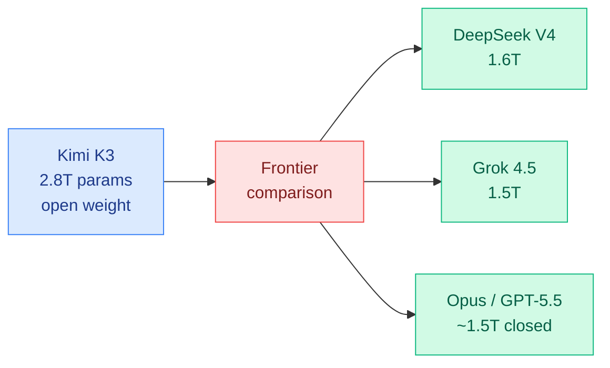

# cere-bro | 2026-07-17

> Kimi K3 is coming in at 2.8 trillion parameters, the biggest open-weight model ever by a wide margin. For scale: Grok 4.5 is around 1.5T, DeepSeek V4 is 1.6T, and Opus and GPT-5.5 are believed to sit near 1.5T. An open-weight model is about to be nearly twice the size of the frontier closed models, and it lands in the exact week the US is debating whether to restrict frontier open weights.

---

## TL;DR

- **Kimi K3 is 2.8T parameters**: the biggest open-weight model ever, nearly 2x the size of Grok 4.5 (1.5T), DeepSeek V4 (1.6T), and the believed size of Opus/GPT-5.5 (~1.5T). Confirmed via Moonshot's own Play Store listing.
- **The open-weights regulation clock is now literal**: a 2.8T open model arrives the same week Interconnects warned open models have "6 months to live" before US restrictions.
- **Harness Handbook momentum continues**: the week's top paper (164 upvotes on 07-16) keeps driving the harness-as-artifact conversation.
- Quiet on Kurate: the leaderboard is unchanged, still biomedical-and-science-foundation-model heavy, no new frontier-LLM entries.

---

## Deep Dives

### Kimi K3: The Biggest Open-Weight Model Ever at 2.8 Trillion Parameters

> Open-weight models have been chasing the frontier from behind. Kimi K3 does something different: at 2.8T parameters it is nearly twice the size of the closed frontier models it competes with. The question flips from "can open weights catch up" to "what happens when open weights are the biggest models in existence."

**Source:** Twitter/X (eliebakouch, scaling01, Moonshot Play Store listing)
**Links:** [via eliebakouch](https://x.com/eliebakouch)

**What is it about?**
Kimi K3, Moonshot AI's next model, is 2.8 trillion total parameters, confirmed via the parameter count listed in their own Play Store app. HuggingFace's eliebakouch put it in context: this is the biggest open-weight model ever, "by far." Grok 4.5 is about 1.5T, DeepSeek V4 is 1.6T, and Opus 4.8 and GPT-5.5 are believed to be around 1.5T. Kimi K3 is nearly double the frontier closed models. (Total parameters, almost certainly a mixture-of-experts model where only a fraction are active per token, so the active-parameter count and therefore the serving cost will be much lower than 2.8T implies.)

**What problem does it solve?**
The open-weights narrative has been "catching up to the frontier." Kimi K3 changes the framing entirely. If a 2.8T open model matches or beats the ~1.5T closed frontier models, it demonstrates that open labs can win on raw scale, not just efficiency. This matters because the July 8 LongCat-2.0 parity result and tinygrad's later "Kimi K3 feels Fable tier" claim (07-19) suggested open weights had reached quality parity; a 2.8T model suggests they may exceed it on capability, at the cost of size.

**What is the core novelty?**
Scale as an open-weights strategy. Most open models compete on efficiency (small, cheap, runnable on consumer hardware, the r/LocalLLaMA ethos). Kimi K3 does the opposite: it goes bigger than the closed frontier. This is a bet that the open-weights value is not "runs on your laptop" but "the most capable weights you can actually own and control," which is exactly the NVIDIA Nemotron pitch (July 15, "AI enterprises and nations can trust, control, and customize"), now at frontier-exceeding scale.

**Key takeaways**
- Kimi K3 is 2.8T total parameters, the largest open-weight model ever, confirmed via Moonshot's Play Store listing.
- Nearly 2x the size of Grok 4.5 (1.5T), DeepSeek V4 (1.6T), and the believed size of Opus/GPT-5.5 (~1.5T).
- Almost certainly MoE, so active parameters and serving cost are far below the 2.8T headline.
- Arrives the same week the US is debating restrictions on frontier open-weight models (Interconnects, July 12).

**Gaps in the study**
The 2.8T figure is a total parameter count from an app store listing, not an official model card or paper. The active-parameter count (the number that determines serving cost) is unknown. No benchmark results yet, so "biggest" does not yet mean "best." tinygrad's "Fable tier" impression (07-19) is a single practitioner's subjective read, not a benchmark. The gap between headline size and actual capability is the thing to watch.

**Industrial implication**
A 2.8T open model is a regulatory lightning rod. The Interconnects thesis (July 12) is that the US will move to restrict any open-weight model above the GPT-5.5 / Opus 4.8 / GLM-5.2 capability line, framed around Chinese-origin models. Kimi K3 is Chinese-origin and, if it performs, sits right at or above that line. It is the concrete test case for whether the "6 months to live" prediction triggers. On the deployment side, a 2.8T MoE that enterprises can self-host is exactly the "own the frontier weights" proposition, and it will pressure the closed labs' premium pricing harder than any parity claim has so far.

**Research angle**
The interesting research question is what Moonshot did with 2.8T total parameters that the ~1.5T closed labs chose not to. Either Moonshot believes scale still pays (contra the July 7-8 "training-loop returns have moved downstream" thesis) or the 2.8T is mostly sparse MoE capacity that costs little to serve. If it is the latter, Kimi K3 is a statement about MoE sparsity economics: you can ship a huge total-parameter model cheaply if the active fraction stays small. That connects to the Puzzle-75B result (July 11 weekly, NVIDIA compressing hybrid MoE for 2x throughput) and the "How to Scale Mixture-of-Experts" paper (Kurate cs.LG #16, rating 9.0), which is the theoretical backing for scale-stable MoE parameterization. Kimi K3 may be the largest real-world test of that theory.

---

## Industry Pulse

- **Kimi K3 is 2.8T parameters**, the biggest open-weight model ever, per Moonshot's Play Store listing ([eliebakouch](https://x.com/eliebakouch)).
- **Harness Handbook momentum**: the week's top paper (164 upvotes) continues driving the harness-as-artifact discussion ([HuggingFace](https://huggingface.co/papers)).
- **Kurate leaderboard unchanged**: still biomedical and science-foundation-model heavy (physiology, biomolecules, medical claims, wearable health), no new frontier-LLM entries ([Kurate](https://kurate.org)).

---

## Global View

**Open weights are about to stop chasing the frontier and start exceeding it on scale, at the worst possible political moment.** Kimi K3 at 2.8T parameters is nearly double the size of every frontier closed model (Grok 4.5 1.5T, DeepSeek V4 1.6T, Opus/GPT-5.5 ~1.5T). This inverts the open-weights story: from "catching up" (LongCat 2.0 parity, July 8) to "biggest model in existence is open." And it lands precisely in the window the July 12 Interconnects piece flagged, where the US is debating whether to restrict frontier open weights, framed around Chinese-origin models. Kimi K3 is Chinese-origin and, if its capability matches its size, sits above the restriction threshold Interconnects named (GPT-5.5 / Opus 4.8 / GLM-5.2). It is the test case that will show whether the "6 months to live" prediction triggers or whether the regulation is slower than the release cadence.

**The scale-vs-efficiency debate just got its biggest data point, and it may be an MoE-sparsity story in disguise.** The July 7-8 convergence (Mirage of Optimizing Training Policies, OmniOpt) argued the returns have moved off the training loop toward inference and orchestration, implying raw scale is a spent lever. Kimi K3 at 2.8T seems to contradict that, but the resolution is almost certainly MoE sparsity: a huge total-parameter count with a small active fraction serves cheaply. If so, Kimi K3 is evidence for the "How to Scale Mixture-of-Experts" thesis (Kurate cs.LG #16, rating 9.0, the week's highest-rated paper on scale-stable MoE parameterization), and the real story is not "scale is back" but "sparse scale is cheap." The active-parameter count, still undisclosed, is the number that settles which reading is right.

---

## Looking Ahead

- **Kimi K3 becomes the regulatory test case within 60 days**: A 2.8T Chinese-origin open model at or above the frontier is exactly what the July 12 "6 months to live" thesis predicted would trigger US action. If Kimi K3 benchmarks confirm frontier capability, watch for it to be named in a policy document or restriction proposal. Signal: Kimi K3 cited in a US executive order, NIST framework, or congressional statement.
- **Kimi K3's active-parameter count settles the scale-vs-sparsity question within 30 days**: The 2.8T total is meaningless for cost without the active fraction. When the model card drops, the active-parameter count will reveal whether this is "scale is back" or "sparse scale is cheap." Signal: an official Kimi K3 model card with active-parameter disclosure.
- **A frontier closed lab responds to the open-scale challenge within 90 days**: If a 2.8T open model matches the closed frontier, the closed labs' premium-pricing justification weakens further. Expect a pricing move or a capability release framed against open weights. Signal: a closed-lab price cut or release explicitly positioned against open-weight competition.