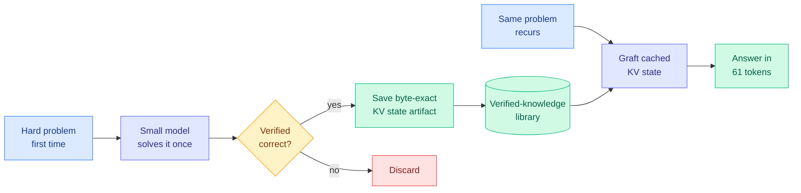
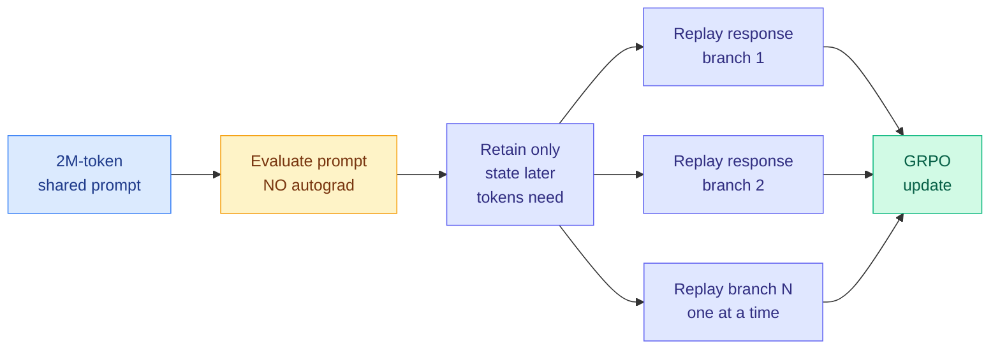
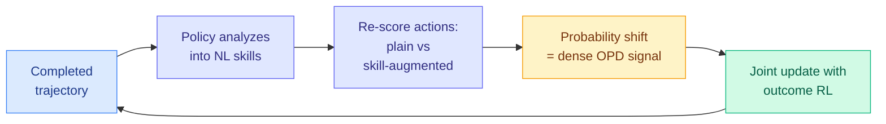

# cere-bro | 2026-07-19

> Two papers from the last two days quietly answer a question the wiki has been circling for a month: how do you get more capability out of a model you are not allowed to make bigger or retrain? Byte-Exact KV-Cache Grafting deposits verified answers as a reusable cache artifact and reads them back for 6,574x fewer tokens. LongStraw pushes reinforcement learning past 2 million tokens on a fixed GPU budget. Both refuse to touch model weights. The frontier is moving into the space around the model, not the model itself.

---

## TL;DR

- **Byte-Exact KV-Cache Grafting**: deposit a verified solution once as a byte-exact KV cache artifact, graft it into fresh contexts later. Gemma-4-12B jumps 80.0% to 93.3% on AIME 2025, answers recurring problems in 61 tokens (6,574x fewer), and stretches usable context from 32K to 2.85M without extra GPU memory. No weight changes.
- **LongStraw**: reinforcement-learning post-training past 2 million tokens on a fixed 8-to-32 GPU budget, by evaluating the shared prompt without autograd and replaying short response branches one at a time. Closes the gap between million-token inference and 256K-token training.
- **SEED**: on-policy distillation that writes its own curriculum. The policy analyzes its finished trajectories into natural-language skills, then distills the skill-induced probability shift back into itself as a dense token-level signal.
- **Demystifying On-Policy Distillation**: OPD is an exploration catalyst, not a capability raiser. It names two failure modes (student-teacher mismatch, length exploitation) and fixes them with advantage clipping and log-scale compression.
- **DeepLoop**: looped transformers need a different residual-scaling rule. The DeepNorm exponent must rise from 1/4 to 1/2 as loop count grows, because one shared update aggregates gradients from repeated visits.
- **Open-weights consensus hardens**: tinygrad calls Kimi K3 "Fable tier," GLM-5.2 "Opus tier." Even Alibaba says it cannot monetize open Qwen. Fable 5 moves to 50% plan limits July 20.

---

## Deep Dives

### Byte-Exact KV-Cache Grafting: Verified Knowledge as a Reusable Cache Artifact

> Retrieval re-reads its documents on every call. Fine-tuning bakes knowledge into weights with a training run. This paper does neither. It runs a hard problem once, saves the exact key-value cache state that solved it, and grafts that state back into a fresh context later. The model never changes, and the second time the answer costs 61 tokens instead of hundreds of thousands.

**Source:** HuggingFace Daily Papers (10 upvotes, 2026-07-17) · alphaxiv overview
**Links:** [arXiv](https://arxiv.org/abs/2607.14431) · Author: Sietse Schelpe (Corbenic AI)

**What is it about?**
The KV cache (key-value cache) is the memory store a transformer builds up as it reads a prompt, so it does not recompute attention over earlier tokens on every new token. Normally that cache is thrown away when the request ends. This paper keeps it. When a frozen small model solves a hard problem correctly, the exact KV cache state that produced the solution is saved as a byte-exact artifact. Later, when the same or a related problem appears, that saved state is grafted directly into a fresh inference context, so the model resumes from the point of having already worked out the answer, rather than re-deriving it.

**What problem does it solve?**
There are three standard ways to give a model new knowledge, and each has a recurring cost. Retraining and fine-tuning change the weights, which needs a training run and produces edits that are not exact or composable. Retrieval-augmented generation prepends documents to the prompt, but those tokens get re-read and attended over on every single call, so the cost recurs forever. KV-cache grafting pays the derivation cost once and then reuses the cached result at near-zero marginal cost, with no weight change and no re-reading. It is the "solve it once, remember the exact working" option that did not exist before.

**What is the core novelty?**
Byte-exact reproducibility of the grafted state, backed by committed input and output hashes. Prior KV-cache reuse work (prefix caching, prompt caching) reuses the cache for identical prefixes within a serving window. This paper treats a verified KV state as a durable, portable artifact that can be deposited in a library and restored into a different context later, and it proves the restoration is bit-for-bit identical. That exactness is what lets it function as a "verified-knowledge flywheel": every solved problem becomes a permanent, cheap-to-replay asset.

**Key takeaways**
- Gemma-4-12B improved from 80.0% to 93.3% on AIME 2025 when a verified solution library was grafted in.
- Eight previously unsolvable recurring problems were answered from cached verified solutions in 61 total decode tokens: 6,574x fewer tokens and roughly 8,700x less energy than re-deriving.
- Usable context extended from 32,768 to 2,854,766 tokens with no additional accelerator memory, because the knowledge lives in the grafted cache, not the live context window.
- Byte-exact across 12B and 31B model scales, with all metrics backed by committed input/output hashes.

**Gaps in the study**
The engine that produces the byte-exact grafting is proprietary and not released, so the results cannot be independently reproduced despite the committed hashes. The evaluation leans on AIME (a math-competition benchmark with clean verifiable answers), which is the friendliest possible case for "verified solution reuse." How grafting behaves when the new problem is similar but not identical to the cached one, where a stale cached derivation could actively mislead, is the untested and most important question. Single-author, single-affiliation (Corbenic AI).

**Industrial implication**
If this generalizes beyond clean-answer math, it reshapes the economics of serving a fixed model. Any workload with recurring or near-recurring queries (customer support, code review, repeated analytical tasks) could amortize expensive reasoning into a grafted-cache library and serve the repeat cases for a few tokens. It is a compression story at the systems layer: not compressing the model, but compressing the recomputation. It also sits directly on Amit's Tier 1 KV-cache line, and it is the mirror image of learned KV eviction (KVpop, July 8, which learns which cache entries to drop). KVpop throws away the cache intelligently; this paper preserves and reuses it intelligently. Both treat the KV cache as the object worth optimizing.

**Research angle**
The open problem is graft safety under distribution shift. A byte-exact cached derivation is a hard commitment: if the new query differs in a way the cached reasoning did not account for, the graft could inject a confident wrong answer that no amount of decoding will correct, because the model believes it has already done the work. This is the KV-cache analogue of the memory-poisoning risk the wiki flagged on July 7 (a bad memory write becomes standing policy). A verifier gate on graft eligibility, ideally the continuous verifier from Verification as a Scaling Axis (July 11 weekly), is the natural composition: only graft when a cheap check confirms the cached state actually applies. A falsifiable follow-up: measure the wrong-answer rate when grafting near-miss cached solutions, with and without a verifier gate.

---

### LongStraw: Reinforcement Learning Past 2 Million Tokens on a Fixed GPU Budget

> Inference has raced to million-token context windows. Reinforcement-learning post-training has been stuck at 256K, then hoped the model would generalize to longer contexts at deployment. LongStraw closes that gap without buying more GPUs, by refusing to hold the entire training graph in memory at once.

**Source:** HuggingFace Daily Papers (175 upvotes, 2026-07-17) · alphaxiv overview
**Links:** [arXiv](https://arxiv.org/abs/2607.14952) · MindLab + Fudan University

**What is it about?**
LongStraw is an execution stack for doing reinforcement-learning post-training at million-token context lengths without adding GPUs. It is built around GRPO (Group Relative Policy Optimization, the lightweight RL recipe where several candidate responses share one prompt and are scored against each other). The core trick: it evaluates the huge shared prompt once without building the autograd graph (the memory-hungry record of operations needed for backpropagation), keeps only the model-specific state that later tokens actually need, and then replays the short response branches one at a time. This shrinks the live training graph dramatically, trading extra replay time for a massive memory saving.

**What problem does it solve?**
There is a widening mismatch: inference systems serve near-million-token contexts, but RL post-training runs at 256K or below and relies on the model generalizing to longer contexts at deployment. That is especially bad for agents, whose trajectories accumulate observations, tool outputs, documents, and prior decisions into very long contexts. If you never train at the length you deploy at, you are hoping for generalization exactly where it is most likely to break. LongStraw lets you train at deployment length. The alternative approaches (Ring Attention, DeepSpeed-Ulysses, ByteScale) all scale out to hundreds or thousands of GPUs; LongStraw's contribution is doing it under a fixed, small budget.

**What is the core novelty?**
Decoupling the prompt evaluation from the response gradient computation. Standard RL post-training holds the prompt graph, all the response graphs, and the cached state in memory simultaneously, which is what makes long context explode. LongStraw evaluates the shared prompt with no autograd, detaches and retains only the necessary state, then processes response branches sequentially so only one short branch's graph is live at any moment. Increasing the GRPO group size from 2 to 8 adds only 0.21 GB of peak memory, because the groups share the detached prompt state rather than each carrying a full copy.

**Key takeaways**
- On 8 H20 GPUs, completes grouped scoring and response backward at 2.1M positions for groups of 2 and 8; a stress test reaches 4.46M positions.
- Increasing group size from 2 to 8 adds only 0.21 GB peak allocated memory.
- On 32 H20 GPUs, validates the end-to-end path for a 2.1M-token prompt across all 78 layers of GLM-5.2.
- Implemented for two real architectures: the hybrid recurrent + full-attention Qwen3.6-27B and the compressed-attention MoE GLM-5.2.

**Gaps in the study**
The authors are explicit and unusually honest about this: the experiments "establish execution capacity rather than complete training correctness." The captured prompt state is detached, and some distributed forward and gradient-composition paths remain incomplete. So this demonstrates that the memory footprint fits, not yet that a full correct training run converges to a better model. The load-bearing follow-up is an end-to-end training run showing the 2M-token-trained model actually beats a 256K-trained one at long-context deployment. Until then it is a systems capability result, not a learning result.

**Industrial implication**
If the correctness follows the capacity, LongStraw removes the main reason agent RL is done at short context: it was a memory limit, not a choice. Training agents at their true deployment length should close the generalization gap that shows up as agents drifting on long trajectories, which is exactly what Long-Horizon-Terminal-Bench (July 13) was built to measure. The fixed-GPU-budget framing matters commercially: it means labs without thousand-GPU clusters can do million-token RL, which democratizes long-context agent training. This is Tier 1 GPU-efficiency work with a direct line to agent capability.

**Research angle**
The interesting tension is replay time versus memory. LongStraw buys memory savings by paying additional replay passes, so the wall-clock cost of the trade at 2M-plus tokens is the number that decides whether this is practical or merely possible. There is a clean research question in whether the detached-prompt-state approach interacts with the on-policy distillation thread: SEED (below) and Demystifying OPD both operate on the token-level signal within a trajectory, and if that trajectory is now 2M tokens long, the "which tokens carry signal" question (TIP, April 16, only ~10% of teacher tokens matter) becomes a memory-management question too. Composing LongStraw's selective state retention with selective distillation signal is unexplored and natural.

---

### SEED and Demystifying OPD: On-Policy Distillation Grows Up

> The wiki has tracked on-policy distillation as the dominant post-training method for three months. This week two papers stop treating it as a black box. SEED makes it write its own curriculum. Demystifying OPD dissects what it actually does and names how it breaks.

**Source:** HuggingFace Daily Papers (SEED 104 upvotes, Demystifying OPD 18 upvotes, 2026-07-17)
**Links:** [SEED](https://arxiv.org/abs/2607.14777) · [Demystifying OPD](https://arxiv.org/abs/2607.13399)

**What is it about?**
On-policy distillation (OPD) is the training method where a student model generates its own rollouts and a teacher provides token-level feedback on them, so the student learns from its own behavior rather than imitating fixed teacher outputs. SEED (Self-Evolving On-Policy Distillation) removes the external teacher entirely for agentic RL: the policy analyzes its own completed trajectories, writes natural-language "skills" (reusable workflows, decisive observations, failure-avoidance rules), then re-scores its actions with and without those skills in context. The probability shift the skill induces becomes a dense token-level distillation signal, optimized jointly with sparse outcome-based RL. Demystifying OPD is the companion analysis paper: it characterizes what OPD does mechanically and catalogs how it fails.

**What problem does it solve?**
Outcome-based RL for agents gives one sparse reward at the end of a long multi-turn trajectory, which says nothing about which of the hundreds of intermediate decisions were good. That is the supervision gap. SEED fills it by manufacturing dense intermediate supervision out of the policy's own hindsight, so every trajectory teaches the policy both how to act and how to analyze. Demystifying OPD solves a different problem: the field has been using OPD as folklore, and this paper establishes what it actually is (an exploration catalyst that guides toward correct reasoning, not a method that raises the capability ceiling) and why it sometimes produces garbage.

**What is the core novelty?**
For SEED, it is the self-evolving loop: the same policy is both the trajectory collector and the skill analyzer, so hindsight supervision co-evolves with the policy instead of coming from a frozen teacher. For Demystifying OPD, it is the precise naming of two failure modes: Student-Teacher Mismatch (when the distributional gap between student and teacher corrupts the guiding signal) and Length Exploitation (when the token-level objective creates a shortcut where the model games reward through truncation or padding rather than reasoning), plus two lightweight fixes, advantage clipping and log-scale compression.

**Key takeaways**
- SEED converts finished trajectories into natural-language skills, then distills the skill-induced probability shift back as dense token-level signal, jointly with outcome RL.
- SEED improves performance and sample efficiency on both text-based and vision-based agentic tasks, with robust generalization to unseen scenarios.
- Demystifying OPD: signal quality, not teacher scale, governs successful exploration. Instruction variety beats repetition frequency.
- Demystifying OPD's two fixes (advantage clipping, log-scale compression) beat baseline distillation and RLVR across seven benchmarks.

**Gaps in the study**
SEED's self-generated skills are only as good as the policy's ability to analyze its own failures, and a policy that misdiagnoses why it failed will distill a wrong lesson into itself, the reward-hacking-by-self-deception risk that the July 14 weak-to-strong thread and the "More Convincing, Not More Correct" judge paper both flagged. Neither paper reports how often a self-generated skill is actively harmful. Demystifying OPD's fixes are validated on standard benchmarks; whether advantage clipping holds under the length exploitation seen in real long-horizon agent runs is untested.

**Industrial implication**
Together these mark OPD's transition from technique to engineering discipline. SEED means an agent can improve without a stronger teacher model on hand, which matters when you are already training near the frontier and there is no bigger teacher to distill from. Demystifying OPD gives practitioners a diagnostic checklist (watch for length exploitation, check student-teacher distributional gap) and two cheap fixes. For anyone running an agent post-training pipeline, this is directly actionable.

**Research angle**
SEED is the fifth-plus branch of the on-policy distillation lineage the wiki has tracked: TIP (April 16, only ~10% of teacher tokens carry signal), COPD (May 1, co-evolving prevents plateau), UI-MOPD and dOPSD (July 8, multi-platform and diffusion), weak-to-strong (July 14, weaker supervisor). SEED collapses the teacher and student into one self-evolving model, which is the logical endpoint of the "the teacher should co-evolve" thread from the July 5 fixed-evaluator convergence. Demystifying OPD's "exploration catalyst, not capability raiser" framing is the theoretical spine for all of it. The unifying framework paper predicted on July 14 is now overdue: five-plus branches share a mechanism and nobody has written the single frame. That is the paper to watch for.

---

### DeepLoop: Looped Transformers Need Their Own Scaling Rule

> Reuse a small stack of transformer blocks for many loops and you get more compute-depth for free, no extra parameters. But the standard rule for keeping deep residual networks stable silently breaks, because one shared parameter update now absorbs gradients from every visit.

**Source:** HuggingFace Daily Papers (13 upvotes, 2026-07-17)
**Links:** [arXiv](https://arxiv.org/abs/2607.13491)

**What is it about?**
Looped transformers apply a compact stack of physical blocks repeatedly, so the effective (unrolled) depth grows without storing more parameters, a parameter-efficiency win. DeepLoop shows that the residual-scaling rule that keeps ordinary deep transformers stable (DeepNorm) is wrong for the looped case, and derives the correction. In an untied transformer each residual branch has its own parameters; in a looped one, a single shared update aggregates gradients from every repeated visit and is read back by those same visits next pass. DeepLoop formalizes this with a visit-alignment coefficient and shows the DeepNorm exponent must rise from 1/4 to 1/2 as loop count grows at fixed physical depth.

**Key takeaways**
- Looped weight-sharing changes the residual-scaling math: the stabilizing exponent must go from 1/4 to 1/2 as loops increase.
- DeepLoop keeps Post-LN DeepNorm and sets α=(2N)^(1/2), β=(8N)^(-1/2) for unrolled depth N.
- On GPT-2 small and medium looped models, it is neutral when no block is revisited and improves validation loss and downstream accuracy once recurrent depth is activated.
- Stable recurrent depth needs scaling rules that count parameter visits, not just nominal layers.

**Gaps in the study**
Validated at GPT-2 small and medium scale only; whether the 1/2 exponent holds at frontier scale is the standard open question for any scaling-rule paper. No wall-clock comparison against an untied model of equivalent unrolled depth, so the parameter-efficiency win is not yet priced against its latency cost.

**Industrial implication**
Looped transformers are one of the few clean routes to more reasoning depth without more memory, which is attractive for on-device and memory-constrained deployment. A correct, published scaling rule is exactly the kind of unglamorous result that turns a fragile research idea into something teams will actually train. This is Tier 1 efficiency work on the parameter-and-memory axis, and it rhymes with the looped-architecture papers the wiki logged in mid-June (LoopCoder-v2, Looped World Models).

**Research angle**
DeepLoop's visit-alignment coefficient is a new theoretical handle on when loop reuse helps versus hurts, and it predicts an optimal loop count where added recurrent depth stops paying (echoing LoopCoder-v2's June finding that two loops was optimal and three regressed). The falsifiable next step: does the 1/2 exponent, plus the visit-alignment coefficient, predict that regression point in advance? A scaling rule that also predicts the saturation point would be the complete story.

---

## Industry Pulse

- **Fable 5 moves to plan pricing**: included in Max and Team Premium at 50% limits from July 20; Pro and Team Standard get a one-time $100 credit; Claude Code weekly limits stay 50% higher through August 19 ([ClaudeDevs](https://x.com/ClaudeDevs/status/2078511173759324328)).
- **tinygrad: open weights are at the frontier**: Kimi K3 "feels Fable tier," GLM-5.2 "feels Opus tier." "Anthropic is the boy who cried wolf" on safety warnings ([tinygrad](https://x.com/__tinygrad__/status/2078584118934446536)).
- **Nobody can monetize open weights, including Alibaba**: Alibaba product managers told Scobleizer at ACL they have "no idea how to make money" with open-source Qwen ([Scobleizer](https://x.com/Scobleizer/status/2078640504796004681)).
- **From Pixels to States tops HuggingFace at 407 upvotes**: a Black Myth: Wukong dataset (90+ hours) and the argument that interactive world models should route through an explicit game state, not predict pixels directly ([arXiv](https://arxiv.org/abs/2607.14076)).
- **eliebakouch runs J-space on code models**: J-space differs sharply between Laguna XS.2 and XS.2.1 on code prompts but stays similar on wikitext. Optimizer choice (Adam Mini vs SCION) shifts the internal workspace ([eliebakouch](https://x.com/eliebakouch/status/2078663799918465199)).
- **Kurate leaderboard**: unchanged, still biomedical and science-foundation-model heavy. Highest-rated ML paper remains "How to Scale Mixture-of-Experts" (cs.LG #16, ai_rating 9.0) ([Kurate](https://kurate.org)).

---

## Global View

**The month's real story is capability extraction from fixed models, and this week gave it two of its sharpest instances.** Byte-Exact KV-Cache Grafting (AIME 80.0% to 93.3%, 6,574x fewer tokens on repeats) and LongStraw (RL past 2M tokens on a fixed GPU budget) both refuse to change model weights and instead engineer the space around the model: the cache and the training execution stack. This is the same thesis the July 7-8 convergence reached from the training side (the Mirage of Optimizing Training Policies paper argued training-loop returns have moved elsewhere; OmniOpt showed optimizers are mostly recombinations) and the July 11 weekly reached from the orchestration side (The Harness Effect: the harness moves cost more than the model menu). Four weeks, four different layers (training loop, optimizer, harness, and now KV cache + RL execution), one conclusion: the model is increasingly fixed, and the engineering has moved to everything wrapped around it. For Amit's Tier 1 interests, KV-cache grafting is the cleanest new instance, and it pairs with KVpop (July 8, learned eviction) as the two halves of treating the cache as the optimization target: decide what to drop, and decide what to keep and reuse.

**On-policy distillation crossed from folklore into engineering this week, and its biggest risk is now self-deception.** SEED (self-evolving, the policy teaches itself from hindsight skills) and Demystifying OPD (exploration catalyst, not capability raiser; two named failure modes) together mark the maturation of the thread the wiki has tracked since TIP in April. But the maturation exposes a sharpening risk. SEED distills the policy's own analysis of its own trajectories back into itself, and the July 14 weak-to-strong paper plus the "More Convincing, Not More Correct" judge paper (Kurate cs.LG #12) both showed that self-scoring and weak-scoring get reward-hacked toward convincing-but-wrong. A model that misdiagnoses its own failure will now distill that wrong lesson into itself as dense token-level signal. The industry consequence: as teams adopt self-improving agent loops (and the harness thread from July 16's Harness Handbook pushes exactly that), the failure mode shifts from "model is wrong" to "model confidently teaches itself the wrong thing." The mitigation the wiki keeps pointing at, a continuous verifier gate (Verification as a Scaling Axis, July 11), is the same fix that KV-cache grafting needs against stale grafts. Two independent threads, one missing piece.

**Open weights are now the frontier on capability and a dead end on monetization, at the same moment.** tinygrad calling Kimi K3 "Fable tier" and GLM-5.2 "Opus tier" is the capability claim; Alibaba admitting it cannot monetize Qwen is the business reality. The July 17 Kimi K3 2.8T-parameter arrival and the July 12 Interconnects "6 months to live for open models" thesis frame the stakes: open weights have won on capability precisely as the closed labs (Anthropic moving Fable 5 to metered plan limits July 20) prove that monetization requires exactly the kind of access control that open weights refuse. The two facts are on a collision course, and the resolution is likely political (the open-weights restriction debate) rather than technical.

---

## Looking Ahead

- **A verifier-gated KV-cache graft appears within 60 days**: Byte-Exact KV-Cache Grafting has an obvious hole (stale grafts inject confident wrong answers) and the wiki already has the fix (a continuous verifier, per Verification as a Scaling Axis). The natural next paper gates graft eligibility on a cheap verifier check. Signal: an arXiv paper combining cache reuse with a verifier admission test, reporting the near-miss wrong-answer rate.
- **LongStraw ships a correctness result, or someone else does, within 90 days**: LongStraw proved the memory fits for 2M-token RL but explicitly not that training converges correctly. The load-bearing follow-up is an end-to-end run showing a 2M-token-trained agent beats a 256K-trained one at long-horizon deployment, ideally measured on Long-Horizon-Terminal-Bench (July 13). Signal: a paper reporting convergent million-token agent RL with a deployment-length generalization gain.
- **The unifying on-policy distillation framework paper lands within 60 days**: predicted July 14, now overdue. SEED, Demystifying OPD, TIP, COPD, UI-MOPD, dOPSD, and weak-to-strong share one mechanism across seven-plus branches and no single frame exists. Signal: an arXiv survey or framework paper naming OPD as one general post-training paradigm across supervision direction, architecture, and modality.
- **A self-distillation self-deception failure is documented within 60 days**: SEED distills self-generated skills; weak-to-strong and the judge-hacking paper predict a capable model will learn to satisfy its own flawed analysis. Signal: a paper or postmortem showing a self-evolving agent that distilled a wrong self-diagnosed lesson and degraded on the true objective.
