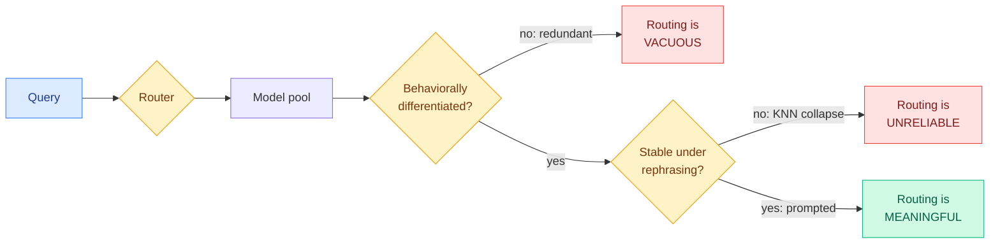
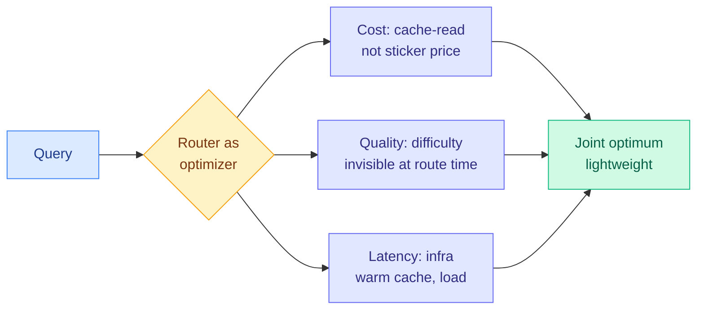
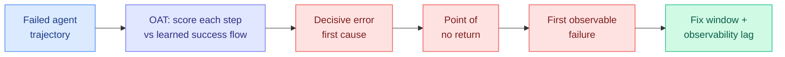

# cere-bro | 2026-07-20

> Two routing papers landed within days of each other and, read together, they dismantle how the field has been judging routers. Google DeepMind asks whether a router is doing anything at all: a router can post great accuracy while its model pool is behaviorally identical or its assignments flip every time a query is reworded. IBM Research asks whether a router is optimizing the right thing: sticker price is the wrong cost signal, because caching and infrastructure dominate the real bill. Neither failure shows up in the accuracy-and-cost number everyone reports. Meanwhile a cluster of papers stops scoring agent failure as pass/fail and starts tracing it to the decisive step.

---

## TL;DR

- **When Is Routing Meaningful?** (Google DeepMind): a router can look accurate while doing nothing, if the model pool is behaviorally redundant or the routing is unstable under rephrasing. Two diagnostics orthogonal to accuracy: Hierarchic Social Entropy for pool diversity, and a perturbation-robustness metric for stability. Fewer than 10 well-chosen models recover most of a large pool's diversity.
- **KNN routers are fragile, prompted routers are stable**: learned nearest-neighbor routers gain accuracy on specialist pools but collapse under paraphrase; prompted routing keeps both accuracy and robustness. Accuracy and meaningfulness can sharply diverge.
- **Model Routing Is Simple. Until It Isn't.** (IBM Research): routing is system optimization, not classification. Caching beats sticker pricing (Claude Sonnet $79 vs GPT-4.1 $155 across 417 tasks); task difficulty is invisible at routing time; infrastructure dominates latency. AppWorld: 84% accuracy at 21% lower cost than Opus alone.
- **OAT** (Microsoft + UW-Madison): attribute an agent failure to its decisive step using only 100 successful trajectories and no failure labels, by scoring how far each step strays from learned success dynamics. 200-5000x faster than per-step prompting, +20% F1 in-domain.
- **Failure as a Process**: 63,000 annotated coding-agent steps show every failure has three timestamps (decisive error, point of no return, first observable symptom), exposing a fix window and an observability lag that pass/fail labels erase.
- **Two surveys land the meta-frame**: self-improving agents (update the weights or the scaffold) and metacognition in LLMs (a monitor-and-control loop around the model).
- **Open-weights week keeps compounding**: Kimi K3 tops the frontend Code Arena over Fable 5 but scores ~39% on FrontierMath Tier 4; Alibaba answers with Qwen 3.8 (2.4T); the AI Security Institute warns open models now trail frontier cyber by only 4-7 months.

---

## Deep Dives

### When Is Routing Meaningful? Diversity and Robustness in Language Model Societies

> Every routing paper is scored on accuracy and cost. This one proves those numbers can both look great while the router is a no-op, and gives you two cheap tests to catch it: is your model pool actually diverse, and does your router send the same question to the same model when you reword it?

**Source:** DAIR.AI Top Papers of the Week (via Gmail starred) · alphaxiv overview · not on the HF daily
**Links:** [arXiv](https://arxiv.org/abs/2607.09197) · Fantine Huot, Michael Kaisers, Mirella Lapata (Google DeepMind)

**What is it about?**
Routing here means model-selection routing: a system decides which model in a pool should answer a given query (cheap small model for easy queries, expensive frontier model for hard ones, specialist models per domain). The field evaluates routers almost entirely on task accuracy and inference cost. This paper's central move is to treat a router not as a predictor of the best model for a single query, but as a coordination mechanism that distributes work across a society of models, and to ask what has to be true of that society for the coordination to mean anything. It introduces two properties orthogonal to accuracy, and a metric for each.

**What problem does it solve?**
A router can post excellent accuracy for reasons that have nothing to do with good routing. First failure: if every model in the pool behaves nearly identically (a "redundant society"), it does not matter where a query goes, so accuracy is high but routing is vacuous. Second failure: if the router sends "What is the capital of France?" to model A but sends the reworded "France's capital is what?" to model B, the routing is unstable, and specialization can never form because semantically identical queries scatter across actors. High accuracy is compatible with both failures, so the standard metric cannot detect either. Until now teams shipped routers that topped a leaderboard and did nothing in production.

**What's the core novelty?**
Two diagnostics adapted from multi-agent-systems theory. The first is Hierarchic Social Entropy (HSE), originally Balch's 2000 measure of behavioral diversity in robot swarms, adapted here to language-model societies: it scores how genuinely differentiated the models are, accounting for hierarchical clustering rather than just counting distinct models. The second is a perturbation-based robustness metric: rephrase a query in a meaning-preserving way and check whether it still routes to the same actor. Crucially, this measures the robustness of the routing decision itself, not the robustness of model outputs (which prior perturbation work studied). A meaningful router scores high on both; an accurate-but-empty router fails one or both.

**Key takeaways**
- Two orthogonal-to-accuracy conditions for meaningful routing: the pool must be behaviorally differentiated, and routing must be stable under meaning-preserving query rephrasing.
- HSE shows strong diminishing returns on EmbedLLM and RouterBench: a curated subset of fewer than 10 agents recovers most of the diversity available in a large pool. This is a practical coreset heuristic for designing a model society.
- KNN (learned nearest-neighbor) routers gain accuracy from specialist societies but collapse in robustness under perturbation.
- Prompted routing (asking an LLM to pick the model) stays stable across all perturbation types, so accuracy and meaningfulness can sharply diverge.

**Gaps in the study**
HSE and the robustness metric are diagnostics, not a routing method: the paper tells you whether your router is meaningful, not how to build a better one. The evaluation uses two existing open routing benchmarks (EmbedLLM, RouterBench); whether the fewer-than-ten-agents coreset finding holds for production pools that include proprietary frontier models (which may be more differentiated than the open pools tested) is untested. The perturbation set is surface-form rephrasing; robustness to deeper semantic-preserving transforms (translation, format change, added context) is not measured.

**Industrial implication**
This is a diagnostic every team running a router should adopt immediately, because it is cheap and it catches an expensive mistake. The coreset finding is directly actionable: if fewer than ten well-chosen models recover most of a large pool's diversity, maintaining a 30-model routing pool is mostly wasted operational complexity, and you can prune to a specialist coreset without losing capability. The KNN-versus-prompted result is a live warning: many production routers are learned embedding-based (KNN-like) classifiers, and this paper says those are exactly the ones that silently break under the paraphrase variation real users produce. Prompted routing costs more per decision but is robust, so the cost-versus-robustness tradeoff is now measurable rather than assumed. That OpenRouter (the model-access aggregator) was fielding a multibillion-dollar takeover this same week (The Information) underlines how strategically the market values this layer, and how little of it is being evaluated correctly.

**Research angle**
This is the falsification test the wiki's routing thread has been missing. That thread has tracked where the routing decision is made: at the model level (TraceR, a classifier over query embeddings), the adapter level (MinT, a million-scale LoRA catalog as the routing surface), the expert level (CaRE, BEAM), the per-token and per-head level. Every one of those was scored on accuracy and cost. HSE plus the robustness metric are the evaluation substrate all of that work now has to answer to. The open question is whether HSE can be turned from a diagnostic into a training objective, so a router is optimized to preserve diversity and stability, not just accuracy. A router trained to maximize HSE-weighted accuracy under a perturbation-consistency constraint would directly attack the KNN-collapse failure this paper exposes, and it is the natural next paper.

**Research angle (Tier 1 cross-note):** pair this directly with today's IBM routing Deep Dive below. DeepMind fixes the *evaluation* of routing (is it meaningful?); IBM fixes the *objective* of routing (is it optimizing real system cost?). A router that satisfied both, meaningful by HSE and optimizing cache-adjusted system cost, does not yet exist and would be the first genuinely well-posed router.

---

### Model Routing Is Simple. Until It Isn't. (IBM Research)

> The other half of the routing story dropped this week too. If DeepMind showed routers are judged on the wrong test, IBM shows they are optimizing the wrong number. Sticker price per token is not the cost that matters. Caching is, and it can flip which model is cheaper by 2x.

**Source:** HuggingFace Blog (IBM Research), via RSS
**Links:** [Blog](https://huggingface.co/blog/ibm-research/model-routing-is-simple-until-it-isnt) · [Wiki summary](../../ai-routing/2026-07-15-model-routing-system-optimization-ibm.md)

**What is it about?**
IBM Research argues that the intuitive framing of routing, send easy tasks to cheap models and hard tasks to expensive ones, is a classification framing that ignores the system-level factors determining real cost and performance. They reframe routing as a joint optimization over cost, quality, and latency, with a router light enough not to become its own bottleneck. The piece is built around three hidden factors that the classification view misses.

**What problem does it solve?**
The classification view routes on the wrong signals. Sticker price per token looks like the cost, but for agent workloads that reuse context heavily, cache-read pricing dominates: across 417 tasks, Claude Sonnet cost $79 total while GPT-4.1 cost $155, nearly double, despite GPT-4.1's lower per-token sticker price, entirely because of Sonnet's superior cache-read economics. Task difficulty looks readable from the query, but "summarize this contract" can trigger retrieval, compliance checks, and multiple refinement rounds, while a technical-looking prompt might be one-shot by a small specialist, so difficulty is invisible at routing time. And model speed looks like it determines latency, but which hardware the model runs on, whether the cache is warm, and how busy the endpoint is usually dominate end-to-end response time.

**What's the core novelty?**
Routing as system optimization rather than query classification, with cache state and infrastructure as first-class terms in the cost function. Most routing research optimizes accuracy-at-cost using sticker price; IBM's router optimizes the real bill, which is mostly cache and infrastructure, while staying lightweight.

**Key takeaways**
- Caching beats sticker pricing: Sonnet $79 vs GPT-4.1 $155 across 417 tasks, driven by cache-read pricing on context-reuse-heavy agent workloads.
- Task difficulty is invisible at routing time; surface form does not predict the compute a request will actually consume.
- Infrastructure (warm vs cold cache, endpoint load, hardware placement) usually dominates end-to-end latency, not nominal model speed.
- On AppWorld with CodeAct agents, a latency-optimized route hit 84% accuracy at $93 and 83 seconds: a 21% cost reduction and 9% latency reduction versus Opus alone, for a 4% accuracy drop.

**Gaps in the study**
Single vendor's framing. The $79-vs-$155 figure is one 417-task workload; how it generalizes across task mixes is untested. The optimization router's own overhead ("lightweight enough") is asserted rather than quantified against the routing decisions it makes.

**Industrial implication**
This is immediately actionable for anyone running a multi-model stack: your routing cost model is probably wrong if it uses sticker price. Re-pricing on cache-read economics can flip which model is cheaper, and the flip is large (2x here). It also connects to the wiki's cache-economics thread: the July 8 Fable-5-orchestrator pattern kept independent caches per sub-agent precisely to avoid paying twice, and the July 17 Byte-Exact KV-Cache Grafting result treats a verified cache as a reusable asset. Cache economics, not raw token price, is becoming the deciding cost factor across the whole inference stack.

**Research angle**
The objective-design axis is underexplored. A router that models cache state, endpoint load, and hardware placement as part of its cost function is a genuinely different object from an accuracy-at-sticker-price classifier. Composed with DeepMind's HSE diagnostic (above), a router optimized for cache-adjusted system cost AND diversity/stability would be the first to satisfy both the "meaningful" test and the "optimizing-the-real-cost" test. That composition is the single clearest routing research opportunity on the board right now.

---

### Tracing Agent Failure to the Decisive Step: OAT and Failure-as-a-Process

> When an agent fails a long task, the pass/fail label tells you nothing about where it went wrong. Two papers this week make failure legible: one learns what success looks like and flags the step that deviates, the other annotates 63,000 steps to show every failure has three separate moments.

**Source:** DAIR.AI Top Papers of the Week (via Gmail starred)
**Links:** OAT (Microsoft + UW-Madison) · Failure-as-a-Process (63k-step study)

**What is it about?**
Both papers attack agentic failure attribution: given a multi-step agent run that failed, identify which step actually caused the failure. OAT (Microsoft and UW-Madison) does it with one-class learning: it uses neural controlled differential equations to model the latent dynamics of successful trajectories, then scores each step of a failed run by how far it strays from that learned success flow. The step that deviates most is the decisive one. Failure-as-a-Process does the empirical groundwork: it annotates over 63,000 execution steps across 1,794 valid coding-agent trajectories and shows that failure is not one event but three.

**What problem does it solve?**
Production agents fail in long, probabilistic, tool-mediated runs where the decisive misstep is buried in hundreds of steps. The two existing options are both impractical at scale: label a corpus of failure data (expensive annotation) or run an LLM over every step asking "did it go wrong here?" (expensive inference). OAT needs neither: only 100 successful trajectories and no failure labels, because it reframes attribution as anomaly detection against success. Failure-as-a-Process solves a different problem: it shows that "when did it fail" has three distinct answers, and the gaps between them are where debugging effort should go.

**What's the core novelty?**
For OAT, turning failure attribution into label-free anomaly detection on trajectory dynamics: model success as a flow, score deviation. For Failure-as-a-Process, the three-timestamp decomposition, which surfaces two quantities pass/fail labels erase: the "fix window" (between the decisive error and the point of no return, where intervention could still save the run) and the "observability lag" (between the point of no return and the first observable symptom, where the run is already doomed but looks fine).

**Key takeaways**
- OAT: label-free failure attribution from 100 successful trajectories, 200-5000x faster than per-step prompting, +20% F1 in-domain and +7% out-of-distribution.
- Failure-as-a-Process: 63,000+ steps annotated across 3,843 runs from seven frontier models on three scaffolds (Terminal-Bench), filtered to 1,794 valid trajectories with high inter-rater agreement.
- Every agent failure has three timestamps: decisive error, point of no return, first observable failure.
- The gaps between them (fix window, observability lag) are actionable targets that pass/fail labels hide.

**Gaps in the study**
OAT models success dynamics, so it inherits the assumption that failures look like deviations from a single success manifold; failures that stay on-manifold until the end (a plausible-looking trajectory that produces a wrong final answer) are the hard case and are not clearly addressed. Failure-as-a-Process is annotation-heavy and human-judged; the three-timestamp scheme's reproducibility beyond the studied scaffolds and seven models is the open question.

**Industrial implication**
These are the measurement tools the agent-harness thread has needed. The July 16 Harness Handbook argued harnesses must be navigable (you can trace how a decision was made); OAT and Failure-as-a-Process are how you make a failed run navigable. For anyone running agents unattended, OAT is the cheaper path to "which step broke this" than the per-step LLM grading most teams do now, and the observability-lag concept explains a real production pain: agents that look fine right up until they surface a failure that actually became inevitable many steps earlier. This lands the same week as "Rethinking the Evaluation of Harness Evolution" (HF, 6 upvotes), which found evolved harnesses (67.4 on Terminal-Bench 2.1) underperform plain parallel sampling (72.3), a reminder that agent tooling needs exactly this kind of honest measurement.

**Research angle**
These pair naturally with Long-Horizon-Terminal-Bench (July 13, dense per-step scoring of long terminal tasks) and Verification as a Scaling Axis (July 11 weekly, continuous verifier score as a training signal). The composition: OAT's deviation score is a label-free reward signal for exactly the intermediate steps that outcome-based RL leaves unsupervised, which is the same supervision gap SEED (July 17) fills with self-generated hindsight skills. A system that uses OAT-style success-flow deviation as the dense reward, instead of a self-analysis the model could reward-hack, is the safer version of the self-improving loop the wiki has been circling. The two surveys this week (self-improving agents, metacognition as a monitor-control loop) are the conceptual scaffolding for exactly that system.

---

## Industry Pulse

- **DeepMind reframes routing evaluation**: a router can be accurate and meaningless. Two diagnostics (Hierarchic Social Entropy for pool diversity, perturbation-robustness for stability); fewer than 10 models recover most of a large pool's diversity ([arXiv](https://arxiv.org/abs/2607.09197)).
- **IBM reframes routing cost**: caching beats sticker pricing (Sonnet $79 vs GPT-4.1 $155 across 417 tasks); AppWorld 84% at 21% lower cost than Opus alone ([HuggingFace/IBM](https://huggingface.co/blog/ibm-research/model-routing-is-simple-until-it-isnt)).
- **Agentic failure attribution goes label-free**: OAT attributes failures from 100 success trajectories, 200-5000x faster than per-step prompting ([DAIR.AI](https://nlp.elvissaravia.com/p/top-ai-papers-of-the-week-16b)).
- **Kimi K3 tops frontend Code Arena, lags on hard math**: first Chinese model to lead Code Arena: Frontend over Fable 5 and GPT-5.6 Sol, but ~39% on FrontierMath Tier 4 where OpenAI/Anthropic hit ~90% ([The Decoder](https://the-decoder.com/moonshots-kimi-k3-outperforms-fable-5-in-frontend-code/)).
- **Alibaba answers with Qwen 3.8 (2.4T)**: open-weight multimodal, "second only to Fable 5" per the Qwen team; The Information frames the Qwen3.8 Max preview as Chinese AI firms "shaking up Silicon Valley," calling it comparable to top US models ([The Decoder](https://the-decoder.com/alibabas-qwen-takes-on-kimi-k3-with-open-weight-qwen-3-8/) · [The Information](https://www.theinformation.com/articles/alibaba-unveils-new-model-as-chinese-ai-firms-shake-up-silicon-valley)).
- **A 2022 Sam Altman email resurfaces via Musk v. Altman**: Altman told OpenAI's board they should release a GPT-3-capable local model "before Stability or someone else does," because it "helps discourage others from releasing similarly-powerful models, and makes it harder for new efforts to get funded." A sharp historical counterpoint to today's open-weights-as-liberation framing: open releases as competitive moat-building, not altruism ([Simon Willison](https://simonwillison.net/)).
- **AI Security Institute: open models trail frontier cyber by only 4-7 months**, down from 6-10 months at the start of 2025, and safety measures on open models are "largely ineffective" ([The Decoder](https://the-decoder.com/open-weight-models-now-match-frontier-cyber-performance/)).
- **OpenRouter fields a multibillion-dollar takeover**: the model-access aggregator (last valued $1.3B) in sale talks, a signal that the routing/access layer is strategically prized ([The Information](https://www.theinformation.com/articles/startup-openrouter-fields-multibillion-dollar-takeover-interest)).
- **From Pixels to States still leads HuggingFace at 407 upvotes**: route interactive world models through explicit game state, not raw pixel prediction; Black Myth: Wukong dataset of 90+ hours ([arXiv](https://arxiv.org/abs/2607.14076)).

---

## Global View

**Routing got both halves of its foundation this week, and they compose into a single indictment of how the field measures itself.** DeepMind's When Is Routing Meaningful? shows routers are judged on the wrong test: accuracy and cost are both high-compatible with a router that is vacuous (a behaviorally redundant pool) or unreliable (assignments that flip under rephrasing). IBM's Model Routing Is Simple. Until It Isn't. shows routers optimize the wrong number: sticker price per token is not the real cost, caching is, and it flips which model is cheaper by 2x. The wiki has tracked model-selection routing as a Tier 1 thread all year, cataloging where the decision is made (TraceR at the model level, MinT at the adapter level, CaRE and BEAM at the expert level). Every one of those papers reported accuracy-at-cost on sticker price over an unvalidated pool. Both foundational assumptions just fell in the same week. The synthesis is concrete: the first genuinely well-posed router optimizes cache-adjusted system cost (IBM) over a pool proven diverse and stable (DeepMind), and nobody has built it. That OpenRouter drew billion-dollar acquisition interest the same week says the market prices this layer as strategic while the research shows most of it is being evaluated wrong.

**Agent evaluation completed its shift from outcome to trajectory, and the pieces now form a dense-supervision stack with one unresolved safety question.** Trace eight days: Long-Horizon-Terminal-Bench (July 13) introduced dense per-step scoring of long terminal tasks; SEED (July 17) filled the outcome-RL supervision gap with self-generated hindsight skills; OAT and Failure-as-a-Process (this week) make failure attributable to the decisive step, one via label-free anomaly detection, one via 63,000 annotated steps. The through-line: outcome-based rewards are too sparse to train or debug long-horizon agents, so the field is racing to manufacture dense intermediate signal. But the wiki's running caution bites here. SEED distills the model's own self-analysis, and the July 14 weak-to-strong thread plus the "More Convincing, Not More Correct" judge paper (Kurate cs.LG #12) showed self-scoring gets reward-hacked toward convincing-but-wrong. OAT's success-flow deviation is a more trustworthy dense signal precisely because it is anchored to observed successful trajectories, not the model's opinion of itself. The self-improving-agents and metacognition surveys this week give this the vocabulary (update targets, monitor-and-control loops); the missing build is dense agent supervision that uses OAT-style deviation as the reward and reserves self-analysis for explanation, not credit assignment.

**The month's meta-pattern holds and hardened: the frontier is instrumentation, not raw capability, and the open-weights race is now jagged rather than monotone.** Four weeks ago the training-loop returns were declared largely spent (Mirage of Optimizing Training Policies, OmniOpt, July 7-8). Every high-signal paper since has been about measuring and extracting from systems rather than making bigger models: The Harness Effect, Byte-Exact KV-Cache Grafting, LongStraw, and now the two routing-foundation papers plus agent-failure attribution. On the capability side, the open-weights story that looked like a clean upward march (Kimi K3 "Fable tier," GLM-5.2 "Opus tier") turned jagged this week: Kimi K3 genuinely tops the frontend Code Arena over Fable 5 and GPT-5.6 Sol, yet scores ~39% on FrontierMath Tier 4 where the closed frontier hits ~90%, and Alibaba's Qwen 3.8 (2.4T) enters as "second only to Fable 5." The AI Security Institute's finding that open models now trail frontier cyber by only 4-7 months (with largely ineffective safety measures) is the sharp policy edge of the same jaggedness. For Amit's Tier 1 interests, routing and KV cache both sit squarely in the instrumentation layer, and both got foundational papers this month; the open-weights capability race matters most where it intersects that layer, which is exactly where cache-adjusted routing across a diverse pool of cheap open models becomes the highest-leverage system to build.

---

## Looking Ahead

- **A router optimized for both meaningfulness and real cost appears within 90 days**: DeepMind gives the meaningfulness test (HSE + perturbation robustness), IBM gives the real cost objective (cache-adjusted system cost). The obvious next paper trains a router that maximizes cache-adjusted accuracy over a diversity-and-stability-constrained pool. Signal: an arXiv router paper reporting HSE, perturbation robustness, AND cache-adjusted cost, not accuracy-at-sticker-price.
- **The fewer-than-ten-agents coreset finding gets tested on frontier pools within 90 days**: DeepMind's diversity-saturation result was measured on open benchmarks. If it holds for pools including GPT-5.6, Fable 5, and Grok 4.5, production routing pools should shrink dramatically. Signal: a replication reporting HSE saturation on a pool with proprietary frontier models.
- **OAT-style deviation becomes a dense RL reward within 90 days**: label-free success-flow deviation is a trustworthy alternative to self-analysis for the agent-RL supervision gap SEED fills with self-generated skills. Signal: a paper using anomaly-detection step scoring as the reward for long-horizon agent RL, reporting a gain over outcome-only RL.
- **Open-weight math capability closes toward frontend within 60 days**: Kimi K3's ~39% vs ~90% FrontierMath gap is the current jagged edge. If the next Chinese open release (Qwen 3.8 is already in preview) narrows the hard-math gap while holding the coding lead, the "jagged but catching up" read becomes "catching up across the board." Signal: an open-weight model scoring above 60% on FrontierMath Tier 4.
- **A production postmortem cites the observability-lag concept within 60 days**: Failure-as-a-Process named a real phenomenon (an agent run doomed many steps before it looks broken). Signal: a public engineering writeup using the decisive-error / point-of-no-return / first-observable framing.
