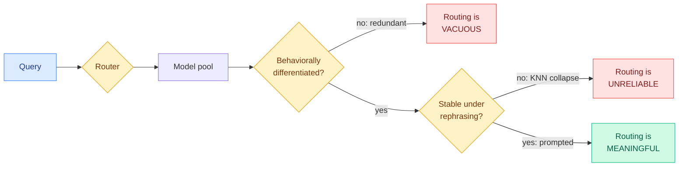
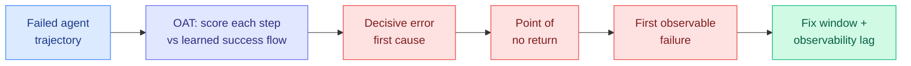

# cere-bro | 2026-07-20

> A DeepMind paper asks the question the entire routing field skipped: not "is the router accurate?" but "is the router doing anything at all?" It shows a router can score high on accuracy while operating over a pool of near-identical models or assigning the same query differently each time it is rephrased. Both make routing meaningless, and neither shows up in the accuracy number. The same week, three papers stop scoring agent failure as pass/fail and start treating it as a timeline you can trace to the decisive step.

---

## TL;DR

- **When Is Routing Meaningful?** (DeepMind): a router can look accurate while doing nothing, if the model pool is behaviorally redundant or the routing is unstable under rephrasing. Two new diagnostics: Hierarchic Social Entropy for pool diversity, and a perturbation-robustness metric. Fewer than 10 well-chosen models recover most of a large pool's diversity.
- **KNN routers are fragile, prompted routers are stable**: learned KNN routers gain accuracy on specialist pools but collapse under paraphrase; prompted routing keeps both accuracy and robustness. Accuracy and meaningfulness can sharply diverge.
- **OAT** (Microsoft + UW-Madison): attribute an agent failure to its decisive step using only 100 successful trajectories and no failure labels, by scoring how far each step strays from learned success dynamics. 200-5000x faster than per-step prompting, +20% F1 in-domain.
- **Failure as a Process**: 63,000 annotated coding-agent steps show every failure has three timestamps (decisive error, point of no return, first observable symptom), exposing a fix window and an observability lag that pass/fail labels erase.
- **Self-improving-agents and metacognition surveys** give the "agent updates itself" and "agent knows what it doesn't know" literatures shared vocabularies.

---

## Deep Dives

### When Is Routing Meaningful? Diversity and Robustness in Language Model Societies

> Every routing paper is scored on accuracy and cost. This one proves those numbers can both look great while the router is a no-op, and gives you two cheap tests to catch it: is your model pool actually diverse, and does your router send the same question to the same model when you reword it?

**Source:** DAIR.AI Top Papers of the Week (via Gmail starred) · not on the HF daily
**Links:** [arXiv](https://arxiv.org/abs/2607.09197) · Fantine Huot, Michael Kaisers, Mirella Lapata (DeepMind-affiliated)

**What is it about?**
Routing here means model-selection routing: a system decides which model in a pool should answer a given query (cheap small model for easy queries, expensive frontier model for hard ones, or specialist models per domain). The field evaluates routers almost entirely on two numbers: task accuracy and inference cost. This paper argues those two numbers are blind to whether the router is actually routing. It introduces two properties orthogonal to accuracy that decide whether routing is meaningful, and two metrics to measure them.

**What problem does it solve?**
A router can post excellent accuracy for reasons that have nothing to do with good routing. If every model in the pool behaves nearly identically (a "redundant society"), then it does not matter where a query goes, so the accuracy is high but the routing is vacuous. Separately, if the router sends "What is the capital of France?" to model A but sends a reworded "France's capital is what?" to model B, the routing is unstable, and accuracy can hide that inconsistency entirely. Until now there was no standard way to detect either failure. Teams shipped routers that looked good on a leaderboard and did nothing in production.

**What is the core novelty?**
Two diagnostics. The first is Hierarchic Social Entropy (HSE), a diversity measure borrowed from multi-agent-systems theory and adapted to language-model pools: it scores how genuinely behaviorally different the models in a society are, accounting for hierarchical structure rather than just counting models. The second is a perturbation-based robustness metric: rephrase a query in surface form and check whether it still routes to the same model. A meaningful router scores high on both; an accurate-but-empty router fails one or both.

**Key takeaways**
- Two orthogonal-to-accuracy conditions for meaningful routing: the model pool must be behaviorally differentiated, and routing must be stable under query rephrasing.
- HSE shows strong diminishing returns: a curated subset of fewer than 10 agents recovers most of the diversity available in a large pool. This is a practical coreset heuristic for designing a model society.
- On EmbedLLM and RouterBench, KNN (learned nearest-neighbor) routers gain accuracy on specialist societies but collapse in robustness under perturbation.
- Prompted routing (asking an LLM to pick the model) stays stable across all perturbation types, so accuracy and meaningfulness can sharply diverge.

**Gaps in the study**
HSE and the robustness metric are diagnostics, not a routing method: the paper tells you whether your router is meaningful, not how to build a better one. The evaluation uses two existing routing benchmarks (EmbedLLM, RouterBench); whether the fewer-than-ten-agents coreset finding holds for production pools with proprietary frontier models (which may be more differentiated than the open pools tested) is untested. The perturbation set is surface-form rephrasing; robustness to deeper semantic-preserving transforms is not measured.

**Industrial implication**
This is a diagnostic every team running a router should adopt immediately, because it is cheap and it catches an expensive mistake. The coreset finding is directly actionable: if fewer than ten well-chosen models recover most of a large pool's diversity, then maintaining a 30-model routing pool is mostly wasted operational complexity, and you can prune to a specialist coreset without losing capability. The KNN-versus-prompted result is a live warning: many production routers are learned embedding-based (KNN-like) classifiers, and this paper says those are exactly the ones that silently break under the paraphrase variation real users produce. Prompted routing costs more per decision but is robust, so the cost-versus-robustness tradeoff is now measurable.

**Research angle**
This is the paper the wiki's routing thread has been missing: a way to falsify a router. The thread has tracked where the routing decision is made (model level via TraceR, adapter level via MinT, expert level via CaRE and BEAM, per-token level, per-head level) and how routers are trained. None of those asked whether the routing was meaningful in the first place. HSE plus the robustness metric are the evaluation substrate all of that work now has to answer to. The open question: can HSE be turned from a diagnostic into a training objective, so a router is optimized to preserve diversity and stability, not just accuracy? A router trained to maximize HSE-weighted accuracy under a perturbation-consistency constraint is the natural next paper, and it would directly address the KNN-collapse failure mode this paper exposes.

---

### Tracing Agent Failure to the Decisive Step: OAT and Failure-as-a-Process

> When an agent fails a long task, the pass/fail label tells you nothing about where it went wrong. Two papers this week make failure legible: one learns what success looks like and flags the step that deviates, the other annotates 63,000 steps to show every failure has three separate moments.

**Source:** DAIR.AI Top Papers of the Week (via Gmail starred)
**Links:** OAT (Microsoft + UW-Madison) · Failure-as-a-Process (63k-step study)

**What is it about?**
Both papers attack agentic failure attribution: given a multi-step agent run that failed, identify which step actually caused the failure. OAT (from Microsoft and UW-Madison) does it with one-class learning: it uses neural controlled differential equations to model the latent dynamics of successful trajectories, then scores each step of a failed run by how far it strays from that learned success flow. The step that deviates most is the decisive one. Failure-as-a-Process instead does the empirical groundwork: it annotates over 63,000 execution steps across 1,794 valid coding-agent trajectories and shows that failure is not one event but three.

**What problem does it solve?**
Production agents fail in long, probabilistic, tool-mediated runs where the decisive misstep is buried in hundreds of steps. The two existing options are both impractical at scale: label a corpus of failure data (expensive annotation) or run an LLM over every step asking "did it go wrong here?" (expensive inference). OAT needs neither: only 100 successful trajectories and no failure labels, because it reframes attribution as anomaly detection against success. Failure-as-a-Process solves a different problem: it shows that "when did it fail" has three distinct answers (the decisive error, the point where recovery became impossible, and the first observable symptom), and the gaps between them are where debugging effort should go.

**What is the core novelty?**
For OAT, it is turning failure attribution into label-free anomaly detection on trajectory dynamics: model success as a flow, score deviation. For Failure-as-a-Process, it is the three-timestamp decomposition, which surfaces two quantities pass/fail labels erase: the "fix window" (between the decisive error and the point of no return, where intervention could still save the run) and the "observability lag" (between the point of no return and the first observable symptom, where the run is already doomed but looks fine).

**Key takeaways**
- OAT: label-free failure attribution from 100 successful trajectories, 200-5000x faster than per-step prompting, +20% F1 in-domain and +7% out-of-distribution.
- Failure-as-a-Process: 63,000+ steps annotated across 3,843 runs from seven frontier models on three scaffolds, filtered to 1,794 valid trajectories with high inter-rater agreement.
- Every agent failure has three timestamps: decisive error, point of no return, first observable failure.
- The gaps between them (fix window, observability lag) are actionable targets that pass/fail labels hide.

**Gaps in the study**
OAT models success dynamics, so it inherits the assumption that failures look like deviations from a single success manifold; failures that stay on-manifold until the very end (a plausible-looking trajectory that produces a wrong final answer) are the hard case and are not clearly addressed. Failure-as-a-Process is annotation-heavy and human-judged; the three-timestamp scheme's reproducibility beyond the studied scaffolds and the seven models is the open question.

**Industrial implication**
These are the measurement tools the agent-harness thread has needed. The July 16 Harness Handbook argued harnesses must be navigable (you can trace how a decision was made); OAT and Failure-as-a-Process are how you make a failed run navigable. For anyone running agents unattended, OAT is the cheaper path to "which step broke this" than the per-step LLM grading most teams do now, and the observability-lag concept explains a real production pain: agents that look fine right up until they surface a failure that actually became inevitable many steps earlier.

**Research angle**
These pair naturally with Long-Horizon-Terminal-Bench (July 13, dense per-step scoring of long terminal tasks) and Verification as a Scaling Axis (July 11 weekly, continuous verifier score as a training signal). The composition: OAT's deviation score is a label-free reward signal for exactly the intermediate steps that outcome-based RL leaves unsupervised, which is the same supervision gap SEED (July 17) fills with self-generated hindsight skills. A system that uses OAT-style success-flow deviation as the dense reward, instead of a self-analysis the model could reward-hack, is the safer version of the self-improving loop the wiki has been circling.

---

## Industry Pulse

- **DeepMind reframes routing evaluation**: a router can be accurate and meaningless. Two diagnostics (Hierarchic Social Entropy for pool diversity, perturbation-robustness for stability); fewer than 10 models recover most of a large pool's diversity ([arXiv](https://arxiv.org/abs/2607.09197)).
- **Agentic failure attribution goes label-free**: OAT attributes failures from 100 success trajectories, 200-5000x faster than per-step prompting ([DAIR.AI](https://nlp.elvissaravia.com/p/top-ai-papers-of-the-week-16b)).
- **Coding-agent failure annotated at 63k-step scale**: failure is a three-timestamp process, not a pass/fail event ([DAIR.AI](https://nlp.elvissaravia.com/p/top-ai-papers-of-the-week-16b)).
- **From Pixels to States still leads HuggingFace at 407 upvotes**: route interactive world models through explicit game state, not raw pixel prediction; Black Myth: Wukong dataset of 90+ hours ([arXiv](https://arxiv.org/abs/2607.14076)).
- **Kurate leaderboard unchanged**: biomedical and science-foundation-model heavy; "How to Scale Mixture-of-Experts" (cs.LG #16, ai_rating 9.0) remains the highest-rated ML paper ([Kurate](https://kurate.org)).

---

## Global View

**The routing field just got the falsification test it never had, and it retroactively raises the bar for months of wiki-tracked work.** The wiki has followed model-selection routing as a Tier 1 thread all year: where the routing decision is made (TraceR at the model level, MinT at the adapter level, CaRE and BEAM at the expert level, per-token and per-head variants) and how routers get trained. Every one of those was scored on accuracy and cost. When Is Routing Meaningful? (DeepMind) shows that both numbers can be high while the router is a no-op, because a redundant model pool makes routing vacuous and an unstable router makes it unreliable, and it ships two cheap diagnostics (Hierarchic Social Entropy, perturbation robustness) to catch each. The most industrially useful result, that fewer than ten curated models recover most of a large pool's diversity, is a direct rebuke to the "route across 30 models" complexity many production systems carry. This is the same move the field made for agents this week: stop trusting the top-line number, instrument the mechanism. Routing got a meaningfulness test; agents got failure-as-a-process.

**Agent evaluation shifted from outcome to trajectory across four papers in eight days, and the pieces now compose into a dense-supervision stack.** Trace the sequence: Long-Horizon-Terminal-Bench (July 13) introduced dense per-step scoring of long terminal tasks. SEED (July 17) filled the outcome-RL supervision gap with self-generated hindsight skills. OAT and Failure-as-a-Process (this week) make failure attributable to the decisive step, one via label-free anomaly detection, one via 63,000 annotated steps. The through-line: outcome-based rewards are too sparse to train or debug long-horizon agents, so the field is racing to manufacture dense intermediate signal. But the wiki's running caution applies here with force. SEED distills the model's own self-analysis, and the July 14 weak-to-strong thread plus the "More Convincing, Not More Correct" judge paper showed self-scoring gets reward-hacked. OAT's success-flow deviation is a more trustworthy dense signal precisely because it is anchored to observed successful trajectories, not the model's opinion of itself. The synthesis worth watching: dense agent supervision that uses OAT-style deviation as the reward and reserves self-analysis for explanation, not credit assignment.

**The month's meta-pattern holds: the frontier is instrumentation, not raw capability.** Four weeks ago the training-loop returns were declared largely spent (Mirage of Optimizing Training Policies, OmniOpt, July 7-8). Since then every high-signal paper has been about measuring and extracting from systems rather than making bigger models: The Harness Effect (harness moves cost more than the model), Byte-Exact KV-Cache Grafting (reuse verified computation), LongStraw (fit long-context RL in fixed memory), and now routing-meaningfulness and agent-failure-attribution. The capability models are increasingly fixed (Kimi K3, Grok 4.5, the frontier closed labs), and the research energy has moved decisively to the layer that decides how those fixed models are selected, orchestrated, cached, and debugged. For Amit's Tier 1 interests, routing and KV cache are both squarely in that layer, and both got foundational instrumentation papers this month.

---

## Looking Ahead

- **An HSE-optimized router appears within 60 days**: When Is Routing Meaningful? gives a diagnostic (Hierarchic Social Entropy + perturbation robustness) but not a method. The obvious next paper trains a router to maximize HSE-weighted accuracy under a perturbation-consistency constraint, directly fixing the KNN-collapse failure mode. Signal: an arXiv paper reporting a router optimized for diversity and stability, not just accuracy.
- **The fewer-than-ten-agents coreset finding gets tested on frontier pools within 90 days**: the diversity-saturation result was measured on open routing benchmarks. If it holds for pools including proprietary frontier models, production routing pools should shrink dramatically. Signal: a replication reporting HSE saturation on a pool that includes GPT-5.5, Opus/Fable, and Grok 4.5.
- **OAT-style deviation becomes a dense RL reward within 90 days**: label-free success-flow deviation is a trustworthy alternative to self-analysis for the agent-RL supervision gap that SEED fills with self-generated skills. Signal: a paper using anomaly-detection-based step scoring as the reward for long-horizon agent RL, reporting a gain over outcome-only RL.
- **A production postmortem cites the observability-lag concept within 60 days**: Failure-as-a-Process named a real phenomenon (an agent run doomed many steps before it looks broken). If the framing is right, expect it to show up in an engineering writeup of an agent that failed silently. Signal: a public postmortem or blog using the decisive-error / point-of-no-return / first-observable framing.
