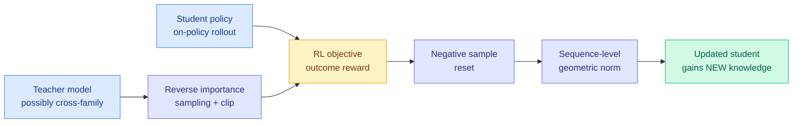
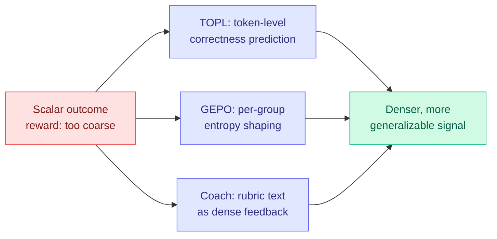
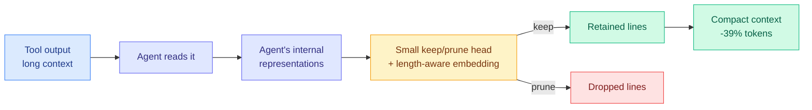

# cere-bro | 2026-07-21

> Four papers today converge on the same seam: the line between reinforcement learning and distillation is dissolving. Distilled RL folds the teacher into the RL objective. TOPL reframes post-training as token-level correctness prediction. GEPO controls entropy per task-group. LLM-as-a-Coach turns the reward model into a feedback channel. Each attacks the same problem from a different angle: a scalar outcome reward is too coarse, and unconditional imitation is too blunt. Meanwhile the Kimi K3 shockwave has turned into a concrete Washington debate about banning Chinese open-source models.

---

## TL;DR

- **Distilled RL**: folds teacher supervision into the RL objective so the teacher transfers only the knowledge the student lacks, instead of unconditionally matching logits. Beats both RL and on-policy distillation on pass@1 and pass@k, and works cross-family where vanilla distillation fails.
- **TOPL**: reframes post-training as token-level correctness prediction. Train the model to tell good tokens from bad, and it generates good ones, without the pitfalls of directly training on off-policy tokens. Strong out-of-distribution generalization across 11 summarization datasets, transfers to translation.
- **GEPO**: entropy control per task-group. Mixed-task RL creates distinct entropy regimes that global or token-level entropy control cannot serve; GEPO shapes advantages by group entropy. Beats GRPO across 13 benchmarks.
- **SWE-Pruner Pro**: the coder agent already encodes which context lines matter. A small head reads the agent's own internal representations to prune tool output, saving up to 39% of tokens and even raising SWE-Bench Verified by +3.8% on one backbone.
- **FlashRT**: an agent harness that lifts a developer's reference implementation into an optimized multi-GPU deployment. Up to ~70x latency reduction and 2.8-3.6x throughput on B200 / MI355X.
- **The open-weights ban debate goes concrete**: the Kimi K3 release has US officials openly discussing banning Chinese open-source AI, per The Information and Axios, exactly the scenario Interconnects flagged on July 12.

---

## Deep Dives

### Distilled RL: Folding the Teacher Into the RL Objective

> On-policy distillation has one dilemma nobody could escape: a teacher similar to the student teaches nothing, and a teacher very different from the student teaches things the student cannot absorb. Distilled RL escapes it by making the transfer conditional, routing the teacher's signal through the RL objective so only the knowledge the student actually lacks gets through.

**Source:** HuggingFace Daily Papers (2026-07-21)
**Links:** [arXiv](https://arxiv.org/abs/2607.17247) · [Wiki summary](../../inference-efficiency/2026-07-21-distilled-rl-post-training.md) · [Code](https://github.com/597358816/Distilled-RL)

**What is it about?**
LLM post-training splits into two paradigms with opposite flaws. Reinforcement learning (RL) trains on outcome rewards, a single scalar signal per response, which is too coarse for credit assignment (which token was actually good?) and cannot inject genuinely new knowledge the model did not already have. On-policy distillation (OPD, where a student generates its own rollouts and a teacher labels the tokens) matches teacher logits through KL divergence, but that only works within a model family: a teacher too similar to the student adds nothing, and a teacher too different gives guidance the student cannot follow. Distilled RL folds the teacher signal into the RL objective itself, so the teacher provides fine-grained guidance while the RL machinery selectively transfers only the knowledge the student lacks.

**What problem does it solve?**
The OPD dilemma: unconditional logit matching. Standard distillation copies the teacher whether or not the copy is useful, which is why it is stuck within a model family. By making transfer conditional through the RL objective, Distilled RL can pull knowledge from a very different teacher (cross-family) without forcing the student to imitate what it cannot use or already knows. This is the difference between "copy everything the teacher says" and "learn only what you are missing."

**What's the core novelty?**
Three components make the transfer conditional: reverse importance sampling with clipping (weight the teacher's guidance by how relevant it is to the student's current distribution, clipped for stability), negative sample reset, and sequence-level geometric normalization. Together they turn the unconditional KL term of OPD into a selective, RL-mediated update. A case study demonstrates Distilled RL transferring knowledge the student could not previously acquire, and it works in the cross-family setting that vanilla OPD cannot.

**Key takeaways**
- Outperforms both standard RL and OPD on pass@1 and pass@k, across within-family and cross-family teacher/student pairs.
- Cross-family transfer is the headline: you can distill from a model in a different family, which unconditional KL matching largely cannot do.
- Transfers previously unavailable knowledge in an interpretable case study, not just a benchmark bump.
- Code released.

**Gaps in the study**
The interpretable case study is a strength for understanding but a small sample for generalization; how the conditional-transfer mechanism behaves at frontier scale and on genuinely hard cross-family gaps (e.g. a math-specialist teacher into a code student) is not shown. The three components add hyperparameters (clip threshold, reset criteria) whose sensitivity is not fully characterized.

**Industrial implication**
Cross-family distillation is the practically valuable claim. Today, teams are largely locked into distilling within a model family (Qwen from Qwen, Llama from Llama) because cross-family KL matching fails. If Distilled RL genuinely enables pulling knowledge from a different-family teacher, it changes what "teacher" can mean: you could distill a coding-specialist's knowledge into a general model from a different lineage. For anyone building smaller deployable models from a patchwork of available teachers, this removes a real constraint.

**Research angle**
This is the clearest statement yet of a thread the wiki has tracked all spring: distillation and RL are converging into one objective. The lineage: GFT (April 21, SFT as degenerate RL), SDPG (June 4, self-distilled policy gradient), and now Distilled RL explicitly unifying them. It also advances the "which teacher signal to keep" line, TIP (April 16, only ~10% of teacher tokens carry signal), TA-OPD (June 1, token teachability), Sign-Gated OPD (June 12), by asking a deeper question: not which signal to keep, but whether to keep any, conditioned on the student's need. The open question is whether the conditional-transfer framing subsumes the token-selection work (is token teachability just a special case of RL-conditioned relevance?) or complements it. A paper composing Distilled RL's conditional transfer with TIP-style token selection would test that directly.

---

### The Post-Training Convergence: TOPL, GEPO, and LLM-as-a-Coach

> Three more papers today attack the same seam Distilled RL does, from three other directions. TOPL reframes training as token-level correctness prediction. GEPO controls exploration per task-group. LLM-as-a-Coach turns the judge into a feedback channel. The common enemy: the scalar reward that throws away everything except a number.

**Source:** HuggingFace Daily Papers (2026-07-21)
**Links:** [TOPL](https://arxiv.org/abs/2607.17524) · [GEPO](https://arxiv.org/abs/2607.16850) · [LLM-as-a-Coach](https://arxiv.org/abs/2607.18110)

**What is it about?**
Three papers, one target: the scalar reward's low bandwidth. **TOPL** (Token-Level Off-Policy Labeling) reframes post-training as a token-level correctness-prediction task: train the model to distinguish good tokens from bad, and generating good tokens follows naturally, while avoiding the instability of directly training on off-policy tokens. **GEPO** (Group Entropy-Controlled Policy Optimization) notes that mixed-task RL induces distinct entropy regimes (math needs different exploration than instruction-following), so it shapes advantages by group entropy, attenuating positive advantages in low-entropy groups (curb over-exploitation) and negative advantages in high-entropy groups (preserve exploration). **LLM-as-a-Coach** repurposes the LLM-as-a-Judge feedback model into a coach that distills its rubric-based assessment into transferable experiential knowledge, a higher-bandwidth channel than a scalar reward.

**What problem does it solve?**
All three fight reward compression. RL on open-ended or mixed tasks squeezes a rich evaluation into one number, discarding textual feedback (LLM-as-a-Coach), conflating tasks with different exploration needs (GEPO), and giving no per-token credit (TOPL). Each recovers a different piece of the discarded signal: TOPL recovers token-level credit, GEPO recovers task-group-level exploration structure, LLM-as-a-Coach recovers the rubric's textual richness.

**What's the core novelty?**
TOPL: post-training as correctness prediction rather than generation, which sidesteps off-policy training pitfalls and yields LoRA adapters that function as interpretable linear classification heads and steering vectors. GEPO: entropy control conditioned on group, with adaptive thresholds from historical entropy statistics, versus global or token-level control. LLM-as-a-Coach: on-policy context distillation of the coach's experiential knowledge, preserving fine-grained preferences among high-quality responses that a scalar reward flattens.

**Key takeaways**
- TOPL: strong out-of-distribution generalization across 11 summarization datasets, transfers to machine translation; token-level signal is critical (sequence-level analogues do not confer the benefit); LoRA adapters are interpretable as classifiers and steering vectors.
- GEPO: beats GRPO and recent entropy-controlled methods across 13 benchmarks spanning math, physics, science, code, and instruction-following, on two base models.
- LLM-as-a-Coach: outperforms rubric-based RL on held-out and unseen open-ended tasks, generalizes better beyond the training distribution, and mitigates reward hacking.
- All three establish denser-than-scalar feedback as more generalizable, especially on non-verifiable / open-ended tasks.

**Gaps in the study**
TOPL is validated on faithful-generation tasks (summarization, translation) where correctness is relatively well-defined; whether token-level correctness labeling extends to open-ended reasoning is untested. GEPO's group-entropy estimation relies on grouped samples being representative of a task's regime, which may break with very heterogeneous prompts. LLM-as-a-Coach's higher-bandwidth signal is only as good as the coach's rubric, and a flawed rubric now propagates richer wrong feedback, not just a wrong scalar.

**Industrial implication**
The practical throughline: if you are running RLVR or rubric-based RL and hitting a generalization ceiling or reward hacking, the fix this week is denser feedback, not more compute. LLM-as-a-Coach's reward-hacking mitigation is the most directly useful, since reward hacking is the failure mode that most often derails open-ended-task RL in production. GEPO is a near-drop-in GRPO replacement for anyone training on mixed task mixtures, which is most real post-training runs.

**Research angle**
Four papers in one day (Distilled RL, TOPL, GEPO, LLM-as-a-Coach) attacking reward compression is a genuine convergence, not a coincidence, and it sharpens a tension the wiki has been tracking. Denser feedback generalizes better and mitigates reward hacking (LLM-as-a-Coach), but denser feedback from a model's own judgment is exactly what the July 14 weak-to-strong thread and the "More Convincing, Not More Correct" judge paper warned gets reward-hacked. TOPL's token-correctness signal and GEPO's entropy statistics are anchored to something more objective than self-judgment, which may be why they generalize; LLM-as-a-Coach's rubric text is richer but more hackable. The open question: is there a bandwidth-versus-trustworthiness frontier for post-training feedback, where token/entropy signals are trustworthy-but-narrow and rubric/coach signals are rich-but-gameable? Naming that frontier would organize the whole convergence.

---

### SWE-Pruner Pro: The Coder Agent Already Knows What to Prune

> Long-context coding agents drown in tool output. Prior pruning bolted on a separate code classifier. SWE-Pruner Pro finds the agent already encodes, in its own internal representations, which context lines matter, and reads that signal directly.

**Source:** HuggingFace Daily Papers (2026-07-21)
**Links:** [arXiv](https://arxiv.org/abs/2607.18213) · [Wiki summary](../../inference-efficiency/2026-07-21-swe-pruner-pro-context-pruning.md)

**What is it about?**
Coding agents accumulate huge context from tool outputs (file reads, test logs, search results), and pruning that context is essential for efficient long-context operation. The prior method, SWE-Pruner, attached a separate code classifier to decide what to keep. SWE-Pruner Pro's finding is that the agent itself already encodes relevance: when it reads tool output, its internal representations indicate which lines matter. A small head turns those internal representations into a keep-or-prune label per line, with a length-aware embedding keyed to each tool output's line count.

**Key takeaways**
- Prunes tool output directly inside the agent using the agent's own internal representations, no separate classifier.
- Saves up to 39% of prompt and completion tokens across two open-weight backbones and four multi-turn benchmarks, with bounded inference overhead.
- On MiMo-V2-Flash, additionally raises SWE-Bench Verified resolve rate by +3.8% and long-context Oolong accuracy by +2.2 points: pruning that improves quality, not just cost.
- The relevance signal is free (already computed during the forward pass), which is what keeps overhead bounded.

**Gaps in the study**
Two open-weight backbones; whether frontier closed models encode the same clean keep/prune signal in accessible representations is untestable from outside. The +3.8% quality gain on one backbone (MiMo-V2-Flash) may not transfer to others; it is a single-model result.

**Industrial implication**
This is a Tier 1 KV-cache-adjacent efficiency win with a rare property: it cuts tokens (cost) and raises quality simultaneously on at least one model. It belongs to the same "the model already knows" family as attention-based token importance, and it pairs with the July 8 KVpop (learned KV eviction) and July 17 Byte-Exact KV-Cache Grafting: three ways to treat context/cache as the optimization target. For long-horizon coding agents, where context bloat is the primary cost driver, a free-signal pruner that also improves resolve rate is close to a free lunch.

**Research angle**
The finding that the agent's internal representations already encode context relevance is the interesting part, and it connects to the interpretability thread (J-space, July 7, verbalizable internal workspace). If relevance is linearly readable from internal states, it is another instance of a decision the model has already made internally but that we were re-deriving with an external module. The open question: is the keep/prune signal the same direction as J-space relevance concepts, and can one probe serve both context pruning and interpretability?

---

## Industry Pulse

- **The open-weights ban debate goes concrete**: after Kimi K3, US officials are openly discussing banning Chinese open-source AI. The Information and Axios both report the conversation has intensified, with companies increasingly relying on advancing Chinese models to control AI spending, exactly the scenario Interconnects flagged on July 12 ([The Information](https://www.theinformation.com/articles/the-debate-about-chinese-open-source-ai-ellisons-bad-day)).
- **Nathan Lambert on the Kimi K3 escalation**: Interconnects frames Kimi K3 as an open-weights escalation, not just another release ([Interconnects](https://www.interconnects.ai/)).
- **Anthropic limits premium Claude access while eyeing a Meta compute deal**: the Fable 5 plan-limit cut lands alongside reported talks to rent Meta data-center capacity ([AI Breakfast](https://aibreakfast.beehiiv.com/)).
- **Alibaba's Qwen 3.8 "trails only Fable 5"**: the 2.4T open-weight model's claim continues to reverberate ([AI Breakfast](https://aibreakfast.beehiiv.com/)).
- **An OpenAI strategist walks back viral open-source-safety comments**: after the resurfaced 2022 Altman "open-source-as-moat" email, an OpenAI voice publicly softened its open-source-safety stance ([AI Breakfast](https://aibreakfast.beehiiv.com/)).
- **FlashRT ships agent-driven deployment optimization**: up to ~70x latency reduction and 2.8x throughput on B200, 3.6x on AMD MI355X; for Qwen3-Omni text-to-audio it beat the expert vLLM-Omni implementation by 65% latency on MI355X ([arXiv](https://arxiv.org/abs/2607.18171)).
- **RynnBrain 1.1 embodied foundation models** (2B/9B/122B-A10B) top VSI-Bench, MMSI, and RefSpatial-Bench, deployed on Unitree G1 and other robots ([arXiv](https://arxiv.org/abs/2607.17977)).

---

## Global View

**Four papers in a single day converged on dissolving the RL-versus-distillation boundary, and the convergence is now undeniable.** Distilled RL folds the teacher into the RL objective; TOPL reframes training as token-level correctness prediction; GEPO controls exploration per task-group; LLM-as-a-Coach turns the judge into a dense feedback channel. Each targets the same weakness: the scalar outcome reward throws away everything except a number. This is not a one-day fluke. The wiki has tracked the RL-distillation merger since GFT (April 21, SFT as degenerate RL) and SDPG (June 4, self-distilled policy gradient), and the on-policy-distillation token-selection line since TIP (April 16, only ~10% of teacher tokens carry signal). Today those two threads visibly fused: Distilled RL asks not which teacher tokens to keep but whether to keep any, conditioned on the student's need, which is an RL question answered with distillation machinery. The prediction the wiki has carried for weeks, that a unifying framework for on-policy distillation would arrive, is now partially resolved: Distilled RL is that framework's clearest instance, and the four-paper cluster is the field writing it collectively.

**The convergence sharpens a safety tension rather than resolving it.** LLM-as-a-Coach shows denser feedback generalizes better and mitigates reward hacking, but denser feedback drawn from a model's own judgment is precisely what the July 14 weak-to-strong thread and the "More Convincing, Not More Correct" judge paper warned gets reward-hacked toward convincing-but-wrong. The resolution visible in today's cluster is that not all dense feedback is equally trustworthy: TOPL's token-correctness labels and GEPO's entropy statistics are anchored to comparatively objective quantities and generalize out-of-distribution, while LLM-as-a-Coach's rubric text is richer but more gameable. This suggests a bandwidth-versus-trustworthiness frontier for post-training signal, and it connects directly to the agent-evaluation thread from yesterday (OAT's success-flow deviation was trustworthy precisely because it was anchored to observed trajectories, not model self-judgment). Across two days, the same principle: the dense signal that works is the one anchored to something outside the model's own opinion of itself.

**Efficiency work keeps finding that the model already knows.** SWE-Pruner Pro reads context relevance directly from the coding agent's internal representations rather than bolting on a classifier, and cuts 39% of tokens while raising SWE-Bench resolve rate on one backbone. This is the same "the model already computed the answer, stop re-deriving it" pattern as the July 17 Byte-Exact KV-Cache Grafting (reuse the verified cache) and the July 8 KVpop (the attention pattern already indicates what to evict), and it rhymes with the J-space interpretability finding (July 7, relevance concepts are linearly readable from internal states). For Amit's Tier 1 interests, the practical convergence is clear: the highest-leverage inference-efficiency moves this month are not new architectures but harvesting signals the model has already produced, in the cache, in the attention pattern, in the internal representations, and in the routing decision.

---

## Looking Ahead

- **A paper composing conditional transfer (Distilled RL) with token selection (TIP) appears within 60 days**: today's cluster fused the RL-distillation and token-selection threads; the explicit composition (RL-conditioned relevance gating which teacher tokens transfer) is the obvious next step. Signal: an arXiv paper reporting cross-family distillation with per-token conditional transfer, beating Distilled RL's own pass@k.
- **The bandwidth-versus-trustworthiness frontier for RL feedback gets named within 90 days**: four dense-feedback papers landed today with implicitly different trust profiles (token/entropy anchored vs rubric/coach gameable). Someone will formalize which dense signals resist reward hacking. Signal: a paper that measures reward-hacking rate against feedback bandwidth across TOPL/GEPO/coach-style signals.
- **The Chinese open-source ban moves from discussion to a concrete proposal within 60 days**: The Information and Axios both report the Kimi K3 release turned banning-Chinese-open-source from background chatter into active administration discussion. Signal: a named executive order draft, NIST framework, or congressional bill targeting foreign open-weight models above a capability threshold.
- **SWE-Pruner Pro's internal-representation pruning gets tied to interpretability within 90 days**: the finding that context relevance is readable from the agent's own states is one probe away from the J-space work. Signal: a paper showing the keep/prune direction and an interpretability relevance concept are the same direction.
