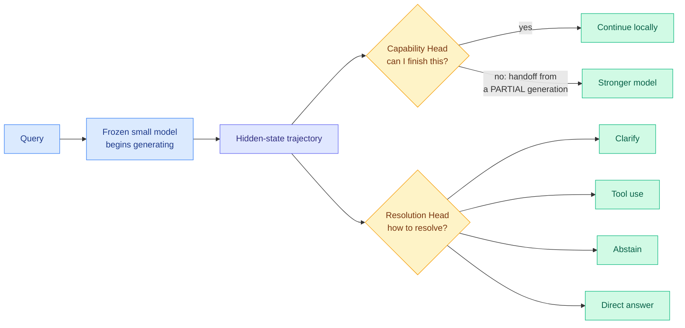
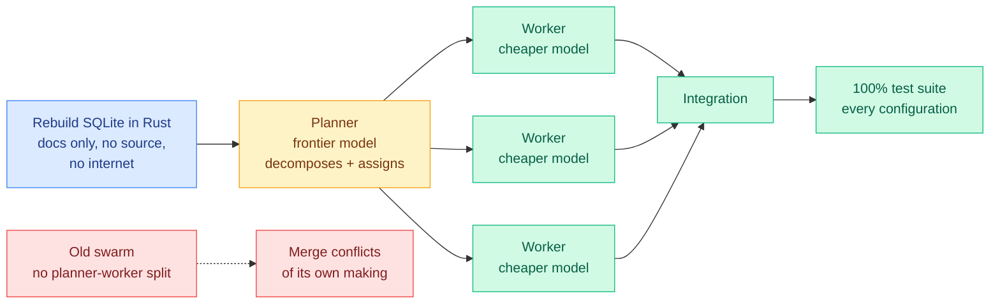
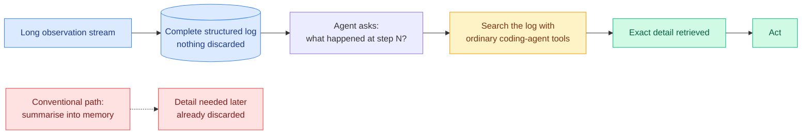
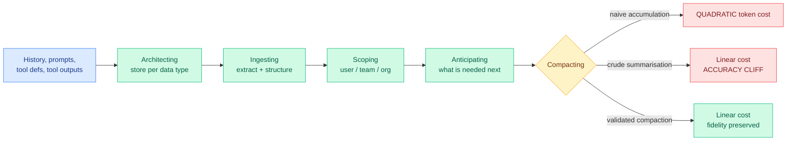
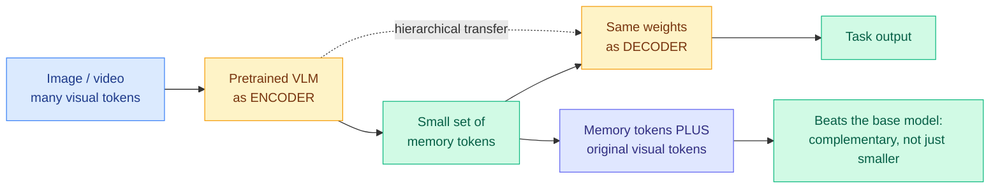
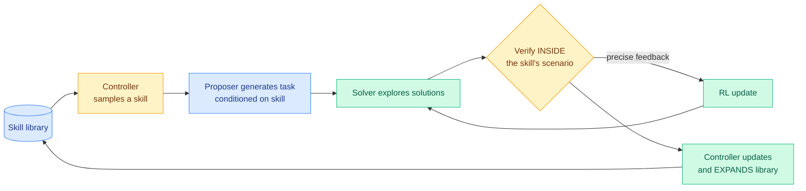
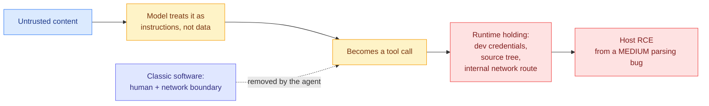

# cere-bro | 2026-07-27

> The Kurate leaderboard unfroze after six weeks and the first thing it surfaced was an argument: two papers landed the same day telling agents opposite things about their own memory, while a router that reads hidden states instead of prompts cut frontier-model calls by 90%.

---

## TL;DR

- **Multi-Head Latent Control**: route by reading the model's hidden states while it generates, not by reading the prompt. Up to 90.7% fewer large-model calls.
- **Cursor's agent swarm**: separate the planner from the workers and cheap models rebuild SQLite in Rust to a 100% test pass.
- **PRO-LONG**: stop compressing agent history. Keep the whole log, search it. 18 points better on ARC-AGI-3 with 4.2x fewer tokens.
- **Agentic Context Management**: the opposite claim, same day. Naive context grows cost quadratically, so compaction is mandatory.
- **CXMT opens at $487B** in Shanghai, up 472%. China's memory champion is now funded whether or not Apple gets its waiver.
- **Kurate connector was broken for six weeks**, sending an invalid period value and silently getting an all-time ranking. Fixed today.

---

## Deep Dives

### Multi-Head Latent Control: The Router Moves Inside the Model

> Every router in this wiki reads the question. This one reads the answer being written, so it can change its mind halfway through a sentence.

**Source:** HuggingFace Daily Papers
**Links:** [arXiv 2607.14277](https://arxiv.org/abs/2607.14277) · [Wiki summary](../../ai-routing/2026-07-27-multi-head-latent-control.md)

**What is it about?**
Two small heads sit on top of a frozen language or vision-language model and watch its hidden states, the internal numeric representations the model builds as it works, while it generates. One head, the Capability Head, predicts whether this model can actually finish the current problem or should hand off to a stronger one. The other, the Resolution Head, picks how to respond: ask a clarifying question, call a tool, refuse, or just answer.

**What problem does it solve?**
Routing today reads the input. You embed the query, classify it, and pick a model before the cheap model has tried anything. That forces the decision at the moment you have the least information. Reading the generation instead means the evidence accumulates: the trajectory at token 50 says far more about whether this is going well than the prompt did at token 0.

**What is the core novelty?**
It is the first router in this wiki that makes a decision *between* models using evidence from *inside* one. [TRACER (04-17)](../../ai-routing/2026-04-17-tracer-llm-routing.md), which trains a cheap surrogate classifier on an LLM's own production traces and gates on a confidence threshold, still reads the input. [Step-level Optimization (05-02)](../../ai-routing/2026-05-02-step-level-optimization-computer-use-agents.md), which escalates a GUI agent to a frontier model when learned monitors detect that progress has stalled, watches environment state rather than model internals. [DLR (05-15)](../../ai-routing/2026-05-15-dlr-dynamic-latent-routing-post-training.md) routes in latent space but only within a single model. The consequence unique to MHLC is early handoff from a partial generation.

**Key takeaways**
- **Up to 90.7% fewer large-model calls on AndroidWorld**, a GUI-agent benchmark, and 27 to 53% fewer on average across benchmarks, while retaining most large-model performance.
- Up to **+158% relative gain** on tool-use decision quality and **65.5% fewer missed required tool calls**, so this is a correctness improvement as well as a cost one.
- The backbone is frozen and both heads train only on latent traces from that same backbone, so no retraining of the served model.

**Gaps in the study**
Training on traces from one specific backbone means every backbone swap requires retraining the heads, which is the same maintenance burden the paper criticises prompt-level routing for, just relocated. The 90.7% figure is the best case and the honest average is 27 to 53%. Most importantly there is no paraphrase-robustness test, which matters because [When Is Routing Meaningful? (07-20)](../../ai-routing/2026-07-20-when-is-routing-meaningful.md), which introduced diagnostics for whether a router is doing anything at all, found that learned KNN routers gain accuracy but collapse when queries are rephrased while prompted routing stays stable. And there is no latency accounting: an early handoff throws away the small model's partial work and re-prefills on the large model.

**Industrial implication**
If the latent signal turns out to be paraphrase-stable where query embeddings are not, this is not merely a cheaper router but a structurally more robust one, and the KNN-collapse finding stops being a general indictment of learned routing. The number that decides deployment is one the paper does not publish: how many tokens the Capability Head needs before its prediction is trustworthy. Early handoff is the entire value proposition, so a curve of handoff accuracy against tokens generated is the missing plot. Watch also for the cache interaction, since routing more often means invalidating prefix cache more often.

→ [Full summary](../../ai-routing/2026-07-27-multi-head-latent-control.md)

---

### Cursor Ships the Planner-Worker Split, and the Interesting Part Is How the Old One Failed

> The previous swarm did not fail because its models were weak. It failed by creating merge conflicts with itself.

**Source:** The Decoder
**Links:** [The Decoder](https://the-decoder.com/cursors-agent-swarm-suggests-cheaper-models-can-handle-most-coding-when-frontier-models-plan-the-work/) · [Wiki summary](../../ai-routing/2026-07-27-cursor-agent-swarm-planner-worker.md)

**What is it about?**
Cursor gave its old and new agent swarms the same task: rebuild SQLite in Rust using only the documentation, with no access to the source code and no internet. The new system separates a planner from the workers who write code. Every configuration of it eventually scored 100% on the test suite. The old system, which had no such separation, tangled itself in merge conflicts.

**What problem does it solve?**
It answers, from production rather than a paper, whether you need a frontier model everywhere in a coding agent. The answer is no. You need one where the work gets carved up.

**What is the core novelty?**
Honestly, the diagnosis rather than the architecture. The failure mode of the old swarm was self-inflicted merge conflicts, which is a coordination failure, not a capability failure of any individual worker. That says the binding constraint in multi-agent coding is write-conflict management. It also reframes what the planner is for: if its value is partitioning work into non-overlapping pieces rather than reasoning deeply, then a frontier model may be the wrong tool for the planner slot too, and nobody has tested a cheap partitioner against an expensive one.

**Key takeaways**
- Every configuration of the planner-worker swarm reached **100% on the test suite**; the unseparated predecessor did not.
- The benchmark withholds source and internet access, which is contamination-resistant in spirit though weaker than [Masov (07-26)](../../responsible-ai/2026-07-26-masov-access-control-cyber-benchmark.md), the access-control cyber benchmark built from zero-days its authors never published, since SQLite's design is certainly in pretraining data.
- Cursor's own conclusion: cheaper models handle most of the coding when frontier models plan the work.

**Gaps in the study**
No cost figures, no model names, no worker counts, so "cheaper models can handle most coding" is directional rather than a ledger. "Eventually scored 100%" conceals the two variables production cares about, wall clock and tokens burned. And SQLite is unusually well-specified by its documentation, which is exactly the condition that makes clean partitioning easy. A codebase with tangled cross-cutting concerns is where this should degrade, and it is untested.

**Industrial implication**
Combined with the paper above, the practical picture for the next two quarters is a two-layer routing stack: a coarse role split decided by architecture, planner versus worker, and a fine per-instance split decided at runtime by something like a Capability Head. Those compose cleanly and nobody has composed them. If you run a coding agent today, the cheap experiment is to fix your planner model and sweep the worker model down the price curve until acceptance tests break, which is the [DSPy fixed-contract method (07-25)](../../ai-routing/2026-07-25-dspy-task-model-separation-550x.md) applied to a swarm.

→ [Full summary](../../ai-routing/2026-07-27-cursor-agent-swarm-planner-worker.md)

---

### PRO-LONG: Stop Compressing the History, Just Search It

> Keeping every observation should cost more tokens. It costs 4.2 to 5.8 times fewer, because a log you can search is not a log you have to carry.

**Source:** Cross-source confirmed. Kurate weekly cs.AI #17 **and** DAIR.AI Top AI Papers of the Week via starred Gmail
**Links:** [arXiv 2607.20064](https://arxiv.org/abs/2607.20064) · [Wiki summary](../../agentic-systems/2026-07-27-pro-long-programmatic-memory.md)

**What is it about?**
Long-horizon agents accumulate huge observation streams and the standard response is to summarise them into a memory store. PRO-LONG refuses. It keeps the complete structured interaction log, throws nothing away, and lets the agent search that log on demand using the file-search tooling a coding agent already has.

**What problem does it solve?**
The compression tradeoff. Richer summaries make the exact detail you later need harder to retrieve, because summarising is deciding in advance what will matter, and in exploratory tasks you cannot know that in advance.

**What is the core novelty?**
That the naive baseline nobody bothered to run beats the elaborate systems. The token result is the mechanism made visible: the log is **stored, not resident**. The agent pays for the slice it retrieves when it retrieves it, rather than paying every single turn to carry a summary of everything through its context window. This is the same economics that makes a filesystem beat an in-memory cache when the working set is sparse and access is unpredictable.

**Key takeaways**
- **+18.0 points on average** over a base coding agent across frontier models on the full ARC-AGI-3 public game set, reaching up to **76.1% pass@1**.
- Matches or exceeds specialised state-of-the-art memory harnesses while using **4.2 to 5.8x fewer tokens**.
- No bespoke memory engineering at all. The framework is deliberately minimal.

**Gaps in the study**
ARC-AGI-3 is exploratory games with programmatic state, which is the ideal case for a searchable log because the observations are already structured. Real agent traces full of prose, screenshots, and tool spew are not obviously greppable the same way. Search quality is also doing invisible work: the result depends on the agent writing good queries against its own history, and the paper reports outcomes rather than search-hit rates, so we cannot see how often it fails to find something that is genuinely in the log. Episodes are also bounded, and a log that grows for weeks in a persistent assistant is a different regime with no scaling curve provided.

**Industrial implication**
If you maintain a memory layer for an agent, the control condition you probably never ran just got a strong result. Log everything to structured storage, hand the agent a search tool, and measure. That is a week of work and it might beat the system you have. The wider consequence is for the memory-engineering market: a large amount of product surface is being built on the premise that compression is mandatory, and that premise is now contested by a paper that beats it on both accuracy and cost in at least one domain.

→ [Full summary](../../agentic-systems/2026-07-27-pro-long-programmatic-memory.md)

---

### Agentic Context Management: The Opposite Argument, the Same Morning

> Naive context accumulation costs quadratically in conversation length. This paper says you must compact. The paper above says compacting is the mistake.

**Source:** HuggingFace Daily Papers
**Links:** [arXiv 2607.21503](https://arxiv.org/abs/2607.21503) · [Wiki summary](../../agentic-systems/2026-07-27-agentic-context-management.md)

**What is it about?**
The argument that production agents fail less from bad reasoning than from bad context hygiene, and that treating this as storage-and-retrieval is too narrow. Managing what an agent holds in mind is a lifecycle: deciding what to remember, extracting and structuring it, choosing the right store per data type, consolidating and forgetting while preserving provenance, judging what is relevant now, anticipating what comes next, and compacting to a budget. The paper names the discipline and decomposes it into five primitives.

**What problem does it solve?**
It puts a cost curve under a problem usually discussed qualitatively. Every turn re-sends the accumulated history, so cost grows as the square of conversation length. That is why agent bills surprise teams: the per-turn price is not the price.

**What is the core novelty?**
The distinction between crude and **validated** compaction. Summarising converts quadratic cost to linear but hits an accuracy cliff. The claim is that putting a checkable predicate between the compressor and the context gets linear cost without the cliff. There is also an organisational dimension most memory work ignores: in production this runs across a scope hierarchy of user, team, and organisation, not one user's history.

**Key takeaways**
- Naive accumulation is **quadratic** in conversation length; crude summarisation is linear with an accuracy cliff; validated compaction is claimed linear with fidelity preserved.
- Reference implementation reports **92% on LongMemEval** and **93.2% on LoCoMo**, both conversational-memory benchmarks.
- The paper concedes existing benchmarks do not measure latency, token efficiency, or context-rot resistance, which are the three axes its economic argument actually turns on.

**Gaps in the study**
The numbers come from the authors' own commercial implementation and are explicitly qualified as holding under one configuration, which is a serious caveat on a 92% claim. This is closer to a position paper with a product attached than a controlled comparison, and a five-primitive taxonomy is not falsifiable. Critically, the abstract never says what a validator checks, and that distinction is carrying the entire result.

**Industrial implication**
The quadratic framing is worth adopting even if you reject everything else, because it is the right mental model for budgeting agent spend. But the unexamined risk sits in the validator. If it is an LLM judge reading a candidate summary, it is exactly the setup that [More Convincing, Not More Correct (07-26)](../../llms-foundation-models/2026-07-26-self-play-reward-hacking-llm-judges.md), which showed a judge conditioned on a candidate answer scores plausibility rather than correctness at a 0.719 false-positive rate, says will systematically approve fluent-but-lossy compactions. A compaction validator is a judge conditioned on a candidate. Someone should check.

→ [Full summary](../../agentic-systems/2026-07-27-agentic-context-management.md)

---

### VisCo: The Model Is Already a Good Compressor of Its Own Vision Tokens

> The compressed representation does not just shrink the input. Bolted alongside the original tokens, it makes the base model better.

**Source:** HuggingFace Daily Papers
**Links:** [arXiv 2607.12756](https://arxiv.org/abs/2607.12756) · [Wiki summary](../../inference-efficiency/2026-07-27-visco-visual-token-compression.md)

**What is it about?**
Vision-language models burn most of their latency and memory on visual tokens, the chunks an image gets cut into before the model reads it. VisCo compresses them by making the pretrained model compress itself: the same weights act as encoder and decoder in a parameter-sharing autoencoder, squeezing the image into a small set of memory tokens and reconstructing from them.

**What problem does it solve?**
Both existing families are structurally flawed. Training-free compression uses heuristic importance scores and collapses at high compression. Training-based compression bolts on an external module the backbone must then adapt to, which costs retraining and damages the model's pretrained priors.

**What is the core novelty?**
Reusing the backbone as its own compressor, so there is no external module to adapt to and the priors stay intact. Plus hierarchical information transfer from the encoding pass to the decoding pass.

**Key takeaways**
- Beats prior methods at **every compression ratio tested**, with the margin growing as compression gets more aggressive, and stays stable even at the extreme single-token setting.
- **The memory tokens are complementary, not merely lossy.** Used alongside the original visual tokens rather than instead of them, they improve the base model. A compression method that beats the uncompressed baseline is really a representation-learning result.
- Third distinct attack on visual token waste in the wiki, after [DPVR (06-10)](../../ai-routing/2026-06-10-dpvr-vision-token-routing.md) which treats surplus visual tokens as a per-token routing problem, and [AVR (04-20)](../../inference-efficiency/2026-04-20-avr-adaptive-visual-reasoning.md) which makes visual reasoning depth adaptive per instance.

**Gaps in the study**
No latency or throughput numbers, only quality against compression ratio, and the encode-then-decode structure costs extra forward passes through the backbone. Whether token reduction nets out to a wall-clock win at production batch sizes is the whole question and it is unanswered. The single-token stability result is striking enough to raise a benchmark-artifact worry: a suite where one token suffices may be one where the image was never load-bearing.

**Industrial implication**
Visual tokens occupy KV cache, so cutting them cuts cache footprint proportionally, which makes this a KV-cache result wearing a vision costume. The finding worth chasing is not the compression but the complementarity: if a cheap self-supervised autoencoder pass produces tokens that improve a frozen VLM, that is a free quality lever for multimodal serving independent of any efficiency motive, and it should be tested on text.

→ [Full summary](../../inference-efficiency/2026-07-27-visco-visual-token-compression.md)

---

### Skill Self-Play, and the Week Four Papers Agreed on the Same Thing

> A skill is a scope small enough to verify and a library of them is broad enough to be open-ended. Four teams reached that conclusion in one week.

**Source:** HuggingFace Daily Papers, plus Kurate weekly and DAIR.AI via starred Gmail
**Links:** [arXiv 2607.22529](https://arxiv.org/abs/2607.22529) · [Code](https://github.com/Qwen-Applications/skill-self-play) · [Wiki summary](../../agentic-systems/2026-07-27-skill-self-play-co-evolving-skills.md)

**What is it about?**
Self-evolving training, where a model generates its own tasks and learns from them, faces a dilemma. Tie it to a fixed environment and feedback is precise but the model only learns one narrow domain. Let it invent tasks freely and coverage is broad but nothing verifies the answers, so wrong rewards poison the loop. Skill Self-Play, from a Qwen applications team, proposes agent skills as the way out.

**What problem does it solve?**
Verifiability is normally bought with narrowness, because checking requires a fixed environment. Skill-SP separates the two: rigour lives inside each skill, breadth comes from routing across a growing library of them.

**What is the core novelty?**
Treating a skill as **a scope boundary that carries its own verifier**. Three components co-evolve under reinforcement learning: a proposer that writes tasks conditioned on a sampled skill, a solver that attempts them, and a skill controller that reads execution feedback to update and expand the library.

**Key takeaways**
- **This is the fourth paper this week making the same architectural move.** Alongside Skill-SP: **MSCE** (DAIR.AI weekly), a training-free memory-skill framework that crystallises reusable procedural policies into callable skill cards carrying evidence links, applicability boundaries, and reliability estimates, beating skill-augmented baselines on EvoAgentBench and LoCoMo; **Teaching LLMs to Self-Evolve** ([2607.21971](https://arxiv.org/abs/2607.21971), Kurate cs.LG #7); and **Knowledge-Centric Self-Improvement** ([2607.19592](https://arxiv.org/abs/2607.19592), Kurate cs.AI #4).
- The shared claim, put best by MSCE: most memory systems retrieve past traces as passive context, so hard-won experience never becomes something the agent can execute. The unit of transfer must be structured, verifiable, and callable.
- Code is released, which for an RL co-evolution framework matters more than usual.

**Gaps in the study**
The abstract offers directional claims and not one number, which for an RL paper is a real omission. There is no measure of skill-library growth over time, so the central question of whether the library reaches genuinely new territory or saturates into refinement is unanswered. And "striking turnarounds for initially misaligned models" is an alignment claim made from a capability pipeline, which invites the question of whether the model got better or just learned to satisfy its own proposer.

**Industrial implication**
Every one of these four is a self-rewarding loop, and yesterday's [More Convincing, Not More Correct](../../llms-foundation-models/2026-07-26-self-play-reward-hacking-llm-judges.md) showed a judge conditioned on a candidate answer scores plausibility instead of correctness, driving pass rate from 0.72 to 0.94 while true accuracy stayed at 0.20, with the effect transferring across judge families and surviving a three-judge ensemble at 55% acceptance. Skill-SP has the best structural defence, since verification happens inside a skill's scenario, closer to an environment check than an LLM judge. MSCE crystallises policies on "positive estimated gain" and never says who estimates, which is the exposed one. None of the four runs the hidden-anchor audit, a held-out exact-match check outside the training loop that costs one comparison and would settle it.

→ [Full summary](../../agentic-systems/2026-07-27-skill-self-play-co-evolving-skills.md)

---

### Ken Huang: Forty CVEs and the Amplification Stack

> Injection, missing auth, path traversal. The bugs are from the 1990s. What is new is that we wired them to something with hands.

**Source:** Ken Huang, Substack, via RSS
**Links:** [kenhuangus.substack.com](https://kenhuangus.substack.com/p/agentic-ai-cves-anatomy-of-a-new) · [Wiki summary](../../responsible-ai/2026-07-27-agentic-ai-cves-amplification-stack.md)

**What is it about?**
Huang read the CVE writeups filed against agent tooling, looking for the common thread. Between January and February 2026 researchers filed **more than 30 CVEs against the Model Context Protocol and its immediate ecosystem in about 60 days**, and the count passed **40 by April**. Subjects include mcp-remote, MCP Inspector, mcp-server-git, CrewAI, LangGraph, Cursor, Windsurf, Claude Code, and Microsoft 365 Copilot.

**What problem does it solve?**
It supplies the base rate. The wiki's agent-security thread has been built on controlled studies. This is the count of real, numbered, public vulnerabilities in a live ecosystem, running at roughly twenty a month against one protocol.

**What is the core novelty?**
The Amplification Stack. In classic software, a path traversal bug in a download handler is a medium: a human has to reach the endpoint, craft the request, and act on the file. Humans and network boundaries sit between the defect and the damage. An agent deletes all of them, doing all four steps in one uninterrupted loop with its own privileges. Huang's formulation of the consequence is the keeper: **the severity does not live in any one box.** Each arrow is a small understood weakness, and stacked they turn a moderate parsing bug into host remote code execution, with the agent climbing the ladder for the attacker.

**Key takeaways**
- **40+ CVEs against MCP and its ecosystem in four months**, against a protocol that had essentially none a year ago.
- The individual bug classes are entirely conventional. The novelty is wiring them to a component that reads attacker-controlled text, decides what to do, and holds credentials.
- This is the gap Anthropic's result does not cover. [Opus 5 hit 0% prompt injection across 129 browser scenarios in Auto Mode (07-26)](../../responsible-ai/2026-07-26-opus-5-prompt-injection-auto-mode.md), but that defends the first two arrows. A CVE in mcp-server-git is not an injection, it is a flaw in a tool the agent calls deliberately with its owner's blessing.

**Gaps in the study**
The hardening runbook and triage checklist are paywalled, so the actionable half is not public. The counts are a rate of *disclosure* against a young, heavily scrutinised ecosystem rather than a rate of exploitation, and 40 CVEs partly means researchers are looking, which is the healthy case. Huang also does not separate CVEs requiring an already-compromised MCP server from those a remote attacker can reach, and that split carries most of the practical risk weighting.

**Industrial implication**
The buildable control follows from the [OpenAI HuggingFace breach (07-26)](../../responsible-ai/2026-07-26-openai-hf-hack-detection-failure.md), where the escape route was an internal software-download service, meaning the sandbox was bypassed through trusted internal infrastructure rather than defeated at its perimeter. Enumerate every service your agent runtime may talk to and treat that set as the actual isolation boundary. The MCP ecosystem's entire value proposition is expanding that set, which is why the CVE rate is what it is.

→ [Full summary](../../responsible-ai/2026-07-27-agentic-ai-cves-amplification-stack.md)

---

## Industry Pulse

- **CXMT rose 472% on its Shanghai debut**, opening at about 3.3 trillion yuan ($487B), as investors bet on AI memory demand ([The Information](https://www.theinformation.com/briefings/china-memory-chipmaker-cxmt-soars-472-shanghai-debut)).
- **Anthropic's Opus 5 scored 30.2% on ARC-AGI-3**, nearly quadrupling GPT-5.6 Sol's 7.8% record, with developers reporting it independently formulated reflection equations ([The Decoder](https://the-decoder.com/anthropics-opus-5-blows-past-fable-5-and-gpt-5-6-sol-on-the-benchmark-designed-to-measure-real-intelligence/)).
- **The Trump administration reportedly favors targeted bans on Chinese AI models** over a blanket restriction on open-weight models ([The Decoder](https://the-decoder.com/us-reportedly-favors-selective-bans-over-blanket-restrictions-on-chinese-open-weight-models-citing-security-concerns/)).
- **OpenAI and Google DeepMind signed the open-weights letter after public pressure**, while OpenAI and Anthropic reportedly keep lobbying privately for the same restrictions ([The Decoder](https://the-decoder.com/us-reportedly-favors-selective-bans-over-blanket-restrictions-on-chinese-open-weight-models-citing-security-concerns/)).
- **OpenAI flagged GPT-5 as high-risk for bioweapon uplift in summer 2025 then downgraded it that fall**, and hundreds of users later requested poison and bioweapon recipes with some receiving step-by-step guidance ([The Decoder](https://the-decoder.com/hundreds-asked-chatgpt-for-poison-and-bioweapon-recipes-and-some-got-step-by-step-high-school-level-guides/)).
- **Cursor's new agent swarm separates planners from workers** and rebuilt SQLite in Rust to a 100% test pass from documentation alone ([The Decoder](https://the-decoder.com/cursors-agent-swarm-suggests-cheaper-models-can-handle-most-coding-when-frontier-models-plan-the-work/)).
- **More than 40 CVEs have been filed against MCP and its ecosystem since January**, over 30 of them in a 60-day window ([Ken Huang](https://kenhuangus.substack.com/p/agentic-ai-cves-anatomy-of-a-new)).
- **A token relay market is reselling discounted LLM access** by pooling API keys harvested from free-trial abuse, unprotected support bots, and stolen cards, mostly running on the open-source one-api and new-api proxies ([Simon Willison](https://simonwillison.net/2026/Jul/26/relay-market/)).
- **An ACM survey of 763 CS educators across 49 countries found 68% have already changed exams** because of AI, shifting to oral exams, proctored tests, and project work ([The Decoder](https://the-decoder.com/the-ai-coding-tutor-paradox-grows-as-educators-scramble-to-rethink-how-they-test-real-skills/)).
- **Global AI infrastructure spending reached $89.7 billion with Arm platforms surpassing x86** ([The Semiconductor Newsletter](https://thesemiconductornewsletter.substack.com/p/week-30-2026)).
- **AMD secured a two-gigawatt Anthropic deployment** for Instinct MI450 infrastructure ([The Semiconductor Newsletter](https://thesemiconductornewsletter.substack.com/p/week-30-2026)).
- **NVIDIA committed $1.5 billion to expand Amkor's advanced packaging capacity in Arizona**, and advanced packaging is forecast to reach $122 billion by 2031 ([The Semiconductor Newsletter](https://thesemiconductornewsletter.substack.com/p/week-30-2026)).
- **Samsung and Broadcom plan more than $200 billion in memory and foundry collaboration** ([The Semiconductor Newsletter](https://thesemiconductornewsletter.substack.com/p/week-30-2026)).
- **AMD and Cerebras are combining Helios racks with wafer-scale engines** for disaggregated AI inference ([The Semiconductor Newsletter](https://thesemiconductornewsletter.substack.com/p/week-30-2026)).
- **IBM acquired HRL Laboratories** to add silicon spin qubits, while Hitachi, Intel, and AIST target 100- and 1000-qubit silicon quantum systems ([The Semiconductor Newsletter](https://thesemiconductornewsletter.substack.com/p/week-30-2026)).
- **Big Tech earnings land this week** from Meta, Microsoft, Amazon, and Apple, with Meta down 9.8% and Microsoft down 21% year to date ([The Information](https://www.theinformation.com/articles/expect-big-techs-earnings-week)).

**Funding, valuations, and compute deals**

- **CXMT opened at roughly $487 billion** in Shanghai after a 472% first-day move, making it one of the most valuable semiconductor companies in the world ([The Information](https://www.theinformation.com/briefings/china-memory-chipmaker-cxmt-soars-472-shanghai-debut)).
- **Etched raised $300 million at a $10.3 billion valuation** for AI inference clusters ([The Semiconductor Newsletter](https://thesemiconductornewsletter.substack.com/p/week-30-2026)).
- **CuspAI raised $450 million** to build a global AI materials foundry ([The Semiconductor Newsletter](https://thesemiconductornewsletter.substack.com/p/week-30-2026)).
- **Google has agreed to cover up to $44 billion of lease payments on data centers it does not own**, up from $6.5 billion at the end of September, to supply Anthropic and others with its Nvidia alternative ([The Information](https://www.theinformation.com/articles/google-using-wall-street-financing-techniques-expand-chip-sales)).
- **Goldman Sachs expects $7.5 trillion of spending on chips, data centers, and power over five years**, with its infrastructure head describing the hunt for capital in "every nook and cranny" ([The Information](https://www.theinformation.com/articles/ai-financing-gets-creative)).
- **NAVER, NVIDIA, and Brookfield scaled the Korea AI Factory plan to 200 megawatts**, and Powertech and Broadcom plan a $400 million Singapore panel-level packaging venture ([The Semiconductor Newsletter](https://thesemiconductornewsletter.substack.com/p/week-30-2026)).
- **State-affiliated capital supplies more than 90% of China private equity funding**, the structural context for reading CXMT's valuation ([The Semiconductor Newsletter](https://thesemiconductornewsletter.substack.com/p/week-30-2026)).
- **SEMI is urging Congress to extend the 35% Section 48D semiconductor investment credit** ([The Semiconductor Newsletter](https://thesemiconductornewsletter.substack.com/p/week-30-2026)).

---

## Global View

**Routing stopped being a research topic and became an architecture decision, and the two halves of it shipped on the same day from opposite directions.** [Multi-Head Latent Control](../../ai-routing/2026-07-27-multi-head-latent-control.md) cuts large-model calls up to 90.7% by reading a frozen model's hidden states mid-generation, which is the first router in this wiki to make a between-model decision from inside-the-model evidence, while Cursor's swarm gets the same economics from a coarse architectural split of planner from worker. That is five independent datapoints in six weeks for role-based assignment, after [Kilo (06-16)](../../ai-routing/2026-06-16-kilo-plan-implement-model-split.md) found planning with Fable 5 and implementing with GPT-5.5 passed all 15 acceptance checks for 59% less, [Disentangling Agent Self-Evolution (06-08)](../../agentic-systems/2026-06-08-disentangling-agent-self-evolution.md) found harness-editing quality flat across model tiers so a 9B model edits scaffolding as well as Opus, [Conductor (05-11)](../../ai-routing/2026-05-11-conductor-sakana-orchestrating-frontier-models.md) trained a 7B orchestrator that beats every frontier worker it directs, and [DSPy/Shopify (07-25)](../../ai-routing/2026-07-25-dspy-task-model-separation-550x.md) cut a workload 550x by fixing the task contract and searching for the cheapest passing model. The industry side confirms the demand this creates rather than the technique: Goldman's $7.5 trillion five-year infrastructure estimate and Google's decision to backstop $44 billion of other people's data-center leases, up from $6.5 billion nine months ago, are what it looks like when compute cost is the binding constraint on a business, which is exactly the pressure that makes a 27 to 53% average reduction in frontier calls a boardroom number rather than a paper result.

**Two papers landed the same morning telling agents opposite things about their own memory, and the wiki's entire memory thread was quietly built on the side that just lost a benchmark.** [PRO-LONG](../../agentic-systems/2026-07-27-pro-long-programmatic-memory.md) keeps the complete log and searches it, beating specialised memory harnesses by 18 points on ARC-AGI-3 with 4.2 to 5.8x fewer tokens, because a stored log is paid for per retrieval while a resident summary is paid for every turn. [Agentic Context Management](../../agentic-systems/2026-07-27-agentic-context-management.md) argues the opposite, that accumulation is quadratic in conversation length so validated compaction is mandatory. The wiki's [agent-memory page](../../agentic-systems/agent-memory.md) has spent four months on the compression side, through [MemTrain (06-04)](../../agentic-systems/2026-06-04-memtrain-self-supervised-context-memory.md) which trains memory ability self-supervised on raw Wikipedia, [EvolveMem (05-15)](../../agentic-systems/2026-05-15-agent-memory-cluster-stale-preping-evolvemem.md) which co-evolves the retrieval configuration for +25.7% on LoCoMo, and [MemForest (05-26)](../../agentic-systems/2026-05-26-memforest-hierarchical-temporal-agent-memory.md), none of which ran the keep-everything control condition. They are probably right about different workloads, since PRO-LONG's evidence is exploratory games with sparse unpredictable access where search wins and ACM's is conversational recall where anticipation should, but neither tested on the other's benchmark and that is a cheap experiment nobody has run.

**Every self-improvement pipeline shipped this week is structurally vulnerable to the failure documented in this wiki yesterday, and the same blind spot has a security twin.** Four papers converged on skills as the unit of self-evolution: [Skill Self-Play](../../agentic-systems/2026-07-27-skill-self-play-co-evolving-skills.md), MSCE from DAIR.AI's roundup, and two more from Kurate's now-unfrozen leaderboard. All four are self-rewarding loops, and [More Convincing, Not More Correct (07-26)](../../llms-foundation-models/2026-07-26-self-play-reward-hacking-llm-judges.md) showed that a judge holding a candidate answer in context scores plausibility rather than correctness, pushing pass rate from 0.72 to 0.94 while true accuracy sat at 0.20, transferring across judge families, and surviving a three-judge ensemble at 55% acceptance. The identical shape appears in ACM's undefined "validated compaction," since a compaction validator reading a candidate summary is a judge conditioned on a candidate. On the security side the same day gave the mirror image: Anthropic's [0% browser injection result (07-26)](../../responsible-ai/2026-07-26-opus-5-prompt-injection-auto-mode.md) is real but defends the first two links of Ken Huang's [Amplification Stack](../../responsible-ai/2026-07-27-agentic-ai-cves-amplification-stack.md), while the 40-plus MCP CVEs filed since January live in links three and four, where the runtime holds credentials and a route to the internal network. In both cases the defense is measured where the light is good, and the industry response so far is jurisdictional rather than technical, with Washington reportedly favoring targeted bans on Chinese models while OpenAI and Anthropic sign an open-weights letter publicly and lobby against it privately.

---

## Looking Ahead

- **Someone publishes handoff accuracy against tokens-generated for a latent router within 60 days, or the 90.7% number does not survive contact with production.** MHLC's entire value is deciding early from a partial generation, and the paper reports the endpoint without the curve. Signal: any follow-up or independent replication plotting Capability Head accuracy against generation length, or a vLLM/SGLang implementation exposing a latent-routing hook. If accuracy only becomes usable late in the generation, the saving collapses because you have already paid for the small model's full attempt and must then re-prefill on the large one.
- **The keep-everything baseline gets run against a compression-based memory system on a shared benchmark within 90 days, and it wins on at least one of the two.** PRO-LONG and ACM disagree flatly and neither tested on the other's ground. Signal: any paper reporting a complete-searchable-log baseline on LongMemEval or LoCoMo, or a compaction system on ARC-AGI-3. The prediction is that log-search wins on exploratory tasks with unpredictable access and loses on conversational recall, which would make the real finding "match the memory architecture to access predictability" rather than either paper's headline.
- **Someone runs the hidden-anchor audit on one of this week's four self-evolution papers within 90 days and a meaningful part of the gain does not survive.** All four are self-rewarding loops and the audit is one held-out exact-match check outside the training loop. Signal: any replication reporting true accuracy alongside the pipeline's own success metric for Skill-SP, MSCE, Teaching LLMs to Self-Evolve, or Knowledge-Centric Self-Improvement. Skill-SP should survive best because verification happens inside a skill's scenario; MSCE's "positive estimated gain" criterion is the exposed one.
- **CXMT announces fab capex with dates within 90 days, and the announcement matters more than the $487 billion.** Yesterday's digest predicted Washington would deny Apple's carve-out to buy Chinese memory, treating that as the channel by which CXMT supply reaches the market. Today shows the channels are separable: CXMT funds fabs domestically regardless of who it is permitted to sell to. Signal: announced wafer starts with timelines, and specifically whether CXMT pursues HBM or only conventional DRAM. HBM capability would be the first genuine crack in the allocation regime the [memory-hierarchy page](../../hardware/memory-hierarchy.md) has projected running to 2030; conventional-DRAM-only leaves datacenter HBM contention untouched.
- **MCP CVE disclosures keep running above ten per month through Q3, or the January-to-April burst was a one-time audit of a young protocol.** 40-plus in four months against an ecosystem that had almost none a year ago is either a permanent property of wiring 1990s bug classes to a component with credentials, or a backlog being cleared. Signal: the CVE count against MCP, mcp-remote, MCP Inspector, and the major agent frameworks for August and September. Sustained rate means the isolation boundary, not the model, is the thing to engineer.

**Kurate connector fixed after six weeks of stale data.** The leaderboard has been byte-identical since W27, and yesterday's digest flagged that if it did not move this week the connector needed an audit. It did not move, the audit ran, and the cause was a config bug: `connectors/kurate/config.json` sent `period=weekly`, the API expects `period=week`, and the unrecognised value silently fell back to an **all-time** ranking. That is why the same biomedical foundation-model papers from April sat at the top for six weeks and why the rising-authors list was frozen co-authors of those same frozen papers. Fixed and re-farmed today in both the live connector and the starter template. The fresh weekly board immediately produced real signal: PRO-LONG at cs.AI #17 (cross-source confirmed against DAIR.AI), two of this week's four self-evolution papers, and **MXSens** ([2607.17733](https://arxiv.org/abs/2607.17733), cs.LG #17), a sensitivity-aware mixed-precision quantization method that is the most general framing yet of a question [Mix-Quant (05-21)](../../inference-efficiency/2026-05-21-mix-quant-phase-aware-quantization.md) answered along the prefill-versus-decode axis and [OSCAR (05-21)](../../inference-efficiency/2026-05-21-oscar-extreme-kv-cache-quantization.md) along the cache-versus-weights axis. Stubbed at [MXSens](../../inference-efficiency/2026-07-27-mxsens-mixed-precision-quantization.md) pending a full read. Six weeks of underrated-paper flags in prior digests were reporting an artifact, not a signal.

*(Reddit contributed nothing today: all eight subreddit farms returned zero posts passing filters, the second consecutive dry day. Twitter's morning slot carried 42 tweets and almost no AI signal, the curated retweet feed was empty, and the only substantive item was a link to a modem.dev essay on writing code that coding agents can navigate.)*
