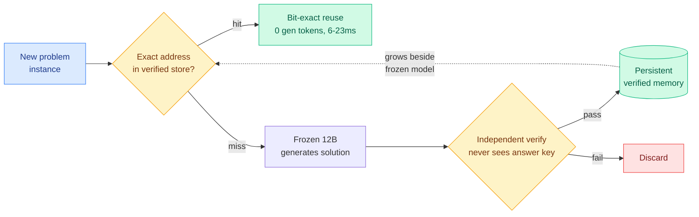
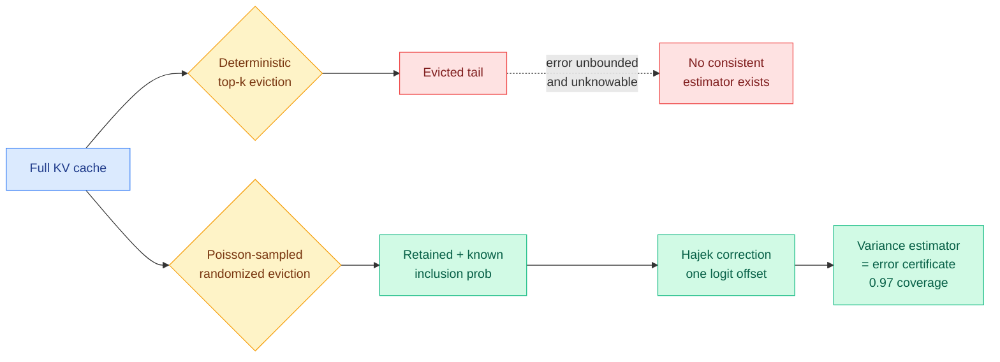

# cere-bro | 2026-07-28

> A quiet paper day with two loud claims underneath it. One says a frozen 12B model can beat frontier APIs at 100% accuracy and zero generation tokens, if it only answers questions it has already verified once. Another proves that every deterministic KV-cache evictor in this wiki is structurally blind to the error it creates. Both say the same thing in different registers: stop paying to recompute what you already know is correct. Meanwhile Moonshot ships Kimi K3's open weights and the infrastructure to serve them, and Anthropic answers with Opus 5 at half the cost.

---

## TL;DR

- **Kimi K3 open weights**: Moonshot ships a 2.8T-parameter MoE (104B active), native vision, 1M context, and claims ~2.5x better scaling efficiency than K2. It also open-sources MoonEP, its expert-parallel serving library.
- **Frozen 12B beats frontier on verified work**: a frozen model plus a persistent verified-solution memory answers repeat problems at zero generation tokens, bit-exact. 180/180 across nine families, four vendors. Emptied memory solves nothing.
- **KV-eviction error certificates**: a proof that deterministic top-k KV eviction cannot know what it destroyed. Randomized (Poisson) eviction restores a per-step error estimate with 0.97 coverage at no accuracy cost.
- **Claude Opus 5 lands at ~half the cost**: near-frontier capability, priced to reset the cost-per-task line just days after Kimi K3.
- **WAIC and Xi's safety turn**: China's leader gives his most safety-forward AI speech yet ("loss of control" three times), and the first intergovernmental AI body (WAICO) is founded with 29 mostly-Global-South members.
- **NVIDIA's $500B SK partnership rattles the market**: shares fell 5%, though The Information notes both this and the OpenAI-Ohio deal are only letters of intent.

---

## Deep Dives

### A Frozen 12B Beats Frontier Models on Verified Work

> The provocation in the title is real: a frozen 12B model scores 180/180 against frontier APIs on verified problems, at zero generation tokens per answer. The catch is the whole point. It only wins on problems it has already solved and verified once. This is the cache-as-capability thesis taken to its logical extreme.

**Source:** HuggingFace Daily Papers (2026-07-28) · Corbenic AI (same lineage as the July 17 Byte-Exact KV-Cache Grafting)
**Links:** [arXiv 2607.23806](https://arxiv.org/abs/2607.23806) · [Public testbench](https://corbenic-galahad-bench.hf.space)

**What is it about?**
The standard way to make a model better is to retrain it: huge compute, a new opaque model each cycle, non-deterministic output. This paper takes the opposite path. The model stays frozen, and a persistent memory of verified solutions grows beside it. Once a problem family is solved and passes an independent verification step that never consults the answer key, every future instance of that family is answered at zero generation tokens, bit-exact, deterministically. It is the same "solve once, replay forever" idea as the July 17 Byte-Exact KV-Cache Grafting paper (which stored a verified KV state and grafted it into fresh contexts), from the same group, now generalized from cache states to a full verified-solution store with a public benchmark.

**What problem does it solve?**
Frontier APIs pay a fresh generation pass on every query, forever, even for a problem they have answered a thousand times. That is pure recomputation waste on any workload with recurring structure. This system pays the reasoning cost once per problem family, gates it behind independent verification, and then serves every repeat for essentially free (1.4 microseconds to select, 6-23 ms to complete a reuse, 36 mWh). The verify-before-store contract is what keeps a memoization system from memorizing wrong answers.

**What is the core novelty?**
Exact addressing over a verified store, and the honesty of the negative control. Across 180 fresh instances spanning nine problem families, four architectures from four vendors (dense and MoE) each score 180/180 at zero generation tokens. Emptied of its memory, the same system solves nothing, which attributes the capability entirely to the store, not the model. The contract extends to open-ended reasoning: 88/88 consistency-gated acceptances, machine-checked formal proof, and 77/80 reasoning-method transfer. A sharp finding for the retrieval crowd: approximate similarity retrieval picks the wrong item 94.3% of the time on a 4,500-item verified store, where exact addressing makes zero errors. Approximate retrieval is the wrong tool when the store demands exactness.

**Key takeaways**
- 180/180 verified-work accuracy at zero generation tokens per answer, across four vendors' architectures.
- The capability is fully in the memory: emptied, it solves nothing (clean negative control).
- Exact addressing beats approximate similarity retrieval decisively (0 errors vs 94.3% wrong-item rate).
- The store doubles as a 6,000,000-token movable context window on a single 46 GB GPU at flat memory, where vLLM stops at ~30K tokens and SGLang silently truncates past 32K.

**Gaps in the study**
The headline only holds on problems the system has already solved and verified. On published benchmarks of raw from-scratch reasoning, frontier models remain far ahead of any 12B, which the paper states plainly. So this is not "a 12B is now frontier"; it is "verified reuse is free where it applies." The engine is proprietary (as with the July 17 paper), and the win depends entirely on workloads having recurring, verifiable problem families, which many real workloads do not.

**Industrial implication**
For any workload with recurring, verifiable queries (compliance checks, standardized financial or legal analysis, repeated code review, benchmark serving), this is a serious cost argument: the frontier API pays forever, verified reuse pays once. It sharpens the routing thesis the wiki has tracked all month. The question is no longer only "which model answers this query" but "has this query been answered and verified before, in which case no model needs to run at all." That is a routing tier above model selection: route to memory before routing to a model.

---

### Error Certificates for KV-Cache Eviction

> Every KV-cache eviction method in this wiki deletes the low-scoring tokens and hopes the loss is small. This paper proves something stronger and more uncomfortable: a deterministic evictor cannot even know how much it lost. The fix is to make eviction random.

**Source:** Kurate cs.LG leaderboard #20 (score 1492, ai_rating 7.0) · flagged as LLM-rated underrated
**Links:** [arXiv 2607.21475](https://arxiv.org/abs/2607.21475) · [Wiki summary](../../inference-efficiency/2026-07-28-kv-eviction-error-certificates.md) · Author: Peng Xie

**What is it about?**
KV-cache eviction (dropping stored attention key-value pairs to save memory during long-context decoding) is normally done by scoring every token's importance and keeping the top-k. This paper makes a formal impossibility argument: because a deterministic evictor keeps a fixed set, an adversary can alter the evicted values so that everything the serving system still holds looks bit-identical while the true attention-output error grows without bound. If the error is invisible from what the server retains, no serving-time estimator of that error can be consistent. Determinism is the problem, not weak estimators.

**What problem does it solve?**
Every prior KV-eviction paper (the wiki has tracked KVpop's learned eviction on July 8, among others) reports downstream accuracy but cannot tell you, at serving time, whether a specific generation was corrupted by eviction. That means you cannot attribute a bad answer to the cache versus the model. This paper gives you that attribution by changing the eviction rule.

**What is the core novelty?**
Reframing eviction as a survey-sampling problem. Poisson-sample the tail at known inclusion probabilities, apply the Hájek correction as a single logit offset inside the softmax, and a standard survey-sampling variance estimator over the retained set becomes a per-step error certificate with 0.97 empirical coverage at no accuracy cost. The certificate lets you attribute a failure to cache-induced error versus inherent model error (AUC 0.65-0.75). The paper's own honest summary: randomization buys attribution, not prediction. You still cannot predict the error before it happens, but you can now measure it after.

**Key takeaways**
- Impossibility result: deterministic top-k eviction makes true attention-output error unidentifiable from what the server can see.
- Randomized (Poisson) eviction restores identifiability via Horvitz-Thompson / Hájek survey-sampling machinery.
- The correction costs one logit offset; the certificate has 0.97 coverage at no measured accuracy cost.
- Enables per-step attribution of failures to cache vs model (AUC 0.65-0.75).

**Gaps in the study**
Kurate-rated 7.0 and absent from HuggingFace, so it has no community reproduction yet. The certificate is diagnostic, not predictive, so it does not prevent a bad eviction, it only tells you afterward one happened. Whether the randomized-eviction accuracy truly matches deterministic top-k at aggressive compression ratios needs independent confirmation.

**Industrial implication**
This is a genuinely new axis for the KV-cache thread the wiki tracks as Tier 1. Every production long-context serving stack evicts, and none can currently certify a given response was not silently corrupted by that eviction. A cheap, statistically grounded error certificate is exactly what a reliability-conscious serving team needs, and the one-logit-offset cost makes it deployable. Pair it with the July 17 grafting and today's frozen-12B paper and the shape of 2026 inference is clear: treat the cache as a measurable, reusable, certifiable asset, not disposable scratch memory.

---

### Kimi K3: Open Frontier Intelligence

> Moonshot did not just release a 2.8-trillion-parameter open model. It released the serving infrastructure too, including a library that improves on the DeepSeek code currently powering vLLM and SGLang. The open-weights escalation the wiki has tracked since July 17 now ships with its own supply chain.

**Source:** HuggingFace Daily Papers + heavy curated Twitter amplification (cross-source confirmed via social)
**Links:** [arXiv 2607.24653](https://arxiv.org/abs/2607.24653) · [Weights](https://huggingface.co/moonshotai/Kimi-K3) · [Wiki summary](../../llms-foundation-models/2026-07-28-kimi-k3-open-frontier-intelligence.md)

**What is it about?**
Kimi K3 is Moonshot AI's open-weights frontier model: 2.8T total parameters, 104B active per token (a mixture-of-experts routing each token through a small subset of specialized sub-networks), native vision, and a 1-million-token context window. The headline is efficiency, not size: roughly 2.5x better scaling efficiency than Kimi K2, meaning 2.5x the capability per unit of training compute. It trails Claude Fable 5 and GPT-5.6 Sol on Moonshot's own suite but beats every other model they tested, open or proprietary.

**What problem does it solve?**
The open-weights story so far (tracked from the July 17 Kimi K3 parameter leak through the jagged frontend-vs-math results) has been about capability catching up. This release addresses the harder problem: serving a 2.8T model economically. Moonshot open-sourced MoonEP, an expert-parallelism communication library that improves on DeepSeek's DeepEP, the current default in vLLM and SGLang, plus attention kernels and agent-environment infrastructure. Open weights without cheap serving is a lab demo; shipping the serving stack is what makes it deployable.

**What is the core novelty?**
Bundling the model with the infrastructure to run it, and doing so as open source that displaces the incumbent open serving code. If MoonEP genuinely beats DeepEP, Moonshot is not just competing on model quality but on the serving substrate the entire open-weights ecosystem runs on.

**Key takeaways**
- 2.8T MoE, 104B active, native vision, 1M context; ~2.5x K2's scaling efficiency.
- Trails Fable 5 and GPT-5.6 Sol but beats all other tested models on Moonshot's suite.
- Ships MoonEP (expert-parallel serving), attention kernels, and agent-env infra as open source.
- Cross-source confirmed: HuggingFace top plus heavy curated Twitter amplification.

**Gaps in the study**
Benchmarks are Moonshot's own; independent confirmation of the 2.5x efficiency and the frontier-adjacent claims is pending, and the wiki's July 19 note (Kimi K3 strong on frontend code, ~39% on FrontierMath Tier 4 vs ~90% for closed frontier) is the caution that the capability is jagged. MoonEP's claimed edge over DeepEP needs third-party serving benchmarks.

**Industrial implication**
This lands the same week as Claude Opus 5 at half the cost, which is not a coincidence but a price war. A deployable 2.8T open model with its own optimized serving stack is the strongest pressure yet on closed-model pricing, and it is exactly what makes the open-weights export-control debate (WAIC, below) urgent rather than theoretical.

---

## Industry Pulse

- **Anthropic launches Claude Opus 5** with near-frontier capability at roughly half the cost, resetting the cost-per-task line days after Kimi K3 ([AI Breakfast](https://aibreakfast.beehiiv.com/)).
- **Kimi K3 open weights ship** with the MoonEP serving library that improves on DeepSeek's DeepEP ([HuggingFace](https://huggingface.co/moonshotai/Kimi-K3)).
- **WAIC 2026 and Xi's safety turn**: China's leader gave his most safety-forward AI speech to date, invoking "loss of control" in three separate passages and pairing it with a call against overstretching national-security framing ([AI Safety China](https://aisafetychina.substack.com/)).
- **First intergovernmental AI body founded**: the World AI Cooperation Organization (WAICO), 29 mostly-Global-South founding members, mandate centered on capacity building ([AI Safety China](https://aisafetychina.substack.com/)).
- **WAIC Chair's Statement names frontier cyber risk**: first such reference in a high-level Chinese government document since Claude Mythos, plus agent behavioral-boundary and anti-terror-misuse provisions ([AI Safety China](https://aisafetychina.substack.com/)).
- **Gary Marcus on "circular financing"**: a skeptical read of the AI capital structure, arguing the vendor-to-customer-to-investor money loops are shakier than they look ([Marcus on AI](https://garymarcus.substack.com/)).
- **Apple's smart-glasses dilemma**: useful vs private, as Apple weighs how much on-device sensing consumers will accept ([AI Weekly](https://aiweekly.co/)).
- **Frozen-12B verified-reuse testbench goes public**: a free, rate-limited benchmark accompanies the paper, an unusual move for a proprietary-engine result ([HF Space](https://corbenic-galahad-bench.hf.space)).

**Funding, valuations, and compute deals**

- **NVIDIA's $500B SK Group partnership**: NVIDIA shares fell 5% on the news plus a WSJ report it is in talks to help finance a $500B OpenAI data-center campus in Ohio ([The Information](https://www.theinformation.com/articles/why-investors-shouldn-t-panic-about-nvidia-s-commitments)).
- **The Information's caution on both deals**: NVIDIA-SK is only a letter of intent so far, echoing the September NVIDIA-OpenAI LOI that was abandoned months later. Treat the $500B figures as intent, not committed capital ([The Information](https://www.theinformation.com/articles/why-investors-shouldn-t-panic-about-nvidia-s-commitments)).
- **China's capacity-building commitments**: over the next five years China will provide developing countries 5,000 AI training opportunities and extend its MAZU weather-warning AI to 30 countries, a soft-power compute-access play ([AI Safety China](https://aisafetychina.substack.com/)).

---

## Global View

**The cache stopped being scratch memory and became the unit of capability this month, and today's two efficiency papers are the clearest statement of it.** The frozen-12B paper says a verified-solution store lets a small frozen model beat frontier APIs at zero tokens on any problem it has solved before, and the KV-eviction-certificate paper says the only way to trust what a cache discarded is to make eviction random and measure the loss. Both descend from the July 17 Byte-Exact KV-Cache Grafting result (store a verified computation, replay it bit-exact) and pair with July 8's KVpop (learned eviction) as the wiki's four-part account of the cache as a measurable, reusable, certifiable asset. The industrial mirror is the same-week Opus 5 (half cost) and Kimi K3 (open weights plus a serving library): both are bets that most of what a frontier model produces is not frontier-grade work and should not be recomputed or repriced every time. Research says stop recomputing what you have verified; industry is pricing exactly that.

**The open-weights escalation and its regulatory shadow arrived in the same 48 hours, which is the whole story.** Kimi K3 shipping 2.8T open weights with an open serving stack that displaces DeepSeek's incumbent code is the capability event; WAIC's Chair Statement naming frontier cybersecurity risk for the first time since Mythos, plus the US export controls on Anthropic's Fable 5 over a cyber-safeguard bypass, is the governance event. The July 12 Interconnects "six months to live for open models" thesis predicted exactly this collision, and it is now concrete on both sides: China founds the first intergovernmental AI body (WAICO) around open-source capacity building for the Global South, while the US moves toward restricting frontier open weights. The same open model is simultaneously a commercial weapon against closed-lab pricing and a policy problem, and the two facts are now inseparable.

**Today's HuggingFace batch is genuinely thin, and the signal came from the leaderboard and the newsletters instead, which is worth noting as a pattern.** The top HF paper drew only 35 upvotes and the Tier 1 substance (the KV-eviction certificate) came from Kurate, not HuggingFace, flagged as LLM-rated underrated. On days like this the cross-source design earns its keep: the paper HuggingFace's community under-ranked is the one that advances the wiki's core KV-cache thread, and the real industry weight (Opus 5, WAIC, the NVIDIA-SK LOI) came entirely from Gmail and RSS. A digest built from HuggingFace alone today would have led with a robotics survey and missed everything that mattered.

---

## Looking Ahead

- **Someone builds the "route to memory before routing to a model" tier within 90 days.** The frozen-12B paper proves verified reuse is free where it applies, and the month's routing papers (DeepMind meaningfulness, IBM system-cost) argue routing is judged and priced wrong. The synthesis is a router that checks a verified store before invoking any model. Signal: a routing paper or serving system that reports a "memory-hit rate" as a first-class metric alongside accuracy and cost.
- **The randomized-eviction certificate gets adopted or refuted within 60 days.** The impossibility result for deterministic eviction is strong enough that either a serving stack ships a certificate, or someone shows the randomized-eviction accuracy penalty is real at production compression ratios. Signal: a vLLM/SGLang issue or paper either implementing Poisson eviction or measuring its accuracy cost.
- **MoonEP is independently benchmarked against DeepEP within 30 days.** Moonshot's claim that its open serving library beats the DeepSeek code powering vLLM and SGLang is checkable and consequential for the whole open ecosystem. Signal: a third-party expert-parallelism throughput comparison.
- **A US frontier-open-weights restriction proposal names a capability threshold within 60 days.** WAIC's cyber-risk statement and the Fable 5 export controls are the two halves; the missing piece is a concrete US threshold. Signal: an executive order draft, NIST framework, or bill specifying an open-weight capability line.
