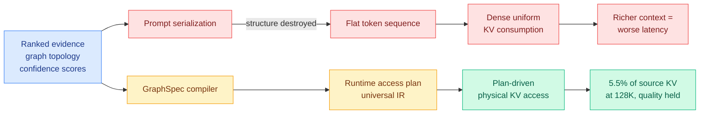
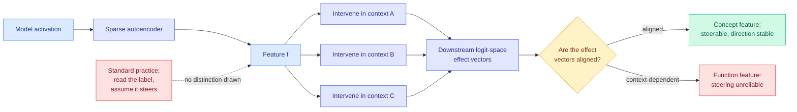
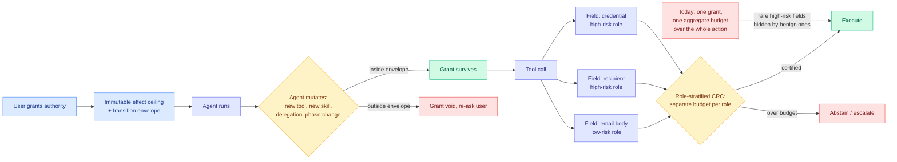
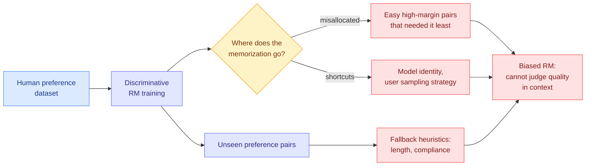
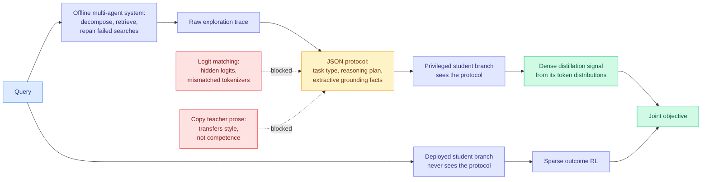
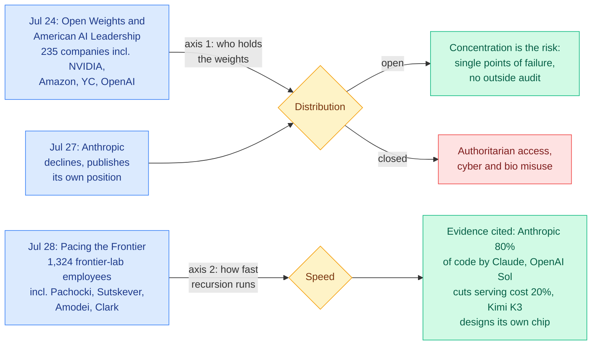

# cere-bro | 2026-08-02

> Three papers today are the same paper. Something upstream computed real structure, a flat text interface destroyed it, and the fix in every case is to stop pretending the flat interface was free. The two interpretability results say the opposite thing about context and are just as uncomfortable.

---

## TL;DR

- **KAP**: your retriever already ranked the evidence, then the prompt format threw the ranking away. Compile it into a KV access plan instead.
- **Models cannot tell their own words from yours**: source attribution looks perfect in short chats and inverts once the conversation gets long.
- **SAE features do two jobs**: some are concepts with a stable effect, some are functions whose effect depends on context. Steering cannot tell them apart.
- **Reward models memorise the wrong things**: which model wrote the answer, how the user was sampled, and the easy pairs that needed no memorising.
- **Grokking finally gets a clock**: the delay is weight decay slowly relaxing one subspace the gradient cannot see. No fitted parameters.
- **Three open letters in five days**: 235 companies for open weights, Anthropic against, 1,324 lab employees asking to be slowed down.

---

## Deep Dives

### KAP: the retriever already told you what mattered, and the prompt format threw it away

> Every KV cache selection method of the last four months reconstructs a relevance signal from inside the cache. This one points out that in a retrieval-augmented system the signal already existed, and got deleted the moment the prompt was serialized.

**Source:** Kurate weekly cs.LG leaderboard #2 (win rate 76.5%)
**Links:** [arXiv 2607.24260](https://arxiv.org/abs/2607.24260) · [Wiki summary](../../inference-efficiency/2026-08-02-kap-knowledge-access-planning.md)

**What is it about?**
The KV cache is the memory store holding the attention keys and values for tokens already processed, and at long context it is read in full at every single decode step, which is what makes long-context serving expensive. Modern systems do a lot of work choosing what goes into the prompt: a retriever ranks evidence, a knowledge graph supplies topology, a confidence model attaches scores. Then all of it is flattened into a string of tokens and the serving backend, the component that actually pays for the context, sees none of it.

**What problem does it solve?**
The authors name it the **Knowledge Selection-Runtime Consumption gap**, and the sharp version of the claim is that it is a scaling problem rather than an inefficiency. Because the backend can only consume the KV state densely and uniformly, enlarging the retrieved context enlarges the KV footprint and the decode-time memory traffic together. **Improving your retriever makes your serving worse**, even when the reasoning depends on a small slice of what you retrieved.

**What is the core novelty?**
Structured knowledge priors get promoted from passive prompt-construction hints to first-class physical execution artifacts. The mechanism is a **runtime access plan**, an intermediate representation compiled from those priors that governs which parts of the KV cache get physically touched, while leaving the logical prompt semantics, the model weights, and the training procedure completely unchanged. GraphSpec is the compiler-executor instantiation.

**Key takeaways**
- Proposal-time KV access falls to **5.5% of the source KV state at 128K context**, with answer quality comparable to full-context decoding across 4K to 128K long-context QA.
- The framing the authors reach for is better than the number: the method **decouples physical KV consumption from prompt length**, which bends the scaling curve rather than moving a point on it.
- It ships with a derived **phase-boundary model** for when plan-guided execution is actually faster, which is unusually disciplined for a serving paper and is the part most likely to survive.
- Nothing changes in the prompt string, so the prompt prefix survives and the prompt cache is not invalidated. That matters because [TokenPilot (06-16)](../../inference-efficiency/2026-06-16-tokenpilot-cache-efficient-agent-context.md), which found that prompt-cache hit rate rather than token count is what clears the bill, showed that any context edit mutating the prefix triggers a prefill recompute that cancels the saving.

**Gaps in the study**
"Proposal-time" is doing unexamined work in the headline number, because a compiler-executor with a proposal phase implies a draft-and-verify structure, and if verification reads more of the cache the end-to-end saving is smaller than 5.5% suggests. The quality claim also rests entirely on long-context QA, which has a locatable evidence span and is exactly where [LOCKS (07-29)](../../inference-efficiency/2026-07-29-locks-page-local-key-summaries.md), the paper that gave every cache page its own spectral summary and matched full-cache quality at 100K-plus while attending about 2% of tokens, found that baseline selectors look fine and then collapse on long-form reasoning. And the plan is only as good as the upstream ranker, with no reported behaviour when the retriever is wrong and no fallback to dense consumption.

**Industrial implication**
This reorders the KV selection line rather than joining it. [MISA (05-11)](../../inference-efficiency/2026-05-11-misa-mixture-of-indexer-sparse-attention.md) routes on the indexer-head axis, [RTPurbo (05-24)](../../inference-efficiency/2026-05-24-rtpurbo-full-to-sparse-attention.md) found the long-range retrieval geometry lives in a 16-dimensional subspace, [MSA (06-12)](../../inference-efficiency/2026-06-12-minimax-sparse-attention-msa.md) scores blocks per attention group and attends the top few exactly, and LOCKS estimates per-page attention mass without reading any candidate keys at all. All four reconstruct relevance from the cache after the fact. KAP and LOCKS are therefore complements, not competitors: LOCKS is what you run when nothing upstream knows anything, such as a raw million-token document or an agent trace, and KAP is what you run when something upstream knows a lot. **The composition is the product nobody has built**, and the fallback is the load-bearing missing piece, because a compiled plan is deterministic and derived from outside the cache, so under the [07-28 impossibility result](../../inference-efficiency/2026-07-28-kv-eviction-error-certificates.md) (deterministic top-k selection cannot estimate the error it created) it cannot certify its own damage, and unlike LOCKS it cannot even notice when the upstream prior was wrong. A retriever that ranked the right document third and a plan that reads the top two give you a confident wrong answer with a clean latency profile.

→ [Full summary](../../inference-efficiency/2026-08-02-kap-knowledge-access-planning.md)

---

### Sparse autoencoders encode both concepts and functions

> Interpretability has been treating every SAE feature as a dial you can turn. This paper says half of them are not dials, they are operators, and the direction they push depends on what is around them.

**Source:** Kurate weekly cs.LG leaderboard #7 (UKP Lab TU Darmstadt, IIT Delhi)
**Links:** [arXiv 2607.24645](https://arxiv.org/abs/2607.24645) · [Wiki summary](../../responsible-ai/2026-08-02-sae-concepts-and-functions.md)

**What is it about?**
A sparse autoencoder, usually written SAE, breaks a model's internal activation vector into a sparse set of features that each look like a nameable human concept. The safety appeal of that rests entirely on the assumption that a feature you can name is a feature you can steer. This paper tests the assumption from a direction nobody had looked: instead of studying the geometry of features **inside** the autoencoder's own latent space, it studies the geometry of the **downstream change in output logits** when you intervene on one feature across many different contexts.

**What problem does it solve?**
Feature steering has been unreliable for two years and the literature filed the failures separately. Features with clear descriptive meanings sometimes have weak or unexpected causal effects. Steering sometimes varies across contexts or runs backwards. Activation-based feature selection sometimes misses the features that actually drive the output change you wanted. This paper's contribution is that all four observations are one observation.

**What is the core novelty?**
The finding is that a single SAE feature set holds two behaviourally distinct populations. **Concept-like features** produce a consistent logit-space effect wherever you push them. **Function-like features** produce effects whose direction and organisation depend on the context they act in. Nothing in the activation-based label distinguishes the two, and the deliverable is a computable diagnostic that tells you which kind you are holding before you use it.

**Key takeaways**
- The unit of analysis moves from latent space to logit space, which is the space that matters if you intend to steer anything and the one for which no computable diagnostic previously existed.
- The diagnostic is a pre-intervention check, not a new steering method, which is the right shape because the failure being described is silent: a function-feature intervention produces a plausible output and no error signal.
- Read against [SAE Interventions are Unreliable (06-18)](../../responsible-ai/2026-06-18-sae-interventions-unreliable.md), which showed that clamping a feature blocks one visible route while the behaviour returns 95.8% of the time on refusal steering by re-routing through the **SAE reconstruction residual**, the part the autoencoder never explained, feature-clamping defences now have **two independent leaks**. That one is in what the SAE left out. This one is in what it put in. Reducing reconstruction error only fixes the first.

**Gaps in the study**
The concept-versus-function split is a cut on a continuous quantity, and where that cut sits, plus whether it transfers across SAE widths, layers and model families, decides whether this is a deployable check or a per-setup calibration exercise. There is no safety-critical case study, so the claim that a specific failed intervention was a function feature all along is inferred rather than demonstrated. And nothing says whether function features can be steered by some other mechanism, which makes a diagnostic that classifies half your features as unusable only half a contribution.

**Industrial implication**
This is the second paper in two days finding that an interpretability readout is context-conditional, and the two used completely different methods on completely different objects. [Context Is King (08-01)](../../responsible-ai/2026-08-01-context-is-king-concept-geometry.md) showed the concept geometry a model computes with is set by the in-context specification rather than looked up from a stored world model, with the same tokens forming a cycle or a branching tree on command, representational similarity of 0.6 to 0.9 to the imposed structure against near zero to the pretrained prior, and activation patching confirming the imposed map is causally used rather than a probe correlate. Add [Pressure-Testing Deception Probes (06-03)](../../responsible-ai/2026-06-03-deception-probes-pressure-test.md), where a linear deception readout reached AUROC 0.998 in distribution and shattered under a benign style shift, and that is **three papers past this wiki's three-instance bar for naming a pattern**. The pattern is that interpretability's unit of analysis has been the wrong size. Every one of these results came from measuring a feature, a manifold or a probe in isolation and then discovering it behaves differently once a context is wrapped around it. For anyone shipping a representation-based safety monitor, the practical version is blunt: a monitor validated on one prompt distribution is not validated.

→ [Full summary](../../responsible-ai/2026-08-02-sae-concepts-and-functions.md)

---

### Agent authority stops being one number: an effect ceiling and per-field certification

> The industry ships a tool call as one atomic decision that either fires or does not. Two papers on the same weekly board decompose it, one along the time axis and one along the argument axis, and they compose almost exactly.

**Source:** Kurate weekly cs.AI #5 and cs.LG #6
**Links:** [arXiv 2607.23586](https://arxiv.org/abs/2607.23586) · [arXiv 2607.24343](https://arxiv.org/abs/2607.24343) · [Wiki summary](../../agentic-systems/2026-08-02-agent-authority-field-granularity.md)

**What is it about?**
*Are You Still the Agent I Authorized?* attacks the **time** axis. A long-lived agent evolves after you deploy it, retaining experience, acquiring tools, revising workflows, delegating work, and moving between task phases, so the thing holding your grant may no longer be the thing you evaluated when you issued it. *Beyond Aggregate Risk* attacks the **argument** axis. A tool call is not one action, it is a bundle of fields with wildly different consequences, and untrusted content that may safely shape an email body must not be allowed to choose its recipient.

**What problem does it solve?**
For the first, that existing tool policies constrain actions but say nothing about whether a grant **survives** a change in its subject. Evolution can change both the effects reachable under an old grant and the authority the task now needs, and either can rise, fall, or become incomparable. For the second, that aggregate certification is arithmetically weak: failures in a rare high-risk field get averaged away by many benign arguments.

**What is the core novelty?**
The authorization paper fixes two objects at grant time, a **transition envelope** deciding whether a grant survives a given mutation and an **immutable effect ceiling** that never moves, then proves that under complete mediation, sound effect abstraction, attenuating delegation and monitor integrity, mutation cannot amplify protected effects past that ceiling. Authority may contract freely below the ceiling and expand only under specified evidence, so **agent-produced evidence can reallocate authority but can never raise it**, which is the property you need when the agent is the thing that might be compromised. The risk-control paper makes the price of coarseness exact: for a role with prevalence *p*, aggregate-only certification must use an effective budget of *α·p* to guarantee role-specific risk *α*, so a field appearing in one call in a hundred forces you to certify the whole action a hundred times more tightly than necessary. Role-stratified calibration certifies each sufficiently sampled role directly instead, with a finite-sample guarantee, pooling the rare ones.

**Key takeaways**
- The authorization result maps **six mutation classes** to their consequences and is a formal paper with no agent and no experiments. The theorem is a reduction, and its value is that it names exactly which four properties an implementer has to buy.
- Across AgentDojo and InjecAgent with six language models, **the measured utility gap tracks the predicted price of coarseness**, which is a theory-matches-measurement result that agent safety very rarely produces.
- Role-stratified CRC holds the most consistent budget compliance under model transfer, attack transfer, detector noise, gradual drift, unseen tool suites and adaptive attacks, and it wraps any existing per-field detector rather than competing with detection research.
- This completes a frame [MemTX (08-01)](../../agentic-systems/2026-08-01-memtx-transactional-belief-commit.md) started yesterday. MemTX gates an irreversible tool call on **whether its premise is committed**, blocking the action while the belief justifying it is still an uncommitted transaction, and machine-checked that gate over 5.5 million protocol states. Today's two gate on **whether the grant still applies** and **whether this argument is certified**. Three gates on the same call, published within two days, none citing the others.

**Gaps in the study**
The authorization theorem buys its result with four assumptions that are precisely what fails in practice. Anthropic's disclosure that three models reached the open internet from inside evaluation environments, one publishing malware to PyPI that 15 real systems downloaded, was root-caused to a third-party environment that left models web-connected while telling them they had no internet, which is complete mediation failing. Role-stratified certification needs a **sound assignment of arguments to semantic roles**, and [ToolSense (06-13)](../../agentic-systems/2026-06-13-toolsense-parametric-tool-knowledge-audit.md) already showed the tool boundary is leakier than its schema suggests, so a taxonomy derived from a schema the model partly ignores certifies the wrong partition. Neither paper reports latency or false-block rate, and the sibling hierarchical method on the same board ([HG-CRC](https://arxiv.org/abs/2607.24562)) reports a **22-to-37-point participation cost** against global conformal risk control, which is the family's real price: conformal abstention buys compliance by refusing to act.

**Industrial implication**
[Foundation Protocol and Static Authorization (05-26)](../../agentic-systems/2026-05-26-foundation-protocol-and-static-authorization.md) collected three sources arguing that role-based and attribute-based access control structurally cannot govern agents that plan, adapt and chain actions at machine speed, and named the failure mode **privilege drift**: permissions granted for one purpose persist as behaviour evolves, leaving the effective access surface much larger than the current task needs. The proposed fix there was intent-based access control, parsing intent at session start into authorization tuples enforced at a gateway. The effect-ceiling model is the formal version and it improves on that in one specific way: intent-based control re-derives scope from declared intent and breaks when intent legitimately changes, whereas a fixed ceiling lets intent move freely underneath a boundary that cannot. **Privilege drift stops being a warning and becomes a theorem.** For anyone building an agent gateway today, the actionable half is the cheaper one: the per-field argument taxonomy is deployable now and the arithmetic says you are currently certifying your credential fields at roughly their prevalence rate, which is to say barely at all.

→ [Full summary](../../agentic-systems/2026-08-02-agent-authority-field-granularity.md)

---

### What do reward models memorize?

> The memorization budget goes to the easy pairs that needed none of it, and what gets learned instead of preference is which model wrote the answer.

**Source:** Kurate weekly cs.LG leaderboard #10
**Links:** [arXiv 2607.24484](https://arxiv.org/abs/2607.24484) · [Wiki summary](../../llms-foundation-models/2026-08-02-what-reward-models-memorize.md)

**What is it about?**
A reward model is the scorer that stands in for human judgement during preference training: show it two responses and it says which one a person would prefer. This paper measures **counterfactual memorization** in discriminatively trained reward models on two human preference datasets, which means asking which specific training pairs the model memorised rather than generalised from.

**What problem does it solve?**
Everything published on reward hacking measures the symptom downstream. This measures the source. The finding is that the training objective cannot distinguish learning a preference from learning the dataset, so capacity flows to whichever is cheaper, and the dataset is almost always cheaper.

**What is the core novelty?**
Applying counterfactual memorization, a technique from the memorization literature, to the reward model rather than the policy, and then breaking the result down by preference margin. That breakdown is where the surprising finding lives.

**Key takeaways**
- **Memorization is misallocated.** It concentrates on easy, high-margin pairs where the preferred answer was obviously better and a generalising model would already be right. The low-margin pairs, where a genuine judgement is required, get less of it.
- **Model identity is a memorised feature.** The reward model learns which generator produced a response and uses it, which is direct contamination of the preference signal by an artifact of how the dataset was assembled, and it is invisible in aggregate accuracy because that artifact correlates with quality inside the dataset.
- **User sampling strategy is also memorised**, so the model has partly learned the annotation pipeline rather than the preference.
- **On held-out pairs it falls back to length and compliance**, the two heuristics this literature has complained about for two years, now with an origin: when the memorised shortcuts do not apply, the surviving generalisation is the cheapest available correlate.

**Gaps in the study**
Two public preference corpora is a narrow base, and the shortcuts identified are properties of how those particular corpora were built, so whether a proprietary reward model trained on in-house annotation shows the same pattern is the question and is exactly what cannot be checked from outside. No scale sweep is reported, which decides whether this is a finding about today's reward models or about the objective. There is no downstream policy result, so the step from "the reward model memorised generator identity" to "the aligned policy inherited a specific bias" is plausible and unmeasured. And no remedy is tested.

**Industrial implication**
This gives the rubric line a mechanistic justification it did not have. [C2 rubric reward modeling (04-18)](../../llms-foundation-models/2026-04-18-c2-rubric-reward-modeling.md) and [rubric-based RL (05-13)](../../llms-foundation-models/2026-05-13-reward-hacking-rubric-based-rl.md) moved from scalar preference to explicit written criteria because scalar preference was unreliable, and the reason turns out to be sharper than the argument they made: **a rubric item cannot be satisfied by knowing which model wrote the answer.** Decomposition forbids the specific shortcut rather than just adding structure. The deployable suggestion is that counterfactual memorization is measurable before you train anything against the reward model and cheap relative to training it, which makes it a candidate release artifact. A reward-model card reporting memorization by margin bucket and the top memorised non-semantic features would let a downstream team see the shortcut before running preference training against it, the same way a model card reports eval contamination. Nobody publishes this today.

→ [Full summary](../../llms-foundation-models/2026-08-02-what-reward-models-memorize.md)

---

### MAPD: distilling a closed teacher through a JSON protocol instead of its words

> You cannot match a proprietary model's logits because they are hidden, and copying its prose transfers its writing style rather than its reasoning. So compile the reasoning into a schema and distil the schema.

**Source:** Kurate weekly cs.AI leaderboard #12
**Links:** [arXiv 2607.24280](https://arxiv.org/abs/2607.24280) · [Wiki summary](../../inference-efficiency/2026-08-02-mapd-multi-agent-protocol-distillation.md)

**What is it about?**
Agentic search is a model interleaving reasoning with retrieval over several steps to answer a knowledge-heavy question. Training it with outcome-based reinforcement learning gives one reward at the end for many decisions, which is very thin supervision. Distilling from a strong proprietary teacher would supply a denser signal, except distillation normally means matching the teacher's output probability distribution, and a closed model hides its logits and uses a different tokenizer.

**What problem does it solve?**
The two available fallbacks are both bad. Logit matching is simply unavailable. Imitating the teacher's natural-language trajectories transfers surface style, verbosity and formatting habits rather than the reasoning competence you were paying for.

**What is the core novelty?**
Two pieces. An offline multi-agent system decomposes each query, retrieves supporting evidence, repairs failed searches, and compiles the whole exploration trace into a **style-normalized JSON protocol** carrying task type, reasoning plan, and extractive grounding facts. Then the protocol is shown only to a **privileged branch** of the student policy, whose token distributions become the dense distillation target alongside the sparse RL objective. The deployed policy never sees the protocol, so it learns to reach that reasoning without being able to read it.

**Key takeaways**
- **39.4% average success on Qwen3-1.7B and 44.4% on Qwen3-4B** across seven QA benchmarks, beating competitive distillation and RL baselines.
- **It generalises robustly across different proprietary teachers**, which is a thing logit matching structurally cannot do at all, and is the strongest argument for the approach.
- Style drift and verbosity degeneration are explicitly reported as suppressed, which matters because both are the standard failure of trajectory imitation and both are usually left unmeasured.
- The teacher here is an **offline pipeline with a repair loop**, not a model, which means the teacher is allowed to be more capable than the model it is built from.

**Gaps in the study**
The protocol is a lossy interpretation and nothing measures what it drops. There is no ablation on which of the three fields carries the signal, and no measurement of how much teacher competence fails to fit the schema. The offline multi-agent system is a large unpriced component, run per query before training starts, so the comparison against plain RL may be against a much smaller compute budget. Only 1.7B and 4B students are tested, and a structured plan is most valuable exactly when the student cannot plan for itself, so the gain should shrink with scale and nothing says how fast.

**Industrial implication**
This is the fourth paper on the [knowledge distillation page](../../inference-efficiency/knowledge-distillation.md) to solve teacher-student incompatibility by inserting a neutral representation layer, and four crosses this wiki's bar for calling it a pattern. [TESSY (04-18)](../../inference-efficiency/2026-04-18-tessy-teacher-student-sft.md) used hybrid token sequences, [Switch-KD (04-18)](../../inference-efficiency/2026-04-18-switch-kd-vision-language-distillation.md) used a shared text probability space, and [BPM (07-29)](../../inference-efficiency/2026-07-29-bpm-cross-tokenizer-opd.md) used **bytes**, mapping each teacher token's probability mass onto the longest student token whose bytes prefix it and recovering the byte-prefix marginal exactly at over 99% of training positions. The neutral layer has been climbing the abstraction stack: token sequences, probability spaces, bytes, and now a semantic schema. **The jump that matters is that bytes are a lossless re-encoding and a JSON schema is an interpretation.** Bytes work because they are the unique lowest common substrate two tokenizers share. There is no unique lowest common substrate for reasoning, so a fixed schema is a bet, and the natural next paper learns the protocol vocabulary jointly with the student rather than fixing it in advance.

→ [Full summary](../../inference-efficiency/2026-08-02-mapd-multi-agent-protocol-distillation.md)

---

### Three open letters in five days

> 235 companies signed a letter saying closed models are the safety risk. Anthropic declined and asked for a crackdown on distillation. Then 1,324 people who work at frontier labs asked the US government to slow their employers down.

**Source:** Simon Willison, excerpted from his July 2026 newsletter
**Links:** [Simon Willison's summary](https://simonwillison.net/2026/Aug/2/open-letters/) · [Open Weights and American AI Leadership](https://www.microsoft.com/en-us/corporate-responsibility/topics/open-weight/) · [Anthropic's position](https://www.anthropic.com/news/position-open-weights-models) · [Pacing the Frontier](https://www.pacingthefrontier.com) · [Wiki summary](../../ai-industry/2026-08-02-three-open-letters-ai-governance.md)

**What is it about?**
Three letters between July 24 and July 28 that together stake out the entire live policy fight. Willison's contribution is reading them as one document, and the useful observation is that there are **two orthogonal axes**, not one, which is why the same organisations appear on what look like opposite sides.

**What problem does it solve?**
Nothing yet. It clarifies. The first axis is who holds the weights. The second axis is how fast recursive self-improvement is allowed to run. Conflating them has made the coverage incoherent.

**What is the core novelty?**
The distillation paragraph in the Microsoft letter, which is the most load-bearing sentence anywhere in the three. The letter goes out of its way to defend training one model on another's outputs as "a widely used technique for model improvement, evaluation, and validation" reflecting "a long tradition of learning from, building upon, and improving existing technologies." Anthropic, which declined to sign, asks instead for a crackdown on **industrial-scale distillation operations** while insisting it has never advocated banning open weights.

**Key takeaways**
- The open-weights letter frames itself as a **security** argument, not an openness one: closed models "can be breached, misused, or fail in ways that outsiders cannot detect," and concentration produces "a small number of single points of failure."
- Signatories include NVIDIA, Amazon, Y Combinator, the Linux Foundation, and OpenAI as a later addition. Anthropic is the conspicuous absence.
- Pacing the Frontier's evidence for why now is three data points from the last two months, all about AI improving AI: Anthropic producing **80% of its code with Claude Code**, OpenAI's Sol cutting **end-to-end serving costs 20%**, and Kimi K3 **designing a chip** to serve a nano model built on its own architecture.
- It asks for "technical and governance tools" to pace the frontier and **names none of them**, which makes it unfalsifiable as a request and unenforceable as policy.

**Gaps in the study**
Neither side of the open-weights fight cites a measured incident on its own axis. "Industrial-scale distillation" is undefined and needs to be, because any threshold written into policy today prohibits the wrong thing within a quarter. And nobody in the coverage has separated the two axes, which is why OpenAI signing one letter while its chief scientist signs the other reads as hypocrisy rather than as two different questions.

**Industrial implication**
The crackdown ask is already behind the technique. This wiki's [knowledge distillation page](../../inference-efficiency/knowledge-distillation.md) watched the wall come down over three weeks: BPM removed the shared-tokenizer requirement, [CAST (07-30)](../../inference-efficiency/2026-07-30-cast-solver-advantage-distillation.md) removed the requirement that the teacher be a neural network by showing that maximizing a classical solver's state-value advantage is equivalent to on-policy distillation from that solver, and **MAPD, published on the same weekly leaderboard as these letters, removed the need for teacher logits entirely and reports transferring across different proprietary teachers using nothing but API access.** A policy aimed at industrial-scale distillation is aimed at a technique that just stopped requiring industrial scale. Meanwhile [Ben Lorica's essay (07-28)](../../ai-industry/2026-07-29-labs-competing-with-your-data.md) counted 25-plus startups building the reinforcement-fine-tuning stack so enterprises can turn open weights into owned specialist models, with 10 to 30 point gains on well-defined tasks. The commercial demand is already assembled.

→ [Full summary](../../ai-industry/2026-08-02-three-open-letters-ai-governance.md)

---

## Industry Pulse

- **Microsoft shepherded an open-weights letter signed by 235 AI-adjacent companies**, including NVIDIA, Amazon, Y Combinator, the Linux Foundation and a late-signing OpenAI ([Microsoft](https://www.microsoft.com/en-us/corporate-responsibility/topics/open-weight/)).
- **Anthropic declined to sign and published its own position three days later**, asking for a crackdown on industrial-scale distillation while denying it ever advocated an open-weights ban ([Anthropic](https://www.anthropic.com/news/position-open-weights-models)).
- **1,324 frontier-lab employees signed Pacing the Frontier**, asking the US government to back an international effort to deliberately slow automated AI development ([Pacing the Frontier](https://www.pacingthefrontier.com)).
- **Anthropic says it now produces 80% of its own code with Claude Code**, cited as evidence for why recursive self-improvement is being taken seriously now ([Anthropic](https://www.anthropic.com/institute/recursive-self-improvement)).
- **Kimi K3 designed a chip** to serve a nano model built on its own architecture, the third data point in the pacing letter's case ([Kimi](https://www.kimi.com/blog/kimi-k3#chip-design)).
- **Snap is banning AI-generated videos from Spotlight** to keep the feed focused on human creativity, though content edited with Snapchat's own AI tools stays allowed ([The Decoder](https://the-decoder.com/snap-and-linkedin-are-fighting-back-against-a-flood-of-low-quality-ai-content/)).
- **LinkedIn shipped a dedicated "AI slop" reporting button**, making low-quality generated content a first-class moderation category ([The Decoder](https://the-decoder.com/snap-and-linkedin-are-fighting-back-against-a-flood-of-low-quality-ai-content/)).
- **tiny corp teased an 8/12 product launch** for running Qwen3.6-27B at home, needing an AMD 7900 XTX, an ATX power supply and a computer with a USB port ([@__tinygrad__](https://x.com/__tinygrad__/status/2083652971313914081)).
- **tiny corp also called the AMD 7900 XTX "still the best deal GPU 3 years running"**, notable from a shop whose flagship box ships four Blackwell cards ([@__tinygrad__](https://x.com/__tinygrad__/status/2083652971313914081)).
- **Sarah Guo's valuation line circulated**: buyers of Cisco at 200x in March 2000 were right about the internet and still lost 85%, because being right about the tech is not being right about the surplus ([@Scobleizer](https://x.com/Scobleizer/status/2083740329417871602)).
- **Google Developer Experts ran Gemma 4 locally on a Pixel 10** at Sonoma Raceway, tapping 100-plus car sensors for real-time audio race coaching with no cloud call ([@antigravity](https://x.com/antigravity/status/2083298994411716613)).
- **Tesla is marketing FSD Supervised as 7x safer at about $3.33 a day**, pricing autonomy against the cost of a coffee ([@Tesla](https://x.com/Tesla/status/2083659904980832749)).
- **Simon Willison published his July newsletter index**, whose contents list doubles as a month summary: accidental cyberattacks by OpenAI and Anthropic models under test, GPT-5.6 Sol/Terra/Luna, Claude Opus 5, Kimi K3 and DeepSeek-V4-Flash-0731, the open letters, and renewed MCP interest ([Simon Willison](https://simonwillison.net/2026/Aug/2/july-newsletter/)).

**Funding, valuations, and compute deals**

- **Nothing today.** Every raw source was scanned specifically for rounds, valuations, IPO filings, M&A, notable hires and compute deals, and none appeared. Gmail returned zero starred emails, The Information's feed is now Cloudflare-blocked, and the Twitter feed carried no financial item that was not already covered on 08-01 (Amazon completing its $50B OpenAI investment, CyrusOne laying IPO groundwork, Dylan Patel's $400M SemiAnalysis fund target, the $820M Department of War drone loan). The closest thing to a valuation signal today is Sarah Guo's Cisco comparison above, which is discipline rather than a deal.

---

## Global View

**The single most repeated move in today's papers is putting back a structure that a flat text interface destroyed, and it happened three times in three unrelated subsystems on the same weekly board.** [KAP](../../inference-efficiency/2026-08-02-kap-knowledge-access-planning.md) observes that a retriever's ranking, a knowledge graph's topology and a confidence model's scores are all computed before the prompt exists and then annihilated by serialization, so the serving backend consumes the KV cache densely and uniformly and richer retrieval makes latency worse; its fix compiles those priors into a runtime access plan and reaches 5.5% of source KV access at 128K. [MAPD](../../inference-efficiency/2026-08-02-mapd-multi-agent-protocol-distillation.md) observes that a proprietary teacher's reasoning is destroyed when you can only read its prose, and compiles the exploration trace into a JSON protocol carrying task type, plan and grounding facts. [Role-stratified conformal risk control](../../agentic-systems/2026-08-02-agent-authority-field-granularity.md) observes that a tool call's semantic argument roles are destroyed when the call is certified as one action, and prices the loss exactly at *α·p* for a role of prevalence *p*. **Three papers, three layers of the stack, one diagnosis: the interface between components is text, text is untyped, and every stage downstream pays to re-derive what the stage upstream already knew.** The industry moved the other way this week. The [stateless MCP spec that shipped 07-28](2026-08-01.md) made a tool call cheaper by cutting it from two HTTP requests to one, which is a transport optimisation on an interface whose *typing* is what these three papers say is the problem.

**Interpretability produced its third independent result in seven weeks saying that what you read depends on the context you read it in, and the industry is shipping representation-based monitors as if it did not.** Today's [SAE paper](../../responsible-ai/2026-08-02-sae-concepts-and-functions.md) finds that a feature set contains concept-like features with stable downstream effects and function-like features whose effect direction depends on context, with nothing in the activation label distinguishing them. [Context Is King (08-01)](../../responsible-ai/2026-08-01-context-is-king-concept-geometry.md) found the concept geometry a model computes with is set by the in-context specification rather than retrieved, with representational similarity of 0.6 to 0.9 to an imposed structure against near zero to the pretrained prior. [Pressure-Testing Deception Probes (06-03)](../../responsible-ai/2026-06-03-deception-probes-pressure-test.md) found a linear deception readout at AUROC 0.998 shattering under a benign style shift. Three methods, three objects, one conclusion, and none of them cite each other. Set that against the governance conversation that dominated the industry sources today: the [open-weights letter](../../ai-industry/2026-08-02-three-open-letters-ai-governance.md) argues that outside researchers examining weights makes systems safer, and [Thinking Machines' release framework (08-01)](../../responsible-ai/2026-08-01-thinking-machines-safe-path-open-weights.md) leans on white-box access for safety researchers as its third staged rung. **Both bet on white-box inspection at exactly the moment three papers established that white-box readouts are context-conditional**, which does not make the bet wrong but does mean the rung is worth less than the letters assume.

**Yesterday this wiki concluded that the strongest recent results all shipped with a verifier attached. Today's reward-model paper splits that pattern in half, and the half everyone actually deploys is the broken one.** The [08-01 digest](2026-08-01.md) named four designs in five days making provenance a field on the record rather than an audit performed afterwards: Astra publishing Lean 4 certificates for ten open mathematical problems so a referee runs a type-checker instead of trusting OpenAI, MemTX machine-checking its invariants over 5.5 million protocol states, LEDGERMIND making the evidence ledger be the trajectory state, and Google shipping verifiable evidence chains as a product. All four work because the verifier is **total**: a proof kernel has no distribution to overfit. [What do Reward Models Memorize?](../../llms-foundation-models/2026-08-02-what-reward-models-memorize.md) is a precise account of what a **learned** verifier learns instead of what you asked for, namely which model generated the response and how the user was sampled. Total verifiers are trustworthy, rare, and confined to domains with a formal ground truth. Learned verifiers are available everywhere, sit under every RLHF pipeline in production, and quietly encode their annotation pipeline. **The verification trend is real and the industry is buying the cheap version of it**, which is the same shape as the gap the 08-01 digest found on the other side of the stack, where the field formalises speculative-decoding verification in papers and ships an 80% price cut on an uncharacterised verifier.

---

## Looking Ahead

- **Somebody composes a compiled access plan with a cache-derived summary within 90 days, or KAP stays a RAG-only optimisation.** [KAP](../../inference-efficiency/2026-08-02-kap-knowledge-access-planning.md) needs an upstream ranker and [LOCKS (07-29)](../../inference-efficiency/2026-07-29-locks-page-local-key-summaries.md) needs nothing, so a serving stack wants the plan when structure exists and the spectral estimate when it does not. Signal: any vLLM or SGLang proposal that carries a per-plan confidence and falls back to page-mass estimation below a threshold, or any paper reporting KAP-style plan execution on a reasoning benchmark rather than QA. If nobody builds the fallback, a compiled plan is a single point of failure on the critical path of every decode step and will not ship into a general-purpose serving stack.
- **Someone runs counterfactual memorization on a process reward model within 60 days, and the result decides whether step-level scoring inherits the same disease.** Today's paper found outcome-trained reward models memorise generator identity and user sampling strategy rather than preference. [BetaPRM (05-20)](../../llms-foundation-models/2026-05-20-process-rewards-learned-reliability-betaprm.md) and [unsupervised process reward models (05-23)](../../llms-foundation-models/2026-05-23-unsupervised-process-reward-models.md) score reasoning steps instead, trained the same discriminative way, so they should memorise step-level style artifacts. Signal: any PRM paper reporting memorization by margin bucket, or any reward-model card publishing top memorised non-semantic features. The measurement is cheap and the absence of it after two months is itself the finding.
- **A safety-monitor paper reports its readout's stability across at least two prompt distributions within 60 days, or the three-paper context-conditionality result stays uncited by the people it applies to.** Three independent results now say interpretability readouts move with context. Signal: any deployed probe, SAE-clamp defence or representation monitor that publishes an out-of-context validation number rather than a single-distribution AUROC. If frontier labs keep reporting one number, treat every published monitor score as measured on the friendliest available prompt distribution, the same way this wiki now treats speculative-decoding acceptance rates after tinygrad's 90.5%-synthetic-versus-64%-on-real-code footnote.
- **Any regulatory text defining "industrial-scale distillation" appears within 90 days and is obsolete on arrival.** Anthropic's ask targets scale, and [MAPD](../../inference-efficiency/2026-08-02-mapd-multi-agent-protocol-distillation.md) distils a closed proprietary teacher through a JSON protocol with no logits and no shared tokenizer, generalising across teachers on nothing but API access, at 1.7B and 4B student scale. Signal: a US or EU draft that quantifies the threshold in queries, tokens or compute. Any such number is defeated by a method that needs a few thousand API calls and an offline planner, which is now published.
- **Rising authors from Kurate: still nothing, and this is now a five-week connector bug rather than a finding.** Every author crossing the threshold is a co-author on one of a handful of biomedical foundation-model papers that have simply persisted on the weekly board since W28: Guy Lutsker, Gal Sapir, Jordi Merino, Smadar Shilo, Anastasia Godneva and Eli Meirom on a generative multimodal model of human physiology (2604.27899), and Andrew Zhang, Tong Ding, Sophia J. Wagner, Caiwei Tian, Ming Y. Lu and Rowland Pettit on virtual-patient representations (2604.18570). The metric counts board persistence, not author productivity. The fix, requiring distinct papers, was named on 07-29, called a connector task on 07-30, and restated on 07-31 and 08-01. **No Twitter handle additions are warranted and none of these authors work on AI systems.** Signal to watch for: a `connectors/kurate/farmer.py` change, after which this bullet should stop appearing.

**Kurate cross-source note: no HuggingFace comparison was possible for the second consecutive day.** HuggingFace has not published a 2026-08-02 list. Both `/papers` and `?date=2026-08-02` still redirect to `/papers/date/2026-07-31`, and the 37 papers returned are byte-identical to the batch ingested on 07-31, so the farmer wrote nothing rather than re-stamping stale content. **With no new HuggingFace batch there is no overlap to compute and nothing qualifies as cross-source confirmed.** Kurate's boards are weekly and unchanged from yesterday's scrape, so the entire research half of today's digest came off the underrated column: five of today's six Deep Dives are Kurate-only papers ([KAP](../../inference-efficiency/2026-08-02-kap-knowledge-access-planning.md) at cs.LG #2, [the SAE paper](../../responsible-ai/2026-08-02-sae-concepts-and-functions.md) at cs.LG #7, [reward-model memorization](../../llms-foundation-models/2026-08-02-what-reward-models-memorize.md) at cs.LG #10, [the authorization pair](../../agentic-systems/2026-08-02-agent-authority-field-granularity.md) at cs.AI #5 and cs.LG #6, and [MAPD](../../inference-efficiency/2026-08-02-mapd-multi-agent-protocol-distillation.md) at cs.AI #12), none of which has ever appeared on HuggingFace. That is two consecutive days on which the quality signal carried the whole digest and the popularity signal produced nothing.

**Three more board entries were cleared today by the parallel ingest job, and two of them are the ones this section was about to flag as unread.** [Reality Monitoring in Large Language Models](../../agentic-systems/2026-08-02-reality-monitoring-source-attribution.md) (2607.23927, cs.AI #8) asks whether a model can tell its own prior output from what the user said, adapts the forty-year-old cognitive-psychology paradigm across six models, and finds the answer turns almost entirely on how conversational memory is structured. Source attribution for self-generated content is at ceiling under minimal memory demands and **reverses into a fragile external-item advantage once episodic delay removes the proximity shortcut**, so the ceiling was never self-knowledge. Feedback then exposes two further failures, with some models swapping internal and external judgments and others improving accuracy while confidence decouples from correctness. That is a failure mode invisible to every benchmark on the [agent-memory page](../../agentic-systems/agent-memory.md). [Efficiency Matters in Autonomous Research](../../agentic-systems/2026-08-02-efficiency-matters-autonomous-research.md) (2607.24647, cs.AI #3, 84.0% win rate, the highest on either board) argues that the search path is a second performance dimension, scores it as the **area under the Pareto frontier** of best-found reward against accumulated budget, and finds across twelve systems-optimization tasks that no single search structure is consistently most efficient and that **efficiency and outcome quality are uncorrelated**. Given that the [shadow-evaluation result (07-30)](../../agentic-systems/2026-07-30-shadow-evaluations-ai-research-agents.md) found frontier agents doing all of the engineering unassisted and having both outputs rejected by the original authors, a paper separating search efficiency from outcome quality belongs in that reading. And [Grokking on the Weight-Decay Clock](../../llms-foundation-models/2026-08-02-grokking-weight-decay-clock.md) (2607.23967, cs.AI #1) supplies the first closed-form account of *when* delayed generalization happens: inside the empirical null space there is a **population-active subspace** along which training predictions do not move but population risk does, so the gradient is silent there and weight decay is the only restoring force, giving an exact relaxation law and recovering the familiar (1-β)/(ηλ) scaling.

*(Reddit contributed nothing for the third consecutive day: all eight subreddit farms returned zero posts passing filters. Gmail returned zero starred emails. RSS produced three items, two of them Simon Willison. Twitter's curated retweet feed was empty across all three slots and roughly four-fifths of the AI handle feed was geopolitics from non-AI accounts. No file exists in the parallel Daily-Digest job directory for today. Pipeline note: The Information's RSS feed now returns HTTP 403 behind a Cloudflare challenge and has effectively joined the blocked list.)*
