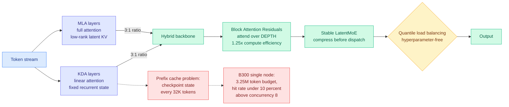
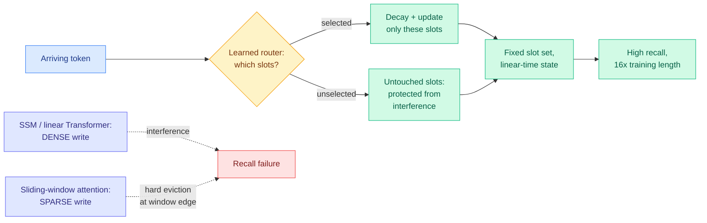
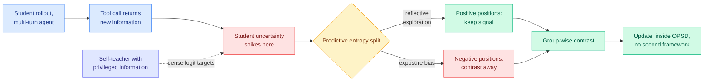
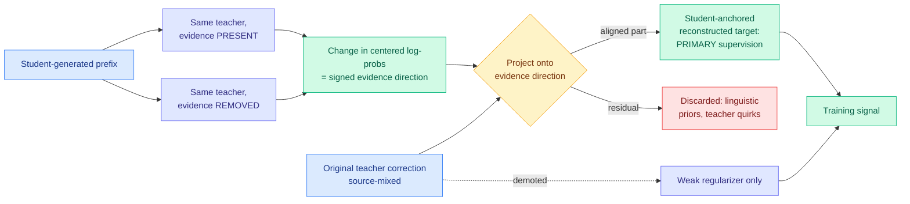
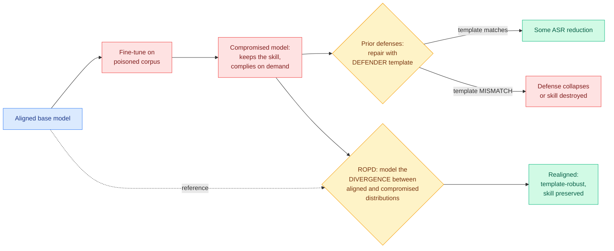
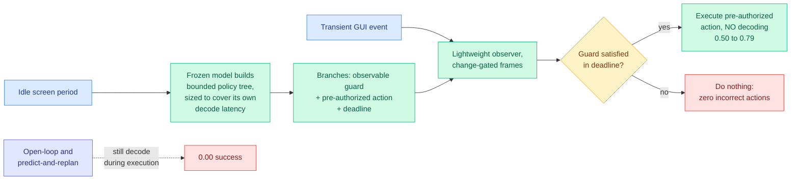
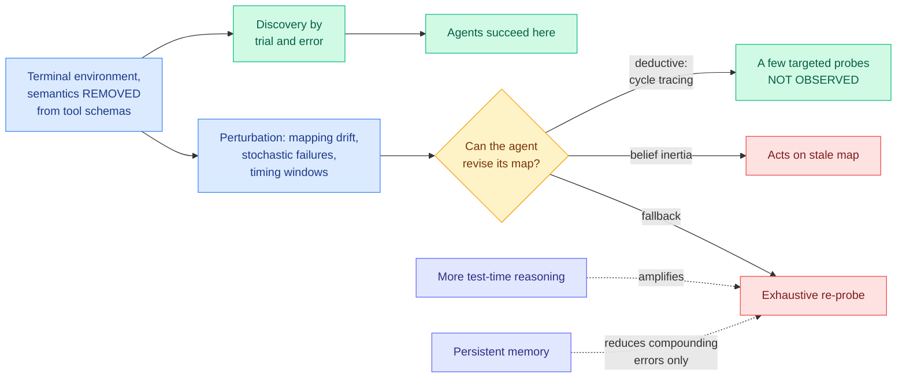
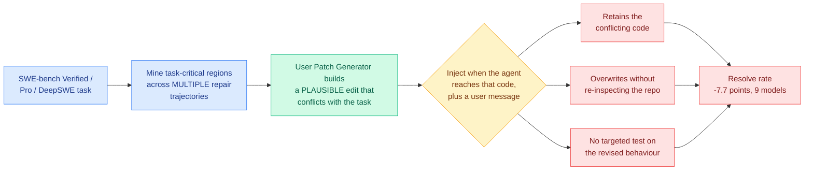
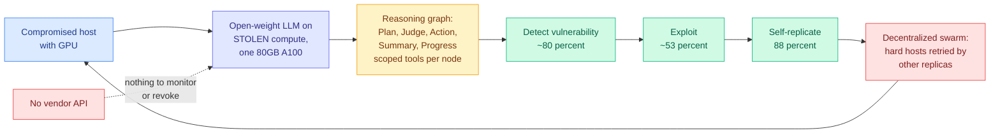

# cere-bro | 2026-08-04

> The headline efficiency property of every hybrid model shipped this year, that linear attention gives you a constant-size cache, turns out not to survive contact with prefix caching. Separately, a training trick that looked like a coincidence three days ago is now a convention, with four independent papers using it.

---

## TL;DR

- **Kimi K3 architecture primer**: linear attention does not give a constant KV cache in production. Prefix caching forces a state checkpoint every 32K tokens.
- **Raven**: a linear-time model that writes to only a few memory slots per token. Recall survives 16x its training context length.
- **Privileged teachers became a pattern**: four papers in three days train a model using a branch that sees more than the deployed one.
- **AAPT**: GUI agents miss deadlines because decoding sits on the critical path. Pre-build a policy tree and success goes from 0.50 to 0.79.
- **ScrambleToolBench and SWE-Touch**: agents discover fine, then never revise. Extra reasoning widens the brute-force search. Human edits cost 7.7 resolve points.
- **Claude Fable replicated 5 of OpenAI Astra's 10 math proofs in 24 hours**, with no internet access and generic prompting.

---

## Deep Dives

### Kimi K3, The Manos, The Mythos, The Legendos

> Every hybrid linear-attention model this year has been sold on a constant-size recurrent state instead of a growing KV cache. This primer shows that as soon as you turn on prefix caching, you have to checkpoint that state every 32K tokens, and the memory saving becomes a smaller constant rather than a better asymptote.

**Source:** SemiAnalysis (also starred in Gmail)
**Links:** [Post](https://newsletter.semianalysis.com/p/kimi-k3-the-manos-the-mythos-the) · [Wiki summary](../../llms-foundation-models/2026-08-04-semianalysis-kimi-k3-architecture-primer.md)

**What is it about?**
SemiAnalysis wrote the architecture explainer that Moonshot's Kimi K3 release blog did not. It derives Kimi Delta Attention (KDA, the linear-attention layer in K3's hybrid backbone) from first principles, analyzes Moonshot's open-sourced FlashKDA kernels down to FLOPs and bytes, and then measures K3 serving on real recorded coding-agent traces.

**What problem does it solve?**
Until now the wiki's picture of hybrid linear attention came from release blogs and from a practitioner benchmark on 07-30 that measured a 20x KV cache gap between hybrid-attention and dense models and concluded the biggest available efficiency win is architectural, chosen at model-selection time. That framing was right about direction and missing the catch. This piece supplies the catch.

**What is the core novelty?**
Two things. First, a proposed metric: **KV throughput**, meaning KV cache size divided by prefill time at a given sequence length. The argument is that cache size alone is meaningless because it is a property of the whole model design, not a standalone knob, and it depends on how much memory your parallelism strategy left over. KV throughput folds architecture efficiency into the number because prefill time does, and it reads directly as the bandwidth you need to serve the model under prefill/decode disaggregation. Second, and more important, the prefix-caching result. Inference engines find a cache hit by matching the longest token prefix already cached. For standard attention that works because every position has its own key and value rows. **KDA has one fixed-size recurrent state per position, so without knowing where a future prefix boundary will fall, you would have to save the state at every token, which puts memory growth back to linear and defeats the whole point.** Moonshot's answer is coarse checkpointing: vLLM saves KDA state every 32K tokens plus at prompt boundaries, because in agentic workloads a new turn usually starts at the end of a prompt.

**Key takeaways**
- **KDA's lineage is a chain of loss-function edits.** Linear attention drops the softmax and compresses all past keys and values into one state. DeltaNet changes the loss to minimize the L2 norm of value retrieval, which stops the state growing unboundedly. Gated DeltaNet adds an LSTM-style forget gate. KDA expands that gate from a scalar into a diagonal matrix, giving per-channel decay, which is also why KDA can replace RoPE (rotary position embeddings) in the neighbouring full-attention layers: it is itself position-aware.
- **FlashKDA is linear in sequence length for prefill and constant for decode**, on both compute and memory traffic. Derived, not asserted: `12C^3 + 8C^2 D + 6C D^2` FLOPs per chunk, decode dominated by reading and writing the FP32 state.
- **The measured serving distribution is 142k input tokens, 444 output tokens per turn, 65 turns per session**, replaying an hour of SemiAnalysis's own Claude Code traces. That is a small upward revision from the 140k-in/396-out numbers reported on 07-25.
- **On a B300 node, after weights, HBM holds 3.25M tokens of KV cache, and cache hit rate collapses below 10% above concurrency 8 when the theoretical rate is 95%.** K3 does not fit on a single B200 node at all, which forced pipeline parallelism and broke DSpark speculative decoding.
- **Block Attention Residuals get a real number: 1.25x compute efficiency** over standard residual connections, with bounded output magnitude as depth grows and 4% pipeline-parallel overhead after cross-stage caching. This is the third appearance of that mechanism in the wiki in two weeks, after SANA-Video 2.0 on 07-24 used it to lift deep-layer effective rank about 12%, and MHAR on 07-31.
- **The MoE configuration numbers get a design equation.** Communication-to-computation time ratio is `(P*F)/(6*m*B)*(1-1/E)`, where m is the expert intermediate dimension and the only model-configuration term in it. Raise m and more communication hides behind computation, which is the primer's explanation for why K2 to K3 raised it to 3072 and why DeepSeek V4 Pro, MiniMax M3, MiMo V2.5 Pro and Inkling all did the same.

**Gaps in the study**
KV throughput is proposed and then tabulated only for hybrid against dense, but the live design choice is KDA-plus-MLA against the GQA-sparse family (GLM 5.2's DeepSeek Sparse Attention, DeepSeek V4's Compressed Sparse Attention, MiniMax M3's sparse attention, MiMo V3's HySparse), and that comparison is absent. The B300 thrashing number is one node at one concurrency sweep, not a scaling study. And the primer infers K3's structure from Kimi Linear rather than from K3 documentation, which it says openly.

**Industrial implication**
Anyone sizing HBM from a linear-attention model's nominal state size will under-provision, because the 32K checkpoint granularity is the real unit. The more actionable version: the gap between a 95% theoretical prefix-cache hit rate and an under-10% realized one is capacity, not tuning, so KV-aware tiering across HBM, DRAM and NVMe stops being an optimization and becomes the thing that decides whether your deployment works. That has been listed as an open problem on the wiki's memory-hierarchy page since 06-07 and as an unshipped serving feature. It is now load-bearing. The primer also predicts K4 drops MLA, on the grounds that MLA's absorption trick cheapens decode at the cost of extra prefill compute, which is a good trade for reasoning and a bad one for prefill-dominant agentic work.

→ [Full summary](../../llms-foundation-models/2026-08-04-semianalysis-kimi-k3-architecture-primer.md)

---

### Raven: High-Recall Sequence Modeling with Sparse Memory Routing

> The reason linear-attention models lose specific facts is not that their state is too small. It is that they write to all of it on every token. Raven writes to a few slots and leaves the rest alone.

**Source:** Kurate weekly cs.LG leaderboard #16, ai_rating 7.0/10, the highest on either board this week. Not on HuggingFace, so this is LLM-rated underrated.
**Links:** [arXiv 2607.25357](https://arxiv.org/abs/2607.25357) · [Wiki summary](../../llms-foundation-models/2026-08-04-raven-sparse-memory-routing.md)

**What is it about?**
A linear-time sequence model from Arshia Afzal (EPFL), Aviv Bick, Eric Xing, Volkan Cevher and **Albert Gu** (the Mamba author, now also at Cartesia AI). Its framing contribution is an axis: how does an efficient architecture *write* to memory? State-space models and linear Transformers write densely, updating the entire state for every arriving token, so information persists in principle but interferes, and recovering one specific past token gets hard. Sliding-window attention writes sparsely, storing explicit token representations, so in-window recall is reliable and eviction at the window edge is a cliff. The middle of that axis was empty.

**What problem does it solve?**
The one failure mode that has killed every linear-attention substitute so far: long-context recall. The wiki's attention-mechanisms page has carried this as its first open problem since 05-29, when Parallax (which reframed softmax attention as a local-constant estimator and upgraded it to a local-linear one) reported gains only up to 1.7B and no needle-in-haystack numbers. Raven is the first paper here to attack the recall collapse as the primary target rather than listing it as a limitation.

**What is the core novelty?**
Keep a fixed set of memory slots and, at each step, **decay and update only a selected subset via learned input-dependent routing**. The selective-decay half is what is actually new. Gated Slot Attention and Attention with Bounded Memory Control already had input-dependent routing, but both still wrote densely to all slots, so neither could isolate and protect a specific memory. Raven's decay touches only the slots it wrote, so an untouched slot is genuinely untouched.

**Key takeaways**
- Competitive with or better than prior linear-time baselines on **recall-intensive** benchmarks specifically, which is where both sliding-window attention and state-space models sharply degrade.
- Stays effective **extrapolating to 16x its training context length**, unusual for any fixed-state model and exactly the property that historically breaks.
- **The gains carry into hybrid architectures**, so Raven is a candidate replacement for the linear half of a KDA-plus-full-attention backbone rather than a rival to Transformers.
- The diagnosis is the reusable part: the recall collapse looks like a **write-policy artifact**, not a fixed-state capacity limit.

**Gaps in the study**
No scales named in the abstract, and the family's track record says scale is the load-bearing unknown (Parallax stopped at 1.7B, MDN at 1.3B). No RULER or needle-in-haystack figures stated. And a per-step slot-selection decision needs to be cheap: no kernel or wall-clock throughput number appears, and a router costing more than the dense update it replaced would nullify the whole thing.

**Industrial implication**
If this holds at scale it is the exit from the problem the Kimi K3 primer just documented above. A slot-structured state is **addressable**, and most slots are untouched at any step, which at least makes incremental or differential checkpointing conceivable in a way a monolithic dense recurrent state does not. That would let a hybrid model keep the linear layers' memory saving while still supporting prefix caching, which is the single largest cost lever in agentic serving. Nobody has connected these two papers, and it is the most valuable experiment on today's list.

→ [Full summary](../../llms-foundation-models/2026-08-04-raven-sparse-memory-routing.md)

---

### CRPO: Contrastive Reinforced Policy Optimization via Privileged Self-Distillation

> When a model teaches itself using information its student half cannot see, the teacher becomes most confident exactly where the student is most genuinely uncertain. In agent tasks that moment is always the same: right after a tool call returns.

**Source:** Kurate weekly cs.LG leaderboard #2, ai_rating 6.0/10, from Meituan. Not on HuggingFace.
**Links:** [arXiv 2607.28026](https://arxiv.org/abs/2607.28026) · [Wiki summary](../../inference-efficiency/2026-08-04-crpo-contrastive-privileged-self-distillation.md)

**What is it about?**
On-policy self-distillation (OPSD) trains a model against itself, where the teacher branch is the same policy handed privileged information the student does not get. It gives dense per-token supervision cheaply, which is why it has been displacing reinforcement learning with verifiable rewards (RLVR, where a single scalar reward has to supervise an entire generation). CRPO is a diagnosis of where that dense signal goes wrong in multi-turn agentic settings, plus a cheap fix that stays inside OPSD.

**What problem does it solve?**
The privileged self-teacher's overconfidence. Because it sees more, it is confident where the student is legitimately uncertain, and two harms follow: the teacher's reasoning routes converge onto the specific patterns in the demonstrations so the student generalizes worse, and multi-turn optimization directions get muddy because position-level supervision is unreliable. Prior fixes (RLSD, SDAR, RLCSD) bolt an RLVR objective onto the distillation objective and pay for maintaining two frameworks.

**What is the core novelty?**
Use **predictive entropy to sort positions into two kinds**, then contrast them against each other group-wise. Positive positions are where high entropy reflects genuine reflective exploration. Negative positions are where it reflects exposure bias from the privileged view. Same statistic, opposite treatment, and the contrast is what keeps only the reliable fine-grained signal.

**Key takeaways**
- Exposure bias in OPSD is **position-localized and the location is predictable**: it concentrates right after new tool output arrives. That is actionable without training a detector.
- 13 reasoning and deep-search benchmarks, beating both RL and self-distillation baselines, with the claims being **training stability and long-horizon generalization** rather than one number.
- No second optimization framework, so no framework-maintenance overhead relative to hybrid RLVR-plus-distillation approaches.

**Gaps in the study**
The entropy threshold is the one hyperparameter the whole method turns on and no ablation of it is reported, while entropy calibration is model- and scale-dependent. "Consistently outperforms" across 13 benchmarks with no per-benchmark margins makes it impossible to tell whether the win is broad or carried by the deep-search subset where tool output dominates uncertainty. And the no-extra-cost claim is made against two-framework hybrids, when the relevant baseline is plain OPSD.

**Industrial implication**
Anyone running self-distillation on agent traces today is training hardest on the positions where their teacher is least trustworthy, and the fix is a reweighting over data they already have. That is a cheap patch rather than a new pipeline. The broader implication, visible only across today's four privileged-teacher papers, is in Global View below.

→ [Full summary](../../inference-efficiency/2026-08-04-crpo-contrastive-privileged-self-distillation.md)

---

### VAD: Attributing Visual Evidence for Target Reconstruction in Multimodal On-Policy Distillation

> Prior work asked where and how strongly to distill. This paper asks a harder question: of this one correction the teacher just made, how much of it is actually because of the image?

**Source:** HuggingFace Daily Papers
**Links:** [arXiv 2607.28590](https://arxiv.org/abs/2607.28590) · [Wiki summary](../../inference-efficiency/2026-08-04-vad-visual-attribution-distillation.md)

**What is it about?**
Multimodal on-policy distillation supervises a student's own generated trajectories with a teacher that gets a privileged view, usually a crop centred on the visual evidence the student needs. VAD (from Shanghai Jiao Tong University and Xiaohongshu, with CUHK, Zhejiang and Southeast) argues the resulting corrections are **source-mixed**: each one blends the visual signal you wanted with the teacher's linguistic priors and its own model-specific quirks, and you cannot tell them apart.

**What problem does it solve?**
Existing methods treat this as a weighting problem. Vision-OPD conditions a teacher on an evidence crop and distills its whole next-token distribution. VA-OPD and V-Zero contrast informative against degraded views to prioritize tokens or trajectories, but keep the full evidence-present distribution as the target, so mixed directions still leak in. VAD's diagnostics report that a substantial share of the teacher's strongest corrections are not well aligned with its own evidence-conditioned response.

**What is the core novelty?**
Run the **same fixed teacher twice**, once with the evidence present and once with it removed. The change in centered log-probabilities defines a signed direction in vocabulary space pointing along "what revealing this evidence does." Project the original correction onto that direction, split it into an intervention-aligned component and a proxy-unexplained residual, and **rebuild a student-anchored target from the aligned component alone**. That reconstructed target becomes the primary supervision and the privileged teacher is demoted to a weak regularizer.

**Key takeaways**
- Beats direct privileged-view distillation and visual-advantage weighting on **six fine-grained visual benchmarks at 4B and 9B**.
- The signed proxy handles the case weighting cannot: **evidence that refutes a student's mistaken token**, not just evidence that supports the right one. The paper reports its strongest target shifts exactly there.
- The teacher is never modified or retrained. The price is one extra forward pass per supervised prefix.
- Two mechanism analyses back the score: token-level analysis shows the aligned component is enriched in task-relevant visual corrections, and a controlled-target analysis shows it produces stronger target shifts.

**Gaps in the study**
Everything rests on a one-dimensional projection standing in for "the visual evidence direction," and a correction whose useful visual content is orthogonal to it gets discarded. The paper's own naming concedes the ambiguity: unexplained is not the same as unhelpful. How evidence is removed (masking, blurring, cropping) defines the counterfactual, and robustness to that operator is untested. Scale stops at 9B, and the extra teacher pass doubles teacher inference cost per supervised position without being priced against simply distilling more data.

**Industrial implication**
The mechanism has nothing modality-specific in it. The interesting test is whether the same projection works when "evidence" is a retrieved document rather than an image crop, which would move it from a multimodal technique to a general recipe for cleaning any privileged-teacher signal. If it does, it is a drop-in improvement for retrieval-augmented distillation, which is a much bigger surface than fine-grained vision.

→ [Full summary](../../inference-efficiency/2026-08-04-vad-visual-attribution-distillation.md)

---

### ROPD: On-Policy Distillation for LLM Safety, a Routing Approach to Template-Robust Realignment

> Every published safety-realignment defense repairs the model using a prompt template the defender chose. The attacker used a different one. That single mismatch is enough to make the reported numbers not transfer.

**Source:** Kurate weekly cs.AI leaderboard #18, ai_rating 6.0/10. Not on HuggingFace.
**Links:** [arXiv 2607.27081](https://arxiv.org/abs/2607.27081) · [Wiki summary](../../responsible-ai/2026-08-04-ropd-routing-safety-realignment.md)

**What is it about?**
A supply-chain attack and a defense. A malicious data provider embeds harmful behaviour into a fine-tuning corpus, producing a model that still performs the specialized job it was fine-tuned for while complying with dangerous requests on demand. The competence masks the compromise.

**What problem does it solve?**
Three named failures in existing safety-realignment defenses, which include selectively restoring fine-tuned weights, adding safety vectors, token-weighted fine-tuning, and representation-space corrections. They cause catastrophic forgetting of the specialized skill the user paid for. Their effectiveness **collapses when the defender cannot observe the attacker's prompt template**, which is the realistic case. And realigned models remain re-jailbreakable by a simple system-prompt switch.

**What is the core novelty?**
Stop fitting templates. ROPD models the **divergence between the aligned model's output probability distribution and the compromised model's**, and distills against that on-policy, on the compromised model's own generations. Whatever surface form the attacker used, that distributional difference does not depend on it.

**Key takeaways**
- Tested against four state-of-the-art baselines across three datasets and three base models at varying alignment strengths.
- When baselines face template mismatch, they either fail to reduce attack success rate in the attacker's channel or sacrifice substantial downstream task performance. ROPD substantially mitigates both risks.
- The paper is explicit that **ROPD is not immune to template shift**, only that its degradation is negligible next to the alternatives. Stating the residual is unusual and worth crediting.
- On-policy distillation is being used here as a **behaviour-removal** tool, with the model's own aligned past self as the reference. That is a genuinely different use of the primitive from everything else on the wiki's distillation page.

**Gaps in the study**
No absolute attack-success-rate numbers in the abstract, so the residual risk is unquantified. Three models and three datasets says nothing about frontier scale. The threat model presumes the defender already knows the model is compromised, and undetected compromise is the harder half of the problem: nothing here helps with detection. And the system-prompt re-jailbreak mode is named as a weakness of prior work without a stated claim that ROPD closes it.

**Industrial implication**
Anyone fine-tuning on third-party data should treat published realignment numbers as measured under an assumption their threat model does not grant. But the ordering matters, and today's industry data argues for a different first move: IBM found that **92% of companies hit by an AI security incident had inadequate access controls**, and that the model itself was rarely the problem. A model-layer defense against a supply-chain attack is worth having, and the breaches that actually happened were upstream of the model.

→ [Full summary](../../responsible-ai/2026-08-04-ropd-routing-safety-realignment.md)

---

### AAPT: Why Are GUI Agents Correct but Late?

> The agent knows the right click. It finishes deciding after the dialog has closed. Two baselines score exactly zero on this, not because they are wrong, but because they are still generating text when the window shuts.

**Source:** Kurate weekly cs.LG leaderboard #5, ai_rating 6.0/10. Not on HuggingFace.
**Links:** [arXiv 2607.28399](https://arxiv.org/abs/2607.28399) · [Wiki summary](../../agentic-systems/2026-08-04-aapt-anticipatory-policy-trees.md)

**What is it about?**
Computer-use agents failing on transient GUI events: boot prompts, auto-dismissing dialogs, short-lived authentication requests, reaction-time game states. The paper's claim is that this is a **timing failure, not a comprehension failure**, and it names the cause as autoregressive decoding sitting on the decision-time critical path.

**What problem does it solve?**
Prior work either improved perception (continuous screen sampling with change gating) or improved anticipation (GUI world models like WebDreamer and MobileDreamer, receding-horizon replanning like TraceR1). Neither helps, because predicting the future state does not save you if you still have to decode an action after observing it. Speculative planning approaches hide latency by overlapping fast approximate execution with slow verification, which requires the speculated work to be undoable, and most GUI actions are not.

**What is the core novelty?**
During idle screen periods, the same frozen multimodal model builds a bounded **conditional policy tree**: each branch carries an observable guard, a pre-authorized action, and its own deadline, and the tree is deliberately **sized to cover the model's own decoding latency**. When an event fires, a lightweight observer matches change-gated frames to a prepared branch and executes immediately, generating no new text. This is admission control, not speculation: several actions are prepared, one is committed only after a live observation satisfies its guard inside a deadline.

**Key takeaways**
- Success inside a contested decision window rises **from 0.50 to 0.79 (p = 1.8e-3), with zero incorrect actions**, under paired trials with pre-registered endpoints and exact McNemar tests.
- **Open-loop and predict-and-replan baselines both score 0.00**, because they still decode during execution.
- A preparation-time sweep shows the gain appears **where the latency-based tree-sizing rule predicts**, which is stronger evidence than the headline number.
- A **pre-registered oracle probe rejected the authors' own hypothesis** and identified branch routing, meaning correctly matching a live frame to the right prepared branch, as the causal bottleneck. Publishing a rejected pre-registered hypothesis is rare.
- Reproduced on an independent general-purpose multimodal model over 126 paired trials (p = 4.9e-13).

**Gaps in the study**
The headline lives inside a window constructed to expose the effect, so it measures the mechanism rather than end-to-end agent utility, and on an external benchmark AAPT merely ties a reactive baseline. Tree construction consumes idle time and model calls with no token or dollar accounting, which matters because the whole idea is to spend more compute earlier. And the branch-routing bottleneck is located, not fixed.

**Industrial implication**
This is the first result in the wiki where **decode latency is a correctness axis with a step function** rather than a cost axis: below the deadline you succeed, above it you score zero no matter how right the answer was. That cuts against the dominant serving framing, which after today's Kimi K3 numbers is that agentic work is prefill-and-retention bound at roughly 142k input against 444 output tokens per turn. Both are true of different workloads, and no serving stack distinguishes them: vLLM and SGLang have no way to express a per-request deadline. A scheduler batching for throughput is exactly wrong for a deadline-bound GUI agent, and somebody is going to have to build admission control that knows the difference.

→ [Full summary](../../agentic-systems/2026-08-04-aapt-anticipatory-policy-trees.md)

---

### ScrambleToolBench: Agents Search Exhaustively Even When Their Own Map Points to the Next Step

> Take the meaning out of tool names and agents still figure out what the tools do. Then change one mapping behind their back and they either keep acting on the stale map or start over from scratch. Giving them more reasoning budget makes the second one worse.

**Source:** HuggingFace Daily Papers
**Links:** [arXiv 2608.02358](https://arxiv.org/abs/2608.02358) · [Wiki summary](../../agentic-systems/2026-08-04-scrambletoolbench-behavioral-tool-discovery.md)

**What is it about?**
An interactive terminal benchmark that strips semantic meaning out of tool names and descriptions, so an agent has to learn what each tool does purely by trying it. A continuous task curriculum keeps the agent using what it learned, and then the environment starts changing: **mapping drift** (the tool-to-effect mapping silently shifts), stochastic action failures, and temporal execution windows.

**What problem does it solve?**
Every existing tool-use benchmark hands the agent semantic schemas in a static world, which lets it lean on prior knowledge about what a function called `send_email` probably does. That makes apparent tool-discovery ability indistinguishable from memorized priors.

**What is the core novelty?**
Separating two capabilities that static benchmarks bundle: initial discovery and subsequent adaptation. Agents have the first and lack the second. They do not use the deductive strategy the situation calls for, which the paper names **cycle tracing**: your existing partial map already constrains where the change must be, so a handful of targeted probes localize it. Instead they show **belief inertia** or fall back to exhaustive re-probing.

**Key takeaways**
- **Successful initial discovery does not translate into robust adaptation.** That is the paper's central empirical separation and static benchmarks cannot detect it.
- **Increasing test-time reasoning amplifies the brute-force search rather than enabling deductive recovery.** A negative scaling result on the axis the field leans on hardest.
- **Persistent memory reduces compounding errors but does not restore efficient structural inference.** Memory is a mitigation, not a fix.

**Gaps in the study**
No models named and no numbers in the abstract, so the size of the gap is unquantified. And whether full semantic removal is a fair test is arguable: real systems leak signal through error messages, response shapes and argument arity, and stripping all of it may create a harder problem than deployment while also removing cues a competent human explorer would use. The benchmark is single-agent, so nothing tests whether two agents splitting the hypothesis space recover the deductive shortcut cheaply.

**Industrial implication**
The missing capability is neither storage nor retrieval, it is **revision**: noticing that a stored belief has been invalidated and localizing the invalidation. No paper on the wiki's agent-memory page treats belief revision as a distinct operation from remembering, and every long-running agent deployment is in a world that drifts under it (an API version bumps, a UI moves, a permission changes). The uncomfortable corollary for cost: the standard response to an agent that is failing is to raise its reasoning budget, and here that makes the bill larger and the outcome no better.

→ [Full summary](../../agentic-systems/2026-08-04-scrambletoolbench-behavioral-tool-discovery.md)

---

### SWE-Touch: the same failure, with a human supplying the drift

> ScrambleToolBench changed the environment under the agent. This one lets a person edit the code mid-task, which is what actually happens, and costs 7.7 resolve points.

**Source:** HuggingFace Daily Papers
**Links:** [arXiv 2608.02499](https://arxiv.org/abs/2608.02499) · [Wiki summary](../../agentic-systems/2026-08-04-swe-touch-shared-workspace-coding-agents.md)

**What is it about?**
Every repository-level coding benchmark evaluates an agent working alone, or restricts the human to sending messages. Real development is a shared workspace: while the agent works, a person opens files and changes them. SWE-Touch stress-tests exactly that.

**What problem does it solve?**
It measures a capability that nearly every deployment requires and nearly no leaderboard scores, which is whether an agent notices that the code under it has moved. The framing matters because "collaborative" agent evaluation has so far meant conversational turns, not concurrent mutation of shared state.

**What is the core novelty?**
The **validated Counter-Edit**. An adversarial edit is trivial to produce and worthless if implausible, because then the benchmark is measuring robustness to nonsense. So the pipeline mines task-critical regions from *multiple independent* repair trajectories, on the reasoning that the intersection across separate solution paths is a decent proxy for load-bearing code, then uses a separate User Patch Generator model to construct an edit that conflicts semantically rather than syntactically, and injects it with a contextual user message at the moment the agent arrives at that code.

**Key takeaways**
- **Average resolve rate on SWE-bench Verified falls 7.7 percentage points** across nine coding models, with degradation persisting on the longer-horizon SWE-Bench Pro and DeepSWE.
- The failure taxonomy is three named behaviours rather than one score drop: retain the conflicting code, overwrite it without re-inspecting the repository, or skip validating the revised behaviour with a targeted test. The paper states the corresponding capabilities as the optimization targets, which are detecting workspace changes, reconciling conflicting edits against the task, and verifying the affected behaviour.
- Paired with [ScrambleToolBench](../../agentic-systems/2026-08-04-scrambletoolbench-behavioral-tool-discovery.md) above, this is **two independent benchmarks in two domains on one board reaching the same conclusion**: the agent builds a world model and then does not update it. One has the environment drift, the other has a human cause the drift, and neither agent revises.
- It matches the profile [Shadow evaluations (07-30)](../../agentic-systems/2026-07-30-shadow-evaluations-ai-research-agents.md) found in a third setting, where agents handed the central open question from unpublished NeurIPS 2026 submissions completed **all of the engineering** unassisted and were unambiguously rejected on five judgment failures, one of which was **ineffective backtracking**. Engineering competence with revision incompetence, now measured three ways in six days.

**Gaps in the study**
The 7.7 points is an average across nine models with no spread reported, so whether frontier models degrade less is the first question anyone has and it is unanswered. The Counter-Edit lands at a single moment, when the agent reaches the relevant code, which is a friendly simplification of a real workspace where edits arrive at arbitrary times including while the agent holds a stale read. And every edit conflicts by construction, so the benchmark structurally cannot measure the commoner real case, a **helpful** concurrent edit the agent should adopt rather than fight: an agent that re-reads constantly and distrusts everything scores well here and would be intolerable in practice.

**Industrial implication**
Anyone running a coding agent against a live repository that humans also touch is operating in the regime this paper measures, and the 7.7-point figure is the first price tag on it. The concrete consequence is that **horizon length and state-revision capability have been bundled under "long-horizon" and are separable**, so a model chosen on SWE-bench Verified alone has been selected on the wrong axis for shared-workspace work. It also explains a production complaint from the same day rather than a different one: [Cursor shipped Workspace plugins](https://cursor.com/changelog/google-workspace-plugins) giving agents direct read-write access to Gmail, Drive, Calendar, Docs and Sheets, which is five more mutable external states for an agent to track, in a week when two papers established that tracking mutable state is the thing they do worst.

→ [Full summary](../../agentic-systems/2026-08-04-swe-touch-shared-workspace-coding-agents.md)

---

### AI Agents Enable Adaptive Computer Worms

> The worm runs its own language model on the GPUs of the machines it has already infected. There is no API key to revoke and no vendor to notify.

**Source:** Import AI 467 (Jack Clark), covering work from University of Toronto, Vector Institute, Cambridge and ServiceNow
**Links:** [arXiv 2606.03811](https://arxiv.org/abs/2606.03811) · [Import AI 467](https://importai.substack.com/p/import-ai-467-self-sustaining-ai) · [Wiki summary](../../responsible-ai/2026-08-04-self-sustaining-ai-computer-worms.md)

**What is it about?**
A working prototype of a computer worm that uses a language model to reason about how to compromise machines, and then runs that model on the GPUs of machines it already owns. The authors state the design goal plainly: no reliance on vendor APIs that could be monitored or revoked.

**What problem does it solve?**
From the attacker's side, the control point. Every prior AI-assisted attack story routes reasoning through a hosted API, which is exactly where a defender or a provider can intervene. From the research side, it converts an argument about future risk into a measured capability.

**What is the core novelty?**
Two things. The parasitic inference loop, and a **reasoning graph** in place of a single agent loop: a directed graph of specialized nodes each seeing only the tools and prompts relevant to its role (Plan formulates strategy, Judge reviews the plan against command history, Action selects a phase-appropriate tool, Summary compiles observations, Progress evaluates whether anything is advancing). That scoping is what lets a modest open-weight model published in 2025, fitting on a single 80GB A100, do the job. Most nodes are redacted in the public manuscript.

**Key takeaways**
- Measured rates: **~80% vulnerability detection, ~53% exploitation, 88% self-replication, roughly 37% end-to-end.**
- **Swarm resilience substitutes for per-attempt reliability.** Hosts that resist get retried by different replicas sampling fresh reasoning trajectories, and replication is decentralized so there is no single point of control to take offline.
- The authors note 37% is **also a useful evaluation**: a standing benchmark for autonomous offensive capability in open-weight models.
- Clark's read: the future internet looks like an ecology of attacker and defender agents, and humans may need to release their own agents as white blood cells.

**Gaps in the study**
The model is never named beyond "2025, fits on one A100," which makes the capability-versus-model-generation relationship untestable from outside and it is the single most decision-relevant variable. Most reasoning-graph nodes are redacted, so the mechanism claim cannot be independently reproduced. The 80% and 53% figures are properties of a research testbed whose vulnerability distribution is not compared to a real network. And nothing is measured about detectability, even though a worm running LLM inference on a compromised host produces an extremely distinctive GPU utilization and memory signature.

**Industrial implication**
It reframes open-weight risk. The weights here were already public and unremarkable; what made the system dangerous was the harness plus access to **someone else's GPUs**. So the binding question is not a capability threshold in a model card, it is whether an attacker can obtain inference cheaply. Which makes the other item in the same Import AI issue directly relevant: Dwarkesh Patel argues compute gets **more** expensive as models improve, because a genuinely human-level software engineer running on an H100 would justify renting that H100 for over $250k a year, roughly 15x today's spot price. If he is right, stolen compute becomes proportionally more valuable, and GPU theft moves from nuisance to primary economic attack. Neither source connects them.

→ [Full summary](../../responsible-ai/2026-08-04-self-sustaining-ai-computer-worms.md)

---

## Industry Pulse

- **Alibaba Qwen3.8-Max** shipped at 2.4T parameters, marketed for 10-plus days of autonomous coding, with open weights promised next week ([The Decoder](https://the-decoder.com/alibabas-open-weight-qwen3-8-max-takes-on-long-horizon-ai-tasks-with-2-4-trillion-parameters/)).
- **Qwen3.8-Max is priced below Kimi K3** on API, and Qwen3.8-27B also goes open-weight ([The Information](https://www.theinformation.com/briefings/alibaba-offers-new-flagship-model-lower-prices-kimi-k3)).
- **Claude Fable replicated 5 of OpenAI Astra's 10 headline math proofs in 24 hours**, no internet access, no custom prompting, per Anthropic's Levent Alpöge ([AI Breakfast](https://x.com/__alpoge__/status/2083855298239078748)).
- **Gary Marcus argues the fast replication undercuts the Astra breakthrough claim**, noting OpenAI reported a numerator without a denominator: no list of problems attempted and failed ([Marcus on AI](https://garymarcus.substack.com/p/two-critical-updates-re-astra-and)).
- **Terence Tao's 26 July lecture names "proof indigestion"**, the risk of AI generating many true but useless proofs, and distinguishes solving open problems from building theory ([via Marcus](https://garymarcus.substack.com/p/two-critical-updates-re-astra-and)).
- **Two teams solved the same open quantum-cryptography problem with GPT-5.6 Sol Ultra three hours apart**, which raises what independent discovery means when everyone uses one model ([The Decoder](https://the-decoder.com/two-teams-solved-the-same-quantum-crypto-problem-using-gpt-5-6-just-three-hours-apart/)).
- **Celeris-1 claims the fastest model spot on Artificial Analysis** at 2,038 output tokens per second, 2.4x the next fastest (Mercury 2 at 851), beating Grok 4.3 on HLE, explicitly without custom silicon ([@Celeris_ai](https://x.com/Celeris_ai/status/2084429307422872026)).
- **On that same Artificial Analysis chart Kimi K3 is last at 35 output tokens per second**, which is 58x slower than Celeris-1 and a useful counterweight to today's K3 architecture coverage.
- **AWS CEO Matt Garman says capacity is already spoken for through 2027 and into 2028**, with demand still significantly outstripping supply ([@mattsgarman](https://x.com/mattsgarman/status/2084446905426464810)).
- **Google DeepMind chief strategy officer Jasjeet Sekhon says the industry's capex is a bet on recursive self-improvement**, calling RSI a key part of the investment thesis ([The Information](https://www.theinformation.com/articles/google-deepmind-exec-says-unprecedented-capex-actually-bet-rsi)).
- **The White House hosts OpenAI, Google and Anthropic staff Tuesday** to review a finished AI oversight framework creating a voluntary pre-release model-submission procedure ([The Information](https://www.theinformation.com/articles/white-house-host-ai-companies-tuesday-review-ai-framework)).
- **IBM found 92% of companies hit by an AI security incident had inadequate access controls**, and that the model itself was rarely the problem ([The Decoder](https://the-decoder.com/ibm-finds-92-of-companies-hit-by-ai-security-breaches-lacked-basic-access-controls/)).
- **Interpol says AI is now the core operational driver of cybercrime in Africa**, involved in 55% of reported cases, with losses up from $192M to $484M and about 600,000 deepfake extortion cases ([The Decoder](https://the-decoder.com/interpol-says-ai-has-become-the-core-operational-driver-of-cybercrime-across-africa/)).
- **Roughly 1,337 employees across OpenAI, Anthropic, Google DeepMind, Thinking Machines, Meta and Safe Superintelligence asked the US government** to help build tools to deliberately pace frontier AI development ([Import AI 467](https://importai.substack.com/p/import-ai-467-self-sustaining-ai)).
- **DeepSeek V4 Flash targets the coding market with a 99% price cut** ([Axios](https://www.axios.com/2026/08/01/deepseek-model-cheap-ai-price-war)).
- **Interconnects launched an Artifacts Hub and a daily Adoption Dashboard**, covering 792 curated models with OpenRouter inference tokens, Artificial Analysis intelligence scores and download-and-derivative counts by geography ([Interconnects](https://www.interconnects.ai/p/introducing-our-artifacts-hub-and)).
- **Kilo published a study of 10,643 AI code reviews across 13 models**: open-weight reviewers matched closed leaders on critical findings, the security gap mostly vanished once one outlier was removed, and 32.3% of attributed reviews used a different model than the one that wrote the code ([Kilo](https://kilo.ai/articles/open-weight-models-code-review), [wiki summary](../../ai-routing/2026-08-04-kilo-open-weight-code-review-routing.md)).
- **Cursor's cloud agents got 20-30% more token efficient, and 80% more efficient on computer-use runs**, plus new Google Workspace plugins giving agents direct Gmail, Drive, Calendar, Docs and Sheets access ([Cursor changelog](https://cursor.com/changelog/google-workspace-plugins)).
- **NVIDIA shipped an open-source agentic-commerce blueprint** combining ACP and UCP in one codebase with NeMo Agent Toolkit, Nemotron and Milvus, ChatGPT and Gemini ready ([NVIDIA](https://www.nvidia.com/en-us/use-cases/agentic-commerce/)).
- **Google DeepMind's SkillSmith synthesizes custom prefix weights** by reading textual knowledge and prefix parameters together, beating text-only prompting and weight merging ([arXiv 2607.27497](https://arxiv.org/abs/2607.27497)).
- **Google pulled Nano Banana 2 from Google Earth after two days** because users generated and exported fake satellite scenes of refugee movements and damaged hospitals ([The Decoder](https://the-decoder.com/google-handed-users-the-easiest-possible-tool-for-fake-satellite-imagery-then-pulled-it-after-two-days/)).
- **Google cancelled its standalone Android and iOS AI Studio apps** despite nearly 800,000 pre-orders, folding vibe-coding tools into Gemini instead ([@GoogleAIStudio](https://x.com/GoogleAIStudio/status/2083274575769473092)).
- **MiniMax H3 became the first open model to top an AI video ranking**, with weights released ([The Decoder](https://the-decoder.com/chinas-minimax-h3-is-the-first-open-model-to-top-an-ai-video-ranking/)).
- **Karpathy gave Claude Opus 5 a 1M-token budget (about $10) and the first paragraph of The Lord of the Rings**, and got 5,500 lines of procedurally generated 3D JavaScript world over two hours ([The Decoder](https://the-decoder.com/unicorn-pelican-middle-earth-openai-co-founder-karpathy-is-looking-for-the-next-ai-vibe-test/)).
- **Karpathy's stated bottleneck was visual perception**, since Opus 5 had to take and inspect static screenshots to debug, lacking native real-time video processing ([AI Breakfast](https://x.com/karpathy/status/2083749667410727319)).
- **Simon Willison argues LLMs revive the original open-source promise**, since "clone x/y and tell me how Z works" makes reading and modifying your own tools a near-zero-cost habit ([Simon Willison](https://simonwillison.net/2026/Aug/3/devtools-must-be-open-source-exedev/)).
- **Steve Yegge reports his Gas Town agent framework burned down on Opus 4.7**, which introduced a "just two more things" tic that stopped it converging on real work ([Simon Willison](https://simonwillison.net/2026/Aug/4/steve-yegge/)).
- **Apple's iCloud sharing policy, not employee theft, explains much of the document access** at the heart of its trade-secrets suit against former employees now at OpenAI ([The Information](https://www.theinformation.com/articles/apple-icloud-policy-fueled-employee-leaks-ahead-openai-suit)).
- **UEmbed** shipped at 2B, 4B and 9B, emitting sparse lexical and dense embeddings from **one causal forward pass** of a decoder-only multimodal model by partitioning the vocabulary across N appended special tokens, reaching 71.8 dense and 71.0 sparse on MMEB-v2 ([arXiv 2608.02583](https://arxiv.org/abs/2608.02583), [wiki summary](../../llms-foundation-models/2026-08-04-uembed-unified-sparse-dense-embeddings.md)). Near-parity between the two makes the index-type choice free per query, which is the retrieval-tier version of the cost-diverse pool routing depends on.

**Funding, valuations, and compute deals**

- **Palantir revenue grew 93% year over year to $1.9 billion for the June quarter**, with US commercial revenue up 149% to $764M and the stock up 11% after hours ([The Information](https://www.theinformation.com/articles/palantirs-rocket-ship-growth)).
- **Palantir generated $2.1 billion in operating cash in the first half of 2026 on $22 million of capex**, all from software running on top of other companies' models ([The Information](https://www.theinformation.com/articles/palantirs-rocket-ship-growth)).
- **HUMAIN made its first investment in a Saudi company**, taking a stake in enterprise AI vendor MOZN to co-build sovereign AI for financial institutions and the public sector ([HUMAIN](https://www.humain.com/en/news/humain-makes-investment-in-mozn-and-partners-to-co-build-enterprise-ai-solutions-locally-and-globally)).
- **Fireworks hit a $17.5 billion valuation on about $1 billion annualized revenue** ([CNBC, via LWiAI 253](https://www.cnbc.com/2026/07/16/fireworks-nvidia-cloud-ai-startup-value.html)).
- **Meta is in talks to lease computing power to Anthropic in a potential $10 billion deal** ([NYT, via LWiAI 253](https://www.nytimes.com/2026/07/17/technology/meta-anthropic-ai-computing-power.html)).
- **Ilya Sutskever's Safe Superintelligence partnered with NVIDIA to scale on Vera Rubin** ([TechCrunch, via LWiAI 253](https://techcrunch.com/2026/07/27/ilya-sutskevers-safe-superintelligence-partners-with-nvidia-to-scale-its-ai-research/)).
- **Kilo Code was acquired by Anaconda**, and is now giving away Tencent's Hy3 free inside Kilo for a week ([@kilocode](https://x.com/kilocode/status/2084417712936071311)).
- **Anduril is in advanced talks to build drone boats at Baltimore's Sparrows Point yard**, with investment potentially running into the hundreds of millions on the 3,300-acre former Bethlehem Steel site ([@MarioNawfal](https://x.com/MarioNawfal/status/2084479855421272433)).
- **Microsoft closed up for calendar 2026 for the first time all year**, after a 25% rally since its June-quarter earnings ([The Information](https://www.theinformation.com/briefings/microsoft-closes-2026-finally)).
- **Snap posted $1.599 billion in June-quarter revenue, up 19%**, with US user count flat and the stock up 9% after hours to $5.50 ([The Information](https://www.theinformation.com/briefings/snap-revenue-shows-improvement-q2-user-count-stays-flat-u-s)).

---

## Global View

**The efficiency stack's biggest assumed win just got a footnote, and the footnote is the whole result.** For three months the wiki's KV story has trended one way: the largest available saving is architectural, not algorithmic. The 07-30 practitioner benchmark measured a **20x KV cache gap** between hybrid-attention and dense models, roughly ten times what any software cache-management method reports, and concluded you should pick the hybrid model first and then optimize. The [SemiAnalysis primer](../../llms-foundation-models/2026-08-04-semianalysis-kimi-k3-architecture-primer.md) confirms the direction and removes the asymptote: **KDA's fixed-size state has to be checkpointed every 32K tokens for prefix caching to work at all**, so the win is a smaller constant, not a different growth curve. And the realized number is worse than that, because on a single B300 node holding 3.25M tokens of budget, hit rate falls below 10% past concurrency 8 against a 95% theoretical rate, which finally puts a floor under the 07-25 AgentX figure of a 99.2% median hit rate that was explicitly measured under an infinite cache. Industry is behaving as if capacity is the binding constraint, which is the correct reading of this physics: **AWS says capacity is sold out into 2028**, DeepSeek V4 Flash is cutting coding prices 99% while Alibaba undercuts Kimi K3, and all of that is a market where the scarce good is memory-hours rather than FLOPs. [Raven](../../llms-foundation-models/2026-08-04-raven-sparse-memory-routing.md) is the first architectural exit anyone has proposed, because a slot-structured state is addressable and mostly untouched per step, which makes differential checkpointing thinkable where a monolithic dense state does not. Nobody has connected the two papers, and that connection is worth more than either alone.

**"Privileged teacher" crossed from coincidence to convention in three days, and the research question moved with it.** The [knowledge-distillation page](../../inference-efficiency/knowledge-distillation.md) noted on 08-03 that a third instance of "a privileged-information branch supplying dense supervision to a deployed branch that never sees it" would make it a named pattern. It got two more today. The four: **MAPD (08-02)**, whose privileged student branch reads a JSON protocol the deployed branch does not get; **CriPO (08-03)**, which distills from two self-teachers that are the same policy under a different prompt and found that over 57% of rubric-RL samples contain a criterion the model already satisfied whose signal scalar aggregation destroyed; **[CRPO (08-04)](../../inference-efficiency/2026-08-04-crpo-contrastive-privileged-self-distillation.md)**, an entropy-filtered privileged self-teacher for agentic rollouts; and **[VAD (08-04)](../../inference-efficiency/2026-08-04-vad-visual-attribution-distillation.md)**, a teacher shown an evidence crop the student never sees. Four unrelated groups (Meituan, Microsoft with Amsterdam, Zhejiang with ByteDance, SJTU with Xiaohongshu), three modalities, two objectives. **The useful teacher is no longer a bigger model, it is the same model with more information**, and the live problem has shifted from getting a teacher to deciding which parts of a privileged teacher's signal are trustworthy. CRPO and VAD answer that in opposite ways and cite neither each other: CRPO filters by **position** using predictive entropy, VAD filters by **direction** using a counterfactual projection. Meanwhile ReCo (Kurate cs.LG #19) attacks GRPO for concentrating on responses the base model already generates and fixes it by **upweighting exactly the non-saturated, high-uncertainty positions CRPO discards**. Same statistic, opposite prescription, because one is protecting exploration coverage and the other supervision reliability, and nobody has said whether those are compatible.

**The week's real theme is that the instruments are broken, and today added two more plus an industry number that fits.** Five results in eight days all say the mechanism is fine and the published justification does not survive controlled measurement. **Coherent Overlap (07-31)** found expert-subspace similarity, the standard tool for choosing which MoE experts to prune, cannot determine redundancy, so any compression ratio derived from it needs re-deriving. **Sparse Event-KV (07-29)** found that dropping a cache entry and observing no accuracy loss does not show the entry was unnecessary. **Eviction as Estimation (08-03)** found that on natural text the model is right about almost every token, so the whole KV-eviction benchmark suite cannot separate policies. Today, **[ROPD](../../responsible-ai/2026-08-04-ropd-routing-safety-realignment.md)** adds that safety-realignment numbers are measured under a template-matching assumption the real threat model does not grant, and **[ScrambleToolBench](../../agentic-systems/2026-08-04-scrambletoolbench-behavioral-tool-discovery.md)** adds that tool-use benchmarks have been measuring memorized semantic priors rather than discovery, which is the same consequence Surge AI reached from contamination on 08-02 by showing a frontier model reproduce SWE-bench Verified prompts and answers verbatim. The industry version arrived in the same window: **Kilo's 10,643-review study found that models agree far more on what is wrong than on how bad it is**, so the severity axis every escalation workflow depends on is the least consistent output the models produce, and the open-versus-closed security gap everyone quotes was carried by one outlier model. Research and industry are converging on the same uncomfortable place, which is that the measurement layer is now the bottleneck rather than the capability layer.

---

## Looking Ahead

- **Somebody publishes a prefix-boundary-aware checkpointing policy for linear-attention state within 90 days.** The Kimi K3 primer establishes that fixed 32K-granularity checkpointing is the reason KDA's constant-size state is not a constant-size cache, and inference engines already know where prompts end. Signal to watch: a vLLM or SGLang pull request implementing variable-granularity recurrent-state checkpointing, or a paper reporting hit rate against checkpoint count for a hybrid model. If nobody ships it by 2026-11-01, treat every published hybrid-attention KV saving as a nominal number rather than a served one.
- **Raven or a Raven-like slot-routed state appears in a frontier open-weight release within 90 days.** It is from Albert Gu's group, it reports 16x length extrapolation, and it claims the gains survive in hybrids, which is exactly the slot in the architecture every frontier lab is currently filling with KDA or Gated DeltaNet. Signal: any open-weight model card naming sparse or slot-routed memory writes in its linear layers, or a follow-up paper reporting Raven at 7B or above with RULER numbers. If the follow-up appears without RULER, the recall claim did not survive scale.
- **The CRPO-versus-ReCo uncertainty conflict gets resolved by a third paper within 60 days.** Both landed on this week's Kurate cs.LG board, both key on where the model is uncertain, and they prescribe opposite treatments: ReCo upweights non-saturated decision points to recover Pass@k coverage, CRPO contrasts a subset of high-entropy positions away as exposure-bias artifacts. Signal: any post-training paper that reports **both** a coverage metric (Pass@k at large k) and a supervision-reliability metric on the same agentic runs. If a paper claims one without the other, it has not noticed the tension.
- **A serving stack exposes a per-request deadline within 90 days.** AAPT is the first result showing decode latency as a correctness step function rather than a cost, and it sits directly against today's other measurement, that agentic serving is prefill-bound at 142k in against 444 out. Those are two workload classes and no scheduler distinguishes them. Signal: a deadline or latency-class field in a vLLM, SGLang or TensorRT-LLM request schema, or a paper on deadline-aware admission control for agent serving. If it does not appear, deadline-bound agents will keep being served by throughput-optimized batchers and keep silently failing.
- **Rising authors from Kurate: two genuinely new crossings this week, and they are not the ones the bulk of the file points at.** Most of the threshold list is unchanged from 08-03, the biomedical foundation-model cluster (**Guy Lutsker, Gal Sapir, Jordi Merino, Smadar Shilo, Anastasia Godneva, Eli Meirom**) that has held cs.AI #1 for weeks 29 through 31 at ai_rating 7.8 on *Simulating clinical interventions with a generative multimodal model of human physiology*. That group stays outside this wiki's attention areas and the filter is unchanged: **if they post a follow-up by 2026-10-01 reporting inference cost or serving latency for a patient-scale temporal model, it becomes relevant here**, because a foundation model over a health system's full longitudinal record is a long-context KV problem wearing a clinical label. Two names did cross fresh, however, and both are directly on this beat. **Junlin Liu** appears three times in week 32 alone, on [CRPO](../../inference-efficiency/2026-08-04-crpo-contrastive-privileged-self-distillation.md) (cs.LG #2, privileged self-distillation), ClawTrack (cs.LG #6, trace-level agent evaluation) and MAPD (cs.AI #5, multi-agent protocol distillation, already ingested on [08-02](../../inference-efficiency/2026-08-02-mapd-multi-agent-protocol-distillation.md)), which is three distillation-for-agents papers in a single week and the most concentrated new-author signal on either board. **If Junlin Liu posts a fourth distillation-for-agents paper by 2026-10-01, that group owns this sub-beat and belongs in `connectors/twitter/config.json:ai_handles`** once a handle is confirmed manually. **Kaixin Li** crossed across weeks 31 and 32 on GUI agents, including [AAPT](../../agentic-systems/2026-08-04-aapt-anticipatory-policy-trees.md) (cs.LG #5) and Scaling GUI Agents with Visual State Transitions (cs.AI #2); the sharper test there is narrower, because **AAPT's own pre-registered oracle probe named branch routing as the causal bottleneck, so a follow-up attacking branch routing directly by 2026-11-01 would confirm the group iterates on its own negative results** rather than publishing adjacent GUI papers. Separately, and outside the threshold mechanism entirely: today's most valuable paper, Raven, came from cs.LG rank 16 rather than rank 1, and its author group (Afzal, Bick, Cevher, Xing, Gu) has produced entries this wiki rated highly while never appearing on HuggingFace. **Albert Gu and Aviv Bick remain better handle candidates than anything the rising-author threshold has surfaced in a month**, which is a standing argument that the threshold is tuned to reward repeated top-1 placement by large author lists rather than to find the people doing load-bearing architecture work.
