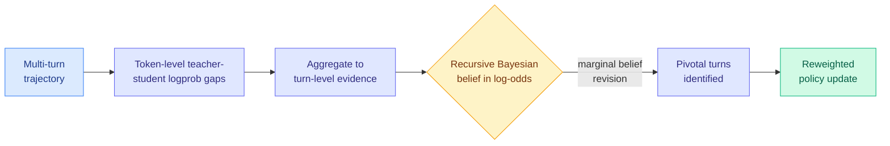
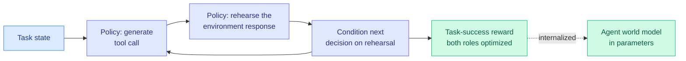

# cere-bro | 2026-08-07

> Some attention to your tears. Read through the optimization lens, today is a training-cost day wrapped around a power-structure earthquake: three papers push the on-policy distillation thread toward *free* credit assignment and *free* environments, while Google dismantles DeepMind's leadership and SemiAnalysis declares it "no longer a frontier lab." The research is about doing more with fewer rollouts and no simulator; the industry story is about who still has the compute to not care.

---

## TL;DR

- **AgentOPSD**: turn-level credit assignment for agentic RL with no critic and no extra rollouts, by recursively updating a Bayesian belief over which turns mattered. 89.1% on ALFWorld with a 7B model.
- **On-Policy Delta Distillation (OPD²)**: use the probability gap between a post-trained teacher and its base model as the learning signal. Strongest gains in Korean and Japanese math reasoning.
- **EnvACE**: train tool-use agents with no external environment. The policy rehearses the environment's response itself, internalizing a world model, and even pre-rehearses privately at test time.
- **DeepMind leadership overhaul**: Jeff Dean leaves to found "Discovery Loop," Hassabis steps back, and SemiAnalysis calls DeepMind "no longer a frontier lab." The beneficiary is Google Cloud, not Gemini.
- **HarnessOpt-Bench**: a benchmark for whether LLMs can optimize their own agent harness, formalizing the harness-as-artifact thread the wiki has tracked since July.

---

## Deep Dives

### AgentOPSD: Free Credit Assignment for Long-Horizon Agents

> Reinforcement learning knows the agent won or lost, but not which of its fifty decisions decided it. AgentOPSD recovers that per-turn credit for free, no critic, no extra rollouts, by treating the teacher-student probability gap as evidence and recursively revising a belief about which turns were pivotal.

**Source:** HuggingFace Daily Papers (87 upvotes, #1 today)
**Links:** [arXiv 2608.05987](https://arxiv.org/abs/2608.05987)

**What is it about?**
RL with verifiable rewards (a single win/lose signal at the end of a task) builds trajectory-level advantage estimates, but on long multi-turn agentic tasks it cannot credit the few pivotal decisions that actually determined the outcome. Recent work added privileged self-distillation for denser supervision, but left open how those local signals should represent *sequential* credit. AgentOPSD is a critic-free, recursive method for turn-level credit assignment: it aggregates token-level teacher-student log-probability gaps into turn-level evidence, then recursively updates a Bayesian belief state in log-odds space, converting sparse outcome supervision into per-turn credit and flagging pivotal turns by the marginal belief revision between consecutive states.

**What problem does it solve?**
The dominant fix for sparse credit is to train a critic (a second network estimating per-step value), which costs compute, memory, and a whole extra training loop, or to do more rollouts. AgentOPSD needs neither. It reuses a signal you already have (the teacher-student log-prob gap from distillation) and folds it into a Bayesian recursion, so per-turn credit falls out of quantities already computed. This is a cost-optimization result: denser supervision at essentially zero marginal cost over standard policy optimization.

**What is the core novelty?**
The recursive log-odds belief update. Prior privileged-self-distillation work (the wiki has tracked this since CRPO and the July "disagreement is the only transferred signal" cluster) produced local per-token signals but had no principled way to make them sequential. AgentOPSD's insight is that credit is a belief you revise as the trajectory unfolds, and the *change* in that belief between turns is exactly the pivotal-turn detector. It is fully compatible with standard policy optimization and adds no critic and no extra rollouts.

**Key takeaways**
- Turn-level credit assignment with no critic and no extra rollouts, purely from teacher-student log-prob gaps already available in distillation.
- Recursive Bayesian belief in log-odds space; pivotal turns are the turns with the largest marginal belief revision.
- 89.1% success on ALFWorld with Qwen2.5-7B, beating GRPO and strong self-distillation baselines, across ALFWorld, WebShop, and Search-QA at 3B and 7B.
- Ablations attribute the gains specifically to turn-level aggregation plus history-dependent recursive updates, not either alone.

**Gaps in the study**
Evaluated on Qwen2.5 at 3B and 7B; whether the belief recursion holds at frontier scale and on genuinely open-ended agentic tasks (not the three fairly structured benchmarks) is untested. The method inherits its signal from a teacher, so it is bounded by teacher quality, and the "pivotal turn" identification is validated by downstream reward, not by an independent ground truth of which turns actually mattered.

**Industrial implication**
Credit assignment is the expensive, fiddly part of agentic RL, and "add a critic" is the standard tax. A critic-free method that lands 89% on ALFWorld is directly attractive to anyone training tool-use agents on a budget. It also sharpens the wiki's on-policy distillation thread into a clean statement: the teacher-student disagreement is not only *what* transfers (the July result) but also *where* the credit is (today's result). Those are the same quantity read two ways.

**Research angle (optimization lens).** This is pure cost optimization, denser learning signal from computation you already do. The open composition: AgentOPSD's pivotal-turn belief is a natural token-selection criterion for the disagreement-based distillation the wiki flagged on 08-04. A method that trains only on the pivotal turns AgentOPSD identifies, weighted by the belief revision, would cut training tokens as well as add credit. Nobody has connected turn-level credit to token-level selection; that is the next paper.

---

### EnvACE: Training Tool-Use Agents With No Environment

> Building executable environments to train agents is expensive; external simulators are hard to ground. EnvACE deletes both. The policy plays the environment against itself, generating the tool response its own action would cause, and learns a world model as a side effect.

**Source:** HuggingFace Daily Papers (38 upvotes)
**Links:** [arXiv 2608.06197](https://arxiv.org/abs/2608.06197) · [Code](https://github.com/Within-yao/EnvACE)

**What is it about?**
Training LLM agents for long-horizon tool use normally requires interacting with real or synthesized executable environments (costly to build and verify) or external simulators (hard to ground). EnvACE replaces external interaction during training with "world rehearsal": the policy alternates between acting (generate a tool call) and rehearsal (play the environment and produce the response that action would induce), conditioning later decisions on the rehearsed response. Both roles are optimized end-to-end with task-success rewards, so the policy internalizes the action-to-response relationship in its own parameters, yielding an agent world model that directly supports decisions.

**What problem does it solve?**
The environment is the hidden cost of agentic RL. Every benchmark needs an executable sandbox with realistic backends, and building or renting that is the bottleneck (the July frozen-environment and synthetic-data papers were all attacking this). EnvACE removes the environment from the training loop entirely: the model is its own simulator. That is a large cost-optimization, no sandbox infrastructure, no external simulator to ground.

**What is the core novelty?**
Jointly optimizing the agent and the internalized environment via the same task-success reward, so the world model is a byproduct of learning to act rather than a separately trained component. At test time the internalized model enables "private rehearsal": the agent can simulate an action's consequences before committing to real execution, buying further gains under a moderate rehearsal budget with no additional external interaction.

**Key takeaways**
- No external environment during training; the policy rehearses the environment's responses itself.
- Strong, transferable results across BFCL-v4, tau²-Bench, VitaBench, and FinMCP-Bench, beating environment-scaling baselines overall.
- Test-time private rehearsal (simulate before committing) yields further gains within a moderate budget.
- World rehearsal improves policy learning consistently across model scales in controlled studies.

**Gaps in the study**
An internalized environment is only as accurate as the model's world knowledge; for environments with dynamics the model has not seen (novel APIs, adversarial backends), the rehearsal will be confidently wrong, and the paper does not characterize where the self-simulation diverges from a real environment. This is the same trust concern as self-judgment, the model grading its own imagined world, which the wiki's reward-hacking thread warns about.

**Industrial implication**
If world rehearsal holds, the economics of agent training change: the sandbox, the most expensive piece, becomes optional. This is especially valuable for domains where a realistic executable environment is genuinely hard to build (finance, enterprise tools), which is exactly where FinMCP-Bench sits. The test-time private-rehearsal trick is also a cheap inference-time reliability lever, think before you act, at the cost of a few extra internal tokens rather than a real tool call.

---

### The On-Policy Distillation Thread Keeps Compounding: OPD² and HarnessOpt-Bench

> Two more entries in threads the wiki has tracked for months. OPD² sharpens the distillation signal to the teacher-minus-base delta; HarnessOpt-Bench makes "can a model optimize its own harness" a measurable question.

**Source:** HuggingFace Daily Papers (OPD² 28 upvotes, HarnessOpt-Bench 33 upvotes)
**Links:** [OPD²](https://arxiv.org/abs/2608.05802) · [HarnessOpt-Bench](https://arxiv.org/abs/2608.06301)

**What is it about?**
On-Policy Delta Distillation (OPD²) studies on-policy distillation for multilingual math reasoning (English, Korean, Japanese) and improves it by using the probability gap between a post-trained teacher and its *base* model as the learning signal, rather than the teacher's raw logits. HarnessOpt-Bench is an evaluation of whether LLMs can optimize an agent harness, the orchestration scaffold the wiki has tracked as a first-class artifact since the July Harness Handbook and The Harness Effect.

**Key takeaways**
- OPD²: the teacher-minus-base delta is a cleaner signal than raw teacher logits, consistently beating standard OPD, with the biggest gains in Korean and Japanese.
- OPD² finding worth noting: English-only distillation improves Korean and Japanese too, but shifts responses toward English, so multilingual data is needed to preserve the target language.
- HarnessOpt-Bench formalizes harness self-optimization as a benchmark, giving the harness-as-artifact thread a measurement instrument.
- Both are optimization-lens papers: OPD² is a cost-optimization of the distillation signal (more transfer per token), HarnessOpt-Bench measures influence-optimization (a harness change that improves every model call).

**Gaps in the study**
OPD² is three languages and one domain (math); whether the delta signal generalizes to open-ended reasoning or other language families is open. HarnessOpt-Bench is a benchmark, so its value depends on whether it correlates with real deployed harness quality, the exact critique the July "Rethinking the Evaluation of Harness Evolution" paper leveled at harness-evolution claims.

**Industrial implication**
OPD² is the clearest confirmation yet of the July "disagreement is the only transferred signal" thesis: the teacher-minus-base delta *is* the disagreement, isolated. For multilingual deployments it is a direct recipe. HarnessOpt-Bench matters because if the harness is where the cost lives (The Harness Effect: 41% cost swing), then a model that can optimize its own harness is optimizing its own cost, and now there is a way to measure whether it can.

---

## Industry Pulse

- **DeepMind leadership overhaul**: Jeff Dean (Google Brain co-founder, TPU program founder) leaves to start a neolab called "Discovery Loop," joined by Google Fellows Sanjay Ghemawat and Quoc Le plus Gemini co-lead Oriol Vinyals; Demis Hassabis steps back from day-to-day; Koray Kavukcuoglu takes over ([SemiAnalysis](https://newsletter.semianalysis.com/p/gemini-is-cooked-but-gcp-is-cooking)).
- **SemiAnalysis: "DeepMind is no longer a frontier lab"**: it cites RL-team departures and poor compute allocation, and argues Google's odds of reaching SOTA again "have dropped to zero" ([SemiAnalysis](https://newsletter.semianalysis.com/p/gemini-is-cooked-but-gcp-is-cooking)).
- **The real winner is Google Cloud, not Gemini**: with the Gemini-vs-GCP compute fight settled in Thomas Kurian's favor, SemiAnalysis expects GCP revenue growth to accelerate meaningfully ([SemiAnalysis](https://newsletter.semianalysis.com/p/gemini-is-cooked-but-gcp-is-cooking)).
- **Gary Marcus pushes back**: "Seven reasons I wouldn't count Google out," a counterweight to the SemiAnalysis obituary, arguing Google's data, distribution, and TPU depth still matter ([Marcus on AI](https://garymarcus.substack.com/)).
- **"The Dark Side of Anthropic's Growth"**: Ignacio de Gregorio's analysis of the strains under Anthropic's rapid scale ([Medium](https://medium.com/)).
- **Is Meta making money from illegal AI content?**: AI Weekly Espresso raises the monetization-of-harmful-content question at Meta ([AI Weekly](https://aiweekly.co/)).

---

## Global View

**The on-policy distillation thread has converged on one claim from three directions this week, and every version of it is a cost-optimization.** AgentOPSD says the teacher-student disagreement tells you *which turns* earned the reward (turn-level credit, no critic). OPD² says the teacher-minus-base delta *is* the transferable signal, isolated (better transfer per token). Both descend from the 08-04 Requential Coding result that the information moving from teacher to student is exactly their disagreement, and from the July TIP finding that under 10% of teacher tokens carry signal. Read together, the field is triangulating a single object, the disagreement, and reading credit, learning signal, and token-selection off of it. The unwritten paper is the composition: use AgentOPSD's pivotal-turn belief to select the tokens OPD² transfers, cutting rollouts, critic, and training tokens at once. For an optimization researcher this is the highest-value open experiment on the board.

**Research is deleting the two most expensive parts of agentic RL, the critic and the environment, in the same week the industry story is entirely about who still has enough compute to not optimize.** AgentOPSD removes the critic; EnvACE removes the environment (the policy simulates it). Both are bets that the model already contains the signal or the world, so you should stop paying to compute it externally. Meanwhile Google just reorganized DeepMind because it *couldn't* allocate compute cleanly between Gemini and GCP, and SemiAnalysis's read is that the lab that loses the internal compute fight loses the frontier. The through-line: at the research frontier the game is doing more with less (no critic, no sandbox), while at the industry frontier the game is still raw compute allocation, and the labs that treat compute as infinite are the ones publishing the efficiency papers second. The gap between "we found a way to not need the rollout" and "we reorganized the company over compute" is the whole tension of 2026.

---

## Looking Ahead

- **A paper composes turn-level credit (AgentOPSD) with token-level selection (TIP/OPD²) within 90 days.** All three read the same teacher-student disagreement; nobody has used the pivotal-turn belief as the token-selection criterion. Signal: an agentic-RL paper reporting reduced training tokens AND improved credit assignment on ALFWorld/WebShop, citing both lines. If it appears, the disagreement-as-universal-signal thesis is settled.
- **EnvACE-style world rehearsal shows up in a frontier agent-training pipeline within 90 days, or a paper documents where self-simulation diverges from real environments.** The cost saving is too large to ignore and the failure mode (confidently wrong rehearsal) is too obvious to leave unmeasured. Signal: either an open agent release naming internalized-environment training, or a paper reporting rehearsal-vs-real environment divergence rates.
- **Google ships one more genuinely frontier model within 120 days, or SemiAnalysis's "dropped to zero" call ages into consensus.** The DeepMind overhaul is a falsifiable bet. Signal: whether Gemini 4 Pro (or its successor) tops an independent frontier benchmark by year-end. If it does, Marcus was right; if it does not, the obituary was early but correct.
