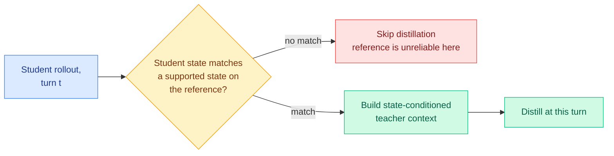
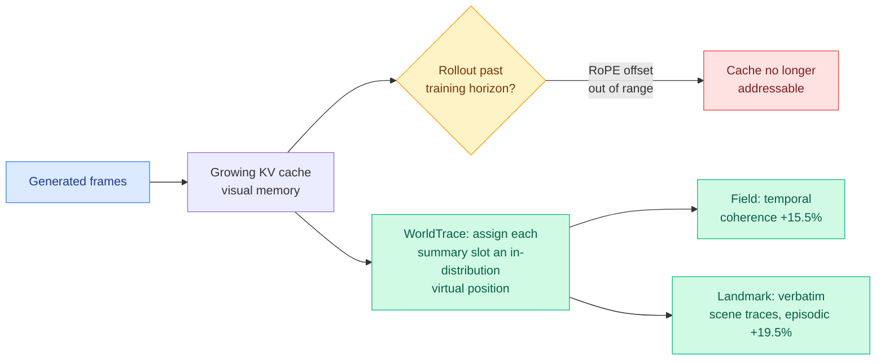

# cere-bro | 2026-08-10

> Some attention to your tears. A thin paper Monday that quietly extends three of last week's threads, all cost-optimizations. The distillation-disagreement line gets its most honest paper yet (privileged guidance fails when the student walks somewhere the reference never went, so only distill where the states match). The addressable-state idea from Raven reappears in video KV caches. And a new scaling law predicts loss at 10x less compute. The through-line: last week's ideas are already compounding.

---

## TL;DR

- **SMRC-SD**: privileged self-distillation breaks when the student reaches states the reference trajectory never covered. The fix: only distill at matched states. Lifts ALFWorld 0.746 to 0.865 at 1.7B.
- **WorldTrace (Addressable Memory for Video)**: video world models lose the ability to address their KV cache past the training horizon. Assigning each compressed slot an in-distribution virtual position restores recall, +19.5% episodic.
- **Skaling law**: couple model size and data through one interaction exponent. Cuts scaling-law error 1.5-3x and predicts full-grid performance at ~10x less compute.
- **ReASearch (The Optimizer Is the Agent)**: fold prompt/program/workflow search into one reasoning agent instead of an outer-loop controller. 2-40% over specialized systems.
- **Modular TTT**: represent test-time-training's inner learner as a DAG of composable primitives; ablations find small LR init, weight decay, and a single nonlinearity are what matter.

---

## Deep Dives

### SMRC-SD: Only Distill Where the Student Actually Is

> Last week the field agreed the teacher-student disagreement is the whole signal. This week's honest correction: that signal is worthless when the student has walked somewhere the teacher's reference trajectory never went. SMRC-SD checks state-compatibility first and distills only where the reference actually applies.

**Source:** HuggingFace Daily Papers (2026-08-10) · from Junlin Liu's group, the distillation-for-agents author the 08-04 digest flagged as a rising signal
**Links:** [arXiv 2608.05219](https://arxiv.org/abs/2608.05219) · [Code](https://github.com/liujunzhuo/SMRC-SD)

**What is it about?**
Privileged on-policy distillation gives multi-turn agents dense supervision: a synchronized teacher re-scores the student's response at every turn using training-only references (like successful trajectories). But in interactive environments the student's own actions change the execution state, so its rollout can reach states the reference never covered, making the reference unreliable exactly where it is applied. SMRC-SD (State-Matched Routing and Contextualized Self-Distillation) verifies, at each turn, whether the student's current state matches a supported state on the reference, distills only at matched states, and builds state-conditioned teacher context from the successful trajectory to ground the supervision in the state actually reached.

**What problem does it solve?**
State-reference mismatch. Applying privileged distillation indiscriminately trains the student against guidance that does not fit where it actually is, injecting noise dressed as dense supervision. This is the practical failure mode lurking under last week's AgentOPSD and OPD² enthusiasm: the disagreement signal is only meaningful where the reference and the student's state are compatible. SMRC-SD is the paper that says so and gates on it.

**What is the core novelty?**
Two coupled mechanisms: routing (distill only at turns where the student's state is supported by the reference) and contextualization (condition the teacher's supervision on the specific reached state, not the whole successful path). Ablations credit both, selecting locally supported turns and constructing state-compatible teacher context each contribute.

**Key takeaways**
- Distill only at state-matched turns; filter out turns where the reference lacks locally compatible guidance.
- Qwen3-1.7B: ALFWorld 0.746 to 0.865, WebShop 0.574 to 0.693, over unconditional full-path distillation.
- Both routing and state-conditioned context contribute in ablations.
- From Junlin Liu's group, the fourth distillation-for-agents paper the wiki has now logged from this cluster, confirming the 08-04 rising-author call.

**Gaps in the study**
Two structured benchmarks (ALFWorld, WebShop) at 1.7B; whether state-matching scales to open-ended agentic tasks with large state spaces (where "matched state" is harder to define) is untested. The state-match verifier itself is a component that can be wrong, and the paper does not report its precision.

**Industrial implication**
This is the corrective the distillation-for-agents thread needed to be deployable. Teams applying privileged distillation to multi-turn agents have been silently training on mismatched references; state-matched routing is a cheap gate that removes that noise. It sharpens last week's cost-optimization story: the disagreement is the signal, but only where the states line up, so the real recipe is "distill the disagreement, at the matched turns, on the pivotal tokens", the composition the 08-08 weekly flagged as the top open experiment, now with the state-matching piece supplied.

---

### WorldTrace: The Addressable-State Idea Reaches Video KV Caches

> Raven made a language-model state addressable last week. This week the same fix lands in video: a world model whose KV cache becomes unaddressable past its training horizon, repaired by giving each compressed memory slot an in-distribution virtual position.

**Source:** HuggingFace Daily Papers (2026-08-10)
**Links:** [arXiv 2608.07408](https://arxiv.org/abs/2608.07408)

**What is it about?**
Interactive video world models use a KV cache as a growing visual memory to carry prior frames forward. WorldTrace finds that once rollouts extend past the training horizon, the model can no longer reliably address stored content, because temporal RoPE (rotary positional embedding) offsets fall outside the trained range, and naively compressing the cache in RoPE-rotated space corrupts memory by averaging incompatible positional phases. WorldTrace is a training-free fix: keep compressed memory addressable by assigning each summary slot a distinct, in-distribution virtual position. Two variants: Field (compress for temporal coherence) and Landmark (store verbatim scene traces at detected transitions for episodic recall).

**Key takeaways**
- The failure is addressability, not capacity: out-of-range RoPE offsets make stored frames unretrievable past the training horizon.
- In-distribution virtual positions restore addressable compressed memory, training-free.
- Field +15.5% temporal consistency; Landmark +19.5% episodic recall on the new LoopBench (reconstruct a previously visited scene after a long detour).
- This is the video-domain twin of Raven's (08-04) core insight: a state you cannot address is a state you cannot use; make it addressable and compression becomes safe.

**Gaps in the study**
Training-free and benchmark-specific (LoopBench is introduced here); whether the virtual-position trick holds across video architectures and much longer horizons is open. The two variants optimize different things (coherence vs episodic recall) and the paper does not show a single configuration that does both.

**Industrial implication**
Long-horizon interactive video (game engines, world models, the "From Pixels to States" direction from July) is bottlenecked on exactly this: memory that stops working past the training length. A training-free addressability fix is immediately usable, and it generalizes the addressable-state principle across modalities, which is the more important point. For the KV-cache thread: addressability, not size, is emerging as the property that decides whether a compressed cache is usable.

---

### Skaling, ReASearch, Modular TTT: Three Cheaper Ways to Do a Known Thing

> Three more optimization-lens papers: a scaling law that predicts at 10x less compute, a search agent that replaces hand-built outer-loop controllers, and a modular deconstruction of test-time training.

**Source:** HuggingFace Daily Papers (2026-08-10)
**Links:** [Skaling](https://arxiv.org/abs/2608.07222) · [ReASearch](https://arxiv.org/abs/2608.06714) · [Modular TTT](https://arxiv.org/abs/2608.07110)

**What is it about?**
**Skaling** generalizes neural scaling laws by coupling model capacity and data through a single interaction exponent, fixing the standard assumption that size and data affect loss independently (which under/overestimates at data-scarce and overtraining extremes). **ReASearch** ("The Optimizer Is the Agent") asks how much of an optimization search policy can be internalized by one tool-using agent instead of an explicit outer-loop controller (evolutionary search, bandits, textual gradients). **Modular TTT** represents test-time training's inner learner as a directed acyclic graph, exposing fast-weight network, loss, learning rate, weight decay, and normalization as explicit design dimensions for systematic ablation.

**Key takeaways**
- Skaling cuts scaling-law error 1.5-3x and, with a sparse low-compute grid, predicts full-grid performance at ~10x less compute, a direct cost-optimization for compute-budget allocation.
- ReASearch: one reasoning agent, same scaffold across prompts/programs/ML workflows, 2-40% over specialized systems, sometimes beating human best-known; complex search behaviors emerge from reasoning without hand-designed controllers.
- Modular TTT: small learning-rate init, weight decay, and a single-layer nonlinearity help; deeper fast-weight nets and normalization hurt (they blow up activations); the best variant matches Gated DeltaNet at 410M/1.45B on 100B tokens.
- All three are the week's theme in miniature: get the same result for less (less compute, less hand-engineering, less architectural guesswork).

**Gaps in the study**
Skaling is validated on the usual scaling-law regimes; whether the single interaction exponent holds for MoE and hybrid architectures is untested. ReASearch's emergent-search claim is strong but rests on 14 tasks. Modular TTT's ablation conclusions are at =1.45B; some may reverse at frontier scale.

**Industrial implication**
Skaling is the most directly useful: predicting frontier loss from small-scale sweeps at 10x less compute is exactly the compute-allocation lever the whole industry (per the 08-08 weekly) is fighting over. ReASearch points at collapsing optimization toolchains into a single agent loop, which is the same "the agent already contains the search policy" move as EnvACE's "the agent already contains the environment."

---

## Industry Pulse

- **DAIR.AI Top Papers of the Week**: the weekly roundup landed, a curated cross-check against the wiki's own week (starred Gmail) ([DAIR.AI](https://nlp.elvissaravia.com/)).
- **"AI became everybody's decision"**: a newsletter framing that AI adoption has crossed from specialist to universal-decision territory ([AI Weekly](https://aiweekly.co/)).
- **"Lessons from the hacks"**: a security-retrospective piece on recent AI-related breaches ([Gmail starred](https://mail.google.com/)).
- **Kurate leaderboard**: unchanged, biomedical-foundation-model heavy; the rising-author signal that matters remains the distillation-for-agents cluster (Junlin Liu), confirmed again today by SMRC-SD ([Kurate](https://kurate.org)).
- Thin HF day (11 papers, top at 10 upvotes); the real signal was continuity with last week's threads, not new launches.

---

## Global View

**Monday confirmed that last week's ideas are compounding, not resetting, which is exactly what a knowledge base should show.** SMRC-SD did not introduce a new thread; it supplied the missing piece of an existing one. The 08-08 weekly named the top open experiment as "distill the disagreement, at the pivotal turns, on the pivotal tokens," and flagged that state-matching was the unsolved gate. SMRC-SD is that gate: distill only where the student's state matches the reference. Read with AgentOPSD (which turns), OPD² (which delta), and TIP (which tokens), the recipe for cheap dense agent supervision is now almost fully specified, and it is entirely a cost-optimization, more learning per rollout, per token, per critic-you-do-not-need. That four papers from partly the same author cluster (Junlin Liu appears again) are assembling one method in public is the clearest "the field is converging" signal on the board.

**Addressability, not size, is becoming the property that decides whether a compressed state is usable, and it is now crossing modalities.** Raven (08-04) made a language-model recurrent state addressable so differential checkpointing becomes thinkable; WorldTrace (today) makes a video world model's KV cache addressable past its training horizon so compression stops corrupting memory. Same principle, different modality, one week apart: a state you cannot address is a state you cannot compress safely. For the wiki's KV-cache thread this reframes the whole 2026 efficiency story, the question was "how small can the cache get," and it is becoming "can you still address it after you shrink it." The 08-04 Kimi K3 primer showed the industry version (linear-attention caches need 32K checkpointing to stay usable); the research answer converging across Raven and WorldTrace is that addressable structure is the fix.

---

## Looking Ahead

- **The full cheap-distillation recipe (turns + tokens + delta + state-match) appears as one method within 60 days.** All four components now exist across AgentOPSD, OPD², TIP, and SMRC-SD, several from the same cluster. Signal: an agentic-RL paper composing state-matched routing with pivotal-turn credit and token selection, reporting reduced rollouts and tokens together on ALFWorld/WebShop.
- **The addressable-state principle gets a cross-modal statement within 90 days.** Raven and WorldTrace independently found the same fix in language and video; someone will name it as one principle. Signal: a paper or position piece framing compressed-state addressability as modality-general, or a hybrid model shipping addressable slot-state with differential checkpointing.
- **A frontier training run cites Skaling-style coupled scaling for compute allocation within 120 days.** Predicting loss at 10x less compute is exactly the lever the compute-allocation war rewards. Signal: a major model's technical report using a coupled-exponent scaling law to justify its data/size split.
