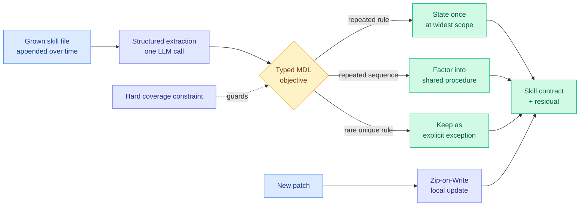
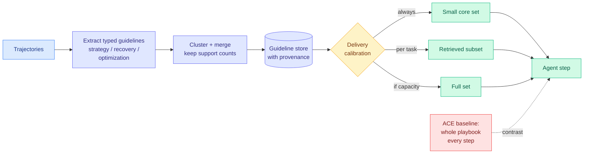
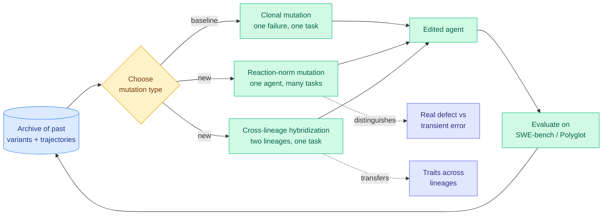
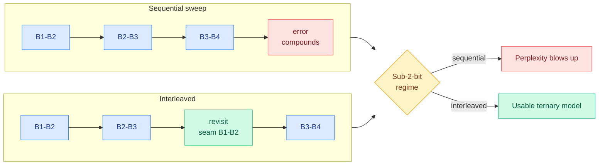
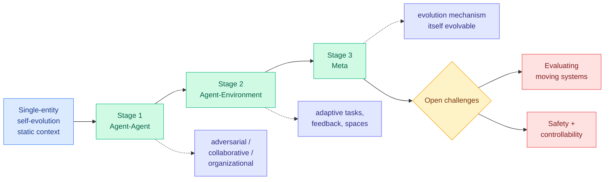
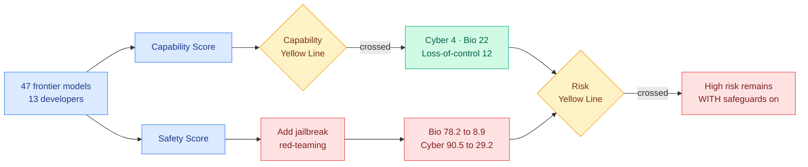

# cere-bro | 2026-08-12

> Today's board is one cost argument told three times by parties who did not coordinate: a paper, an engineering post, and a pricing page all concluded that an agent's accumulated memory has become the recurring bill, and that the fix is to send less of it. The optimization axis is cost, and for once it is not the model that is expensive.

---

## TL;DR

- **SkillZip**: compress an agent's skill file by finding its shortest faithful structure. No test runs needed, rare rules survive by construction.
- **IBM's ALTK-Evolve**: stop injecting the whole agent playbook every step. 41% of the token cost at 8.9 points higher accuracy.
- **Three new benchmarks, one diagnosis**: best agent hits 56.7% on real data science. 79% of failures are the agent guessing instead of looking.
- **Mendel Gödel Machine**: self-improving agents currently learn from one failure at a time. Read the whole archive instead.
- **From Sweep to Seam**: quantization order matters more than the quantizer. Revisiting block seams rescues 1.58-bit models that a single sweep destroys.
- **Frontier AI Risk Monitor**: jailbreaks drop average model safety from 78.2 to 8.9 on biological risk. Attack capability rose 68%, defenses fell 3%.

---

## Deep Dives

### SkillZip: Evaluation-Free Skill Compression for Self-Evolving Agents

> A self-evolving agent's skill file is not merely long, it is structurally redundant, and you can prove how redundant without running a single task.

**Source:** HuggingFace Daily Papers
**Links:** [Paper](https://arxiv.org/abs/2608.11079) · [Wiki summary](../../agentic-systems/2026-08-12-skillzip-skill-compression.md)

**What is it about?**
A self-evolving agent (one that improves itself after deployment without a human writing the next version) grows a **skill file** by appending: every success adds a procedure, every failure adds a fix. Nothing is ever removed. SkillZip compresses that file by finding the shortest structural explanation that still accounts for everything in it.

**What problem does it solve?**
The skill file is injected into the model's context on every single step, forever, so its size is a recurring bill. Until now the only way to shrink it was **evaluation-guided compression**: propose a shorter version, run tasks, check behavior survived. That costs rollouts and makes the result depend on whichever tasks happened to be in the evaluation set at compression time. SkillZip needs zero rollouts.

**What is the core novelty?**
A typed minimum-description-length objective (minimum description length means: pick the shortest encoding that still explains the data) over a skill *contract* plus a *residual*, subject to a hard coverage constraint on every extracted trigger, workflow edge, tool requirement, obligation and output field. The intuition is **explain once, reference many**: state a repeated rule a single time at the scope where it applies, factor a repeated action sequence into one shared procedure, keep only genuine differences as explicit exceptions.

**Key takeaways**
- Generic prompt compression fails here because a skill is not a flat passage. Its name and description decide *when it applies*, its workflow controls *execution order*, and its tool contracts constrain *validity*, so each part fails differently when damaged.
- Because coverage is checked **structurally rather than behaviorally**, rare exceptions survive by construction. That matters: a rare exception is exactly what a sampling-based compressor deletes first, because no sampled task activates it.
- **Zip-on-Write** folds each new self-evolution patch in without replaying tasks or reparsing history, which is what makes it deployable rather than a one-time cleanup.
- The premise itself is the finding. A method built on "this artifact is substantially compressible" is a redundancy measurement, and this wiki has been asking for one since 07-27.

**Gaps in the study**
No behavioral floor is reported, so structural coverage guarantees no element was dropped but not that meaning survived being hoisted to a wider scope. There is no compression-ratio-against-degradation curve, so there is no way to pick an operating point, and Zip-on-Write is never tested across a long evolution run, which is exactly where incremental-merge drift would appear.

**Industrial implication**
If you run agents with accumulated skills in production, the recurring cost is context injection, not the evolution loop, and this is the first method that attacks the recurring half without a rollout budget. Expect the compression step to appear as a maintenance job in agent frameworks within two quarters. The unaddressed risk is security: merging rules across branches is precisely the operation that would launder a poisoned rule into a shared procedure many branches then reference, and [SkillJack (08-05)](../../responsible-ai/2026-08-05-skilljack-persistent-skill-backdoors.md), which found detection of a poisoned skill collapsing from 98.5% on the source trajectory to 11.4% on the extracted skill, says that abstraction step is already the weak link.

→ [Full summary](../../agentic-systems/2026-08-12-skillzip-skill-compression.md)

---

### ALTK-Evolve: the agent playbook should be delivered selectively, not injected whole

> Higher accuracy at 41% of the token cost. Both axes moved the right way, which means the baseline was paying for context that was actively harmful.

**Source:** IBM Research, HuggingFace blog
**Links:** [Post](https://huggingface.co/blog/ibm-research/altk-evolve-sldd) · [Wiki summary](../../agentic-systems/2026-08-12-altk-evolve-selective-context-delivery.md)

**What is it about?**
ACE (Agentic Context Engineering) is the current default for letting an agent learn from its own failed runs: a Generator, Reflector and Curator loop builds one comprehensive playbook of lessons and **injects the whole thing at every inference step**. IBM Research keeps the learning loop and attacks the delivery.

**What problem does it solve?**
Injecting a growing playbook on every step means cost grows with everything the agent has ever learned, whether or not this step needs it. Nobody had asked whether delivery volume should be a decision.

**What is the core novelty?**
Two moves. Guidelines are typed (strategy, recovery, optimization), attributed causally back to the trajectories that produced them, and merged when similar **while preserving support counts**, so a guideline remembers how many tasks it helped. Then delivery becomes adjustable: a small always-on core of high-confidence guidelines, plus a per-task subset retrieved by cosine similarity or model choice, or the full set if the model can absorb it.

**Key takeaways**
- On AppWorld (168 tasks, a ReAct code agent), DeepSeek-V3.2 reaches **89.3% task-goal completion at 263K tokens per task against ACE's 80.4% at 634K**. That is 8.9 points better at 41% of the cost.
- GPT-oss-120b reaches **56.0% at 116K tokens against ACE's 54.8% at 777K**, roughly tied accuracy at 15% of the cost.
- **Weaker models want curated subsets, stronger models absorb more.** Delivery volume is a per-model parameter, not a constant.
- Both axes improving at once is the real result: the baseline was not merely wasteful, it was injecting context that hurt.

**Gaps in the study**
One benchmark, 168 tasks, no cross-domain evidence. The post reports end-task completion, not whether the *right* guideline was delivered, so the win could come from removing distractors rather than from good retrieval. And there is no comparison against the obvious cheap baseline of simply truncating ACE's playbook by support count.

**Industrial implication**
This is the immediately usable result on today's board, and the two numbers are large enough to change a budget. It also carries a warning: the per-task selection is retrieval, and [InMind (07-29)](../../agentic-systems/2026-07-29-inmind-implicit-association-blind-spot.md), which found retrieval memory surfaces a fact only when the fact resembles the query with six systems reaching at most 14.4% on indirect queries against 84.0% for the same memory simply placed in context, predicts this margin shrinks on tasks that are stated indirectly. AppWorld states tasks fairly directly.

→ [Full summary](../../agentic-systems/2026-08-12-altk-evolve-selective-context-delivery.md)

---

### Three benchmarks, one shape of failure: DSAgentBench, SPIEval, VibeLifeBench

> The agents are not searching badly. In 98% of retrieval actions they are not using real search at all, and then they commit to a plausible guess.

**Source:** HuggingFace Daily Papers
**Links:** [DSAgentBench](https://arxiv.org/abs/2608.10366) · [SPIEval](https://arxiv.org/abs/2608.10692) · [VibeLifeBench](https://arxiv.org/abs/2608.10875) · [Wiki summary](../../agentic-systems/2026-08-12-agent-benchmark-cluster.md)

**What is it about?**
Three benchmarks on one board, each measuring a different kind of real agent work. **DSAgentBench** runs end-to-end data-science workflows in real computer environments across notebooks, IDEs, terminals, browsers and databases. **SPIEval** tests mobile-assistant work over personal information scattered across ten apps. **VibeLifeBench** runs 200 multi-week tasks in a simulated world of 22 services that advances on its own clock.

**What problem does it solve?**
The 08-10 and 08-11 boards produced four papers saying agent benchmarks were broken, including [SWE-Bench ProMax (08-11)](../../agentic-systems/2026-08-11-swe-bench-promax.md), which cited an audit finding nearly 60% of unsolved SWE-bench Verified instances contain flawed tests, and [StreamArena (08-10)](../../agentic-systems/2026-08-10-streamarena-streammind.md), which found a baseline reading only the last four frames matching complex streaming video models. Those said the instruments are broken. These three **build instruments that are hard to break**: deterministic multi-artifact evaluators, human curation with named capability axes, and a world clock that ticks whether the agent looks or not.

**What is the core novelty?**
VibeLifeBench's design is the one to steal. Many of its world changes are **silent**, so only an agent that re-inspects discovers them, and grading reads only what the agent actually left behind, covering end state, timeliness, and whether unstated constraints were honored. That makes proactivity measurable instead of aspirational.

**Key takeaways**
- DSAgentBench: **Claude-4.6-Sonnet best at 56.70%. Every open-source agent below 1%.** Failures concentrate in tool orchestration and OS grounding.
- SPIEval: **GPT-5.5 (xhigh) at 57.3%, weakest model 16.4%.** The diagnostic is the value: **79% of failures are inaccurate information localization**, and **fewer than 2% of retrieval actions use any advanced search method.**
- VibeLifeBench: all seven frontier models score low on multi-week proactive tasks.
- Two of the three converge on the same failure, and it is the faculty this wiki named on 08-06 as common to four negative results: **deciding what to do with a resource you already have.**

**Gaps in the study**
DSAgentBench's uniform sub-1% open-source floor is the shape of an interface failure, not a capability gradient, and [A²E (08-11)](../../agentic-systems/2026-08-11-harness-evolution-cluster.md), which found no model-harness combination wins across all task types, makes the harness the obvious confound. Whether a better scaffold lifts open models is the most informative missing ablation on the board. None of the three reports token or dollar cost, which for a benchmark rewarding repeated world re-inspection is part of the result.

**Industrial implication**
If you are buying an agent for real multi-tool work, the honest planning number is roughly half, and open-weight substitution is not currently available at this task type regardless of what single-tool leaderboards say. The actionable engineering lever is the cheapest one: SPIEval says agents are not exhausting retrieval before committing, so forcing a verification step before an agent finalizes an answer is likely worth more right now than a better model.

→ [Full summary](../../agentic-systems/2026-08-12-agent-benchmark-cluster.md)

---

### Mendel Gödel Machine: self-modification from the archive, not from the last failure

> Every self-improving coding agent published so far rewrites itself based on one failure on one task, and throws away everything its own archive already knows.

**Source:** HuggingFace Daily Papers
**Links:** [Paper](https://arxiv.org/abs/2608.07645) · [Wiki summary](../../agentic-systems/2026-08-12-mendel-godel-machine.md)

**What is it about?**
Self-improving coding agents rewrite their own source code in a loop. MGM changes **what evidence each rewrite is conditioned on**, from a single failure trajectory to the agent's accumulated archive of past attempts.

**What problem does it solve?**
If an agent fails one task, the failure might be a genuine defect in the agent or an accident of that task. Conditioning a rewrite on one trajectory cannot tell those apart, so single-trajectory loops spend edits fixing noise.

**What is the core novelty?**
Two new mutation operators, and the genetics framing is the actual argument rather than decoration. **Reaction-norm mutation** edits an agent using its trajectories across multiple tasks at once, so a recurring failure mode is distinguishable from a one-off. **Cross-lineage hybridization** edits a failing agent using a reference agent from a different lineage on the same task, including the more interesting case of comparing two *failing* trajectories to find complementary weaknesses, which does not require a success to learn from.

**Key takeaways**
- Faster convergence proven under an **additive fitness landscape** model, confirmed in controlled surrogate simulation, with consistent gains on SWE-bench and Polyglot.
- This is the first paper in the area to open up the self-modification *operator*. The [08-11 harness cluster](../../agentic-systems/2026-08-11-harness-evolution-cluster.md), covering Ouroboros (a self-developing agent at 86.74% on Terminal-Bench 2.1 with a 161-day live deployment), Evo-Bench and A²E, all treated "the agent edits itself given a failure" as a primitive. The two lines compose rather than compete.
- It is a candidate explanation for Evo-Bench's **early saturation**, which this wiki called the most important unexplained result in the area. If each cycle conditions on one trajectory, edits are high-variance and mostly correct noise, so the curve flattens once single-trajectory-visible defects run out.

**Gaps in the study**
The additive fitness landscape is precisely the assumption under which recombination provably helps, and real agent code has strong interactions between components, with no empirical additivity check reported. No token or dollar accounting, so "faster convergence" is measured in cycles while both new operators need strictly more trajectories or lineages per edit. Lineage diversity is never characterized, which is the classic failure mode of evolutionary search. And it is evaluated on SWE-bench, whose validity this wiki challenged one day earlier.

**Industrial implication**
Nobody should deploy this yet, but the falsifiable experiment is cheap and someone should run it: **run Evo-Bench with MGM's operators and see whether the saturation point moves.** If it does, autonomous harness evolution is bounded by evidence rather than by capability, and the whole recursive-improvement forecast shifts. If it does not, the bound is real and the safety concern moves from unbounded improvement to unbounded drift.

→ [Full summary](../../agentic-systems/2026-08-12-mendel-godel-machine.md)

---

### From Sweep to Seam: Interleaved Cross-Block Post-Training Quantization

> The schedule, not the quantizer, is what stands between a usable 1.58-bit model and a broken one.

**Source:** Kurate cs.AI weekly leaderboard #19, absent from HuggingFace
**Links:** [Paper](https://arxiv.org/abs/2608.09595) · [Wiki summary](../../inference-efficiency/2026-08-12-icbq-interleaved-cross-block-quantization.md)

**What is it about?**
Post-training quantization (replacing a trained model's weights with a much coarser numeric format, after training, so it needs less memory and bandwidth) cannot be optimized globally because the whole model does not fit on one accelerator. So it is done block by block. This paper changes only the **order** in which blocks are processed.

**What problem does it solve?**
In a left-to-right sweep over adjacent block pairs, each pair is optimized once. An error introduced early is baked into the input distribution every later block is fit against, and nothing ever comes back to fix it. At 1.58-bit ternary weights that compounding is fatal: the paper reports its sequential baseline producing very high perplexity on Llama-3-8B and Qwen3-8B.

**What is the core novelty?**
Everyone else improves *what happens inside* the reconstruction unit, the objective, the weight representation, the error compensation. This changes *when and in what order* the local operations run, interleaving refinement passes back over already-quantized seams so error buildup is actively suppressed rather than merely accounted for. The name is the argument: a sweep crosses each joint once, a seam gets stitched.

**Key takeaways**
- The gain is **orthogonal to and composable with** the objective-level methods it cites, including QEP's explicit error compensation and LoaQ's output-matching factors, and with the sub-two-bit weight families OneBit, BitNet and DBF.
- It is the only efficiency paper on today's board and it did not come from HuggingFace, which is exactly the hole the cross-source rule exists to catch.
- Kurate's tournament has not run this week, with every entry sitting at the 1200 baseline and 0% win rate, so the #19 ranking carries essentially no information today.

**Gaps in the study**
The baseline is a simplification the authors introduced, a fixed two-block weight-only reduction of Cross-Block Quantization rather than CBQ as published, so the reported blow-up is against a weakened prior method. Weight-only, so it says nothing about the weight-activation setting where most serving throughput lives. Only two 8B models, well below the scale at which block-wise processing is mandatory rather than convenient. And the cost of the extra passes is unreported, which matters because post-training quantization's entire appeal is being cheap relative to retraining.

**Industrial implication**
Sub-two-bit stopped being academic this week for a reason visible in the funding data below: **OLIX raised $312 million at a $3.3 billion valuation for an HBM-free inference architecture**, and Sandisk and SK hynix published the first open High Bandwidth Flash specification for inference memory. Both describe a serving stack with far less fast memory, which is the only regime where ternary weights are worth the trouble. Research making 1.58-bit reliable and capital betting against HBM are pointed at the same deployment.

→ [Full summary](../../inference-efficiency/2026-08-12-icbq-interleaved-cross-block-quantization.md)

---

### Continual learning is arriving in pieces, and the argument for it is a maintenance bill

> Twenty-plus startups are building deployed-learning loops, and not one of the three arguments for doing it is a research argument.

**Source:** Gradient Flow (Ben Lorica)
**Links:** [Post](https://gradientflow.substack.com/p/your-ai-should-be-better-on-day-500) · [Wiki summary](../../ai-industry/2026-08-12-continual-learning-market.md)

**What is it about?**
Ben Lorica counts more than twenty startups whose core business is one loop: a deployed system captures its own experience, turns it into a durable improvement, checks the improvement did not break something else, and carries it forward. Mechanism-agnostic on purpose, since memory, self-revised instructions and actual weight updates all count.

**What problem does it solve?**
It supplies the demand-side half of today's two technical results. Lorica's economic argument is almost SkillZip's abstract in plain English: you pay to reprocess the same information at the start of every session, so information you use often should be compressed into the system rather than re-read from scratch, which also lets a smaller cheaper model beat a bigger general one on the narrow task it has already seen.

**What is the core novelty?**
The split prediction. Continual learning contains **two bets with different adoption curves**. The context-and-instruction half is already arriving and is cheap, inspectable and reversible, and "many teams will adopt them without ever describing what they are doing as continual learning." Weight-level updating is a **trust problem, not a tooling problem**: data quality, privacy, forgetting, poisoning, regression testing, auditability and rollback all need answers first.

**Key takeaways**
- The strongest argument is maintenance, not capability. Today a failure becomes a ticket and "the lesson rarely travels past that one incident," so the system is no better on day 500 than day one.
- These companies **build regression checking into the update loop** rather than trusting a human to notice later, which Lorica says is "what separates improvement that compounds from an expanding pile of patches."
- That is notable because [ScrambleToolBench (08-04)](../../agentic-systems/2026-08-04-scrambletoolbench-behavioral-tool-discovery.md) concluded the missing operation in agent memory is **invalidation**, not storage or retrieval. Industry made invalidation a product requirement while the literature was still naming it a gap.

**Gaps in the study**
The twenty-plus count is not enumerated, so the category boundary is one analyst's judgment on a deliberately loose definition. No evidence any of these loops actually compounds over a long horizon, which is the same untested question the research cluster carries. And regression checking is described as a feature rather than measured, which is exactly what [Honest Lying (06-09)](../../agentic-systems/2026-06-09-honest-lying-memory-confabulation.md), where 0 of 121 agent reflections named the correct object across 16 frozen environments, suggests is hard.

**Industrial implication**
Lorica's optimism about the cheap half is the part to push back on. His poisoning concern applies to the *already-arriving* half, not just weight updates: [SkillJack (08-05)](../../responsible-ai/2026-08-05-skilljack-persistent-skill-backdoors.md) measured detection collapsing from 98.5% on a poisoned trajectory to 11.4% on the skill extracted from it, with 80% of attacks surviving deletion of the source records. That is a demonstrated failure of the exact abstraction step all twenty companies perform.

→ [Full summary](../../ai-industry/2026-08-12-continual-learning-market.md)

---

### Co-Evolution in Agentic Systems: a taxonomy ordered by how much human design has been shed

> Sorting the field by removed human scaffolding rather than by technique makes the safety story and the capability story fall out of the same axis.

**Source:** HuggingFace Daily Papers
**Links:** [Paper](https://arxiv.org/abs/2608.10299) · [Wiki summary](../../agentic-systems/2026-08-12-co-evolution-survey.md)

**What is it about?**
A survey arguing that single-agent self-evolution is bounded by a **static learning context**, fixed tasks and fixed feedback, so the agent can only get better at a world that is not changing. Co-evolution is the case where agents and their environment impose adaptive pressure on each other.

**What problem does it solve?**
The literature had no shared vocabulary for the difference between an agent that evolves itself and an agent adapting to an environment evolving underneath it. This wiki noticed that distinction in June and called it "subtle but real" without naming it.

**What is the core novelty?**
A three-stage ladder ordered by shed constraint. **Stage 1 Agent-Agent** (adversarial, collaborative, organizational adaptation). **Stage 2 Agent-Environment** (adaptive tasks, feedback and interaction spaces). **Stage 3 Meta**, where the evolution mechanism itself becomes evolvable.

**Key takeaways**
- Every rung up the ladder removes a place where a human had specified something, which is simultaneously the capability gain and a lost review point. That is a better axis than a technique taxonomy.
- Stage 2 is exactly the "evolving environment turn" this wiki logged on 06-14 from three papers sharing one reframe: EvoArena/EvoMem making progressive environment updates the evaluation unit, Evoflux evolving tool-workflow graphs against changing tool catalogs, and EvoBrowseComp auto-regenerating a contamination-free benchmark.
- Stage 3 is close to empty and presented as a possibility, which is the correct posture.

**Gaps in the study**
It inherits rather than tests, so the ladder is an argument, not a measurement. No cost axis anywhere, which is a real omission given co-evolution multiplies the number of components being rewritten. And it does not address whether **decoupled objectives** are necessary, which is the one design question the existing literature has answered: [DecoEvo (07-30)](../../agentic-systems/2026-07-30-decoevo-solver-rubric-coevolution.md) showed that if one side's updates are selected by the other side's score, the pair simply learns that an easier task raises the score.

**Industrial implication**
Nothing ships from a survey, but its third open challenge is not forward-looking. Keeping autonomous evolutionary processes controllable describes a system already in production: Ouroboros has run a 161-day live deployment where the agent decides which changes to its own implementation to pursue, and [the WAIC safety forum (08-11)](../../responsible-ai/2026-08-11-waic-agentic-safety-forum.md) recorded Alibaba's Yang Xiaofang noting that monitoring behavior stops working once agents build other agents, which is a Stage 1 problem stated by a practitioner.

→ [Full summary](../../agentic-systems/2026-08-12-co-evolution-survey.md)

---

### Frontier AI Risk Monitor Q2: capability compounds, safeguards are flat, and a jailbreak erases the difference

> Across 47 frontier models, adding jailbreak red-teaming drops average biological-risk safety from 78.2 to 8.9. The base safety score everyone reports is measuring the wrong thing.

**Source:** AI Safety in China (Concordia AI)
**Links:** [Post](https://aisafetychina.substack.com/p/frontier-ai-risk-monitor-update-risk) · [Wiki summary](../../responsible-ai/2026-08-12-frontier-ai-risk-monitor-q2.md)

**What is it about?**
Concordia AI runs a quarterly platform that scores frontier models on how dangerous they could be and how well their safeguards hold. This is the first report under its rebuilt Risk Index v2.0 framework, covering 47 models from 13 companies released between 2025 Q3 and 2026 Q2.

**What problem does it solve?**
A single risk number cannot distinguish a model that is dangerous only because nobody guarded it from a model that is dangerous despite being guarded, and those need opposite responses. The v2.0 framework splits them into two named thresholds, so a reader can tell which problem a given model has.

**What is the core novelty?**
The two lines. The **Capability Yellow Line** means the model would significantly raise severe-harm risk with safeguards removed. The **Risk Yellow Line** means high risk remains **with** existing safeguards in place. Crossing only the first is a safeguards-investment problem. Crossing the second means safeguards were tried and were not enough, which is why the report's recommendation there is to consider removing the capability rather than adding another guardrail.

**Key takeaways**
- Average risk indices rose **4.4x in cyber offense, 6.6x in biological risk and 2.4x in loss-of-control** in under a year. The Capability Yellow Line is crossed by 4 models in cyber, 22 in biological, 12 in loss-of-control.
- The two curves are measurably diverging. Top model scores rose **68% on CyBench and 35% on CVE-Bench**, both long-horizon autonomous exploitation benchmarks, while the average cyber Safety Score **fell 3%** and prompt-injection defense regressed outright.
- Under red-teaming, field-average safety falls from **78.2 to 8.9 in biological risk**, 90.5 to 29.2 in cyber, 87.8 to 36.4 in harmful manipulation. Base safety scores cluster in the 80s and 90s, so the number that actually separates models is what survives an attack.
- The spread under attack is more than twelvefold: **Claude Opus 4.8 holds a 69.1% refusal rate, Hunyuan T1 holds 5.8%.**
- **22 models now exceed human-expert level on wet-lab troubleshooting** (BioLP-Bench) while basic biological refusal showed no clear improvement in the quarter.

**Gaps in the study**
Concordia AI builds the framework, runs the evaluations and publishes the rankings, with no external replication reported, and this wiki flagged that same self-assessment problem when [the platform launched at WAIC (08-11)](../../responsible-ai/2026-08-11-waic-agentic-safety-forum.md). The report itself warns that v2.0 values cannot be compared item-by-item with v1.0, so the headline multiples are within-framework comparisons across quarters that were themselves rescored, and no decomposition separates model change from benchmark change. Two of five domains, chemical and harmful manipulation, have no computed index yet, and Anthropic's strongest models are excluded from a report about the capability frontier. Attacker strength is never characterized, which is the parameter the entire jailbreak result depends on.

**Industrial implication**
If you procure models against a published safety score, that score is close to uninformative, because base scores cluster tightly and the discriminating measurement is post-attack. Ask vendors for adversarial numbers or run them. The sharper operational point is what this does to yesterday's [trace-stealing result](../../responsible-ai/2026-08-11-stealing-reasoning-traces.md), which found encrypted chain-of-thought blocks are interchangeable across models inside one provider family so a strong model's hidden reasoning can be recovered by replaying its trace into a weaker sibling and jailbreaking that instead: a twelvefold spread in jailbreak resistance means shared keys across a family hand an attacker the family's **minimum** safety rather than its average. Family-wide cryptographic uniformity and family-wide safety variance are a bad combination, and both are current design defaults.

→ [Full summary](../../responsible-ai/2026-08-12-frontier-ai-risk-monitor-q2.md)

---

### JigShape: fine-tuning fixes one puzzle size, not the ability to solve puzzles

> Supervised fine-tuning takes 4x4 jigsaws above 97%, which looks like the capability was learned. The same models score below 5% at 12x12.

**Source:** HuggingFace Daily Papers
**Links:** [Paper](https://arxiv.org/abs/2607.27670) · [Wiki summary](../../vision-audio-video/2026-08-12-jigshape-geometric-reasoning-cliff.md)

**What is it about?**
A 95K-instance benchmark asking vision-language models to reassemble jigsaw puzzles, built with tab-and-blank interlocking pieces instead of the rectangular cuts prior jigsaw benchmarks used.

**What problem does it solve?**
Rectangular-cut jigsaws are unfalsifiable in flat or repeated-texture regions, because many arrangements fit the pixels equally well and the ground truth is therefore ambiguous. Interlocking tabs add a hard local compatibility requirement, so visual content and geometry together pin down exactly one valid answer.

**What is the core novelty?**
Attaching a difficulty dial to a fine-tuning result. Most benchmarks report a gap and then report that fine-tuning closes it. This one closes the gap at one grid density and then turns the dial, which is what exposes that the model learned a puzzle size rather than a constraint-satisfaction skill.

**Key takeaways**
- Zero-shot, **only one of five frontier models (GPT-5.5) beats the random baseline** on the easiest 4x4 grid. The other four sit at chance, which is a floor result rather than a weak-performance result.
- Supervised fine-tuning reaches **above 97% on 4x4**.
- **GPT-5.5 falls from 70% on 4x4 to near-random on 8x8, and fine-tuned models fall below 5% on 12x12.** A 12x12 puzzle is no harder to see than a 4x4 one; what grows is the number of pairwise compatibility relations that must be held consistent at once.

**Gaps in the study**
The cliff is reported but not explained. There is no ablation separating failure to represent many simultaneous constraints from failure to search over arrangements from simply running out of visual resolution per piece, and those three have different fixes. The fine-tuning is plain supervised fine-tuning, so the most informative missing experiment is whether verifiable-reward training transfers across grid sizes, which matters because [CurveBench (05-17)](../../vision-audio-video/2026-05-17-curvebench-hierarchical-topological-reasoning.md), the benchmark that asked models to recover which non-crossing closed curves contain which and found Gemini 3.1 Pro at 71.1% on its easy split, lifted an 8B open model from 2.8% to 33.3% with exactly that method. No human baseline at 12x12 either.

**Industrial implication**
The transferable lesson is not about jigsaws. It is that a fine-tuning result reported at a single problem size tells you almost nothing about the capability, and this is the cheapest known demonstration of that. If you are evaluating a fine-tuned model for a task whose difficulty scales with the number of interacting elements, a scaling sweep is the minimum honest evaluation, and this paper is the argument to hand your team.

→ [Full summary](../../vision-audio-video/2026-08-12-jigshape-geometric-reasoning-cliff.md)

---

## Industry Pulse

- **SpaceXAI launched Grok Bot**, agents that sign into your work accounts and use tools as you would, **jointly developed with Cursor** under their partnership ([The Information](https://www.theinformation.com/briefings/spacexai-announces-ai-agents-product-grok-bot)).
- **Hugging Face's Elie Bakouch flagged vendor lock-in on Grok Bot**, noting the onboarding URL is cursor.com/bot/onboarding and warning enterprises to be careful ([@eliebakouch](https://x.com/eliebakouch/status/2087273317661016376)).
- **Mistral launched in-region inference and European infrastructure for sovereign AI**, serving open models rather than only its own ([Mistral](https://mistral.ai/news/regional-inference-open-models-new-compute/)).
- **Bakouch's read on Mistral is the sharper one**: its models trail the best open weights, so selling infrastructure wins big clients without forcing its own models on them ([@eliebakouch](https://x.com/eliebakouch/status/2087282409356017884)).
- **Brad Lightcap is leaving OpenAI**, the former COO who built finance, legal and partnerships and was moved to special projects in April ([The Information](https://www.theinformation.com/articles/openai-special-projects-lead-former-coo-brad-lightcap-to-depart)).
- **Junyang Lin, Alibaba's former Qwen lead, launched Pragmatik Labs** in Shanghai, focused on next-generation agents across digital and physical domains ([The Information](https://www.theinformation.com/briefings/former-alibaba-researcher-announces-new-startup-digital-physical-ai-agents)).
- **OpenAI introduced $125 Premium Seats for ChatGPT Business**, five times the standard price, with no five-hour usage limit, explicitly because agentic AI burns more tokens ([The Decoder](https://the-decoder.com/openai-introduces-125-premium-seats-for-chatgpt-business/)).
- **NVIDIA's Nemotron 3.5 Lightning matches gpt-oss-120b on the Intelligence Index with 3.6B active parameters** at nearly 670 tokens per second, the fastest in its comparison ([The Decoder](https://the-decoder.com/nvidias-open-weight-nemotron-3-5-lightning-prioritizes-speed/)).
- **NVIDIA is targeting the world's best open-source model with Nemotron 4**; its last big model's paper had 570 authors and this one will involve more ([The Information](https://www.theinformation.com/articles/why-nvidia-is-trying-to-develop-the-worlds-best-open-source-ai-models)).
- **Meta will open-weight its flagship Muse Spark 1.2**, alongside the smaller Muse Glimmer that runs on personal computers ([The Information](https://www.theinformation.com/articles/meta-open-source-flagship-muse-spark-1-2-model)).
- **Manus will return as an independent company** as its Meta acquisition unwinds, following the Chinese government's April order ([The Information](https://www.theinformation.com/briefings/manus-return-independent-company-meta-deal-unwinds)).
- **Google's Gemini app hit 1 billion monthly users**, the fastest-growing product in company history ([The Information](https://www.theinformation.com/briefings/googles-gemini-app-hits-1-billion-monthly-users)).
- **Google Research advanced AMIE to real-time video consultations**, reporting expert-level performance in a randomized controlled trial of 300 simulated consultations ([Google](https://research.google/blog/advancing-amie-towards-expert-level-audio-visual-clinical-consultations/)).
- **Anthropic's own Boris Cherny says LLM bugs changed shape**, less off-by-one and more system design and missing context, and recommends adversarial code review as the counter ([@bcherny](https://x.com/bcherny/status/2087284684103537011)).
- **Kodiak Robotics now runs 35 customer-owned trucks with no human in the cab**, the largest such fleet, a year after going public ([@don_burnette](https://x.com/don_burnette/status/2087300552908779905)).
- **Gary Marcus flagged NVIDIA's truly open-source Nemotron release as a threat to its own customers**, since undercutting OpenAI and Anthropic conflicts with NVIDIA's deals with them ([Marcus on AI](https://garymarcus.substack.com/p/breaking-circular-financing-reaches)).
- **Sophie Alpert's AI writing policy circulated**, arguing there are no lossless transformations of natural-language text and you must stand behind every sentence ([Simon Willison](https://simonwillison.net/2026/Aug/11/there-are-no-lossless-transformations-of-natural-language-text/)).
- **JigShape found only 1 of 5 frontier vision models beats a random baseline on 4x4 jigsaw puzzles**, and fine-tuned models that reach 97% there fall below 5% on 12x12 ([paper](https://arxiv.org/abs/2607.27670), [wiki summary](../../vision-audio-video/2026-08-12-jigshape-geometric-reasoning-cliff.md)). The scaling cliff, where constraint satisfaction breaks down as pieces multiply, is the same shape as today's agent benchmarks: capability that survives a small instance and collapses when the instance grows.

**Hardware and semiconductors** ([The Semiconductor Newsletter week 32](https://thesemiconductornewsletter.substack.com/p/week-32-2026), [wiki summary](../../hardware/2026-08-12-semiconductor-week-32.md))

- **Global semiconductor revenue hit a record $403.3 billion in Q2**, with the expansion attributed primarily to memory.
- **Sandisk and SK hynix released the first open High Bandwidth Flash specification** for AI inference memory, a coordination signal aimed at capacity rather than bandwidth.
- **Samsung unveiled a vertical HBM architecture and 400-plus-layer V10 NAND**; Kioxia and Sandisk pushed QLC NAND past 37 Gb per mm² with 332-layer BiCS10.
- **CXMT is weighing a second Beijing DRAM fab** as Chinese memory capacity passes 600,000 wafers per month.
- **Silicon Box shipped 500 million advanced packaging units** and targets a tenfold capacity expansion in 2026.
- **Wolfspeed and LITEON qualified 200 mm SiC for 800 VDC AI datacenter power**, and GlobalFoundries targets over 100% silicon photonics revenue growth.
- **The US introduced a 15% tariff and minimum import prices across the polysilicon supply chain**; South Korea activated its Semiconductor Special Act with a ₩10 trillion package.
- **Moore Threads revenue jumped 147%** as the Chinese GPU vendor prepares a Hong Kong listing.

**Funding, valuations, and compute deals**

- **River AI raised $1.1 billion**, founded by Igor Babuschkin, shipping an API for LoRA fine-tuning and RL on open models from 35B to 1T parameters ([@ibab](https://x.com/ibab/status/2087069258962141394), [River](https://river.ai/api)).
- **Trajectory raised $40 million at a $300 million valuation** led by Sequoia with NVIDIA and Bessemer, two months after a $115 million post-money round, selling open-model customization and harness tooling ([The Information](https://www.theinformation.com/articles/trajectory-founded-by-ex-google-apple-researchers-raises-funding-sequoia)).
- **CoreWeave revenue rose 112% to $2.575 billion while cash burn rose about the same to $5.7 billion**; adjusted EBITDA doubled to $1.5 billion and the stock jumped 13% after hours ([The Information](https://www.theinformation.com/articles/analyze-coreweaves-mounting-losses)).
- **Anthropic is preparing a September or October IPO at a $965 billion valuation**, potentially the largest ever, facing investor questions on Chinese competition and datacenter protests ([The Decoder](https://the-decoder.com/anthropics-planned-mega-ipo-faces-investor-skepticism/)).
- **Anthropic signed a $9.1 billion datacenter lease with Bitcoin miner Riot Platforms**, 191 megawatts in Texas, with extensions that could reach $16.1 billion ([The Decoder](https://the-decoder.com/anthropic-signs-9-1-billion-data-center-deal-with-bitcoin-miner-riot-platforms/)).
- **OLIX raised $312 million at a $3.3 billion valuation for an HBM-free AI inference architecture** ([Semiconductor Newsletter](https://thesemiconductornewsletter.substack.com/p/week-32-2026)).
- **AMD acquired Taalas** to add specialized inference silicon to the Instinct architecture ([Semiconductor Newsletter](https://thesemiconductornewsletter.substack.com/p/week-32-2026)).
- **NXP entered talks to acquire Ambarella** in a potential $3.3 billion edge-AI deal ([Semiconductor Newsletter](https://thesemiconductornewsletter.substack.com/p/week-32-2026)).
- **SpaceX and Tesla committed $16.8 billion to a Terafab semiconductor complex in Texas** ([Semiconductor Newsletter](https://thesemiconductornewsletter.substack.com/p/week-32-2026)).
- **Anton Levy's Layer Global closed over $1.1 billion** for its inaugural fund ([The Information](https://www.theinformation.com/articles/exclusive-anton-levys-layer-global-raises-1-1-billion-first-close)).

---

## Global View

**The recurring cost of an agent stopped being the model and became its memory, and three parties who did not coordinate said so on the same day.** [SkillZip](../../agentic-systems/2026-08-12-skillzip-skill-compression.md) compresses an agent's accumulated skill file to its shortest faithful structure and needs no test rollouts to do it; IBM's [ALTK-Evolve](../../agentic-systems/2026-08-12-altk-evolve-selective-context-delivery.md) leaves the store large and calibrates delivery instead, reaching 89.3% task-goal completion at 263K tokens per task against the standard ACE playbook approach's 80.4% at 634K; and Ben Lorica's [survey of twenty-plus continual-learning startups](../../ai-industry/2026-08-12-continual-learning-market.md) states the economic case in almost SkillZip's words, that you pay to reprocess the same information every session so frequently used information should be compressed into the system. The industry priced it the same week: **OpenAI shipped $125 Premium Seats at five times the standard price explicitly because agentic AI burns more tokens**, and **Trajectory raised at a 2.6x step-up in eight weeks** selling harness and open-model customization. This also partially answers the question this wiki has carried since 07-27, whether a self-expanding skill library reaches new territory or just refines what it covers: SkillZip's entire premise is that the library is substantially compressible, which is a redundancy measurement pointing at the saturation branch.

**The self-improvement literature and the measured-capability literature published on the same board and are describing different objects, for the third consecutive day.** [Mendel Gödel Machine](../../agentic-systems/2026-08-12-mendel-godel-machine.md) improves how a coding agent rewrites its own source code and the [Co-Evolution survey](../../agentic-systems/2026-08-12-co-evolution-survey.md) taxonomizes systems shedding human design, while the same batch's [three benchmarks](../../agentic-systems/2026-08-12-agent-benchmark-cluster.md) report the best agent in the world completing **56.70% of real data-science workflows with every open-source agent below 1%**, and SPIEval finding **79% of failures are inaccurate information localization with fewer than 2% of retrieval actions using advanced search**. That is the same missing faculty this wiki named on 08-06 across four negative results, deciding what to do with a resource you already have, and it is now measured cheaply: agents are not searching badly, they mostly do not search and then commit. Industry is shipping straight through the gap anyway, since **Grok Bot signs into real work accounts and uses tools like a person** on the day a benchmark says that exact capability is roughly a coin flip, and the honest reading of the sub-1% open-source floor is that it looks like a harness failure rather than a capability gradient, which [A²E's finding that no model-harness combination wins across task types](../../agentic-systems/2026-08-11-harness-evolution-cluster.md) makes the obvious confound.

**Extreme weight compression and the capital betting against HBM converged this week without either side noticing.** [From Sweep to Seam](../../inference-efficiency/2026-08-12-icbq-interleaved-cross-block-quantization.md) makes 1.58-bit ternary quantization survivable by revisiting block seams rather than sweeping past them once, and sub-two-bit weights only earn their complexity where fast memory is genuinely scarce; the same week **OLIX raised $312 million at a $3.3 billion valuation for an HBM-free inference architecture**, **Sandisk and SK hynix published the first open High Bandwidth Flash spec** for inference memory, and **AMD bought Taalas** for dedicated inference silicon, all inside a record $403.3 billion memory-led quarter. The tension with the financing story is direct: **CoreWeave's revenue rose 112% to $2.575 billion while cash burn rose the same 112% to $5.7 billion and the stock still gained 13%**, which is the market pricing compute demand as unbounded, and [NVIDIA's $500 billion compute-financing alliance (08-11)](../../ai-industry/2026-08-11-nvidia-compute-asset-class.md) rests on efficiency gains being absorbed by demand rather than reducing the buildout. Meanwhile nothing in week 32 touches the constraint [TileRT named on 08-11](../../hardware/2026-08-11-tilert-persistent-kernel-interactivity.md), that HBM bandwidth improves 2 to 3x per GPU generation while memory latency has not improved at all, so **the memory industry is competing entirely on the axis software can already work around by tiering, and the latency-premium tier stays a software problem**.

---

## Looking Ahead

- **Someone composes compression with selective delivery within 60 days, or the two lines stay artificially separate.** SkillZip shrinks the artifact and ALTK-Evolve shrinks the delivery; neither cites the other and the combination is cheap to run. The signal: any paper or engineering post reporting AppWorld or a comparable agent benchmark with **both** a compressed skill store and calibrated per-step delivery, against each alone. If the combined result is not roughly multiplicative on token cost, the two are attacking the same redundancy twice and one of them is unnecessary.
- **Run Evo-Bench with MGM's archive-based mutation operators within 90 days and the recursive-improvement forecast resolves one way or the other.** Evo-Bench's unexplained early saturation, where autonomous harness evolution plateaus after few cycles, is the bound on the whole story. The signal: any paper reporting a **quantitative capability trajectory across evolution cycles** under multi-trajectory conditioning. If saturation moves later, the plateau was an evidence limitation; if it does not, the bound is real and the safety concern shifts from unbounded improvement to unbounded drift.
- **A serving stack ships sub-two-bit weights against a flash-backed or HBM-free memory tier within 90 days, or the OLIX bet is early by more than a year.** Two signals, either counts: an inference engine documenting a ternary or 1.58-bit weight path in a release, or any HBF-backed inference benchmark with published tokens per second. The research side is now ready, since ICBQ makes the schedule reliable, and the capital is committed at a $3.3 billion valuation, so the missing piece is purely a runtime.
- **ALTK-Evolve's margin over ACE shrinks or inverts on an indirect-query benchmark within 60 days.** Its per-task selection is cosine similarity or model choice, and [InMind (07-29)](../../agentic-systems/2026-07-29-inmind-implicit-association-blind-spot.md) found retrieval memory surfaces a fact only when the fact resembles the query, six systems at at most 14.4% on indirect queries against 84.0% for the same memory simply placed in context. AppWorld states tasks directly. The signal: any replication on a benchmark with indirect or implicit task statements. If the margin holds, InMind's blind spot does not generalize to typed guideline stores and that is a genuinely new result.
- **Rising authors from Kurate.** Two authors crossed threshold and both were on the board last week, making this the **third consecutive week with no new entrants**, which is itself worth noting about the metric. **Junlin Liu** (score 17.0, three top-10 appearances) is behind "Contrastive Reinforced Policy Optimization via Privileged Self-Distillation," the CRPO line this wiki has tracked since 08-04, which sorts privileged-teacher supervision by predictive entropy on the finding that the teacher spikes into overconfidence right after a tool call returns. The standing falsifiable version carries forward: **watch for a follow-up by 2026-09-10 that either reports the bias measurement Privileged-but-Biased demands, or adds a tenth filtering axis to the on-policy distillation cluster.** **Kaixin Li** (score 15.6) is behind "Scaling GUI Agents with Visual State Transitions" and "Why Are GUI Agents Correct but Late?", the decision-time-critical-path result this wiki covered as AAPT on 08-04. Neither handle has been located for `connectors/twitter/config.json:ai_handles`.

---

*Coverage note: all eight `raw/reddit/2026-08-12-r-*.md` files returned zero posts passing filters, the fourth consecutive empty day across every sub including r/LocalLLaMA, so there is no practitioner ground truth in today's digest and the farmer should be checked rather than the silence believed. `raw/twitter/2026-08-12-morning.md` captured 86 tweets with **zero @bayesiansapien retweets**, so the curated-signal layer is absent for a third day, and more than half the slot's volume was off-topic political content from six handles. Kurate's weekly tournament had not run at scrape time, with all 40 entries across cs.AI and cs.LG sitting at the 1200 TrueSkill baseline and 0% win rate, so this week's rankings carry no quality signal and From Sweep to Seam was selected on topic rather than rank. Only two RSS items were dated 2026-08-12 by mid-morning; the farmer additionally backfilled 31 items dated 2026-08-11 that were unavailable when yesterday's digest was written, and the ALTK-Evolve, continual-learning, Nemotron 3.5 Lightning, Anthropic IPO and Riot Platforms items come from that backfill. alphaxiv returned overviews for Mendel Gödel Machine and From Sweep to Seam only, both partial; SkillZip and the Co-Evolution survey have no overview yet and were written from abstracts. SPOT appeared in both HuggingFace and Kurate cs.LG top-10 and is therefore cross-source confirmed, but it received a full Deep Dive in [yesterday's digest](2026-08-11.md) and is not repeated here. Ex-Omni-2D (omni-modal dialogue with a four-step block-causal streaming student at 1.293 real-time factor) and Beyond Pixels (latent-to-4D generation) sit outside this wiki's attention range and are recorded here rather than given Deep Dives.*
