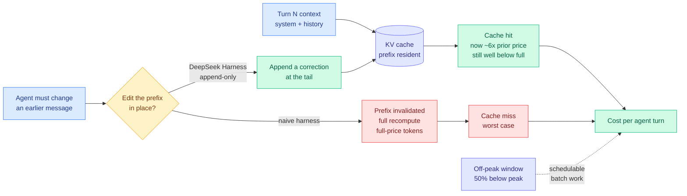
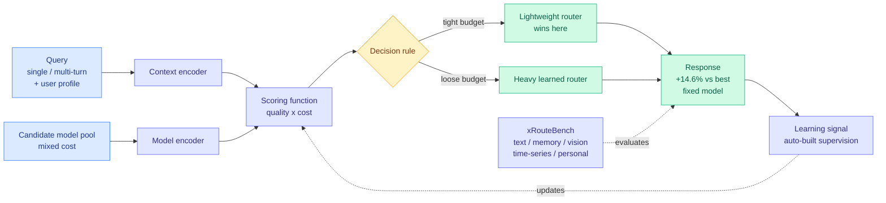
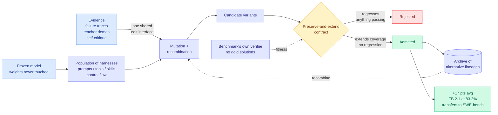
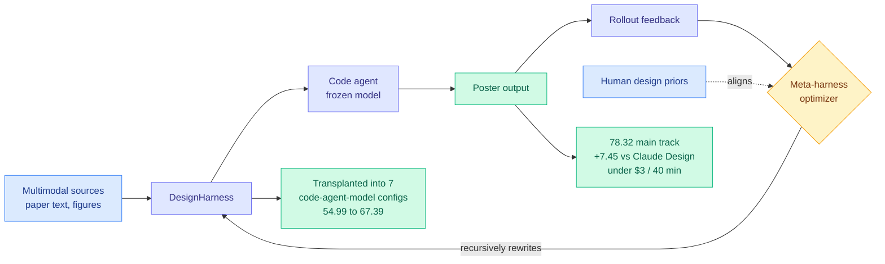
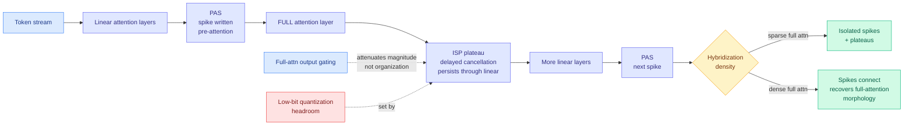
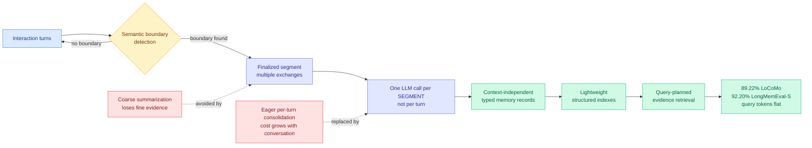
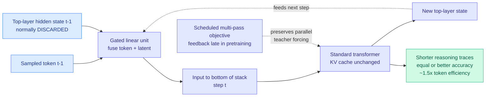
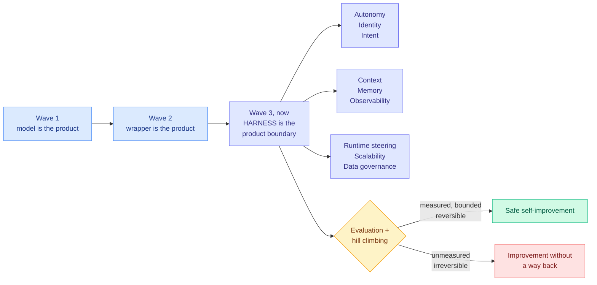
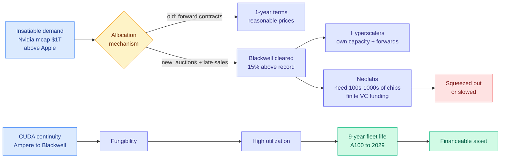

# cere-bro | 2026-08-14

> Yesterday the scaffold around the model got measured. Today it got optimized, and a provider started charging for the resource it consumes. DeepSeek open-sourced its agent harness under MIT and raised cache-hit prices roughly six-fold on the same day, two papers showed a frozen model gaining 17 points from harness evolution alone, and a study found the expensive model finishing the task cheaper than the cheap one. Every one of those is a cost-optimization result, and none of them is about a model.

🎯 Today's 5 for you

<ol>
<li>Read<strong>DeepSeek repriced the KV cache and shipped the mitigation the same day.</strong> Cache-hit tokens up roughly 6x, plus peak/off-peak at 50% below peak, while its new MIT-licensed harness is built so the prefix is <em>never</em> edited (corrections get appended). Prefix stability just became a line item, which is your KV-cache work meeting your cost work. <a href="#deepseek-harness-v01-and-the-price-of-a-cache-hit">Deep Dive</a> · <a href="https://the-decoder.com/deepseek-launches-an-improved-v4-pro-model-raises-api-prices-and-makes-its-agent-software-open-source/">source</a></li>
<li>Read<strong>LLMRouter gives routing one formalism and 16+ routers behind one interface.</strong> Thirty-plus routing papers in this wiki, almost all with their own formalism; this collapses them into five components and adds a cost-aware benchmark. The finding to keep: lightweight routers win as the budget tightens. <a href="https://arxiv.org/abs/2608.06867">arXiv 2608.06867</a> · <a href="../../ai-routing/2026-08-14-llmrouter-unified-routing-infrastructure.md">wiki</a></li>
<li>Read<strong>DarwinX: frozen model, evolved harness, +17 points, and it transfers.</strong> This is the exact isolation experiment yesterday's Looking Ahead asked for, one day later, and it lands on the harness/loop-engineering thread that dominates your saved reading. Terminal-Bench harness moves to SWE-bench unchanged. <a href="https://arxiv.org/abs/2608.07545">arXiv 2608.07545</a> · <a href="../../agentic-systems/2026-08-14-darwinx-harness-population-evolution.md">wiki</a></li>
<li>Skim<strong>Token price is not task cost, and the gap is now measured.</strong> AlphaSense found Opus 4.8 and GPT-5.6 Sol beating Kimi K3 and GLM-5.2 on both quality <em>and</em> total cost despite charging nearly twice per token. If you optimize a dollars-per-token objective, this says your objective is wrong. <a href="#token-price-is-not-task-cost">Deep Dive</a></li>
<li>Track<strong>Blackwell capacity cleared 15% above record in Nebius's first auction.</strong> Compute has gone from a contract market to a spot market and the incidence falls on the smallest trainers. Every efficiency result you care about just got more valuable by the same factor. <a href="../../hardware/compute-economics.md">new concept page</a></li>
</ol>

---

## TL;DR

- **DeepSeek**: open-sourced its agent harness under MIT, raised cache-hit token prices about 6x, added peak/off-peak rates 50% apart. The harness never edits history so the cache never invalidates.
- **DarwinX**: freeze the model, evolve a population of harnesses under a no-regression rule. About 17 points average gain, and the harness transfers to a new benchmark unchanged.
- **LLMRouter**: one formalism for LLM routing, 16+ routers in one library, cost-aware benchmark. Lightweight routers get more competitive as budgets tighten.
- **AlphaSense study**: pricier US models produced better answers at lower total cost than Kimi K3 and GLM-5.2, because smarter models finish in fewer tokens.
- **LycheeMemory V2**: consolidate agent memory per semantic segment instead of per turn. Cuts memory-building tokens 86% and still sets state of the art.
- **Compute prices**: Nebius auctioned Blackwell capacity 15% above its record price. Startups training their own models are the ones getting squeezed.

---

## Deep Dives

### DeepSeek Harness v0.1 and the price of a cache hit

> DeepSeek raised the price of a cache hit six-fold and, the same day, open-sourced a harness whose central engineering rule is never to lose one.

**Source:** The Decoder · @deepseek_ai · @eliebakouch teardown
**Links:** [The Decoder](https://the-decoder.com/deepseek-launches-an-improved-v4-pro-model-raises-api-prices-and-makes-its-agent-software-open-source/) · [announcement](https://x.com/deepseek_ai/status/2087887408440164663) · [teardown](https://x.com/eliebakouch/status/2087904176357437820) · [repo](https://github.com/deepseek-ai/deepseek-harness) · [Wiki summary](../../inference-efficiency/2026-08-14-deepseek-harness-kv-cache-economics.md)

**What is it about?**
Three DeepSeek announcements that only make sense read together. V4-Pro left preview with open weights under MIT and a reasoning-effort dial (low, high, max). DeepSeek Harness v0.1, its agent software, was open-sourced under MIT, built on a meta-framework called Cordis whose one idea is that everything is a plugin: models, tools, skills, sessions, sandboxes, filesystems, loops, orchestration, and the UI are all swappable. And API prices went up, with **cache-hit tokens repriced to roughly six times their previous cost**, alongside a new peak and off-peak split where off-peak runs 50% below peak from 16:00 UTC on 2026-08-16.

**What problem does it solve?**
A cache hit is what you pay when the prompt prefix of a request is already sitting in the KV cache (the store of previously computed attention keys and values that lets a model skip recomputing tokens it has already seen). Agent loops are the heaviest cache-hit consumers that exist, because every turn re-sends a conversation prefix that only grows. Repricing cache hits six-fold is therefore not a broad price rise. It is a targeted charge on agent loops, and The Decoder names the exact workload hit hardest: agents that repeatedly read the same files.

**What is the core novelty?**
The harness is the answer to the pricing. Reading the code, Hugging Face's Elie Bakouch found its organizing commitment is first-class KV-cache-aware design: **previously written history is never altered**. When something in the conversation has to change, the harness does not edit the earlier message. It appends a statement at the end describing the modification. Editing a prefix invalidates every cached token after the edit point and forces a full recompute; appending preserves the prefix and keeps the hit. This is a compiler-level insight about immutability applied to agent state, and Bakouch expects other harnesses to copy it.

**Key takeaways**
- Cache-hit tokens repriced to about **6x**, described as the single biggest increase in the transition. Off-peak rates land 50% below peak, making time of day a scheduling variable.
- The harness ships multiple default **modes**, which are really different harnesses: code mode with programmatic tool calling in TypeScript, bash-and-edit (the mode usually used in evals), and a standard read/write-tool mode.
- **At least ~20% of the harness's own commits came from Codex worktrees**, per Bakouch, who notes the real figure is probably higher because he counted only worktree and named-branch signals.
- V4-Pro's reception was split: Vals AI's leaderboard ranked it second overall while [some users were disappointed](https://www.theinformation.com/briefings/deepseek-releases-flagship-v4-pro-model-challenge-kimi-k3).

**Gaps in the study**
The 6x figure is The Decoder's reading of the pricing page, not a rate card in the raw sources, so the exact before-and-after per-million-token numbers need confirming before anyone builds a cost model on it. The off-peak discount also complicates the arithmetic in a way nobody has published: a 6x cache-hit rise partly offset by a 50% off-peak window nets out very differently for an interactive agent, which cannot shift its load, than for a batch pipeline, which can. And the append-only discipline has an unpriced quality cost. If corrections pile up at the tail instead of replacing stale content, the context grows monotonically and holds contradictory statements the model has to reconcile. That is a plausible accuracy tax paid to protect a cache hit, and nobody has measured it.

**Industrial implication**
Two things follow within a quarter. Prefix stability becomes a **documented property** of agent frameworks, the way streaming support or tool-call schemas are today, because buyers can now compute what it costs them. And peak/off-peak pricing spreads, because it lets a provider capture willingness to pay from interactive traffic while keeping utilization high on batch traffic, and agent workloads split unusually cleanly into those two classes. The second-order effect is a new routing dimension nobody models yet: not which model, but which hour.

→ [Full summary](../../inference-efficiency/2026-08-14-deepseek-harness-kv-cache-economics.md)

---

### LLMRouter: Unified Infrastructure for Developing, Evaluating, and Deploying LLM Routers

> Thirty-plus routing papers in this wiki since April, almost every one with its own formalism and its own codebase. This one argues the fragmentation is the bottleneck and does the unglamorous work of fixing it.

**Source:** HuggingFace Daily Papers
**Links:** [arXiv 2608.06867](https://arxiv.org/abs/2608.06867) · [HF](https://huggingface.co/papers/2608.06867) · [Wiki summary](../../ai-routing/2026-08-14-llmrouter-unified-routing-infrastructure.md)

**What is it about?**
Routing means sending each query to the cheapest model that can handle it, instead of sending everything to the most capable one. LLMRouter (UIUC, Maryland, NTU, Purdue, UIC) proposes a single formulation of routing as a **sequential decision process with five components**: context encoders, model encoders, scoring functions, decision rules, and learning signals. Single-turn, multi-turn, and personalized routing all turn out to be instances of it. On top of that it ships an automated pipeline for building routing supervision, a benchmark called **xRouteBench** spanning generic LLM, memory-augmented, vision, time-series, and personalized routing, and an open-source library with **more than 16 representative routers** behind one interface.

**What problem does it solve?**
Until now, comparing two routing papers meant comparing two incompatible formalisms evaluated on two different model pools with two different notions of cost. Evaluating a router honestly is expensive, because you have to run every candidate model on every query, score each response with task-specific metrics, and record cost. Most papers therefore precompute responses for one fixed pool and never revisit. That makes the literature non-cumulative, which is exactly the failure mode a field enters right before industry stops reading it.

**What is the core novelty?**
Two things. The five-component decomposition covers **multi-turn** routing, which prior benchmarks largely skipped and which is the case agentic workloads actually generate. And the evaluation is **joint on quality and inference cost** rather than quality alone, with supervision construction automated so adding a new candidate pool does not mean starting over.

**Key takeaways**
- **Learned routers beat the strongest fixed-model baseline by 14.6% relative.** The baseline matters: not "beats a random model" but "beats the single best model you could have picked in advance," which most routing papers avoid.
- **Lightweight routers get more competitive as the cost constraint tightens.** This is the opposite of the usual bigger-router-is-better intuition, and the mechanism is simple: when the budget is tight, the router's own cost eats the savings it produces.
- **User-conditioned routing consistently improves personalization.** Identity is a real routing feature, not decoration.
- 16+ routers under one interface is the part most likely to last, because it collapses the baseline-reimplementation work every company currently repeats before it can evaluate its own router.

**Gaps in the study**
The 14.6% gain is a single average across five very different domains, and routing gains are usually distributed extremely unevenly, large where the candidate pool is heterogeneous and near zero where one model dominates. The per-domain breakdown is where the interesting structure lives and the abstract does not give it. More seriously, the cost model appears to be per-token API pricing, which is exactly the metric the next Deep Dive says is misleading. A routing benchmark that scored cost per completed query rather than cost per token would rank routers differently, and possibly reverse the lightweight-router finding.

**Industrial implication**
This arrives two weeks after the market priced the same gap at roughly $10 billion. The [OpenRouter and Stripe story (08-11)](../../ai-industry/2026-08-11-openrouter-stripe-router-frenzy.md), where Stripe was reported in advanced talks to acquire OpenRouter for about $10B while Meta built an internal rival specifically to cut its own coding costs, is the deployment layer being valued. LLMRouter is the measurement layer for the same thing, and the gap between them is the story: **the market is buying routers faster than the field can compare them.** Expect the first wave of citations to be industrial rather than academic.

→ [Full summary](../../ai-routing/2026-08-14-llmrouter-unified-routing-infrastructure.md)

---

### Token price is not task cost

> Kimi K3 charges $15 per million output tokens. Opus 4.8 charges $25 and GPT-5.6 Sol charges $30. On a real document-analysis workload, the expensive two came out cheaper.

**Source:** The Information (AlphaSense study)
**Links:** [The Information](https://www.theinformation.com/articles/anthropic-models-can-cheaper-use-chinese-ones-study-finds) · [Wiki summary](../../ai-industry/2026-08-14-alphasense-token-price-vs-task-cost.md)

**What is it about?**
AlphaSense, which sells AI-powered search and market research over financial documents, benchmarked a range of models on its own corpus using Amazon, Google, Microsoft, and Cerebras as providers. It found that **GPT-5.6 Sol and Opus 4.8 generated better answers at lower cost** than Moonshot's Kimi K3 and Z.ai's GLM-5.2, the two leading Chinese open-weight options, despite charging roughly twice as much per output token.

**What problem does it solve?**
It attacks the default assumption under most cost-optimization work, including a good deal of the routing literature: that dollars per million tokens is a proxy for what a task costs. The mechanism breaking the proxy is straightforward. A more capable model finishes the task in fewer tokens and fewer retries, so unit price and total cost can point in opposite directions. Once you multiply price per token by tokens actually consumed, the ordering can flip.

**What is the core novelty?**
Not a technique, a measurement on a real workload with a real corpus. That is rarer than it should be, and it is the kind of evidence that changes procurement rather than benchmarks. Bret Taylor, OpenAI board chairman and Sierra co-founder, has been making the same argument in public; this puts numbers behind it.

**Key takeaways**
- Output token prices in the comparison: **Kimi K3 at $15/M, Opus 4.8 at $25/M, GPT-5.6 Sol at $30/M**. The cheaper-per-token models lost on total cost.
- **Artificial Analysis, ranking the same models by cost-to-accomplish-a-task, reaches the opposite conclusion** and puts Kimi K3 and GLM-5.2 significantly cheaper. So the two measurements genuinely disagree.
- The disagreement is about **task composition**, not arithmetic. Which result applies to you depends on whether your workload looks more like AlphaSense's financial-document analysis or Artificial Analysis's task mix.

**Gaps in the study**
AlphaSense sells a product built on these models, so the study is not disinterested, and the raw source does not give the full task list, the number of retries, or how failure was scored. Most importantly, the direct conflict with Artificial Analysis is not resolved anywhere: nobody has published a per-workload decomposition showing which task families favour which pricing regime, which is the artifact the field actually needs.

**Industrial implication**
This is a problem for every cost-optimization result stated in dollars per token, and that includes most of the routing corpus in this wiki. It also reframes the open-weight cost argument: the case for Kimi K3 or GLM-5.2 is not automatically economic, it depends on whether the task lets a weaker model finish. Practically, the metric to demand from a vendor is dollars per completed task, and the leaderboard to distrust is any that reports price per token.

→ [Full summary](../../ai-industry/2026-08-14-alphasense-token-price-vs-task-cost.md)

---

### DarwinX: Evolving Agent Harnesses Through Natural Selection

> Freeze the model. Evolve the scaffold around it. About 17 points of average gain, and a harness evolved on one benchmark transfers to another without a single edit.

**Source:** HuggingFace Daily Papers (Salesforce AI Research)
**Links:** [arXiv 2608.07545](https://arxiv.org/abs/2608.07545) · [HF](https://huggingface.co/papers/2608.07545) · [Wiki summary](../../agentic-systems/2026-08-14-darwinx-harness-population-evolution.md)

**What is it about?**
A harness is everything wrapped around a model's weights: the prompts, the tools, the skills, the control flow. Self-improving agents already edit their own harnesses, but almost all of them do it as a **single lineage**: run rollouts, reflect on failures, propose one edit, gate it, repeat. DarwinX argues that shape has two structural flaws. It is path-dependent, so an early edit that looked good locally can lock the agent onto a plateau. And it suffers cross-task interference, where an edit that helps one task family quietly regresses another and nobody notices because nobody was checking coverage. DarwinX replaces the lineage with a **population under selection, model frozen throughout**.

**What problem does it solve?**
It solves the generalization problem that has dogged self-improving harnesses. Prior systems could show a gain on the benchmark they were evolved against and could not show that the gain meant anything elsewhere. DarwinX's four benchmarks are chosen to progressively separate the evolution signal from the test, and the load-bearing result is a **Terminal-Bench 2.1 harness transferring unchanged to SWE-bench Verified**.

**What is the core novelty?**
Three mechanisms, and the first is the one to steal. A **preserve-and-extend contract** admits a variant only if it extends coverage without regressing anything already solved, which converts hill-climbing into ratcheting. An **archive** keeps losing lineages alive so complementary specialists can be recombined later rather than discarded. And failure-derived, teacher-derived, and self-derived evidence all flow through **one shared edit interface**, so the system needs one improvement mechanism instead of three. Fitness comes from each benchmark's own verifier, so no gold solutions and no human picks winners.

**Key takeaways**
- **About +17 points average across four benchmarks from a single evolution loop**, with the model frozen. Terminal-Bench 2.1 rises **+7.7 to 83.2%** on a matched base and to **84.7%** on a stronger one.
- **TerminalWorld's held-out split reaches 68.3%**, ahead of every off-the-shelf agent tested. **WebArena-Infinity real-task pass@1 goes 43.5% to 93.0%**, described as audit-clean.
- **The harness transfers across task, verifier, and base model.** This is the claim that separates general agent competence from benchmark-specific patches.
- The framing line: a frozen model need not be a fixed agent. Harness selection converts evaluation compute into durable capability.

**Gaps in the study**
No compute cost anywhere, which is a real problem for a paper whose thesis is a conversion rate. How many verifier runs per admitted variant, how large the population, how many dollars for the 17 points: without those, nobody can tell whether harness evolution is cheaper or more expensive than fine-tuning for the same gain, and that is the only comparison that decides where a team spends. The preserve-and-extend contract is also only as good as the coverage set it checks, so a variant that regresses something outside the benchmark suite passes cleanly, and silent narrowing along unmeasured axes is the characteristic failure of a ratcheting search. Finally, "one loop adds about 17 points" leaves open whether loops compound or saturate immediately, which is the difference between a technique and a trend.

**Industrial implication**
Every team currently choosing between fine-tuning a smaller model and paying for a bigger one now has a third option with a frontier-tier data point behind it: keep the model, evolve the scaffold, pay in verifier runs instead of gradient steps. The economics favour this wherever a cheap automated verifier exists, which is exactly the coding, terminal, and web-navigation domains where agent spend concentrates. Two consequences follow. **Harness archives become a shipped artifact**, and the archive rather than the single best harness is the asset, because the archive is what permits recombination. And agent leaderboards get harder to read, because a reported score becomes a score for a co-evolved model-and-harness pair with the base model's contribution unrecoverable from the number.

→ [Full summary](../../agentic-systems/2026-08-14-darwinx-harness-population-evolution.md)

---

### AutoDesign: Meta-Harness Optimization for Long-Horizon Agentic Design

> The harness cluster has been missing a price tag for a week. Here it is: 253 tool calls, 11 editing turns, 40 minutes, under $3.

**Source:** HuggingFace Daily Papers
**Links:** [arXiv 2608.13560](https://arxiv.org/abs/2608.13560) · [HF](https://huggingface.co/papers/2608.13560) · [Wiki summary](../../agentic-systems/2026-08-14-autodesign-meta-harness-optimization.md)

**What is it about?**
The same idea as DarwinX one level up. Instead of evolving a population, a **meta-harness optimizer** reads rollout feedback and guides a code agent to recursively rewrite the harness it runs inside, with the optimizer explicitly aligned to human design priors rather than to a raw score. The task is academic paper-to-poster generation, evaluated on a new benchmark, PosterBench (100 papers across five disciplines, plus a 10-paper mini split for controlled comparison).

**What problem does it solve?**
Existing harnesses are static: written once, then left alone while the model underneath changes. AutoDesign targets long-horizon design work, where the output is judged on taste rather than a unit test, which is the regime where you would most expect a fixed harness to be fine and model quality to dominate.

**What is the core novelty?**
The transferability of what it learns. The learned **DesignHarness** dropped into **seven different code-agent-model configurations** lifts the average PosterBench score from **54.99 to 67.39**, consistently across all seven. That says the artifact being learned is a reusable structure, not a model-specific prompt trick.

**Key takeaways**
- **78.32 on the PosterBench main track, 7.45 points above Claude Design**, a closed commercial system. Beating a shipped product is a stronger comparison than beating an academic baseline.
- **The learned harness lifts seven other agent-model configurations** by 12.4 points on average.
- **Under $3 for 253 tool calls and 11 editing turns in 40 minutes**, fully autonomous, reaching average conference-poster quality in human evaluation and winning a system-blind preference study.
- It optimizes against a **soft** verifier (rubric plus human preference), where DarwinX optimizes against hard verifiers. Neither tests the other's regime.

**Gaps in the study**
Poster generation is narrow and unusually forgiving: visual, subjective, with no correctness criterion a bad output can violate catastrophically. The transfer result is across model configurations, not across tasks, which is the weaker of the two transfer claims and clearly weaker than DarwinX's cross-benchmark result. PosterBench is introduced by the authors who top it, mitigated but not removed by the blind human study, whose size and rater pool are unstated. And there is no ablation separating the meta-optimizer's contribution from the code agent's raw capability.

**Industrial implication**
The interesting artifact is not the poster generator, it is the shape of the deliverable: a **learned harness as a distributable file** that improves any agent it attaches to. That behaves like a model adapter, portable and composable and cheap to ship, without touching weights, so it sidesteps licensing, hosting, and inference-cost questions entirely. At $3 per rollout, running the optimizer is cheaper than an hour of a designer's time, which is the comparison a buyer will make.

→ [Full summary](../../agentic-systems/2026-08-14-autodesign-meta-harness-optimization.md)

---

### Massive Activations in Hybrid Linear Attention LLMs

> The enormous activation values that make low-bit quantization hard turn out to appear at predictable layer positions in hybrid models: immediately before every full-attention layer.

**Source:** HuggingFace Daily Papers
**Links:** [arXiv 2608.12149](https://arxiv.org/abs/2608.12149) · [HF](https://huggingface.co/papers/2608.12149) · [code](https://github.com/StartluxLabs/Massive-Activations-HLA) · [Wiki summary](../../inference-efficiency/2026-08-14-massive-activations-hybrid-linear-attention.md)

**What is it about?**
Hybrid linear attention (HLA) models interleave cheap linear-attention layers with a few expensive full-attention layers, which is how most efficient long-context architectures are now built. **Massive activations** are the handful of enormous values in a hidden state that dominate its dynamic range, and they are the reason low-bit activation quantization is hard: a few outliers set the scale the whole tensor must fit into. This is the first systematic study of what massive activations look like inside hybrids, and the answer is that they are organized by architecture, not scattered.

**What problem does it solve?**
Quantization work on hybrids has been treating outlier handling as a global problem, because nobody knew where the outliers lived. If the outlier positions are predictable from the layer schedule, a global precision decision becomes a per-layer one, which is strictly cheaper.

**What is the core novelty?**
Two named morphologies plus a mechanism. **Pre-attention spikes (PAS)**: massive activations reliably spike immediately before each full-attention layer. **Inter-spike plateaus (ISP)**: those elevated values can persist through the intervening linear layers rather than decaying. As full attention gets denser, successive spikes connect through plateaus until the picture converges on the stable morphology already known from full-attention models. The proposed mechanism is a **write-sink-cancel lifecycle governed by cancellation timing**: a PAS is written, absorbed, and cancelled quickly and locally, while an ISP is the same process with delayed cancellation.

**Key takeaways**
- The organization **recurs across five linear-attention architectures, six hybridization configurations, five data domains, and open models from 1.2B to 397B total parameters.** That breadth is what makes it a finding rather than an observation about one model.
- **Controlled pretraining of GDN-based hybrids up to 1.3B shows both morphologies emerge early** in training.
- **Response to gating is asymmetric**: full-attention output gating strongly attenuates absolute magnitude without changing the layerwise organization, while removing GDN gates amplifies only modestly. So gating changes how big the spikes are, not where they are.
- At the full-attention limit the account recovers the classic full-attention picture, which is the consistency check the paper needed.

**Gaps in the study**
The study localizes the outliers and stops there. No mixed-precision experiment assigns higher precision only to PAS-adjacent layers and reports the accuracy-per-bit curve against uniform assignment, which is the obvious payoff and is left on the table. Controlled pretraining caps at 1.3B while the observational sweep runs to 397B, so the causal claims about gating are established only at the small end. And the write-sink-cancel account is a lifecycle story supported by systematic-outlier analysis rather than an intervention, so it is a good hypothesis rather than a demonstrated mechanism.

**Industrial implication**
This is directly actionable for anyone quantizing a hybrid model, which increasingly means anyone serving long context. If PAS positions are known from the layer schedule, quantization tooling can assign per-layer bit budgets statically, with no calibration pass needed to discover where the outliers are. Expect this to show up in llama.cpp-style quantization heuristics before it shows up in a paper, because the change is a config table rather than an algorithm.

→ [Full summary](../../inference-efficiency/2026-08-14-massive-activations-hybrid-linear-attention.md)

---

### LycheeMemory V2: Efficient Long-Term Memory via Semantic Segment-Level Consolidation

> Same information retained, same retrieval cost, 86% fewer tokens spent building the memory. The only thing that changed was when the consolidation fires.

**Source:** HuggingFace Daily Papers
**Links:** [arXiv 2608.12990](https://arxiv.org/abs/2608.12990) · [HF](https://huggingface.co/papers/2608.12990) · [Wiki summary](../../inference-efficiency/2026-08-14-lycheememory-v2-segment-consolidation.md)

**What is it about?**
Long-horizon agents have to remember things across sessions. Most memory systems use **eager consolidation**: after every interaction turn, call an LLM to extract, summarize, or update stored memories. Clean design, expensive practice, because construction cost grows with conversation length and every turn pays a model call whether or not it carried anything worth keeping. LycheeMemory V2 changes the **granularity** of consolidation rather than the amount, batching multiple exchanges into segments and encoding each finalized segment once.

**What problem does it solve?**
The two standard escapes from eager consolidation both fail. Coarse summarization is cheaper but discards fine-grained contextual evidence. Bigger retrieval contexts or multi-hop reasoning at query time just move the bill from construction to serving. This gets the construction saving without either.

**What is the core novelty?**
**Semantic boundary detection** rather than fixed-window batching. Any batching scheme gets the cost reduction; drawing the boundary where an event actually ends is what preserves the coherent event-level and temporal evidence that the benchmarks test. Segments are then encoded into context-independent typed records organized with lightweight structured indexes for query-planned retrieval.

**Key takeaways**
- **86.0% fewer construction tokens on LoCoMo and 75.9% fewer on LongMemEval-S** versus A-Mem, close to an order of magnitude off the dominant recurring cost in long-horizon agents.
- **State of the art anyway**: 89.22% on LoCoMo, 92.20% on LongMemEval-S, using GPT-4.1-Mini.
- **Query-time token usage does not increase.** This is what separates it from coarse summarization, which typically saves at construction and pays at retrieval.
- The stated claim is the durable part: the accuracy-cost tradeoff in agent memory depends not only on what is retained but on **the granularity at which it is consolidated**.

**Gaps in the study**
All headline numbers use GPT-4.1-Mini, and semantic boundary detection is the load-bearing component, so boundary quality plausibly degrades with a weaker detector. That matters because an 86% construction saving would be worth most in fully local deployment, which is exactly where the detector is weakest. No sensitivity analysis on segment size is reported, so the split between batching (which any fixed-window scheme gets) and semantic boundaries (the actual contribution) is unmeasured. And both benchmarks are conversational; whether boundaries are as detectable in tool-call and code-edit traces, where agent memory is actually used, is untested.

**Industrial implication**
An 86% cut in memory-construction tokens is worth more this week than last, because eager per-turn consolidation is exactly the pattern DeepSeek's cache-hit repricing penalizes: many small repeated calls over largely overlapping context. Anyone running a memory layer against a provider that charges for cache hits should treat consolidation frequency as a first-order cost decision rather than an implementation detail.

→ [Full summary](../../inference-efficiency/2026-08-14-lycheememory-v2-segment-consolidation.md)

---

### Full-bandwidth transformer

> At every decoding step a model computes a rich hidden state, samples one token from it, and throws the hidden state away. Feeding it back instead is worth roughly 1.5x the training tokens.

**Source:** HuggingFace Daily Papers (Johns Hopkins, Princeton, Microsoft AI Frontiers)
**Links:** [arXiv 2608.08888](https://arxiv.org/abs/2608.08888) · [HF](https://huggingface.co/papers/2608.08888) · [Wiki summary](../../inference-efficiency/2026-08-14-full-bandwidth-transformer.md)

**What is it about?**
An autoregressive transformer computes along two axes: horizontally across generated tokens, and vertically through depth. Dense attention gives each token wide horizontal access to the past. The **vertical** channel between decoding steps is one token wide: the model produces a rich top-layer hidden state, samples a single token from it, discards the state, and feeds only that symbol back to the bottom of the stack. Everything computed but not verbalized is thrown away or frozen at the depth where it was produced.

**What problem does it solve?**
Non-verbalized computation currently has nowhere to live between steps, so a model has to either re-derive it or spell it out as reasoning tokens. That is a plausible reason chain-of-thought is as long as it is, and it means part of what looks like reasoning is really an architectural workaround being paid for in tokens.

**What is the core novelty?**
Two pieces. The mechanism: **fuse the previous top-layer hidden state with the sampled token embedding through a gated linear unit and feed that back** as the next input, so latent computation re-enters with a fresh depth budget. The transformer, the KV cache, and the language-modeling objective are all unchanged, which is what makes it deployable. And the training trick: latent feedback breaks parallel teacher forcing, since step *t*'s input depends on step *t-1*'s output, so they use a **scheduled multi-pass objective** that introduces feedback late in pretraining mixed with a small fraction of deeper feedback passes for stability.

**Key takeaways**
- At **1B parameters and 400B tokens**, latent feedback improves validation loss, 5-shot evaluation, math and coding generation, and instruction-tuned performance.
- Full-bandwidth models **match or approach standard transformers trained on roughly 1.5x more tokens**, at negligible per-token decoding overhead.
- They **produce shorter reasoning traces at equal or better accuracy**, which is a test-time compute result hiding inside an architecture paper.
- Standard KV cache is preserved, so nothing in the serving stack has to change.

**Gaps in the study**
One scale, 1B parameters, and the vertical-bandwidth argument is precisely the kind that could grow or shrink with depth, since a deeper model has more to fuse and also more capacity to re-derive. The scheduled multi-pass objective is described as needed for stability, which suggests naive training diverges and raises the question of how sensitive results are to the schedule. And no comparison is run against looped transformers, which buy extra effective depth by re-running layers within a step and are the natural baseline for any claim about reusing computation.

**Industrial implication**
Shorter reasoning traces at equal accuracy is a direct serving-cost reduction on the largest line item in reasoning-model inference, and it needs no change to the KV cache or the inference stack. That combination, architectural change confined to pretraining with the serving path untouched, is the profile that actually gets adopted. The catch is that it has to be baked in during pretraining, so it is available to whoever trains next, not to anyone serving today.

→ [Full summary](../../inference-efficiency/2026-08-14-full-bandwidth-transformer.md)

---

### Ken Huang: Harness Engineering as a design-pattern language

> The research thread has been optimizing the harness for capability and cost. This is the first serious attempt to treat it as a control surface.

**Source:** Agentic AI (Substack), via starred Gmail
**Links:** [Essay](https://kenhuangus.substack.com/p/harness-engineering-design-patterns) · [Wiki summary](../../agentic-systems/2026-08-14-ken-huang-harness-engineering-patterns.md)

**What is it about?**
An essay announcing a book, whose argument is a periodization: **the first wave of generative AI treated the model as the product, the second treated the application wrapper as the product, and the third, already here, treats the harness as the product boundary.** Everything the field calls a separate specialism (prompt, context, memory, loop, graph, tool, and evaluation engineering) is in his reading seven faces of one discipline rather than seven islands.

**What problem does it solve?**
Long-horizon agents fail differently from chat sessions. They accumulate context, carry memory across tasks, delegate, retry, adapt, and can become overconfident after partial success. They also open attack surfaces the model itself does not have: tool access, identity delegation, prompt injection, memory poisoning, unsafe autonomy, weak observability. There is currently no complete taxonomy for designing against that, which is what [the runtime-contract paper (08-13)](../../agentic-systems/2026-08-13-agent-safety-runtime-contract.md) demonstrated quantitatively when its title-level audit of all 28,560 NeurIPS, ICML, and ICLR papers from 2023 to 2025 found the field publishing 8x to 12x more on training-time safety than on deployment-time safety.

**What is the core novelty?**
**Ten pattern families**: autonomy (what the agent may decide alone versus what escalates), identity (scoped auditable identity for agents, tasks, tools, delegated actions), intent (goals as checkable contracts before authorization), context (separating trusted from untrusted information before it shapes behaviour), memory (recall as a governed, validated, reversible store), observability, runtime steering (interrupt, redirect, pause, stop safely), scalability (coordination controls at fleet scale), data governance (classification, lineage, privacy, residency, egress), and evaluation and hill climbing. Three of those, **identity, data governance, and runtime steering**, have no counterpart at all in the research framing of harnesses, which is the informative asymmetry.

**Key takeaways**
- The reframe of the buying question: not "how do we prompt the agent" but **"what harness must exist before this agent deserves real autonomy?"**
- **"Hill climbing" is used in its optimization sense.** Agent systems now improve themselves by testing nearby moves and keeping what scores better. His claim: the danger is not improvement but improvement without measurement, without boundaries, and without a way to reverse a harmful change.
- The harness is the **durable unit of design**: tools, frameworks, model names, and benchmarks churn, and the need to mediate autonomy, identity, intent, context, memory, observability, steering, scalability, governance, and evaluation does not.
- He deliberately writes patterns rather than a threat catalogue, on the grounds that a catalogue tells teams what to fear while a pattern tells them where to put the autonomy gate.

**Gaps in the study**
It carries no numbers. The [harness engineering concept page](../../agentic-systems/agent-harness-engineering.md) records cost-per-success swinging 5x to 30x across harnesses on a fixed model and accuracy moving roughly 2x at the small-model tier; a pattern language with no cost or risk-reduction figure attached to individual patterns cannot tell a team which of the ten families to build first, and for a team with one quarter of budget that is the only question. The pattern details are also behind the book, so what is publicly visible is a taxonomy, and taxonomies are cheap. Nothing addresses composition order or dependencies between families.

**Industrial implication**
If the harness is the product boundary, procurement stops evaluating model benchmark scores and starts evaluating harness properties: what escalates, what is auditable, what can be interrupted, what is reversible. That is a far more familiar purchase for an enterprise security organization than an eval score, which is why this framing will spread through enterprises faster than through labs. Expect harness-property checklists in vendor RFPs within two quarters, and expect them to look like these ten families, because no competing taxonomy exists at this level of completeness.

→ [Full summary](../../agentic-systems/2026-08-14-ken-huang-harness-engineering-patterns.md)

---

### The compute market turned into a spot market

> Nebius held its first capacity auction and cleared Blackwell chips 15% above the highest price it had ever charged. The people who cannot pay it are the ones training their own models.

**Source:** The Information · @JensenHuang
**Links:** [Nebius and CoreWeave](https://www.theinformation.com/articles/nebius-coreweave-cashing-soaring-ai-compute-prices) · [neolabs squeeze](https://www.theinformation.com/articles/ai-compute-crunch-hitting-neolabs-especially-hard) · [Huang on fleet durability](https://x.com/JensenHuang/status/2087755674650603534) · [Wiki concept page](../../hardware/compute-economics.md)

**What is it about?**
Three data points from the same week that line up unusually cleanly. Nebius CEO Arkady Volozh disclosed on the earnings call that Nebius held its **first auction of computing capacity in Q2**, clearing Blackwell-generation capacity at **15% above the highest price it had ever charged**, and said Nebius is deliberately selling capacity closer to when customers need it in order to capture the premium. Evan Morikawa of robotics-model startup Generalist talked to about **17 different AI cloud providers** hunting chips and reported that contract terms which were reasonable a year ago have gone. And Nvidia's market capitalization moved **$1 trillion above Apple's** in two weeks.

**What problem does it solve?**
Nothing. It is a constraint, and it is the denominator under every efficiency result in this wiki. Worth naming because it changes what those results are worth.

**What is the core novelty?**
The mechanism change, not the price level. A supplier moving from forward contracts to auctions plus late sales is converting a contract business into a spot business, which is what suppliers do when demand exceeds supply persistently rather than temporarily. Morikawa's line, "it's like VC currency right now to know the current price of GPUs," is a market-microstructure observation: when the price of an input becomes private information, the input is scarce.

**Key takeaways**
- **Blackwell capacity cleared 15% above Nebius's record price** in its first auction, with capacity deliberately held back to sell closer to need.
- **The incidence is not uniform.** Hyperscalers hold forward contracts and their own capacity. The squeeze lands on **neolabs**: startups training their own models, needing hundreds to thousands of chips against finite venture funding. So a rising spot price does not slow frontier training, it slows *independent* frontier training, which is a concentration effect rather than a slowdown.
- **The counterweight is asset life.** Responding to CoreWeave committing to A100s through 2029, Huang argued CUDA continuity across Ampere, Hopper, and Blackwell produces versatility, which produces fungibility, which drives utilization, which extends durability, which makes the fleet **financeable**. That chain is what lets a CoreWeave or Nebius build out on debt rather than equity, and a nine-year fleet life is a statement about a depreciation denominator, not nostalgia.
- **The two forces pull opposite ways for a buyer.** A nine-year-durable A100 is what makes renting rational for a small trainer; a 15%-above-record auction clear is what makes it unaffordable.

**Gaps in the study**
All three data points concern **training** capacity. Inference is the larger and stickier market and a spot regime there would reprice every deployed product, and nobody has reported whether the premium has reached it. Nobody has priced A100-hours against Blackwell-hours per unit of useful training work either, which is the calculation that would tell a neolab whether older generations are a real escape hatch or a trap. And the CUDA-continuity argument has never been tested against a discontinuity large enough to strand a generation.

**Industrial implication**
If auction pricing persists two more quarters, the observable outcomes for neolabs are: move to older generations, move to non-Nvidia silicon, stop pre-training and do post-training only, or get acquired. All four are checkable. The efficiency implication is more immediate and cuts the other way: when capacity clears 15% above record, every quantization, KV-cache, and distillation result gets more valuable by the same factor without a single new experiment.

→ [Full concept page](../../hardware/compute-economics.md)

---

## Industry Pulse

- **DeepSeek** moved V4-Pro out of preview with open MIT weights, a reasoning-effort dial (low/high/max) and native OpenAI Responses API support ([The Decoder](https://the-decoder.com/deepseek-launches-an-improved-v4-pro-model-raises-api-prices-and-makes-its-agent-software-open-source/)).
- **DeepSeek Harness v0.1** is open source under MIT, plugin-everything via the Cordis meta-framework, with append-only history to protect the KV cache ([repo](https://github.com/deepseek-ai/deepseek-harness)).
- **DeepSeek API prices rise**, cache hits up roughly 6x, plus peak and off-peak rates 50% apart from 2026-08-16 ([The Decoder](https://the-decoder.com/deepseek-launches-an-improved-v4-pro-model-raises-api-prices-and-makes-its-agent-software-open-source/)).
- **V4-Pro reception split**: Vals AI ranked it second overall while some users were disappointed ([The Information](https://www.theinformation.com/briefings/deepseek-releases-flagship-v4-pro-model-challenge-kimi-k3)).
- **Google shipped Gemini 3.7 Flash** three weeks after 3.6 Flash, claiming it beats Claude Sonnet 5 and GPT-5.6 Terra at half the price ([The Decoder](https://the-decoder.com/gemini-3-7-flash-lands-with-coding-gains-and-undercuts-its-three-week-old-predecessors-price-by-50/)).
- **Cognition put Gemini 3.7 Flash in Devin**, scoring 56.3 on its FrontierCode 1.1 benchmark against Sonnet 5's 56.2 at under half the cost, with a 50% discount through 2026-08-27 ([Devin blog](https://devin.ai/blog/gemini-37-flash)).
- **Cursor cloud agents now start 3x faster** via prebuilt development environments it calls builds, prepared continuously in the background at no extra cost; Faire, Headway and Descript report start times dropping from minutes to seconds ([Cursor](https://cursor.com/blog/builds)).
- **Anthropic brought Claude Cowork into its Chrome extension** side panel, adding skills and plugins to the browser ([The Decoder](https://the-decoder.com/anthropic-brings-claude-cowork-to-its-chrome-extension-adding-skills-and-plugins-to-the-browser/)).
- **Fable 5 accounts for only six percent of Anthropic tokens sold**, per Ramp data, suggesting corporate willingness to pay for the frontier tier has hit a ceiling ([The Decoder](https://the-decoder.com/fable-5s-slow-adoption-suggests-corporate-willingness-to-pay-for-frontier-ai-has-hit-a-ceiling/)).
- **Ling 3.0 Flash** is now the strongest open model in its size class ([The Decoder](https://the-decoder.com/ling-3-0-flash-is-the-smartest-open-model-at-its-size/)).
- **xAI published the weights of the X recommendation algorithm**, and Cognition indexed the repo on DeepWiki for browsing ([DeepWiki](https://deepwiki.com/xai-org/x-algorithm)).
- **IAPS fellow Severin Field interviewed 25 researchers** from OpenAI, Anthropic, Google DeepMind, Meta and US universities on recursive self-improvement, and reports several of their named milestones have already been hit ([The Decoder](https://the-decoder.com/top-ai-lab-researchers-warned-about-automated-ai-research-and-several-of-their-predicted-milestones-have-already-fallen/)).
- **Hugging Face published what it learned reproducing 2,200 ICML papers**, the largest open reproduction effort to date ([HF blog](https://huggingface.co/blog/icml-2026-open-reproductions)).
- **LG is building a next-generation bipedal humanoid on NVIDIA Isaac GR00T**, announced alongside a chairman-level visit expanding the two companies' AI infrastructure and robotics work ([PRNewswire](https://nvda.ws/4czcZnh)).
- **NVIDIA is pushing an "AI factories, tokens as commodity" framing** with a published Tokenomics guide on converting compute into revenue ([NVIDIA](https://nvda.ws/4zltqh6)), and Runway brought Gen-4.5 up on the Vera Rubin platform in one day ([Runway](https://nvda.ws/4hwKjip)).
- **Practitioner note:** Tom Yeh released five by-hand worksheets on context-window compaction, including the observation that a compacted summary at one sixth the tokens still costs nearly half the bill ([@ProfTomYeh](https://x.com/ProfTomYeh/status/2087936084487377047)).

**Funding, valuations, and compute deals**

- **Robinhood's closed-end fund RVII went public on the NYSE after raising $225.5 million** to invest in early-stage Y Combinator startups, its second startup-backing fund this year ([The Information](https://www.theinformation.com/articles/y-combinator-startups-get-new-backer-robinhood)).
- **Workday stock jumped 18%** on a Reuters report that Silver Lake is in takeover talks ([The Information](https://www.theinformation.com/briefings/workday-stock-jumps-18-report-silver-lake-takeover-talks)).
- **Nebius cleared Blackwell capacity 15% above its record price** in its first-ever compute auction, and is timing sales closer to customer need to capture the premium ([The Information](https://www.theinformation.com/articles/nebius-coreweave-cashing-soaring-ai-compute-prices)).
- **Nvidia's market capitalization moved $1 trillion above Apple's** over roughly two weeks, an 18% rise against a ~10% fall ([The Information](https://www.theinformation.com/articles/nebius-coreweave-cashing-soaring-ai-compute-prices)).
- **Mercor offered up to $300,000 for a single acquired startup's internal archives**, and Warmly fielded four such approaches in days, all seeking Slack messages, GitHub and Asana content, Drive documents, and years of meeting transcripts ([The Information](https://www.theinformation.com/articles/startups-find-old-slack-threads-tickets-suddenly-high-demand)).
- **OpenAI replaced chief revenue officer Denise Dresser after eight months with Wiz president Dali Rajic**, from the cybersecurity company Google bought for $32 billion ([The Information](https://www.theinformation.com/articles/openais-latest-hire-burnishes-cybersecurity-credentials)).
- **Anthropic's head of national security policy Tarun Chhabra is moving to an advisory role** on geopolitics and national security ([The Information](https://www.theinformation.com/briefings/anthropic-policy-leader-biden-alum-transitions-role)).

---

## Global View

**The harness stopped being written and started being optimized, and a provider immediately began charging for the resource it consumes.** Yesterday's digest recorded three measurements of harness value: cost-per-success swinging 5x to 30x across harnesses on a fixed model (omarsar0, arXiv 2608.01347), accuracy going 0.49 to 0.91 when a strong builder model writes an inference-time harness for a weak target with weights frozen ([AI4AI](../../inference-efficiency/2026-08-13-ai4ai-test-time-harness-transfer.md)), and a Terminal-Bench 3.0 leaderboard where every row is a model-harness pair with tokens and dollars but no model appears under two harnesses. Today [DarwinX](../../agentic-systems/2026-08-14-darwinx-harness-population-evolution.md) runs that missing isolation and gets +7.7 points on a matched base from scaffold changes alone, [AutoDesign](../../agentic-systems/2026-08-14-autodesign-meta-harness-optimization.md) supplies the price (under $3 per rollout) and shows one learned harness lifting seven different agent-model configurations, DeepSeek open-sources its own harness under MIT while repricing cache hits roughly six-fold, and Ken Huang publishes the governance taxonomy for the same object. Five sources, one week, and the read across them is commercial rather than academic: **give the harness away because it is becoming standard infrastructure, and charge for the resource a badly built one wastes.**

**Cost-per-token is being retired as a metric from four directions at once, and nobody has published the replacement.** The [AlphaSense study](../../ai-industry/2026-08-14-alphasense-token-price-vs-task-cost.md) found Opus 4.8 and GPT-5.6 Sol beating Kimi K3 and GLM-5.2 on quality *and* total cost at nearly twice the per-token price, because a stronger model finishes in fewer tokens; Artificial Analysis, measuring cost-to-accomplish on a different task mix, reaches the opposite conclusion, so the disagreement is real. [LLMRouter](../../ai-routing/2026-08-14-llmrouter-unified-routing-infrastructure.md) builds the field's first cost-aware routing benchmark on what appears to be per-token pricing, which means its headline finding that lightweight routers win under tight budgets rests on the metric AlphaSense just undermined. Yesterday's Terminal-Bench 3.0 table already showed that ranking by cost-per-point reorders the leaderboard, moving Grok 4.6 from fourth to second and dropping Fable 5 from third to seventh. And the demand side agrees: Fable 5 at six percent of Anthropic tokens sold and Gemini 3.7 Flash matching Sonnet 5 on Devin's FrontierCode 1.1 at under half the cost are the market saying the same thing in purchase orders. **Four independent sources point at dollars-per-completed-task, and not one leaderboard reports it as the primary number.**

**"Schedule beats operator" now has its third subfield, and industry is scheduling too.** Yesterday's Looking Ahead predicted within 60 days a third efficiency result would show that changing *when* or *in what order* an operation fires beats improving the operation itself, after two landed in two days: [ICBQ (08-12)](../../inference-efficiency/2026-08-12-icbq-interleaved-cross-block-quantization.md) found interleaving quantization across blocks mattered more than the per-block quantizer, and ReOrder-OPD (08-13) found ordering training prompts by reliability beat changing the distillation operator. [LycheeMemory V2](../../inference-efficiency/2026-08-14-lycheememory-v2-segment-consolidation.md) is the third, one day later: same information retained, same retrieval cost, **86% fewer construction tokens purely from consolidating per semantic segment instead of per turn**. The prediction resolves in favour of the pattern, and the industry mirror is unmistakable, because DeepSeek's new peak and off-peak rates 50% apart and Nebius holding capacity back to sell closer to customer need are both the same lever applied to money: **when you run is now as consequential as how you run, and neither the routing formalism published today nor any cost model in this wiki has a time term in it.**

---

## Looking Ahead

- **Append-only history becomes a documented harness property within 60 days, or DeepSeek's cache repricing was a one-off.** The signal: any second agent framework or provider publishing an explicit prefix-stability guarantee, or a second provider repricing cache hits. Elie Bakouch's expectation that other harnesses will copy the convention is cheap enough to implement that it should be visible fast. If no second instance appears by 2026-10-13, prefix stability stays a DeepSeek-specific pricing artifact rather than a design norm, and the "harness as cost lever" claim loses its clearest industrial evidence.
- **Someone puts harness optimization and fine-tuning on one cost axis within 90 days, or the harness cluster stays an existence proof.** Yesterday this prediction had one paper with no cost figure; today it has three, one of which ([AutoDesign](../../agentic-systems/2026-08-14-autodesign-meta-harness-optimization.md)) publishes $3 per rollout while [DarwinX](../../agentic-systems/2026-08-14-darwinx-harness-population-evolution.md) publishes no evolution budget at all. The signal: any paper or engineering post reporting **dollars per point of gain for harness search and for fine-tuning on the same task family**. If harness search is cheaper at the frontier tier, every on-policy distillation result of the last four months is optimizing the more expensive of two options.
- **A major leaderboard makes dollars-per-completed-task its primary metric within 60 days, or the cost literature stays incomparable.** Four sources now point the same way. The signal: xRouteBench, Artificial Analysis, or Terminal-Bench publishing cost-per-solved-task as the headline column rather than as a side field, or any paper resolving the AlphaSense versus Artificial Analysis disagreement with a per-workload decomposition. If nobody does it by 2026-10-13, the field will keep publishing cost results that cannot be compared across papers.
- **A mixed-precision hybrid targeting pre-attention-spike layers appears within 90 days, or the massive-activation result stays descriptive.** [Today's paper](../../inference-efficiency/2026-08-14-massive-activations-hybrid-linear-attention.md) shows massive activations spike immediately before every full-attention layer across five architectures and six hybridization configurations, and then does not exploit it. The signal: any quantization result assigning higher precision **only** to PAS-adjacent layers and reporting accuracy per bit against uniform assignment. If the curve beats uniform, hybrid quantization becomes a static config decision requiring no calibration pass, which is the cheapest kind of win there is.
- **Kurate's tournament is still not running, for the fourth consecutive week.** All 40 entries across cs.AI and cs.LG sit at the 1200 TrueSkill baseline with 0% win rate, so this week's ordering carries no quality signal and the tier line is the only usable field. Three entries flagged for efficiency interest and absent from HuggingFace are worth tracking on topic alone: **[REOPD](http://arxiv.org/abs/2608.11698)** (reliability-adaptive reward extrapolation for on-policy distillation), which is the reliability measurement [Privileged-but-Biased (08-10)](../../inference-efficiency/2026-08-10-privileged-but-biased-self-distillation.md) demanded; **[From Sweep to Seam](http://arxiv.org/abs/2608.09595)** (interleaved cross-block post-training quantization), the second appearance of the block-ordering result; and **[TideRL](http://arxiv.org/abs/2608.10402)** (readiness-aware scheduling for agentic RL goodput, ai_rating 6.5), which yesterday's digest already named as the natural fourth leg of the schedule-beats-operator pattern and which nobody has read yet. The highest-rated paper on either board is **[Imaginative Generative AI: Crossing the Entropy Wall](http://arxiv.org/abs/2608.09385)** at 7.0, on generation beyond imitation.
- **Rising authors from Kurate.** Two authors crossed threshold and both are holdovers, making this the **fifth consecutive week with no new entrants**, which continues to say more about the metric than the field. **Junlin Liu** (score 17.0, three top-10 appearances) is behind "Contrastive Reinforced Policy Optimization via Privileged Self-Distillation," the CRPO line this wiki has tracked since 08-04, which sorts privileged-teacher supervision by predictive entropy after finding the teacher spikes into overconfidence right after a tool call returns. **Watch for a follow-up by 2026-09-10 that either reports the bias measurement Privileged-but-Biased demands, or adds another filtering axis to the on-policy distillation cluster.** **Kaixin Li** (score 15.6) is behind "Scaling GUI Agents with Visual State Transitions" and "Why Are GUI Agents Correct but Late?", the decision-time-critical-path result covered on 08-04. Neither handle has been located for `connectors/twitter/config.json:ai_handles`.

---

*Coverage note: no paper appeared in both today's HuggingFace board and the Kurate top-20, so there is no cross-source-confirmed item for the fourth consecutive day. Kurate's 3-LLM tournament had not run at scrape time for the fourth consecutive week, with all 40 entries across cs.AI and cs.LG at the 1200 TrueSkill baseline and 0% win rate, so ranking carries no quality signal and the four efficiency-tagged entries above were selected on topic. All eight `raw/reddit/2026-08-14-r-*.md` files returned zero posts passing filters, the sixth consecutive fully empty day across every subreddit including r/LocalLLaMA, so there is no practitioner ground truth in this digest; at six days the farmer's filters should be checked rather than the silence believed. `raw/twitter/2026-08-14-morning.md` captured 24 tweets with **zero @bayesiansapien retweets** for a fifth day, and roughly a third of the slot was off-topic political content; the AI signal came from the handle feed, with the substantive items (DeepSeek harness teardown, Gemini 3.7 Flash in Devin, Cursor builds, Jensen Huang on fleet durability) arriving in yesterday's evening and afternoon slots rather than this morning's. The bookmarks feed returned **zero new saves** this run, so today's Media Zone is built from the general scrape rather than curated saves; the harness and loop-engineering theme that dominates the private curation index at roughly twelve saves is nonetheless the day's largest research cluster, which is why DarwinX earned a top slot in Today's 5. RSS carried only two items dated 2026-08-14, both from The Information, and the 08-13 batch supplied the substantive industry signal. `venturebeat-ai` parsed cleanly but its newest entry is still 2026-05-19 and should be checked. Fabricated Knowledge's "The Cost of Time and AI Timelines" (08-13) came through as a truncated paywall stub and could not be read. alphaxiv returned an empty overview for all six papers given a Deep Dive today, so every one was written from the abstract plus source commentary. Eight HuggingFace papers sit outside this wiki's attention range and are recorded here rather than given Deep Dives: DreamX-Phi 1.0 (action-conditioned video world model for robotic manipulation), Intern-S2-Preview (scientific agentic foundation model), Spatial Memory Agent, PlayWorld (world-model benchmarking with agent players), Alaya-EVOKE, LiveAnimate, UniSwap, H2R-Bench, OmniScientist and CW-BASS v2. The parallel ingest job authored the LLMRouter, Massive Activations, Full-bandwidth, LycheeMemory, AlphaSense and AutoDesign summary pages before this session; they are cited above rather than rewritten, a duplicate DarwinX page was merged into one, and this digest adds the DeepSeek harness, Ken Huang and compute-economics pages plus concept-page updates to routing, KV cache, agent memory, attention mechanisms and harness engineering.*
