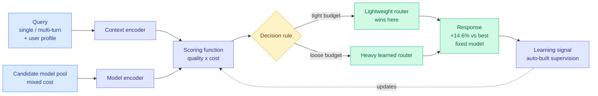
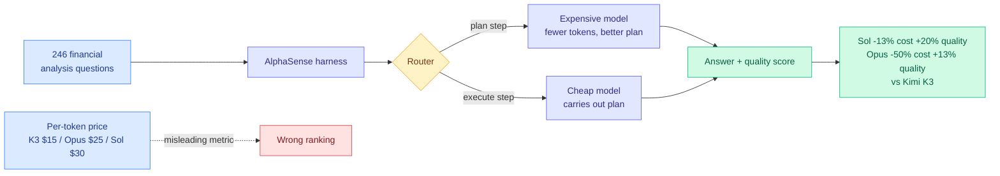
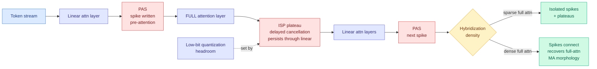
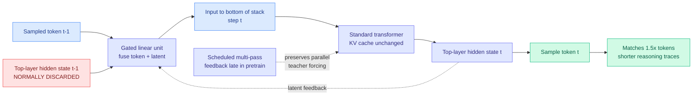
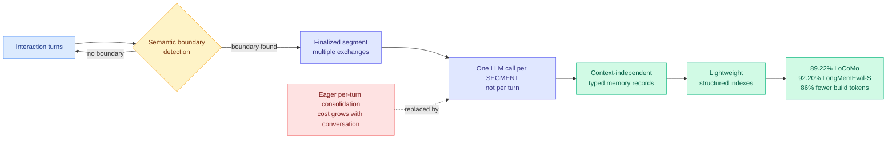
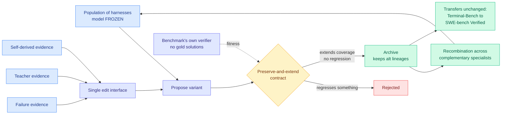

# cere-bro | 2026-08-14

> Today the cost axis moved off the price list. A production study found the expensive model finished cheaper, a routing paper published the first unified way to measure that, and DeepSeek put a six-fold price on the KV cache while giving away the harness built to protect it. The lever is not the model, and increasingly it is not even the token.

🎯 Today's 5 for you

<ol>
<li>Read<strong>LLMRouter.</strong> The first unified formulation of routing as a five-component decision process, plus xRouteBench and 16+ routers under one interface. Dead center of your routing line, and the frame that finally makes MISA, CaRE and Conductor commensurable. <a href="https://arxiv.org/abs/2608.06867">Paper</a> · <a href="../../ai-routing/2026-08-14-llmrouter-unified-routing-infrastructure.md">wiki</a>.</li>
<li>Read<strong>Token price is not task cost.</strong> Across 246 real tasks, Opus 4.8 cost half of Kimi K3 at higher quality despite a higher sticker price, because smarter models use fewer tokens. This is your cost-optimization axis with the metric corrected, and it lands the same day as LLMRouter. <a href="https://www.theinformation.com/articles/anthropic-models-can-cheaper-use-chinese-ones-study-finds">The Information</a> · <a href="../../ai-industry/2026-08-14-alphasense-token-price-vs-task-cost.md">wiki</a>.</li>
<li>Read<strong>Massive activations in hybrid attention.</strong> Outlier position is architecturally determined, not empirical: spikes sit immediately before every full-attention layer and persist through the linear ones. For quantizing Qwen3.5 or Kimi K3, you can now read the hard layers off the config. <a href="https://arxiv.org/abs/2608.12149">Paper</a> · <a href="../../inference-efficiency/2026-08-14-massive-activations-hybrid-linear-attention.md">wiki</a>.</li>
<li>Skim<strong>DeepSeek prices the cache 6x.</strong> Cache-hit tokens jump six-fold while Harness v0.1 ships MIT with append-only history so the prefix is never invalidated. Your KV-cache economics thread, now a customer-visible invoice line, and your dominant saved theme in one release. <a href="https://the-decoder.com/deepseek-launches-an-improved-v4-pro-model-raises-api-prices-and-makes-its-agent-software-open-source/">The Decoder</a> · <a href="../../inference-efficiency/2026-08-14-deepseek-harness-kv-cache-economics.md">wiki</a>.</li>
<li>Track<strong>DarwinX: harnesses that transfer.</strong> Evolve a population of harnesses with the model frozen and one loop adds ~17 points, with a Terminal-Bench harness transferring unchanged to SWE-bench Verified. Your harness/loop reading trail now has its generalization result. <a href="https://arxiv.org/abs/2608.07545">Paper</a> · <a href="../../agentic-systems/2026-08-14-darwinx-harness-population-evolution.md">wiki</a>.</li>
</ol>

---

## TL;DR

- **AlphaSense study**: across 246 tasks, Opus 4.8 cost half of Kimi K3 at higher quality. Smarter models spend fewer tokens.
- **LLMRouter**: one formulation for all routing, plus a cost-aware benchmark. Learned routers beat the best fixed model by 14.6%.
- **DeepSeek**: cache-hit tokens now cost six times more. Its new MIT-licensed harness never edits history, so the cache survives.
- **Massive activations**: in hybrid models, outliers spike right before full-attention layers and plateau through linear ones. Position is predictable.
- **Full-bandwidth transformer**: feed the top hidden state back to the bottom. Matches 1.5x more training data, writes shorter reasoning.
- **DarwinX and AutoDesign**: two groups, same day, both optimize the harness with the model frozen. Both prove it by transfer.

---

## Deep Dives

### LLMRouter: Unified Infrastructure for Developing, Evaluating, and Deploying LLM Routers

> The routing literature's real bottleneck was never the algorithms. It was that thirty papers used thirty formalisms and nobody could compare them.

**Source:** HuggingFace Daily Papers
**Links:** [Paper](https://arxiv.org/abs/2608.06867) · [Wiki summary](../../ai-routing/2026-08-14-llmrouter-unified-routing-infrastructure.md)

**What is it about?**
Routing means picking which model should answer a given query, so you do not pay frontier prices for questions a small model handles fine. This paper argues the field's problem is fragmentation, and fixes it with one formulation: routing is a sequential decision process with five parts, namely context encoders, model encoders, scoring functions, decision rules, and learning signals.

**What problem does it solve?**
Until now every router had its own formalism, its own codebase, and its own evaluation, so nobody could tell which design choice was responsible for which gain. Evaluating a router honestly is also brutally expensive, because you must run every candidate model on every query and score each response while recording cost. Most papers avoided that by precomputing responses for one fixed model pool, which made results non-portable.

**What's the core novelty?**
The five-component decomposition covers single-turn, multi-turn, and personalized routing as instances of one thing, which prior benchmarks like RouterBench and RouterEval did not. On top of it sits an automated pipeline that constructs routing supervision for a new benchmark or model pool, so evaluation does not restart from zero each time.

**Key takeaways**
- Learned routers beat **the strongest fixed-model baseline by 14.6% relative**, which is the honest comparison rather than beating a random pick.
- **Lightweight routers get more competitive as the cost constraint tightens**, because an expensive router's own cost eats the savings it produces. This regime boundary is new to this wiki.
- **User-conditioned routing consistently improves personalization**, making identity a real routing feature rather than a decoration.
- Ships **xRouteBench** across generic, memory-augmented, vision, time-series, and personalized routing, plus 16+ routers under one interface.

**Gaps in the study**
The 14.6% figure is an average across five very different domains, and routing gains are usually wildly uneven, large where the candidate pool is heterogeneous and near zero where one model dominates, so the average likely hides the interesting structure. More seriously, the cost model appears to be per-token API pricing, which is exactly the metric the next Deep Dive shows ranks models backwards.

**Industrial implication**
Every company currently building an internal router, and per The Information's reporting on the OpenRouter bid that includes Meta, Snowflake, and the 25 firms that approached the five-person startup Requesty in two weeks, is reimplementing baselines before it can evaluate its own work. A shared harness with 16+ routers collapses that duplicated effort. Expect the first citation wave to be industrial rather than academic.

→ [Full summary](../../ai-routing/2026-08-14-llmrouter-unified-routing-infrastructure.md)

---

### Token Price Is Not Task Cost: The AlphaSense Study

> The model with the highest price per token finished the work for the least money. Three times out of four.

**Source:** The Information · AlphaSense
**Links:** [Article](https://www.theinformation.com/articles/anthropic-models-can-cheaper-use-chinese-ones-study-finds) · [Study](https://www.alpha-sense.com/resources/product-articles/frontier-ai-models-context/) · [Wiki summary](../../ai-industry/2026-08-14-alphasense-token-price-vs-task-cost.md)

**What is it about?**
AlphaSense, a financial search company, tested whether cheap open-weight Chinese models are actually cheaper in production. It ran 246 financial analysis questions over earnings reports, call transcripts, and SEC filings, and scored answers on quality including whether numbers came from the right time frame.

**What problem does it solve?**
The whole industry compares models on price per token, where Moonshot's Kimi K3 charges $15 per million output tokens against $25 for Anthropic's Opus 4.8 and $30 for OpenAI's GPT-5.6 Sol. That comparison makes open-weight models look decisively cheaper and drives real purchasing decisions.

**What's the core novelty?**
It measures cost per completed task instead of cost per token, on a real workload rather than a benchmark. The mechanism it exposes is simple: more capable models take fewer steps and produce shorter paths to an answer, and that token-count difference is larger than the unit-price difference.

**Key takeaways**
- **GPT-5.6 Sol cost about 13% less than Kimi K3 with about 20% higher quality.** Opus 4.8 cost **about half** of Kimi K3 with 13% higher quality.
- Quality and cost moved **together, not against each other**, in three of four comparisons. The cheaper option was also the worse one.
- The production answer is a router. AlphaSense's own harness **picks an expensive model to plan and a cheap model to execute**, and reports significantly lower cost per question.
- This is **contested**. Artificial Analysis ranks Kimi K3 and GLM 5.2 as significantly cheaper than the two US models on its own task set, so the answer is workload-dependent.

**Gaps in the study**
The study comes from a company selling AI research tools, tested on its own proprietary data, in a domain that rewards intelligence unusually heavily. The article itself notes weaker open models may be entirely sufficient for simple work like summarizing emails, and that self-hosting open weights removes per-token pricing altogether for anyone with their own accelerators. That last point is not a small caveat, it is a different cost structure.

**Industrial implication**
Anyone choosing models on a per-token price comparison may be optimizing the wrong objective by up to 2x. The action is to instrument cost per completed task on a representative internal workload before committing to a model or a migration, because the two credible measurements here disagree and the disagreement is workload-shaped. The plan-with-expensive, execute-with-cheap split is reproducible today without any routing research.

→ [Full summary](../../ai-industry/2026-08-14-alphasense-token-price-vs-task-cost.md)

---

### Massive Activations in Hybrid Linear Attention LLMs

> Everything we know about activation outliers was measured on full-attention transformers. Half the models shipping now are not that, and in them the outliers appear exactly where the architecture says they will.

**Source:** HuggingFace Daily Papers
**Links:** [Paper](https://arxiv.org/abs/2608.12149) · [Code](https://github.com/StartluxLabs/Massive-Activations-HLA) · [Wiki summary](../../inference-efficiency/2026-08-14-massive-activations-hybrid-linear-attention.md)

**What is it about?**
Massive activations are the rare enormous values in a model's hidden state that sit orders of magnitude above everything else. They are the main obstacle to low-bit quantization, because one outlier forces the tensor's scale factor to accommodate it and wastes precision on every other value. This is the first systematic study of them in hybrid linear attention models, which interleave cheap linear-attention layers with a few expensive full-attention ones, and which now include Qwen3-Next, Qwen3.5, Kimi Linear, Kimi K3, Zamba, and Nemotron-H.

**What problem does it solve?**
Every quantization recipe in production inherited its assumptions from dense LLaMA-era full-attention models. Nobody had checked whether those assumptions hold for the hybrid architectures that a large share of current open models actually use, so serving stacks are quantizing hybrids on borrowed intuition.

**What's the core novelty?**
Two named morphologies that are architecture-aligned rather than data-driven. **Pre-attention spikes** appear immediately before every full-attention layer. **Inter-spike plateaus** are those spikes persisting through the intervening linear layers rather than decaying. Make the hybrid denser in full attention and successive spikes connect through their plateaus until you recover the classic full-attention picture. The proposed mechanism is a write-sink-cancel lifecycle where spikes are cancelled quickly and plateaus are the same process with delayed cancellation.

**Key takeaways**
- Spike **position is predictable from the architecture**, so a quantizer can read the hard layers off the model config instead of profiling for them.
- The elevated region is **not one layer wide**, so any per-layer scale chosen on the assumption that outliers are local will be wrong across the plateau.
- The organization recurs across **5 linear-attention architectures, 6 hybridization configs, 5 data domains, and 1.2B to 397B models**.
- **Gating responds asymmetrically**: full-attention output gating strongly attenuates magnitude but leaves the layerwise organization intact, so you cannot gate your way out of the morphology.

**Gaps in the study**
Controlled pretraining tops out at 1.3B, so the causal claims are small-scale while the 397B evidence is observational. More importantly, the paper characterizes the morphology thoroughly but never runs the quantization experiment: there is no result showing a spike-aware scale assignment beats a family-calibrated flat one. That single missing ablation is what stands between this and a deployment recipe.

**Industrial implication**
The correct move for anyone serving a hybrid model is per-layer-class quantization scales keyed to the hybridization pattern, one policy for full-attention-adjacent layers, another for the plateau region, a third for the rest. That is a configuration change rather than a research program, and it should appear in llama.cpp and vLLM within a quarter of someone running the missing ablation.

→ [Full summary](../../inference-efficiency/2026-08-14-massive-activations-hybrid-linear-attention.md)

---

### Full-bandwidth Transformer

> Every decoding step, the model computes a rich hidden state, samples one token from it, and throws the rest away. This paper stops throwing it away.

**Source:** HuggingFace Daily Papers
**Links:** [Paper](https://arxiv.org/abs/2608.08888) · [Wiki summary](../../inference-efficiency/2026-08-14-full-bandwidth-transformer.md)

**What is it about?**
A transformer computes horizontally across generated tokens and vertically through depth. Attention makes the horizontal channel wide. The vertical channel between decoding steps is one token wide, because the model samples a single symbol and discards the hidden state that produced it. This work from Johns Hopkins, Princeton and Microsoft AI Frontiers widens that channel by fusing the previous top-layer hidden state with the sampled token embedding through a gated linear unit and feeding the result back in.

**What problem does it solve?**
High-quality unique training data is becoming the binding constraint on scaling, which motivates getting more learning signal out of each token. Separately, anything the model computes but does not say out loud is either discarded or left depth-frozen in the KV cache, reachable only by layers above where it was produced. So the model must either verbalize its intermediate reasoning, spending output tokens, or recompute it.

**What's the core novelty?**
Latent feedback lets non-verbalized computation re-enter the stack with a renewed depth budget, while the architecture, the KV cache, and the language-modeling objective all stay standard. The training trick is what makes it work: naive latent feedback breaks parallel teacher forcing, so they use a scheduled multi-pass objective that introduces feedback only late in pretraining, mixed with a small fraction of deeper passes for stability.

**Key takeaways**
- At 1B parameters and 400B tokens, it **matches or approaches standard transformers trained on roughly 1.5x more tokens**.
- It produces **shorter reasoning traces at equal or better accuracy**, which is the result with the clearest cost consequence.
- **Negligible per-token decoding overhead**: one gated fusion against a full forward pass.
- Improves validation loss, 5-shot evaluation, math and coding generation, and instruction-tuned performance.

**Gaps in the study**
Everything is at 1B. The commercially meaningful claim is that the 1.5x data multiplier survives to frontier scale, and there is no evidence for that. The step-to-step dependency latent feedback creates is also exactly what speculative decoding assumes away, so composition with the most reliable serving speedup in production is unclear and untested. And there is no interpretability check on whether reasoning has quietly moved into the latent channel where a chain-of-thought monitor cannot see it.

**Industrial implication**
Shorter traces at equal accuracy is a direct multiplier on the cost line every agentic deployment pays. Note the tension worth watching: moving reasoning off the token stream into a latent channel makes it cheaper and simultaneously makes it invisible to the monitoring layer that safety work has been building around visible chains of thought.

→ [Full summary](../../inference-efficiency/2026-08-14-full-bandwidth-transformer.md)

---

### LycheeMemory V2: Segment-Level Memory Consolidation

> Agent memory systems call an LLM after every single turn. It turns out you can call it far less often and get better answers.

**Source:** HuggingFace Daily Papers
**Links:** [Paper](https://arxiv.org/abs/2608.12990) · [Wiki summary](../../inference-efficiency/2026-08-14-lycheememory-v2-segment-consolidation.md)

**What is it about?**
Long-horizon agents need to remember past interactions. Most memory systems use eager consolidation, calling an LLM after every turn to extract and update memories. LycheeMemory V2 batches multiple exchanges into segments and encodes each finalized segment once, with segment boundaries chosen by semantic boundary detection rather than a fixed window.

**What problem does it solve?**
Eager consolidation makes memory construction cost grow with conversation length, and every turn pays a model call whether or not it carried anything worth remembering. The usual escapes both fail: coarse summarization is cheaper but discards fine-grained evidence, and pushing work to query time via bigger retrieval contexts just moves the bill.

**What's the core novelty?**
It changes the granularity of consolidation rather than the amount. Semantic boundary detection is the load-bearing piece, because it preserves coherent event-level and temporal structure that fixed-size batching would cut through. The framing claim is the contribution: the accuracy-cost tradeoff depends not only on what is retained but on the granularity at which it is consolidated.

**Key takeaways**
- **86.0% fewer construction tokens on LoCoMo and 75.9% fewer on LongMemEval-S** versus A-Mem, close to an order of magnitude off the dominant recurring cost.
- State of the art anyway: **89.22% on LoCoMo, 92.20% on LongMemEval-S**. The saving is not bought with accuracy.
- **Query-time token usage does not increase**, which is what separates it from coarse summarization that saves at construction and pays at retrieval.
- Semantic boundaries beat fixed-window batching on preserving event-level evidence.

**Gaps in the study**
All numbers use GPT-4.1-Mini, and semantic boundary detection is the load-bearing component, so boundary quality plausibly degrades with a weaker detector, which is exactly the local-deployment case where an 86% saving would matter most. There is no sensitivity analysis on segment size, so it is unclear how much of the gain is plain batching versus the semantic boundaries. Both benchmarks are conversational, and whether boundaries are as detectable in tool-call and code-edit traces is untested.

**Industrial implication**
Every production agent framework with a memory layer consolidates eagerly because it is the obvious implementation, and this says that choice costs 4x to 7x in construction tokens for no accuracy benefit. It is a scheduling change rather than a rewrite. The timing also matters: as cache-hit pricing rises, chatty per-turn memory writes get more expensive, and batching moves from optimization to necessity.

→ [Full summary](../../inference-efficiency/2026-08-14-lycheememory-v2-segment-consolidation.md)

---

### DarwinX: Evolving Agent Harnesses Through Natural Selection

> A frozen model need not be a fixed agent. Evolve the scaffold instead, and the result survives a change of task, verifier, and base model.

**Source:** HuggingFace Daily Papers · Salesforce AI Research
**Links:** [Paper](https://arxiv.org/abs/2608.07545) · [Wiki summary](../../agentic-systems/2026-08-14-darwinx-harness-population-evolution.md)

**What is it about?**
An agent's harness is everything wrapped around the model: prompts, tools, skills, and control flow. Self-improving agents already edit their own harnesses, but almost all of them do it as a single lineage, running rollouts, reflecting, proposing an edit, and gating it. DarwinX runs it as a population under selection instead, with the model frozen throughout.

**What problem does it solve?**
Single-lineage search has two structural failures. It is path-dependent, so an early locally-good edit can lock the agent onto a plateau. And it suffers cross-task interference, where an edit that helps one task family quietly regresses another, which is what makes it stall as soon as the task distribution gets diverse.

**What's the core novelty?**
A preserve-and-extend contract admits a variant only if it extends coverage without regressing anything already solved, which directly attacks interference. An archive keeps alternative lineages alive so complementary specialists can be recombined rather than discarded, which attacks path dependence. Fitness comes from each benchmark's own verifier, so there are no gold solutions and no hand-picked winners.

**Key takeaways**
- One evolution loop adds **about 17 points on average** across four benchmarks designed to progressively separate the evolution signal from the test.
- Terminal-Bench 2.1 rises **+7.7 to 83.2%** on a matched base and **84.7%** on a stronger one. WebArena-Infinity pass@1 goes **43.5% to 93.0%**.
- **A Terminal-Bench harness transfers unchanged to SWE-bench Verified.** This is the load-bearing result and the claim single-lineage systems have historically failed.
- The model never changes. All capability gain lives in the scaffold.

**Gaps in the study**
The 43.5% to 93.0% jump deserves more scrutiny than the "audit-clean" label supplies. Population search is expensive by construction and no evolution-compute budget is reported, so the honest comparison against simply buying a stronger base model is unavailable. "One loop adds about 17 points" also leaves open whether loops compound or saturate immediately, which is the difference between a one-time upgrade and a continuous improvement process.

**Industrial implication**
For anyone serving a frozen open-weight model, this is a capability lever requiring no training infrastructure and no GPU fleet, producing an artifact that is inspectable and version-controllable in a way a fine-tune is not. Combined with the transfer result, harnesses look set to become shipped and shared artifacts rather than internal glue.

→ [Full summary](../../agentic-systems/2026-08-14-darwinx-harness-population-evolution.md)

---

### AutoDesign: Meta-Harness Optimization

> The same insight as DarwinX, from a different group, published the same day, proved a different way.

**Source:** HuggingFace Daily Papers
**Links:** [Paper](https://arxiv.org/abs/2608.13560) · [Wiki summary](../../agentic-systems/2026-08-14-autodesign-meta-harness-optimization.md)

**What is it about?**
AutoDesign puts a meta-harness optimizer above a code agent, watching rollout feedback and guiding the agent to recursively rewrite its own harness, with the optimizer aligned to human design priors rather than raw score. It is instantiated on academic paper-to-poster generation and evaluated on a new benchmark, PosterBench.

**What problem does it solve?**
Existing harness paradigms are static. They do not accumulate reusable experience from exploration, so a system that solves a long-horizon design task once cannot get better at solving the next one.

**What's the core novelty?**
The meta level. A self-improving agent edits its harness; AutoDesign has a separate optimizer deciding how the harness should be edited, and that optimizer answers to human design priors rather than to a score it could otherwise game.

**Key takeaways**
- Scores **78.32** on PosterBench, beating the closed commercial system Claude Design by **7.45 points**.
- The learned DesignHarness **transfers across seven code-agent-model configurations**, lifting the average from **54.99 to 67.39**.
- A full autonomous run is **253 tool calls and 11 editing turns in 40 minutes for under $3**, reaching average conference-poster quality.
- It also wins highest human preference in a system-blind study.

**Gaps in the study**
Poster generation is visual, subjective, and forgiving, with no correctness criterion a bad output can catastrophically violate. The transfer is across model configurations rather than across tasks, which is the weaker of the two transfer claims and notably weaker than DarwinX's cross-benchmark result. PosterBench is also introduced by the authors who top it, and there is no ablation separating the meta-optimizer's contribution from the code agent's raw capability.

**Industrial implication**
At $3 and 40 minutes, harness optimization is cheap enough to run per-task rather than per-product. The harness-transfers-across-models result means a vendor can learn a harness once and keep swapping cheaper models underneath as they appear, which is the same cost-optimization move today's routing thread points at from the other direction.

→ [Full summary](../../agentic-systems/2026-08-14-autodesign-meta-harness-optimization.md)

---

### How Can Rhetoric Reward-Hack AI Reviewers?

> Rewrite the paper's framing, keep every result identical, and the AI reviewer's score moves. Making the reviewer stricter does not fix it.

**Source:** HuggingFace Daily Papers
**Links:** [Paper](https://arxiv.org/abs/2608.08975) · [Wiki summary](../../responsible-ai/2026-08-14-rhetoric-reward-hacking-ai-reviewers.md)

**What is it about?**
A controlled study of whether how you write changes an AI reviewer's score when what you found does not change. It builds 4,200 full-paper manuscripts from 120 anonymized ICLR 2026 submissions, with two LLM rewriters transforming six rhetorical dimensions in opposing directions while preserving reported scientific content, then has five LLM reviewers score them under standard and strict protocols.

**What problem does it solve?**
LLMs are increasingly involved in scientific evaluation, and nobody had cleanly separated the effect of presentation from the effect of content at scale. Anecdotes about "writing for the reviewer" existed; a measurement did not.

**What's the core novelty?**
The sensitivity turns out to be structured rather than uniform, which makes it actionable. Evidence framing and novelty stance produce the largest effects, scope framing forms a weaker second tier, and the rest are small or unstable. There is also a clean decomposition of blame: the rewriter determines the separation between opposing variants, while the reviewer determines the magnitude and sign.

**Key takeaways**
- **Evidence framing and novelty stance are the highest-leverage dimensions**, and the hierarchy persists across human-assessed quality levels.
- Effects **regress toward the middle**: low scores rise, high scores fall, and mid-range papers move most, which is exactly where real accept and reject decisions live.
- **Strict review lowers mean assessment by 1.36 points without consistently reducing rhetorical sensitivity.** The obvious mitigation buys harshness, not robustness.
- More elaborate attack workflows do not reliably help. Joint rewriting is rewriter-dependent and repeated rewriting gives diminishing returns.

**Gaps in the study**
Everything is LLM reviewers, with no human baseline, and humans are also famously sensitive to framing, so it is hard to read this as a criticism specific to AI review. The corpus is one venue in one field, and rhetorical norms vary enormously across disciplines. It also measures score movement rather than whether rhetorically-optimized papers survive the consequences of acceptance.

**Industrial implication**
Any venue or funding body using LLM assistance in evaluation now has a ranked attack surface and evidence that tightening the rubric does not close it. The deployable response is content-preserving robustness testing inside the review pipeline: rewrite the candidate's evidence framing and novelty stance, and check whether the score moves. If it does, the score is measuring presentation.

→ [Full summary](../../responsible-ai/2026-08-14-rhetoric-reward-hacking-ai-reviewers.md)

---

## Industry Pulse

- **DeepSeek** moved V4-Pro out of preview, open-sourced Harness v0.1 under MIT, and raised cache-hit token prices roughly six-fold ([The Decoder](https://the-decoder.com/deepseek-launches-an-improved-v4-pro-model-raises-api-prices-and-makes-its-agent-software-open-source/)).
- **DeepSeek V4-Pro** drew mixed reviews on release, making the harness and the pricing change arguably more consequential than the model ([The Information](https://www.theinformation.com/articles/deepseeks-flagship-v4-pro-model-gets-mixed-reviews)).
- **Google shipped Gemini 3.7 Flash** three weeks after 3.6 Flash, claiming it beats Claude Sonnet 5 and GPT-5.6 Terra at half the price ([The Decoder](https://the-decoder.com/gemini-3-7-flash-lands-with-coding-gains-and-undercuts-its-three-week-old-predecessors-price-by-50/)).
- **Cognition put Gemini 3.7 Flash in Devin**, measuring 56.3 on its FrontierCode 1.1 benchmark against Sonnet 5's 56.2 at under half the cost, with a 50% discount through August 27 ([Devin blog](https://devin.ai/blog/gemini-37-flash)).
- **Anthropic's Fable 5 accounts for just 6% of Anthropic tokens sold** per Ramp data, suggesting corporate willingness to pay for frontier capability has hit a ceiling ([The Decoder](https://the-decoder.com/fable-5s-slow-adoption-suggests-corporate-willingness-to-pay-for-frontier-ai-has-hit-a-ceiling/)).
- **Anthropic brought Claude Cowork into its Chrome extension** side panel, adding skills and plugins to the browser ([The Decoder](https://the-decoder.com/anthropic-brings-claude-cowork-to-its-chrome-extension-adding-skills-and-plugins-to-the-browser/)).
- **Ling 3.0 Flash** launched as the strongest open model in its size class ([The Decoder](https://the-decoder.com/ling-3-0-flash-is-the-smartest-open-model-at-its-size/)).
- **Devin now works directly against live MongoDB Atlas data**, querying, managing and provisioning clusters mid-task rather than working from copied-in schemas ([@cognition](https://x.com/cognition/status/2087892577185829004)).
- **xAI published the weights of the X recommendation algorithm**, with the full repo browsable and the largest single ranking boost going to copying a post's link ([DeepWiki](https://deepwiki.com/xai-org/x-algorithm)).
- **An IAPS study interviewed 25 researchers** from OpenAI, Anthropic, Google DeepMind, Meta and US universities on recursive self-improvement, and finds several of their predicted milestones have already fallen ([The Decoder](https://the-decoder.com/top-ai-lab-researchers-warned-about-automated-ai-research-and-several-of-their-predicted-milestones-have-already-fallen/)).
- **Hugging Face reproduced 2,200 ICML papers** and published what the exercise revealed about reproducibility at scale ([HF blog](https://huggingface.co/blog/icml-2026-open-reproductions)).
- **OpenAI replaced Chief Revenue Officer Denise Dresser after eight months** with Dali Rajic, formerly president and COO of Wiz, underlining cybersecurity as an AI selling point ([The Information](https://www.theinformation.com/articles/openais-latest-hire-burnishes-cybersecurity-credentials)).
- **NVIDIA and LG announced a next-generation bipedal humanoid** built on NVIDIA Isaac GR00T, alongside an expanded AI infrastructure and robotics partnership ([PRNewswire](https://nvda.ws/4czcZnh)).
- **OpenAI and Anthropic's appetite for training data** has turned startups' old Slack threads and support tickets into prized assets ([The Information](https://www.theinformation.com/articles/startups-find-old-slack-threads-tickets-suddenly-high-demand)).

**Funding, valuations, and compute deals**

- **Robinhood's closed-end fund RVII went public on the NYSE after raising $225.5 million** to back Y Combinator startups, its second startup-backing fund this year ([The Information](https://www.theinformation.com/articles/y-combinator-startups-get-new-backer-robinhood)).
- **Nebius held its first compute capacity auction**, with Blackwell-generation prices landing 15% above the highest it had ever charged, and is now selling capacity closer to delivery to exploit the spike ([The Information](https://www.theinformation.com/articles/nebius-coreweave-cashing-soaring-ai-compute-prices)).
- **NVIDIA's market capitalization is now $1 trillion above Apple's**, after NVIDIA rose 18% and Apple fell around 10% in two weeks ([The Information](https://www.theinformation.com/articles/nebius-coreweave-cashing-soaring-ai-compute-prices)).
- **The compute crunch is hitting model-training startups hardest.** Generalist's Evan Morikawa canvassed 17 AI cloud providers hunting roughly a thousand chips, and says knowing the current GPU price is "VC currency right now" ([The Information](https://www.theinformation.com/articles/ai-compute-crunch-hitting-neolabs-especially-hard)).
- **Workday stock jumped 18%** on reports of Silver Lake takeover talks ([The Information](https://www.theinformation.com/articles/workday-stock-jumps-18-report-silver-lake-takeover-talks)).
- **Kalshi passed $4 billion in annualized revenue** while seeking a $40 billion valuation ([The Information](https://www.theinformation.com/articles/kalshi-tops-4-billion-annualized-revenue-seeks-40-billion-valuation)).
- **Tencent's capital expenditure nearly tripled** on additional compute for AI models ([The Information](https://www.theinformation.com/articles/tencent-s-capex-nearly-triples-on-more-compute-for-ai-m)).

---

## Global View

**The cost axis moved from the price list to the harness, and research and industry published the same finding within hours of each other.** [LLMRouter](../../ai-routing/2026-08-14-llmrouter-unified-routing-infrastructure.md) formalized routing as a decision process scored jointly on quality and cost, and found learned routers beat the best fixed model by 14.6% while lightweight routers win as budgets tighten. The same day, AlphaSense reported that across 246 real financial tasks the ranking by per-token price is simply wrong, with Opus 4.8 finishing at half of Kimi K3's cost at higher quality, and that its production system splits each query with an expensive planner and a cheap executor inside its own harness. That production architecture is LLMRouter's multi-turn cost-aware formulation, arrived at independently by a company with no stake in routing research, which is a stronger validation than any benchmark in the paper. It also reframes [the ~$10B Stripe interest in OpenRouter (08-11)](../../ai-industry/2026-08-11-openrouter-stripe-router-frenzy.md): the product is not access to cheaper models, it is measurement of the cheapest completion, which is a harder problem and worth more.

**Three papers in two days established that the harness is a portable artifact, and DeepSeek priced the resource it consumes on the same day.** [AI4AI (08-13)](../../inference-efficiency/2026-08-13-ai4ai-test-time-harness-transfer.md), which took a weak model from 0.49 to 0.91 on Theory-of-Mind by having a strong model write its scaffold with weights frozen, showed harness transfer works; [DarwinX](../../agentic-systems/2026-08-14-darwinx-harness-population-evolution.md) showed an evolved harness transfers unchanged from Terminal-Bench to SWE-bench Verified, and [AutoDesign](../../agentic-systems/2026-08-14-autodesign-meta-harness-optimization.md) showed one learned harness lifting seven different model-agent configurations. Meanwhile [DeepSeek open-sourced Harness v0.1 under MIT while raising cache-hit prices six-fold](../../inference-efficiency/2026-08-14-deepseek-harness-kv-cache-economics.md), its harness built on append-only history precisely so the cache prefix is never invalidated, which is the clearest possible statement that the harness is standard infrastructure and the cache is the billable resource. Ken Huang's Harness Engineering book, published to Gmail the same week, argues exactly this: the third wave treats the harness as the product boundary. The gap this opens is now well-evidenced and entirely unaddressed: harnesses are demonstrably transferable and optimizable, [A²E (08-11)](../../agentic-systems/2026-08-11-harness-evolution-cluster.md) showed the routable unit is the model-harness pair, and no production router routes over harnesses.

**A third efficiency subfield found that the schedule beats the operator, which crosses this wiki's pattern threshold.** On 08-12 [ICBQ](../../inference-efficiency/2026-08-12-icbq-interleaved-cross-block-quantization.md) found that interleaving quantization across blocks mattered more than improving the per-block quantizer; on 08-13 ReOrder-OPD found that ordering prompts by reliability during on-policy distillation beat changing the distillation operator; today [LycheeMemory V2](../../inference-efficiency/2026-08-14-lycheememory-v2-segment-consolidation.md) cut memory construction tokens by 86% not by writing a better extractor but by firing it on semantic segments instead of every turn. Three subfields, three days, same lever, and yesterday's digest predicted the third instance one day before it arrived. The industry consequence is immediate rather than theoretical, because a six-fold cache-hit price penalizes exactly the pattern eager per-turn consolidation produces, namely many small repeated calls over overlapping context. The untested fourth candidate is KV eviction cadence, and this wiki's eviction literature is almost entirely about policy rather than timing.

---

## Looking Ahead

- **Someone runs the missing quantization ablation on hybrid models within 60 days.** [Massive Activations in HLA](../../inference-efficiency/2026-08-14-massive-activations-hybrid-linear-attention.md) shows outlier position is architecturally determined but never tests whether a spike-aware scale beats a flat family-calibrated one. Signal: a paper or a llama.cpp/vLLM pull request reporting per-layer-class quantization scales keyed to hybridization pattern, with a measured bit or quality delta on Qwen3.5 or Kimi K3. If nobody runs it by mid-October, the mechanistic-quantization line is producing description rather than deployment.
- **A cost-per-completed-task benchmark appears within 90 days and reorders at least one published router ranking.** LLMRouter scores cost per token; AlphaSense showed that ranks models backwards; Artificial Analysis disagrees with AlphaSense. Signal: xRouteBench or a successor adding a task-completion cost metric, or any router paper reporting dollars per solved query as its primary axis. If the two credible measurements stay unreconciled past November, "cheaper model" remains an unfalsifiable marketing claim.
- **Another provider follows DeepSeek's cache-hit repricing within 30 days.** Cache hits are the dominant token category in agent loops and DeepSeek just demonstrated they are underpriced. Signal: any of Anthropic, OpenAI, or Google changing cached-input pricing, or introducing a peak/off-peak split. If it happens, append-only context management becomes an industry-wide economic requirement and every framework that edits conversation history in place is suddenly expensive.
- **The "schedule beats operator" pattern gets a fourth instance in KV eviction within 60 days.** Quantization block order, distillation prompt order, and memory consolidation cadence all landed in three days. Signal: a paper varying *when* eviction fires rather than which tokens it picks, and beating a policy-tuned baseline at matched budget. This is the cheapest test of whether the pattern is real or three coincidences.
- **Kurate's LLM-rated underrated, and a caveat.** This week's leaderboards are unusable as a quality signal: every entry in both cs.AI and cs.LG shows score=1200 and win_rate=0.0%, meaning the 3-LLM tournament has not run, so nothing is genuinely ranked and there are no HuggingFace overlaps to call cross-source confirmed. Two entries carry efficiency-relevant inferred tiers and are worth tracking on topic alone: [REOPD: Reliability-Adaptive Reward Extrapolation for On-Policy Distillation](https://arxiv.org/abs/2608.11698) (cs.LG #4, ai_rating 4.0), which is the third distinct paper this wiki has seen using the REOPD name after the [07-24 multi-turn](../../inference-efficiency/2026-07-24-reopd-multiturn-onpolicy-distillation.md) and [08-03 prefix-replay](../../inference-efficiency/2026-08-03-reopd-prefix-replay-distillation.md) variants, and [Calibration Bets on the Past: Post-Training Quantization for Financial Time-Series](https://arxiv.org/abs/2608.12259) (cs.LG #3). Signal: if next week's tournament runs and either holds a top-5 slot with a real win rate, promote to a Deep Dive.
- **Rising authors from Kurate.** Two crossed threshold this week. **Junlin Liu** (score 17.0, 3 top-10 appearances), whose work spans [Multi-Agent Protocol Distillation in Agentic Search](https://arxiv.org/abs/2607.24280) and [Contrastive Reinforced Policy Optimization via Privileged Self-Distillation](https://arxiv.org/abs/2607.28026), both of which are already in this wiki's distillation corpus. **Kaixin Li** (score 15.6, 3 appearances), on GUI agents, including [Why Are GUI Agents Correct but Late?](https://arxiv.org/abs/2607.28399), which is a latency paper wearing a GUI-agent title. Signal: if either posts a follow-up that lands top-10 again by 2026-09-14, add them to `connectors/twitter/config.json:ai_handles`. Liu is the higher-value follow given the overlap with this wiki's on-policy distillation line.
