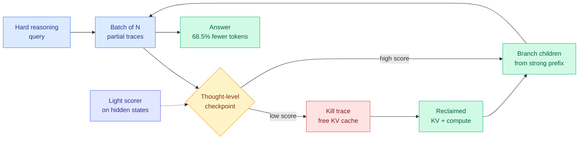
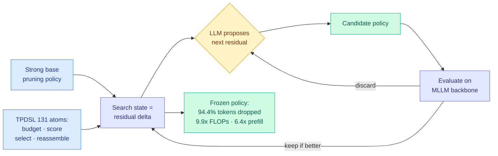
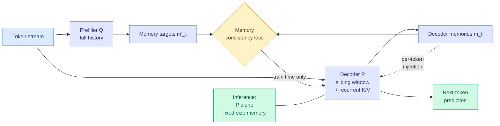
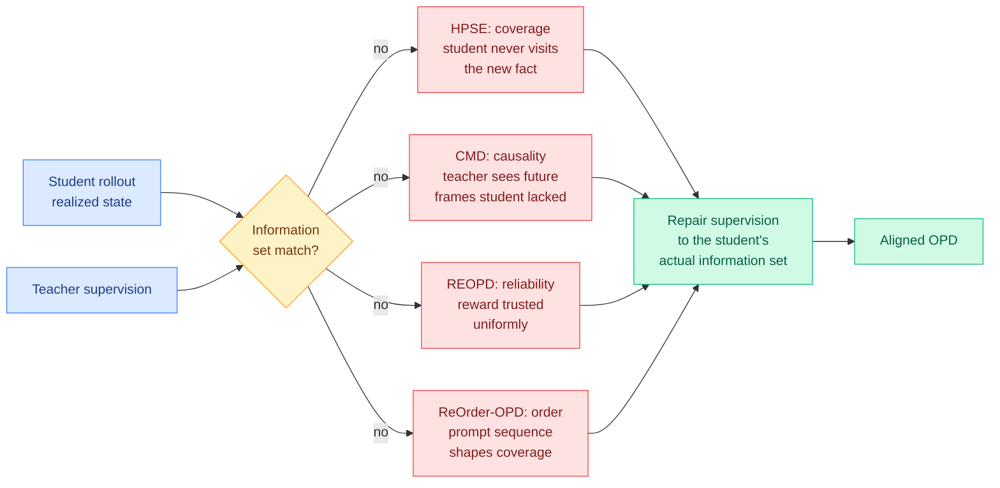
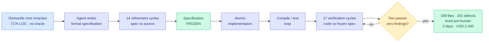

# cere-bro | 2026-08-16

> Today is about **where the compute goes**, not how much of it there is. Five papers independently attack the same waste: tokens spent on reasoning traces that already failed, image tokens that carry nothing, teacher supervision computed over information the student never had, and derivations on problems the model cannot solve. Meanwhile the industry finally shipped the instrument for measuring any of it. Artificial Analysis launched cost-and-time-per-task benchmarking two days after this wiki predicted someone would, and on the same day a developer published a 24x dollar spread across five models completing one identical task.

🎯 Today's 5 for you

<ol>
<li>Read<strong>Gambit, thought-level beam search.</strong> Tri Dao's group turns test-time reasoning into a KV-budget allocation problem: kill weak traces mid-flight, re-branch from strong prefixes, never let the GPU idle. 68.5% fewer tokens, 2x throughput, +6.7 points on HMMT-24. This is the cleanest compute-allocation result of the month and it ships as a serving-stack change. <a href="https://arxiv.org/abs/2608.08020">Paper</a></li>
<li>Read<strong>AutoPrune: an LLM designs the pruning policy.</strong> A 131-atom domain-specific language plus a residual-over-strong-base search state, and a language model discovers a visual-token pruning policy that drops 94.4% of tokens at over 99% accuracy, 9.9x FLOPs and 6.4x prefill. Training-free. The second paper in four days where the artifact carrying capability is a program rather than a gradient. <a href="https://arxiv.org/abs/2608.07193">Paper</a></li>
<li>Skim<strong>Optima ships per-task cost, and DHH publishes a 24x spread.</strong> Artificial Analysis now lets you benchmark on your own data by quality, cost, and time per task, resolving the prediction this wiki made on 08-14. Same day: one Rust-rewrite task cost $550 on Fable and $23 on DeepSeek V4 Max, with two models failing outright. Your routing cost objective is measured in the wrong currency. <a href="https://the-decoder.com/optima-tackles-ai-benchmarkings-biggest-flaw-by-letting-users-test-models-against-their-own-data/">The Decoder</a></li>
<li>Read<strong>Maglev bounds the KV cache by architecture, not by policy.</strong> A prefiller with full history teaches a sliding-window decoder to carry a fixed-size recurrent memory, then the prefiller is discarded at inference. Almost every KV result you have read is an eviction policy over a growing cache. This one removes the growth. <a href="https://arxiv.org/abs/2608.02870">Paper</a></li>
<li>Track<strong>Prime Intellect ran agents for 8.7 days straight, 153 runs, 18 models.</strong> The largest public autonomous-research experiment, and it matches your standing loop-and-harness reading thread. The finding that matters is not the leaderboard: Kimi K3 differs by 44 steps between two harnesses, about the size of the whole gap to Opus 5, and a single setting has a 50-step spread after 24 hours. <a href="https://www.primeintellect.ai/blog/measuring-autonomous-research">Prime Intellect</a></li>
</ol>

---

## TL;DR

- **Gambit**: stop treating parallel reasoning traces as independent. Prune weak ones, re-branch from strong prefixes. 68.5% fewer tokens, 2x throughput.
- **AutoPrune**: let a language model design the image-token pruning policy. Drops 94.4% of visual tokens, keeps over 99% of accuracy, needs no training.
- **Maglev**: a transformer with fixed-size memory that updates every token. Bounds the KV cache by design instead of evicting from it.
- **Five papers this week** all find the same bug in on-policy distillation: the teacher scores the student using information the student never had.
- **Artificial Analysis ships Optima**: benchmark models on your own data by cost and time per task, not by token price.
- **Nvidia cuts its OpenAI datacenter guarantee** from $250 billion to just under $120 billion after investor pushback. Anthropic revenue went $4.7B to $11.5B in one quarter.

---

## Deep Dives

### Gambit: Thought-Level Beam Search for Reasoning

> Parallel sampling spends most of its budget on traces that were already wrong at step three, and the thing that actually caps your batch size is not FLOPs, it is the KV cache those traces are holding.

**Source:** HuggingFace Daily Papers (Princeton, MIT CSAIL, Meta AI · COLM 2026)
**Links:** [Paper](https://arxiv.org/abs/2608.08020) · [Wiki summary](../../inference-efficiency/2026-08-16-gambit-thought-level-beam-search.md)

**What is it about?**
When a model has to solve a hard problem, one common trick is to generate many independent reasoning attempts and vote on the answer. That is called self-consistency. Gambit says this wastes almost everything, and replaces it with a search that periodically pauses every attempt, scores how promising each one looks so far, deletes the bad ones, and immediately starts new attempts branching off the good ones.

**What problem does it solve?**
Two existing approaches each fix half the problem and break the other half. Plain parallel sampling learns nothing from a trace that collapsed early, and holding N long reasoning contexts in memory is what actually limits how many you can run, because each one occupies KV cache (the stored attention keys and values that spare the model from recomputing earlier tokens). Subtractive pruning methods like DeepConf and Slim-SC kill weak traces to free that memory, and then throw the freed capacity away, so the GPU starves and the set of answers never shifts toward the good region. Gambit is the missing additive half.

**What is the core novelty?**
Re-branching, at thought granularity, funded by eviction. When a trace dies its KV budget is immediately spent on a new child of the best surviving prefix, so utilisation stays high and the output distribution actively concentrates instead of merely shrinking. The scorer is a lightweight probe on hidden states rather than a full process reward model, which matters because a heavy verifier's own cost eats the savings it produces. The empirical premise underneath is that successful and failed trajectories share their opening steps and diverge later, so useful computation is concentrated in early intermediate states.

**Key takeaways**
- Up to **+6.7 points absolute on HMMT-24** and **+3.3 on AIME-25** against pruning baselines, under identical hardware constraints.
- **More than 2x throughput** on trace completion.
- **Up to 68.5% reduction in total token consumption** versus standard parallel sampling.
- The paper claims strict dominance over baselines rather than a trade-off.

**Gaps in the study**
The scorer is a learned probe, so it needs training per model family and the paper does not report degradation under distribution shift. Both benchmarks are competition math, where answers are short and verifiable and prefix quality is unusually legible; whether hidden-state scoring separates good from bad prefixes on open-ended reasoning is untested. And there is a direct methodological objection sitting on this week's Kurate board that Gambit does not address, covered in Global View below.

**Industrial implication**
This is a serving change, not a training change, so it ships in a quarter rather than a year. Any engine already doing continuous batching can add a checkpoint hook and a scorer head. The 68.5% token reduction lands on the reasoning-mode API bill and the 2x throughput lands on capacity, which is the rare efficiency result where the vendor and the customer both win.

→ [Full summary](../../inference-efficiency/2026-08-16-gambit-thought-level-beam-search.md)

---

### AutoPrune: an AI4AI Framework for Visual Token Pruning

> Nobody hand-tunes a pruning heuristic anymore. A language model writes it, constrained by a 131-atom vocabulary and forced to express every idea as a diff against something that already works.

**Source:** HuggingFace Daily Papers (Xi'an Jiaotong, HKUST, Xiaomi MiLM Plus, Zhongguancun Academy)
**Links:** [Paper](https://arxiv.org/abs/2608.07193) · [Wiki summary](../../inference-efficiency/2026-08-16-autoprune-llm-designed-visual-token-pruning.md)

**What is it about?**
A vision-language model turns one image into hundreds or thousands of visual tokens, and those tokens dominate what inference costs. Dozens of pruning heuristics exist to throw some away. Choosing and tuning the right one for a new model, a new token budget, and a new objective is expert trial and error. AutoPrune hands that design job to a language model.

**What problem does it solve?**
"Let an LLM write the algorithm" has been tried before and usually fails on constraint-heavy problems, because a general code generator burns its budget rediscovering known mechanisms or emitting programs that violate tensor shapes, index bounds, or numerical stability. The design space is simply too large to search from nothing.

**What is the core novelty?**
The search-state representation, not the model. TPDSL gives the LLM 131 reusable atoms covering the four things a pruning policy must do (allocate a budget, score tokens, apply selection constraints, reassemble survivors), so every candidate is executable by construction. More importantly, a search state is not a policy, it is a **residual modification of a known-strong base policy**. That collapses the space to the neighbourhood of something that works and points the model at the components that actually move the metric.

**Key takeaways**
- **94.4% of visual tokens removed** while preserving **more than 99%** of full-token performance.
- **9.9x FLOPs reduction** and **6.4x prefill latency reduction**. The two differ because prefill is not purely FLOP-bound.
- **Training-free.** No gradient touches the backbone. The shipped artifact is a program.
- Validated on **14 multimodal benchmarks** across **three MLLM backbones**, with transferability claimed.

**Gaps in the study**
The retention figure is an average across 14 benchmarks, and pruning failures in multimodal models are long-tailed: the tasks that need the 5.6% you dropped are the fine-grained perception tasks. That pairs badly with Moonshot's PerceptionBench, published yesterday, which found no frontier model exceeds 60% on pure visual perception and that many apparent reasoning errors originate at the image-reading stage. The search cost is also unreported, which for a training-free method is the entire capital expenditure.

**Industrial implication**
Multimodal serving is prefill-bound, so 6.4x on prefill changes deployment maths for image-heavy agent traffic immediately. The larger bet is generalisation: if a DSL plus residual search reliably beats expert-tuned heuristics, the same recipe applies to KV eviction policies, quantization schedules, and speculative-decoding draft policies, all of which are hand-designed heuristic families with well-defined atoms. Nobody has run that yet.

→ [Full summary](../../inference-efficiency/2026-08-16-autoprune-llm-designed-visual-token-pruning.md)

---

### Maglev: Sliding Recurrent Memory

> Every KV cache paper you have read is a policy for what to throw away. This one changes the shape of the thing being cached so there is nothing to throw away.

**Source:** HuggingFace Daily Papers (Bo Liu, Qiang Liu, UT Austin)
**Links:** [Paper](https://arxiv.org/abs/2608.02870) · [Wiki summary](../../inference-efficiency/2026-08-16-maglev-sliding-recurrent-memory.md)

**What is it about?**
Full attention makes the KV cache grow with context length, which is the hard wall on long-context serving. Sliding-window attention bounds the cache by forgetting everything outside a fixed window. Maglev tries to keep the bounded cache and get the memory back, by training the windowed model to carry a compact recurrent state that is updated after every single token.

**What problem does it solve?**
Every existing family gives up one of three properties. Classical RNNs update state per token but propagate a small state and cannot be parallelised across the sequence. Memory Transformers like Transformer-XL and Block-Recurrent Transformers carry richer state but only update it at segment boundaries, which imposes an arbitrary granularity on when the model may remember. Linear attention and state-space models like Mamba and RWKV recover per-token recurrence and parallelism, but their memory update is linear or a specialised gated operator, not the full nonlinear depth of a transformer layer.

**What is the core novelty?**
Two coupled models and a supervised recurrence. The recurrence rides on the decoder's **ordinary key and value entries** rather than on dedicated memory tokens or extra loop passes, so the memory update traverses the model's full nonlinear depth once per token. Training parallelism is recovered by having a prefiller Q, which does see the full history, emit memory targets in one parallel pass; the decoder P is then trained to match them under a memory consistency loss. At inference the prefiller is discarded and P runs alone. The paper is explicit that Q must be strictly more expressive than P and have full history access.

**Key takeaways**
- Beats **both** sliding-window and latent recurrent transformer baselines on validation loss and downstream pretraining benchmarks.
- **Sharing parameters between P and Q keeps most of the gain** while cutting parameter memory, so the two-model structure is a training device, not a doubled deployment cost.
- Served inference uses **P alone**, so the KV cache is bounded by construction with no eviction heuristic to tune.
- The HuggingFace listing redacts the model's short name, leaving a visible gap in the abstract. Recorded as-is rather than guessed at.

**Gaps in the study**
The evidence is validation loss and pretraining benchmarks, which is right for an architecture paper and wrong for a long-context claim. No needle-in-a-haystack, no long-document retrieval, no measurement of what actually survives in the fixed state at 100k tokens. Scale is not stated. And the whole method is teacher-student distillation of a memory state, so it plausibly inherits the failure mode from the Extrapolation Cliff paper on 05-14, which found a closed-form capability threshold above which on-policy distillation collapses: if P approaches Q in strength, the supervision may stop working.

**Industrial implication**
A pretraining-time architecture change is the slowest thing here to reach production, so call it a year. The payoff is what the serving stack most wants and has never had: constant memory per sequence at arbitrary context length, with no eviction policy to tune and no accuracy cliff to discover in production. This is the kind of result that shows up in a frontier pretraining run, not in an inference library patch.

→ [Full summary](../../inference-efficiency/2026-08-16-maglev-sliding-recurrent-memory.md)

---

### Measuring Autonomous AI Research: 153 runs, 18 models, 8.7 days

> The leaderboard is not the finding. The finding is that one model under two different harnesses differs by about as much as two different models do, and that a single setting has a 50-step spread after 24 hours.

**Source:** Prime Intellect blog, surfaced via [@eliebakouch](https://x.com/eliebakouch/status/2088736971250090393) (cross-source confirmed via social)
**Links:** [Blog](https://www.primeintellect.ai/blog/measuring-autonomous-research) · [Results explorer](https://www.primeintellect.ai/research/nanogpt-speedrun) · [Wiki summary](../../agentic-systems/2026-08-16-measuring-autonomous-ai-research.md)

**What is it about?**
Claims about AI systems improving themselves have run far ahead of the evidence, mostly because nobody has run autonomous research at a scale where you can see the noise. Prime Intellect ran 153 autonomous runs across 18 frontier models on the nanoGPT optimizer speedrun, a task where the agent must lower the number of training steps needed to reach a target loss, changing only the optimizer, schedules, initialization, and hyperparameters. Runs lasted up to 8.7 days on 8xH200s each. Every scratchpad, log, script and config is public.

**What problem does it solve?**
Scale and honesty about variance. For comparison, Anthropic's internal automated-R&D evaluation optimizes a model on a CPU node, and OpenAI's GPT-5.6 Sol system card reports nanoGPT Track 1 on a single H100 for less than a day. Nobody had published what an agent loop does over a week.

**What is the core novelty?**
Treating harness and reasoning-effort setting as first-class variables in the results table rather than as footnotes. Every row is a model-harness-effort triple.

**Key takeaways**
- **Fable 5** under claude-code at high effort closes **81.7% of the human-record gap** at 2,726 steps over 8.7 days. Opus 5 under claude-code max reaches 2,920 (53.6%) in 2.9 days; Kimi K3 under prime-agent reaches 2,930.
- **Kimi K3 appears twice**, at 2,930 under prime-agent and 2,974 under kimi-code. That 44-step spread from the harness alone is roughly the entire gap between Opus 5 and Kimi K3.
- **Variance is large**: one run in the same setting has a roughly 50-step spread after 24 hours, so any single-run autonomous-research claim sits inside the noise band.
- The earlier Prime Intellect experiment's diagnosis stands unretracted: agents are strong at optimizer search, hyperparameter sweeps and stacking known methods, and weak at generating genuinely new ideas without upstream human records to climb from.

**Gaps in the study**
The task is nearly the best case for an autonomous agent: small fixed codebase, tight feedback loop, a hard numeric verifier, no specification ambiguity, no side effects. Prime Intellect say as much themselves, noting they lack conviction that methods found this way would transfer to real training runs. And dollar cost per model is not reported, only agent-days and hardware, so the board cannot be re-sorted by cost per point of gap closed, which is the ranking that would inform a spending decision.

**Industrial implication**
If a 44-step harness effect is the size of a model-generation effect, then every model-versus-model coding leaderboard published this year is confounded, and any lab benchmarking a new model against a competitor without holding the scaffold fixed is measuring something other than the model.

→ [Full summary](../../agentic-systems/2026-08-16-measuring-autonomous-ai-research.md)

---

### Five papers, one bug: teacher supervision computed over information the student never had

> On-policy distillation trains a student on its own rollouts so the teacher's advice matches the student's reality. Five papers this week found five different ways that premise silently breaks.

**Source:** HuggingFace Daily Papers + Kurate cs.LG and cs.AI weekly leaderboards
**Links:** [HPSE](https://arxiv.org/abs/2608.11660) · [CMD](https://arxiv.org/abs/2608.13391) · [REOPD](http://arxiv.org/abs/2608.11698) · [ReOrder-OPD](http://arxiv.org/abs/2608.10905) · [Wiki summary](../../inference-efficiency/2026-08-16-teacher-student-alignment-cluster.md)

**What is it about?**
On-policy distillation means the student generates its own attempts and a stronger teacher scores each step, so training happens on the distribution the student will actually see at deployment. That is supposed to fix the mismatch that plain offline distillation suffers from. Five papers this week, from five unrelated application areas, all report that the mismatch comes back through a side door.

**What problem does it solve?**
Each patches a different leak. **HPSE** (HuggingFace) is about knowledge editing: inject a free-form passage of new facts into a model and the model can recite it but cannot answer an atomic question about any single fact in it, let alone chain two of them. The authors call the missing property composability and trace it to the fact that the pre-edit model's own rollouts almost never wander into the region where the new knowledge would be used, so on-policy training has nothing to attach to. **CMD** is about interactive video generation, where the student must be causal (a frame may depend only on what existed when it was generated) while the teacher scores complete clips and therefore uses future frames the student never saw. **REOPD** finds the teacher's reward is not uniformly reliable across states. **ReOrder-OPD** finds the order prompts are presented in changes what the trajectory covers.

**What is the core novelty?**
Each fix is an information-set repair. HPSE builds a hybrid rollout that steps in and places a missing fact onto the student's own trajectory precisely where its coverage fails, and stays on-policy everywhere else. CMD replaces the bidirectional teacher with a causal one that also initialises the student, adds Prefix Scoring which evaluates each target under the cached student-generated prefix that actually produced it, and adds Prefix Corruption to stop training locking onto the garbage the student emits early on.

**Key takeaways**
- **Five instances in one week**, from knowledge editing, video generation, reward extrapolation, prompt curriculum, and GUI skill retrieval. **None cites another.**
- REOPD is precisely the reliability measurement that Privileged-but-Biased on 08-10 demanded, when it found a privileged teacher's advantage arrives bundled with a bias the student inherits.
- HPSE gives a theoretical argument for why hybrid beats pure on-policy, and reports plug-and-play gains across four backbones and two editors.
- CMD reports state-of-the-art aggregate performance among autoregressive video methods with notably better adherence to time-varying camera controls.

**Gaps in the study**
HPSE's hybrid rollout needs to know *where* coverage failed, which is easy when you injected the fact and hard in general. CMD's causal teacher is strictly weaker than the bidirectional one it replaces, and the paper reports aggregate wins without isolating how much capability was surrendered to buy alignment. REOPD and ReOrder-OPD exist here only as Kurate entries, and the tournament has not run for a fifth week, so all 40 entries sit at the 1200 baseline with 0% win rate and their ranking carries no quality signal.

**Industrial implication**
The general statement is available and unclaimed: on-policy distillation is sound only when the teacher's scoring function is measurable with respect to the student's realized information set. Every failure in this cluster violates that one condition. That is a one-paragraph formalism, a checklist any distillation pipeline could run against itself, and a paper somebody should write this month.

→ [Full summary](../../inference-efficiency/2026-08-16-teacher-student-alignment-cluster.md)

---

### SKILLER: manufacturing agent skills for small open models

> Agent skills are what make expensive harnesses reliable. SKILLER writes them for a 4B model running on a consumer GPU, using a reinforcement loop where every single signal is a sentence rather than a gradient.

**Source:** HuggingFace Daily Papers
**Links:** [Paper](https://arxiv.org/abs/2608.10538) · [Code](https://github.com/DANG-ai/SKILLER) · [Wiki summary](../../agentic-systems/2026-08-16-skiller-language-level-rl-skills.md)

**What is it about?**
An agent skill is a packaged unit of procedural knowledge that constrains a model's behaviour so a task gets done the same good way every time. Skills are what make harnesses like Codex and OpenClaw dependable, and today they are written for and consumed by expensive closed models. SKILLER generates them for small open models instead.

**What problem does it solve?**
Cost, stated plainly by the authors: skill-driven harnesses are prohibitively expensive at closed-model prices for real task volume, and open models on consumer GPUs are now good enough that a behavioural constraint could close the capability gap. The obstacle was that generic skills transfer badly, because a skill has to be written against the specific failure modes of the model executing it.

**What is the core novelty?**
The loop is entirely linguistic. A strong model acts as **both actor and critic**, the small-model agent system is treated as **the environment**, and every reinforcement-learning signal propagates as natural language. There is no reward model to train, no gradient, and no fine-tuned checkpoint at the end. The output is text, and it is executor-specific by construction.

**Key takeaways**
- Absolute gains of **4.3 to 20.4 points for Qwen3.5-9B** and **1.8 to 13.3 points for Qwen3.5-4B** across five benchmarks.
- Beats three open-source and one closed-source skill-generation or evolution methods.
- **Matches strong closed models on single-skill tasks in SkillsBench.** Note the qualifier: single-skill. Composition is not claimed.
- The larger model gains *more* from a written skill than the smaller one, which is worth holding against AI4AI at Test-Time on 08-13, where weaker targets received the largest gains from a written harness.

**Gaps in the study**
Two models from one family, so nothing is established about cross-family transfer, which is the whole cost story. Parity is single-skill only, and multi-skill composition is the regime that matters for real harnesses. And the strong actor-critic model is doing substantial work, so an honest accounting would compare SKILLER's total token spend against simply routing the hard fraction of traffic to that strong model, which is the baseline the paper's own framing implies and does not run.

**Industrial implication**
If executor-specific skills can be manufactured cheaply, the economics of running agents on self-hosted open weights improve sharply for exactly the repetitive high-volume tasks where closed-model pricing hurts most. This is the small-model end of a substitution the frontier end has been demonstrating all month.

→ [Full summary](../../agentic-systems/2026-08-16-skiller-language-level-rl-skills.md)

---

### Specification-first convergence: 717k lines, no human review, $2,430

> The interesting part is not that an agent refactored a 717,000-line codebase unreviewed. It is that the protocol has a stopping rule: two consecutive verification passes returning zero findings.

**Source:** HuggingFace Daily Papers
**Links:** [Paper](https://arxiv.org/abs/2608.12440) · [Wiki summary](../../agentic-systems/2026-08-16-specification-first-convergence.md)

**What is it about?**
A single, fully instrumented case study of an AI coding agent dismantling a core architectural invariant across a 717,725-line production TypeScript application, with no human review of the generated code and no pre-existing test for the target behaviour. The invariant was a guarantee that a UI panel stays open for the duration of an AI request; the goal was that a streaming generation survives the panel closing and reattaches to the same live stream on reopen with no loss or duplication.

**What problem does it solve?**
When do you stop an agent on a task with no test oracle? Fixed iteration counts stop too early or waste money, human review is the thing this experiment removes, and tests did not exist for the target behaviour, which is why the change was assessed as infeasible by incremental refactoring in the first place.

**What is the core novelty?**
Make the specification the oracle, and freeze it. The agent writes a formal specification, 14 refinement cycles audit that specification against the source, then it is frozen and never edited again, so the agent cannot quietly redefine success when the code resists. Then 17 verification cycles audit the code against the frozen document, and convergence is declared only when **two consecutive passes return zero findings**.

**Key takeaways**
- **201 defects corrected across 31 audit passes** before any human ran the program.
- 189 files touched (31 new); with the extraction phase, two commits totalling 288 files, 34,770 insertions, 16,422 deletions.
- **Three days, USD 2,430.** No bug observed across the first session and roughly thirty later ones.
- The full specification and over 1,500 pages of raw session logs are published as evidence, in French.

**Gaps in the study**
n=1, self-reported, protocol designed by the author, on the author's own codebase, in a strongly typed language where the compiler is itself a substantial verifier doing unquantified work. "No bug observed" in ordinary usage is not a correctness claim, and stream reattachment fails under concurrency and network conditions that normal use will not reach. There is no control condition.

**Industrial implication**
The protocol costs nothing to copy and requires no particular model: specify, audit the specification until it stops changing, freeze, implement, audit code against the frozen document until two passes come back clean. If the convergence criterion replicates on someone else's codebase, "two consecutive zero-finding passes" becomes the agentic equivalent of a green test suite for the class of changes that has no test suite, which is exactly the work teams currently refuse to delegate.

→ [Full summary](../../agentic-systems/2026-08-16-specification-first-convergence.md)

---

### CaRL: Knowing When to Quit

> Hand a reasoning model a problem it cannot solve and it will not stop. It will produce a long, expensive, confident derivation that is subtly wrong, and it gets worse as the problem gets harder.

**Source:** HuggingFace Daily Papers
**Links:** [Paper](https://arxiv.org/abs/2607.29211) · [Code](https://github.com/icip-cas/Knowing-When-to-Quit) · [Wiki summary](../../inference-efficiency/2026-08-16-carl-knowing-when-to-quit.md)

**What is it about?**
The paper names and measures **futile reasoning**: computationally expensive but semantically void derivations produced on beyond-capability tasks. It finds capability overreach is universal across the models tested and that the miscalibration between what a model can do and what it attempts is systematic rather than random. The dominant failure mode is **specious reasoning**, output that looks valid and contains subtle errors, and it escalates with difficulty.

**What problem does it solve?**
Two things at once, which is why it belongs in an efficiency digest rather than only a safety one. Users are misled by plausible wrong derivations, and providers bill for the most expensive tokens in the stack precisely on the queries where those tokens buy nothing.

**What is the core novelty?**
**Hindsight refusal augmentation.** Reward shaping that makes refusal competitive with attempting is the standard move and it risks a model that refuses too much. The hindsight component mines the model's own observed failures and relabels them as cases where refusal was correct, so the refusal boundary is learned from where the model actually fails rather than from a hand-set difficulty threshold. That is free supervision from data the training run already produced, and it is why the paper can claim utility is preserved rather than traded away.

**Key takeaways**
- **Capability overreach is universal** across tested models, and the miscalibration is systematic.
- Substantial reduction in futile reasoning while preserving performance across difficulty levels.
- The refusal boundary is learned from observed failures rather than from a difficulty heuristic.
- Pairs naturally with Gambit above: CaRL decides whether to attempt, Gambit decides where to spend within an attempt. Neither cites the other and nobody has composed them.

**Gaps in the study**
"Substantial reduction" is not a token or dollar figure, which is the number an efficiency reader wants. Refusal-trained models over-refuse in the other direction, and an aggregate claim of preserved performance would not surface a modest over-refusal tax on the hardest solvable tier. And capability boundaries move when the harness around the model changes, which the harness thread has demonstrated repeatedly this month, so a boundary trained against one scaffold may be wrong under another.

**Industrial implication**
The likely product is not a refusal but a **route**. The detector that fires on "this model cannot do this" is a routing signal, and escalating to a stronger model strictly dominates quitting for any customer willing to pay. Nobody in the routing literature has proposed it.

→ [Full summary](../../inference-efficiency/2026-08-16-carl-knowing-when-to-quit.md)

---

## Industry Pulse

- **Artificial Analysis launched Optima**, letting users build benchmarks from their own data and compare models on quality, cost, and time per task rather than token price ([The Decoder](https://the-decoder.com/optima-tackles-ai-benchmarkings-biggest-flaw-by-letting-users-test-models-against-their-own-data/)).
- **Anthropic disclosed its bio and chemical weapons filter was inactive for nearly a year**, during which about 50,000 external contractors ran roughly 133 million unfiltered model interactions ([The Decoder](https://the-decoder.com/anthropics-bio-weapons-filter-was-down-for-nearly-a-year-exposing-133-million-requests/)).
- **Epoch AI survey: one in five employed Americans now hands at least one task to AI that a human used to do**, and generally accepts the output with little or no editing ([The Decoder](https://the-decoder.com/one-in-five-us-workers-now-delegates-tasks-to-ai-instead-of-colleagues-survey-finds/)).
- **Moonshot AI's PerceptionBench found no frontier model exceeds 60% on pure visual perception**, with GPT-5.6 Sol leading narrowly and many apparent reasoning errors originating at the image-reading stage ([The Decoder](https://the-decoder.com/new-benchmark-confirms-ai-models-still-perform-poorly-at-visual-perception/)).
- **Sebastian Raschka published a from-scratch AI text detector**, fine-tuning DistilBERT into a 0-100 scorer and then using it as a verifier to train a small model to evade it, a verifier-based application outside the usual math and code ([Ahead of AI](https://magazine.sebastianraschka.com/p/ai-detector-from-scratch)).
- **Anthropic's Tibo Sottiaux said OpenAI's tokenizer is roughly 30% more efficient than Anthropic's**, which matters because API billing is per token; a circulated table puts the total gap at 34.5% and multilingual prose at 53.2% ([post](https://x.com/thsottiaux/status/2088856449959276836)).
- **DHH benchmarked one identical Rust-rewrite task across five models**: $550 on Fable in 45 minutes, $55 on Grok 4.6, $43 on GPT Sol, $23 on DeepSeek Pro V4 Max in 2.5 hours, with two models failing to finish ([post](https://x.com/dhh/status/2088657836586807687)).
- **Claude Code made auto mode the default permission mode** for Pro, Max and Team, using a separate classifier that caught 89% of dangerous commands in testing against 14% for manual approval ([post](https://x.com/ClaudeDevs/status/2088332927189049738)).
- **A Connecticut plaintiff embedded invisible prompt injections in court filings** as 3-point white text on white; the judge compared it to tampering with a jury and revoked electronic filing privileges ([The Decoder](https://the-decoder.com/plaintiff-hid-invisible-ai-instructions-in-court-filings-to-secretly-influence-automated-review/)).
- **AI-generated books are now 20% of Amazon's self-published catalog but only 12% of sales**, with revenue per book falling for human-written titles in seven of eight genres ([The Decoder](https://the-decoder.com/ai-generated-books-are-flooding-amazon-and-tanking-sales-for-human-authors/)).
- **A new paper frames AI adoption as a "tragedy of the cognitive commons"**, where individually rational cuts to entry-level roles erode a profession's expertise base by 2030 to 2045 ([The Decoder](https://the-decoder.com/the-tragedy-of-the-cognitive-commons-explains-how-rational-ai-adoption-could-destroy-entire-professions-expertise/)).
- **World Labs unveiled a simulation engine** that turns a single real robot task into thousands of controlled variations, with trained controllers running an hour each on five robot platforms unattended ([The Decoder](https://the-decoder.com/world-labs-turns-one-real-world-robot-task-into-thousands-of-simulated-variations-for-training/)).
- **xAI shipped another open-source update to the X For You algorithm**, adding ranking-weight documentation and an election filter for Brazil ([repo](https://github.com/xai-org/x-algorithm)).
- **San Mateo County voted unanimously to draft humanoid robot regulations**, including mandatory on-site human supervision and a County Automation Impact Fee to fund worker retraining ([post](https://x.com/Scobleizer/status/2088897375322673653)).

**Funding, valuations, and compute deals**

- **Nvidia cut its credit guarantee for OpenAI's Ohio datacenter from $250 billion to just under $120 billion** after investors pushed back on the risk ([The Decoder](https://the-decoder.com/investor-pressure-forces-nvidia-to-shrink-its-openai-bet-just-as-anthropics-numbers-defy-bubble-warnings/)).
- **Nvidia is close to a deal guaranteeing about $100 billion in credit for OpenAI** to lease the Ohio campus, covering roughly half the project across a two-year first phase ([The Information](https://www.theinformation.com/articles/nvidia-nears-deal-guarantee-100-billion-financing-massive-data-center)).
- **Nvidia is in talks to invest up to $3 billion in SB Energy**, the SoftBank-backed developer of the Ohio site, as part of the same negotiation ([The Information](https://www.theinformation.com/articles/nvidia-talks-invest-3-billion-sb-energy-part-openai-data-center-deal)).
- **Anthropic's quarterly revenue jumped from $4.7 billion to $11.5 billion**, complicating the AI-bubble argument at the same moment Nvidia was retreating from its OpenAI exposure ([The Decoder](https://the-decoder.com/investor-pressure-forces-nvidia-to-shrink-its-openai-bet-just-as-anthropics-numbers-defy-bubble-warnings/)).

---

## Global View

**The field spent this week measuring compute allocation and the industry spent it measuring cost, and the two measurements have not been introduced.** Gambit cuts token consumption by up to 68.5% by re-branching from strong reasoning prefixes, AutoPrune removes 94.4% of image tokens at over 99% accuracy, and CaRL stops the model from spending tokens on problems it cannot solve. All three report savings in **tokens**. On the same day, Artificial Analysis shipped [Optima](../../ai-industry/2026-08-16-optima-cost-per-task-benchmarking.md) because tokens are the wrong unit: the [AlphaSense study (08-14)](../../ai-industry/2026-08-14-alphasense-token-price-vs-task-cost.md) found per-token pricing ranks models backwards on real workloads since a stronger model finishes in fewer tokens, DHH measured a 24x dollar spread across five models on one identical task, and Anthropic's own Tibo Sottiaux conceded that a 493-word passage costs 766 tokens under OpenAI's tokenizer and about 1,170 under Claude Opus 5, a 34.5% gap that no leaderboard normalises for. **A 68.5% token saving and a 34.5% tokenizer penalty are the same order of magnitude, which means the research community's headline efficiency win could be entirely erased by a vendor choice nobody in these papers models.**

**Meanwhile the distillation literature split into two halves this week that are solving the same problem at wildly different prices, and neither half has noticed the other.** Five papers repaired gradient-based teacher supervision, all finding one bug: [HPSE](https://arxiv.org/abs/2608.11660) that the student's rollouts never cover newly injected knowledge, [CMD](https://arxiv.org/abs/2608.13391) that a bidirectional teacher scores using future frames a causal student never saw, [REOPD](http://arxiv.org/abs/2608.11698) that reward reliability is not uniform, [ReOrder-OPD](http://arxiv.org/abs/2608.10905) that prompt order shapes coverage. Four other papers in the same four days skipped the gradient entirely: [AI4AI at Test-Time (08-13)](../../inference-efficiency/2026-08-13-ai4ai-test-time-harness-transfer.md) took a weak model from 0.49 to 0.91 on Theory-of-Mind by writing it a harness, [DarwinX (08-14)](../../agentic-systems/2026-08-14-darwinx-harness-population-evolution.md) gained +17 points by evolving the scaffold with the model frozen, AutoPrune designed a pruning policy training-free, and SKILLER manufactured skills that match closed models on single-skill tasks for a 9B open model. The industrial evidence sides with the second group: [SKILLER's stated motivation](../../agentic-systems/2026-08-16-skiller-language-level-rl-skills.md) is that closed-model harness costs are prohibitive, DHH's $23-versus-$550 spread is the same argument as a receipt, and Fable 5's slow enterprise adoption at six percent of Anthropic tokens sold says the frontier price tier has a ceiling. **Nobody has put the two on one cost axis, a comparison this wiki has now requested on three consecutive days.**

**The harness keeps being measured and keeps being unroutable, and today it acquired a duration axis and a three-order-of-magnitude cost range.** [Prime Intellect's 153-run study](../../agentic-systems/2026-08-16-measuring-autonomous-ai-research.md) reports every result as a model-harness-effort triple and shows Kimi K3 differing by 44 steps between prime-agent and kimi-code, roughly the entire gap to Opus 5, which is the harness-isolation comparison [08-13's Looking Ahead](2026-08-13.md) asked for arriving from an unexpected direction. [Specification-first convergence](../../agentic-systems/2026-08-16-specification-first-convergence.md) publishes $2,430 for a three-day architectural refactor against [AutoDesign's (08-14)](../../agentic-systems/2026-08-14-autodesign-meta-harness-optimization.md) $3 per rollout, so the cost axis is real and enormous. Industry moved the same day in the same direction without using the word: Claude Code made a classifier-gated auto mode the default because it catches 89% of dangerous commands against manual approval's 14%, which is a harness component shipping as a product default. And yet [LLM Routing](../../ai-routing/llm-routing.md) still records the same standing gap, now a month old and with five supporting results: **the routable unit is demonstrably the model-harness pair, and nothing in production or in the literature routes over harnesses.**

---

## Looking Ahead

- **Someone runs the sampling-luck audit on a reasoning benchmark within 60 days, or every allocation result this month keeps an unexamined confound.** [Sampling Luck Masquerades as Allocation Gain](http://arxiv.org/abs/2608.13087), sitting at #6 on this week's Kurate cs.LG board, argues that reported test-time budget-allocation gains in neural combinatorial optimization are frequently just the variance of drawing more samples. Gambit's prune-and-rebranch changes the effective number of independent draws, which is exactly the target. The signal: any paper reporting a **draw-matched control** on HMMT, AIME or a comparable reasoning set alongside an allocation method. Gambit's partial defence is that it reports *lower* total token consumption with higher accuracy, which sampling luck cannot produce, so if the audit runs and Gambit survives, the whole compute-allocation line is on firmer ground than it is today.
- **A router escalates on capability overreach within 90 days, or CaRL's detector stays a refusal button.** CaRL trains a model to recognise that a query lies beyond its capability and then stops. That detector is a routing signal, and escalating to a stronger model strictly dominates quitting for any user willing to pay. The signal: any routing paper or production system using a **capability-overreach classifier as the routing feature**, rather than query difficulty or embedding similarity. If none appears by 2026-11-14, refusal and routing stay two literatures solving one problem, and the cheapest available routing feature goes unused.
- **A leaderboard normalises for tokenizer within 60 days, or every cross-vendor cost comparison published this year is off by up to a third.** The Anthropic-versus-OpenAI figures are now public and specific: 493 words render as 766 tokens under o200k and about 1,170 under a Claude Opus 5 estimate, 34.5% overall and 53.2% on multilingual prose. Optima measures cost per task, which absorbs the effect implicitly, but nobody reports the decomposition. The signal: Artificial Analysis, xRouteBench or Terminal-Bench publishing a **tokens-per-word normalisation column** or a per-tokenizer breakdown. If nobody does it by 2026-10-15, the tokenizer stays a silent 30% term in every published price comparison.
- **A second team reproduces the two-consecutive-zero-finding-passes criterion within 90 days, or the specification-first result stays one author's protocol.** The convergence rule is the transferable part and it costs nothing to try. The signal: any published agentic refactor reporting **audit-pass counts and a zero-findings stopping rule** on a codebase the protocol's author did not write. If it replicates, it becomes the green-test-suite equivalent for changes with no tests, which is the largest class of work teams currently refuse to delegate to an agent.
- **Kurate's tournament has now not run for a fifth consecutive week.** All 40 entries across cs.AI and cs.LG sit at the 1200 TrueSkill baseline with 0% win rate, so ordering carries no quality signal and the tier line is the only usable field. Four efficiency-flagged entries absent from HuggingFace are worth tracking on topic alone: **[REOPD](http://arxiv.org/abs/2608.11698)** and **[ReOrder-OPD](http://arxiv.org/abs/2608.10905)**, the two on-policy-distillation reliability entries covered above; **[Reduced Matrix Multiplication](http://arxiv.org/abs/2608.13426)**, input-adaptive matrix-product reduction for LLM inference; and **[RoPE-Aligned Q/K Rotations for Dynamic 4-Bit Quantisation](http://arxiv.org/abs/2608.13365)**, which is a direct hit on the quantization thread and unread. **[TideRL](http://arxiv.org/abs/2608.10402)** (readiness-aware scheduling for agentic RL goodput, ai_rating 6.5) carries over unread for a third day. The highest-rated entry on either board is again **[Imaginative Generative AI: Crossing the Entropy Wall](http://arxiv.org/abs/2608.09385)** at 7.0.
- **Rising authors from Kurate: the first new entrant in six weeks, and it is not good news for the metric.** **Gupta Lovi Raj** (score 16.8, three appearances) crossed threshold for the first time, on "Behaviorally Adaptive Visual Diversion for Inclusive and Resilient Digital Assessment Delivery" and "Multi-Layer Context Camouflaging," both online-assessment anti-cheating papers rated 3.0 and 3.5 out of 10. A prolific low-rated author crossing a threshold designed to surface quality is a finding about the threshold. **Junlin Liu** (17.0) and **Kaixin Li** (15.6) are holdovers for a sixth week; the standing prediction on Liu carries forward unchanged, **watch for a follow-up by 2026-09-10 that either reports the bias measurement [Privileged-but-Biased (08-10)](../../inference-efficiency/2026-08-10-privileged-but-biased-self-distillation.md) demanded, or adds another filtering axis to the on-policy distillation cluster**, and REOPD's appearance on this week's board is circumstantial evidence the cluster is still growing. No handles located for `connectors/twitter/config.json:ai_handles`.

---

*Coverage note: no paper appeared in both today's HuggingFace board and the Kurate top-20, so there is no cross-source-confirmed item for the fifth consecutive day. HuggingFace returned identical payloads for 08-14, 08-15 and 08-16, and 17 of the 32 arXiv IDs had already been farmed under 08-14; only the 15 genuinely new IDs were filed under today's date. All eight `raw/reddit/2026-08-16-r-*.md` files returned zero posts passing filters, the eighth consecutive fully empty day across every subreddit including r/LocalLLaMA, so there is no practitioner ground truth in this digest and at eight days the farmer's filters should be checked rather than the silence believed. `raw/gmail/2026-08-16-starred.md` reports zero starred emails, so the Gmail source layer is absent today. The bookmarks feed returned zero new saves in both the morning and afternoon runs, so today's Media Zone is built from the general scrape; the harness and loop-engineering theme that dominates the private curation index at roughly twelve saves is nonetheless today's largest research cluster, which is why Prime Intellect earned a slot in Today's 5. `raw/twitter/2026-08-16-morning.md` captured 91 tweets with **zero @bayesiansapien retweets** for a seventh day, and roughly two thirds of the slot was off-topic political content from four handles; the AI signal came from the handle feed and from yesterday's afternoon and evening slots. Kurate's 3-LLM tournament has not run for a fifth consecutive week. alphaxiv returned overviews for AutoPrune, Gambit and Maglev, each truncated after the landscape and objectives sections, and returned nothing for the remaining Deep Dive papers, which were written from abstracts. No new YouTube material has arrived since 08-12. Three HuggingFace papers sit outside this wiki's attention range and are recorded here rather than given Deep Dives: AVA-Encoder (agent-native video representation via knowledge-graph auto-encoding, notable for using 74.3% fewer system-prompt tokens than a human-tuned policy), PixSDS (VAE-induced pixel drift in latent score distillation), TailBooster (extreme-value tabular augmentation for flight delays), RibAssist 3D (biplanar rib-fracture localisation) and the English-to-Romanian gender-bias mitigation pipeline. No daily digest was written for 2026-08-15 by either this session or the parallel ingest job; the 08-15 RSS and Twitter material is folded into today's Industry Pulse and Global View rather than backfilled.*
