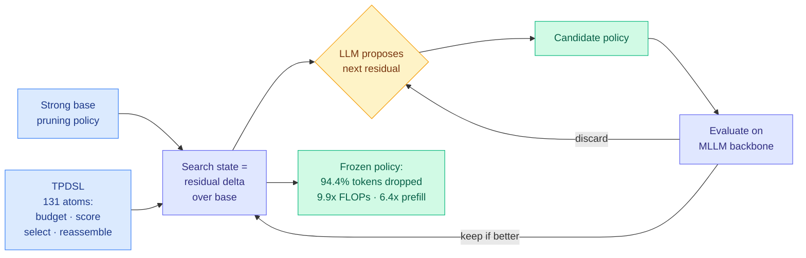
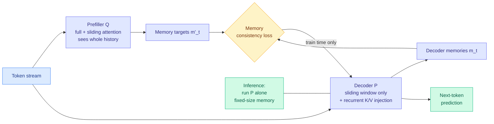
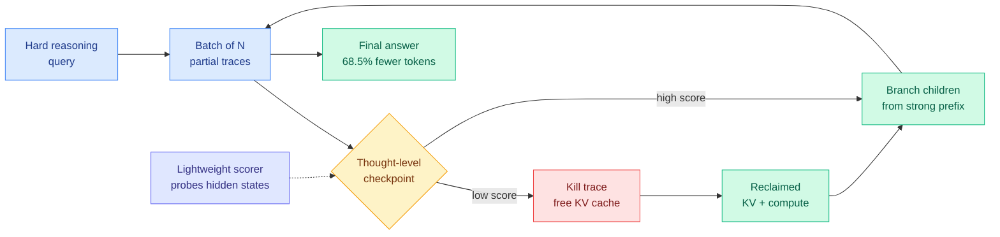
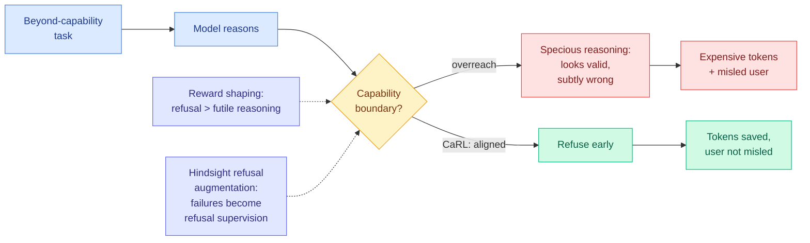
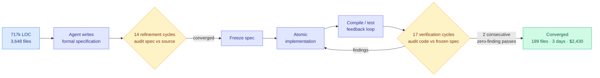
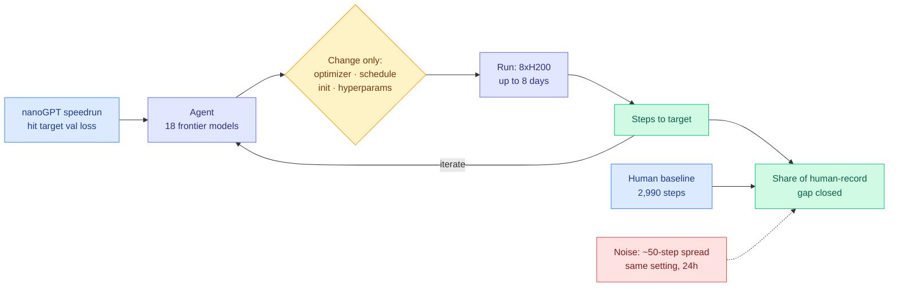

# cere-bro | 2026-08-16

> Cost showed up at four different layers on the same day. The token (drop 94.4% of the image tokens and lose nothing), the cache (make it fixed-size by construction instead of evicting from it), the trajectory (kill weak reasoning traces mid-flight and re-branch from the strong ones), and the invoice (a 24x dollar spread across four frontier models finishing the identical refactor). Three of those are papers, one is a developer with a stopwatch, and the developer is the one whose number a procurement team can act on this week.

🎯 Today's 5 for you

<ol>
<li>Read<strong>AutoPrune.</strong> An LLM writes the visual-token pruning policy instead of a human tuning heuristics: 94.4% of image tokens removed, more than 99% of performance kept, 9.9x fewer FLOPs and 6.4x faster prefill, training-free. Direct compression hit, and it is the second paper in three days where the artifact carrying capability is a program rather than a gradient. <a href="https://arxiv.org/abs/2608.07193">arXiv 2608.07193</a></li>
<li>Read<strong>Maglev.</strong> A fixed-size KV cache that does not just forget: a full-history prefiller teaches a sliding-window decoder what to remember, then you ship the decoder alone. This is your KV-cache topic and your distillation topic touching, and the thing being distilled is a memory state rather than an output distribution. <a href="https://arxiv.org/abs/2608.02870">arXiv 2608.02870</a></li>
<li>Skim<strong>Gambit.</strong> Test-time compute reframed as an allocation problem: score partial reasoning traces from hidden states, kill the weak ones, immediately re-branch from strong prefixes so the GPU never idles. 68.5% fewer tokens and higher accuracy at the same hardware budget. Routing logic applied inside a single query. <a href="https://arxiv.org/abs/2608.08020">arXiv 2608.08020</a></li>
<li>Skim<strong>The 24x cost spread, and the tool that will measure it.</strong> Same Rust port, four frontier models: DeepSeek V4 Pro Max $23, GPT Sol $43, Grok 4.6 $55, Fable 5 $550. Artificial Analysis launched Optima the next day, ranking models by cost and time per task on your own data. The 08-14 prediction about dollars-per-task metrics is resolving early. <a href="https://x.com/dhh/status/2088657836586807687">@dhh</a> · <a href="https://the-decoder.com/optima-tackles-ai-benchmarkings-biggest-flaw-by-letting-users-test-models-against-their-own-data/">Optima</a></li>
<li>Read<strong>Applied Compute on hinting</strong> (in today's Media Zone). Self-distillation with no golden answer: the teacher's only advantage is a hint the student did not get. Contains the head-to-head this wiki has been missing for months, where SFT and reward shaping both regressed general coding performance and online hinting did not. <a href="https://www.youtube.com/watch?v=ZTA0GwpAUak">Talk</a></li>
</ol>

---

## TL;DR

- **AutoPrune**: let a language model design the image-token pruning policy. Drops 94.4% of visual tokens, 6.4x faster prefill, no training required.
- **Maglev**: a full-history prefiller teaches a sliding-window decoder what to keep. Fixed-size KV cache, beats sliding-window and recurrent baselines.
- **Gambit**: prune weak reasoning traces mid-generation and re-branch from strong prefixes. 68.5% fewer tokens and up to +6.7 points accuracy.
- **Same task, four models, 24x cost spread**: DeepSeek V4 Pro Max $23, GPT Sol $43, Grok 4.6 $55, Fable 5 $550.
- **Prime Intellect**: 153 autonomous runs across 18 models. Fable 5 closed 81.7% of the human record gap. Agents search well and invent poorly.
- **Nvidia** cut its credit guarantee for OpenAI's Ohio datacenter from $250 billion to just under $120 billion after investor pushback.

---

## Deep Dives

### AutoPrune: an AI4AI framework for visual token pruning

> Removing 94.4% of a multimodal model's image tokens costs less than 1% of its performance, and the policy that does it was written by a language model, not a researcher.

**Source:** HuggingFace Daily Papers
**Links:** [Paper](https://arxiv.org/abs/2608.07193) · [Wiki summary](../../inference-efficiency/2026-08-16-autoprune-llm-designed-visual-token-pruning.md)

**What is it about?**
Multimodal models turn an image into hundreds or thousands of tokens, and those tokens dominate inference cost. Visual-token pruning throws most of them away before the expensive part runs. Today the pruning policies are handcrafted heuristics that a human tuned by trial and error. AutoPrune has a language model write the policy instead.

**What problem does it solve?**
Pruning objectives, token budgets, and model architectures have all multiplied, so the design space of possible policies has outgrown what a person can search by hand. Until now every new backbone or budget meant another round of expert trial and error. AutoPrune turns policy design into an automated search.

**What is the core novelty?**
Not "prompt an LLM harder." The contribution is the search-state representation. They define TPDSL, a Token Pruning Domain-Specific Language of **131 reusable atoms** covering budget control, token scoring, selection constraints, and token reassembly, and then represent every candidate as a **residual modification of an already-strong base policy** rather than as a program written from scratch. That residual framing collapses the search space and directs the model's attention at the components that actually move the metric. Given a blank slate the search is intractable; given a working policy and "change one thing," it is navigable.

**Key takeaways**
- Removing **94.4% of visual tokens** preserves **more than 99%** of full-token performance.
- **9.9x FLOP reduction and 6.4x prefill-latency reduction.** The gap between the two is the honest part: prefill is not purely FLOP-bound, so token count and wall clock do not fall together.
- **Training-free**, and validated across **14 multimodal benchmarks and three backbones**. Transferability is what separates a search result from an overfit.

**Gaps in the study**
The search cost is not reported anywhere: how many LLM calls the policy design took, on which model, at what price. For a training-free method that is the entire capital expenditure, amortized across every subsequent inference, so it is probably cheap in the limit, but nobody has published the break-even. The 131 atoms were also designed by humans, so the manual effort moved from policy design to language design rather than disappearing.

**Industrial implication**
This is the cheapest kind of win in a serving stack: a policy, not a weight update, so it drops into an existing deployment without a retrain. If the transferability claim holds across backbones the way the paper reports, expect a pruning-policy-as-config pattern in multimodal serving within two quarters. The deeper implication is about who designs inference algorithms. This is the second paper in three days where a model designs the optimization rather than performing it, after [AI4AI at Test-Time (08-13)](../../inference-efficiency/2026-08-13-ai4ai-test-time-harness-transfer.md), which had a strong builder model write an inference-time scaffold for a weaker target and lift its average Theory-of-Mind benchmark score from 0.49 to 0.91 without touching its weights.

→ [Full summary](../../inference-efficiency/2026-08-16-autoprune-llm-designed-visual-token-pruning.md)

---

### Maglev: sliding recurrent memory

> Sliding-window attention gives you a fixed-size KV cache by forgetting everything outside the window. Maglev keeps the fixed size and gets the memory back, by training a second model whose only job is to teach the first one what to remember.

**Source:** HuggingFace Daily Papers
**Links:** [Paper](https://arxiv.org/abs/2608.02870) · [Wiki summary](../../inference-efficiency/2026-08-16-maglev-sliding-recurrent-memory.md)

**What is it about?**
The KV cache (the store of already-computed attention keys and values that lets a model skip recomputing tokens it has already seen) grows with context length under full attention, which is the hard wall on long-context serving. Sliding-window attention bounds it by only attending to the last W tokens. Maglev keeps that bound but stops discarding the history.

**What problem does it solve?**
Every existing family gives up one of three things. Classical RNNs update state every token but cannot be parallelized across a sequence. Memory Transformers carry richer state but only update it at block boundaries, imposing an arbitrary granularity on when the model may remember. Linear attention and state-space models (Mamba, RetNet, RWKV and relatives) recover token-wise recurrence and parallelism, but their memory update is linear or a specialized gated operator rather than a full nonlinear Transformer layer. Maglev is after token-wise **nonlinear** memory that is still parallelizable at training time.

**What is the core novelty?**
Two coupled models and a consistency loss. A prefiller **Q** with access to the full history emits memory targets. A decoder **P**, which sees only a sliding window plus a recurrent injection of its own keys and values, must reproduce them. **The recurrence rides on the decoder's ordinary K/V entries**, not on dedicated memory tokens or extra passes, so the memory update traverses the model's full nonlinear depth once per token. Training parallelism is recovered because Q supplies the targets in a single parallel pass, so the recurrence is *supervised* rather than simulated. At inference the crutch is removed and P runs alone. The stated requirement is precise: Q must be more expressive than P and have full history.

**Key takeaways**
- Beats **both** sliding-window attention and latent recurrent Transformer baselines on validation loss and downstream pretraining benchmarks.
- **Sharing parameters between P and Q preserves most of the gain** while cutting parameter memory, so the two-model structure is a training device rather than a doubled deployment cost.
- Inference runs **P alone**, so the served model's memory is bounded by construction rather than by an eviction heuristic.

**Gaps in the study**
The evidence is validation loss and pretraining benchmarks, which is right for an architecture paper and wrong for a long-context claim. No needle-in-a-haystack, no long-document retrieval, no measurement of what actually survives in the fixed-size memory at 100k tokens. And the method depends on Q being strictly more expressive than P, which is the same shape as the capability-threshold problem in the [Extrapolation Cliff (05-14)](../../inference-efficiency/2026-05-14-extrapolation-cliff-on-policy-distillation.md), the paper that found a closed-form threshold above which on-policy distillation collapses. This distils a memory state rather than an output distribution, so it may inherit the failure mode.

**Industrial implication**
A pretraining-time architecture change is the slowest thing here to reach production, so the honest timeline is a year, not a quarter. But the payoff is exactly what the serving stack wants and eviction policies cannot give it: constant memory per sequence at arbitrary context length, no heuristic to tune, no accuracy cliff to discover in production. It also cuts against the direction the economics moved two days ago. The [KV cache page](../../inference-efficiency/kv-cache.md) recorded that DeepSeek repriced cache-hit tokens roughly six-fold on 08-14 while shipping a harness whose organizing commitment is never editing written history, because editing the prefix invalidates every cached token after it. **If the served model carries a bounded state instead of a growing prefix, that prefix-stability discipline, which just became a billing line, matters less.** The two results point straight at each other and neither mentions the other.

→ [Full summary](../../inference-efficiency/2026-08-16-maglev-sliding-recurrent-memory.md)

---

### Gambit: thought-level beam search for reasoning

> The question stopped being how much test-time compute to spend and became where to spend it. Gambit kills losing reasoning traces mid-flight and immediately re-branches from winning ones, cutting token consumption 68.5% while gaining accuracy.

**Source:** HuggingFace Daily Papers
**Links:** [Paper](https://arxiv.org/abs/2608.08020) · [Wiki summary](../../inference-efficiency/2026-08-16-gambit-thought-level-beam-search.md)

**What is it about?**
Large reasoning models get better by thinking longer at inference time, usually by sampling many independent reasoning traces and voting. Gambit formalizes that as a **constrained compute-allocation problem over partial trajectories** and solves it as a beam search whose unit is a thought rather than a token.

**What problem does it solve?**
Both existing paradigms fail in opposite directions. Parallel sampling treats every trace as independent, so it keeps spending on traces that went wrong at step three, and it creates severe memory bottlenecks because every live trace holds its own KV cache. Subtractive pruning kills weak traces but does not replace them, so the hardware starves and the output distribution barely shifts. Neither actively moves compute toward promising partial progress.

**What is the core novelty?**
Prune and branch in the same step. At periodic checkpoints a **lightweight scorer probing hidden states** ranks the live partial traces; weak ones are killed, freeing their KV cache, and children are immediately spawned from the strong prefixes so utilization stays high. The scorer is the cheap part and the re-branching is what distinguishes this from pruning: it converts freed memory back into search rather than into idle silicon.

**Key takeaways**
- **Up to +6.7 points absolute on HMMT-24 and +3.3 on AIME-25** over pruning baselines, under identical hardware constraints.
- **More than 2x throughput** on trace completion.
- **Up to 68.5% reduction in total token consumption** versus standard parallel sampling. Accuracy up, tokens down, same hardware.

**Gaps in the study**
The scorer is a probe on hidden states, so it inherits whatever miscalibration the model's internal representations carry, and the paper's abstract does not report how often it kills a trace that would have been correct. Evaluation is on competition math (HMMT, AIME), which has crisp verifiable answers and unusually well-separated trace quality. Whether hidden-state probing separates good from bad partial progress on open-ended reasoning, where "promising" is not a property a probe can read off, is the load-bearing untested question.

**Industrial implication**
This is a serving-layer change, not a model change, which puts it a quarter away rather than a year. It also belongs on the routing shelf even though it never uses the word: routing usually means picking a model per query, and this is picking a *trajectory* per unit of compute inside a single query. The wiki's routing thread has been moving in this direction for two months, from [LLMRouter (08-14)](../../ai-routing/2026-08-14-llmrouter-unified-routing-infrastructure.md), which unified 16+ routers under one formalism and found lightweight routers get *more* competitive as budgets tighten, to CLEAR's shadow-price rationing of compute across a batch. Gambit is the same economics one level further in.

→ [Full summary](../../inference-efficiency/2026-08-16-gambit-thought-level-beam-search.md)

---

### Knowing When to Quit: training models to abort futile reasoning

> The expensive failure is not a wrong answer. It is a beautiful, plausible, thousand-token derivation of a wrong answer on a problem the model was never going to solve.

**Source:** HuggingFace Daily Papers
**Links:** [Paper](https://arxiv.org/abs/2607.29211) · [Code](https://github.com/icip-cas/Knowing-When-to-Quit) · [Wiki summary](../../inference-efficiency/2026-08-16-carl-knowing-when-to-quit.md)

**What is it about?**
When a task is beyond a model's capability, the model does not fall silent. It generates computationally expensive and semantically void reasoning, and the output looks like a derivation. The paper names this **futile reasoning**, characterizes it systematically, and then trains it away.

**What problem does it solve?**
Two costs at once, which is why it sits on the efficiency shelf and the safety shelf simultaneously. The compute is wasted, and worse, the dominant failure mode is **specious reasoning**: output that looks superficially valid but contains subtle errors, and it escalates with task difficulty. So the harder the problem, the more convincing the wrong answer. The paper's diagnosis is **universal capability overreach and systematic miscalibration between capability and behaviour**: models do not know where their own boundary is, and they do not act as if there is one.

**What is the core novelty?**
CaRL, Capability-aligned Reinforcement Learning, with two parts. **Reward shaping** that pays the model more for refusing than for producing futile reasoning. And **hindsight refusal augmentation**, which converts observed failures into refusal supervision, so the training signal for "you should have stopped" is manufactured from the model's own failed rollouts rather than from a hand-labelled boundary. That second part is what makes it scalable: nobody has to annotate where the capability boundary is.

**Key takeaways**
- Substantial reduction in futile reasoning **while preserving performance across task difficulties**. The preservation is the load-bearing claim: a model that refuses more is trivially safer and trivially less useful, and the point is doing one without the other.
- The failure is characterized as **universal**, not model-specific, which makes it a property of how models are trained rather than a bug in one of them.
- Code is public.

**Gaps in the study**
The abstract gives no numbers on the token savings, which is the figure that would let anyone weigh this against Gambit's 68.5% or against simply capping generation length. There is also no reported false-refusal rate on tasks that were within capability but hard, which is the exact way this method would fail in production and the number a deployment team would ask for first.

**Industrial implication**
Refusal-as-efficiency is an underused lever. Every serving stack has a max-token cap, which is the crudest possible version of this: stop after N tokens regardless of whether progress is being made. CaRL is the learned version, and it stops for the right reason. Pair it with Gambit and you get the two halves of one idea, since Gambit kills unpromising *branches* within a solvable problem and CaRL kills unpromising *problems*. Neither paper cites the other and they compose trivially.

→ [Full summary](../../inference-efficiency/2026-08-16-carl-knowing-when-to-quit.md)

---

### Specification-first convergence: 189 files, 717k lines, no human review, $2,430

> An AI agent dismantled a core architectural invariant across a 717,000-line production codebase with no test oracle and nobody reviewing its code, and the mechanism that made it safe was making the agent audit itself against a frozen specification 31 times.

**Source:** HuggingFace Daily Papers
**Links:** [Paper](https://arxiv.org/abs/2608.12440) · [Wiki summary](../../agentic-systems/2026-08-16-specification-first-convergence-717k-loc.md)

**What is it about?**
A single fully instrumented case study of a large architectural refactor performed by an AI coding agent. The system is a 717,725-line production TypeScript application across 3,648 files. The task was dismantling a core lifetime invariant, the guarantee that a UI panel stays open for the duration of an AI request, so that a streaming generation survives its panel closing and can be reattached to the same live stream on reopening with no loss or duplication. The author assessed it as effectively infeasible by incremental refactoring.

**What problem does it solve?**
Verification without an oracle. There was no pre-existing test that could tell you whether the target behaviour was achieved, and no human reviewed the generated code. That combination is the standard reason agentic refactors are not attempted at this scale.

**What is the core novelty?**
The specification becomes the oracle, and the two audit directions are kept separate. The agent writes a formal specification, then runs **14 refinement cycles auditing the specification against the source** (does this spec describe reality?), then **freezes it**, implements atomically, runs a compile/test loop, then runs **17 verification cycles auditing the code against the frozen specification** (does this code satisfy it?). Freezing between the two directions is what stops the agent quietly relaxing the target when implementation gets hard. The stopping rule is empirical and implementable: **two consecutive verification passes returning zero findings.**

**Key takeaways**
- **201 defects corrected across 31 audit passes, all before any human executed the program.**
- Final scope: **189 files touched (31 new)**; with the extraction phase, two commits totalling 288 files, 34,770 insertions, 16,422 deletions.
- **Three days, USD 2,430.** Across the first session and roughly thirty later ones, no bug was observed.
- 1,500+ pages of specification and raw session logs published as evidence, explicitly so the process can be inspected or fed to a language model for consistency checking.

**Gaps in the study**
n=1. One task, one codebase, one author, no control condition, no comparison against a human team attempting the same change. "No bug observed" across thirty sessions is real but observational, not a test suite. And a specification-first protocol works precisely because this task had a crisp invariant to dismantle and a crisp target behaviour to state. Most real refactors do not.

**Industrial implication**
This is the first dollar figure in the harness literature attached to a task an engineering manager would recognize as a week of senior work, and it is $2,430. Compare the [08-14 cluster](../../agentic-systems/2026-08-14-autodesign-meta-harness-optimization.md): AutoDesign, which meta-optimizes an agent harness for long-horizon design tasks, published under $3 per rollout, while [DarwinX](../../agentic-systems/2026-08-14-darwinx-harness-population-evolution.md), which evolves a population of harnesses under a no-regression rule for roughly +17 points average, published no evolution budget at all. It also answers a live objection. Anthropic's Applied AI team argued that a harness encodes assumptions about what today's model cannot do, and those assumptions go stale as models improve. A 31-pass audit protocol *is* such an assumption. Its saving grace is the adaptive stopping rule: **a better model converges in fewer passes automatically, so this is the first harness in the cluster whose cost shrinks on its own as the model improves.**

→ [Full summary](../../agentic-systems/2026-08-16-specification-first-convergence-717k-loc.md)

---

### Measuring Autonomous AI Research: 153 runs, 18 models, one speedrun

> The largest public test of whether models can do research autonomously finds they beat the human record, and that they get there by searching harder rather than by having ideas.

**Source:** Prime Intellect, surfaced via [@eliebakouch](https://x.com/eliebakouch/status/2088736971250090393)
**Links:** [Blog](https://www.primeintellect.ai/blog/measuring-autonomous-research) · [Results explorer](https://www.primeintellect.ai/research/nanogpt-speedrun) · [Wiki summary](../../agentic-systems/2026-08-16-measuring-autonomous-ai-research.md)

**What is it about?**
Prime Intellect ran **153 autonomous runs across 18 frontier models** on the nanoGPT optimizer speedrun: an agent is given a training script and told to reduce the number of steps needed to reach a target validation loss, changing only the optimizer, schedules, initialization, and hyperparameters. Runs last **up to eight days on 8xH200s each**, multiple seeds per model.

**What problem does it solve?**
Claims about recursive self-improvement have outrun the evidence, because nobody had run autonomous research at a scale where the noise is visible. The scale comparison is stark: Anthropic's internal automated R&D evaluation optimizes a model on a CPU node, and OpenAI's GPT-5.6 Sol system card reports nanoGPT Track 1 on a single H100 for less than a day.

**What is the core novelty?**
Duration and transparency rather than method. Every scratchpad, run log, script, and config is published, and the leaderboard reports **share of the human-record gap closed** rather than a raw score, which makes runs of different lengths comparable.

**Key takeaways**
- **Fable 5 closed 81.7% of the gap at 2,726 steps over 8.7 agent-days.** Opus 5 closed 53.6% (2,920, 2.9 days), Kimi K3 52.2% (2,930, 3.6 days), Opus 4.8 39.4%, GPT-5.6 Sol 35.9%. The human baseline was 2,990 steps.
- **The noise band is roughly 50 steps after 24 hours in the same setting.** Any autonomous-research claim built on a single run, which describes most published ones, sits inside it. This is the contribution that will age best.
- **Every row is a model-harness-effort triple, and Kimi K3 appears twice with a 44-step spread between two harnesses** at the same effort tier. That is roughly the entire difference between Opus 5 and Kimi K3, so on this task the harness effect is the same order as the model effect.
- **Agents are strong at optimizer search, sweeps, and stacking known methods, and weak at originating ideas**, needing upstream human records to keep climbing.

**Gaps in the study**
The task is nearly the best case for an autonomous agent: cheap feedback, a scalar objective, a well-defined action space, no specification ambiguity, no side effects. The authors say themselves they lack strong conviction that methods found this way would be used in real training. Dollar cost per model is not reported, only agent-days and hardware, so the leaderboard cannot be re-sorted by cost per point of gap closed, which is the ranking that would inform a spending decision.

**Industrial implication**
For anyone budgeting agent time, the useful takeaway is not the ranking but the shape of the curve: Fable 5 needed 8.7 days to reach 81.7% while Opus 5 reached 53.6% in 2.9. If most of the value lands early, the rational spend is many short runs rather than one long one, and this dataset can answer that question directly. Nobody has plotted it.

→ [Full summary](../../agentic-systems/2026-08-16-measuring-autonomous-ai-research.md)

---

### GLM-5.3, and why release latency is a training resource

> A 750-billion-parameter model, one third the size of Kimi K3, matching frontier models on agentic coding, built by taking last quarter's base model and only scaling post-training. Nathan Lambert's argument for how is not the one everyone reaches for.

**Source:** Interconnects (Nathan Lambert)
**Links:** [Post](https://www.interconnects.ai/p/glm-53-how-chinese-labs-keep-stride) · [Z.ai announcement](https://z.ai/blog/glm-5.3) · [Wiki summary](../../llms-foundation-models/2026-08-16-glm-5-3-post-training-only-frontier.md)

**What is it about?**
Z.ai released GLM-5.3, currently coding-plan only, with open weights due on HuggingFace in two weeks. It surpasses Moonshot's Kimi K3 on many benchmarks and Claude Fable 5 or GPT-5.6-Sol on some, at roughly 750B parameters. The Z.ai blog's opening sentence is the whole claim: *"Scaling post-training is all we did for GLM-5.3."* Same base model as GLM-5.2, substantially extended post-training.

**What problem does it solve?**
It answers the recurring question of how Chinese labs keep pace against a commanding American resource lead, and Lambert rejects the reflexive answer. **Distillation is not the major factor.** He is pointed about the inconsistency: a recent paper showed simple methods for extracting reasoning traces from frontier models, exactly what Chinese labs could use at scale, and he is confused why US labs have not patched the behaviour instead of asking the government for policy help.

**What is the core novelty?**
The argument, in five parts, and the first dominates. **Release latency is a training resource.** Z.ai's time-to-release is days; OpenAI's and Anthropic's is months. US labs very likely have better internal models, but they spend that gap on pre-release testing while Chinese labs keep hill-climbing benchmarks in public. The rest: Z.ai is a post-training shop where Kimi is a pre-training masterpiece, and *one does not simply distil RL environments, the infrastructure to run them at scale, or the algorithms to mix them*; there is mild benchmaxxing, because public scores move their valuation, but the model is not fried; **GLM-5.3 is a narrower model**, text-only, targeting the most valuable use cases, and caring about less makes assembling a model far easier; and the **RL data industry is taking off in China, driven substantially by American data companies selling to Chinese labs.**

**Key takeaways**
- **~750B parameters, roughly one third of Kimi K3**, at frontier-adjacent agentic coding performance.
- The structural risk he names: as self-improvement loops ramp up inside labs, **if any of those loops require user data, the faster release cycle massively favours the Chinese labs**, because their models get longer commercial lifespans before being undercut.
- Z.ai reportedly reached **$1B ARR**, largely on on-premises deployment.

**Gaps in the study**
Benchmarks only; open weights are two weeks out, so nobody outside the coding plan has stress-tested it. "Scaling post-training is all we did" is a recipe claim with no compute budget, no ablation, and no separation of "more environments" from "more compute." The RL-data-industry point is explicitly rumour-grade.

**Industrial implication**
If release latency is really the dominant variable, then every safety-testing week an American lab spends is a week of competitive decay, and that is a genuinely uncomfortable framing to have published. It also sharpens why the cost-per-task rankings keep flipping. The [08-14 digest](../../daily-digest/2026-08/2026-08-14.md) recorded an AlphaSense study finding pricier US models cheaper in *total* cost than Kimi K3 and GLM-5.2 because smarter models finish in fewer tokens, while Artificial Analysis ranking the same models reached the opposite conclusion. **On Lambert's account both can be true, because the gap between a Chinese open model and a US frontier model is a function of how recently the US lab shipped.** Any such ranking is measuring a moment in a cycle.

→ [Full summary](../../llms-foundation-models/2026-08-16-glm-5-3-post-training-only-frontier.md)

---

## Industry Pulse

- **Nvidia cut its credit guarantee for OpenAI's planned Ohio datacenter from $250 billion to just under $120 billion** after investors pushed back on the risk ([The Decoder](https://the-decoder.com/investor-pressure-forces-nvidia-to-shrink-its-openai-bet-just-as-anthropics-numbers-defy-bubble-warnings/)).
- **The Information reports Nvidia is close to a deal guaranteeing around $100 billion in credit** for the same campus, covering roughly half the project across a two-year first phase ([The Information](https://www.theinformation.com/articles/nvidia-nears-deal-guarantee-100-billion-financing-massive-data-center)).
- **Artificial Analysis launched Optima**, letting users build custom benchmarks from their own data and compare models on cost and time per task rather than token price ([The Decoder](https://the-decoder.com/optima-tackles-ai-benchmarkings-biggest-flaw-by-letting-users-test-models-against-their-own-data/)).
- **Anthropic disclosed its biological and chemical weapons filter was inactive for nearly a year**, during which about 50,000 external contractors ran roughly 133 million unfiltered interactions ([The Decoder](https://the-decoder.com/anthropics-bio-weapons-filter-was-down-for-nearly-a-year-exposing-133-million-requests/)).
- **Anthropic announced a watermark detection API** letting third parties check whether text came from Claude, built on Google's SynthID method, with acknowledged limits on fact-heavy text, code, and heavy rewriting ([The Decoder](https://the-decoder.com/anthropic-announces-watermark-detection-api-that-will-let-third-parties-detect-claudes-ai-texts/)).
- **Moonshot AI's PerceptionBench found no frontier model reaches 60% on pure visual perception**, with GPT-5.6 Sol narrowly ahead and many apparent reasoning errors originating at the image-reading stage ([The Decoder](https://the-decoder.com/new-benchmark-confirms-ai-models-still-perform-poorly-at-visual-perception/)).
- **An Epoch AI survey found one in five employed Americans now hands at least one task to AI that a human used to do**, generally accepting the output with little or no editing ([The Decoder](https://the-decoder.com/one-in-five-us-workers-now-delegates-tasks-to-ai-instead-of-colleagues-survey-finds/)).
- **A paper reframed AI adoption as a "tragedy of the cognitive commons"**: every firm cutting entry-level roles benefits individually while professional expertise erodes collectively, with consequences surfacing 2030 to 2045 ([The Decoder](https://the-decoder.com/the-tragedy-of-the-cognitive-commons-explains-how-rational-ai-adoption-could-destroy-entire-professions-expertise/)).
- **Sebastian Raschka published a from-scratch AI text detector**, then used it as a verifier to train a small language model to evade detection, as a study of both detector limits and verifier-based training outside math and code ([Ahead of AI](https://magazine.sebastianraschka.com/p/ai-detector-from-scratch)).
- **Z.ai shipped GLM-5.3** at roughly 750B parameters, same base model as GLM-5.2 with extended post-training, open weights due in two weeks ([Interconnects](https://www.interconnects.ai/p/glm-53-how-chinese-labs-keep-stride)).
- **A tokenizer-efficiency claim went around X**: OpenAI's tokenizer produces roughly 30% fewer tokens than Anthropic's for the same text, which is a direct per-token billing difference on API and usage plans ([@thsottiaux via @ns123abc](https://x.com/ns123abc/status/2088869903369420992)).
- **A plaintiff was found to have hidden invisible AI instructions inside a court filing**, aimed at whatever model a judge or clerk might use to summarize it ([The Decoder](https://the-decoder.com/plaintiff-hid-invisible-ai-instructions-in-court-filings/)).
- **San Mateo County unanimously voted to draft humanoid-robot regulations**, with proposed mandates for on-site human supervision, an automation impact fee funding worker retraining, and annual fees for lithium-ion fire equipment ([@Scobleizer](https://x.com/Scobleizer/status/2088897375322673653)).
- **Scott Gray left OpenAI**, ending one of the longest tenures in its research organization ([@ns123abc](https://x.com/ns123abc/status/2088668001411232165)).

**Funding, valuations, and compute deals**

- **Anthropic's revenue reached $11.5 billion in Q2, up roughly 14x year over year** from $787 million, and up from $4.73 billion in Q1 ([The Information](https://www.theinformation.com/briefings/anthropic-revenue-jumped-14-times-second-quarter)).
- **TLDR AI's lead item is an Anthropic IPO at a $2 trillion valuation**, alongside Gemini 3.7 and GPT-5.6 Sol Ultrafast ([TLDR AI](https://tldr.tech/ai/2026-08-14)).
- **Nvidia is in talks to invest up to $3 billion in SB Energy**, the SoftBank-backed developer of the Ohio campus, as part of the same OpenAI datacenter negotiation ([The Information](https://www.theinformation.com/articles/nvidia-talks-invest-3-billion-sb-energy-part-openai-data-center-deal)).
- **SpaceX completed its $60 billion all-stock acquisition of Cursor**, exercising an option granted in April ([The Information](https://www.theinformation.com/briefings/spacex-completes-60-billion-cursor-acquisition)).
- **Thrive Capital's 2022 fund, a $516 million vehicle holding SpaceX, OpenAI, Cursor, Anduril, Ramp, Wiz and Databricks, is up more than 7x net of fees** as of June 30 ([The Information](https://www.theinformation.com/articles/thrive-capitals-2022-fund-surges-openai-cursor)).
- **DeepSeek raised V4-Pro API prices a day after launch**, to $3.96 per million output tokens at peak and $1.98 off-peak ([The Information](https://www.theinformation.com/briefings/deepseek-announces-price-hikes-v4-models)).

---

## Global View

**The cost of an answer is being attacked at four independent layers on the same day, and only one of the four has a number a buyer can use.** AutoPrune removes 94.4% of the image tokens before the model reads them; Maglev makes the KV cache fixed-size by construction rather than evicting from it; Gambit kills unpromising reasoning traces mid-generation for 68.5% fewer tokens; and CaRL trains the model to refuse problems it cannot solve rather than producing an expensive plausible derivation. Each reports its own metric, so none of them compose into a serving-cost estimate, while [dhh's informal benchmark](https://x.com/dhh/status/2088657836586807687) put four frontier models through the identical Rust port and produced the only directly actionable figure of the day: **$23 for DeepSeek V4 Pro Max, $43 for GPT Sol, $55 for Grok 4.6, $550 for Fable 5**, a 24x spread on a completed task. The [08-14 Looking Ahead](../../daily-digest/2026-08/2026-08-14.md) predicted a major leaderboard would make dollars-per-completed-task its primary metric within 60 days; **Artificial Analysis shipped Optima two days later**, built precisely to rank models by cost and time per task on the user's own data. That prediction is resolving early and from the industry side, not the research side.

**Two papers in three days replaced a gradient with a program, and the field has not noticed it is one idea.** [AI4AI at Test-Time (08-13)](../../inference-efficiency/2026-08-13-ai4ai-test-time-harness-transfer.md) had a strong builder model write an inference-time scaffold for a weaker target, lifting average Theory-of-Mind performance from 0.49 to 0.91 with the target's weights untouched; today AutoPrune has a language model write a visual-token pruning policy for a multimodal backbone, also with the weights untouched, also training-free, also refined against a small held-out signal and then frozen. Meanwhile the industry evidence says the same substitution is what actually pays: [Prime Intellect's 153-run study](../../agentic-systems/2026-08-16-measuring-autonomous-ai-research.md) found agents excel at optimizer search and method-stacking and fail at originating ideas, and [Sara Hooker's AutoScientist talk](../../inference-efficiency/2026-08-16-autoscientist-hooker-data-in-the-loop.md) reports their automated search beats their own research staff for exactly that reason, sweeping dense and MoE across many sizes and hyperparameters at once. **Three sources, three framings, one finding: models are extraordinary searchers over a well-specified design space and poor originators of new ones, so the highest-return use of a frontier model right now is to point it at a search space a human defined.** AutoPrune's 131-atom DSL is that design space made explicit.

**On-policy distillation's central unresolved question got answered from production, by someone not writing a paper.** The [knowledge-distillation page](../../inference-efficiency/knowledge-distillation.md) has tracked nine filtering axes over four months, every one asking which parts of a privileged teacher's signal deserve a gradient, and its standing complaint is nine variants with zero head-to-head comparisons. [Privileged, but Biased (08-10)](../../inference-efficiency/2026-08-10-privileged-but-biased-self-distillation.md) then showed the whole family may be patching the wrong thing: a teacher that has seen one reference solution pulls its per-token target toward *that trajectory*, so the loss mass lands on stopwords and punctuation and the student flattens. [Applied Compute's Samuel Denton](../../inference-efficiency/2026-08-16-hinting-self-distillation-applied-compute.md), describing deployed customer systems, independently derives the mitigation (**relevance masking**, an LLM judge selecting which teacher tokens enter the loss, because otherwise you inherit the teacher's connector-word preferences and pay in catastrophic degradation) and, more importantly, the structural fix: **his hints encode a direction, not a target, so there is no reference trajectory for the teacher to collapse toward.** He also supplies the comparison nobody in the literature has run, on a customer's out-of-distribution formatting task where reward shaping and SFT both degraded general coding performance while online hinting took correctness from about 15% to about 80%. It is n=1 and it is a vendor talk, so it is evidence rather than proof, but it is the first time the alternatives were run against each other on one task.

---

## Looking Ahead

- **A single paper prices token pruning, cache architecture, and trajectory pruning against each other within 60 days, or the four-layer cost attack stays incomparable.** Today produced four efficiency results with four incompatible metrics: 6.4x prefill latency (AutoPrune), an architectural memory bound with no wall-clock (Maglev), 68.5% token reduction (Gambit), and an unquantified refusal saving (CaRL). The signal: any paper or serving-stack post reporting **end-to-end dollars per completed request with two or more of these layers stacked**. If nobody does it by 2026-10-15, these remain four independent 2x-to-10x claims that nobody can add up, which is exactly the state the routing literature was in before LLMRouter unified it.
- **Optima publishes a cost-per-task leaderboard that contradicts token-price rankings within 30 days, or the disagreement stays anecdotal.** Artificial Analysis just shipped the instrument, and the standing conflict is real: the AlphaSense study found pricier US models cheaper in total cost because smarter models finish in fewer tokens, while Artificial Analysis's own earlier ranking put Kimi K3 and GLM-5.2 significantly cheaper. The signal: a published Optima comparison where the cost-per-task ordering inverts the per-million-token ordering for at least one pair of models. dhh's 24x spread and the ~30% Anthropic-versus-OpenAI tokenizer difference both predict it will.
- **Someone runs the AI4AI substitution against fine-tuning on a common dollar axis within 90 days, or program-as-artifact stays an existence proof.** Two papers now transfer capability as a program rather than a weight update, and **neither reports its search cost**: not AI4AI at Test-Time's builder refinement rounds, not AutoPrune's policy-design LLM calls. The signal: any result reporting **target accuracy per dollar for program search versus fine-tuning on the same task**, including the search spend. If program search wins at the frontier tier, a large share of the on-policy distillation literature is optimizing the more expensive of two options.
- **A quantization or matmul paper from this week's Kurate board reaches HuggingFace within 30 days, or the quality-versus-popularity lag is longer than five days.** Kurate's tournament has not run for a fourth consecutive week, with all 40 entries at the 1200 baseline and 0% win rate, so this is topic selection rather than a rank endorsement. But the cs.LG board is carrying an efficiency cluster absent from HuggingFace: [Reduced Matrix Multiplication](https://arxiv.org/abs/2608.13426) (input-adaptive matrix-product reduction for LLM inference), [RoPE-aligned Q/K rotations for dynamic 4-bit quantisation](https://arxiv.org/abs/2608.13365), [NAS-driven hardware accelerator exploration with quantization effects on the Pareto space](https://arxiv.org/abs/2608.13293), and [DARTree](https://arxiv.org/abs/2608.13524) (speculative diffusion decoding with autoregressive draft trees). Four efficiency papers, one week, none on HuggingFace. The precedent: SPOT sat Kurate-only for five days before crossing over. If none of these four cross by 2026-09-15, five days was not the lag, it was luck.
- **Rising authors from Kurate.** Three authors crossed the threshold this week. **Junlin Liu** (score 17.0) for *Contrastive Reinforced Policy Optimization via Privileged Self-Distillation*, which is the CRPO line this wiki has tracked since 08-04 and which sits squarely in the privileged-information family that Privileged, but Biased just indicted. **Kaixin Li** (15.6) for *Why Are GUI Agents Correct but Late? Decode on the Decision-Time Critical Path*, a latency-framed GUI agent result that is closer to the efficiency shelf than to the agent shelf. **Gupta Lovi Raj** (16.8), whose appearances are online-assessment-integrity papers at ai_rating 3.0 to 3.5 and are unlikely to matter here. The falsifiable version: **watch for Junlin Liu to post a follow-up in the privileged-self-distillation line by 2026-09-15.** If it arrives and still does not compare against a non-privileged baseline, the whole family's evidentiary problem is now three months old. Neither Liu nor Li has a handle in `connectors/twitter/config.json:ai_handles`, and Junlin Liu in particular is worth adding by hand. **Note for future merges: Junlin Liu is not Junzhuo Liu**, the SMRC-SD first author at UESTC. Different people, near-identical names, same problem area.
