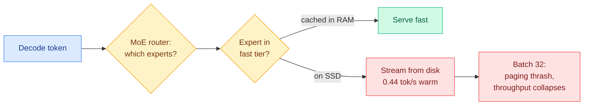

# cere-bro | 2026-08-24

> A quieter, research-heavy Monday whose most useful papers report what *didn't* work: training MoE routers for cache locality doesn't beat the memory-bandwidth wall, and RoPE-aligned 4-bit rotation doesn't beat plain Hadamard. Meanwhile HuggingFace's headline paper argues agent intelligence is moving from the individual model to the *graph* around it, the exact frame the wiki has been building.

🎯 Today's 5 for you

<ol>
<li>Read<strong>Cacheable by Design? (a pre-registered negative result).</strong> Serving a 235B MoE on one 8GB GPU is bottlenecked by memory bandwidth, not compute (0.44 tok/s warm). Training routers for cache locality does <em>not</em> break the wall. Rare, rigorous systems measurement at the routing × KV × memory-hierarchy intersection. <a href="https://arxiv.org/abs/2608.18261">Paper</a>.</li>
<li>Read<strong>RoPE-Aligned Q/K Rotations for 4-Bit Quant (also negative).</strong> A clean proof that only per-pair rotations commute with RoPE, then the honest finding that the head-shared pairwise config does not improve accuracy under W4A4KV4. Negative results in quantization geometry are signal. <a href="https://arxiv.org/abs/2608.13365">Paper</a>.</li>
<li>Read<strong>Reliability-aware on-policy distillation is now a cluster.</strong> REOPD (reliability-adaptive reward extrapolation) and ReOrder-OPD (reliability-aware prompt ordering) attack the same weakness: teacher reward isn't reasoning progress. The distillation sub-field to watch. <a href="https://arxiv.org/abs/2608.11698">REOPD</a> · <a href="https://arxiv.org/abs/2608.10905">ReOrder-OPD</a>.</li>
<li>Skim<strong>Graph Engineering in the Era of LLM Agents.</strong> The day's top HuggingFace paper (31 upvotes): agent intelligence moves from individual model to system, wired as a graph. Your #1 saved theme, one day before it explodes into Apodex / Prime Agent / Task-CoEvolve. <a href="../../agentic-systems/agent-harness-engineering.md">Concept page</a>.</li>
<li>Track<strong>StateMem: can agent memory track evolving state?</strong> Memory benchmarks test recall; this one tests whether an answer reflects the <em>current</em> world after facts get revised. Existing memory, RAG, and long-context baselines all struggle. Feeds the RAG-is-broken thread from 08-13. <a href="https://arxiv.org/abs/2608.19652">Paper</a>.</li>
</ol>

---

## TL;DR

- **Cacheable by Design?**: a 235B MoE on one 8GB GPU is memory-bandwidth-bound (0.44 tok/s warm). Training routers for locality doesn't beat the wall. Pre-registered negative result with real systems telemetry.
- **RoPE-Aligned 4-bit quant**: proves only per-pair rotations commute with RoPE, then reports the tested config doesn't beat full-head Hadamard under W4A4KV4. An honest null.
- **Reliability-aware OPD cluster**: REOPD + ReOrder-OPD both say teacher reward is an imperfect proxy for reasoning progress and model where it's unreliable.
- **Graph Engineering (HF headline, 31 upvotes)**: agent intelligence shifts from individual model to graph-wired system, one day before the 08-25 harness explosion.
- **StateMem**: memory systems must track evolving state, not just recall; current systems fail at it.

---

## Deep Dives

### Cacheable by Design? MoE Router Locality vs the Edge Memory-Bandwidth Wall

> Someone actually measured whether you can train a Mixture-of-Experts router to be cache-friendly enough to serve a 235B model on a gaming GPU. The answer, pre-registered, is no, and the measurements are the real contribution.

**Source:** Kurate cs.AI (Tier 1, persistent 4 days)
**Links:** [Paper](https://arxiv.org/abs/2608.18261)

**What is it about?** Serving a 235B-parameter MoE (mixture-of-experts, where each token activates only a few specialist sub-networks) on a single 8GB consumer GPU. The bottleneck is memory bandwidth, not compute: decoding must stream each token's active experts from wherever they live, and most sit on an SSD far slower than RAM.

**What problem does it solve?** It rigorously quantifies the "edge memory-bandwidth wall" and tests the tempting fix, can you *train* the router to route for cache locality so the working set fits in fast memory?

**What's the core novelty?** Two things. First, a systems measurement: on Qwen3-235B (Q4_K_M, 134GB), warm decode is 0.44 tok/s, exactly matching a bytes-per-token / bandwidth model, and a batching scheme that should amortize one disk sweep instead collapses at batch 32 from paging thrash. Second, a zero-surgery router-telemetry tool (llama-moe-trace) shows adjacent-token expert reuse is only 2.0x chance, 95% of traffic uses 52.5% of experts, and an LRU cache of 13.4% of experts serves 66% of requests. Then the pre-registered test: training 137M MoE models with auxiliary locality and domain router losses does *not* break the wall.

**Key takeaways**
- The wall is real and matches a simple bandwidth model, so it's predictable, not a tuning artifact.
- Natural expert reuse exists (a 13.4% LRU cache serves 66% of requests) but training for *more* locality doesn't help enough to matter.
- Pre-registration makes the negative result credible: they committed to the hypothesis before running it.

**Gaps in the study** The trainable-locality test is at 137M scale; whether the null holds at 235B (where the wall was measured) is an extrapolation. And LRU already captures much of the available locality, which may explain why training adds little.

**Industrial implication** For anyone trying to run big MoEs on consumer or edge hardware, this says: stop trying to train cache-friendly routers and instead attack bandwidth directly (better tiering, LRU caching of the hot 13.4%, or wafer-scale bandwidth like Cerebras CS-4). It quietly explains why local-MoE serving stays slow.

**Research angle** The paper's own telemetry (2x reuse, hot-13.4% LRU) suggests a *serving-time* caching policy could beat a *training-time* locality loss. Nobody tested a learned eviction policy against the measured reuse pattern, which is the natural follow-up.

---

### When Local Variance Optimality Is Not Enough: RoPE-Aligned 4-Bit Quantization

> A rare thing: a paper that proves the clean theoretical result, implements it optimally, and then honestly reports that it doesn't improve accuracy.

**Source:** Kurate cs.LG (Tier-1 content)
**Links:** [Paper](https://arxiv.org/abs/2608.13365)

**What is it about?** Rotation-based post-training quantization (reducing weights/activations to 4 bits after training) usually applies one orthogonal transform across a whole attention head to tame outliers. But RoPE (rotary position embedding) splits each head into 2D frequency pairs, so the question is whether a rotation that *respects* that pairing beats full-head mixing.

**What problem does it solve?** It settles the theory of which rotations are compatible with RoPE, and tests whether that compatibility buys accuracy in aggressive 4-bit settings (W4A4KV4: 4-bit weights, activations, and KV cache).

**What's the core novelty?** A converse theorem: for distinct frequencies, *no* single-head orthogonal map other than the known per-pair rotations commutes with RoPE. Then, for the head-shared parameterization, they derive the rotation angle that analytically minimizes the larger channel variance and verify the implementation hits that minimum. The honest result: this optimal head-shared pairwise configuration does *not* improve accuracy over plain full-head Hadamard in the tested W4A4KV4 setting.

**Key takeaways**
- The theory is tight (a proven converse), so this isn't a tuning failure, it's a real null for this configuration.
- "Variance-optimal" at the channel level does not translate to end-task accuracy, a useful cautionary result for the whole rotation-quantization line.

**Gaps in the study** It tests the head-*shared* configuration; a per-head (non-shared) RoPE-aligned rotation is left open and could still win. Four checkpoints is a modest sweep.

**Industrial implication** For 4-bit KV-cache quantization, this says the RoPE-aligned-rotation idea, intuitively appealing, isn't worth the complexity in its head-shared form. Stick with Hadamard until a per-head variant is shown to help.

**Research angle** The gap between local variance optimality and downstream accuracy is the interesting crack: it means the right objective for quantization rotations isn't channel variance. Deriving rotations against a task-loss surrogate instead is the unexplored direction.

---

### StateMem: Can Agent Memory Systems Track Evolving State?

> Memory benchmarks mostly test recall. This one tests something harder and more real: after the facts change, does the agent answer with the current state or a stale one?

**Source:** Kurate cs.AI (Tier 2, ai_rating 6.5)
**Links:** [Paper](https://arxiv.org/abs/2608.19652)

**What is it about?** As agents run longer, higher-stakes tasks, their memory has to track a *changing* world: facts, constraints, and decisions get revised, and answers must reflect the current state, not a superseded one. The paper names this capability "state tracking."

**What problem does it solve?** Existing memory benchmarks are recall-shaped (can you retrieve a fact you were told?). None isolate whether the system returns the *latest* version of a fact after it's been updated. StateMemBench (234 multi-session scenarios, two conversation-length regimes) does exactly that, with closed-pool grading that scores whether an answer reflects the current state, the superseded state, or neither.

**What's the core novelty?** The benchmark construction separates state-tracking failures from ordinary retrieval failures by design, and the paper proposes StateMem, a state-first memory system. The headline finding: state tracking is hard for existing memory systems, retrieval-augmented baselines, *and* long-context baselines alike.

**Key takeaways**
- Long-context and RAG both fail at state tracking, so "just use a bigger context" or "just retrieve" doesn't solve it.
- It gives the field a clean metric to separate "forgot the fact" from "remembered the old version."

**Gaps in the study** StateMem's own gains over baselines are the part to scrutinize; a state-first system should win on a state-tracking benchmark by construction, so the transfer to general memory tasks is the open question.

**Industrial implication** This is the concrete, measurable version of the 08-13 "RAG is a dead end / memory should be native" argument the reader bookmarked. For any agent that acts on revisable facts (schedules, prices, constraints), state tracking is the failure mode that matters, and this quantifies it.

**Research angle** State tracking is essentially versioned memory. Connecting it to the write→manage→read memory-engineering formalization (bookmarked 08-13) would give a principled account of when to overwrite vs append, which StateMem approaches empirically.

---

### Graph Engineering in the Era of LLM Agents (the day's HuggingFace headline)

> The top-voted paper of the day argues the unit of intelligence is shifting from the individual model to the *system* around it, wired as a graph. It's the survey the reader's saved bookmarks have been circling for weeks.

**Source:** HuggingFace Daily Papers, 24 Aug (31 upvotes, the day's top paper)
**Links:** referenced via the HuggingFace daily digest; connects to the [agent-harness-engineering concept page](../../agentic-systems/agent-harness-engineering.md)

**What is it about?** A position/survey on graph engineering for LLM-agent systems, subtitled "From Individual Intelligence to System Intelligence." It frames the field's move from prompting a single model to engineering the multi-agent, memory-carrying graph around it.

**Why it matters here.** This is the research-community version of the exact thesis the reader has been bookmarking (the loop → graph engineering articles synthesized into the harness concept page). Landing as the day's most-upvoted paper, one day before Apodex 1.1, Prime Agent, and Task-CoEvolve (08-25) all ship concrete harness/graph systems, it marks the moment "graph engineering" crossed from practitioner blog posts into the research mainstream. Treated at survey level here because the source is the HuggingFace headline rather than a fetched abstract; the substantive per-system claims are covered in the 08-25 harness Deep Dives.

**Industrial implication** When the top HuggingFace paper and the reader's private bookmark trail and next-day systems papers all converge on "engineer the graph, not the model," it's a strong signal the harness/graph layer is where the next year of agent tooling gets built.

---

## Industry Pulse

Monday's newsletters (Semiconductor Week 34, AI Breakfast, AI Weekly, Gary Marcus) were farmed overnight and are covered in full in the **[2026-08-25 digest](2026-08-25.md)** and the **[weekly review](2026-08-22-weekly.md)**. The short version:

- **Hardware (Semiconductor Week 34):** Micron plans a $10B research hub; Cerebras CS-4 ships three wafer-scale engines (750 PFLOPS); NVIDIA backs 4.25 GW of AI capacity for OpenAI; Marvell's Google warrant ties to up to $120B in custom silicon ([Semiconductor Newsletter](https://thesemiconductornewsletter.substack.com/p/week-34-2026)).
- **Models:** stealth model "Ox Alpha" (likely Zhipu's GLM-5.3) surfaces on OpenRouter; Anthropic tests early-access "Marshmallow" and "Melon" (likely Opus 5.1 / Sonnet 5.1) ([AI Breakfast](https://aibreakfast.beehiiv.com/)).
- **Agents:** NVIDIA's AVO coding agent scores 100% on ARC-AGI-3 with no instructions ([NVIDIA](https://x.com/NVIDIAAI/status/2090786258981466231)).
- **Essay:** Gary Marcus, "Two ways it might all fall apart," on how the AI bubble could burst gradually then suddenly ([Marcus on AI](https://garymarcus.substack.com/p/two-ways-it-might-all-fall-apart)).

---

## Global View

**Monday's best research was a pair of honest negative results, and that is worth pausing on.** Cacheable-by-Design (`2608.18261`) pre-registered the hypothesis that MoE routers can be trained for cache locality and reported that they can't beat the edge memory-bandwidth wall; RoPE-Aligned 4-bit quant (`2608.13365`) proved the clean rotation theorem and then reported the optimal head-shared config doesn't improve accuracy. Both are Tier-1 efficiency papers, and both are more useful than a hyped positive result because they close off a plausible-but-wrong direction with real measurement. Against the week's backdrop, where the 08-22 review found quantization quality is gated by calibration and geometry rather than bit-width, these two nulls sharpen the same lesson: the easy levers (train the router, rotate the head) are already near their limit, and the remaining gains are in the harder choices (bandwidth itself, per-head geometry, task-aware objectives).

**The graph-engineering headline is the research mainstream catching up to the reader's own curation.** "Graph Engineering in the Era of LLM Agents" topping HuggingFace on the same Monday that the reader's harness concept page is the most-developed page in the wiki, and one day before three concrete harness systems ship (08-25), is a three-way convergence: the paper community, the reader's private bookmark trail, and next-day systems research all arriving at "system intelligence lives in the graph around the model." When those three align, the theme is no longer speculative.

---

## Looking Ahead

- **A serving-time caching policy beats a training-time locality loss for edge MoE within 60 days.** Cacheable-by-Design's own telemetry (2x reuse, a 13.4% LRU cache serving 66% of requests) points there. Signal: a paper or llama.cpp/vLLM PR implementing learned expert eviction tuned to measured reuse, beating the trained-router baseline.
- **A per-head (non-shared) RoPE-aligned rotation revisits the 4-bit null within a quarter.** The paper explicitly leaves per-head open. Signal: a quantization paper reporting W4A4KV4 accuracy gains from per-head RoPE-compatible rotations.
- **State tracking (StateMem) becomes a standard axis in agent-memory papers by month-end.** It cleanly separates a failure mode long-context and RAG both hit. Signal: a new agent-memory system reporting StateMemBench numbers alongside recall benchmarks.
