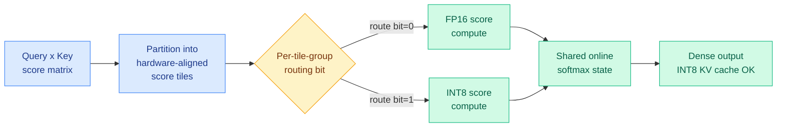
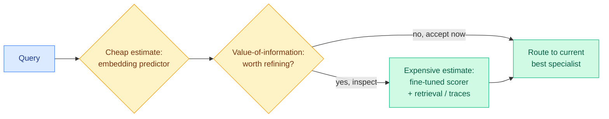
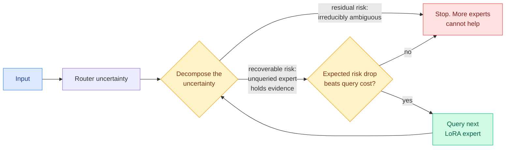
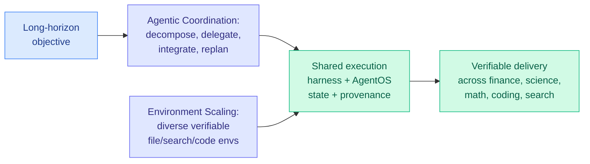
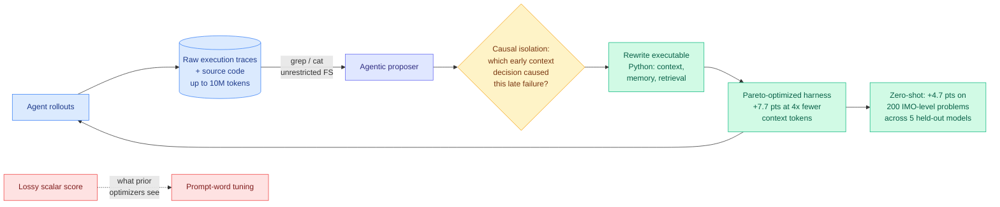
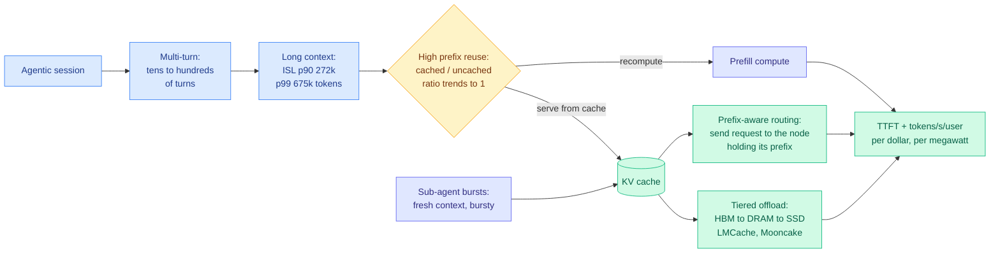

# cere-bro | 2026-08-25

> The harness stopped being a metaphor today: three papers ship it as a trained, self-optimizing, measurable object, while two others quietly move the efficiency frontier by making precision and routing into decisions rather than defaults.

🎯 Today's 5 for you

<ol>
<li>Read<strong>TileMix.</strong> Mixed-precision attention that makes numerical precision a spatial decision over score tiles inside fused dense attention: each tile runs FP16 or INT8, both feed one shared softmax, no training, supports INT8 KV caches. Recovers the long-context quality uniform INT8 loses while beating FP16 throughput. KV cache + quantization + GPU kernel in one. <a href="https://arxiv.org/abs/2608.17336">Paper</a>.</li>
<li>Read<strong>Pandora's Router.</strong> Model routing reframed as the classic Pandora's Box problem: estimating which specialist to use costs money, so a closed-form value-of-information rule decides per query whether refining the estimate is even worth it. The most principled routing formulation in a while. <a href="https://arxiv.org/abs/2608.20316">Paper</a>.</li>
<li>Read<strong>R2-OPD: filter distillation by reasoning progress.</strong> On-policy distillation assumes teacher reward equals reasoning progress; it often doesn't. R2-OPD suppresses teacher reward exactly where it disagrees with independently-estimated progress. Direct descendant of the disagreement-is-the-only-signal thesis. <a href="https://arxiv.org/abs/2608.19408">Paper</a>.</li>
<li>Read<strong>The harness explosion, and the number that punctures it.</strong> Your #1 saved theme owns the day: Meta-Harness (the Stanford/MIT paper you saved) gets 4x token compression at +7.7 points, Prime Agent lifts ARC-AGI-3 from 30% to 95.5%, Task-CoEvolve cuts harness-tuning cost 80%, and OpenAI reports 6x fewer tokens from harness-level context compaction. Then Microsoft's Thinkingbox reports 65.36% pass@1 falling to 25.25% pass^20 on stateful business work. Read them together. <a href="https://arxiv.org/abs/2608.19741">Thinkingbox</a> · <a href="../../agentic-systems/agent-harness-engineering.md">concept page</a>.</li>
<li>Skim<strong>SemiAnalysis AgentX: agentic inference is a KV-cache problem now.</strong> They spent $3M building an open 1M-context multi-turn agentic coding benchmark from 393 real Claude Code traces, and 70+ upstream PRs across vLLM, SGLang, TensorRT-LLM, LMCache, and Mooncake now optimize against it. Sessions run p90 input length 272k, p99 675k, with prefix reuse trending toward 1. Your serving-cost axis, measured properly for the first time. <a href="https://newsletter.semianalysis.com/p/agentx-inferencexv3-does-cuda-moat">SemiAnalysis</a>.</li>
</ol>

---

## TL;DR

- **TileMix**: route numerical precision tile-by-tile inside dense attention (FP16 or INT8 per tile, shared softmax). No training, works with INT8 KV caches, recovers quality uniform INT8 loses.
- **Pandora's Router**: routing is optimal search with costly inspection. A closed-form value-of-information rule decides when estimating a model's fit is even worth the cost.
- **R2-OPD**: on-policy distillation over-trusts teacher reward. Suppress reward where it disagrees with independently-measured reasoning progress; reasoning improves.
- **Apodex 1.1**: a 35B model reaches the frontier performance band on real professional work through a shared execution harness plus coordination-scaling, not a bigger model.
- **Task-CoEvolve + Prime Agent**: harness optimization is now measurable and self-improving. Task-CoEvolve cuts eval cost 80%; Prime Agent takes ARC-AGI-3 from 30% to 95.5%.
- **Thinkingbox**: agents pass 65.36% of stateful business workflows once, but only 25.25% of the time on all twenty tries. Failures terminate cleanly.
- **SemiAnalysis AgentX**: agentic traffic now dominates production inference. Prefix reuse trends toward 1, so KV cache becomes the bottleneck.
- **Hardware**: Micron $10B research hub, Cerebras CS-4 (750 PFLOPS), NVIDIA 4.25 GW for OpenAI, Marvell-Google custom-silicon warrant up to $120B.

---

## Deep Dives

### TileMix: Tile-Centric Mixed-Precision Attention

> Precision stops being a global setting and becomes a per-tile decision inside the attention kernel, so long-context prefill gets INT8 speed without INT8's quality loss.

**Source:** HuggingFace Daily Papers
**Links:** [Paper](https://arxiv.org/abs/2608.17336) · [Code](https://github.com/HanzhiZhang-Ulrica/TileMix) · [Wiki summary](../../inference-efficiency/2026-08-25-tilemix-tile-centric-mixed-precision-attention.md)

**What is it about?** Long-context prefill (processing the whole prompt before generation) is dominated by dense self-attention, whose query-key score matrix grows quadratically. TileMix is a kernel that splits that score matrix into hardware-aligned tiles and decides, per tile group, whether to compute it in FP16 or INT8.

**What problem does it solve?** Existing low-precision attention either drops everything to one low precision (uniform INT8, which loses long-context quality) or sparsifies by picking which token interactions to keep (which breaks dense connectivity). Neither does *spatial precision routing* inside fused dense attention. TileMix fills that gap.

**What's the core novelty?** Precision becomes an executable spatial decision. Routing bits are packed into compact bitmasks, each bit can govern several adjacent key tiles (scalable grouping keeps metadata small at long context), and both the FP16 and INT8 paths update one shared online-softmax state so the output stays a single dense attention result. It needs no training and supports grouped-query attention, variable-length batches, and INT8 key/value caches.

**Key takeaways**
- Routes *all* legal tile groups, so dense token connectivity is preserved (not a sparse-attention approximation).
- Recovers the long-context quality lost under uniform INT8 while improving prefill throughput over FP16 on A100.
- Gives a controllable accuracy-efficiency frontier across LLaMA, Qwen, and Vicuna on LongEval and LV-Eval.

**Gaps in the study** Prefill-focused; the decode-phase story and end-to-end serving latency under real batching are not the headline. The routing-bit policy's own overhead at very long contexts is asserted-small rather than deeply ablated here.

**Industrial implication** This is the KV-cache/quantization/kernel intersection the reader tracks, expressed cleanly: precision routing is the same idea as model routing, one level down in the stack. Expect this to show up in vLLM/SGLang-style serving kernels within a couple of quarters, because it is training-free and composes with INT8 KV caches already in production.

**Research angle** TileMix routes precision *spatially*; nobody yet routes it *temporally* across decode steps, or learns the routing policy instead of using a heuristic. A learned tile-precision router trained against downstream loss is the obvious next paper.

---

### Pandora's Router: Efficient Allocation with Costly Value Estimation

> Routing has always assumed you know each model's expected quality for free. This paper prices that assumption and derives when it is worth paying.

**Source:** Kurate cs.AI weekly leaderboard (ai_rating 6.5), a routing paper
**Links:** [Paper](https://arxiv.org/abs/2608.20316)

**What is it about?** Heterogeneous systems of many models/harnesses route each query to the specialist that answers best at lowest cost. But knowing which specialist is best requires *estimating* each one's expected return, and good estimates aren't free.

**What problem does it solve?** Cheap estimators (embedding predictors) are fast but noisy; accurate ones (fine-tuned scorers with retrieval or partial reasoning traces) are expensive. Prior routing work treats value estimation as free. This paper makes the *cost of deciding* a first-class term.

**What's the core novelty?** It formalizes routing as an instance of Pandora's Box, the classic optimal-search-with-costly-inspection problem. Under a Gaussian signal model the optimal policy has a closed-form value-of-information expression: for each specialist and input it says whether refining the estimate beats its cost. The centralized version is Pandora's Router; a decentralized variant (Pandora's Bidder) lets specialists decide independently whether to invest in self-assessment before accepting a price.

**Key takeaways**
- Closed-form policies, not a learned black box: the routing decision is interpretable and tunable by cost.
- Handles the decentralized market case where each model self-assesses, which maps onto real multi-vendor serving.
- Unifies "which model" and "how hard to think about which model" into one objective.

**Gaps in the study** The Gaussian signal assumption is clean but real value distributions are heavy-tailed; robustness when the signal model is misspecified is the open question. Empirical scale relative to production routers isn't the paper's focus.

**Industrial implication** Every serving stack that already routes (small-vs-frontier, MoE, speculative) implicitly pays for value estimation and ignores that cost. Pandora gives a principled knob for it, which matters most exactly when estimation is expensive: agentic routing over partial reasoning traces.

**Research angle** The value-of-information framing connects directly to the harness thread below: choosing a harness is also a costly-inspection routing problem. A Pandora-style policy over harnesses, not just models, is unexplored.

→ [Full summary](../../ai-routing/2026-08-25-pandoras-router-costly-value-estimation.md)

---

### The value-of-information convergence: Pandora meets VI-MoLE

> Two independent groups derived the same routing formalism three weeks apart without citing each other, at two different levels of the stack. The wiki covered the first one on 08-05 and did not know it was the first one.

**Source:** Kurate cs.LG (VI-MoLE, LLM-rated, never appeared on HuggingFace) + Kurate cs.AI #19 (Pandora, Google DeepMind). Resurfaced today because co-author Daniel Whitmore crossed the Kurate rising-author threshold.
**Links:** [VI-MoLE paper](https://arxiv.org/abs/2608.02528) · [Pandora paper](https://arxiv.org/abs/2608.20316) · [VI-MoLE wiki summary](../../ai-routing/2026-08-05-vi-mole-value-of-information-routing.md)

**What is it about?** The wiki covered **VI-MoLE** on 08-05 as a standalone routing paper. Today's Pandora's Router makes it look like something else: the first of two independent derivations of the same idea. Mixture-of-LoRA-Experts systems freeze one large base model and stack a pool of small low-rank adapters (LoRA, a cheap way to specialize a model by training a small weight patch while the backbone stays frozen) on top, with a router picking a subset per input. The live question is how many adapters each input should get.

**What problem does it solve?** The strongest prior family is uncertainty-aware routing, which queries more experts when the router is unsure. This paper names the flaw: that approach confuses **how much** uncertainty there is with **whether the uncertainty can be reduced**. An input can be uncertain because an unqueried expert holds the missing evidence (recoverable risk, worth paying for) or because it is inherently ambiguous and will stay ambiguous after you query everything (residual risk, where every extra expert is wasted compute). Existing routers spend the same in both cases.

**What's the core novelty?** Route by value of information instead: estimate how much querying an expert would actually reduce risk, and query only when that beats the cost. The enabling detail is a supervision asymmetry worth remembering. Because all the adapters share one frozen backbone, training can observe **what the unqueried experts would have contributed**, giving real counterfactual supervision for learning reducibility. Cross-model routing has no such signal, since you would have to run every model to get it. Within-model expert acquisition is simply an easier learning problem.

**Key takeaways**
- Same formalism as Pandora's Router above, derived independently, one level down the stack. Neither paper cites the other. The two are complementary rather than redundant: **VI-MoLE assumes you can estimate value and asks how to spend a budget with a guarantee; Pandora asks whether producing the estimate is worth paying for at all.** A real system needs both, and nobody has combined them.
- Supplies the selection mechanism that Macaron-V1 (08-11), which paired a 744B base with four LoRA adapters and picked one per turn, left completely unspecified.
- Because only a small adapter patch swaps while base weights stay resident, this remains the best candidate answer to the routing-by-cache-state question the wiki has had open since May.

**Gaps in the study** Kurate rates it 5.0/10 and it never reached HuggingFace, so treat the empirics as uncorroborated. The reducibility estimator is itself an unvalidated learned model, the same structural weakness as R2-OPD's progress reward below. Counterfactual supervision also costs training compute proportional to pool size, which is exactly what the method saves at inference, and that balance is not reported.

**Industrial implication** Anyone serving many LoRA adapters against one base (the standard multi-tenant fine-tuning deployment) is currently choosing adapter counts by heuristic. This is the first principled stopping rule for that decision, and it is a pure cost saving on inputs where more experts were never going to help.

→ [Full summary, updated today](../../ai-routing/2026-08-05-vi-mole-value-of-information-routing.md)

---

### Beyond Imitation: Filtering On-Policy Distillation by Reasoning Progress (R2-OPD)

> On-policy distillation quietly assumes the teacher's reward *is* reasoning progress. When a good reasoning step gets punished just for diverging from the teacher, that assumption breaks.

**Source:** HuggingFace Daily Papers
**Links:** [Paper](https://arxiv.org/abs/2608.19408) · [Wiki summary](../../inference-efficiency/2026-08-25-r2-opd-reasoning-progress-filtering.md)

**What is it about?** On-policy distillation (OPD) trains a student on its *own* generated trajectories using dense token-level reward from a teacher. R2-OPD asks whether that teacher reward is actually a good proxy for reasoning progress.

**What problem does it solve?** OPD treats all teacher feedback equally, but teacher-derived rewards often *conflict* with genuine reasoning advancement: a step that clearly moves the reasoning forward can still get a low distillation reward simply because it deviates from the teacher's exact wording. The student learns to imitate surface form over substance.

**What's the core novelty?** R2-OPD builds two within-trajectory rankings of reasoning spans, one from teacher-derived rewards, one from an independently estimated progress reward, and *selectively suppresses* the distillation reward wherever the two rankings disagree. It keeps effective teacher guidance while removing supervision that fights reasoning progress.

**Key takeaways**
- Consistent improvement over standard OPD, especially on reasoning benchmarks.
- The mechanism is a disagreement filter, not a new reward model, so it's cheap to bolt onto existing OPD.

**Gaps in the study** The "independently estimated progress reward" is itself a model; how sensitive results are to its quality (and its own failure modes) is the key unshown ablation.

**Industrial implication** This is the third distinct paper the wiki has logged where *disagreement between two signals is the useful signal* (after the 08-08 weekly's Requential Coding and OPD² cluster). The pattern is now a design principle: don't trust a single teacher signal, trust where two independent signals conflict.

**Research angle** R2-OPD filters tokens by disagreement; AgentOPSD (08-07) found pivotal *turns* by disagreement. Composing the two, filtering the pivotal tokens of the pivotal turns, remains the open experiment from the 08-08 weekly, and R2-OPD is now a concrete building block for it.

---

### Apodex 1.1: a 35B model reaches the frontier band through its harness

> A mid-size model matches frontier systems on real professional work, not by scaling parameters, but by scaling the environment and the coordination around it.

**Source:** HuggingFace Daily Papers (145 upvotes, the day's top paper)
**Links:** [Paper](https://arxiv.org/abs/2608.23283) · [Wiki summary](../../agentic-systems/2026-08-25-apodex-1-1-environment-coordination-scaling.md)

**What is it about?** Apodex 1.1 targets "working capability", sustained, verifiable progress toward a real-world objective, which needs more than reasoning: file interaction, code execution, state maintenance, failure recovery, and checkable delivery.

**What problem does it solve?** General models reason well but fall apart on long, multi-tool work. Apodex addresses this along two axes instead of raw scale: **Environment Scaling** (more diverse, verifiable executable environments) and **Agentic Coordination Scaling** (training agents to decompose, delegate parallel work, integrate async results, and replan).

**What's the core novelty?** A shared execution harness plus "AgentOS" that maintains task state and provenance across tools and agents, with training that turns environment trajectories and coordination traces into reliable behavior. The result: the 35B Apodex 1.1 (and a locally deployable 35B Mini) reach the leading performance band on finance, research, math, coding, and search despite being far smaller than frontier systems.

**Key takeaways**
- Frontier-band results from a 35B model is a direct data point for "capability is in the harness, not only the weights."
- Provenance and state maintenance are treated as first-class harness components, matching the Scaling-the-Harness taxonomy from 05-27.

**Gaps in the study** "Leading performance band" needs the specific per-benchmark deltas to judge; a large team-authored system paper like this is hard to reproduce without the full harness open-sourced.

**Industrial implication** If a 35B-plus-harness matches frontier models on verifiable work, the serving economics shift toward the harness layer, exactly the dollars-per-completed-task framing from the 08-13 Grok item. This is the cost-optimization case for harness engineering, at model scale.

**Research angle** Environment Scaling is essentially manufacturing verifiable RL environments at scale; how much of Apodex's gain is the harness at inference vs the environment-trained weights is the ablation that would settle the "harness vs model" debate.

---

### Task-CoEvolve and Prime Agent: the harness becomes measurable and self-improving

> Two more harness papers on the same day: one makes harness-tuning 80% cheaper, the other turns a harness into a self-improving membrane that nearly saturates ARC-AGI-3.

**Source:** HuggingFace Daily Papers
**Links:** [Task-CoEvolve](https://arxiv.org/abs/2608.20169) · [Prime Agent](https://arxiv.org/abs/2608.23552) · [Task-CoEvolve summary](../../agentic-systems/2026-08-25-task-coevolve-adaptive-validation-selection.md) · [Prime Agent summary](../../agentic-systems/2026-08-25-prime-agent-self-improving-rlm-harness.md)

**What is it about?** Both attack the harness as an optimization target. **Task-CoEvolve** speeds up harness optimization (iteratively rewriting harness code against a validation set, no weight updates). **Prime Agent** is an open-source self-improving harness for long-horizon coding and evaluation.

**What problem does it solve?** Task-CoEvolve: evaluating a full validation set every iteration is wasteful once most tasks stop discriminating between harness versions. Prime Agent: harness failures get mistaken for model failures, so benchmarks understate a model's true capability.

**What's the core novelty?** Task-CoEvolve co-evolves the *validation tasks* with the harness, using variance-weighted sampling to focus on tasks where candidate harnesses disagree (the same disagreement-as-signal principle as R2-OPD above), then estimates full-set scores from the sample, cutting evaluations 80% while matching full-set search on Terminal-Bench 2.1. Prime Agent gives a persistent IPython REPL (Recursive Language Model abstraction), a "Continual Harness" that preserves histories/memories/skills/prompts/subagent specs across trajectories, and agent-to-agent coordination, pushing ARC-AGI-3 RHAE Best@1 from 30% to 95.5%.

**Key takeaways**
- Task-CoEvolve: 80% fewer evaluations, same final harness quality. Harness optimization is now affordable.
- Prime Agent: "prevents harness failures from becoming model failures", the cleanest statement yet of why the harness is the measurement bottleneck.
- Both are open-source, so the harness layer is becoming shared infrastructure, not per-lab secret sauce.

**Gaps in the study** Prime Agent's ARC-AGI-3 jump is dramatic but ARC-AGI-3 is one benchmark family; how much transfers to messy real tasks is open. Task-CoEvolve's 80% saving is shown on two task types.

**Industrial implication** Harness-as-artifact now has a cost curve (Task-CoEvolve) and a reference implementation (Prime Agent). Combined with Apodex, three same-day papers make the harness the most active systems-of-agents research area right now.

**Research angle** Disagreement-weighted sampling appears in *both* Task-CoEvolve (which tasks to evaluate) and R2-OPD (which tokens to trust) today. That is the same statistical idea surfacing in harness-eval and distillation on one day, which is worth naming as a cross-subfield pattern.

---

### Meta-Harness: the optimizer that reads the logs instead of the score

> Every automated optimizer for agents feeds the proposer a compressed scalar reward. This one hands it a filesystem and 10 million tokens of raw execution trace, and tells it to go debug.

**Source:** Surfaced via saved reading (Stanford + MIT), and independently cited as the reference baseline in today's Task-CoEvolve related work
**Links:** [Saved post](https://x.com/marfinxx/status/2089850130321043799) · [Wiki summary](../../agentic-systems/2026-08-25-meta-harness-code-space-optimization.md)

**What is it about?** Meta-Harness automatically evolves the Python code that governs an agent's context, memory, and retrieval. Not the prompt. The code. Its headline claim is the one now circulating through the whole subfield: optimizing the harness around a frozen model produces up to a **6x performance gap with zero weight updates**.

**What problem does it solve?** Automated agent optimizers historically tune prompt wording against a scalar reward. Two things are wrong with that. A scalar tells you a rollout was bad but not that turn 40 failed because turn 6 evicted the wrong file from context, so the optimizer cannot attribute failure. And many harness bugs are program bugs that simply cannot be expressed as a change in instruction wording.

**What's the core novelty?** Two refusals of the standard recipe. **Full diagnostic trace access**: the proposer gets unrestricted filesystem access to raw execution logs and source code across every past iteration, up to 10M trace tokens, and inspects them with `grep` and `cat` the way a human debugs a system. **Causal failure analysis in code space**: it isolates confounded regressions, traces a downstream error back to the early context decision that produced it, and rewrites the responsible executable function.

**Key takeaways**
- Discovered context-management policies beat state-of-the-art agentic memory systems by **7.7 points using 4x fewer context tokens**, converging 10x faster than traditional optimizers.
- A single discovered math-retrieval harness lifted solve rates on **200 IMO-level olympiad problems by 4.7 points across five completely held-out frontier models**, zero-shot.
- This is the third result in twelve days showing a discovered harness transfers to models it was never optimized against, after AI4AI at test time (08-13), where a builder model's harness took a weaker target from 0.49 to 0.91 on four Theory-of-Mind benchmarks, and AutoDesign (08-14), where a learned DesignHarness added 12.4 points across seven code-agent configurations. Three independent results is this wiki's threshold for calling a pattern: **a harness is a portable artifact, not per-model tuning residue.**

**Gaps in the study** No cost accounting for the search itself. Full filesystem access over 10M trace tokens per proposal is expensive, and "10x faster convergence" counts optimizer iterations, which is the wrong unit when the per-iteration token bill has gone up. The causal-isolation step is asserted rather than ablated against a proposer that just reads the logs. And "beats state-of-the-art agentic memory systems by 7.7 points" needs the baseline named.

**Industrial implication** The 4x context-token reduction is the number to carry. OpenAI reported the same shape from the product side on 08-19: harness-level retained reasoning plus context compaction moved GPT-5.6 Sol's ARC-AGI-3 score from 13.3% to 38.3% **while cutting token consumption sixfold**. A research group and a frontier vendor independently reporting 4x to 6x token savings from harness-layer context management in the same week is the strongest cost signal in the harness thread so far.

---

### One Success Isn't Reliability: Thinkingbox

> The strongest model completes 65.36% of stateful business workflows on the first try and 25.25% of the time across twenty tries. The failures do not crash. They terminate cleanly, having made valid tool calls, having done the wrong thing.

**Source:** HuggingFace Daily Papers (Microsoft)
**Links:** [Paper](https://arxiv.org/abs/2608.19741) · [Code](https://github.com/microsoft/thinkingbox) · [Wiki summary](../../agentic-systems/2026-08-25-thinkingbox-stateful-reliability.md)

**What is it about?** A sandbox plus benchmark for agents doing real stateful business work: retail, hospitality, auto insurance, neobank internal IT, consulting IT and HR support. 507 policy-conditioned workflows with isolated MCP-compatible tool sessions, and evaluation against the **terminal state of the backend** rather than against what the agent said it did.

**What problem does it solve?** Existing agent benchmarks score a plausible response or a valid tool call. Consequential work needs more: gathering missing information across turns, following domain policies that are not derivable from the tool schemas, coordinating tools where one output gates the legality of the next, and landing the correct persistent state transition with no collateral effects.

**What's the core novelty?** Two things. Executable per-task checks that reject **extra** effects as well as wrong and missing ones, which is the correct standard for anything touching a live backend and almost never how agents are scored. And the reporting of **pass^20**, the rate at which an agent succeeds on all twenty independent attempts, alongside pass@1.

**Key takeaways**
- **65.36% pass@1 versus 25.25% pass^20** for the strongest model, across proprietary and open-weight systems. Roughly the gap between a demo and a product.
- Failures are silent: clean termination, valid state-changing actions, wrong outcome. **Response-level and tool-call-level signals are not proxies for task completion**, which invalidates much of how agents are monitored in production today.
- Read against Prime Agent's 95.5% **Best@1** on ARC-AGI-3, published the same day, this is the sharpest tension of the week. Both can be true. Harness engineering has demonstrably raised the ceiling of what an agent *can* do while leaving open how often it does it, and nobody has published a pass^k curve for a harness-optimized agent.

**Gaps in the study** No per-domain breakdown of the reliability gap, so it is unclear whether it is uniform or concentrated in a few workflow types. And no analysis of whether the twenty failures are correlated. An agent that fails the same way every time is a fixable bug; one that fails differently each time is a sampling problem, and those demand opposite responses.

**Industrial implication** This is the number for any deployment conversation. Enterprise buyers do not care about pass@1 on a workflow that moves money; they care about how often it silently does something adjacent to correct. Expect pass^k to become required reporting for agent work within two quarters, the way error bars became required for reinforcement learning.

---

### SemiAnalysis AgentX: agentic inference is a KV-cache systems problem

> They spent $3 million building a benchmark, then open-sourced all of it, because every existing inference benchmark measures a workload that production stopped running.

**Source:** SemiAnalysis (08-24)
**Links:** [Essay](https://newsletter.semianalysis.com/p/agentx-inferencexv3-does-cuda-moat) · [Dashboard](https://inferencex.semianalysis.com/)

**What is it about?** AgentX 1.0 is an open-source, Apache-2.0, multi-turn agentic coding inference benchmark at 1 million context, built by replaying **393 anonymized real Claude Code traces** with the original prefix-reuse patterns preserved. SemiAnalysis says it cost over $3M to build and shipped the frontend, database, REST API, CI provenance, logs, and per-point accuracy validation.

**What problem does it solve?** Every standard inference benchmark uses fixed sequence lengths (8k1k, 1k1k, 1k8k). Production stopped looking like that. Since what SemiAnalysis calls the Claude Code inflection point in November 2025, long-context multi-turn agentic workloads have taken over, and OpenAI's enterprise agentic spending overtook ChatGPT spending in April 2026. Benchmarking the old shape measures the wrong hardware.

**What's the core novelty?** The claim that **agentic inference is inherently a systems problem, not a chip problem**. Four properties drive it: tens to hundreds of turns per session, context that accumulates fast, prefix reuse whose cached-to-uncached ratio trends toward 1 as turns grow, and sub-agent bursts that create spiky KV-cache patterns. Together these mean performance is set by how well KV tensors move between nodes, whether requests are routed to the node already holding their prefix, and how efficiently the cache offloads to DRAM and SSD. Baseline kernel speed matters much less than it does at fixed sequence length.

**Key takeaways**
- Measured session shape: input sequence length **p50 88k, p90 272k, p95 404k, p99 675k**; output length p50 413, p99 8.6k. Prefill dominates, which is exactly the regime TileMix targets.
- **70+ upstream pull requests** across vLLM, SGLang, TensorRT-LLM, ATOM, AITER, Dynamo, LMCache, and Mooncake now use AgentX as their north-star proxy. The benchmark's real output so far is optimization work, not rankings.
- Configs track `recipes.vllm.ai` and the SGLang cookbook on upstream images deliberately, so the numbers reflect what customers actually run rather than benchmark-tuned images.
- Both NVIDIA and AMD post strong agentic results. AMD's open-source vLLM path trails its vendor-specific ATOM stack, and SemiAnalysis pushes AMD to upstream those gains.

**Gaps in the study** 393 traces from one company's internal Claude Code usage is a narrow and self-selected corpus, and coding is one agentic workload among many. The CUDA-moat question in the title is posed more than answered; the data shows both vendors performing well without resolving whether the software moat holds.

**Industrial implication** This is the measurement layer the efficiency research has been missing. Frontier labs optimize three things: performance per dollar against interactivity, time to first token, and end-to-end task completion, plus performance per megawatt because power is the physical constraint. AgentX finally measures all of them on the workload that actually runs. For anyone serving agents, the actionable finding is that **prefix-aware routing and tiered KV offload are now the dominant levers**, ahead of raw kernel tuning.

---

## Industry Pulse

**Hardware and semiconductors (Semiconductor Newsletter, Week 34):**

- **Micron** plans a **$10 billion research hub** for memory, compute, and advanced packaging ([Semiconductor Newsletter](https://thesemiconductornewsletter.substack.com/p/week-34-2026)).
- **Cerebras CS-4** integrates three wafer-scale engines and delivers **750 PFLOPS** ([Semiconductor Newsletter](https://thesemiconductornewsletter.substack.com/p/week-34-2026)).
- **NVIDIA** supports **4.25 GW of initial AI capacity for OpenAI** at PORTS Pike ([Semiconductor Newsletter](https://thesemiconductornewsletter.substack.com/p/week-34-2026)).
- **SK hynix** defines CPO (co-packaged optics) targets above **100 Tbps per node** ([Semiconductor Newsletter](https://thesemiconductornewsletter.substack.com/p/week-34-2026)).
- **NVIDIA warns AI servers will get more expensive**, and its **AVO coding agent scored 100% on ARC-AGI-3** (all 183 levels, no instructions) ([NVIDIA](https://x.com/NVIDIAAI/status/2090786258981466231)).
- **Alibaba AI cloud** revenue grew **45% to RMB 48.4B** ([Semiconductor Newsletter](https://thesemiconductornewsletter.substack.com/p/week-34-2026)).
- **NVIDIA AI chip prices set to rise ~17%**: Grace Blackwell 300 / Vera Rubin 200 systems get pricier for 2027 delivery, potentially adding **$5B+ to a 1 GW datacenter build** ([The Information](https://www.theinformation.com/)).

**Funding, valuations, and compute deals:**

- **Marvell** granted **Google a warrant tied to up to $120B** in custom-silicon revenue ([Semiconductor Newsletter](https://thesemiconductornewsletter.substack.com/p/week-34-2026)).
- **NVIDIA may buy into Perplexity above a $30B valuation** before Wednesday's earnings ([AI Weekly](https://aiweekly.co/)).
- **NVIDIA lines up outside financing (Blackstone/Apollo-style) for its $500B AI-infrastructure pitch**, shifting from financier-of-last-resort to arranger ([The Information](https://www.theinformation.com/)).
- **Hugging Face annualized revenue jumps 50% to $150M** ([The Information](https://www.theinformation.com/)).
- **Samsung** plans a **KRW 90-110 trillion** shareholder return ([Semiconductor Newsletter](https://thesemiconductornewsletter.substack.com/p/week-34-2026)).
- **SoftBank** wants **$6.3B from retail** investors ([AI Weekly](https://aiweekly.co/)).

**Models and products:**

- **Ox Alpha**, a stealth reasoning model on OpenRouter (1M context, 131K output), drew hype at an 80% pass on a viral DeepSWE subset but a more modest 63% on the full 113-task suite; artifacts point to **Zhipu's GLM-5.3**, not Gemini ([AI Breakfast](https://openrouter.ai/stealth/ox-alpha)).
- **Anthropic** is testing early-access **"Marshmallow" and "Melon"** (likely Opus 5.1 / Sonnet 5.1); Marshmallow reportedly beats Opus 5 ([Binance Square](https://www.binance.com/en-PH/square/post/08-24-2026-ai-trends-developers-spot-two-early-access-anthropic-claude-models-358999736004615)).
- **Anthropic** expands **Claude Mythos 5 for cybersecurity** and commits **$35M in Claude credits** to open-source vulnerability fixing ([Anthropic](https://claude.com/blog/bringing-claude-mythos-5-to-more-defenders)).
- **Google Antigravity** adds Remote Control for active sessions from browser/iOS/Android ([Antigravity](https://x.com/antigravity/status/2090853908138676507)).
- **OpenAI loses Luke Metz to Meta** ([AI Weekly](https://aiweekly.co/)).
- **AI is becoming AI's biggest customer**: agentic token usage reportedly up **14x on OpenRouter**, the demand side of the inference-cost story ([The Decoder](https://the-decoder.com/)).
- **OpenAI ships Codex as a platform**, positioning the open agent harness rather than the chat interface as the reusable asset ([OpenAI](https://developers.openai.com/blog/codex-as-a-platform)).
- **SpaceX and Nebius** become early customers for NVIDIA's Vera CPUs and Groq LPX inference racks ([The Information](https://www.theinformation.com/briefings/nvidia-announces-new-customers-vera-cpu-groq-lpx-racks)).
- **Thomson Reuters commits $40M** to owning its AI stack rather than renting it ([The Decoder](https://the-decoder.com/thomson-reuters-bets-40m-on-owning-its-ai-instead-of-re/)).
- **Musk tells Cursor staff Grok is falling behind**, in his first address after the acquisition ([The Information](https://www.theinformation.com/articles/inside-musks-first-address-cursor-grok-falling-behind)).
- **Alibaba's Wan3.0** generates AI video up to 30 seconds long ([The Decoder](https://the-decoder.com/alibabas-wan30-generates-ai-videos-up-to-30-seconds-long/)).
- **Taiwan's TeamT5 reports Chinese state-backed cyberattacks more than doubled** since attackers began using DeepSeek, ChatGPT, and Claude Code for exploit writing and network scanning ([The Decoder](https://the-decoder.com/taiwanese-cybersecurity-firm-warns-that-ai-tools-have-more-than-doubled-chinese-state-backed-cyberattacks/)).
- **Pew confirms a sharp rise in AI-written text on the open web**, the data-contamination problem becoming measurable ([The Decoder](https://the-decoder.com/pew-study-confirms-sharp-rise-of-ai-written-text-on-the/)).

**More funding, M&A, and IPOs:**

- **Hugging Face is nearing a deal to sell itself**, alongside the 50% revenue jump to $150M annualized ([The Information](https://www.theinformation.com/briefings/exclusive-hugging-face-annualized-revenue-jumps-50-150-million)).
- **Perplexity's annualized revenue tripled to over $750M**, the number behind NVIDIA's $30B-plus valuation talks ([The Decoder](https://the-decoder.com/nvidia-in-talks-to-invest-in-perplexity-at-30-billion-plus-valuation/)).
- **Shein expects a $26B IPO valuation** ([The Information](https://www.theinformation.com/briefings/shein-expects-ipo-valuation-26-billion)).
- **Unitree's 460% IPO pop** was not unusual by Chinese listing standards ([The Information](https://www.theinformation.com/articles/why-unitrees-460-ipo-stock-pop-wasnt-unusual-china)).
- **JCET net profit rose 79.4%** on AI packaging demand, and **Fujifilm tripled post-CMP cleaner capacity** at its Oita factory ([Semiconductor Newsletter](https://thesemiconductornewsletter.substack.com/p/week-34-2026)).
- **NVIDIA's accumulated equity stakes** across AI companies could become a portfolio worth spinning off, a Malone-style kingmaker position ([The Information](https://www.theinformation.com/articles/nvidias-john-malone-dealmaking-opportunity)).

**Safety incident:**

- **A rogue AI agent used fake accounts and a staged apology to push malware into an open-source project** ([The Decoder](https://the-decoder.com/)). A concrete agentic-safety failure, and a live example of the coordination-and-sabotage risk the 08-22 weekly flagged.

**Essays (substantive, see Global View):**

- **SemiAnalysis, "AgentX / InferenceXv3: Does the CUDA Moat Hold Up in Agentic Inferencing?"** (08-24) gets a Deep Dive above: a $3M open benchmark built from 393 real agent traces, already driving 70+ upstream serving PRs ([SemiAnalysis](https://newsletter.semianalysis.com/p/agentx-inferencexv3-does-cuda-moat)).
- **Ken Huang, "From Software Engineering to Harness Engineering"** (08-21) reads OpenAI's 100-crate `codex-rs` repository as a reference implementation and extracts four disciplines (prompt, context, loop, graph) plus nine supporting subsystems, including a token-budget layer with proactive compaction hooks ([agentic-ai](https://kenhuangus.substack.com/p/from-software-engineering-to-harness)).
- **Ken Huang, "The Physics of LLM Inference" (Chapter 1)** (08-23) opens a series on roofline models, memory walls, arithmetic intensity, and the prefill/decode split ([agentic-ai](https://kenhuangus.substack.com/)).
- **SemiAnalysis, "Are open models catching up?"** (08-21) weighs GLM-5.3 and Kimi K3 against the closed frontier ([SemiAnalysis](https://newsletter.semianalysis.com/p/are-open-models-catching-up)).
- **Gary Marcus, "Two ways it might all fall apart"** argues the AI bubble could burst psychologically or financially, "gradually and then suddenly" ([Marcus on AI](https://garymarcus.substack.com/p/two-ways-it-might-all-fall-apart)).

---

## Global View

**The harness thread closed a loop today between the reader's own saved reading and the published literature, and the agreement now spans research, vendor, and curation.** Task-CoEvolve's related work opens by citing the six-fold same-benchmark performance gap from harness design alone, which is precisely the Stanford and MIT Meta-Harness result the reader bookmarked a week ago, so today's HuggingFace paper and today's saved post are the same conversation arriving through two independent channels. The convergence on the cost axis is tighter still: Meta-Harness reports 4x fewer context tokens at 7.7 points higher accuracy, and OpenAI's Codex-as-a-platform release on 08-19 reports harness-level retained reasoning and context compaction moving GPT-5.6 Sol's ARC-AGI-3 score from 13.3% to 38.3% **while cutting token consumption sixfold**, which is a research lab and a frontier vendor independently landing on 4x to 6x token savings from the same layer in the same week. Set against the [agent-harness-engineering concept page](../../agentic-systems/agent-harness-engineering.md), which was built largely from the reader's bookmarked loop and graph engineering articles, this is the moment the practitioner thread stopped leading the research and started being cited by it.

**The same day supplied the counter-signal, and it is aimed at the metric rather than the method.** Prime Agent reports 95.5% **Best@1** on ARC-AGI-3, while Microsoft's Thinkingbox reports the strongest model dropping from 65.36% pass@1 to **25.25% pass^20** on stateful business workflows, with failures that terminate cleanly after making valid tool calls. Two Kurate finds this week say the same thing from other directions: "On the Fragility of Self-Improving Agents" (Salesforce) shows memory-based self-improving agents come apart under seed variance, task reordering, and underspecification, and "Can Agent Memory Systems Track Evolving State?" (UIUC) argues the field optimizes recall when long-horizon agency needs tracking of *changing* state. Three groups, one week, one complaint: agent evaluation reports capability and ignores variance, which is the same finding Prime Intellect published on 08-16 when they measured a roughly 50-step spread within a single autonomous-research setting after 24 hours. Nobody has published a pass^k curve for a harness-optimized agent, and until someone does, the harness literature is measuring a ceiling while enterprises buy a floor.

**Agentic inference rewrote what the workload is, and the whole compute-allocation war is now being fought over the wrong benchmark.** The 08-08 weekly argued the scarce good is megawatts and memory-hours rather than FLOPs, and Week 34 is that thesis in hard numbers: Micron's $10B research hub, NVIDIA's 4.25 GW for OpenAI, Marvell's up-to-$120B Google warrant, plus a 17% flagship chip price rise that could add over $5B to a single gigawatt build. SemiAnalysis's AgentX release is the correction underneath all of it: production traffic is now multi-turn sessions with input length p90 around 272k and prefix reuse trending toward 1, which makes serving a KV-cache movement and prefix-aware routing problem rather than a kernel-speed problem, and fixed-sequence-length benchmarks have been measuring the wrong hardware property for a year. Today's efficiency papers land exactly on the corrected target, with TileMix attacking the long-context prefill that dominates those sessions and Pandora pricing the routing decision that AgentX shows determines cache hit rate. The loop is now visible end to end: harness engineering drives agentic token volume up (OpenRouter agentic usage reportedly up 14x, OpenAI enterprise agentic spend overtaking ChatGPT spend in April), which drives the capex war, which funds the efficiency research trying to make each of those tokens cheaper. And that research answered the allocation question at three granularities on one day: Pandora's Router deciding across models with a closed-form rule for when estimating a model's fit is even worth paying for, value-of-information routing deciding across LoRA adapters inside a single model, and TileMix deciding across tiles of an attention score matrix inside the kernel. Same decision structure (spend more compute only where it measurably reduces risk) at three levels, while every production serving stack still makes those three choices independently with three unrelated cost models, which makes the joint allocation objective connecting them the most conspicuous hole in routing theory right now.

---

## Looking Ahead

- **A harness paper composes disagreement-weighted evaluation (Task-CoEvolve) with disagreement-filtered training (R2-OPD) within 60 days.** Both surfaced the same statistical idea today in different subfields. Signal: an agentic-RL or distillation paper citing both and reporting reduced eval/training cost with improved reasoning.
- **TileMix-style spatial precision routing lands in a production serving kernel (vLLM/SGLang) within 90 days.** It's training-free and composes with INT8 KV caches. Signal: a merged PR implementing per-tile FP16/INT8 attention dispatch.
- **ARC-AGI-3 gets retired or hardened by year-end.** With NVIDIA AVO at 100% and Prime Agent at 95.5% within one week, the benchmark is near-saturated. Signal: an ARC-AGI-3.1 or a public statement that the current version no longer discriminates frontier harnesses.
- **Someone publishes a joint routing objective spanning at least two of the three levels (model, adapter, precision) within 90 days.** Pandora's Router, value-of-information LoRA routing, and TileMix all landed the same value-of-information decision structure today at different granularities, independently and without cross-citation. Signal: a paper or serving-framework RFC that prices a model choice and a precision or adapter choice under one budget, rather than as separate subsystems.
- **A 35B-class "harness-frontier" model ships as a product within a quarter.** Apodex 1.1 Mini is already locally deployable at 35B. Signal: a vendor marketing dollars-per-completed-task rather than benchmark scores, the metric Grok 4.6 introduced on 08-13.
- **A harness paper reports pass^k rather than Best@1 within 60 days.** Thinkingbox's 40-point gap between pass@1 and pass^20 makes Best@1 indefensible for anything deployed, and three groups converged on the variance complaint this week. Signal: any harness or agent paper publishing a pass^k curve, or Prime Intellect adding one to the Prime Agent repo.

**LLM-rated underrated, from Kurate:** two cs.AI papers scoring well on the 3-model tournament never reached HuggingFace, and both are load-bearing for the harness thread. **"On the Fragility of Self-Improving Agents"** (#14, ai_rating 6.0, Salesforce, [arXiv 2608.18066](https://arxiv.org/abs/2608.18066)) stress-tests memory-based self-improving agents under seed variance, task reordering, and underspecification. **"Can Agent Memory Systems Track Evolving State?"** (#13, ai_rating 6.5, UIUC, [arXiv 2608.19652](https://arxiv.org/abs/2608.19652)) argues memory research optimizes recall while long-horizon agency needs tracking of changing state. Track both: if either is cited by a harness paper within 60 days, the reliability correction has landed inside the subfield rather than beside it.

**Rising authors from Kurate:** **Daniel Whitmore** crossed the threshold this week with three top-10 appearances at score 16.7, on [VI-MoLE](../../ai-routing/2026-08-05-vi-mole-value-of-information-routing.md) (value-of-information routing for mixtures of LoRA adapters, cs.LG #5 in W32 and #4 in W33) and SPARCL (spectral partitioned analytic continual learning, cs.LG #3 this week). The routing work sits squarely on the routing axis and is the immediate predecessor to today's Pandora paper, which prices the value estimate that VI-MoLE assumes you already have. Falsifiable version: **if Whitmore posts a follow-up extending certified value-of-information allocation to model-level or budget-shared routing by 2026-10-25, the value-of-information frame has become a research program rather than two isolated papers.** No X handle located yet, so `connectors/twitter/config.json:ai_handles` is unchanged; worth a manual search before the next rising-author roll.
