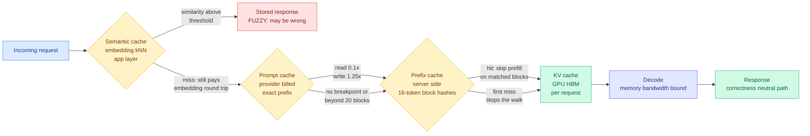
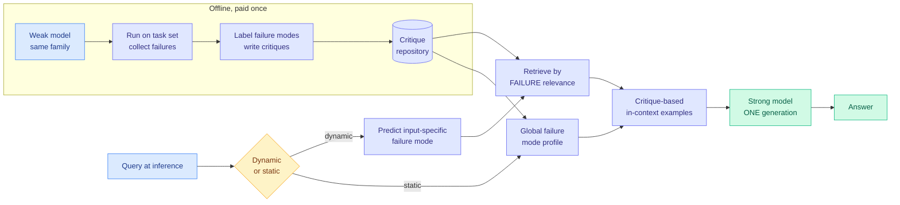
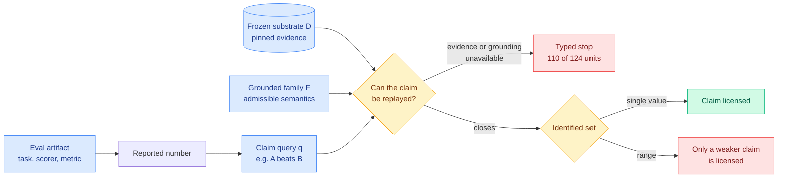
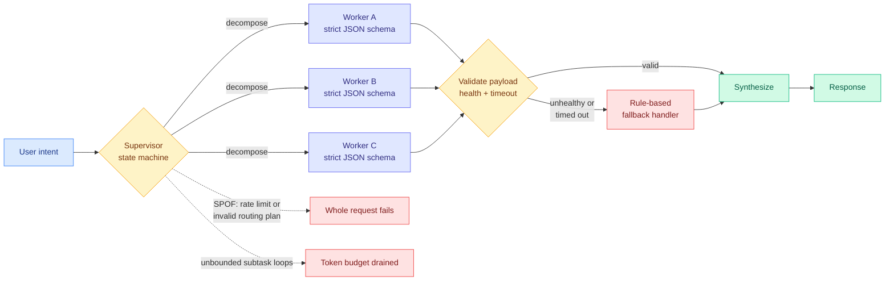
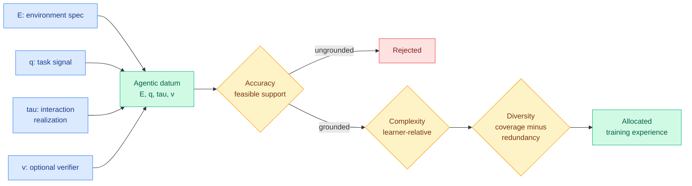

# cere-bro | 2026-08-29

> A quiet paper day with one sharp cost lesson running through it. The day's best read is a practitioner explainer that separates four things everyone calls "caching," and its most expensive finding is a routing result hiding in a caching article: provider prompt-cache entries are keyed to the model, so switching to a cheaper model mid-conversation pays a full cold prefill on the entire accumulated history. Two research papers move the expensive decision out of inference and into a build step. Two funding items put real money behind memory and networking rather than compute. The throughline is cost optimization at the memory layer, not the FLOPs layer.

🎯 Today's 5 for you

<ol>
<li>Read<strong>KV vs prefix vs prompt vs semantic caching.</strong> Your saved reading pivoted today after thirteen straight harness saves and four quiet days, and it landed on your core territory. Four cache layers, four different keys, and three operational facts this wiki did not have: Anthropic's prompt cache walks backward through at most <strong>20 blocks</strong>, writes only fire at a breakpoint you placed, and <strong>entries are keyed to a model</strong>. That last one is a routing cost nobody in the routing literature prices. <a href="https://blog.dailydoseofds.com/p/kv-vs-prefix-vs-prompt-vs-semantic">Public mirror</a> · <a href="../../inference-efficiency/2026-08-29-four-cache-layers-kv-prefix-prompt-semantic.md">wiki summary</a>.</li>
<li>Skim<strong>CritICL.</strong> Test-time scaling normally means N samples competing for the same KV cache, which is the expensive thing. CritICL profiles a small model's failure modes offline, stores critiques, and retrieves one at inference, so the strong model does <strong>one</strong> generation. Second paper in two days moving inference spend into a stored artifact, after TTPO on 08-28 moved it into a weight update. This one's artifact is text you can diff. <a href="https://arxiv.org/abs/2608.27455">arXiv 2608.27455</a>.</li>
<li>Track<strong>a16z raises $1.1B for an AI hardware fund.</strong> Explicitly targeted at <strong>chips, memory, networking and storage</strong>, not model labs. When a fund this size names memory and networking as the thesis, that is the venture market pricing the same claim the cache article makes: the binding constraint moved off compute. <a href="https://www.theinformation.com/briefings/andreessen-horowitz-raises-1-1-billion-ai-hardware-fund">The Information</a>.</li>
<li>Track<strong>Anthropic weighed a $7B chip deal, and the framing is "repeatable inference."</strong> AI Weekly's read is that Nvidia's largest customers want options, and that the real competition is not peak training throughput but serving the same workload repeatably at a predictable cost. That is the buyer-side statement of the prefix-cache economics this wiki has tracked since DeepSeek's six-fold cache-hit repricing on 08-14. <a href="https://mail.google.com/mail/u/0/#inbox/1a048d55d779c3dc">AI Weekly</a>.</li>
<li>Skim<strong>Multi-agent design patterns, for one number in it.</strong> Ken Huang's production guide prescribes a hard maximum fan-out depth of N ≤ 5 to stop cascading token explosion. That is a compute rationing policy, and it is the crudest one possible: a constant, chosen offline, applied whether or not a branch is productive. Gambit (08-16) already does this adaptively and cuts token consumption up to 68.5%. Nobody has applied it to a subtask tree. <a href="https://kenhuangus.substack.com/p/multi-agent-design-patterns-architectural">Post</a>.</li>
</ol>

<em>Safe to skip:</em> three of the five late additions to the HuggingFace board are 3D asset generation, tactile robot manipulation and live-stream video editing (Luce, TacForcing, EditaLive). Real work, nothing touching routing, memory or hardware. Also note: HuggingFace had not rolled its daily-papers date to 08-29 at farm time, Reddit returned nothing across all eight tracked subs for a second consecutive day, and the general X scrape was down for the third time in four days. Today is genuinely thin, and the digest is short rather than padded.

---

## TL;DR

- **Four cache layers, one correctness trap**: KV, prefix and prompt caching are exact-match and only cost you money on a miss. Semantic caching returns a wrong answer with an HTTP 200.
- **Prompt cache entries are keyed to the model**. Routing mid-session to a cheaper model reprices the whole conversation at cold rates.
- **CritICL**: profile a small model's failures once, store the critiques, retrieve one at inference. Matches test-time scaling at far fewer generations.
- **110 of 124 eval units cannot license their own claim**. A census of Inspect Evals finds most stop before the claim can be replayed at all.
- **a16z closed $1.1 billion for chips, memory, networking and storage.** The hardware thesis is now explicitly about the memory path.
- **Ken Huang's multi-agent guide** names token explosion as a top-three production failure and fixes it with a fixed fan-out cap.

---

## Deep Dives

### KV vs Prefix vs Prompt vs Semantic Caching

> Three of the four things called "caching" can only cost you money. The fourth can cost you the answer, and it fails with a success status code.

**Source:** Avi Chawla (@_avichawla), X Article, surfaced via saved reading. Public mirror on Daily Dose of Data Science.
**Links:** [Article](https://blog.dailydoseofds.com/p/kv-vs-prefix-vs-prompt-vs-semantic) · [Wiki summary](../../inference-efficiency/2026-08-29-four-cache-layers-kv-prefix-prompt-semantic.md)

**What is it about?**
Four separate mechanisms in the LLM serving stack all get called "caching," and they live at four different layers keyed on four different things. The article separates them from first principles and then lists what breaks each one in production.

**What problem does it solve?**
Teams tune the wrong layer. Most production cost incidents are not "the cache was too small," they are "something at the front of the prompt changed and invalidated everything after it." Until now that knowledge lived in scattered vendor docs and vLLM source. This puts the four layers, their keys, and their failure modes in one place.

**What's the core novelty?**
Not a technique, a taxonomy with the operational details attached. The KV cache (the per-request store of key and value vectors so already-processed tokens are not recomputed) lives in GPU memory and dies with the request, costing roughly **40 GB for a 70B model at BF16 and 128K context**. Prefix caching persists those same tensors server side; vLLM chunks the sequence into fixed 16-token blocks, hashes each block over its parent's hash plus its token IDs, and the scheduler **walks the incoming blocks in order and stops at the first miss**. Prompt caching is the provider's billed version of that lookup, roughly **1.25x the base input rate to write and 0.1x to read**. Semantic caching is something else entirely: it stores finished response strings keyed by embedding similarity, at the application layer.

**Key takeaways**
- **Anthropic's prompt cache walks backward through at most 20 blocks on a read.** Add more than 20 blocks of conversation between two calls and the last write falls out of range, so you pay cold.
- **Cache entries are keyed to a model.** Routing to a cheaper model mid-session still prefills the entire accumulated history at cold rates.
- **Prefix caching saves prefill only, decode is unchanged**, and on traffic with genuinely unique prompts benchmarks have measured a throughput regression. Under chain hashing, two RAG requests retrieving the same documents in a different order share nothing at all.
- **Published semantic-cache similarity thresholds span 0.75 to 0.97**, and the spread is the admission. Raise it and hit rate collapses while you still pay for embeddings on every call; lower it and hit rate climbs alongside confidently wrong answers. Negated sentences sit close together in embedding space.
- The four production failure modes are all prefix-shape: variable content at the front of the prompt, tool-schema reordering, settings rendered into the prompt, and history summarization. **Truncating tool outputs in place keeps the prefix byte-identical; summarizing history does not.**

**Gaps in the study**
It is a practitioner explainer, so it reports mechanism and vendor terms rather than measurements. There is no hit-rate data on real traffic and no comparison of the four layers' savings on one workload. The conspicuous absence: **nobody, here or anywhere, has published a semantic-cache false-hit rate as a function of similarity threshold on a real query distribution.** That measurement needs no GPU and would settle whether the layer is usable at all.

**Industrial implication**
Two things change if you take this seriously. First, "append, never edit" stops being a style preference and becomes an architectural constraint, which is the third independent arrival at that rule: [TokenPilot (06-16)](../../inference-efficiency/2026-06-16-tokenpilot-cache-efficient-agent-context.md) derived it as a research result, showing that agent context management optimizing token count alone mutates the prefix and triggers a full prefill recompute that cancels the saving; [DeepSeek's Harness v0.1 (08-14)](../../inference-efficiency/2026-08-14-deepseek-harness-kv-cache-economics.md) enforced it as an engineering commitment while raising cache-hit prices roughly six-fold. Paper, vendor, practitioner, same rule. Second, and this is the one worth acting on: **model-keyed cache entries mean cost-based routing has an unpriced term.** On the 140K-token median agentic prefix that [SemiAnalysis measured in AgentX (07-25)](../../hardware/2026-07-25-semianalysis-amd-cuda-moat.md) by replaying real Claude Code and Codex traces, a mid-session switch to a cheaper model plausibly costs more in cold prefill than it saves per token.

→ [Full summary](../../inference-efficiency/2026-08-29-four-cache-layers-kv-prefix-prompt-semantic.md)

---

### CritICL: Inference-Time Weak-to-Strong Generalization from Small Language Model Failure Modes

> The most useful thing a small model produces is not its answers. It is a catalog of the mistakes the big model in the same family is about to make.

**Source:** HuggingFace Daily Papers · COLM 2026
**Links:** [Paper](https://arxiv.org/abs/2608.27455) · [Code](https://github.com/umwyf/CRITICL) · [Wiki summary](../../inference-efficiency/2026-08-29-criticl-failure-mode-in-context-critiques.md)

**What is it about?**
A way to make a strong model reason better at inference without generating many samples or calling a verifier. It rests on the claim that a model family's failure modes are structured and transfer across scale, so the mistakes a small model makes on a problem type are the mistakes the large one is at risk of.

**What problem does it solve?**
Test-time scaling (spending more inference compute to reason better) currently means repeated generation plus aggregation, or an external verifier checking the work. Both pay their cost on every query at serving time, and repeated generation is the most expensive thing you can do there, because N samples means N concurrent long contexts competing for the same KV cache. CritICL moves nearly all of that cost offline.

**What's the core novelty?**
The retrieval objective. Standard in-context-learning retrieval ranks stored demonstrations by **semantic relevance to the query**. CritICL ranks by **failure relevance**: which stored example addresses the error this query is likely to induce. Those are different orderings over the same corpus, and the paper's claim is that the second is the useful one for reasoning. Two variants: CritICL-dynamic predicts the input-specific failure mode then retrieves, CritICL-static uses one global failure profile with no per-query prediction step.

**Key takeaways**
- The weak model is **never run at inference**. It is mined once for a failure taxonomy and then discarded, so there is no online dependency on weak-model output quality, which is what most weak-to-strong methods carry.
- Reported competitive with or superior to test-time scaling methods **at significantly fewer generations and lower token cost**.
- The static variant is the deployable one. It has a lower ceiling but no per-query prediction that can be wrong on the serving critical path.

**Gaps in the study**
Cross-family transfer is untested: whether a critique repository mined from a Qwen model helps a Llama model decides whether this is a technique or a per-vendor asset. Staleness is unreported, and a repository profiled against one checkpoint has an unknown decay rate when the strong model updates. And the cost table is one-sided: offline profiling of a weak model across a task set is not free, but the comparison is on generation count rather than total compute including the build step. **That is the third paper in three days deleting a serving-time dependency without pricing what replaced it**, after Self-OPD (which needs K full trajectory rollouts per timestep) and TTPO (N rollouts plus optimizer steps per test distribution) on 08-28.

**Industrial implication**
This is the auditable version of a trade the field made yesterday. [TTPO (08-28)](../../inference-efficiency/2026-08-28-ttpo-test-time-policy-optimization.md), which trains on unlabeled test data by taking a majority-vote pseudo-label and treating agreeing and disagreeing rollouts asymmetrically, reported recovering +25.2% to +36.4% "without thinking," moving inference spend into a weight update. CritICL moves the same spend into a stored text corpus. **TTPO's artifact is a per-test-distribution weight delta that breaks reproducibility; CritICL's is a repository you can inspect, version and diff.** For any regulated or audited deployment that difference decides which one ships. Expect the static variant inside a high-traffic endpoint on a stable task distribution first, where the offline corpus amortizes; it has nothing to offer a long tail of one-off queries.

→ [Full summary](../../inference-efficiency/2026-08-29-criticl-failure-mode-in-context-critiques.md)

---

### What Does an Evaluation License? A Commit-Bound Census of Claim-Relative Inference in Inspect Evals

> Running an eval gives you a number. It does not automatically give you the right to the sentence you wrote underneath it. Out of 124 units, 110 could not get there.

**Source:** HuggingFace Daily Papers
**Links:** [Paper](https://arxiv.org/abs/2608.19269) · [Wiki summary](../../responsible-ai/2026-08-29-evaluation-license-claim-replay-census.md)

**What is it about?**
A formal separation between what an eval computes and what an eval licenses, plus a census applying it to every mechanically eligible unit in Inspect Evals at a pinned commit.

**What problem does it solve?**
This wiki declared a measurement crisis on 08-11 after four papers in two days each found a trusted benchmark was substantially measuring an artifact of its own construction, including [SWE-Bench ProMax](../../agentic-systems/2026-08-11-swe-bench-promax.md), which cited that nearly 60% of unsolved SWE-bench Verified instances contain flawed tests. Every one of those was a case study. This is the general statement, and it says the deficiency is often not in benchmark design at all. It is in what the artifact **carries**: the historical evidence and semantic grounding needed to replay a claim.

**What's the core novelty?**
Four objects and a disposition. A frozen substrate D (the pinned evidence), a grounded family F (the admissible semantic readings, since "correct" usually admits more than one defensible interpretation), a claim query q, and the identified set of answers to q surviving across all of F given D. If the set is a single value the claim is licensed; if it is a range only a weaker claim is; if evidence is missing, inference **stops with a typed reason** rather than producing an answer. The audit returns typed stops, instability witnesses and stable substructure, deliberately **not** a robust/not-robust label.

**Key takeaways**
- **110 of 124 units stop before deterministic inference is possible.** Only 14 close.
- Claim resolutions **do not degrade together**. An eval can be too unstable to license "model A scored 62.3" while cleanly licensing "model A beat model B." Most published claims are the second kind, which is the more survivable kind.
- Results also separate by primary versus review family, so disagreement between the two is itself a reportable instability rather than noise to average away.

**Gaps in the study**
One suite, one commit. Whether 110 out of 124 is characteristic or specific to how Inspect packages evals is unknown, and the obvious next census is lm-evaluation-harness or HELM. "Mechanically eligible" is also doing unmeasured work: what fraction of the full suite that is, and whether ineligible units differ systematically, decides how to read the ratio. And the paper diagnoses without costing the fix, so there is no estimate of what an eval author would have to ship to close a typed stop.

**Industrial implication**
The practical output is a per-unit typed reason, which is exactly the input a compliance process needs and an aggregate score is not. It also gives this wiki's longest-running open prediction its vocabulary. The 08-26 and 08-28 Looking Ahead sections both predicted a harness paper would publish a pass^k curve within 60 days, because Microsoft's Thinkingbox (08-25) measured a top model collapsing from 65.36% pass@1 to 25.25% pass^20 on a stateful benchmark. In this paper's terms: **a pass@1 number on a stochastic stateful task has a wide identified set, and reporting it as a point estimate is an unlicensed claim resolution.** Five consecutive harness papers have made that move.

→ [Full summary](../../responsible-ai/2026-08-29-evaluation-license-claim-replay-census.md)

---

### Multi-Agent Design Patterns: Architectural Topologies, Failure Modes, and Production Hardening

> Two of the three headline failures in a production multi-agent guide are cost failures, and the prescribed fix for the biggest one is a constant someone picked offline.

**Source:** Ken Huang, Agentic AI (Substack)
**Links:** [Post](https://kenhuangus.substack.com/p/multi-agent-design-patterns-architectural) · [Wiki summary](../../agentic-systems/2026-08-29-multi-agent-design-patterns-production-hardening.md)

**What is it about?**
A catalog of seven multi-agent coordination topologies with the failure modes attached to each, plus a production hardening runbook. The free portion covers the taxonomy, the Orchestrator-Worker pattern in depth, and a comparison matrix; patterns 2 through 7 and the runbook are paywalled.

**What problem does it solve?**
Multi-agent systems fail in production because coordination is implicit. The named consequences are compounding error loops, exhausted token budgets, and unauthorized mutations. The prescription is explicit topologies, bounded execution budgets, deterministic state machines, and fine-grained access control.

**What's the core novelty?**
Not novelty so much as discipline transplanted. Ordinary distributed-systems practice applied to a stack that usually skips it: strict JSON schema contracts per worker, payload type validation before the orchestrator proceeds, per-dispatch health checks and timeouts (15 seconds in the sample harness), and a **deterministic rule-based fallback** when a worker is unreachable rather than stalling the request. The structural commitment is that workers never talk peer-to-peer and the orchestrator is the single routing gateway, trading expressiveness for traceability.

**Key takeaways**
- **Supervisor single point of failure**: a rate limit or an invalid routing plan kills the entire request. Mitigation is dual-model redundancy plus a rule-based fallback.
- **Cascading token explosion**: unbounded subtask loops drain the budget. Mitigation is a hard maximum fan-out depth (N ≤ 5) and per-request token ceilings.
- The matrix's recommendation is conservative: start with Orchestrator-Worker or Fan-Out/Fan-In, which have low latency and minimal error cascading, before adding multi-tier or event-driven complexity.

**Gaps in the study**
There are no benchmark numbers, cost figures or traces behind the latency and error-cascading columns. It is authored judgment presented as a matrix. [A²E (08-11)](../../agentic-systems/2026-08-11-harness-evolution-cluster.md), which instrumented agent harnesses across execution efficiency, tool use, planning and error recovery, found that model-harness combinations vary substantially by task type with no single combination consistently winning, which makes "start with Orchestrator-Worker" a reasonable prior rather than a finding.

**Industrial implication**
The fan-out cap is the interesting object. **A fixed maximum depth is a compute rationing policy and it is the crudest one available**: a constant, chosen offline, applied uniformly regardless of whether a branch is productive. [Gambit (08-16)](../../inference-efficiency/2026-08-16-gambit-thought-level-beam-search.md), which kills weak reasoning traces and immediately re-branches from strong prefixes to keep hardware utilization high, cut total token consumption by up to 68.5% doing exactly this adaptively for reasoning traces. Nobody has applied it to a multi-agent subtask tree, and the composition is free. Separately, "dual-model redundancy with a deterministic rule-based fallback" is a routing pattern where the degraded tier is **no model at all**, which is what every reliable production system actually does and which the [LLM routing page](../../ai-routing/llm-routing.md) has no entry for.

→ [Full summary](../../agentic-systems/2026-08-29-multi-agent-design-patterns-production-hardening.md)

---

### What Makes Good Agentic Data? An ACE Lens on Data Generation for LLM Agents

> Cross-source confirmed (HuggingFace + Kurate cs.AI #8). Difficulty is not a property of a task. It is a property of a task relative to a declared learner and a declared harness, which makes your training data harness-dependent.

**Source:** HuggingFace Daily Papers and Kurate cs.AI leaderboard #8 this week (Huawei, Shanghai Jiao Tong)
**Links:** [Paper](https://arxiv.org/abs/2608.27260) · [Wiki summary](../../agentic-systems/2026-08-28-ace-lens-agentic-data-generation.md)

**What is it about?**
A survey with an actual thesis. Agent training data is now mostly generated rather than collected, and the literature on generating it is organized by domain (web agents, tool agents, coding agents), which hides that the generation mechanisms are largely shared and that papers routinely conflate constructing a candidate, verifying it, and selecting it.

**What problem does it solve?**
Domain-centered organization makes methods incomparable and evaluation heterogeneous. The paper gives one factorization all of it fits into and one lens for judging the resulting distribution.

**What's the core novelty?**
Two moves. Agentic data factorizes into a common object **(E, q, τ, v)**: environment specification, task signal, interaction realization, optional verifier. Then generation is reframed as constrained distribution design through the **ACE lens**, where **A**ccuracy establishes the feasible support of grounded and internally consistent data, **C**omplexity places learning mass within that support relative to a *declared* learner and execution configuration, and div**E**rsity controls coverage and redundancy.

**Key takeaways**
- **Learner-relative complexity is the sharp claim.** The same trajectory is informative for one model-harness pair and worthless for another, which makes data generation dependent on the harness rather than on the model alone.
- Separating candidate construction from verification and selection is the structural contribution, and it is also the paper's main criticism of the field.
- Its reading of the literature is that the field has shifted toward **execution-grounded accuracy** (verify by running it, not by scoring it), learner-relative complexity, and diversity beyond surface variation or dataset size.

**Gaps in the study**
It is a survey, so there is no experiment validating that ACE-shaped generation beats an unstructured pipeline on the same budget. Learner-relative complexity in particular is stated as a principle without a measurement procedure, and without one it cannot be operationalized.

**Industrial implication**
Its closing line is a resource-allocation claim, not a data claim: **the challenge is not to generate more data but to continually allocate valid, informative, non-redundant experience as agents and environments evolve.** That makes agentic data generation a budgeting problem of the same shape as the inference-side allocation problems this wiki tracks, and it is a third arrival today at the same posture: the expensive decision belongs before the loop runs, not inside it.

→ [Full summary](../../agentic-systems/2026-08-28-ace-lens-agentic-data-generation.md)

---

## Industry Pulse

Genuinely quiet. HuggingFace had not rolled its daily-papers date to 08-29 at farm time and contributed five late additions to the 08-28 board, all eight tracked subreddits returned nothing for a second consecutive day, and the general X scrape failed for the third time in four days. What follows is what actually landed, not a padded list.

- **Andreessen Horowitz closed $1.1 billion for an AI hardware fund** targeting chips, memory, networking and storage, announced Friday ([The Information](https://www.theinformation.com/briefings/andreessen-horowitz-raises-1-1-billion-ai-hardware-fund)).
- **Anthropic weighed a roughly $7 billion chip deal**, with AI Weekly framing the story as Nvidia's largest customers wanting options and the real competition being repeatable inference rather than peak training throughput ([AI Weekly](https://mail.google.com/mail/u/0/#inbox/1a048d55d779c3dc)).
- **Ken Huang published a production multi-agent architecture guide** naming token exhaustion as a top-three deployment failure, with the free tier covering the taxonomy and Orchestrator-Worker ([Agentic AI](https://kenhuangus.substack.com/p/multi-agent-design-patterns-architectural)).
- **This week's Kurate cs.AI board turned governance-shaped**, with runtime governance primitives at #7 ([2608.26696](http://arxiv.org/abs/2608.26696)) and a layered accountability architecture for LLM applications at #16 ([2608.27102](http://arxiv.org/abs/2608.27102)) entering the top 20 since yesterday.
- **PeakBench took the cs.AI #1 slot and never reached HuggingFace**: a benchmark for **resource-aware tool invocation** in LLM agents, which is the cost axis measured directly ([2608.24509](http://arxiv.org/abs/2608.24509)).
- **Amazon researchers published "Beyond the Harness," end-to-end optimization of context artifacts for enterprise text-to-SQL** (Kurate cs.AI #10), the fourteenth entry in this wiki's harness thread and the second from a named enterprise ([2608.22830](http://arxiv.org/abs/2608.22830)).
- **GraphMemix entered cs.AI at #9** with query-aware evidence forests for long-term multimodal agent memory ([2608.26983](http://arxiv.org/abs/2608.26983)).
- **A new eval-awareness result argues capabilities framing predicts compliance** (cs.AI #15), which is a safety-eval validity finding rather than a capability one ([2608.27340](http://arxiv.org/abs/2608.27340)).
- **The alphaxiv overview layer had no entry for the Inspect Evals census**, which is a small but real signal about which papers the AI-summary infrastructure covers: methodology audits are consistently the thinnest served.

**Funding, valuations, and compute deals**

- **a16z: $1.1 billion closed** for physical AI and infrastructure, explicitly naming chips, memory, networking and storage as the target categories ([The Information](https://www.theinformation.com/briefings/andreessen-horowitz-raises-1-1-billion-ai-hardware-fund)).
- **Anthropic: a roughly $7 billion chip deal under consideration**, reported alongside the observation that Nvidia's customer base is actively shopping for alternatives ([AI Weekly](https://mail.google.com/mail/u/0/#inbox/1a048d55d779c3dc)).

---

## Global View

**The venture market and a practitioner explainer priced the same claim on the same day, from opposite ends: the marginal cost of serving is a memory problem, not a FLOPs problem.** a16z closed $1.1 billion and named chips, **memory, networking and storage** as the thesis rather than model labs, and AI Weekly's read on Anthropic's roughly $7 billion chip deliberation is that the fight is over **repeatable inference** rather than peak training throughput. On the research side this wiki has been converging on the same point for three months: [TokenPilot (06-16)](../../inference-efficiency/2026-06-16-tokenpilot-cache-efficient-agent-context.md) showed that agent context management optimizing token count alone mutates the prompt prefix and forces a full prefill recompute that cancels the saving, [DeepSeek (08-14)](../../inference-efficiency/2026-08-14-deepseek-harness-kv-cache-economics.md) raised cache-hit token prices roughly six-fold while open-sourcing a harness whose central commitment is never editing written history, and [SemiAnalysis's AgentX trace replay (07-25)](../../hardware/2026-07-25-semianalysis-amd-cuda-moat.md) measured real agentic serving at a median 140K input tokens against 396 output tokens, which makes serving a prefill-and-retention problem rather than a decode-throughput one. Today's cache explainer closes the loop with the fact that makes it actionable and that none of those papers state: **prompt cache entries are keyed to the model**, so the cheapest routing decision available on paper is also the one that reprices your entire conversation at cold rates.

**The measurement crisis got its formal floor, and it arrived the same week that the only named enterprise buyer in this wiki bought on a cost number instead of an eval number.** [The Inspect Evals census (08-29)](../../responsible-ai/2026-08-29-evaluation-license-claim-replay-census.md) found **110 of 124 units cannot license the claims attached to their metrics**, which generalizes the four case studies this wiki logged on 08-11: [SWE-Bench ProMax](../../agentic-systems/2026-08-11-swe-bench-promax.md) citing nearly 60% of unsolved SWE-bench Verified instances containing flawed tests, [A²E](../../agentic-systems/2026-08-11-harness-evolution-cluster.md) showing harness choice swings outcomes as much as the model does so every single-harness leaderboard number is a joint measurement, Evo-Bench building machinery to separate harness capability from base model strength, and [StreamArena](../../agentic-systems/2026-08-10-streamarena-streammind.md) finding a baseline reading only four frames matches complex streaming models. Against that, the industry signal from 08-28 is that **Visa told The Information its own harness makes Anthropic's model cheaper and faster at security work, with vendor pricing unchanged**, and [PILOT (08-28)](../../agentic-systems/2026-08-28-pilot-live-self-improvement.md) published output tokens down 42.9% and successes per million output tokens up 110.3%. The gap is now explicit: **research has proved the accuracy instruments do not license their claims, and the buyers have quietly stopped using them, having switched to cost per completed task.** Nobody has audited whether the cost instruments license their claims either, and that is the obvious next census.

**Three separate items today argue the expensive decision should be made before the loop runs rather than inside it, which is a new posture for a field that spent the year making loops smarter.** [CritICL](../../inference-efficiency/2026-08-29-criticl-failure-mode-in-context-critiques.md) moves reasoning supervision into an offline critique repository so inference does one generation; the [ACE lens](../../agentic-systems/2026-08-28-ace-lens-agentic-data-generation.md), cross-source confirmed on HuggingFace and Kurate cs.AI #8, argues agentic data generation is a continual allocation problem where complexity is defined relative to a declared learner and harness; and Ken Huang's guide caps multi-agent fan-out at a constant chosen offline. Set against yesterday's board, where [TTPO](../../inference-efficiency/2026-08-28-ttpo-test-time-policy-optimization.md) spent test-time compute on gradient updates instead of reasoning tokens and PILOT gave a supervisor the power to abort a running agent, **the field is now split between making the loop cheaper and moving work out of the loop entirely**, and the second camp has the better auditability story: a critique repository and a data allocation policy can be versioned and diffed, a test-time weight delta cannot. The industry tell is that a16z is funding the memory path rather than the reasoning path, which is a bet on the second camp being where the recurring cost actually lives.

---

## Looking Ahead

- **Someone publishes a semantic-cache false-hit rate as a function of similarity threshold on a real query distribution within 90 days.** Published defaults span 0.75 to 0.97 and the measurement needs no GPU, which makes its absence a choice rather than a constraint. Signal to check by 2026-11-27: any paper, vendor benchmark, or serving-framework doc reporting wrong-answer rate against threshold. If none appears, semantic caching is being deployed on vibes at a layer that can return a wrong answer with a success status, and the honest recommendation is to not deploy it.
- **A routing paper prices cache invalidation on a model switch within 90 days.** Prompt cache entries are model-keyed, and on the 140K-token median agentic prefix AgentX measured, a mid-session route to a cheaper model pays a full cold prefill on the accumulated history. Signal by 2026-11-27: any routing paper or serving-framework RFC whose cost model includes a cold-prefill term for switching, rather than dollars per token alone. If none does, every cost-based routing result in this wiki is measured on an incomplete bill.
- **The build-step cost comparison still does not exist, and this is the second time it has been predicted.** CritICL joins Self-OPD and TTPO as the third paper in three days deleting a serving-time dependency without publishing what replaced it. Signal by 2026-10-28: any replication or follow-up reporting GPU-hours or dollars for offline failure-mode profiling against the test-time scaling baseline it beats on generation count. The 08-28 version of this prediction covered Self-OPD and TTPO; CritICL makes it three, which upgrades a conspicuous omission to a field norm.
- **The evaluation-license census gets extended to a second suite within 90 days.** 110 of 124 is either characteristic of eval artifacts or specific to how Inspect packages them, and the census machinery is now published. Signal by 2026-11-27: any paper running the same claim-replay audit on lm-evaluation-harness or HELM. If the ratio holds within roughly 20 points on a second suite, the finding is about evaluation practice; if it collapses, it was about Inspect.
- **Rising author from Kurate: Daniel Whitmore**, third consecutive week crossing the threshold at score 16.7 with three top-10 appearances in four weeks. On the cs.LG board with **"Uncertainty Is Not Enough: Value-of-Information Routing for Mixtures of LoRA Experts"** ([2608.02528](http://arxiv.org/abs/2608.02528), #5 in W32 and #4 in W33) and **"SPARCL: Spectral Partitioned Analytic Continual Learning"** ([2608.21307](http://arxiv.org/abs/2608.21307)). The routing paper acquires a new stake today: today's cache article establishes that a model switch invalidates the prompt cache, which is exactly a cost term a value-of-information router should carry and does not. Falsifiable form: **if Whitmore posts a follow-up extending value-of-information routing beyond LoRA adapters to whole models by 2026-11-27, check whether the cost model includes cache invalidation.** If it prices tokens only, the routing literature's blind spot is confirmed rather than closing. Still no X handle located, so `connectors/twitter/config.json:ai_handles` is unchanged for a third week.

**LLM-rated underrated, from Kurate:** **PeakBench** took the cs.AI **#1** slot this week (ai_rating 5.5, [2608.24509](http://arxiv.org/abs/2608.24509), Nanjing University) and never appeared on HuggingFace. It benchmarks **resource-aware tool invocation in LLM agents**, meaning it measures whether an agent spends its tool budget sensibly rather than whether it eventually gets the answer. That is the cost axis measured directly, on the same workload class where PILOT reported successes per million output tokens and Visa reported a cheaper security pipeline. Track it: **if any harness or agent paper cites PeakBench and reports its numbers alongside accuracy by 2026-10-28**, the cost-per-task metric has an instrument and the field's shift away from accuracy-only reporting has a measurable anchor.
