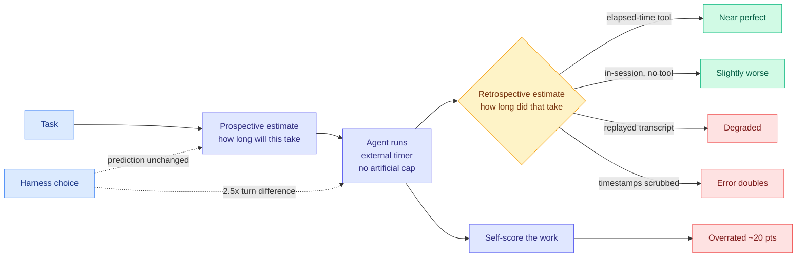
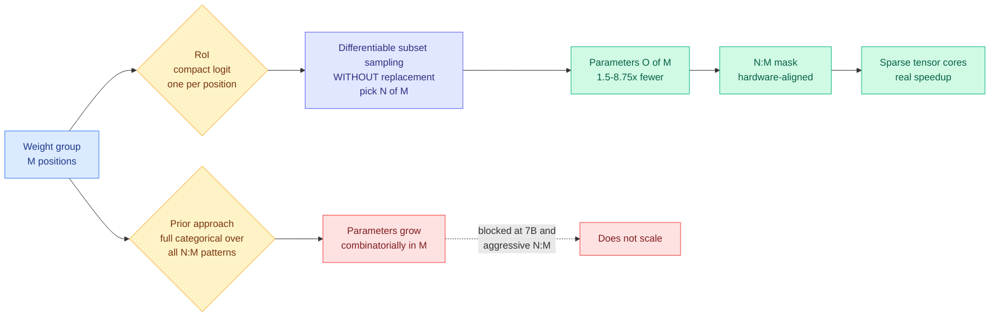
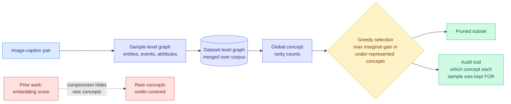

# cere-bro | 2026-08-30

> The whole day is about metering, arriving from four directions at once. Salesforce starts charging for AI by business outcome instead of by seat. Anthropic quietly cuts Claude Code's effective weekly allowance by about 17 percent. Apple's headless Macs turn out to be the year's fastest-growing escape from metered cloud inference, up 29 percent to $10.4 billion. And three papers on one leaderboard all replace a forced dense decision with a sparse one plus an explicit way to say "no answer." The sharp cost lesson underneath: the agents everyone is now metering have no internal clock and overrate their own work by twenty points, so every budget ceiling has to be enforced outside the model.

🎯 Today's 5 for you

<ol>
<li>Read<strong>RoI: Reservoir of Importance.</strong> N:M sparsity (keep N weights of every M, the only pattern Nvidia's sparse tensor cores actually accelerate) has been stuck because <em>learning</em> the mask means one parameter per feasible pattern, and that count is combinatorial in M. RoI reparameterizes to one logit per position plus differentiable subset sampling, dropping mask parameters to <strong>O(M)</strong>: <strong>1.5x to 8.75x fewer</strong>, at matched quality, scaling to 7B. It is also the first paper in the recent "move the cost to a build step" run to actually publish what the build step costs. <a href="https://arxiv.org/abs/2608.23048">arXiv 2608.23048</a> · <a href="../../inference-efficiency/2026-08-30-roi-semi-structured-sparsity.md">wiki summary</a>.</li>
<li>Read<strong>Your Agents Are Not Time Aware.</strong> Your saved reading has been dominated by loop and harness engineering for a month (13 saves, still the top theme), and this is the sharpest harness result in weeks. Claude Code burns <strong>2.5x more turns than Codex on the same model</strong>, and the model's runtime prediction is identical across both because it is anchored, not estimated: measured compression exponent <strong>0.19-0.24</strong>, so predictions barely move as real duration moves. Scrub timestamps from the transcript and the error doubles, which says the "sense of time" was never internal. <a href="https://www.lesswrong.com/posts/eAbuPXbjakop5rSJx/your-agents-are-not-time-aware">LessWrong</a> · <a href="../../agentic-systems/2026-08-30-agents-not-time-aware.md">wiki summary</a>.</li>
<li>Track<strong>Apple's headless Macs are the fifth exit from auction-priced compute.</strong> Mac mini and Mac Studio are Apple's fastest-growing products, <strong>Mac revenue up 29% to $10.4B</strong>, bought by people running agents locally and developers dodging cloud bills. This is the compute-economics page's open question about whether the spot premium reaches inference, answered as substitution rather than as a price. The reason it works is specific: a solo agentic session is 140K tokens in, 396 out, single-tenant, which is the worst case for batch-based cloud economics and the best case for a big unified memory pool. <a href="https://www.theinformation.com/articles/apple-stumbled-ai-hardware-success-mac">The Information</a> · <a href="../../hardware/2026-08-30-apple-mac-local-inference-economics.md">wiki summary</a>.</li>
<li>Skim<strong>MCL: data pruning by concept coverage, with an audit trail.</strong> Every data-pruning method scores samples in embedding space. MCL's objection is mechanical and correct: an embedding is a lossy summary produced by a model trained to discard detail, and that detail is exactly the rare concepts you were pruning to preserve. Build an explicit entity-event-attribute graph instead, count rarity globally, select greedily by coverage. The payoff worth your attention is not the accuracy, it is that each kept sample has a <em>named reason</em>. <a href="https://arxiv.org/abs/2608.22858">arXiv 2608.22858</a> · <a href="../../inference-efficiency/2026-08-30-mcl-concept-landscape-data-pruning.md">wiki summary</a>.</li>
<li>Track<strong>The metering ladder gained two rungs in opposite directions.</strong> Salesforce is letting customers pay for Agentforce on <em>business outcomes</em> (revenue closed, service cost cut), one rung past the cost-per-task unit this wiki adopted on 08-16. Anthropic is going the other way, replacing Claude Code's temporary 50% boost with a permanent 25% on September 14, a <strong>~17% effective cut</strong>. The application layer can price outcomes because it can observe them; the model layer cannot, so it rations. Both squeeze the same party in the middle: whoever runs the harness. <a href="https://www.theinformation.com/articles/salesforce-overhauling-way-charges-ai">The Information</a> · <a href="https://the-decoder.com/anthropics-claude-code-limit-change-is-a-raise-on-paper-but-a-cut-in-practice/">The Decoder</a>.</li>
</ol>

<em>Safe to skip:</em> the education pair (a Bocconi experiment where GPT-4o lifted marketing-assignment grades nearly a full point on a five-point scale without testing whether anyone learned anything, and AI Weekly's universities-choosing-opposite-futures piece) is real and has nothing for you. <em>Pipeline note, stated plainly:</em> HuggingFace has still not rolled its daily-papers date past 08-28 for a second consecutive day, all eight tracked subreddits returned nothing for a third consecutive day (the Reddit farmer has no OAuth credentials and unauthenticated access has been 403 since 2026), the general X scrape found no reachable Nitter instance for the fourth time in five days, and your bookmarks feed was healthy but you saved nothing new. So today's paper content comes from the Kurate cs.LG leaderboard and a LessWrong study rather than from HuggingFace, and the digest is short rather than padded.

---

## TL;DR

- **RoI**: learning an N:M sparsity mask used to cost one parameter per feasible pattern. Compact logits plus subset sampling cut that 1.5x to 8.75x.
- **Agents cannot tell time**: both major coding agents guess about ninety minutes regardless of task. Codex is off by 4x to 10x.
- **Same model, different harness, 2.5x the turns.** Claude Code runs until it thinks it is done. Codex stops at a time boundary.
- **MCL**: prune training data by counting concepts in a graph, not by distance in embedding space. Each kept sample gets a named reason.
- **Apple Mac revenue up 29% to $10.4 billion**, driven by headless boxes bought to run agents locally and skip cloud bills.
- **Salesforce will charge for AI by business outcome.** Anthropic cuts Claude Code's effective weekly limit by about 17 percent.

---

## Deep Dives

### Your Agents Are Not Time Aware

> Ask a coding agent how long a job will take and it says ninety minutes. Ask it about a different job and it says ninety minutes. Scrub the timestamps out of its transcript and its error doubles, which tells you the sense of time was never inside the model.

**Source:** Michael Ofengenden and Maksym Andriushchenko (MATS 10), LessWrong. Surfaced via The Decoder today.
**Links:** [Post](https://www.lesswrong.com/posts/eAbuPXbjakop5rSJx/your-agents-are-not-time-aware) · [The Decoder](https://the-decoder.com/ai-agents-have-no-sense-of-time-and-are-not-aware-of-it/) · [Wiki summary](../../agentic-systems/2026-08-30-agents-not-time-aware.md)

**What is it about?**
Two CLI coding agents were asked to predict how long a task would take, then run it under an external timer with no time cap, then say afterwards how long it had actually taken. The test surfaces are ProgramBench (200 tasks reimplementing programs from compiled binaries) and AgentTime, a purpose-built suite of **235 tasks assembled from 18 existing benchmarks** including AppWorld and OSWorld 2.0.

**What problem does it solve?**
Long-running autonomous agents are supposed to be steerable with time instructions: finish in thirty minutes, keep iterating for two hours. Nobody had checked whether the agent has any idea what thirty minutes means for it. It does not.

**What's the core novelty?**
Splitting the retrospective question four ways by information access, which turns a curiosity into a mechanism finding. With an elapsed-time tool the agent is near-perfect. In-session without one it is only slightly worse. On a replayed transcript it degrades badly, and with **timestamps scrubbed the error doubles**. Supporting this, transcript length correlates with runtime at **r = 0.91**, but controlling for length, in-session estimates correlate at only **r = 0.4**. The agent is reading its context for clocks and using length as a proxy. There is no internal duration state to find.

**Key takeaways**
- **Predictions are anchored, not estimated.** Measured compression exponent **0.19 to 0.24**, meaning the prediction barely moves as the true duration moves. Opus 4.8 in Claude Code predicted 99 minutes against an actual 85 (1.16x). GPT-5.5 in Codex predicted 72 against an actual 17.5 (**4.12x**). On AgentTime, Fable 5 over-predicts **3.1x**, GPT-5.6 Sol **9.9x**.
- **Harness sets the runtime and the model does not see it.** Same model, **Claude Code takes roughly 2.5x more turns than Codex**, because Claude Code runs until it believes the task is solved and Codex tends to stop at a time boundary.
- **Self-scoring is separately miscalibrated by about 20 points** optimistic for Opus 4.8 and GPT-5.5 same-turn. The direction is not stable across generations: Opus 5 *under*rates by 11 to 15 points in a separate turn. One instance has both models self-scoring near 70% on work that scored 7% and 14.5%.
- **Asked to compare, both models place a human expert at 3 to 4x their own time**, growing to roughly 10x on longer tasks.

**Gaps in the study**
No cost figure anywhere, which is now the standing complaint against this whole research thread. The persona ablation measures what a model *says* when asked, not how it behaves. Two harnesses, both CLI coding agents, both on coding tasks, so whether the 2.5x turn ratio is a Claude-Code-versus-Codex fact or a generalizable stopping-policy fact is untested. And the obvious follow-up went unrun: an elapsed-time tool fixes retrospection, but does telling an agent its own token throughput fix *prediction*, which is the half that matters for control?

**Industrial implication**
Budget enforcement cannot live in the model. If you want a time or token ceiling on an agent, the harness has to hold it, because the thing being capped cannot estimate its own consumption. That is one more decision taken away from the model, which is the mechanism [agent harness engineering](../../agentic-systems/agent-harness-engineering.md) argues harnesses win by, and it retroactively justifies [PILOT's (08-28)](../../agentic-systems/2026-08-28-pilot-live-self-improvement.md) design, where a supervisor with authority to abort a running worker reads a streamed trace rather than asking the worker how it is doing. It also gives the wiki's pass^k complaint a candidate mechanism: [Thinkingbox (08-25)](../../agentic-systems/2026-08-25-thinkingbox-stateful-reliability.md) measured a top model collapsing from 65.36% pass@1 to 25.25% pass^20 on stateful work, and an agent that overrates its own output by 20 points is a plausible partial explanation, because a harness trusting self-report cannot see the failures pass^k exposes.

→ [Full summary](../../agentic-systems/2026-08-30-agents-not-time-aware.md)

---

### RoI: Reservoir of Importance

> The technique meant to make the model cheaper had gotten expensive to train, and precisely in the aggressive-sparsity regime where the payoff would have been biggest.

**Source:** Kurate cs.LG leaderboard #9 this week. Ha Dinh, Xuan Duy Ta, Khoat Than, Khac-Hoai Nam Bui.
**Links:** [arXiv 2608.23048](https://arxiv.org/abs/2608.23048) · [Wiki summary](../../inference-efficiency/2026-08-30-roi-semi-structured-sparsity.md)

**What is it about?**
A cheaper way to *learn* which weights survive under N:M semi-structured sparsity. N:M means that within every contiguous group of M weights, exactly N are kept. It matters because it is the only sparsity pattern mainstream GPU hardware accelerates natively: Nvidia's Ampere-and-later sparse tensor cores implement 2:4 directly. Unstructured pruning keeps quality best and delivers almost no speedup, because scattered zeros still ride through dense matrix hardware. Structured pruning removes whole channels and costs real quality. N:M is the compromise the hardware vendors picked.

**What problem does it solve?**
Picking the surviving N by weight magnitude is cheap and weak. Learning the mask is better, and the standard way to make a mask learnable is to put a relaxed probability distribution over the feasible N:M patterns, one trainable logit each. The number of patterns is M-choose-N. At 2:4 that is six and nobody notices. Push toward larger groups and more aggressive ratios and it explodes, and every one of those logits sits in optimizer state during the fine-tune. So the method fails exactly where you most wanted it.

**What's the core novelty?**
Stop parameterizing the distribution over patterns and induce it instead. RoI keeps **one compact logit per position inside the group** and draws the survivors by **differentiable subset sampling without replacement**, picking N of M with gradients flowing through. Parameters fall from combinatorial in M to **O(M)**. The title is the mental model: a reservoir of per-position importance you draw from, not a menu of every legal configuration.

**Key takeaways**
- **1.5x to 8.75x fewer trainable mask parameters** than prior learnable-mask methods, with correspondingly lower memory during the pruning fine-tune. The multiple grows as the pattern gets more aggressive, which is where prior methods were failing outright.
- **Competitive quality across Qwen2.5 at 0.5B, 1.5B, 3B and 7B.** One family across four scales is more scale evidence than most learnable-mask papers publish.
- **Masks remain fully N:M aligned.** Easy to lose and load-bearing: a better mask outside the N:M family produces a number no GPU can realize.
- Reported as more stable at aggressive ratios, the regime where relaxed-mask methods usually diverge.

**Gaps in the study**
**No measured speedup.** This is the conspicuous hole. The entire case for N:M over unstructured is that the hardware executes it, and the paper reports parameter counts and quality with no throughput or wall-clock number on sparse tensor cores. What got cheaper is *learning the mask*, not serving the model, and a reader could easily come away conflating the two. Beyond that: one model family, so nothing about mixture-of-experts models where per-expert weight usage is far sparser and which is the case that matters most in deployment. And "competitive performance" is doing work, because it is never shown that compact logits match full categorical parameterization on quality rather than merely tying it more cheaply. If expressiveness is lost, it should show up at the most aggressive sparsity, which is exactly where the parameter saving is largest and the baseline no longer fits to compare against.

**Industrial implication**
This is one of the shortest paths from a compression paper to a watt saved, because the silicon is already deployed. [Compute economics](../../hardware/compute-economics.md) records that the binding constraint in 2026-08 moved to **datacenter power**, with OpenAI stating it is limited by power rather than budget or floorspace and designing Jalapeño to a tokens-per-second-per-megawatt objective, which reduces to tokens per joule. Sparsity improves that ratio by removing multiply-accumulates rather than raising the clock, and needs no new chip. The catch is the missing speedup number: until someone publishes one, the deployment case rests on the hardware's spec sheet rather than on this paper.

→ [Full summary](../../inference-efficiency/2026-08-30-roi-semi-structured-sparsity.md)

---

### MCL: Mapping the Concept Landscape

> Everyone prunes training data by measuring distance in embedding space. An embedding is a lossy summary made by a model trained to throw away detail, and the detail it throws away is the rare concepts you were pruning in order to keep.

**Source:** Kurate cs.LG leaderboard #5 this week. Dongyue Wu, Tao Ma.
**Links:** [arXiv 2608.22858](https://arxiv.org/abs/2608.22858) · [Wiki summary](../../inference-efficiency/2026-08-30-mcl-concept-landscape-data-pruning.md)

**What is it about?**
Data pruning, meaning throwing away most of a training set and keeping the subset that trains a model just as well. MCL is a way of choosing that subset without using feature embeddings at all.

**What problem does it solve?**
The standard approach scores each sample by its position in a high-dimensional feature space and keeps whatever is hardest, most representative, or most diverse by some geometric criterion. The paper's objection is mechanical rather than philosophical. Two captions describing a common scene and a rare one can sit close together in embedding space if the rare element is a small part of the description, so a diversity criterion computed on those vectors is structurally blind to the rarity it exists to preserve. The observable symptom is pruned subsets that under-cover rare concepts, which is the one failure that matters, since keeping the tail is the entire point of keeping a subset.

**What's the core novelty?**
Replace the compressed representation with an explicit symbolic one, then make rarity a **global count instead of a local geometric property**. Each image-caption pair becomes a small graph of entities, events and attributes. All those graphs merge into one dataset-level graph, so "how rare is this concept" stops being an estimate and becomes a count over the corpus. Selection is then greedy **concept-coverage maximization**, repeatedly taking the sample with the largest marginal gain in coverage of under-represented concepts. That greedy step is the standard approximation for maximum coverage, which is where the guarantee comes from.

**Key takeaways**
- **Better retained performance at the same keep-ratio** than state-of-the-art pruning methods, across several benchmarks.
- **Every retained sample carries a named reason.** No embedding-based method can produce this, because there is no named quantity to attribute selection to.
- Rare-concept coverage improves in the pruned subset, which is the failure mode the method was designed against.

**Gaps in the study**
Vision-language only. The whole construction rests on captions being present and reasonably complete, and the analogue for a text-only pre-training corpus, where there is no caption and no obvious entity-event-attribute decomposition, is unaddressed. That is where nearly all of the pruning money is. The graph extractor is also an unexamined dependency with an unfortunate error profile: every extraction mistake becomes a miscounted concept, rare concepts are the ones an extractor is least reliable on, and the method's advantage is concentrated in exactly that tail. No sensitivity analysis on extractor quality is reported. And there is no cost accounting: building a corpus-scale graph and running greedy maximum coverage is a real preprocessing job, plausibly far more expensive than one forward pass per sample.

**Industrial implication**
The audit trail is worth more than the accuracy and the paper under-claims it. Yesterday's [evaluation-license census](../../responsible-ai/2026-08-29-evaluation-license-claim-replay-census.md) found **110 of 124 eval units cannot license the claims attached to their numbers**, because the artifact does not carry the evidence needed to replay the claim. Training-data selection has the identical structure and none of the scrutiny: a model card says a corpus was filtered and never says what the filter kept or dropped. MCL produces, as a free side effect, exactly the frozen substrate that census framework requires. **A pruning method whose selections can be replayed and contested is a governance artifact, not only an efficiency one**, and the obvious next move is to run the claim-replay audit on a pruned corpus rather than on an eval.

→ [Full summary](../../inference-efficiency/2026-08-30-mcl-concept-landscape-data-pruning.md)

---

### Apple's headless Macs become the local-inference escape hatch

> The compute-economics page listed four places auction-priced-out buyers could go. The fifth was not on the list and is growing 29 percent a year: a desktop with a big memory pool.

**Source:** The Information (Aaron Tilley). Paywalled past the opening.
**Links:** [Article](https://www.theinformation.com/articles/apple-stumbled-ai-hardware-success-mac) · [Wiki summary](../../hardware/2026-08-30-apple-mac-local-inference-economics.md)

**What is it about?**
The hottest products at Apple are the **Mac mini and Mac Studio**, boxes sold with no monitor, keyboard or mouse. **Mac revenue grew nearly 29% year over year to $10.4 billion in the June quarter**, faster than any other Apple segment. The reported buyers are people running agents, meaning software that does multi-step work like editing and testing code or triaging an inbox, and AI developers who train and run models locally specifically **to avoid cloud compute bills**.

**What problem does it solve?**
It is a market answer to a market problem this wiki has tracked all month. [Compute economics](../../hardware/compute-economics.md) recorded Nebius clearing Blackwell-generation capacity at **15% above its previous record price** with contract durations collapsing, and named the squeezed class: startups needing hundreds to thousands of chips who cannot outbid a hyperscaler at auction. That page listed four exits (older generations, non-Nvidia silicon, post-training only, acquisition). This is a fifth, off the rented market entirely.

**What's the core novelty?**
Nothing technical, and that is the story. Apple did not build these machines for this. What makes them work is **memory capacity per dollar rather than peak FLOPs**: unified memory puts one large pool in front of the GPU cores instead of a narrow dedicated VRAM budget, and capacity is what decides whether a model fits at all.

**Key takeaways**
- **Mac revenue +29% to $10.4B in the June quarter**, Apple's fastest-growing segment, led by the two headless models.
- **The agentic workload is the reason, and it has a shape.** [SemiAnalysis's AgentX trace replay (07-25)](../../hardware/2026-07-25-semianalysis-amd-cuda-moat.md) measured real Claude Code and Codex traffic at a **median 140K input tokens against 396 output tokens**. Prefill-and-retention dominated, and a single user's long-lived session rather than a batch.
- **That shape inverts cloud economics.** Cloud serving depends on batching across tenants to keep expensive accelerators busy. A solo agentic session is close to the worst case for that and close to the best case for a local machine, where the KV cache (the per-request store of attention keys and values that avoids recomputing processed tokens) sits in a large pool for the whole session with no eviction from other tenants and no per-token bill.
- **The local path also skips a cost yesterday's digest identified.** Provider prompt-cache entries are **keyed to the model and expire out of a 20-block backward walk** ([08-29](../../inference-efficiency/2026-08-29-four-cache-layers-kv-prefix-prompt-semantic.md)). Nothing local is re-uploaded and nothing is evicted by someone else's scheduler.

**Gaps in the study**
Most of the article is paywalled, so the causal attribution to AI workloads is The Information's framing rather than a segment breakdown Apple published. Apple does not report Mac mini and Mac Studio separately, and a Mac-wide 29% includes laptops and an M-series upgrade cycle. **The AI-driven share of that $10.4 billion is not stated and should not be assumed to be most of it.** The economics also have a hard ceiling nobody here is pricing: local wins for one long-context session and loses immediately on throughput, on models too large to fit, and on fine-tuning at any real scale. The 08-16 finding that one identical completed task spanned **$550 to $23 across five frontier models** is a reminder that model choice moves cost more than venue does, and the best models are not the ones running on a desk.

**Industrial implication**
It marks a boundary on the Nvidia moat argument that this wiki had not drawn. Jensen Huang's chain, recorded on [compute economics](../../hardware/compute-economics.md), runs CUDA continuity to versatility to fungibility to utilization to long depreciable life to **financeable**. Every link is about rented, shared, utilization-optimized infrastructure. A developer's Mac Studio is idle most of the day and gets bought anyway, because the comparison is not utilization against another datacenter GPU, it is total cost against a metered API for one person's work. **The moat argument is well-formed for the datacenter and silent about the desk.** And local inference runs on open weights, which is precisely what Nvidia's $12.9 billion Hugging Face purchase (08-28) is positioned around.

→ [Full summary](../../hardware/2026-08-30-apple-mac-local-inference-economics.md)

---

### FedCC: letting the teacher say "I don't know"

> The opposite of a confident wrong answer is not a better answer. It is an absent one, and in this setting that is the entire fix.

**Source:** Kurate cs.LG leaderboard #1 this week. Wenxuan Ye, Onur Ayan, Xueli An, Georg Carle.
**Links:** [arXiv 2608.23031](https://arxiv.org/abs/2608.23031) · [Wiki summary](../../inference-efficiency/2026-08-30-fedcc-distillation-federated-label-skew.md)

**What is it about?**
Distillation-based federated learning, where clients collaborate on a model without sharing raw data or weights. Each client runs its local model over a shared **unlabeled** public dataset and ships only the predictions. The server aggregates those into pseudo-labels and distils a global model. Bandwidth drops to the size of a prediction matrix.

**What problem does it solve?**
Label distribution skew, the standing failure of the approach. Real clients hold non-identically-distributed data, so each local model is biased toward its own majority classes. Force such a model to classify a public sample from a class it has never seen and it does not output a flat distribution, it outputs a **confident wrong one**. The server would normally calibrate that with labels, and the public dataset has none. The errors aggregate and under severe skew the global model collapses toward random.

**What's the core novelty?**
Give clients an additional **`unknown`** class so they can tag ambiguous samples instead of being forced to choose among classes they may never have seen, and calibrate pseudo-labels on the public data so majority-class confidence does not automatically outweigh minority-class uncertainty. A confidently wrong vote becomes an absent vote, which aggregation can handle.

**Key takeaways**
- **67.3% accuracy in the extreme setting where each of ten clients holds exactly one class**, against baselines the paper reports collapsing to near-random. The gap is large enough that the mechanism is doing real work rather than tuning.
- Gains concentrate under severe skew and narrow toward IID, which is the expected and honest shape.

**Gaps in the study**
The abstention rate is the number that decides usability and it is not foregrounded. If clients abstain on most samples under severe skew, effective communication is far sparser than the bandwidth argument implies, and there is a regime where the server has too few votes per sample to calibrate anything. The dependence on the public dataset's distributional overlap with client data is likewise unexamined, and one-class-per-client across ten classes is a clean synthetic stress test where real skew is long-tailed and partial. Nothing here is at language-model scale, and whether `unknown` means anything for a generative model with no fixed label set is not a small extension.

**Industrial implication**
It sharpens a rule this wiki's [knowledge distillation](../../inference-efficiency/knowledge-distillation.md) page has been building toward. The established finding there is that most teacher signal is *worthless*: TIP showed most teacher-generated tokens carry no learning signal so roughly 10% suffices, and [token teachability (06-01)](../../inference-efficiency/2026-06-01-ta-opd-token-teachability.md) made per-token teachability the selection criterion. FedCC's teacher is not merely uninformative, it is **actively harmful**, and the fix is filtering at the source rather than at the sink. That is the general lesson for any pipeline aggregating model outputs without ground truth, which now includes most synthetic-data and LLM-judge stacks.

→ [Full summary](../../inference-efficiency/2026-08-30-fedcc-distillation-federated-label-skew.md)

---

## Industry Pulse

A thin research day and a genuinely busy industry one. Two of the items below are legal or labor stories with real consequences, and two are pricing moves that matter more than they look.

- **Salesforce is overhauling how it charges for Agentforce**, letting businesses negotiate contracts priced on revenue growth or automated-service cost reduction rather than seats ([The Information](https://www.theinformation.com/articles/salesforce-overhauling-way-charges-ai)). Intersects today's cost thread directly.
- **Anthropic is effectively cutting Claude Code weekly limits by about 17%**: a temporary 50% boost expires September 14 and is replaced by a permanent 25% increase ([The Decoder](https://the-decoder.com/anthropics-claude-code-limit-change-is-a-raise-on-paper-but-a-cut-in-practice/)).
- **Apple's Mac mini and Mac Studio are its fastest-growing products**, with Mac revenue up nearly 29% to $10.4 billion in the June quarter on agent and local-inference demand ([The Information](https://www.theinformation.com/articles/apple-stumbled-ai-hardware-success-mac)).
- **Sony Music, Warner Music and other publishers sued Anthropic and Dario Amodei personally**, alleging tens of thousands of copyrighted compositions were used to train Claude without permission ([The Decoder](https://the-decoder.com/sony-and-warner-sue-anthropic-over-one-of-the-largest-and-most-blatant-ongoing-thefts-of-intellectual-property-in-history/)).
- **That suit lands months after Anthropic paid $1.5 billion to settle with book authors**, making this the second major copyright fight in a year.
- **SpaceX is laying groundwork for a turbine vane and blade foundry** to relieve the AI datacenter power crunch, with Musk confirming in-house casting is meant to accelerate natural gas capacity ([The Information](https://www.theinformation.com/briefings/musk-responds-informations-report-spacex-setting-turbine-blade-factory)).
- **A study finds coding agents cannot estimate their own runtime**, with Codex off by as much as ten times and both agents overrating their own output by roughly 20 points ([The Decoder](https://the-decoder.com/ai-agents-have-no-sense-of-time-and-are-not-aware-of-it/)).
- **Workforce AI sentiment is deteriorating sharply**: positive AI mentions in Glassdoor reviews fell from **81% to 43% since 2019**, with forced adoption, surveillance and unrealistic productivity expectations cited alongside job-loss fear ([The Decoder](https://the-decoder.com/ai-sentiment-is-turning-sour-as-employee-reviews-reveal-growing-frustration-across-the-workforce/)).
- **The sentiment split is by role, not by technology**: executives rate AI mostly positive while insurance claims workers rate it almost entirely negative.
- **A Bocconi experiment with 1,053 students found GPT-4o lifted marketing-assignment grades by nearly a full point on a five-point scale**, without testing whether anything was learned ([The Decoder](https://the-decoder.com/the-skills-that-earn-top-grades-are-the-ones-ai-can-fake-best/)).
- **Universities are splitting on AI policy**, with UChicago restricting AI writing while Alpha School expands, alongside the emergence of persistent agents ([AI Weekly](https://mail.google.com/mail/u/0/#inbox/1a0531da0ef7fb99)).
- **This week's Kurate cs.LG board is a pruning and optimizer board**: FedCC at #1, self-evolving kernel-optimization agents at #4, MCL data pruning at #5, Spectral Allocation on Muon at #6, pruning-versus-interpretability at #8, RoI semi-structured sparsity at #9.
- **The Kurate tournament still has not run for a third consecutive week.** Every entry reports `score=1200` and `win_rate=0.0%`, so both boards are recency-ordered arXiv feeds carrying AI ratings, not quality rankings. Cross-source labels drawn from them are weaker than usual this week and should be read that way.
- **alphaxiv had no overview for any of today's three Kurate papers**, consistent with the 08-29 observation that its coverage thins fast outside high-attention HuggingFace papers.

**Funding, valuations, and compute deals**

- **No new funding rounds, IPO filings, acquisitions or compute deals appeared in any source today.** The last recorded were a16z's $1.1 billion AI hardware fund and Anthropic's roughly $7 billion chip deliberation, both on 08-29. Stated explicitly because this section is normally the densest and today it is genuinely empty rather than unchecked.
- **The one adjacent capital item is SpaceX's turbine foundry**, which is vertical integration into datacenter power generation rather than a financing event, and belongs to the same power-constraint story as OpenAI's Jalapeño ASIC.

---

## Global View

**Three institutions moved to meter AI work today, in three different units, and none of the units can be audited.** [Salesforce](../../ai-industry/2026-08-30-salesforce-outcome-based-ai-pricing.md) is pricing Agentforce on business outcomes like revenue closed and service cost cut; Anthropic is rationing Claude Code by a weekly allowance cut roughly 17% in effect; and Apple's buyers are voting for a fixed cost over a metered one, with **Mac revenue up 29% to $10.4 billion** on headless boxes bought to run agents locally. Set that against yesterday's [evaluation-license census](../../responsible-ai/2026-08-29-evaluation-license-claim-replay-census.md), which found **110 of 124 eval units cannot license the claims attached to their numbers** because the artifact does not carry replayable evidence, and the shape is uncomfortable: "revenue grew because Agentforce closed more deals" is a counterfactual with no frozen substrate, no pinned evidence and no agreed semantics, which is precisely the three-part deficiency that census formalized. **The industry has moved past cost-per-task, the unit this wiki adopted on 08-16 after DHH's 24x dollar spread on one identical task and a ~30% tokenizer differential broke dollars-per-token, and it has moved past it onto an instrument nobody has audited.**

**The entity being metered cannot measure itself, and that is today's sharpest cross-source finding.** [Agents are not time aware](../../agentic-systems/2026-08-30-agents-not-time-aware.md) reports a compression exponent of **0.19 to 0.24** on duration prediction, meaning agents answer "about ninety minutes" almost regardless of task, and a **~20-point** optimism gap on self-scored quality. The `R-scrubbed` ablation locates the problem precisely: remove timestamps from the transcript and error doubles, so the sense of time was never internal. This is the third dimension of the harness claim [agent harness engineering](../../agentic-systems/agent-harness-engineering.md) has been building since 05-27, after omarsar0's 5x-30x cost-per-success swing (arXiv 2608.01347, 08-13) and [AI4AI's](../../inference-efficiency/2026-08-13-ai4ai-test-time-harness-transfer.md) roughly 2x accuracy swing: **Claude Code takes 2.5x more turns than Codex on the same model, and the model's runtime prediction does not change at all.** The industrial consequence is immediate and unbuilt. Salesforce needs to forecast agent consumption to price an outcome contract, Anthropic's users need to spend a shrinking weekly allowance deliberately, and neither can ask the agent, so budget enforcement has to live in the harness. **That is exactly the party both pricing moves squeeze.**

**Today's three papers and today's hardware story are the same idea at four layers: stop paying for the decisions that do not matter, and keep a record of which ones you dropped.** [RoI](../../inference-efficiency/2026-08-30-roi-semi-structured-sparsity.md) selects N weights of M with **1.5x-8.75x fewer mask parameters**, [MCL](../../inference-efficiency/2026-08-30-mcl-concept-landscape-data-pruning.md) selects training samples by counted concept coverage and emits a named reason for each, and [FedCC](../../inference-efficiency/2026-08-30-fedcc-distillation-federated-label-skew.md) lets a federated client abstain rather than vote wrong, reaching **67.3%** where baselines go near-random. All three replace a forced dense decision with a sparse one plus an explicit way to decline, which is why they now share a new concept page at [model pruning and sparsity](../../inference-efficiency/model-pruning-sparsity.md). Two things make this more than a coincidence of one leaderboard. First, **RoI is the first paper in this month's "move the expensive decision to a build step" run to actually publish the build-step price** (in mask parameters and memory), which is the omission the 08-28 and 08-29 Looking Ahead sections both flagged against Self-OPD, TTPO and CritICL, so a standing prediction is partially resolved from an unexpected direction. Second, the industry is buying the same logic in hardware: sparse tensor cores cut multiply-accumulates rather than raising the clock, which is the only lever that helps in a market where [compute economics](../../hardware/compute-economics.md) records **power, not budget or floorspace**, as the binding constraint. The gap that remains is the one RoI shares with its whole subfield and it is glaring: **no measured speedup on the hardware whose existence is the entire argument for N:M sparsity.**

---

## Looking Ahead

- **A learnable-mask paper publishes a wall-clock speedup on sparse tensor cores within 90 days.** The entire justification for N:M over unstructured sparsity is hardware execution, and RoI, like most of its predecessors, reports parameter counts and quality with no throughput number. Signal to check by 2026-11-28: any N:M pruning paper or serving-framework release reporting measured tokens-per-second on 2:4 hardware against a dense baseline at matched quality. If none appears, the subfield's deployment case rests on a spec sheet rather than a measurement, and every "1.5x-8.75x cheaper" headline in it describes the training of the compression rather than the serving of the model.
- **Someone runs sparsity composed with quantization and publishes one number within 60 days.** Both attack memory bandwidth, both are reported separately by convention, and whether a 2:4 mask survives 4-bit weights or whether the two eat each other's headroom is a single ablation. Signal by 2026-10-29: any paper or inference-framework benchmark reporting quality at 2:4 plus 4-bit against each alone. This changes deployment recipes immediately if the answer is that they compose, and kills a large fraction of published compression stacking claims if it is not.
- **A harness ships an externally-enforced wall-clock or token ceiling within 60 days.** Today's result says the agent cannot estimate its own consumption, so a budget has to be held outside the model, and no harness in this wiki publishes one. Signal by 2026-10-29: any agent framework release with a hard time or token budget enforced by the loop rather than requested in the prompt, or any harness paper reporting cost-per-success under a ceiling. Anthropic's promise of "more control and transparency over usage" alongside the Claude Code cut is the most likely first instance, and if it arrives as a dashboard rather than an enforcement primitive, the prediction fails and the gap is worse than it looks.
- **Nobody applies the claim-replay audit to a pruned training corpus within 90 days.** This is a prediction of absence and it is the more interesting form. The 08-29 census machinery is published, MCL emits the required frozen substrate for free, and the structural parallel is exact: a model card that says a corpus was filtered without saying what the filter kept is an unlicensed claim in precisely that framework. Signal by 2026-11-28: any paper running a claim-replay or licensing audit on data selection rather than on evals. If none appears, evaluation governance is a research topic and data governance is still not one, despite identical structure and larger stakes.
- **Rising author from Kurate: Daniel Whitmore**, fourth consecutive week at threshold, score 16.7 with three top-10 appearances in four weeks, on **"Uncertainty Is Not Enough: Value-of-Information Routing for Mixtures of LoRA Experts"** ([2608.02528](http://arxiv.org/abs/2608.02528), #5 in W32 and #4 in W33) and **"SPARCL: Spectral Partitioned Analytic Continual Learning"** ([2608.21307](http://arxiv.org/abs/2608.21307)). The 08-29 version of this bullet noted that the routing paper needs a cache-invalidation cost term, since prompt-cache entries are model-keyed and a mid-session switch pays a cold prefill on the full history. Today adds a second missing term from the same direction: **a value-of-information router that decides between a dense and a sparse or pruned variant is choosing between two different memory footprints, not two token prices.** Falsifiable form: if Whitmore posts a follow-up extending value-of-information routing beyond LoRA adapters by 2026-11-28, check whether the cost model carries either term. If it prices tokens only, the routing literature's blind spot is confirmed for a second consecutive month rather than closing. Still no X handle located, so `connectors/twitter/config.json:ai_handles` is unchanged for a fourth week.

**LLM-rated underrated, from Kurate:** the cs.LG board is a pruning and optimizer board this week and two entries never reached HuggingFace. **MCL** at #5 (ai_rating 6.0, [2608.22858](http://arxiv.org/abs/2608.22858)) gets a Deep Dive above. The one to watch instead is **"Spectral Allocation: Why Muon Outperforms Adam, and How to Improve Muon"** at #6, the highest AI rating on either board this week at **7.0** ([2608.25990](http://arxiv.org/abs/2608.25990)), covered here on [08-28](../../llms-foundation-models/2026-08-28-spectral-allocation-muon.md). Two independent Muon papers on one 20-entry board (the other being a physical response-and-memory model for Muon optimization at #2) is the threshold this wiki uses for declaring a pattern, one short of three. Track it: **if a third Muon analysis paper enters either Kurate top-20 by 2026-10-29**, optimizer geometry has become a live subfield rather than a single result, and the practical question for this reader is whether spectral allocation interacts with sparsity, since both are claims about where update magnitude should go.
