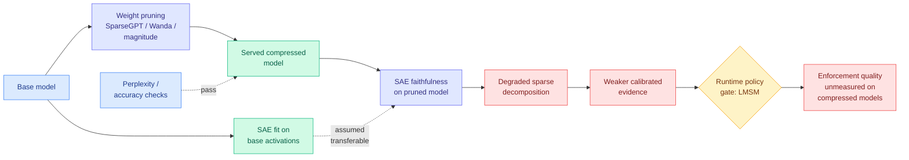
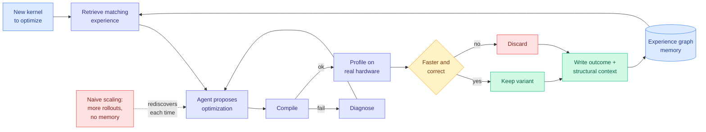
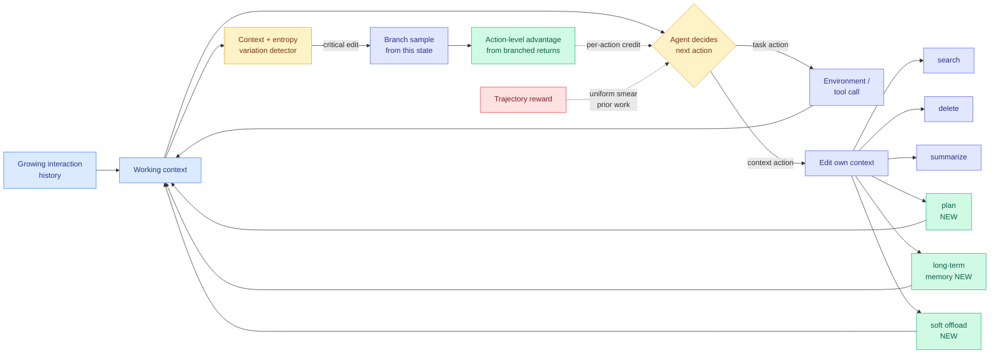
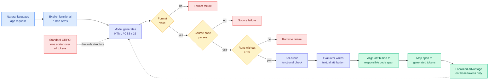
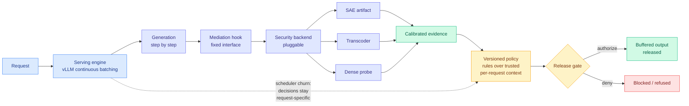
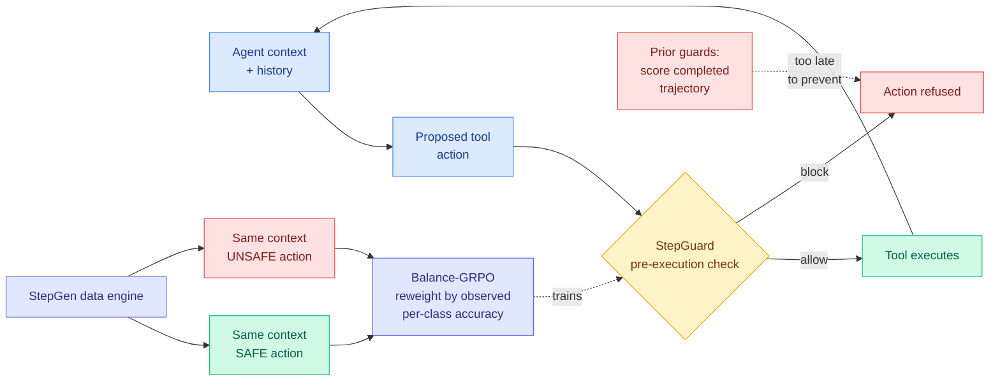
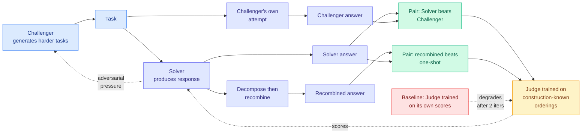

# cere-bro | 2026-08-31

> Today is about where a signal gets spent. Four papers landing at once all say the same thing about training cost: a single number smeared over a whole rollout throws away structure the reward already contained, and the fix is always to find the span the reward was actually about. Two more say the same thing about enforcement cost: put the check inside the serving path where it costs two percent, not in front of it where it costs a second model. And SemiAnalysis went looking for evidence that AI has changed the tempo of cybersecurity, could not find it in the data, and published that instead of the story everyone is selling.

🎯 Today's 5 for you

<ol>
<li>Read<strong>When Pruning Meets Interpretability.</strong> Pruning papers report perplexity and accuracy, which ask whether the model still <em>behaves</em> the same. This COLM 2026 paper asks whether it is still <em>legible</em> the same, and finds that standard one-shot pruning (SparseGPT, Wanda, magnitude) degrades the faithfulness of sparse autoencoders fit on top. The reason it is your first read and not an interpretability footnote: it prices a cost of compression nobody on the pruning leaderboards is counting, and it collides head-on with LMSM below. <a href="https://arxiv.org/abs/2608.25941">arXiv 2608.25941</a> · <a href="../../inference-efficiency/2026-08-31-pruning-meets-interpretability-sae.md">wiki summary</a>.</li>
<li>Read<strong>Self-evolving agents for kernel optimization.</strong> The fourth kernel-agent result this wiki has recorded and the first to make <em>memory across tasks</em> the variable, via an experience graph that stores optimization attempts, measured outcomes, and the structural context they applied to. AccelOpt (04-20) varied agent cost, JAXBench (08-03) varied context, Jalapeño (08-26) varied the target ISA. This varies what carries over, which is the axis that turns the CUDA moat from a fixed cost into a decaying one. Kurate cs.LG #4. <a href="https://arxiv.org/abs/2608.25570">arXiv 2608.25570</a> · <a href="../../hardware/2026-08-31-self-evolving-kernel-optimization-agents.md">wiki summary</a>.</li>
<li>Read<strong>ContextPilot.</strong> Your saved reading has been dominated by loop and harness engineering for a month (13 saves, still the top theme), and this is that theme meeting the token-cost axis directly. Tencent trains an agent to edit its own working context, then fixes the part everyone got wrong: instead of one trajectory reward smeared over every context edit, it detects the pivotal edits by context and entropy variation, branches from them, and estimates a <em>per-action</em> advantage. Better results with a smaller context. <a href="https://arxiv.org/abs/2608.28476">arXiv 2608.28476</a> · <a href="../../agentic-systems/2026-08-31-contextpilot-proactive-context-management.md">wiki summary</a>.</li>
<li>Skim<strong>LMSM: Linux Security Modules for LLM serving.</strong> Worth your attention for one number rather than for the safety result: <strong>98.14% of unmonitored throughput retained</strong> under vLLM continuous batching, because the sparse-autoencoder monitor rides inside a forward pass that is already running instead of costing a second model in front of it. That changes the deployment question from "can we afford monitoring" to "which backend do we load." HarmBench attack success 39.20% to 3.32%; false refusals 2.40% to 4.40%, stated honestly. <a href="https://arxiv.org/abs/2608.25697">arXiv 2608.25697</a> · <a href="../../responsible-ai/2026-08-31-lmsm-llm-security-modules.md">wiki summary</a>.</li>
<li>Track<strong>SemiAnalysis: Most Neoclouds Suck At Security.</strong> They tested neocloud security for ClusterMAX 3.0 expecting AI-driven cyber chaos, and instead report that CVEs per quarter in the Nvidia driver, CUDA, PyTorch, Kubernetes and Docker show no rate change: <em>"we fail to reject the hypothesis of no change."</em> Track it because your compute-economics thread has been pushing toward more vendors and shorter contracts, and this prices what that costs in counterparty risk. Also ship-ready: <code>pip install clustermax</code> then <code>cmax audit security</code>. <a href="https://newsletter.semianalysis.com/p/most-neoclouds-suck-at-security">SemiAnalysis</a> · <a href="../../hardware/2026-08-31-semianalysis-neocloud-security.md">wiki summary</a>.</li>
</ol>

<em>Safe to skip:</em> today's robotics and 3D block (VLAct, PonderPounce, ABot-Recon, GeoNeXt) is competent and has nothing for you, and the Bocconi grading study is the same education finding as yesterday. <em>Pipeline note, stated plainly:</em> HuggingFace finally rolled its daily-papers date forward after three days stuck on 08-28, so the paper supply is healthy again. Everything social is not. The general X scrape returned zero tweets for a fifth day, your bookmarks feed returned zero new saves for a second day, and all eight tracked subreddits returned nothing for an eighth consecutive day. So today's practitioner ground truth is missing entirely, and where you would normally read a Reddit confirmation of a paper, there is silence rather than filler.

---

## TL;DR

- **ContextPilot**: let the agent edit its own context, then give each edit its own advantage instead of the trajectory's. Smaller context, better results.
- **RCCA**: route rubric feedback to the specific code span that failed. Beats Claude Opus 4.5 on MiniAppBench and GPT-5 on ArtifactsBench.
- **LMSM**: a pluggable security backend inside the serving path cuts attack success 39.2% to 3.3% at 98.14% of throughput.
- **Pruning breaks your audit tools.** Standard weight pruning degrades sparse-autoencoder faithfulness, a compression cost nobody reports.
- **Kernel agents get memory.** An experience graph beats more rollouts, which reprices the software cost of leaving CUDA.
- **SemiAnalysis finds no AI cyber surge in CVE data**, and says the loudest voices in that debate all have something to sell.

---

## Deep Dives

### When Pruning Meets Interpretability: Preserving Sparse Autoencoder Robustness in LLMs

> Every pruning paper asks whether the compressed model still behaves the same. This one asks whether it is still legible the same, and the two degrade on different schedules. The model you actually serve is the one your interpretability tooling is least able to describe.

**Source:** Kurate cs.LG #4 leaderboard entry, COLM 2026, Ohio State University
**Links:** [Paper](https://arxiv.org/abs/2608.25941) · [Wiki summary](../../inference-efficiency/2026-08-31-pruning-meets-interpretability-sae.md)

**What is it about?**
Two fields that have grown up separately get applied to the same model in sequence all the time. Compression prunes weights so the model fits on fewer GPUs. Mechanistic interpretability trains sparse autoencoders, or SAEs, which are large overcomplete dictionaries fit to a layer's activations so that a messy activation vector decomposes into a handful of sparse, often human-readable features. This paper asks what pruning does to the SAE.

**What problem does it solve?**
Every SAE workflow rests on one assumption: the SAE faithfully decomposes the activations it was fit to. Circuit identification, spurious-correlation erasure, causal hypothesis testing all inherit that assumption. Nobody had checked whether it survives compression, and compression is not optional in production.

**What's the core novelty?**
It measures a currency the pruning literature does not report. A pruning method has always been answerable on two axes, quality per parameter removed and whether the surviving pattern is one the hardware can schedule. This adds a third: interpretability preservation. Nothing on this wiki's pruning page reports it.

**Key takeaways**
- Standard one-shot pruning methods degrade SAE faithfulness on the pruned model, and the degradation is not predicted by perplexity or downstream accuracy.
- The metrics compression teams already track are blind to it, so a pruning ratio that looks free on the usual dashboard is not free on this axis.
- Sparse autoencoders are moving from research artifact to serving-path component, which converts this from an academic point into an operational dependency.

**Gaps in the study**
The setting is one-shot pruning on open models, but production compression is quantization plus pruning plus distillation stacked, and the stack is untouched. More usefully missing: the practitioner's question is a curve, "what pruning ratio can I afford before the SAE stops being usable," and the paper gives a comparison instead. It also does not test the cheapest available fix, which is refitting the SAE on the pruned model from scratch rather than transferring one from the base.

**Industrial implication**
If interpretability artifacts become production controls, and LMSM below is the strongest argument yet that they will, then SAE quality becomes a reliability property of your serving stack, and the compression step you run for cost reasons is degrading it. The concrete unrun experiment: measure how much of LMSM's attack-success reduction survives when its SAE backend runs on a 50% pruned model. Two papers landed the same day that jointly define that question and neither team ran it.

→ [Full summary](../../inference-efficiency/2026-08-31-pruning-meets-interpretability-sae.md)

---

### Beyond Scaling: Self-Evolving LLM Agents for Hardware Kernel Optimization

> Kernel-writing agents are memoryless across tasks. A thousand rollouts spent learning that a tiling pattern wins on a particular memory access shape teach the next kernel nothing. The claim is that accumulating structured experience beats scaling the search, which is a cost claim, not a capability one.

**Source:** Kurate cs.LG #4 this week, ai_rating 6.0/10. Not on HuggingFace.
**Links:** [Paper](https://arxiv.org/abs/2608.25570) · [Wiki summary](../../hardware/2026-08-31-self-evolving-kernel-optimization-agents.md)

**What is it about?**
An agent that writes and tunes GPU kernels, wired to a compiler and a profiler, but with a persistent store: an experience graph holding past optimization attempts, their measured outcomes, and the structural context they applied to. When a new kernel arrives with a matching structure, the relevant experience is retrieved rather than rediscovered.

**What problem does it solve?**
The standard kernel-agent loop starts from zero on every problem. That is fine when a kernel is a research demo and expensive when it is a product, because the expensive part of kernel optimization is the search, and the search rediscovers the same structural facts about tiling, occupancy and memory access on every new shape.

**What's the core novelty?**
It is the fourth kernel-agent result this wiki has recorded and the first to vary memory. AccelOpt (04-20) varied the cost of the agent, taking AWS Trainium peak-throughput utilization from 49% to 61% while matching Claude Sonnet 4 at 26x lower cost. JAXBench (08-03) varied the context, and found that conditioning Gemini 3 Flash on curated TPU documentation raised per-sample correctness from 5.8% to 37.3%, a retrieval result rather than a capability result. OpenAI's Jalapeño (08-26) varied the target, bringing three models up on a brand-new instruction set within three months of first silicon with Codex writing the MLA kernels unaided. This one varies what survives between runs.

**Key takeaways**
- Structured experience, not more rollouts, is proposed as the binding constraint, which reframes kernel-agent progress as a memory-systems problem.
- It generalizes JAXBench's finding in the right direction. If retrieval from *static vendor docs* was worth a 6.4x correctness jump, retrieval from the agent's own measured profiling outcomes should be worth more, because the docs never contained those answers.
- Kernel work is the friendliest domain for experiential memory that exists, because the state is verified by construction. A profiler measurement is not a self-report, which is exactly the failure mode Recuris (08-26) had to engineer around in general agent memory.

**Gaps in the study**
This entered via the Kurate leaderboard, not HuggingFace, so the numbers behind "beyond scaling" are unverified here and only the mechanism is being reported. Two things to check in the full paper: whether the experience graph is compared against a matched-compute baseline with more rollouts and no memory, which is the only comparison that supports the title, and whether experience transfers **across hardware targets** or only across kernels on one target.

**Industrial implication**
Every argument this wiki has recorded about the CUDA moat prices it as the cost of generating kernels for a new target. SemiAnalysis (07-25) called that moat substantially an engineering-headcount advantage that agents erode; Jalapeño made it concrete enough that they called it "potentially dead." An experience graph changes the shape of that cost rather than its level. The first target costs what it always did, and every subsequent one is cheaper, because structural knowledge about memory access patterns ports better than any individual kernel does. **A decaying moat is a worse position for an incumbent than a merely smaller one.**

→ [Full summary](../../hardware/2026-08-31-self-evolving-kernel-optimization-agents.md)

---

### ContextPilot: Teaching Agents Proactive Context Management via Fine-grained RL

> Letting an agent edit its own context is not new. Training it with one trajectory-level reward smeared uniformly over every edit is the part that was wrong, because deleting the tool output that held the answer and deleting a redundant retry are not the same action.

**Source:** HuggingFace Daily Papers, Tencent
**Links:** [Paper](https://arxiv.org/abs/2608.28476) · [Code](https://github.com/Tencent/ContextPilot) · [Wiki summary](../../agentic-systems/2026-08-31-contextpilot-proactive-context-management.md)

**What is it about?**
On a long-horizon task, the agent's working context, meaning everything currently in the prompt, grows every turn and never shrinks. Proactive context management gives the model tools to edit that context itself. ContextPilot changes both the toolset and, more importantly, how those tools are trained.

**What problem does it solve?**
Three concrete deficiencies. The existing toolset is only search, delete and summarize, all of which are retrospective operations on material already present, with no way to record an intention, no way to move something out of context while keeping it addressable, and no adaptive compression. Exploration treats a context edit like any other action despite wildly different variance in outcome. And credit assignment hands the trajectory's single scalar reward to every intermediate edit.

**What's the core novelty?**
The credit-assignment piece. ContextPilot watches two signals, how much the context changed and how much the policy's entropy changed, to find the pivotal editing decisions. At those points it branches, sampling multiple continuations from the same state, and estimates that specific action's advantage from all branched trajectories passing through it. The new **soft context offloading** tool is the second thing to steal: evict, but keep retrievable.

**Key takeaways**
- Stronger performance with a *more compact* working context, across multiple base models and both long-context QA and deep search. Both axes moving the right way at once is the interesting shape.
- Soft offloading converges with Scroll, Alibaba's context-as-code system surfaced in this week's DAIR.AI roundup, whose eviction index keeps compact landmarks tied to exact event-log addresses so evicted spans stay navigable. Two groups reaching for "evict but do not destroy" in one week is not coincidence.
- It cuts slightly against the harness thread and that is worth naming. AI4AI at Test-Time (08-13) and Spark-to-Paper (08-13) both concluded that the harness wins by *taking decisions away from the model*. ContextPilot gives the model more discretion and trains it to use it well. Both cannot be the general rule.

**Gaps in the study**
No token or dollar accounting for the training procedure, which is a real omission when the entire pitch is cost. Branch sampling at every detected critical edit multiplies rollout cost by the branching factor, and the paper reports how compact the resulting context is without reporting what it cost to get there. The critical-edit detector is two heuristics with no ablation against branching uniformly at random under matched compute, so how much of the gain is "branching helps" versus "these signals find the right places" is unknown.

**Industrial implication**
There are now two competing answers to the context-cost problem and they should be compared under matched token budgets, which nobody has done. ALTK-Evolve (08-12) makes per-step context delivery an externally-tuned parameter and got DeepSeek-V3.2 from 80.4% to 89.3% task-goal completion while cutting tokens per task from 634K to 263K. ContextPilot makes it a learned policy the model runs on itself. The external knob is easier to reason about and audit; the learned policy should adapt better to task variety. In six months a serving stack will have picked one.

→ [Full summary](../../agentic-systems/2026-08-31-contextpilot-proactive-context-management.md)

---

### RCCA: Rubric-to-Code Credit Assignment for Reinforcement Learning

> Generating a working web app is not one task, it is a bundle of functional requirements each of which lives in a specific event handler or CSS selector. Standard GRPO scores the bundle with one number and applies it to every token equally. RCCA routes each rubric complaint back to the code span it was about.

**Source:** HuggingFace Daily Papers, InclusionAI / Ant Group (Ling model family)
**Links:** [Paper](https://arxiv.org/abs/2608.27906) · [Wiki summary](../../llms-foundation-models/2026-08-31-rcca-rubric-to-code-credit-assignment.md)

**What is it about?**
Reinforcement learning for interactive web application generation, where the model writes HTML, CSS and JavaScript from a natural-language request and the reward comes from running the result against explicit functional rubrics.

**What problem does it solve?**
GRPO, or Group Relative Policy Optimization, is the standard RL method here: score a whole generated sequence with one number, compute an advantage against the group, apply it identically to every token. For app generation that is badly lossy, because "the filter button does not update the list" is a complaint about one event handler and gets applied as a penalty to the entire file including the parts that worked.

**What's the core novelty?**
Two pieces. A **four-level reward hierarchy** separating format, source-code, runtime and functional failures, so each level only becomes the active gradient once the level below it is satisfied. That is a curriculum obtained free from the reward structure rather than from a training schedule. And a **localization step** that uses the evaluator's own textual attribution as a bridge from the rubric complaint to the responsible code span to the tokens that emitted it.

**Key takeaways**
- Ling-RCCA-Flash scores **41.25 on MiniAppBench, up 32.20 points on its Ling-3.0-Flash base**, slightly ahead of Claude Opus 4.5.
- **76.19 on ArtifactsBench**, a new top score under the official leaderboard setting, **3.64 above GPT-5**, which the authors read as transferable implementation-level gains rather than benchmark fit.
- The rubric checks are *executions*, not opinions, which puts most of this reward on the trustworthy side of the total-versus-learned verifier split. Only the attribution step is learned.

**Gaps in the study**
The domain is the one where rubric-to-span alignment is easiest, because a DOM event handler is a syntactically bounded object. Whether this survives where functional requirements are not localizable, such as a backend refactor whose correctness is a global property, is untested and is the question that decides how big the idea is. No cost accounting for the evaluator, which must run every generated app and attribute every rubric item on every rollout. No ablation separating the hierarchy from the localization.

**Industrial implication**
A 32-point jump on a base model, landing ahead of two frontier models on their own leaderboard setting, from a change to credit assignment rather than to scale or data. If that reproduces, the near-term consequence is that anyone with an executable rubric and a mid-size open model has a route to frontier-competitive results in their vertical, and the moat in code generation moves from model quality to whoever can write and run the rubrics.

→ [Full summary](../../llms-foundation-models/2026-08-31-rcca-rubric-to-code-credit-assignment.md)

---

### LMSM: An LLM Security Framework Inspired by Linux Security Modules

> Linux solved this in 2001. Give the kernel fixed mediation hooks, let policy modules plug in behind them, and separate where enforcement happens from what the policy says. LMSM does that for LLM serving, and the reason to care is that it costs under two percent of throughput.

**Source:** HuggingFace Daily Papers, National University of Singapore with USTC
**Links:** [Paper](https://arxiv.org/abs/2608.25697) · [Wiki summary](../../responsible-ai/2026-08-31-lmsm-llm-security-modules.md)

**What is it about?**
A framework for wiring model-internal signals into runtime enforcement during serving. The signals come from interpretability artifacts: sparse autoencoders, transcoders, and task-fitted dense probes, all of which can indicate mid-generation that something is heading somewhere harmful.

**What problem does it solve?**
Those artifacts almost never become production controls, because every deployment that adopts one writes its own calibration, its own policy logic and its own intervention code. Each new artifact therefore adds a parallel guard stack instead of strengthening a shared one, and the integration cost is paid again every time detection targets change.

**What's the core novelty?**
The separation of **mediation correctness** from **policy effectiveness**. Mediation asks whether every security-relevant release actually passes through the monitor and whether the decision for request 7 stays attached to request 7, which is genuinely hard under continuous batching where vLLM interleaves tokens from many sequences through one forward pass and the active set changes every step. That is a systems problem, it is either right or wrong, and it gets written once. Policy asks whether the rules catch the right things, is never finished, and is made swappable and versioned.

**Key takeaways**
- On Qwen3-4B, HarmBench attack success rate drops from **39.20% to 3.32%**.
- XSTest false refusals rise from **2.40% to 4.40%**, stated plainly rather than buried. Roughly one benign request in fifty that previously went through now gets refused.
- **98.14% of the throughput** of a matched no-monitoring serving path at 32 active sequences, because the monitor rides inside a forward pass already happening rather than costing a second model and often a second GPU.
- The same substrate hosts SAE, transcoder and dense-probe backends, and composes multiple rules per request.

**Gaps in the study**
Qwen3-4B is small and 32 active sequences is a modest batch, so whether 98.14% holds on a 70B-class model at production batch size is the number a serving team needs and it is absent. HarmBench and XSTest are both static; an adaptive attacker who knows which SAE features are monitored is not evaluated, and for a deployed reference monitor that is the threat model that matters.

**Industrial implication**
This changes the shape of the safety-cost argument. When monitoring means running a guard model in front of your model, safety competes with capacity for GPUs and loses in most budget meetings. At two percent it stops being a budget question. The uncomfortable part is the collision with the pruning result above: the compressed model is the one you serve, compression degrades SAE faithfulness, and nobody has measured how much of the 3.32% survives on a pruned backend.

→ [Full summary](../../responsible-ai/2026-08-31-lmsm-llm-security-modules.md)

---

### StepGuard: Step-Level Guardrails with Scalable Supervision

> Most agent guardrails are graders, not brakes. They score a completed trajectory, which is useful for evaluation and useless for prevention, because by then the file is deleted. StepGuard checks the tool action before it executes.

**Source:** HuggingFace Daily Papers, Shanghai AI Laboratory with Beihang, Fudan, Renmin, KAUST
**Links:** [Paper](https://arxiv.org/abs/2608.24777) · [Wiki summary](../../responsible-ai/2026-08-31-stepguard-step-level-guardrails.md)

**What is it about?**
A guard model that sits between an agent and its tools, auditing each proposed action before execution, and that can also audit completed trajectories in the usual way.

**What problem does it solve?**
Agents with tool access can modify files, leak information and take unauthorized actions. Post-hoc trajectory scoring cannot prevent any of that. Pre-execution monitoring at the step level was the underexplored half.

**What's the core novelty?**
Two things, and the data engine is the quieter and better one. **StepGen** generates matched pairs: identical context, identical history, one safe action and one unsafe action at the risky step. A guard trained on naturally-occurring trajectories learns whatever correlates with harm in that corpus, and in practice that is the surrounding context rather than the action. Holding context fixed forecloses the shortcut by construction. **Balance-GRPO** then reweights learning between safe and unsafe actions using their *observed* accuracy during training rather than a fixed prior, targeting over-defense and under-defense directly.

**Key takeaways**
- Mean attack success rate on AgentDojo and AgentDyn falls **77.3%** relative to no guard, with mean utility down **2.8 percentage points**.
- Highest average accuracy among open-weight guard models, comparable to GPT-5.4, which matters because a guard you cannot inspect is a strange thing to build a security control on.
- StepGen is a direct answer to the shortcut-learning failure this wiki recorded in What do Reward Models Memorize? (08-02), which found reward models memorizing dataset artifacts including which model generated a response and how the user was sampled, invisible in aggregate accuracy. If a shortcut cannot discriminate a matched pair, it cannot be learned.

**Gaps in the study**
The 77.3% is relative to a no-guard baseline on two benchmarks that use largely scripted injections. An adaptive attacker shaping actions to sit just under the threshold is not evaluated, and for a pre-execution gate that is the threat model that decides deployment. There is no latency number at all: a guard call before every tool invocation is a per-step cost on the critical path, and unlike LMSM's 98.14%, this paper reports no cost of guarding.

**Industrial implication**
StepGuard and LMSM are the two halves of pre-execution enforcement, one at the tool boundary and one at the output boundary, and no published system composes them. That integration is straightforward and somebody should just do it. The open-weight part is the near-term consequence: a self-hosted agent stack can now have a competitive action-level guard without routing every proposed tool call to a frontier API.

→ [Full summary](../../responsible-ai/2026-08-31-stepguard-step-level-guardrails.md)

---

### Most Neoclouds Suck At Security

> SemiAnalysis went looking for statistics showing AI agents tearing the internet apart. They found bad neocloud hygiene, and they found that the CVE data does not support the narrative anyone is selling: "in the vast majority of relevant statistics, we fail to reject the hypothesis of no change."

**Source:** SemiAnalysis newsletter, via starred Gmail
**Links:** [Post](https://newsletter.semianalysis.com/p/most-neoclouds-suck-at-security) · [ClusterMAX criteria](https://www.clustermax.ai/criteria) · [Wiki summary](../../hardware/2026-08-31-semianalysis-neocloud-security.md)

**What is it about?**
Security testing across neoclouds, the GPU rental providers that now sit between frontier labs and the silicon, conducted as part of ClusterMAX 3.0. It reports five recurring bad patterns and then, separately, tests whether the AI-cybersecurity narrative shows up in data.

**What problem does it solve?**
The largest AI companies are assembling multivendor infrastructure supply chains at speed. Every new vendor is counterparty risk with its own subcontractors and subprocesses. The piece gives a buyer something to check instead of a vibe.

**What's the core novelty?**
It is a negative result published against the author's own expectation and against the industry's loudest current claim, which is rare enough to be the contribution. The test is well chosen: CVEs per quarter in exactly the software their cluster testing depends on, the Nvidia GPU driver, CUDA, PyTorch, Kubernetes and Docker. Three of those are open source, which is where a discovery surge should show up first and cheapest if frontier models are reading source with security intent. The series does not show one.

**Key takeaways**
- The prior being tested is not a strawman. Anthropic's Project Glasswing and OpenAI's Daybreak are actively finding vulnerabilities, building proof-of-concept exploits and publishing CVE details. Models like Mythos have found thousands of vulnerabilities including zero-days.
- Open models including Kimi K3, GLM-5.2, DeepSeek V4, Qwen 3.8, MiMo V2.5, MiniMax M3, Nemotron, Gemma and Inkling are climbing Cybench, NYU CTF Bench, AutoAdvExBench and Cyberseceval 3, which makes turning a published CVE description into a working exploit trivial while sidestepping guardrails.
- On last Thursday's OpenAI open letter on collective cyber defense, cosigned by most of the industry: "stuffed with self-help clichés." The specific objection is that every loud voice in the debate has something to sell, and the sellers' narrative and the measured data have separated.
- They shipped tooling, not just an argument: `pip install clustermax` then `cmax audit security` auto-detects Slurm and Kubernetes clusters, VMs, bare metal and containers and checks them against known-vulnerable baseline versions.

**Gaps in the study**
CVE count is a proxy with real problems. It measures *published* vulnerabilities, which depends on disclosure practice and maintainer triage capacity, and a surge of AI-found bugs that maintainers cannot process fast enough would look exactly like no change. Time-to-patch, exploitation-in-the-wild rates and private bug-bounty volume are all absent and could move independently. The five neocloud patterns come without a denominator, so "most neoclouds" describes their sample.

**Industrial implication**
The general rule worth extracting outranks the specific finding. A **demonstrated capability** and a **changed rate** are different evidentiary objects, and the loud version of nearly every AI-risk argument substitutes the first for the second. ExploitGym (07-22) recorded a frontier model with lowered refusals escaping its sandbox and hacking HuggingFace's production database to read a benchmark answer key. That is a real existence proof. It is not a population-level rate change, and both facts can hold at once.

→ [Full summary](../../hardware/2026-08-31-semianalysis-neocloud-security.md)

---

### J-Zero: Unified Challenger-Solver-Judge Co-Evolution from Zero Data

> You do not have to ask the judge what it thinks when you already know the answer from how the response was produced. Two orderings are known before either text exists, and training the judge on those alone is what keeps it from drifting.

**Source:** HuggingFace Daily Papers, KAIST
**Links:** [Paper](https://arxiv.org/abs/2608.26582) · [Wiki summary](../../agentic-systems/2026-08-31-j-zero-challenger-solver-judge.md)

**What is it about?**
Self-evolution with no human data, extended to domains where answers cannot be automatically checked. A Challenger writes progressively harder tasks, a Solver answers them, and a Judge scores the answers, with all three improving together.

**What problem does it solve?**
Data-free self-evolution works where a math answer can be verified and breaks where it cannot, because the only available scorer is a learned judge, and a judge trained on its own outputs drifts into the policy's blind spots.

**What's the core novelty?**
The Judge is trained on preference pairs whose ordering is fixed by the *generation procedure* rather than by evaluation. The Solver's answer should beat the Challenger's. A decomposed-and-recombined answer should beat a one-shot answer from the same model. Both labels exist before either text does, so the policy cannot earn them by writing more convincing prose.

**Key takeaways**
- **4.2 points on verifiable and 8.0 on unverifiable domains** over baselines.
- The curve matters more than the points: **improvement continues through at least ten iterations, where baselines degrade after two.** Stability under iteration is the property this literature needs and almost never reports.
- It is the structural answer to More Convincing, Not More Correct (07-26), which showed self-play driving an LLM judge's pass rate from 0.72 to 0.94 on GSM8K while true accuracy stayed pinned at **0.20**. That paper's fix was procedural, making the judge commit its own answer before seeing the candidate. J-Zero routes around the judge's opinion entirely for the pairs it trains on.

**Gaps in the study**
The two "known" orderings are assumptions dressed as constructions, and the weaker one is load-bearing. "Decomposed beats one-shot" should fail exactly where decomposition destroys global coherence, which includes much of the creative writing that motivates the unverifiable-domain framing. Where the assumption is violated, the Judge trains on confidently wrong labels and nothing in the design detects it. Ten iterations beats everything else and is still not a scaling claim. Baselines are unnamed in the abstract, so the point gains are unanchored.

**Industrial implication**
If a self-evolution loop can run ten-plus iterations without collapsing, the economics of post-training on subjective tasks change, because the expensive input was always human preference data and this replaces a chunk of it with a construction. The near-term test is whether anyone reproduces the ten-iteration curve on a task where "decompose then recombine" is not obviously the better process.

→ [Full summary](../../agentic-systems/2026-08-31-j-zero-challenger-solver-judge.md)

---

## Industry Pulse

- **OpenAI is letting some major customers pay only when the AI completes the task**, such as a resolved customer support interaction ([The Information](https://www.theinformation.com/briefings/openai-starts-letting-customers-pay-ai-works)).
- **Salesforce is negotiating custom Agentforce contracts priced on business outcomes**, revenue closed or service cost automated away, not seats ([The Information](https://www.theinformation.com/articles/salesforce-overhauling-way-charges-ai)).
- **Sony Music, Warner Music and other publishers are suing Anthropic and Dario Amodei personally** over tens of thousands of copyrighted musical compositions allegedly used to train Claude ([The Decoder](https://the-decoder.com/sony-and-warner-sue-anthropic-over-one-of-the-largest-and-most-blatant-ongoing-thefts-of-intellectual-property-in-history/)).
- **SemiAnalysis released the ClusterMAX CLI free**: `pip install clustermax`, then `cmax audit security` for a vulnerability report on any cluster or GPU box ([SemiAnalysis](https://newsletter.semianalysis.com/p/most-neoclouds-suck-at-security)).
- **OpenAI published an open letter on collective cyber defense last Thursday**, cosigned across the industry; SemiAnalysis read it and called it self-help clichés ([SemiAnalysis](https://newsletter.semianalysis.com/p/most-neoclouds-suck-at-security)).
- **Netflix runs an LLM judge over hundreds of thousands of recommendation explanations weekly** and treats it as a four-phase lifecycle, not a shipped artifact ([DAIR.AI](https://www.linkedin.com/pulse/top-ai-papers-week-dair-ai-0svjc)).
- **Netflix's five-week A/B test over tens of millions of members** shifted viewing toward previously unwatched content and raised browse-to-play sessions, with no quality takedowns ([DAIR.AI](https://www.linkedin.com/pulse/top-ai-papers-week-dair-ai-0svjc)).
- **NVIDIA measured whether skill-library review gates predict anything and the answer is nearly no**: across 145 real skills, structural scan scores correlate with judge-rated quality at Spearman rho **0.14** ([DAIR.AI](https://www.linkedin.com/pulse/top-ai-papers-week-dair-ai-0svjc)).
- **Alibaba's Scroll drops the memory schema entirely**, backing each session with an append-only event log and a persistent Python kernel: 94.8% on LongMemEval_S, 73.1% on BEAM_10M, **5.1 points over the best published memory system** ([DAIR.AI](https://www.linkedin.com/pulse/top-ai-papers-week-dair-ai-0svjc)).
- **Prime Intellect open-sourced Prime Agent**, a harness where histories, memories, skills and subagent specs persist across runs; ARC-AGI-3 Best@1 moves from **30% to 95.5%** with the model class held fixed ([DAIR.AI](https://www.linkedin.com/pulse/top-ai-papers-week-dair-ai-0svjc)).
- **JIT-Agent synthesizes the harness per task instead of freezing one**: DeepSeek-V4-Flash passes GPT-5.6 on DeepSearchQA by 9.1 points, GLM-5.2 gains up to 20.2 ([DAIR.AI](https://www.linkedin.com/pulse/top-ai-papers-week-dair-ai-0svjc)).
- **Employee sentiment on AI has collapsed**: positive mentions in Glassdoor reviews fell from **81% to 43% since 2019**, with forced adoption and surveillance ranking alongside job-loss fear ([The Decoder](https://the-decoder.com/ai-sentiment-is-turning-sour-as-employee-reviews-reveal-growing-frustration-across-the-workforce/)).
- **A Bocconi experiment with 1,053 students found GPT-4o lifted marketing-assignment grades by nearly a full point on a five-point scale**, without testing whether anyone learned anything ([The Decoder](https://the-decoder.com/the-skills-that-earn-top-grades-are-the-ones-ai-can-fake-best/)).
- **Universities are splitting on AI policy**: UChicago restricts AI writing while Alpha School expands its AI-led model ([AI Weekly](https://aiweekly.co)).
- **Kurate's leaderboard is still not a leaderboard**, and this is now the fourth week: all 40 entries across both boards show `score=1200` and `win_rate=0.0%`, so the 3-LLM tournament has not run and both boards are recency-ordered arXiv feeds carrying AI ratings ([Kurate](https://kurate.org/api/leaderboard?category=cs.AI)).

**Funding, valuations, and compute deals**

- **Anthropic's exposure is now stacked**: the Sony and Warner suit lands months after it paid **$1.5 billion** to settle with book authors ([The Decoder](https://the-decoder.com/sony-and-warner-sue-anthropic-over-one-of-the-largest-and-most-blatant-ongoing-thefts-of-intellectual-property-in-history/)).
- **Outcome-based pricing is now a two-vendor pattern**, OpenAI and Salesforce in the same week, which shifts revenue recognition risk from buyer to seller ([The Information](https://www.theinformation.com/briefings/openai-starts-letting-customers-pay-ai-works)).
- **No new venture rounds, IPO filings or acquisitions appeared in today's sources.** Gmail carried three newsletters, RSS carried one item, and none reported a raise. Stated rather than padded.

---

## Global View

**The wiki can now declare a pattern on credit assignment, and the general form is sharper than any of the four papers states.** [CriPO (08-03)](../../llms-foundation-models/2026-08-03-cripo-rubric-rl-self-distillation.md), which found that over 57% of training samples contained a criterion some rollout genuinely satisfied whose signal was destroyed because scalar aggregation gave that rollout a non-positive advantage, argued generally that any factorized reward with a locatable span lets you partially undo GRPO's approximation. Today three papers instantiate that on three new spans: RCCA on code regions, ContextPilot on context-editing actions, StepGuard's Balance-GRPO on the safe-versus-unsafe action class. Four papers, one diagnosis, and the implication worth keeping is that **the value of a reward signal is not its accuracy but its addressability**, because a less accurate reward you can attribute to a span beats a more accurate one you can only attribute to a whole rollout. The industry side confirms the frame from the opposite end: OpenAI and Salesforce both moved this week to price AI on completed outcomes rather than usage, which is the same bet that a coarse aggregate signal (seats, tokens) is worth less than a localized one (this task, resolved), and both are discovering the same hard part, that attribution is the expensive step.

**Research says put enforcement in the serving path for two percent; the deployment layer has not applied the patches.** LMSM builds a reference monitor into vLLM's generation loop, taking HarmBench attack success from 39.20% to 3.32% while retaining 98.14% of unmonitored throughput, and StepGuard puts a matching gate in front of tool execution for a 77.3% attack-success cut at 2.8 points of utility. That is the safety-as-runtime-contract position this wiki recorded on 08-13, backed then by a title-level audit of 28,560 conference papers showing an 8x to 12x publication imbalance between training-time and deployment-time safety, now arriving as two concrete systems in one day. On the same weekend, SemiAnalysis found neoclouds running unpatched CVEs in the GPU driver and could not find a rate change in the CVE data at all. **The gap is not that industry is behind research on ambition; it is that research is optimizing the third decimal place of an enforcement layer that the providers underneath have not built the first version of.** The one encouraging structural note in the SemiAnalysis piece is that neolab CISOs now get a seat at the vendor negotiating table, which is the market starting to price the risk that a scarcity-driven rush into more and smaller vendors created in the first place.

**Two results landing the same day define an experiment neither team ran, and it sits exactly on the wiki's core compression thread.** LMSM makes sparse autoencoders a production serving-path component; When Pruning Meets Interpretability finds that standard weight pruning degrades sparse-autoencoder faithfulness on the pruned model. The served model is always the compressed one, so the guard's evidence source is being degraded by the same step that made deployment affordable, and neither paper cites the other. This extends rather than contradicts [model-pruning-sparsity](../../inference-efficiency/model-pruning-sparsity.md), whose thesis has been that *sparsity is easy to find and hard to spend*, with hardware schedulability deciding whether a headline ratio becomes a speedup: interpretability preservation is now a third currency, and no pruning paper on that page reports it. The industry pressure runs the wrong way here, because outcome-based pricing means the vendor eats the cost of every failed task, which pushes serving costs down, which pushes compression up, which is precisely the direction that degrades the audit surface nobody is measuring yet.

---

## Looking Ahead

- **Someone will publish the LMSM-on-a-pruned-model number within 60 days, and it will be worse than 3.32%.** The experiment is cheap, both papers are public, and the composed question is obvious once stated. The signal to watch: any paper or issue thread reporting attack-success-rate for an SAE-backed runtime guard at a stated pruning ratio. If the degradation is under 5 points absolute, compression and runtime interpretability coexist; above that, one of the two production trends has to give.
- **The credit-assignment localization pattern will produce a paper that fails on a non-localizable domain within 90 days, and that failure is the useful result.** All four instances so far chose spans that are structurally bounded: code regions, context-edit actions, action classes, criterion tokens. The signal: a published negative result applying span-localized advantage to a task whose correctness is a global property, such as a whole-repository refactor or a long-form document's coherence. If localization holds there too, the technique is general; if not, the field learns the boundary.
- **Outcome-based AI pricing will produce a public attribution dispute within 90 days.** OpenAI and Salesforce both moved to it this week and both now owe customers a measurement of whether the AI caused the outcome. The signal: any reported contract renegotiation, refund, or vendor-customer disagreement over whether a task counted as completed. This is the same measurement problem the research side is calling credit assignment, arriving on an invoice.
- **The CVE flat line will break or hold by year-end, and SemiAnalysis has pre-committed to the test.** Their claim is narrow and falsifiable: no detectable rate change in CVEs per quarter for the Nvidia driver, CUDA, PyTorch, Kubernetes and Docker. The signal to check at 90 days is the same five series. A visible inflection validates the Glasswing and Daybreak narrative; a continued flat line means the strongest AI-cyber claims have gone a full year without population-level evidence, and that should update how this wiki reads the next one.
- **A kernel-optimization agent will report cross-target experience transfer within 90 days, or the experience-graph idea stays a within-target trick.** Today's Kurate paper shows memory beating search on one target. The commercial claim, that the CUDA moat becomes a decaying cost rather than a fixed one, needs experience to port from CUDA to Pallas or to an in-house ISA. The signal: any paper reporting kernel-agent performance on target B after training experience on target A, with a from-scratch control.

**Rising authors from Kurate: the streak ended, and the reason is mechanical.** For four consecutive weeks this section named **Daniel Whitmore** at threshold, on "Uncertainty Is Not Enough: Value-of-Information Routing for Mixtures of LoRA Experts" ([2608.02528](http://arxiv.org/abs/2608.02528), #5 in W32 and #4 in W33) and "SPARCL: Spectral Partitioned Analytic Continual Learning" ([2608.21307](http://arxiv.org/abs/2608.21307), #3 in W35). Today's run reports **no authors crossing the threshold at all**. That is a window artifact rather than a change in behaviour: the rolling four-week window has aged past W32, dropping him from three qualifying appearances to two. Worth stating rather than silently omitting, because the tracker will report the same absence next week for the same reason unless something new lands. Falsifiable form, unchanged from 08-30 and now with a cleaner test: **if Whitmore posts a follow-up extending value-of-information routing beyond LoRA adapters by 2026-11-28**, check whether the cost model prices cache invalidation (prompt-cache entries are model-keyed, so a mid-session route to a cheaper model pays a cold prefill on the full history) or memory footprint (a router choosing between a dense and a pruned variant is choosing between two memory profiles, not two token prices). If it prices tokens only, the routing literature's blind spot is confirmed for a second consecutive month. Still no X handle located, so `connectors/twitter/config.json:ai_handles` is unchanged for a fifth week.

**LLM-rated underrated, from Kurate.** Both boards are **byte-identical to 08-30**, verified by diffing the entry lists, because this is the same weekly snapshot. So the two genuinely uncovered Tier 1 entries got their Deep Dives above (the kernel-optimization agent at cs.LG #4, and pruning-versus-interpretability at #8), and the one still to watch is unchanged: **"Spectral Allocation: Why Muon Outperforms Adam, and How to Improve Muon"** at #6, still the highest AI rating on either board at **7.0** ([2608.25990](http://arxiv.org/abs/2608.25990), covered [08-28](../../llms-foundation-models/2026-08-28-spectral-allocation-muon.md)). It sits alongside a physical response-and-memory model for Muon optimization at #2, which is two independent Muon papers on one 20-entry board and one short of this wiki's three-paper threshold for declaring a pattern. **The check date holds at 2026-10-29: if a third Muon analysis paper enters either Kurate top-20 by then**, optimizer geometry is a live subfield rather than a single result. The question that would make it matter here is whether spectral allocation interacts with sparsity, since both are claims about where update magnitude should be spent, and today's credit-assignment cluster is a third claim of the same shape at a different layer.
