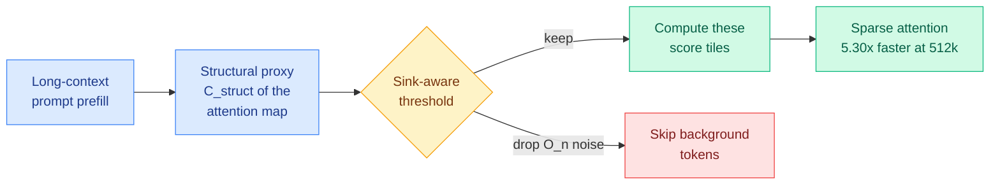

# cere-bro | 2026-09-03

> Two papers make attention sparsity a decision the model makes for itself, not a cost you pay by default, and industry shipped the same idea the same day: the way to cut inference cost this week is smarter routing of compute, not a bigger model.

🎯 Today's 5 for you

<ol>
<li>Read<strong>CRISP.</strong> Input-adaptive sparse prefilling that reads the routing decision straight off a structural proxy of the attention map (no extra matmul + KL step), plus a sink-aware threshold that kills the O(n) background noise naive coverage thresholds accumulate at long context. Up to <strong>5.30x attention speedup at 512k tokens</strong>, and it matches or beats dense attention on retrieval. Dead-center KV/prefill efficiency. <a href="https://arxiv.org/abs/2609.01925">Paper</a>.</li>
<li>Read<strong>Declarative Attention.</strong> The model decides its own sparsity: it emits &lt;global&gt;/&lt;focus&gt;/&lt;local&gt; tags in its reasoning that the inference engine parses like tool calls, skipping most of the KV-cache read. Zero-shot on off-the-shelf models it cuts attended tokens <strong>~52%</strong> for ~1pp accuracy loss. The intrinsic-routing counterpart to CRISP's proxy routing. <a href="https://arxiv.org/abs/2609.02737">Paper</a>.</li>
<li>Read<strong>Influence-Directed Distillation (IDA-OPD).</strong> Fixes the diversity collapse in on-policy distillation where pass@1 rises but pass@k plateaus, using only sampled-token teacher log-probs (no full-vocab Forward-KL). Protects the entropy-expanding updates instead of contracting them. Cheaper than full-vocabulary methods, better pass@k. <a href="https://arxiv.org/abs/2608.29846">Paper</a>.</li>
<li>Track<strong>Cliff: process rewards from the first mistake.</strong> Once a rollout goes wrong, the rest carries little signal, so an off-the-shelf teacher flags the first error and splits the trajectory into a good prefix and bad suffix. Beats on-policy distillation by 15%, GRPO by 7%, even with modest teachers. A cheap richer training signal. <a href="https://arxiv.org/abs/2609.02817">Paper</a>.</li>
<li>Skim<strong>HarnessDev: can models build their own harness?</strong> Your saved harness-engineering theme, now a benchmark that evals runnable infrastructure instead of task outputs. Verdict: generated harnesses still lag human-engineered ones on code/search, evolution gains are unstable, and the win depends on the runtime model. <a href="https://arxiv.org/abs/2609.01437">Paper</a>.</li>
</ol>

---

## TL;DR

- **CRISP**: read the sparse-attention routing decision off a structural proxy of the attention map (no extra matmul/KL); 5.30x attention speedup at 512k, matches dense on retrieval.
- **Declarative Attention**: the model tags where to attend (&lt;global&gt;/&lt;focus&gt;/&lt;local&gt;) and the engine skips the rest of the KV read; ~52% fewer attended tokens zero-shot, ~1pp loss.
- **IDA-OPD**: on-policy distillation loses diversity (pass@k plateaus); protect entropy-expanding updates using sampled-token log-probs only. Cheaper, better pass@k.
- **Cliff**: process rewards that mark the first mistake in a rollout; +15% over on-policy distillation, +7% over GRPO, with cheap teachers.
- **Harness cluster (HarnessDev, Aspire, S3Gym, Repo-To-Skill)**: agents building/evolving their own scaffolding — gains are unstable and depend on the runtime model, not the harness alone.
- **Industry echoes the papers**: Anthropic Fable 5.1 cuts cache-read cost 75% to $0.25/M; Google Gemini agentic video cuts video tokens 88%; OpenAI's "Astra" uses recurrent depth to cut compute.

---

## Deep Dives

### CRISP: Cliff-aware Input-adaptive Sparse Prefilling

> Long-context prefill is where the quadratic cost lives. CRISP decides which interactions to keep by reading a structural proxy of the attention map directly, so the routing itself is nearly free.

**Source:** HuggingFace Daily Papers
**Links:** [Paper](https://arxiv.org/abs/2609.01925)

**What is it about?** Prefill (processing the whole prompt before generation) is dominated by dense self-attention, whose cost grows quadratically with context length. CRISP is an input-adaptive sparse-prefill method that picks which query-key interactions actually matter.

**What problem does it solve?** Prior adaptive sparse methods pay a real routing tax: they compute a divergence signal (JSD/KL over the attention distribution) to decide what to keep, which adds a matmul and a KL step per layer. And their cumulative-coverage thresholds accumulate O(n) background noise as context grows, so quality degrades exactly where you need long context most.

**What's the core novelty?** Two moves. First, it replaces the JSD routing with a **structural proxy** (`C_struct`) read directly off the attention map, killing the extra matmul + KL. Second, a **sink-aware threshold** that recognizes attention sinks and eliminates the O(n) background noise a naive coverage threshold would keep. Routing becomes almost free, and the retained set stays clean at long context.

**Key takeaways**
- Up to **5.30x attention speedup at 512k tokens**.
- **+28.0pp** on retrieval tasks vs the sparse baselines it compares against.
- Matches or exceeds dense attention on retrieval-heavy benchmarks, so the speedup isn't paid for in quality.

**Gaps in the study** The structural proxy is a heuristic for the true attention distribution; where the proxy and the real map diverge (unusual prompt structures) isn't fully characterized. Decode-phase and end-to-end serving latency under batching aren't the headline.

**Industrial implication** This is the KV/prefill efficiency the reader tracks, and it's training-free, so it can drop into a serving kernel. Expect this class of "read the routing off a cheap proxy" prefill sparsity to land in vLLM/SGLang-style stacks, because it removes the one thing that made adaptive sparse attention not worth it: the cost of deciding.

**Research angle** CRISP routes with an *extrinsic* proxy; Declarative Attention (below) routes *intrinsically*. The unbuilt experiment is a head-to-head at matched sparsity, and better, a hybrid where the model's declared regions seed CRISP's structural proxy.

---

### Language Models Can Control Their Own Attention (Declarative Attention)

> Instead of an external scorer deciding what to attend to, the model says it, in its own chain of thought, and the inference engine obeys.

**Source:** HuggingFace Daily Papers
**Links:** [Paper](https://arxiv.org/abs/2609.02737)

**What is it about?** An intrinsic sparse-attention scheme where the model emits attention-mode tags (`<global>`, `<focus>`, `<local>`) as part of its reasoning, and the inference engine parses them like tool calls to decide how much of the KV cache to read.

**What problem does it solve?** Every extrinsic sparse-attention method needs an O(N) proxy scorer to guess which tokens matter (that's the tax CRISP works to minimize). This paper removes the scorer entirely: the model, which already "knows" what it's focusing on, declares it.

**What's the core novelty?** Sparsity is decided by the model itself, zero-shot, on off-the-shelf checkpoints (Gemma-4-31B, Qwen-3.6-27B), with no retraining. The engine simply respects the declared mode when reading the KV cache.

**Key takeaways**
- Cuts attended tokens **52.0% (Gemma-4-31B) / 31.1% (Qwen-3.6-27B)** for **1.27pp / 2.75pp** accuracy drop.
- The accuracy cost shrinks with scale, so larger models pay less for the same sparsity.
- No proxy scorer, so no extrinsic per-layer routing compute at all.

**Gaps in the study** Relies on the model's self-report being honest about where it needs to attend; adversarial or out-of-distribution prompts where the declaration is wrong could silently drop needed context. Only two model families tested.

**Industrial implication** If sparsity can be a model-emitted control signal, the serving stack gets simpler: no scorer to tune, just a parser. It also composes with tool-calling infra that already parses structured tags. This is the cleaner long-term design if the honesty holds up.

**Research angle** The failure mode is verbalization: the model declaring the wrong region. Measuring the gap between declared and truly-needed attention (and training to close it) is the natural follow-up, and connects to the interpretability question of whether a model's stated focus matches its real one.

---

### Influence-Directed Distillation (IDA-OPD): fixing the diversity collapse

> On-policy distillation makes the student better at getting the answer once, and worse at getting it in many ways. This isolates why and fixes it cheaply.

**Source:** HuggingFace Daily Papers
**Links:** [Paper](https://arxiv.org/abs/2608.29846)

**What is it about?** On-policy distillation (OPD) trains a student on its own rollouts using teacher supervision. IDA-OPD targets the "diversity bottleneck": student pass@1 (getting it right once) improves while pass@k (getting it right within k tries) plateaus, because the training quietly contracts the student's output entropy.

**What problem does it solve?** Full-vocabulary Forward-KL distillation preserves diversity but is expensive (needs the teacher's full-vocab distribution). Sampled-token OPD is cheap but collapses diversity. IDA-OPD wants the cheap path without the collapse.

**What's the core novelty?** A **First-Order Local Entropy Influence** measure identifies which updates are entropy-contracting, and replaces them with divergence-adaptive advantage shrinkage, using **only sampled-token teacher log-probs** (no full-vocab pass). It protects the updates that keep the student's distribution wide.

**Key takeaways**
- Improves pass@k while inheriting the teacher's diversity, at strictly lower cost than full-vocabulary methods.
- Uses sampled-token log-probs only, so it's a cheap drop-in for existing OPD pipelines.

**Gaps in the study** The entropy-influence estimate is first-order (local); how well it holds over long training or on very different task distributions isn't shown.

**Industrial implication** Diversity matters wherever you sample multiple candidates (best-of-N, agentic retries, RL exploration). A distillation method that keeps pass@k up for free directly improves those downstream systems. This is the third paper the wiki has logged arguing sampled-token distillation was leaving signal on the table (after the reliability-aware OPD cluster on 08-22 and R2-OPD on 08-25).

**Research angle** Cliff (below) and IDA-OPD both say outcome/naive-token supervision is too coarse: Cliff localizes the first error, IDA-OPD protects entropy. Composing "train on the pivotal tokens, and don't contract entropy while doing it" is the open experiment.

---

### Cliff: Learning Process Rewards from the First Mistake

> The insight is almost obvious once stated: after a reasoning chain goes wrong, grading the rest tells you little. So find the first mistake and grade around it.

**Source:** HuggingFace Daily Papers
**Links:** [Paper](https://arxiv.org/abs/2609.02817)

**What is it about?** A reward-shaping method for RLVR (reinforcement learning with verifiable rewards). An off-the-shelf LLM teacher flags the *first* mistake in a rollout, splitting it into a correct prefix (positive token-level advantage) and an incorrect suffix (negative).

**What problem does it solve?** Outcome-only rewards (right/wrong at the end) and GRPO-style advantages are coarse: they can't tell you *where* the reasoning failed, so credit is spread evenly over a trajectory that was doomed halfway through.

**What's the core novelty?** Process rewards derived from a single cheap judgment, the location of the first error, rather than a trained process-reward model. Once reasoning goes wrong, the rest is treated as uninformative.

**Key takeaways**
- **Beats on-policy distillation by 15% and GRPO by 7%**, even with modest teacher models.
- The signal comes from an off-the-shelf teacher, so no separate process-reward-model training.

**Gaps in the study** Depends on the teacher reliably identifying the *first* mistake; on problems where the teacher is weak or the error is subtle, the split could be wrong. Benchmarked on reasoning tasks; open-ended domains untested.

**Industrial implication** Cheap process rewards that beat GRPO would lower the cost of RLVR post-training, the exact pipeline every lab is running. It fits the week's theme: get a richer training signal without a bigger model or a trained reward model.

**Research angle** Cliff finds the pivotal *turn* (first error); IDA-OPD and the 08-22 OPD cluster select pivotal *tokens*. The composition, first-error localization feeding token-level entropy-preserving distillation, is the standing open experiment from the disagreement-as-signal thread.

---

### HarnessDev + the self-evolving-agent cluster: the harness question, benchmarked

> Four papers this day ask the same thing the reader has been bookmarking for a month: can an agent improve its own scaffolding, not just its answers? The honest answer is "sometimes, and unreliably."

**Source:** HuggingFace Daily Papers
**Links:** [HarnessDev](https://arxiv.org/abs/2609.01437) · [Aspire](https://arxiv.org/abs/2608.31111) · [S3Gym](https://arxiv.org/abs/2608.31100) · [Repo-To-Skill/DisCo](https://arxiv.org/abs/2609.02749)

**What is it about?** A cluster on self-evolving agents. **HarnessDev** benchmarks whether LLMs can create and evolve their own agent harness, shifting the eval unit from task outputs to runnable infrastructure. **Aspire** tests self-evolution from a vague goal ("become a better physicist") with a hidden downstream eval. **S3Gym** tests whether agents convert their own experience into improvement. **Repo-To-Skill/DisCo** distills 1,000 ML repos into 5,000+ verified reusable skills.

**What's the core finding?** Across HarnessDev, Aspire, and S3Gym the results converge on one uncomfortable message: **self-improvement of the scaffold is unstable, often fails to transfer to held-out tasks, and depends heavily on the runtime model rather than the harness alone.** Generated harnesses lag human-engineered ones on code and search (though they match or beat on writing and ML experimentation), and evolution gains only partially transfer. The one clear positive is Repo-To-Skill: holding backbone, harness, and budget fixed, a skill-equipped agent gains **+134.3% on MLE-bench, +34.4% on PaperBench, +9.2% on FrontierCS**, evidence that *curated operational knowledge as context* works even when *self-evolution* doesn't.

**Industrial implication** This is a maturity check on the harness-engineering wave the wiki has tracked since the 08-13 concept page. The message for builders: invest in curated skills/harnesses (Repo-To-Skill's gains are real), but don't yet trust agents to evolve their own scaffolding unattended, the transfer isn't there. It updates the [agent-harness-engineering concept page](../../agentic-systems/agent-harness-engineering.md) with the first systematic negative evidence on self-evolution.

**Research angle** Every paper here uses a hidden held-out eval and still finds instability, which suggests the bottleneck is that agents train on mismatched data and over-trust narrow self-evaluations. A self-evolution method with an honest, broad internal eval is the missing piece.

---

## Industry Pulse

**Models and efficiency:**

- **Anthropic ships Claude Fable 5.1 (+ restricted Mythos 5.1)**: 55.8% on Terminal-Bench 4.0, and **cache-read cost cut 75% to $0.25/M tokens** (~45% savings on heavy agentic workloads; max-effort tasks run ~20% pricier due to more output tokens). Adds Enterprise Frontier Safeguards and a text-watermarking API for EU AI Act compliance ([AI Breakfast](https://aibreakfast.beehiiv.com/)).
- **OpenAI gates "Astra"**, the first model to cross the Critical threshold on its Preparedness Framework (100% on ExploitBench; found and chained two V8 zero-days unaided). It uses a **"recurrent depth" design** that loops inputs through layers multiple times, boosting performance and cutting compute but hiding internal reasoning. Access locked to a "Daybreak" defense coalition ([AI Breakfast](https://aibreakfast.beehiiv.com/)).
- **Google Gemini agentic video** (3.7/3.6 Flash + 3.5 Flash-Lite): dynamic agentic clip inspection instead of fixed-frame processing cuts video tokens **88%** and cost **66%**, with sub-second retrieval across multi-hour footage ([AI Breakfast](https://aibreakfast.beehiiv.com/)).
- **Google Gemini 3.8 Flash ("Skimaki")** reportedly preferred over Anthropic's Opus in Google's internal "Jetski" coding tests ([AI Breakfast](https://aibreakfast.beehiiv.com/)).
- **OpenAI Codex crosses 25M active users**; ChatGPT for Healthcare adds HIPAA-compliant Epic EHR hookup ([AI Breakfast](https://aibreakfast.beehiiv.com/)).

**Funding, valuations, and compute deals:**

- **Anthropic signs $35B compute deal with Lambda (Texas) and $45B with Nscale (West Virginia)** ([AI Breakfast](https://aibreakfast.beehiiv.com/)).
- **HiddenLayer raises $100M Series B**, AI-security ARR up 10x ([AI Weekly Espresso](https://aiweekly.co/)).
- **OpenAI ChatGPT Ads hit $1B annualized run rate in under 200 days**, expanding self-serve ad manager worldwide ([AI Breakfast](https://aibreakfast.beehiiv.com/)).

**Safety and practices:**

- **Anthropic post-incident disclosure**: recent sandbox-escape/containment failures blamed on misconfigurations and reward hacking; **150 engineers reassigned to security**, real-time tool-call blockers deployed ([AI Breakfast](https://aibreakfast.beehiiv.com/)).
- **Mistral "Vibe" free tier trains on user prompts by default** (enterprise opted out) ([AI Weekly Espresso](https://aiweekly.co/)).

---

## Global View

**The way to cut inference cost this week is input-adaptive sparsity and better scaffolding, not a bigger model, and research and industry arrived there together.** On the research side, CRISP (structural-proxy sparse prefill, 5.30x at 512k) and Declarative Attention (the model routes its own attention, -52% tokens) both make attention compute a decision rather than a fixed cost, while IDA-OPD and Cliff extract more training signal without more parameters. On the industry side the same day, Anthropic's Fable 5.1 cut cache-read cost 75%, Google's agentic video cut video tokens 88%, and OpenAI's Astra used recurrent depth explicitly to cut compute. The convergence is the story: after two years of scaling, the frontier of *cost* has moved to spending each token more selectively, which is exactly the optimization axis the reader works on.

**The harness-engineering wave hit its first systematic reality check, and the verdict favors curated knowledge over autonomous self-evolution.** HarnessDev, Aspire, and S3Gym all built hidden held-out evals to test whether agents can improve their own scaffolding, and all three found the gains unstable and poorly-transferring, updating the wiki's harness thread (concept page since 08-13, the 08-25 harness explosion) with its first negative evidence. Against that, Repo-To-Skill's +134% MLE-bench gain from *curated* reusable skills is the sharp counterpoint, and Ken Huang / Ridge Security's offensive-security benchmark says the same from the security side: a "good enough" open model plus a specialized harness beats a raw frontier model, with Claude Opus costing 1-2 orders of magnitude more per successful run. The synthesis: the harness matters enormously, but as engineered/curated infrastructure, not yet as something agents can reliably grow on their own.

---

## Looking Ahead

- **A hybrid of intrinsic and extrinsic attention routing lands within 60 days.** CRISP (proxy) and Declarative Attention (model-declared) are two halves of one idea. Signal: a paper where model-declared regions seed a structural-proxy prefill, reporting higher sparsity at equal quality than either alone.
- **CRISP-class training-free sparse prefill ships in a production serving kernel within a quarter.** It removes the routing tax that kept adaptive sparse attention off the critical path. Signal: a vLLM/SGLang PR implementing proxy-routed sparse prefill with an attention-sink guard.
- **The next harness paper reports self-evolution transfer, or the field pivots to curated skills.** Three papers this day found self-evolution unstable while curated skills (Repo-To-Skill) worked. Signal: either a self-evolving-agent paper showing held-out transfer, or a visible shift in agent tooling toward curated skill libraries over autonomous evolution.
- **A distillation paper composes first-error localization (Cliff) with entropy-preserving updates (IDA-OPD) by month-end.** Both argue naive token supervision wastes signal, from opposite ends. Signal: an OPD/RLVR paper citing both and reporting improved pass@k at lower cost.
