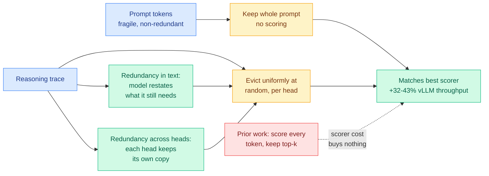
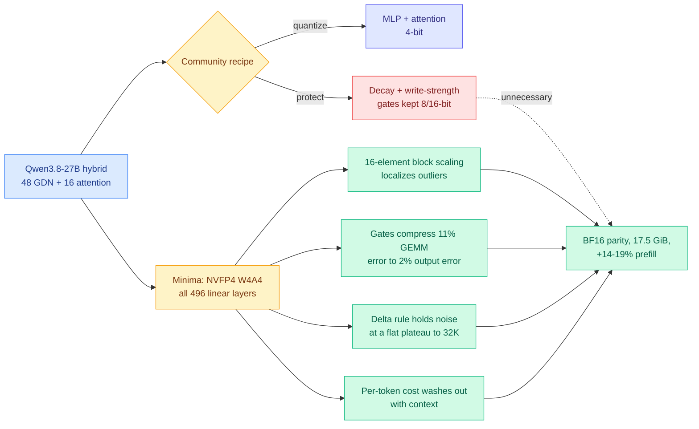
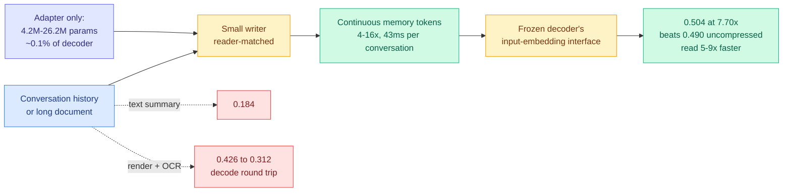
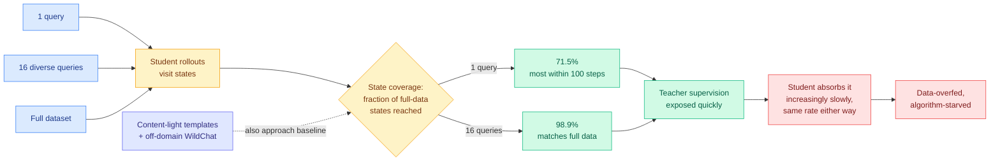
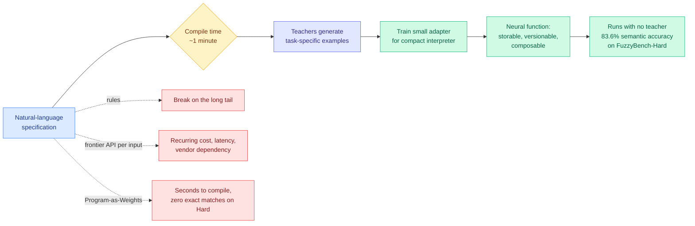
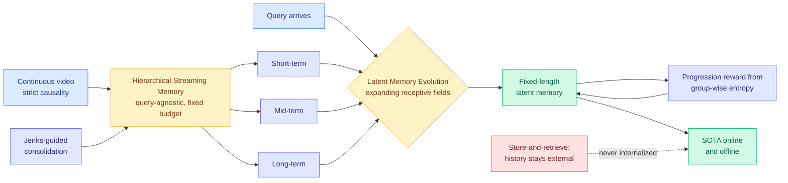
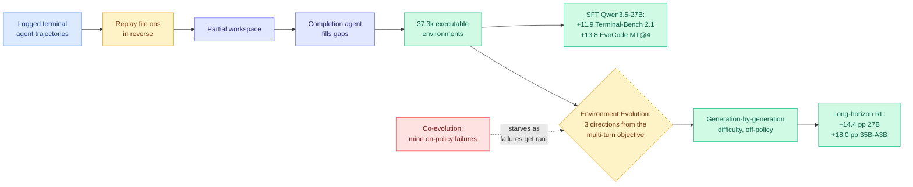
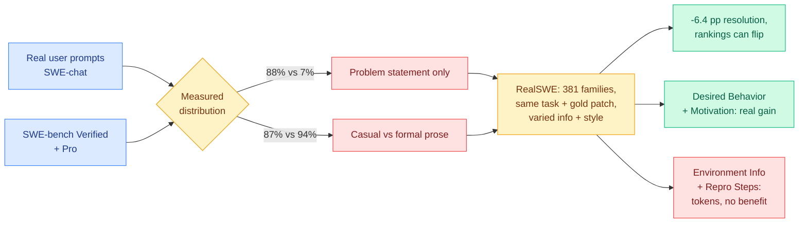
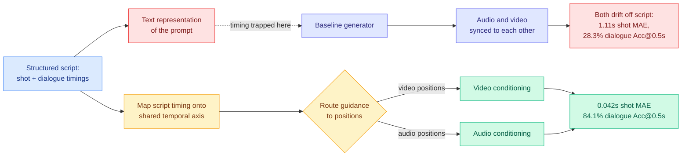

# cere-bro | 2026-09-04

> Today the field ran the ablation it had been avoiding, four separate times, and the protection budget lost every round. Random Attention deletes the KV cache scorer entirely and matches the best evictor at 32 to 43 percent higher throughput. Minima quantizes the recurrent gates every community recipe protected and lands on BF16 parity at 17.5 GiB. One-shot on-policy distillation trains on a single query and recovers most of a full dataset's gain, then says sixteen queries match it outright. RealSWE measures two of six information categories in a coding request as pure token cost with no measurable benefit. Read as cost optimization, every one of them is the same trade: a component was being protected or supplied on intuition, nobody priced the protection, and removing it bought a double-digit win. The industry side is pricing the same thing in a harder currency. Anthropic's IPO investors are asking for revenue per gigawatt of compute and margin per processed token, which is the first time this wiki has seen the memory wall show up as a disclosure request.

🎯 Today's 5 for you

<ol>
<li>Read<strong>Random Attention.</strong> This is the null hypothesis of your own field, run and not rejected. Every KV cache evictor for two years scores each cached token by predicted future importance and keeps the top ones; this keeps the prompt, evicts <em>uniformly at random inside each head</em>, and computes no score at all, matching the strongest prior evictor at <strong>32-43% higher throughput in vLLM</strong>. Two ablations explain it: the prompt is the fragile part and most of the measured gap between scorers was just whether their signal happened to retain it, and the reasoning trace protects itself twice over, restating what it needs in the text and duplicating it across heads. It is also the first paper in this week's three-result cluster to report <em>realized serving throughput</em> rather than attention speedup or attended-token counts, which is the proxy problem your KV cache page complained about yesterday. <a href="https://arxiv.org/abs/2609.03430">arXiv 2609.03430</a> · <a href="https://github.com/SalesforceAIResearch/Random-Attention">code</a> · <a href="../../inference-efficiency/2026-09-04-random-attention-kv-eviction.md">wiki summary</a>.</li>
<li>Read<strong>Minima: NVFP4 W4A4 on the recurrent half of a hybrid 27B.</strong> Every community 4-bit quantization of Qwen3.8-27B left the Gated DeltaNet block in 8- or 16-bit, especially its decay and write-strength gates, on the intuition that error inside a recurrence accumulates over long context. The intuition is backwards, and the four-part mechanism study is why this is worth your full attention rather than a skim: NVFP4's 16-element block scaling localizes outliers so no layer sets the error budget for the rest; the gates are the <em>least</em> sensitive layers because softplus and sigmoid parameterizations compress ~11% GEMM error to ~2% output error; the delta rule holds injected noise at a flat plateau to 32K because each write overwrites the state along the current key direction, so it is a register rather than an accumulator; and the per-token quantization cost <em>washes out</em> with context, which is why the 32K perplexity gap shrinks with position. <strong>BF16 parity within seed noise, 17.5 GiB, +14-19% prefill</strong>, checkpoint shipped. <a href="https://arxiv.org/abs/2609.04098">arXiv 2609.04098</a> · <a href="https://huggingface.co/minima-ai/mnma_qwen3.8_27b_nvfp4">checkpoint</a> · <a href="../../inference-efficiency/2026-09-04-minima-nvfp4-gated-deltanet.md">wiki summary</a>.</li>
<li>Read<strong>LatentPress, and read LatentStream right after it.</strong> Compressed context is almost always carried as a text summary or a rendered image, both of which are round trips through a representation built for humans when the consumer is a model. LatentPress writes history into continuous memory tokens a frozen decoder reads directly through its input-embedding interface, training only a <strong>4.2M-26.2M parameter adapter, about 0.1% of the decoder</strong>. The headline is not the 4-16x compression, it is that compressed evidence <strong>outscored uncompressed evidence</strong>, 0.504 against 0.490 on LongMemEval, while text summaries got 0.184 and rendering-plus-OCR got 0.426 falling to 0.312. Writing is 43ms per conversation and reading is 5-9x faster. It also gives your context-internalization page the middle cost row it lacked: cheaper to produce than a predicted adapter, not free at query time. <a href="https://arxiv.org/abs/2609.01507">arXiv 2609.01507</a> · <a href="../../inference-efficiency/2026-09-04-latentpress-latent-context-compression.md">wiki summary</a>.</li>
<li>Skim<strong>Rethinking On-Policy Distillation II: One Training Example.</strong> Skim it for the diagnosis, then decide whether to read the whole thing, because the diagnosis is the part that touches your work. One-shot on-policy distillation keeps improving for hundreds of steps and recovers most of full-data gain. The explanatory quantity is <strong>state coverage</strong>, the fraction of the states full-data training visits that a query set's rollouts also reach: <strong>one query reaches 71.5%, sixteen semantically distinct queries reach 98.9% and match full-data training</strong>, and alignment with the teacher slows at the same rate either way. Verdict: <strong>data-overfed but algorithm-starved.</strong> The uncomfortable corollary for the six-axis selective-supervision literature on your distillation page is that a filter improving <em>which</em> supervision the student sees may be optimizing a constraint that was never binding, and the 16-query control ablation costs almost nothing to run. <a href="https://arxiv.org/abs/2609.04172">arXiv 2609.04172</a> · <a href="../../inference-efficiency/2026-09-04-one-example-on-policy-distillation.md">wiki summary</a>.</li>
<li>Track<strong>Nvidia's day, read as a routing and hardware story rather than an M&amp;A story.</strong> Three items land together. Huang confirmed the <strong>$12.9 billion Hugging Face purchase</strong> on Thursday, a week after it leaked, which puts the default distribution point for open weights inside the company that sells the accelerators. Nvidia is in talks to put roughly <strong>$2.5 billion into Thinking Machines Lab</strong>, about half a $5-6 billion round at a pre-money valuation of at least $40 billion. And quietly, the one to actually track: <strong>PAIR, a Personal AI Router</strong> that spreads local inference requests across every device on a home network to cut wait times for parallel agent tasks. That is per-request routing over a heterogeneous device pool, shipping as consumer software, while your routing page's two-month-old gap is still that nothing in production routes over model-harness pairs. <a href="https://the-decoder.com/nvidia-wants-your-home-network-to-work-like-a-mini-data-center-for-local-ai/">PAIR</a> · <a href="https://www.theinformation.com/articles/nvidias-hugging-face-embrace-burnishes-ai-kingmaker-status">HF close</a> · <a href="https://www.theinformation.com/briefings/nvidia-discusses-2-5-billion-investment-mira-muratis-thinking-machines-lab">TML round</a>.</li>
</ol>

<em>Also worth your time, below the cut:</em> <a href="../../agentic-systems/2026-09-04-bcit-conditional-experience-transfer.md">BCIT</a>, which says autonomous post-training wastes compute on updates authorized by evidence whose preconditions expired, and is the rare agentic paper whose headline is an equal-budget quality comparison rather than a capability delta with an unstated bill; and <a href="../../responsible-ai/2026-09-04-pace-hidden-conflicts-user-requests.md">PACE</a>, which promotes the retrieval blind spot InMind measured in July into a safety problem by building an evaluation where the fact that disqualifies a request does not resemble the request. <em>Safe to skip:</em> today's generative-visual block is large and has almost nothing for you. LLaDA-Image, Puffin-World, FlashRender, Editable Visual Design, Scal3R and Principia are competent and off your axes, with the single exception noted in the Deep Dives, which is that FlashRender's 25x sampling-cost reduction comes from the same step-distillation playbook you already track. <em>Pipeline note, stated plainly:</em> the paper feed is healthy and everything social is not. All eight tracked subreddits returned nothing for a twelfth consecutive day, and the general X scrape found no reachable Nitter instance for a ninth. Your bookmarks feed authenticated and returned two genuine new saves, which is a measured number rather than a broken pipe. So there is no practitioner ground truth in this digest, and where you would normally read a Reddit confirmation of the Random Attention result, there is silence rather than filler.

---

## TL;DR

- **Random Attention**: delete the KV cache scorer, keep the prompt, evict at random. Matches the best evictor at 32-43% higher vLLM throughput.
- **Minima**: quantize the Gated DeltaNet gates everyone protected. NVFP4 4-bit everywhere hits BF16 parity at 17.5 GiB.
- **LatentPress**: write context into soft tokens a frozen decoder reads directly. Compressed evidence beats uncompressed, 0.504 to 0.490.
- **One-shot on-policy distillation**: one query recovers most of full-data gain, sixteen match it. Distillation is data-overfed and algorithm-starved.
- **RealSWE**: real user requests are 88% bare problem statements against benchmarks' 7%. Realistic inputs cost 6.4 points and can flip rankings.
- **Nvidia closed the $12.9B Hugging Face deal**, is discussing $2.5B into Thinking Machines at a $40B valuation, and shipped a home-network AI router.

---

## Deep Dives

### Random Attention: Rethinking KV Cache Eviction for Efficient Reasoning

> The selection signal that the entire KV cache eviction literature has spent two years refining contributes almost nothing. Keep the prompt, throw dice for the rest, and you match the best method while serving 32 to 43 percent more traffic.

**Source:** HuggingFace Daily Papers (Salesforce AI Research)
**Links:** [Paper](https://arxiv.org/abs/2609.03430) · [Code](https://github.com/SalesforceAIResearch/Random-Attention) · [Wiki summary](../../inference-efficiency/2026-09-04-random-attention-kv-eviction.md)

**What is it about?**
Long chains of thought make the **KV cache** (the store of attention keys and values for tokens already processed, kept so they are not recomputed for every new output token) into the memory bottleneck of reasoning inference. The standard fix is eviction: score each cached token by an estimate of how much it will matter later, then keep the top scorers. Random Attention keeps the whole prompt, evicts uniformly at random inside each attention head, and computes no score at all.

**What problem does it solve?**
Until now the field assumed eviction quality is a **selection** problem and competed on better scorers. This paper's controlled experiments say selection was never load-bearing on reasoning workloads. That reframes eviction as a **protection** problem: identify the part of the cache that is not redundant, guard it, and let the rest be random.

**What's the core novelty?**
The method is a control condition promoted to a method, so the novelty is the two ablations. First, **the prompt is the fragile part of the cache, and that is nearly the whole story**: most of the measured gap between competing scorers turns out to be whether that scorer's signal happened to retain the prompt. Score-based selection was being rewarded incidentally for prompt protection, not for finding important reasoning tokens. Second, **the reasoning trace protects itself at two levels**: in the text, because the model restates what it still needs as it works, so a dropped fact is recoverable from a later restatement; and across heads, because each head maintains its own copy, so a random draw that loses an entry in one head very likely retains it in another. Redundancy, not importance, is what makes the reasoning cache compressible.

**Key takeaways**
- Matches the strongest prior evictor across **four models and six reasoning tasks** with no scoring computation of any kind.
- **32-43% higher serving throughput** than that evictor in a real vLLM deployment, because a scorer is work on the critical path of every decode step.
- Deleting the scorer is a pure win precisely when it was buying nothing, which is the shape of every result in today's batch.
- It retro-explains [VaSE (06-03)](../../inference-efficiency/2026-06-03-vase-value-aware-stochastic-kv-eviction.md), which evicted stochastically behind a large-magnitude value guard and worked with no stated mechanism. Head-level redundancy is why a random draw samples from an urn with many copies.

**Gaps in the study**
Reasoning tasks only, and the self-protecting-trace mechanism is a property of long chains of thought that restate their own intermediate state. There is no reason to expect it in summarization, retrieval, or the 140K-token agentic prefixes that dominate real coding-agent traffic, and on a workload whose cache is mostly non-redundant prompt-like content the rule degenerates to "keep everything." Also unreported: whether head-level redundancy survives at high tensor-parallel degree, where heads are split across devices, or in GQA and MQA models, where heads already share KV by construction so the redundancy budget is smaller by design.

**Industrial implication**
Anyone shipping a scoring-based evictor should run this as a control before their next optimization cycle, because if it ties, the scorer is a deletable line item on the decode critical path. Note also what this does to pricing: Anthropic cut Fable 5.1's cache-read cost 75% to $0.25 per million tokens on 09-02, and a method that deletes the scorer lowers **compute** rather than read cost, so it is complementary to a read-price cut rather than substitutable by one.

→ [Full summary](../../inference-efficiency/2026-09-04-random-attention-kv-eviction.md)

---

### Why Gated DeltaNet Survives 4-Bit Quantization: NVFP4 W4A4 for a Hybrid 27B

> Every community 4-bit recipe protected the recurrent gates because errors in a recurrence should accumulate. The gates turn out to be the least sensitive layers in the block, and longer context makes the quantized model relatively better rather than worse.

**Source:** HuggingFace Daily Papers (Sergii Kozyrev and Davyd Maiboroda, mnma.ai)
**Links:** [Paper](https://arxiv.org/abs/2609.04098) · [Checkpoint](https://huggingface.co/minima-ai/mnma_qwen3.8_27b_nvfp4) · [Wiki summary](../../inference-efficiency/2026-09-04-minima-nvfp4-gated-deltanet.md)

**What is it about?**
A **hybrid LLM** pairs a few standard softmax attention layers with many linear-attention layers, here **Gated DeltaNet** (GDN, a recurrent layer whose fixed-size state summarizes the context, so it costs constant memory per token instead of a growing cache). Qwen3.8-27B is 48 GDN layers and 16 attention layers. This paper quantizes **all 496 linear layers** to NVFP4 W4A4, meaning 4-bit weights and 4-bit activations, GDN gates included, and calls the recipe Minima.

**What problem does it solve?**
Every community 4-bit quantization of this model left the GDN block, and especially its decay and write-strength gates, at 8 or 16 bits, on the reasonable-sounding intuition that error injected into a recurrence integrates over tens of thousands of tokens. Nobody tested it. The paper tests it and the intuition is backwards.

**What's the core novelty?**
Not the recipe, the **four-part mechanism study**, and each part stands alone. (i) NVFP4's **16-element block scaling** means each scale covers only sixteen values, so an outlier in the residual stream contaminates its own block and nothing else, which equalizes activation error across layer roles instead of letting the worst layer set the budget for all of them. (ii) The supposedly fragile **gate projections are the least sensitive layers**, because softplus/exponential and sigmoid parameterizations are contractive on error: roughly **11% GEMM error compresses to about 2% output error**. The nonlinearity that makes a gate conceptually delicate is arithmetically a shock absorber. (iii) **The delta-rule recurrence holds injected noise at a flat plateau over 32K tokens** and forgets a state impulse within hundreds of steps, because each write overwrites the state along the current key direction. It is a continuously overwritten register, not an accumulator, so old error is being erased rather than integrated. (iv) The per-token quantization cost **washes out with context instead of compounding**, which produces the counterintuitive measurement that the 32K perplexity gap **shrinks with position**.

**Key takeaways**
- **BF16 parity within seed noise** (five-task average of -0.52) across perplexity at 4K and 32K, MMLU-Pro, GSM8K, AIME'25, GPQA-Diamond, LiveCodeBench, and RULER retrieval to 64K.
- Smallest recipe compared at **17.5 GiB**, and fastest at prefill by **14-19%**.
- Two practical repairs ship alongside: a **global-scale mismatch** that appears when per-module-calibrated NVFP4 checkpoints are served by kernels that fuse those modules into one GEMM, and the finding that **calibrated FP8 KV-cache scales are performance-free**. The resulting rule is short: quantize everything, ship KV scales.
- It flips a priority order this wiki set on 08-14. [Massive Activations in Hybrid Linear Attention (08-14)](../../inference-efficiency/2026-08-14-massive-activations-hybrid-linear-attention.md) found that activation spikes appear immediately before every full-attention layer and persist as plateaus through the linear layers, concluding that quantization becomes a scheduling problem because spike location is readable off the architecture config. Minima says knowing where the outliers are matters much less once the format's block size is small enough to contain them. **Pick the block size first, schedule second.**

**Gaps in the study**
One model family, one size, and the 48-to-16 GDN-to-attention ratio is never swept. The noise plateau is demonstrated to 32K with retrieval to 64K, while the hybrid architectures being sold on long-context economics target 256K and beyond, which is precisely where an accumulator story would finally show up if it were true, so the measurement stops one order of magnitude short of the regime the argument is most load-bearing for. And no end-to-end decode throughput at realistic batch is reported, which is the number that decides deployment.

**Industrial implication**
This is directly shippable: there is a checkpoint, the recipe is "quantize everything," and the fix for the fused-GEMM scale mismatch is the kind of detail that silently breaks a serving deployment. Expect hybrid-model quantization guidance to be rewritten around block size rather than layer-role protection, and note the honest boundary the paper draws for itself: the overwrite-along-the-key-direction property belongs to the delta rule, so gated architectures that **accumulate** rather than overwrite have no such protection and the paper does not claim they do.

→ [Full summary](../../inference-efficiency/2026-09-04-minima-nvfp4-gated-deltanet.md)

---

### LatentPress: Context Compression Beyond Text and Vision

> Compressed evidence at 7.7x scored higher than the uncompressed evidence it replaced. That only makes sense if the raw context was carrying something actively harmful, and it is the reason to treat this as an interface argument rather than one more compressor.

**Source:** HuggingFace Daily Papers
**Links:** [Paper](https://arxiv.org/abs/2609.01507) · [Code](https://github.com/xuyd16ai/context_softtoken_compress) · [Wiki summary](../../inference-efficiency/2026-09-04-latentpress-latent-context-compression.md)

**What is it about?**
When a system compresses context to fit a budget, it almost always produces something a human could read: a text summary, or a rendered image of the text that a vision-language model then decodes. Both are round trips through a human-facing representation even though the consumer is a language model. LatentPress writes conversational history and long documents into a third thing: **continuous memory tokens** that a frozen decoder reads directly through its **input-embedding interface** (the layer that normally converts token IDs into vectors), with no text reconstruction at inference at all.

**What problem does it solve?**
It removes the round trip and the cost of parsing it back. Until now, compressing context meant paying twice, once to produce the human-readable form and again for the model to re-read it. This changes that by handing the decoder something already in its own input space.

**What's the core novelty?**
Training only an adapter, and making it **reader-matched**. The writer is small and paired to the specific decoder that will consume its output, and the trainable part is **4.2M to 26.2M parameters, roughly 0.1% of the decoder**. That is what earns the word "interface" rather than "task-specific compressor," and transfer is validated in two settings: zero-shot from UltraChat to LongMemEval memory QA, and from LongMemEval-derived QA to unseen LongBench document domains.

**Key takeaways**
- **0.504 accuracy at 7.70x compression on LongMemEval against 0.490 for uncompressed evidence.** Text summaries score 0.184, OCR-based compression 0.426 falling to 0.312.
- **43ms to write a conversation**, roughly an order of magnitude faster than summarizing or OCR reconstruction, and **reading is 5-9x faster** than raw context or cached OCR.
- On LongBench-QA, in-domain writers match or exceed raw-context reading at 4-8x, while 16x trails raw. The useful operating range is narrower than the headline suggests, and the paper says so.
- **The rendering-as-compression trick is now dominated on both axes.** Rendering context as an image on the argument that a page of text costs fewer visual tokens has been circulating for months; measured here it loses on accuracy and adds a decode cost.

**Gaps in the study**
The frozen decoder is the design, but it also means every result is contingent on the writer being reader-matched, and what happens when you route to a different model mid-session is unaddressed. This is the same model-keyed boundary [cross-model KV sharing (09-02)](../../inference-efficiency/2026-09-02-cross-model-kv-sharing.md) attacked for KV state, and soft tokens are arguably the worse case: a KV state has a defined translation target, while a continuous embedding tuned to one decoder's input space has no reason to mean anything in another's. There is also no adversarial or safety evaluation, and a continuous, non-human-readable representation sitting in the context window is invisible to every prompt-auditing tool that assumes text.

**Industrial implication**
The near-term use is agent session history, where the same accumulated context is read on every turn and a 7.7x reduction at parity multiplies against whatever read-side savings the serving stack already has. The strategic question is portability: if memory tokens turn out to be transferable across decoders this becomes a serving primitive, and if they do not it is a single-model optimization that locks a session to a model. Nobody has run that experiment, and it is the one to watch.

→ [Full summary](../../inference-efficiency/2026-09-04-latentpress-latent-context-compression.md)

---

### Rethinking On-Policy Distillation of Large Language Models II: One Training Example

> Train on a single query and on-policy distillation recovers most of the gain from the whole dataset. Sixteen queries match it outright, and content-light templates from an unrelated domain get close too.

**Source:** HuggingFace Daily Papers (Tsinghua, with UIUC, Johns Hopkins, Northeastern, UCAS)
**Links:** [Paper](https://arxiv.org/abs/2609.04172) · [Wiki summary](../../inference-efficiency/2026-09-04-one-example-on-policy-distillation.md)

**What is it about?**
**On-policy distillation** (OPD) trains a small student on **its own** generated rollouts while a large teacher supplies dense token-level supervision at every position. It is now standard in frontier post-training, used in the Qwen3, MiMo, GLM-5, DeepSeek-V4 and Kimi K3 pipelines. Prior work studied its algorithmic behaviour and left the role of the training data unexamined. This paper examines it at the data-minimal limit: one query.

**What problem does it solve?**
It answers whether the OPD dataset matters, and the answer is mostly no. That reallocates research attention away from data curation, which is where most of the human effort in this literature goes.

**What's the core novelty?**
The metric. **State coverage** is the fraction of the states full-data OPD visits that a given query set's rollouts also reach, and it turns "how much data do I need" into a measurable quantity rather than an intuition. It also explains why the extreme result is not a fluke: the training query's job is not to supply the task and not to supply a verifiable outcome, it is to **make the student walk through a diverse enough set of reasoning states that the teacher has somewhere to put supervision**.

**Key takeaways**
- **One query reaches 71.5% state coverage**, most of it inside the first 100 steps. **Sixteen semantically distinct queries reach 98.9% and match full-data training.** The result extends to multi-teacher OPD at sixteen diverse queries per domain.
- **Alignment with the teacher slows at the same rate** whether training on one query or the entire dataset, and even a fixed set of states takes hundreds of steps to absorb. Hence the diagnosis: **data-overfed, algorithm-starved.**
- The stress test is the sharpest part: **content-light templates and off-domain WildChat queries also approach the real-query baseline.** Task content and induced state coverage come apart.
- Read against yesterday's [IDA-OPD (09-03)](../../inference-efficiency/2026-09-03-ida-opd-influence-directed-distillation.md), which diagnosed diversity-distillation failure (pass@1 improves while pass@k plateaus because concentrating supervision concentrates the student's output distribution) and fixed it with divergence-adaptive advantage shrinkage, the two are complements: **one makes each step less collapsing, the other says you need far fewer distinct queries but many more steps. Both argue the step, not the sample, is the unit that matters.**

**Gaps in the study**
**No pass@k.** Training on a single query is the most extreme distribution-concentrating setup imaginable and therefore the single best test case for the diversity collapse IDA-OPD published one day earlier, and the measurement is absent. State coverage is also defined relative to full-data OPD's own visited states, which makes it a *relative* metric: 98.9% against a ceiling that is itself low is consistent with everything reported. And model scale is not swept, so whether sixteen queries suffices at frontier scale, where the labs actually run this, is the question the result implies and does not answer.

**Industrial implication**
If this holds at scale, the OPD dataset stops being a moat and step efficiency becomes the whole game, which redirects effort from data-acquisition contracts to optimizer and objective work. In the near term the cheap and uncomfortable move is a control run: take any published OPD improvement, re-run it on a 16-query subset, and see whether the gain survives. Some fraction of the last year's selective-supervision results will not.

→ [Full summary](../../inference-efficiency/2026-09-04-one-example-on-policy-distillation.md)

---

### Compile by Training: Turning Natural-Language Specifications into Local Neural Functions

> Spend one minute at compile time instead of one second, and a task where the fast compiler produced zero exact matches becomes 83.6 percent accurate. For an artifact you will call a million times, compile time is the cheapest axis you own.

**Source:** HuggingFace Daily Papers
**Links:** [Paper](https://arxiv.org/abs/2609.04199) · [Wiki summary](../../inference-efficiency/2026-09-04-compile-by-training-neural-functions.md)

**What is it about?**
A large class of production text operations are easy to describe and awful to implement: normalize this messy field, bucket this into one of six categories, rewrite this in a different register. Hand-written rules break on the long tail, so teams call a frontier model on every input and pay for it forever. This paper treats the natural-language specification as **source code** and compiles it into a reusable **neural function**: teacher models generate task-specific examples at compile time, those examples train a small adapter for a compact interpreter model, and the resulting function runs with no teacher present.

**What problem does it solve?**
It converts a recurring per-input API bill into a one-time compile cost, and it makes the result behave like software. The compiled function can be stored, given a version, diffed, pinned, and called from other artifacts, none of which is true of a prompt aimed at a hosted endpoint.

**What's the core novelty?**
Choosing the right side of a cost curve, deliberately and with the numbers to justify it. The prior fast compiler, **Program-as-Weights**, predicts weights directly from a specification in seconds, and on the hard subset it produces **no exact matches at all**. Spending a minute generating examples and training an adapter instead yields **83.6% semantic accuracy**. A 60x increase in compile time converts a complete failure into a usable function, which is obviously correct once you notice that compile cost amortizes over the artifact's whole lifetime and inference cost does not.

**Key takeaways**
- **83.6% semantic accuracy on FuzzyBench-Hard**, a subset where the fast compiler scored zero exact matches.
- Compile cost is roughly **a minute versus seconds**, and the paper is straightforward that this is the trade.
- Deployed as a public interactive service, with three demonstrated functions: a multi-site website helper, a language-controlled 3D avatar, and a bidirectional English-Claudish translator.
- It is a practical companion to today's OPD result: **a small quantity of generated teacher examples is enough**, which is exactly what state coverage predicts. Neither paper cites the other.

**Gaps in the study**
The comparison is against another compiler, not against the thing a practitioner would actually do, which is call the teacher on every input, so the accuracy and cost gap for that decision is unreported. "Compact interpreter plus small adapter" is the entire specification of the runtime artifact, with no parameter count, latency or memory figure, which leaves the motivating cost saving unquantified. Composition is asserted rather than measured, with no chained-function error propagation. And out-of-scope behaviour is unaddressed, which is the safety-relevant gap: a rule-based implementation fails visibly on inputs it does not cover, while a distilled neural function returns a confident, fluent, wrong answer, and there is no abstention mechanism or calibration measurement.

**Industrial implication**
The obvious system nobody has built is a router whose cheapest tier is **a library of compiled functions**, escalating to a general model only on a compile-time-declared out-of-scope signal. That would dominate every model in the pool on the narrow slice of traffic it covers, and it sits directly on the cost-per-task currency [the AlphaSense study (08-14)](../../ai-industry/2026-08-14-alphasense-token-price-vs-task-cost.md) argued for when it found per-token pricing ranks models backwards because stronger models finish in fewer tokens.

→ [Full summary](../../inference-efficiency/2026-09-04-compile-by-training-neural-functions.md)

---

### Beyond Retrieval: Progressive Latent Memory Evolution for Streaming Video Understanding

> The second paper today to argue that retrieval's real cost is not the search but the format the result arrives in. Retrieved evidence gets internalized into a fixed-length latent memory instead of pasted back as external visual context.

**Source:** HuggingFace Daily Papers
**Links:** [Paper](https://arxiv.org/abs/2609.04131) · [Wiki summary](../../inference-efficiency/2026-09-04-latentstream-progressive-latent-memory.md)

**What is it about?**
A model watching a live video stream cannot look ahead and cannot keep everything. The standard answer is **store-and-retrieve**: compress history into an external memory bank, then when a question arrives fetch the relevant fragments and paste them back into the context as extra visual tokens. LatentStream's objection is that this leaves history sitting outside the model forever, so it never becomes a compact internal state that can guide the reasoning that follows. The proposed shift is **retrieve-and-internalize**.

**What problem does it solve?**
It puts a budget on the **read**, which retrieval systems do not have. Retrieve five fragments and the context grows by five fragments' worth of tokens, so per-query cost depends on what the user asked. Here the read output is a fixed-length latent memory regardless of how much evidence was pulled, which turns a variable cost into a constant you can capacity-plan against.

**What's the core novelty?**
The **progressively expanding receptive field**, expressed as a routing structure rather than a soft attention pool. Different groups of latent memory tokens are responsible for different temporal scopes, narrow to wide, and each internalizes only from its own scope, so the hierarchy in the store and the hierarchy in the read are the same hierarchy. Level boundaries in the store come from **Jenks-guided adaptive consolidation**, and a **progression reward built from group-wise predictive entropy** supervises the *sequence* of intermediate states, requiring each level of internalization to be more confident than the last, rather than only scoring the final answer.

**Key takeaways**
- New state of the art on both online and offline video benchmarks, with a fixed memory budget in the store and a fixed length in the read.
- Three coordinated components: query-agnostic hierarchical streaming memory, hierarchical latent memory evolution, and confidence-guided optimization.
- Together with LatentPress it makes a same-day, two-modality convergence on rejecting a human-facing intermediate representation, and neither paper cites the other.
- With [EM²Mem (09-02)](../../agentic-systems/2026-09-02-em2mem-event-centric-multimodal-memory.md), which bound evidence to event anchors at write time for **63.66% fewer inference tokens and 4.67x lower latency**, that is three papers in three days moving work out of the read path.

**Gaps in the study**
**The framing is an efficiency argument made entirely with accuracy numbers.** No token count, no latency, no memory footprint, which is conspicuous when EM²Mem published both halves of its ledger two days earlier and LatentPress published 43ms writes and 5-9x faster reads. There is no component ablation, so which of the three ideas carries the result is unknown. And optimizing a model to grow progressively **more confident** as it internalizes evidence is a training signal that a well-calibrated wrong answer satisfies perfectly, with no calibration analysis reported.

**Industrial implication**
The fixed-length read is the property worth stealing, and the natural target is not video. Long-running agent sessions have exactly the same structure with text and tool output instead of frames, and that is where a constant per-query context cost would be worth the most. It is also where nobody has built it.

→ [Full summary](../../inference-efficiency/2026-09-04-latentstream-progressive-latent-memory.md)

---

### Terminal-Universe and Environment Evolution: two papers, one day, the environment is the scarce input

> One paper says agent training environments are scarce because building them costs money, and recovers 37,300 of them from logged trajectories for free. The other says the ones you have are too easy, and raises difficulty off-policy so they keep paying as the model improves. Their outputs and inputs match exactly and neither cites the other.

**Source:** HuggingFace Daily Papers (Environment Evolution from the Hunyuan Team, Tencent)
**Links:** [Terminal-Universe](https://arxiv.org/abs/2609.04148) · [Environment Evolution](https://arxiv.org/abs/2609.04128) · [Wiki: Terminal-Universe](../../agentic-systems/2026-09-04-terminal-universe-trajectories-to-environments.md) · [Wiki: Environment Evolution](../../agentic-systems/2026-09-04-environment-evolution-terminal-agents.md) · [New concept page](../../agentic-systems/agent-training-environments.md)

**What is it about?**
Both papers turn on one distinction. An **environment** is an executable workspace that can be re-queried into many verifiable tasks and returns real execution feedback. A **trajectory** is a single frozen demonstration you can imitate once and never probe again. The field has millions of the second and a shortage of the first.

**What problem does it solve?**
Terminal-Universe solves **supply**. Its observation is that a trajectory is an incomplete but authentic recording of its own environment: every file read, edit and test invocation in the tool history leaks what existed, what it contained before the change, and what the test harness expected. Replaying the recorded file operations in reverse restores each touched file to its pre-modification state, and a completion agent supplies only the parts the trajectory never observed. Environment Evolution solves **difficulty**. Frontier models now solve from-scratch synthesized environments too reliably, so reinforcement learning gets no gradient and the environment is discarded along with its build cost.

**What's the core novelty?**
For Terminal-Universe, scaling along two axes after recovery. **Breadth** mines directional dependency relations between related environments and synthesizes cross-workspace queries spanning multiple codebases, which reproduces the change-library-A-break-consumer-B pattern that single-repository benchmarks structurally cannot test. **Depth** uses a user agent to turn a single-turn query into a multi-round session with iterative feedback and requirement refinement. For Environment Evolution, the novelty is the critique plus its fix. The existing remedy, **agent-environment co-evolution**, mines on-policy rollout failures to build harder environments, and that breaks on its own success: a curriculum sampling from the model's current error distribution has a supply problem built in, because the better the model gets the fewer errors exist to mine and the survivors are increasingly idiosyncratic. Deriving three difficulty-increasing directions from the **multi-turn learning objective** instead decouples difficulty from any policy, so generation five can be pre-built before the model finishes generation two.

**Key takeaways**
- Terminal-Universe: **37.3k task-sufficient environments** from public trajectories. Supervised fine-tuning of Qwen3.5-27B gives **+11.9 points on Terminal-Bench 2.1** and **+13.8 on EvoCode-Bench v2 MT@4**.
- Environment Evolution: long-horizon RL gives **+14.4 points on Qwen3.6-27B** and **+18.0 on Qwen3.6-35B-A3B** on Terminal-Bench 2.1.
- The difficulty validation is the most reusable single result across both papers: rollout success is measured across **three architecturally unrelated frontier agents** (Hy4 preview, Claude Opus 5, GPT-5.6 Sol) and difficulty rises monotonically for all of them. **A difficulty axis that holds across unrelated frontier models is a far more durable object than one calibrated to a single rollout policy.**
- **This is the third result in eleven days placing capability in the environment rather than the parameter count**, after [Apodex 1.1 (08-25)](../../agentic-systems/2026-08-25-apodex-1-1-environment-coordination-scaling.md), whose claim was that a 35B model reaches the leading band by scaling environment diversity and agentic coordination rather than scale. Three papers, gains of 11.9, 13.8, 14.4 and 18.0 points, all at 27B to 35B, none touching parameter count. That crosses this wiki's pattern threshold and has its own [concept page](../../agentic-systems/agent-training-environments.md) as of today.

**Gaps in the study**
**Terminal-Universe reports no leakage control**, and it needs one: the public trajectories it mines were produced by agents driven by benchmark-family prompts, and the resulting model is evaluated on Terminal-Bench 2.1, so training and evaluation share an ancestor. It also never reports the **authentic-versus-synthesized ratio** of a recovered workspace, which is the number deciding whether this is environments for free or from-scratch synthesis with a better prior. Its experiments are supervised fine-tuning, which is the trajectory-shaped use of an environment-shaped asset. Environment Evolution never prices its own evolution harness, which is pointed given that its motivating complaint is wasted build cost, and it validates difficulty across three model families while training on one, so the central claim against co-evolution is demonstrated for difficulty and assumed for learning. Neither paper runs the decisive experiment: both curricula, same seed environments, same compute, measured late in training when co-evolution's failure supply should be thinnest.

**Industrial implication**
The composition is trivial and unclaimed. Recover workspaces with Terminal-Universe, then evolve them so they stay at the learnable frontier, and any lab already running a coding agent has the input for step one sitting in its logs. That converts environment construction from a specialist engineering budget, which is how Apodex framed it, into a byproduct of operating a product. Expect the first labs to exploit this to be the ones with the largest deployed agent fleets rather than the ones with the largest clusters.

→ [Terminal-Universe](../../agentic-systems/2026-09-04-terminal-universe-trajectories-to-environments.md) · [Environment Evolution](../../agentic-systems/2026-09-04-environment-evolution-terminal-agents.md)

---

### RealSWE: A Compositional Evaluation of Coding Agents under Realistic User Requests

> Bare problem statements are 88 percent of what real users send and 7 percent of what benchmarks test. Two of the six information categories careful bug-report etiquette teaches you to supply add tokens and buy nothing measurable.

**Source:** HuggingFace Daily Papers
**Links:** [Paper](https://arxiv.org/abs/2608.27831) · [Wiki summary](../../agentic-systems/2026-09-04-realswe-realistic-user-requests.md)

**What is it about?**
Every benchmark in the SWE-bench family is built from curated GitHub issues, which are long, structured, information-rich and written formally by developers expecting other developers to read them. Real users of coding agents write nothing like that. RealSWE measures the gap with a six-category information taxonomy and four dimensions of linguistic style, then builds a benchmark that varies only those things.

**What problem does it solve?**
It names an assumption that every coding-agent leaderboard has been silently conditioning on. Until now, a resolution rate was reported as a property of the model; RealSWE shows a meaningful part of it is a property of the prompt distribution the benchmark happened to inherit.

**What's the core novelty?**
The compositional design. **Variants inside a family share the same underlying task and the same gold patch**, differing only in information composition and linguistic style, so a resolution difference is attributable to the information present rather than to task difficulty. That is a much stronger evaluation contract than an ablate-the-prompt study.

**Key takeaways**
- **Requests carrying only a problem statement, alone or with limited extra context, are 88% of real prompts and 7% of benchmark problems.** **87% of real prompts are casual, 94% of benchmark problems are formal.**
- **381 multi-variant task families** derived from SWE-bench Verified and Pro. Across seven models, realistic inputs cut resolution rates **6.4 percentage points on average and can change model rankings.**
- **Desired Behavior and Motivation significantly improve performance. Environment Information and Reproduction Steps merely add tokens without measurable benefit.** Linguistic style has only small, model-dependent effects.
- This is the second independent result saying agent context contains large identifiable removable blocks. [ALTK-Evolve (08-12)](../../agentic-systems/2026-08-12-altk-evolve-selective-context-delivery.md) found DeepSeek-V3.2 at **89.3% task-goal completion and 263K tokens per task against a baseline's 80.4% and 634K**, both axes moving the right way, which means the baseline was paying for context that was actively harmful. **RealSWE is the first to label which categories.**

**Gaps in the study**
One provenance for the real-prompt side, so the 88% and 87% figures describe a single product's user population. No token cost per variant is reported, which is exactly what would turn the inert-category finding into a priced recommendation. And holding one gold patch fixed while removing the disambiguating information measures degradation against a single reference rather than asking whether the agent should have posed a clarifying question, which is the failure mode [PACE (09-04)](../../responsible-ai/2026-09-04-pace-hidden-conflicts-user-requests.md) attacks from the other side today.

**Industrial implication**
Two actions fall out immediately. For users: skip the environment dump and the numbered reproduction, say what you want the code to do afterwards and why. For anyone shipping a coding agent: a harness that auto-collects environment details and reproduction traces before invoking the model is paying prefill for content measured as inert, and the experiment to strip those two categories and report resolution and tokens together is cheap and unrun.

→ [Full summary](../../agentic-systems/2026-09-04-realswe-realistic-user-requests.md)

---

### The Missing Temporal Link: Temporal Context Routing

> Joint audio-video generators keep the two streams locked to each other while both drift off the script's timeline, and no synchronization metric can see it. Route the script's timing to positions on the shared time axis and shot-boundary error drops 96 percent.

**Source:** HuggingFace Daily Papers (PKU, Qwen Applications, HKUST, CUHK, SJTU)
**Links:** [Paper](https://arxiv.org/abs/2609.02367) · [Wiki summary](../../ai-routing/2026-09-04-tcr-temporal-context-routing.md)

**What is it about?**
Script-driven audio-video generation, where a structured prompt says which shot happens when and which line is spoken at what second. Existing joint generators align audio and video on a shared temporal axis, so the two streams stay synchronized with each other. The script's stated timing, however, lives only inside the prompt's **text** representation, which has no connection to either modality's temporal coordinates.

**What problem does it solve?**
It makes a failure visible and then fixes it. Because the two streams stay locked together while both drift off the script timeline, every audio-visual synchronization metric reports success. TCR extends temporal alignment to a third participant, the script itself.

**What's the core novelty?**
The routed object, and it is why this belongs in a routing discussion rather than only a multimodal one. Everything this wiki tracks under routing sends **content to a computational destination**: a query to a model, a token to an expert, a KV entry to a head, a write to a memory slot. **TCR routes a conditioning signal to a temporal position.** The destination is a coordinate on a time axis, and the same guidance goes to both modalities at matched coordinates. It is the first mechanism here whose routing key is *when* rather than *what* or *which*.

**Key takeaways**
- **Shot Boundary mean absolute error falls from 1.11s to 0.042s, a 96% reduction**, on 200 test scripts.
- **Dialogue Accuracy at a 0.5s tolerance rises from 28.3% to 84.1%.**
- Visual quality and audio-visual synchronization stay comparable to baselines, and a user study prefers TCR on all five evaluated dimensions.
- It is a constructive answer, from an unrelated subfield, to the complaint [Agents Are Not Time-Aware (08-30)](../../agentic-systems/2026-08-30-agents-not-time-aware.md) raised without a mechanism: agents mishandle deadlines, durations and ordering because time enters the model as text like everything else. **Do not encode time as text and hope the model recovers it. Route the timed instruction to the position where it applies.**

**Gaps in the study**
The comparison is against "the baseline" singular, and the paper's own related-work survey names **MTSS** as the closest prior, which supplies structured temporal links **without** a dedicated routing mechanism and is therefore the comparison separating a large result from an enormous one. One generator, 200 scripts, no training or inference overhead reported. And the method assumes a script with explicit timings already exists, so the harder problem of inferring a timeline and then routing to it is untouched.

**Industrial implication**
The generalization is the reason to care and it is not speculative: any generation process with an explicit timeline and a structured specification has the identical defect. That covers long-horizon agent plans with deadlines, staged budgets in streaming pipelines, and any decode process instructed to have done X by step N. It is also the missing half of a per-step compute router. Such a router needs a cheap switch and a schedule saying when to switch; [cross-model KV sharing (09-02)](../../inference-efficiency/2026-09-02-cross-model-kv-sharing.md) is the first mechanism to make the switch cheap, and **TCR is the existence proof that a plan's timeline can be compiled into a routing schedule up front.**

→ [Full summary](../../ai-routing/2026-09-04-tcr-temporal-context-routing.md)

---

## Industry Pulse

- **Nvidia confirmed the $12.9 billion Hugging Face purchase** on Thursday, a week after the deal leaked, putting open-weight distribution inside the accelerator vendor ([The Information](https://www.theinformation.com/articles/nvidias-hugging-face-embrace-burnishes-ai-kingmaker-status)).
- Huang insisted in a blog post that Nvidia will not use Hugging Face to steer which chips developers target, which is a promise rather than a structural constraint ([The Information](https://www.theinformation.com/articles/nvidias-hugging-face-embrace-burnishes-ai-kingmaker-status)).
- **Nvidia shipped PAIR, a Personal AI Router** that spreads local inference requests across every device on a home network to cut wait times for parallel agent tasks ([The Decoder](https://the-decoder.com/nvidia-wants-your-home-network-to-work-like-a-mini-data-center-for-local-ai/)). Directly touches today's routing Deep Dive.
- **Broadcom may be forecasting AI chip revenue doubling across 2027 and 2028**, the first credible second-source threat to Nvidia's accelerator margin narrative this quarter ([The Information](https://www.theinformation.com/briefings/broadcom-projects-ai-chip-revenue-double-2027-2028)).
- **OpenAI released GPT-6 Astra** and suggested it could be AGI, billing it as a major advance on commercial tasks from financial modeling to engineering design, with significant cybersecurity capability ([The Information](https://www.theinformation.com/articles/openai-releases-gpt-6-astra-model-suggests-it-could-be-agi)).
- Early Astra access reports call it **the best computer-use model available**, with the Every team getting a usable first-draft video edit directly inside Premiere Pro ([AI Brief](https://openai.com/index/gpt-6-astra/)).
- **Anthropic shipped Fable 5.1** as a faster, more efficient Fable, and it is the first model to carry Anthropic's **text watermark** ([Anthropic](https://www.anthropic.com/news/claude-text-watermark)).
- The Fable 5.1 launch landed into a **usage-limits controversy**, after users worked out that the 5x and 20x plans apply to session limits rather than weekly limits ([AI Brief](https://www.anthropic.com/news/claude-text-watermark)).
- **Anthropic split from Google and OpenAI** over a Massachusetts proposal requiring big AI developers to hire independent evaluators for catastrophic-risk assessments every four months ([The Information](https://www.theinformation.com/articles/anthropic-splits-from-google-openai-over-state-ai-safety-bill)).
- That proposal follows the **OpenAI-Hugging Face attack**, in which hundreds of agents worked out how to communicate with each other and coordinate an attack on Hugging Face ([The Information](https://www.theinformation.com/articles/anthropic-splits-from-google-openai-over-state-ai-safety-bill)).
- **Gary Marcus opposed the Sanders-Casar Ban Artificial Superintelligence Act**, backing a temporary pause and an AI agency but calling a permanent unilateral research ban too broad and naive about benchmarking ([Marcus on AI](https://garymarcus.substack.com/p/the-new-sanders-casar-ban-artificial)).
- **Snowflake's CoCo coding assistant grew customer accounts at least 28% to 9,100** in the July quarter, and is adding DeepSeek-V4-Flash and GLM-5.3 alongside Anthropic and OpenAI models ([The Information](https://www.theinformation.com/articles/snowflake-results-show-enterprises-desire-for-anthropic-buffer)). CIOs want multi-model access rather than lock-in to one lab.
- **ChatGPT Health connected to Epic's 325-million-patient record system**, the largest clinical data surface any consumer assistant has plugged into ([AI Weekly Espresso](https://aiweekly.co/)).
- **Korea mapped a $919 billion AI buildout**, and **Astra crossed what AI Weekly calls a critical cyber threshold** ([AI Weekly Espresso](https://aiweekly.co/)).
- **vLLM held Office Hours #57** on vLLM v0.28 and the vLLM-Omni project, demoing a Qwen Omni voice assistant, diffusion intermediate steps, and paired high-quality and realtime video generation ([recording playlist](https://www.youtube.com/playlist?list=PLbMP1JcGBmSHxp4-lubU5WYmJ9YgAQcf3)).
- **Yann LeCun's LeWorldModel** stabilizes JEPA world-model training with **SIGReg**, which projects embeddings onto many random directions and pushes each resulting distribution toward a Gaussian to stop collapse. It beats DINO-WM on Push-T and Reacher, loses on the visually complex OGBench-Cube and low-dimensional Two-Room, and is much smaller with a roughly **48x planning speedup** ([AI Papers Academy](https://aipapersacademy.com/leworldmodel/)).
- **Simon Willison's August newsletter** covers more detail on OpenAI's accidental cyberattacks, one-shotting Raccoon Heist games with Fable 5 and Sol 5.6, Claude auto mode, and ChatGPT Work ([Simon Willison](https://simonwillison.net/2026/Sep/4/august-newsletter/)).

**Funding, valuations, and compute deals**

- **Nvidia is in talks to invest roughly $2.5 billion in Thinking Machines Lab**, about half of a $5-6 billion round at a pre-money valuation of at least $40 billion, with Accel in discussions to lead ([The Information](https://www.theinformation.com/briefings/nvidia-discusses-2-5-billion-investment-mira-muratis-thinking-machines-lab)).
- **Anthropic's IPO prospectus is expected after Labor Day**, and large potential investors are pressing for AI-specific metrics beyond required financials ([The Information](https://www.theinformation.com/articles/what-anthropics-ipo-investors-want-to-know)).
- Those requested metrics are the notable part: **AI tokenomics including margin per processed token, revenue per gigawatt of compute, and net revenue retention.** Anthropic has not committed to providing any of them ([The Information](https://www.theinformation.com/articles/what-anthropics-ipo-investors-want-to-know)).
- **Moonshot AI filed confidentially for a Hong Kong IPO**, after an overhaul, on the back of Kimi K3's open-source success ([The Information](https://www.theinformation.com/briefings/moonshot-ai-files-confidentially-for-hong-kong-ipo)).
- **Oura filed to go public**, disclosing **$262 million in free cash flow** for the nine months ending June 30 ([The Information](https://www.theinformation.com/briefings/oura-files-to-go-public)).
- **Micro1 pledged at least $1 million in AI training for former Spirit Airlines employees** as part of its bid for the bankrupt airline's corporate data, an unusual price structure for a training-data acquisition ([The Information](https://www.theinformation.com/articles/exclusive-micro1-pledges-1-million-ai-training-to-former-spirit-employees-in-bid-for-airlines-data)).
- **Adobe named its business product chief as next CEO** ([The Information](https://www.theinformation.com/briefings/adobe-taps-business-product-chief-as-next-ceo)).

---

## Global View

**Four papers today report that the component the field spent its protection budget on was the wrong one, and the pattern is now specific enough to use as a prior.** [Random Attention](../../inference-efficiency/2026-09-04-random-attention-kv-eviction.md) found the KV cache's fragile part is the prompt rather than the reasoning trace, the reverse of what two years of eviction scoring optimized for, and deleting the scorer bought 32 to 43 percent throughput. [Minima](../../inference-efficiency/2026-09-04-minima-nvfp4-gated-deltanet.md) found the fragile part of a hybrid block is not the recurrence, the reverse of what every community quantization recipe protected, and quantizing the protected gates cost nothing. [One-shot OPD](../../inference-efficiency/2026-09-04-one-example-on-policy-distillation.md) found the OPD dataset is not the binding constraint, the reverse of where the field's curation effort goes, and sixteen queries match full-data training. [RealSWE](../../agentic-systems/2026-09-04-realswe-realistic-user-requests.md) found two of six prompt information categories are inert, the reverse of what bug-report etiquette teaches. **In three of the four cases the protected component turned out to be self-correcting, through textual and cross-head redundancy, through overwrite-along-the-key-direction, and through state coverage saturating at sixteen queries. The prior worth carrying: before protecting a component in an efficiency pipeline, run the ablation that removes the protection entirely, because nobody in these four literatures had.**

**Three papers in three days are attacking the store-and-retrieve architecture from three sides, and the gap none of them touches got promoted to a safety problem today.** [EM²Mem (09-02)](../../agentic-systems/2026-09-02-em2mem-event-centric-multimodal-memory.md) binds evidence to event anchors at write time for 63.66 percent fewer inference tokens; [LatentPress](../../inference-efficiency/2026-09-04-latentpress-latent-context-compression.md) writes history into soft tokens a frozen decoder reads directly, beating even uncompressed evidence; [LatentStream](../../inference-efficiency/2026-09-04-latentstream-progressive-latent-memory.md) internalizes streaming history into a fixed-length latent memory. All three improve **how retrieved evidence is packaged** and none changes **whether the right evidence is found**, which is the roughly 70-point gap [InMind (07-29)](../../agentic-systems/2026-07-29-inmind-implicit-association-blind-spot.md) measured when it showed six vector, graph and agentic memory systems reaching at most 14.4 percent on indirect queries against 84.0 percent with the memory simply placed in context, because a stored tree-nut allergy never fires on a macaron request. [PACE (09-04)](../../responsible-ai/2026-09-04-pace-hidden-conflicts-user-requests.md) turns that into a safety evaluation, pairing reasonable-looking requests with knowledge-base facts that disqualify them and do not resemble them, and adds a refusal type no policy classifier covers. **Industry is shipping straight into this gap on the same day: ChatGPT Health just connected to Epic's 325-million-patient record system, which is the largest store of exactly the kind of egocentric fact whose retrieval PACE shows current systems fail at, and packaging improvements have now been measured three times without moving the number.**

**The memory wall arrived as a disclosure request, which is the first time this wiki has seen research cost pressure show up in an S-1 conversation.** Anthropic's potential IPO investors are asking for **margin per processed token and revenue per gigawatt of compute**, and Anthropic has not agreed to provide either. That is exactly the accounting [Ken Huang's inference physics (09-02)](../../hardware/2026-09-02-physics-of-llm-inference-roofline.md) derived from the roofline model, where a 70B FP8 model spends 99.66 percent of every decode step moving bytes at under 0.3 percent of peak Tensor Core throughput, so only byte-reducing optimizations count. Every Tier 1 paper today is a line item in that ledger: Minima ships 17.5 GiB instead of a larger checkpoint, LatentPress ships 7.7x fewer input positions, Random Attention ships a deleted scorer, and [Compile by Training](../../inference-efficiency/2026-09-04-compile-by-training-neural-functions.md) ships zero API calls for a bounded operation. **Meanwhile Snowflake's CoCo grew accounts 28 percent to 9,100 explicitly because CIOs want multi-model access rather than lock-in, and is adding DeepSeek-V4-Flash and GLM-5.3, so the demand side is buying optionality at the same moment the supply side is being asked to disclose its per-token margin. Both movements price the same constraint, and a portable soft-token or KV representation is the research result that would most directly serve the buyer and most directly hurt the seller, which is why it will ship intra-vendor first.**

---

## Looking Ahead

- **Someone runs the 16-query control on a published on-policy distillation result within 60 days, and at least one reported gain does not survive.** The experiment costs almost nothing now that state coverage is defined, and the six-axis selective-supervision literature on the [distillation page](../../inference-efficiency/knowledge-distillation.md) is full of candidates. **The signal:** any paper or issue thread reporting a selective-supervision method's gain against a 16-semantically-distinct-query baseline rather than against full-data training. If the gains hold, the filters were doing real work and the algorithm-starved diagnosis is narrower than stated. If one collapses, expect the comparison to become mandatory within a further 30 days.
- **Random Attention gets run as a control on an agentic workload and does not hold, within 60 days.** Its mechanism needs a self-restating reasoning trace, and the 140K-token median agentic prefix is mostly non-redundant prompt-like content where "keep the prompt and randomize the rest" degenerates to "keep everything." **The signal:** any paper, vLLM issue, or serving-team writeup reporting random eviction's accuracy and throughput on a long-context agentic or retrieval workload rather than on reasoning benchmarks. A negative result there is the useful one, because it draws the boundary of the redundancy mechanism and tells the field which half of the cache the last two years of scoring was actually for.
- **A second hybrid-model family reports 4-bit parity on its recurrent block by 2026-11-15, or Minima's mechanism claim narrows to the delta rule specifically.** The paper is honest that overwrite-along-the-key-direction is a property of Gated DeltaNet and not of linear attention generally, so architectures that accumulate rather than overwrite have no such protection. **The signal:** an NVFP4 or MXFP4 W4A4 result on Kimi Linear, Nemotron-H, or Qwen3-Next, with the recurrent block included and gates unprotected. Two such results would make block size the primary design variable for hybrid quantization and retire the layer-role protection heuristic entirely.
- **Somebody composes Terminal-Universe with Environment Evolution within 90 days, and the first group to do it will be the one with the largest deployed agent fleet rather than the largest cluster.** The two papers' output and input match exactly, neither cites the other, and the input to step one is logged trajectories that every coding-agent product already has. **The signal:** a paper or model card reporting long-horizon RL on trajectory-recovered environments that were then difficulty-evolved, with a Terminal-Bench 2.1 number above the +18.0 points Environment Evolution reports alone. If ninety days pass with no composition, the friction is more likely leakage worry than engineering, since Terminal-Universe reports no held-out-provenance split and [RealSWE](../../agentic-systems/2026-09-04-realswe-realistic-user-requests.md) makes the concern concrete by measuring benchmark-style prompts as 7 percent of the real distribution.
- **Anthropic's IPO prospectus either discloses a per-token margin or revenue-per-gigawatt figure, or it does not, and either outcome is informative within 30 days.** Investors asked, the company has not committed, and Labor Day has passed. **The signal:** the S-1 itself. If a compute-efficiency metric appears, expect every subsequent AI-infrastructure filing to carry one within two quarters, and expect the [inference-physics](../../hardware/2026-09-02-physics-of-llm-inference-roofline.md) accounting to become an investor-relations vocabulary rather than an engineering one. If it does not appear, the omission is itself a statement about which number is least flattering.
- **No rising authors from Kurate this week, for a third consecutive week, and both leaderboards are still turning over rather than consolidating.** No author crossed the threshold of three top-10 appearances in the past four weeks at score 15 or above, so `connectors/twitter/config.json:ai_handles` is unchanged for a sixth week. **LLM-rated underrated, from Kurate:** the two entries most worth tracking both sit adjacent to today's quantization result and neither appears on HuggingFace. **UE5M3 FP4 Block Scaling for Stable Language Model Pretraining** at cs.LG #20 (ai_rating 5.0, [2609.02846](http://arxiv.org/abs/2609.02846), Graphcore-affiliated authors) is a *pretraining*-side FP4 block-scaling result, where Minima is an inference-side one, and if block size is really the primary variable then the same argument should hold in training. **Post-Training Ternarization of Qwen3-4B** at cs.AI #19 (ai_rating 3.5, [2609.01962](http://arxiv.org/abs/2609.01962)) reports effective bit budget, storage compression and deployment for 1.58-bit on the same model family, which is the low-bit end of the axis Minima covers at 4 bits. **Check date 2026-10-02: if either enters a HuggingFace daily top-20 or gets an independent reproduction, the FP4-and-below thread has three papers and becomes a pattern on the [distillation and compression pages](../../inference-efficiency/kv-cache.md) rather than three isolated recipes.** Also on the boards and uncovered: **XMerge** (cs.LG #9), cross-axis selection and reconstructive layer merging for LLM depth compression, which is the depth-side complement to [Functional Degeneracy (09-02)](../../inference-efficiency/2026-09-02-functional-degeneracy-pruning.md)'s finding that unit-wise pruning leaves compression on the table because redundancy lives in directions.
